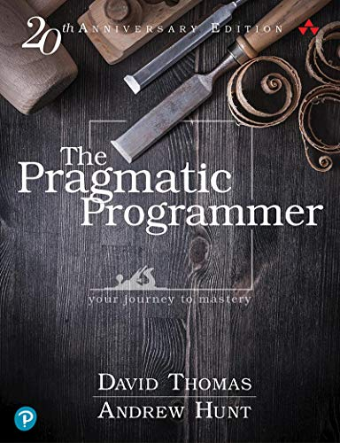
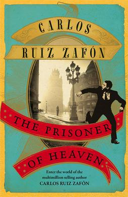

<h1 align="center">
        📖  
      Book Sentences
</h1>

      <b>A collection of sentences from different books.</b>

 

## Description

This project is a collection of my favorite sentences from the books I read. These are not to be taken as summaries from the books, just some random sentences from here and there. 

It all started some years ago with a Google Keep note and when I reached the characters limit I moved to a Google Doc. Then, while reading the Pragmatic Programmer I thought this project could be a better way to keep them and share them.

## List of Books

Here is the list of the books I picked up sentences from

| Year I read it | Cover | Name | Author/s | Publication Year |
|----------------|-------|------|----------|------------------|
| 2020 | |[The Pragmatic Programmer](./the-pragmatic-programmer)|Andy Hunt and Dave Thomas | 2019|
| 2017 | | [The Prisoner of Heaven](./the-prisoner-of-heaven)| Carlos Ruiz Zafón | 2011|
| 2017 | | [The Angel's Game](./the-angels-game)| Carlos Ruiz Zafón | 2008|
| 2016 | | [The Shadow of the Wind](./the-shadow-of-the-wind)| Carlos Ruiz Zafón | 2001|
## More information

**What are those `... ...` ??**

While reading the Pragmatic Programmer I realized that sometimes some words or part of the sentence were not relevant to me, so I skipped that part to continue after.

I implemented my own guidelines while reading it and added some indications at the beginning in case someone else picks up the book in the future, to understand what are those marks throughout it.

    

Here is an example of a random page.

    

**Why not underline them?**

I didn't want to underline the sentences because I wanted the marks to interfere and distract the least in the text.
      
**Then why you added the Spanish translations?**

There are [a ton of researches and articles](https://www.google.com/search?q=Writing+by+hand+to+retain+information&oq=Writing+by+hand+to+retain+information) that show that writing by hand improves your memory and helps to retain information. I believe I will remember the translations more effectively by doing so.
