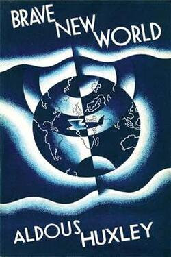

# Brave New World

Aldous Huxley - 1932

## Table of Contents

- [Table of Contents](#table-of-contents)
- [eForeword](#eforeword)
- [Chapter 1](#chapter-1)
- [Chapter 2](#chapter-2)
- [Chapter 3](#chapter-3)
- [Chapter 4](#chapter-4)
  - [Part 1](#part-1)
  - [Part 2](#part-2)
- [Chapter 5](#chapter-5)
  - [Part 1](#part-1-1)
  - [Part 2](#part-2-1)
- [Chapter 6](#chapter-6)
  - [Part 1](#part-1-2)
  - [Part 2](#part-2-2)
  - [Part 3](#part-3)
- [Chapter 7](#chapter-7)
- [Chapter 8](#chapter-8)
- [Chapter 9](#chapter-9)
- [Chapter 10](#chapter-10)
- [Chapter 11](#chapter-11)
- [Chapter 12](#chapter-12)
- [Chapter 13](#chapter-13)
- [Chapter 14](#chapter-14)
- [Chapter 15](#chapter-15)
- [Chapter 16](#chapter-16)
- [Chapter 17](#chapter-17)
- [Chapter 18](#chapter-18)

## eForeword

> Utopias seem to be much more attainable than one would have believed in other times. And we currently find ourselves faced with a different kind of agonizing question: How can one avoid their definitive attainment? … Utopias are attainable. Life leads us toward utopias. Perhaps a new century will begin, a century in which the intellectuals and the cultivated classes will dream again of ways to avoid utopias and to return to a non-utopian society, one less “perfect” and more free.
> —Nicolas Berdiaeff

## Chapter 1

The eggs which it contained were inspected for abnormalities, counted and transferred to a porous receptacle; how (and he now took them to watch the operation) this receptacle was immersed in a warm bouillon containing free-swimming spermatozoa—at a minimum concentration of one hundred thousand per cubic centimetre.

Alphas and Betas remained until definitely bottled; while the Gammas, Deltas and Epsilons were brought out again, after only thirty-six hours, to undergo Bokanovsky’s Process.

One egg, one embryo, one adult—normality. But a bokanovskified egg will bud, will proliferate, will divide. From eight to ninety-six... ...into a full-sized adult. Making ninety-six human beings grow where only one grew before. Progress.

"If we could bokanovskify indefinitely the whole problem would be solved.”... ...The principle of mass production at last applied to biology.

In exceptional cases we can make one ovary yield us over fifteen thousand adult individuals.

“For of course,” said Mr. Foster, “in the vast majority of cases, fertility is merely a nuisance."

Freemartins—structurally quite normal (except,” he had to admit, “that they _do_ have the slightest tendency to grow beards), but sterile. Guaranteed sterile. Which brings us at last,” continued Mr. Foster, “out of the realm of mere slavish imitation of nature into the much more interesting world of human invention.”

If the physical development could be speeded up till it was as quick, say, as a cow’s, what an enormous saving to the Community!

Pilkington, at Mombasa, had produced individuals who were sexually mature at four and full-grown at six and a half. A scientific triumph. But socially useless. Six-year-old men and women were too stupid to do even Epsilon work. And the process was an all-or-nothing one; either you failed to modify at all, or else you modified the whole way. They were still trying to find the ideal compromise between adults of twenty and adults of six. So far without success.

“And that,” put in the Director sententiously, “that is the secret of happiness and virtue—liking what you’ve got to do. All conditioning aims at that: making people like their un-escapable social destiny.”

## Chapter 2

The children started, screamed; their faces were distorted with terror. “And now,” the Director shouted (for the noise was deafening), “now we proceed to rub in the lesson with a mild electric shock.”

What man has joined, nature is powerless to put asunder.

“They’ll grow up with what the psychologists used to call an ‘instinctive’ hatred of books and flowers. Reflexes unalterably conditioned. They’ll be safe from books and botany all their lives.”

If the children were made to scream at the sight of a rose, that was on grounds of high economic policy. Not so very long ago (a century or thereabouts), Gammas, Deltas, even Epsilons, had been conditioned to like flowers—flowers in particular and wild nature in general. The idea was to make them want to be going out into the country at every available opportunity, and so compel them to consume transport. “And didn’t they consume transport?” asked the student. “Quite a lot,” the D.H.C. replied. “But nothing else.” Primroses and landscapes, he pointed out, have one grave defect: they are gratuitous. A love of nature keeps no factories busy. It was decided to abolish the love of nature, at any rate among the lower classes; to abolish the love of nature, but not the tendency to consume transport. For of course it was essential that they should keep on going to the country, even though they hated it. The problem was to find an economically sounder reason for consuming transport than a mere affection for primroses and landscapes. It was duly found. “We condition the masses to hate the country,” concluded the Director. “But simultaneously we condition them to love all country sports. At the same time, we see to it that all country sports shall entail the use of elaborate apparatus. So that they consume manufactured articles as well as transport.

“Human beings used to be …” he hesitated; the blood rushed to his cheeks. “Well they used to be viviparous.” “Quite right.” The Director nodded approvingly. “And when the babies were decanted …” “‘Born,’” came the correction. “Well, then they were the parents—I mean, not the babies, of course; the other ones.” The poor boy was overwhelmed with confusion.

For that there must be words, but words without reason. In brief, hypnopædia. “The greatest moralizing and socializing force of all time.”... ...Not so much like drops of water, though water, it is true, can wear holes in the hardest granite; rather, drops of liquid sealing-wax, drops that adhere, incrust, incorporate themselves with what they fall on, till finally the rock is all one scarlet blob. “Till at last the child’s mind is these suggestions, and the sum of the suggestions is the child’s mind. And not the child’s mind only. The adult’s mind too—all his life long. The mind that judges and desires and decides—made up of these suggestions. But all these suggestions are _our_ suggestions!”... ...“Suggestions from the State.”

## Chapter 3

“strange to think that... ...most games were played without more apparatus than a ball or two and a few sticks and perhaps a bit of netting. Imagine the folly of allowing people to play elaborate games which do nothing whatever to increase consumption. It’s madness. Nowadays the Controllers won’t approve of any new game unless it can be shown that it requires at least as much apparatus as the most complicated of existing games.”

History is bunk. History,” he repeated slowly, “is bunk.”

Those who feel themselves despised do well to look despising.

“Try to realize what it was like to have a viviparous mother.”

whenever he spoke of psychological matters—Our Freud had been the first to reveal the appalling dangers of family life. The world was full of fathers—was therefore full of misery; full of mothers—therefore of every kind of perversion from sadism to chastity; full of brothers, sisters, uncles, aunts—full of madness and suicide. “And yet, among the savages of Samoa, in certain islands off the coast of New Guinea …” The tropical sunshine lay like warm honey on the naked bodies of children tumbling promiscuously among the hibiscus blossoms. Home was in any one of twenty palm-thatched houses. In the Trobriands conception was the work of ancestral ghosts; nobody had ever heard of a father. “Extremes,” said the Controller, “meet. For the good reason that they were made to meet.”

“But every one belongs to every one else,” he concluded, citing the hypnopædic proverb. The students nodded, emphatically agreeing with a statement which upwards of sixty-two thousand repetitions in the dark had made them accept, not merely as true, but as axiomatic, self-evident, utterly indisputable.

Mother, monogamy, romance. High spurts the fountain; fierce and foamy the wild jet. The urge has but a single outlet. My love, my baby. No wonder these poor pre-moderns were mad and wicked and miserable. Their world didn’t allow them to take things easily, didn’t allow them to be sane, virtuous, happy. What with mothers and lovers, what with the prohibitions they were not conditioned to obey, what with the temptations and the lonely remorses, what with all the diseases and the endless isolating pain, what with the uncertainties and the poverty—they were forced to feel strongly. And feeling strongly (and strongly, what was more, in solitude, in hopelessly individual isolation), how could they be stable?

"stability. No civilization without social stability. No social stability without individual stability.”

“Stability,” insisted the Controller, “stability. The primal and the ultimate need. Stability. Hence all this.”

“Take Ectogenesis. Pfitzner and Kawaguchi had got the whole technique worked out. But would the Governments look at it? No. There was something called Christianity. Women were forced to go on being viviparous.”

“Or the Caste System. Constantly proposed, constantly rejected. There was something called democracy. As though men were more than physico-chemically equal.”

“Government’s an affair of sitting, not hitting. You rule with the brains and the buttocks, never with the fists. For example, there was the conscription of consumption.”

"Ending is better than mending. The more stitches, the less riches"

“Back to culture. Yes, actually to culture. You can’t consume much if you sit still and read books.”

“The discoveries of Pfitzner and Kawaguchi were at last made use of. An intensive propaganda against viviparous reproduction …”

“Accompanied by a campaign against the Past; by the closing of museums, the blowing up of historical monuments (luckily most of them had already been destroyed during the Nine Years’ War); by the suppression of all books published before A.F . 150.”

“All crosses had their tops cut and became T’s. There was also a thing called God.”

“There was a thing called the soul and a thing called immortality.”

“Two thousand pharmacologists and bio-chemists were subsidized in A.F . 178.”... ...“Six years later it was being produced commercially. The perfect drug.”... ...“Euphoric, narcotic, pleasantly hallucinant.”... ..._soma_... ...“All the advantages of Christianity and alcohol; none of their defects.”... ...“And do remember that a gramme is better than a damn.”

“Work, play—at sixty our powers and tastes are what they were at seventeen. Old men in the bad old days used to renounce, retire, take to religion, spend their time reading, thinking— _thinking_!

## Chapter 4

### Part 1

The liftman was a small simian creature, dressed in the black tunic of an Epsilon-Minus Semi-Moron. “Roof.” He flung open the gates. The warm glory of afternoon sunlight made him start and blink his eyes. “Oh, roof!” he repeated in a voice of rapture. He was as though suddenly and joyfully awakened from a dark annihilating stupor. “Roof.” He smiled up with a kind of doggily expectant adoration into the faces of his passengers. Talking and laughing together, they stepped out into the light. The liftman looked after them.

Benito was notoriously good-natured. People said of him that he could have got through life without ever touching soma . The malice and bad tempers from which other people had to take holidays never afflicted him. Reality for Benito was always sunny.

Sex-hormone chewing-gum, stuffed a plug into his cheek and walked slowly away towards the hangars, ruminating.

Like the vague torsos of fabulous athletes, huge fleshy clouds lolled on the blue air above their heads. Out of one of them suddenly dropped a small scarlet insect, buzzing as it fell. “There’s the Red Rocket,” said Henry, “just come in from New York.” Looking at his watch. “Seven minutes behind time,” he added, and shook his head. “These Atlantic services—they’re really scandalously unpunctual.”

Henry pushed at a lever; there was a click. Slowly at first, then faster and faster, till it was a circular mist before their eyes, the propeller in front of them began to revolve. The wind of a horizontal speed whistled ever more shrilly in the stays. Henry kept his eye on the revolution-counter; when the needle touched the twelve hundred mark, he threw the helicopter screws out of gear. The machine had enough forward momentum to be able to fly on its planes.

### Part 2

Those who meant well behaved in the same way as those who meant badly.

The hangars were staffed by a single Bokanovsky Group, and the men were twins, identically small, black and hideous.

“I am I, and wish I wasn’t”; his self-consciousness was acute and distressing.

For Gammas, Deltas and Epsilons had been to some extent conditioned to associate corporeal mass with social superiority.

The various Bureaux of Propaganda and the College of Emotional Engineering were housed in a single sixty-story building in Fleet Street. In the basement and on the lower floors were the presses and offices of the three great London newspapers—_The Hourly Radio,_ an upper-caste sheet, in pale green _Gamma Gazette,_ and, on khaki paper and in words exclusively of one syllable, _The Delta Mirror._ Then came the Bureaux of Propaganda by Television, by Feeling Picture, and by Synthetic Voice and Music respectively—twenty-two floors of them. Above were the research laboratories and the padded rooms in which the Sound-Track Writers and Synthetic Composers did their delicate work. The top eighteen floors were occupied by the College of Emotional Engineering.

By profession he was a lecturer at the College of Emotional Engineering (Department of Writing) and in the intervals of his educational activities, a working Emotional Engineer. He wrote regularly for _The Hourly Radio,_ composed feely scenarios, and had the happiest knack for slogans and hypnopædic rhymes.

This admirable committee man and best mixer had realized quite suddenly that sport, women, communal activities were only, so far as he was concerned, second bests.

A physical shortcoming could produce a kind of mental excess. The process, it seemed, was reversible. Mental excess could produce, for its own purposes, the voluntary blindness and deafness of deliberate solitude, the artificial impotence of asceticism.

Words can be like X-rays, if you use them properly—they’ll go through anything. You read and you’re pierced.

Can you say something about nothing?

## Chapter 5

### Part 1

“Phosphorous recovery,” explained Henry telegraphically. “On their way up the chimney the gases go through four separate treatments. P 2 O 5 used to go right out of circulation every time they cremated some one. Now they recover over ninety-eight per cent of it. More than a kilo and a half per adult corpse. Which makes the best part of four hundred tons of phosphorous every year from England alone.” Henry spoke with a happy pride, rejoicing wholeheartedly in the achievement, as though it had been his own. “Fine to think we can go on being socially useful even after we’re dead. Making plants grow.”

“Every one works for every one else. We can’t do without any one. Even Epsilons are useful. We couldn’t do without Epsilons.

“I suppose Epsilons don’t really mind being Epsilons,” she said aloud. “Of course they don’t. How can they? They don’t know what it’s like being anything else. We’d mind, of course. But then we’ve been differently conditioned. Besides, we start with a different heredity.” “I’m glad I’m not an Epsilon,” said Lenina, with conviction. “And if you were an Epsilon,” said Henry, “your conditioning would have made you no less thankful that you weren’t a Beta or an Alpha.”

“It was some human being finally and definitely disappearing. Going up in a squirt of hot gas. It would be curious to know who it was—a man or a woman, an Alpha or an Epsilon.…” He sighed. Then, in a resolutely cheerful voice, “Anyhow,” he concluded, “there’s one thing we can be certain of; whoever he may have been, he was happy when he was alive. Everybody’s happy now.” “Yes, everybody’s happy now,” echoed Lenina. They had heard the words repeated a hundred and fifty times every night for twelve years.

“LONDON’S FINEST SCENT AND COLOUR ORGAN ALL THE LATEST SYNTHETIC MUSIC.”

Lenina and Henry were yet dancing in another world—the warm, the richly coloured, the infinitely friendly world of _soma_-holiday.

### Part 2

The group was now complete, the solidarity circle perfect and without flaw. Man, woman, man, in a ring of endless alternation round the table. Twelve of them ready to be made one, waiting to come together, to be fused, to lose their twelve separate identities in a larger being.

The President made another sign of the T and sat down. The service had begun. The dedicated _soma_tablets were placed in the centre of the table. The loving cup of strawberry ice-cream _soma_ was passed from hand to hand and, with the formula, “I drink to my annihilation,” twelve times quaffed. Then to the accompaniment of the synthetic orchestra the First Solidarity Hymn was sung.

“Ford, we are twelve; oh, make us one, Like drops within the Social River; Oh, make us now together run As swiftly as thy shining Flivver.”... ...And then the loving cup was passed a second time. “I drink to the Greater Being” was now the formula. All drank... ...The Second Solidarity Hymn was sung. “Come, Greater Being, Social Friend, Annihilating Twelve-in-One ! We long to die, for when we end, Our larger life has but begun.”... ...By this time the _soma_ had begun to work. Eyes shone, cheeks were flushed, the inner light of universal benevolence broke out on every face in happy, friendly smiles... ...For the third time the loving cup went round. “I drink to the imminence of His Coming,”... ...The loving cup had made its circuit. Lifting his hand, the President gave a signal; the chorus broke out into the third Solidarity Hymn... ...“Feel how the Greater Being comes ! Rejoice and, in rejoicings, die ! Melt in the music of the drums ! For I am you and you are I.”

The sense of the Coming’s imminence was like an electric tension in the air... ...a wonderful, mysterious, supernatural Voice spoke from above their heads. Very slowly, “Oh, Ford, Ford, Ford,” it said diminishingly and on a descending scale. A sensation of warmth radiated thrillingly out from the solar plexus to every extremity of the bodies of those who listened;... ...Then, in another tone, suddenly, startlingly. “Listen!” trumpeted the voice... ...“The feet of the Greater Being,” it went on,... ...Morgana Rothschild sprang to her feet. “I hear him,” she cried. “I hear him.”... ...Bernard also jumped up and shouted: “I hear him; He’s coming.” But it wasn’t true. He heard nothing and, for him, nobody was coming.

“Orgy-porgy, Ford and fun , Kiss the girls and make them One . Boys at one with girls at peace; Orgy-porgy gives release .”

“Orgy-porgy,” the dancers caught up the liturgical refrain,... ...And as they sang, the lights began slowly to fade—to fade and at the same time to grow warmer, richer, redder, until at last they were dancing in the crimson twilight of an Embryo Store... ...Then the circle wavered, broke, fell in partial disintegration on the ring of couches which surrounded—circle... ...Tenderly the deep Voice crooned and cooed; in the red twilight it was as though some enormous negro dove were hovering benevolently over the now prone or supine dancers.

“Wasn’t it simply wonderful?” She looked at Bernard... ...“Yes, I thought it was wonderful,” he lied and looked away; the sight of her transfigured face was at once an accusation and an ironical reminder of his own separateness... ...“Quite wonderful,” he repeated; but the only thing he could think of was Morgana’s eyebrow.

## Chapter 6

### Part 1

“You can’t teach a rhinoceros tricks,”

Some men are almost rhinoceroses; they don’t respond properly to conditioning.

“Alone with you, Lenina.” “But, Bernard, we shall be alone all night.” Bernard blushed and looked away. “I meant, alone for talking,” he mumbled. “Talking? But what about?” Walking and talking—that seemed a very odd way of spending an afternoon.

“I’d rather be myself,” he said. “Myself and nasty. Not somebody else, however jolly.”

“It makes me feel as though…” he hesitated, searching for words with which to express himself, “as though I were more me, if you see what I mean. More on my own, not so completely a part of something else. Not just a cell in the social body. Doesn’t it make you feel like that, Lenina?” But Lenina was crying. “It’s horrible, it’s horrible,” she kept repeating. “And how can you talk like that about not wanting to be a part of the social body? After all, every one works for every one else. We can’t do without any one. Even Epsilons …” “Yes, I know,” said Bernard derisively. “‘Even Epsilons are useful’! So am I. And I damned well wish I weren’t!” Lenina was shocked by his blasphemy. “Bernard!” She protested in a voice of amazed distress. “How can you?” In a different key, “How can I?” he repeated meditatively. “No, the real problem is: How is it that I can’t, or rather—because, after all, I know quite well why I can’t—what would it be like if I could, if I were free—not enslaved by my conditioning.” “But, Bernard, you’re saying the most awful things.” “Don’t you wish you were free, Lenina?” “I don’t know what you mean. I am free. Free to have the most wonderful time. Everybody’s happy nowadays.” He laughed, “Yes, ‘Everybody’s happy nowadays.’ We begin giving the children that at five. But wouldn’t you like to be free to be happy in some other way, Lenina? In your own way, for example; not in everybody else’s way.” “I don’t know what you mean,” she repeated.

“Never put off till to-morrow the fun you can have today,” she said gravely. “Two hundred repetitions, twice a week from fourteen to sixteen and a half,” was all his comment.

“I want to know what passion is,” she heard him saying. “I want to feel something strongly.” “When the individual feels, the community reels,” Lenina pronounced. “Well, why shouldn’t it reel a bit?” “Bernard!” But Bernard remained unabashed.

“It suddenly struck me the other day,” continued Bernard, “that it might be possible to be an adult all the time.” “I don’t understand.” Lenina’s tone was firm. “I know you don’t. And that’s why we went to bed together yesterday—like infants—instead of being adults and waiting.” “But it was fun,” Lenina insisted. “Wasn’t it?”

### Part 2

“I had the same idea as you,” the Director was saying. “Wanted to have a look at the savages. Got a permit for New Mexico and went there for my summer holiday. With the girl I was having at the moment. She was a Beta-Minus, and I think” (he shut his eyes), “I think she had yellow hair. Anyhow she was pneumatic, particularly pneumatic; I remember that.

She got lost... ...“the next day there was a search. But we couldn’t find her... ...Anyhow it was horrible. It upset me very much at the time. More than it ought to have done, I dare say. Because, after all, it’s the sort of accident that might have happened to any one; and, of course, the social body persists although the component cells may change.”

Alphas are so conditioned that they do not have to be infantile in their emotional behaviour. But that is all the more reason for their making a special effort to conform. It is their duty to be infantile, even against their inclination. And so, Mr. Marx, I give you fair warning.”

And this confidence was the greater for his not for a moment really believing that he would be called upon to face anything at all. People simply weren’t transferred for things

He looked at Helmholtz Watson expectantly, awaiting his due reward of sympathy, encouragement, admiration. But no word came. Helmholtz sat silent, staring at the floor. He liked Bernard... ...Nevertheless, there were things in Bernard which he hated... ...suddenly Bernard blushed and turned away.

### Part 3

The synthetic music plant was working as they entered the hall and left nothing to be desired.

“There won’t be any in the Reservation,” Bernard warned her. “And no scent, no television, no hot water even. If you feel you can’t stand it, stay here till I come back.” Lenina was quite offended. “Of course I can stand it. I only said it was lovely here because … well, because progress is lovely, isn’t it?” “Five hundred repetitions once a week from thirteen to seventeen,” said Bernard wearily, as though to himself. “What did you say?” “I said that progress was lovely. That’s why you mustn’t come to the Reservation unless you really want to.” “But I do want to.” “Very well, then,” said Bernard; and it was almost a threat.

“You don’t say so,” said Lenina politely, not knowing in the least what the Warden had said, but taking her cue from his dramatic pause. When the Warden started booming, she had inconspicuously swallowed half a gramme of soma , with the result that she could now sit, serenely not listening, thinking of nothing at all, but with her large blue eyes fixed on the Warden’s face in an expression of rapt attention.

“To touch the fence is instant death,” pronounced the Warden solemnly. “There is no escape from a Savage Reservation.”

“No escape,” repeated the Warden, waving him back into his chair; and as the permit was not yet countersigned, Bernard had no choice but to obey. “Those who are born in the Reservation—and remember, my dear young lady,” he added, leering obscenely at Lenina, and speaking in an improper whisper, “remember that, in the Reservation, children still are born, yes, actually born, revolting as that may seem …” (He hoped that this reference to a shameful subject would make Lenina blush; but she only smiled with simulated intelligence and said, “You don’t say so!” Disappointed, the Warden began again.) “Those, I repeat, who are born in the Reservation are destined to die there.”... ...“… about sixty thousand Indians and half-breeds … absolute savages … our inspectors occasionally visit … otherwise, no communication whatever with the civilized world … still preserve their repulsive habits and customs … marriage, if you know what that is, my dear young lady; families … no conditioning … monstrous superstitions … Christianity and totemism and ancestor worship … extinct languages, such as Zuñi and Spanish and Athapascan … pumas, porcupines and other ferocious animals … infectious diseases … priests … venomous lizards …”

“What? He’s looking out for some one to take my place?” Bernard’s voice was agonized. “So it’s actually decided? Did he mention Iceland? You say he did? Ford! Iceland …” He hung up the receiver and turned back to Lenina. His face was pale, his expression utterly dejected.

“Back to-morrow. And remember,” he added reassuringly to Lenina, “they’re perfectly tame; savages won’t do you any harm. They’ve got enough experience of gas bombs to know that they mustn’t play any tricks.” Still laughing, he threw the helicopter screws into gear, accelerated, and was gone.

## Chapter 7

The pueblo of Malpais. Block above block, each story smaller than the one below, the tall houses rose like stepped and amputated pyramids into the blue sky. At their feet lay a straggle of low buildings, a criss-cross of walls; and on three sides the precipices fell sheer into the plain.

Up there, in Malpais, the drums were being beaten. Their feet fell in with the rhythm of that mysterious heart.

They walked along for some way in the shadow of the mesa, rounded a projection, and there, in a water-worn ravine, was the way up the companion ladder. They climbed. It was a very steep path that zigzagged from side to side of the gully. Sometimes the pulsing of the drums was all but inaudible, at others they seemed to be beating only just round the corner.

A padding of soft feet made them turn round. Naked from throat to navel, their dark brown bodies painted with white lines (“like asphalt tennis courts,” Lenina was later to explain), their faces inhuman with daubings of scarlet, black and ochre, two Indians came running along the path.

They came on without a word, running quietly in their deerskin moccasins. One of them was holding a feather brush; the other carried, in either hand, what looked at a distance like three or four pieces of thick rope. One of the ropes writhed uneasily, and suddenly Lenina saw that they were snakes.

An almost naked Indian was very slowly climbing down the ladder... ...His body was bent and emaciated to the bone, almost flesh-less. Very slowly he came down, pausing at each rung before he ventured another step. “What’s the matter with him?” whispered Lenina. Her eyes were wide with horror and amazement. “He’s old, that’s all,” Bernard answered as carelessly as he could. He too was startled; but he made an effort to seem unmoved. “Old?” she repeated. “But the Director’s old; lots of people are old; they’re not like that.” “That’s because we don’t allow them to be like that. We preserve them from diseases. We keep their internal secretions artificially balanced at a youthful equilibrium. We don’t permit their magnesium-calcium ratio to fall below what it was at thirty. We give them transfusion of young blood. We keep their metabolism permanently stimulated. So, of course, they don’t look like that. Partly,” he added, “because most of them die long before they reach this old creature’s age. Youth almost unimpaired till sixty, and then, crack! the end.”

“But it’s terrible,” Lenina whispered. “It’s awful. We ought not to have come here.” She felt in her pocket for her soma —only to discover that, by some unprecedented oversight, she had left the bottle down at the rest-house. Bernard’s pockets were also empty. Lenina was left to face the horrors of Malpais unaided.

“What a wonderfully intimate relationship,” he said, deliberately outrageous. “And what an intensity of feeling it must generate! I often think one may have missed something in not having had a mother. And perhaps you’ve missed something in not being a mother, Lenina.

They stepped across the threshold and found themselves on a wide terrace. Below them, shut in by the tall houses, was the village square, crowded with Indians. Bright blankets, and feathers in black hair, and the glint of turquoise, and dark skins shining with heat. Lenina put her handkerchief to her nose again. In the open space at the centre of the square were two circular platforms of masonry and trampled clay— the roofs, it was evident, of underground chambers; for in the centre of each platform was an open hatchway, with a ladder emerging from the lower darkness. A sound of subterranean flute playing came up and was almost lost in the steady remorseless persistence of the drums.

Queer—yes. The place was queer, so was the music, so were the clothes and the goitres and the skin diseases and the old people. But the performance itself—there seemed to be nothing specially queer about that.

For suddenly there had swarmed up from those round chambers underground a ghastly troop of monsters. Hideously masked or painted out of all semblance of humanity, they had tramped out a strange limping dance round the square; round and again round, singing as they went, round and round—each time a little faster; and the drums had changed and quickened their rhythm, so that it became like the pulsing of fever in the ears;

He tossed the snakes to the first-comers, then dipped back into the chest for more. More and more, black snakes and brown and mottled—he flung them out. And then the dance began again on a different rhythm. Round and round they went with their snakes, snakily, with a soft undulating movement at the knees and hips. Round and round.

The old man clapped his hands. Naked but for a white cotton breech-cloth, a boy of about eighteen stepped out of the crowd and stood before him, his hands crossed over his chest, his head bowed. The old man made the sign of the cross over him and turned away. Slowly, the boy began to walk round the writhing heap of snakes.

The coyote-man raised his whip... ...The coyote struck again, again; and at every blow at first a gasp, and then a deep groan went up from the crowd. The boy walked. Twice, thrice, four times round he went. The blood was streaming... ...Bending over him, the old man touched his back with a long white feather, held it up for a moment, crimson, for the people to see, then shook it thrice over the snakes... ...The dancers rushed forward, picked up the snakes and ran out of the square... ...A minute later the square was empty, only the boy remained, prone where he had fallen, quite still.

There was the sound of feet in the inner room. Lenina did not move, but sat with her face in her hands, unseeing, apart. Only Bernard turned round. The dress of the young man who now stepped out on to the terrace was Indian; but his plaited hair was straw-coloured, his eyes a pale blue, and his skin a white skin, bronzed. “Hullo. Good-morrow,” said the stranger... ...Astonishment made Lenina forget the deprivation of soma . She uncoverd her face and, for the first time, looked at the stranger. “Do you mean to say that you wanted to be hit with that whip?” Still averted from her, the young man made a sign of affirmation. “For the sake of the pueblo—to make the rain come and the corn grow. And to please Pookong and Jesus. And then to show that I can bear pain without crying out. Yes,”

Bernard’s questions made a diversion. Who? How? When? From where? Keeping his eyes fixed on Bernard’s face (for so passionately did he long to see Lenina smiling that he simply dared not look at her), the young man tried to explain himself. Linda and he—Linda was his mother (the word made Lenina look uncomfortable)—were strangers in the Reservation. Linda had come from the Other Place long ago, before he was born, with a man who was his father. (Bernard pricked up his ears.) She had gone walking alone in those mountains over there to the North, had fallen down a steep place and hurt her head. (“Go on, go on,” said Bernard excitedly.) Some hunters from Malpais had found her and brought her to the pueblo. As for the man who was his father, Linda had never seen him again. His name was Tomakin. (Yes, “Thomas” was the D.H.C.’s first name.) He must have flown away, back to the Other Place, away without her—a bad, unkind, unnatural man. “And so I was born in Malpais,” he concluded. “In Malpais.”

The door opened. A very stout blonde squaw stepped across the threshold and stood looking at the strangers, staring incredulously... ...It was worse than the old man. So fat. And all the lines in her face, the flabbiness, the wrinkles. And the sagging cheeks, with those purplish blotches... ...“Oh, my dear, my dear.” The torrent of words flowed sobbingly. “If you knew how glad—after all these years! A civilized face. Yes, and civilized clothes. Because I thought I should never see a piece of real acetate silk again.”... ...And I _was_ so ashamed. Just think of it: me, a Beta—having a baby: put yourself in my place.”

Besides, it never used to be right to mend clothes. Throw them away when they’ve got holes in them and buy new. ‘The more stitches, the less riches.’ Isn’t that right? Mending’s anti-social. But it’s all different here. It’s like living with lunatics.

“nobody’s supposed to belong to more than one person. And if you have people in the ordinary way, the others think you’re wicked and anti-social. They hate and despise you. Once a lot of women came and made a scene because their men came to see me. Well, why not? And then they rushed at me … No, it was too awful. I can’t tell you about it.”

So they’re having children all the time—like dogs. It’s too revolting.

There’s so much one doesn’t know; it wasn’t my business to know. I mean, when a child asks you how a helicopter works or who made the world—well, what are you to answer if you’re a Beta and have always worked in the Fertilizing Room? What _are_ you to answer?”

## Chapter 8

“So hard for me to realize,” Bernard was saying, “to reconstruct. As though we were living on different planets, in different centuries. A mother, and all this dirt, and gods, and old age, and disease …” He shook his head. “It’s almost inconceivable. I shall never understand, unless you explain.” “Explain what?” “This.” He indicated the pueblo. “That.” And it was the little house outside the village. “Everything. All your life.” “But what is there to say?” “From the beginning. As far back as you can remember.” “As far back as I can remember.” John frowned. There was a long silence.

Linda put her hand on him and he felt safer. In those other words he did not understand so well, she said to the man, “Not with John here.” The man looked at him, then again at Linda, and said a few words in a soft voice. Linda said, “No.”

Suddenly people started talking very loud, and there were the women pushing Linda away, and Linda was crying. She went to the door and he ran after her. He asked her why they were angry. “Because I broke something,” she said. And then she got angry too. “How should I know how to do their beastly weaving?” she said. “Beastly savages.” He asked her what savages were.

Popé used to come often. He said the stuff in the gourd was called _mescal;_ but Linda said it ought to be called _soma;_ only it made you feel ill afterwards.

“But why did they want to hurt you, Linda?” he asked that night. He was crying, because the red marks of the whip on his back still hurt so terribly. But he was also crying because people were so beastly and unfair, and because he was only a little boy and couldn’t do anything against them. Linda was crying too. She was grown up, but she wasn’t big enough to fight against three of them. It wasn’t fair for her either. “Why did they want to hurt you, Linda?” “I don’t know. How should I know?” It was difficult to hear what she said, because she was lying on her stomach and her face was in the pillow. “They say those men are _their_ men,”

she pushed him away, hard. His head banged against the wall. “Little idiot!” she shouted; and then, suddenly, she began to slap him. Slap, slap … “Linda,” he cried out. “Oh, mother, don’t!” “I’m not your mother. I won’t be your mother.” “But, Linda … Oh!” She slapped him on the cheek. “Turned into a savage,” she shouted. “Having young ones like an animal … If it hadn’t been for you, I might have gone to the Inspector, I might have got away. But not with a baby. That would have been too shameful.” He saw that she was going to hit him again, and lifted his arm to guard his face. “Oh, don’t, Linda, please don’t.” “Little beast!” She pulled down his arm; his face was uncovered. “Don’t, Linda.” He shut his eyes, expecting the blow. But she didn’t hit him. After a little time, he opened his eyes again and saw that she was looking at him. He tried to smile at her. Suddenly she put her arms round him and kissed him again and again.

The happiest times were when she told him about the Other Place. “And you really can go flying, whenever you like?” “Whenever you like.”

One of the old men of the pueblo would talk to them, in those other words, of the great Transformer of the World, and of the long fight between Right Hand and Left Hand, between Wet and Dry;

Lying in bed, he would think of Heaven and London and Our Lady of Acoma and the rows and rows of babies in clean bottles and Jesus flying up and Linda flying up and the great Director of World hatcheries and Awonawilona.

Linda taught him to read. With a piece of charcoal she drew pictures on the wall—an animal sitting down, a baby inside a bottle; then she wrote letters. THE CAT IS ON THE MAT. THE TOT IS IN THE POT. He learned quickly and easily.

He began reading. _The Chemical and Bacteriological Conditioning of the Embryo. Practical Instructions for Beta Embryo-Store Workers._ It took him a quarter of an hour to read the title alone. He threw the book on the floor. “Beastly, beastly book!” he said, and began to cry.

“What are chemicals?” he would ask. “Oh, stuff like magnesium salts, and alcohol for keeping the Deltas and Epsilons small and backward, and calcium carbonate for bones, and all that sort of thing.” “But how do you make chemicals, Linda? Where do they come from?” “Well, I don’t know. You get them out of bottles. And when the bottles are empty, you send up to the Chemical Store for more. It’s the Chemical Store people who make them, I suppose. Or else they send to the factory for them. I don’t know. I never did any chemistry. My job was always with the embryos.”

One day... ...he came home and found a book that he had never seen before lying on the floor in the bedroom. It was a thick book and looked very old... ...He picked it up, looked at the title-page: the book was called The Complete Works of William Shakespeare . Linda was lying on the bed, sipping that horrible stinking mescal out of a cup. “Popé brought it,” she said. Her voice was thick and hoarse like somebody else’s voice. “It was lying in one of the chests of the Antelope Kiva. It’s supposed to have been there for hundreds of years. I expect it’s true, because I looked at it, and it seemed to be full of nonsense. Uncivilized. Still, it’ll be good enough for you to practise your reading on.”

Somehow it was as though he had never really hated Popé before; never really hated him because he had never been able to say how much he hated him. But now he had these words,

“I’ll kill him, I’ll kill him, I’ll kill him,” he kept saying. And suddenly there were more words. _When he is drunk asleep, or in his rage Or in the incestuous pleasure of his bed..._ The magic was on his side, the magic explained and gave orders.

He ran across the room and stabbed—oh, the blood!—stabbed again, as Popé heaved out of his sleep, lifted his hand to stab once more, but found his wrist caught, held and—oh, oh!—twisted. He couldn’t move, he was trapped, and there were Popé’s small black eyes, very close, staring into his own... ...he couldn’t help it—he began to cry. Popé burst out laughing. “Go,” he said, in the other Indian words. “Go, my brave Ahaiyuta.” He ran out into the other room to hide his tears. “You are fifteen,” said old Mitsima, in the Indian words. “Now I may teach you to work the clay.”

“Next winter,” said old Mitsima, “I will teach you to make the bow.”

Kiakimé did the same. Then Kiakimé’s father stepped forward, and holding up a feathered prayer stick, made a long prayer, then threw the stick after the corn meal. “It is finished,” said old Mitsima in a loud voice. “They are married.”... ...It is finished. Old Mitsima’s words repeated themselves in his mind. Finished, finished … In silence and from a long way off, but violently, desperately, hopelessly, he had loved Kiakimé. And now it was finished. He was sixteen.

At the full moon, in the Antelope Kiva, secrets would be told, secrets would be done and borne. They would go down, boys, into the kiva and come out again, men... ...This time the man struck him, pulled his hair. “Not for you, white-hair!” “Not for the son of the she-dog,” said one of the other men. The boys laughed. “Go!” And as he still hovered on the fringes of the group, “Go!” the men shouted again. One of them bent down, took a stone, threw it. “Go, go, go!” There was a shower of stones... ...but it was not for pain that he sobbed; it was because he was all alone, because he had been driven out, alone,

He had discovered Time and Death and God.

“Alone, always alone,” the young man was saying. The words awoke a plaintive echo in Bernard’s mind. Alone, alone … “So am I,” he said, on a gush of confiding-ness. “Terribly alone.” “Are you?” John looked surprised. “I thought that in the Other Place … I mean, Linda always said that nobody was ever alone there.”

If one’s different, one’s bound to be lonely.

“I wanted to know what it was like being crucified. Hanging there in the sun …” “But why?” “Why? Well …” He hesitated. “Because I felt I ought to. If Jesus could stand it. And then, if one has done something wrong … Besides, I was unhappy; that was another reason.” “It seems a funny way of curing your unhappiness,” said Bernard. But on second thoughts he decided that there was, after all, some sense in it. Better than taking soma...

“I wonder if you’d like to come back to London with us?” he asked, making the first move in a campaign whose strategy he had been secretly elaborating ever since, in the little house, he had realized who the “father” of this young savage must be. “Would you like that?” The young man’s face lit up. “Do you really mean it?” “Of course; if I can get permission, that is.”

Was saying; and his eyes shone, his face was brightly flushed. “How many goodly creatures are there here! How beauteous mankind is!” The flush suddenly deepened; he was thinking of Lenina,

“O brave new world,” he began, then suddenly interrupted himself; the blood had left his cheeks; he was as pale as paper. “Are you married to her?” he asked. “Am I what?” “Married. You know—for ever. They say ‘for ever’ in the Indian words; it can’t be broken.” “Ford, no!” Bernard couldn’t help laughing. John also laughed, but for another reason—laughed for pure joy. “O brave new world,” he repeated. “O brave new world that has such people in it. Let’s start at once.” “You have a most peculiar way of talking sometimes,” said Bernard, staring at the young man in perplexed astonishment. “And, anyhow, hadn’t you better wait till you actually see the new world?”

## Chapter 9

Bernard meanwhile lay pensive and wide-eyed in the dark. It was long after midnight before he fell asleep. Long after midnight; but his insomnia had not been fruitless; he had a plan... ...“Miss Crowne’s gone on soma -holiday,” he explained. “Can hardly be back before five. Which leaves us seven hours.” He could fly to Santa Fé, do all the business he had to do, and be in Malpais again long before she woke up... ...at ten forty-seven and a half it was the deep, resonant voice of Mustapha Mond himself that sounded in his ears. “I ventured to think,” stammered Bernard, “that your fordship might find the matter of sufficient scientific interest …” “Yes, I do find it of sufficient scientific interest,” said the deep voice. “Bring these two individuals back to London with you.” “Your fordship is aware that I shall need a special permit …” “The necessary orders,” said Mustapha Mond, “are being sent to the Warden of the Reservation at this moment. You will proceed at once to the Warden’s Office. Good-morning, Mr. Marx.”

The young man stood outside the rest-house. “Bernard,” he called. “Bernard!” There was no answer. Noiseless on his deerskin moccasins, he ran up the steps and tried the door. The door was locked. They were gone! Gone! It was the most terrible thing that had ever happened to him. She had asked him to come and see them, and now they were gone. He sat down on the steps and cried.

There, on a low bed, the sheet flung back, dressed in a pair of pink one-piece zippyjamas, lay Lenina, fast asleep and so beautiful in the midst of her curls, so touchingly childish with her pink toes and her grave sleeping face, so trustful in the helplessness of her limp hands and melted limbs, that the tears came to his eyes. With an infinity of quite unnecessary precautions—for nothing short of a pistol shot could have called Lenina back from her soma -holiday before the appointed time—he entered the room, he knelt on the floor beside the bed. He gazed, he clasped his hands, his lips moved.

There was a humming in the air. Another fly trying to steal immortal blessings? A wasp? He looked, saw nothing. The humming grew louder and louder, localized itself as being outside the shuttered windows. The plane! In a panic, he scrambled to his feet and ran into the other room, vaulted through the open window, and hurrying along the path between the tall agaves was in time to receive Bernard Marx as he climbed out of the helicopter.

## Chapter 10

On all the eleven floors of Nurseries it was feeding time. From eighteen hundred bottles eighteen hundred carefully labelled infants were simultaneously sucking down their pint of pasteurized external secretion. Above them, in ten successive layers of dormitory, the little boys and girls who were still young enough to need an afternoon sleep were as busy as every one else, though they did not know it, listening unconsciously to hypnopædic lessons in hygiene and sociability, in class-consciousness and the toddler’s love-life.

No offence is so heinous as unorthodoxy of behaviour.

The voice in which he said, “Good-morning, Director,” was absurdly too loud; that in which, correcting his mistake, he said, “You asked me to come and speak to you here,” ridiculously soft, a squeak. “Yes, Mr. Marx,” said the Director portentously. “I did ask you to come to me here. You returned from your holiday last night, I understand.” “Yes,” Bernard answered. “Yes-s,” repeated the Director, lingering, a serpent, on the “s.” Then, suddenly raising his voice, “Ladies and gentlemen,” he trumpeted, “ladies and gentlemen.”... ...The security and stability of Society are in danger. Yes, in danger, ladies and gentlemen. This man,” he pointed accusingly at Bernard, “this man who stands before you here, this Alpha-Plus to whom so much has been given, and from whom, in consequence, so much must be expected, this colleague of yours—or should I anticipate and say this ex-colleague?—has grossly betrayed the trust imposed in him. By his heretical views on sport and soma , by the scandalous unorthodoxy of his sexlife, by his refusal to obey the teachings of Our Ford and behave out of office hours, ‘even as a little infant,’” (here the Director made the sign of the T)... ...“can you show any reason why I should not now execute the judgment passed upon you?” “Yes, I can,” Bernard answered in a very loud voice... ...Bloated, sagging, and among those firm youthful bodies, those undistorted faces, a strange and terrifying monster of middle-agedness, Linda advanced into the room,... ...“What’s the meaning,” began the Director, “of this monstrous …” “Tomakin!” She ran forward, her blanket trailing behind her, threw her arms round his neck, hid her face on his chest... ...“… this monstrous practical joke,” the Director shouted. Red in the face, he tried to disengage himself from her embrace.

“You made me have a baby,” she screamed above the uproar... ...“Yes, a baby—and I was its mother.” She flung the obscenity like a challenge into the outraged silence;... ...I don’t know how … If you knew how awful, Tomakin … But he was a comfort to me, all the same.” Turning towards the door, “John!” she called. “John!” He came in at once,... ...fell on his knees in front of the Director, and said in a clear voice: “My father!”... ...child-bearing—merely gross, a scatological rather than a pornographic impropriety);

My _father!_ The laughter, which had shown signs of dying away, broke out again more loudly than ever. He put his hands over his ears and rushed out of the room.

## Chapter 11

_After the scene in the Fertilizing Room, all uppercaste London_ was wild to see this delicious creature who had fallen on his knees before the Director of Hatcheries and Conditioning—or rather the ex-Director... ...Linda, on the contrary, cut no ice; nobody had the smallest desire to see Linda.

Greedily she clamoured for ever larger, ever more frequent doses. Dr. Shaw at first demurred; then let her have what she wanted. She took as much as twenty grammes a day. “Which will finish her off in a month or two,” the doctor confided to Bernard. “One day the respiratory centre will be paralyzed. No more breathing. Finished. And a good thing too. If we could rejuvenate, of course it would be different. But we can’t.”... ...“But aren’t you shortening her life by giving her so much?” “In one sense, yes,” Dr. Shaw admitted. “But in another we’re actually lengthening it.” The young man stared, uncomprehending. “ Soma may make you lose a few years in time,” the doctor went on. “But think of the enormous, immeasurable durations it can give you out of time. Every soma -holiday is a bit of what our ancestors used to call eternity.”

“No, we can’t rejuvenate. But I’m very glad,” Dr. Shaw had concluded, “to have had this opportunity to see an example of senility in a human being. Thank you so much for calling me in.” He shook Bernard warmly by the hand.

It was John, then, they were all after. And as it was only through Bernard, his accredited guardian, that John could be seen, Bernard now found himself, for the first time in his life, treated not merely normally, but as a person of outstanding importance.

“Bernard’s asked me to meet the Savage next Wednesday,” Fanny announced triumphantly. “I’m so glad,” said Lenina. “And now you must admit that you were wrong about Bernard. Don’t you think he’s really rather sweet?” Fanny nodded. “And I must say,” she said, “I was quite agreeably surprised.”

The days passed. Success went fizzily to Bernard’s head, and in the process completely reconciled him (as any good intoxicant should do) to a world which, up till then, he had found very unsatisfactory. In so far as it recognized him as important, the order of things was good. But, reconciled by his success, he yet refused to forego the privilege of criticizing this order. For the act of criticizing heightened his sense of importance, made him feel larger. Moreover, he did genuinely believe that there were things to criticize... ...But behind his back people shook their heads. “That young man will come to a bad end,” they said, prophesying the more confidently in that they themselves would in due course personally see to it that the end was bad. “He won’t find another Savage to help him out a second time,” they said.

The Controller skipped the next sentences and was just about to turn the page in search of something more interestingly concrete, when his eye was caught by a series of quite extraordinary phrases. “… though I must admit,” he read, “that I agree with the Savage in finding civilized infantility too easy or, as he put it, not expensive enough; and I would like to take this opportunity of drawing your fordship’s attention to …” Mustapha Mond’s anger gave place almost at once to mirth. The idea of this creature solemnly lecturing him— him —about the social order was really too grotesque. The man must have gone mad. “I ought to give him a lesson,” he said to himself; then threw back his head and laughed aloud. For the moment, at any rate, the lesson would not be given.

“O brave new world …” By some malice of his memory the Savage found himself repeating Miranda’s words. “O brave new world that has such people in it.” “And I assure you,” the Human Element Manager concluded, as they left the factory, “we hardly ever have any trouble with our workers. We always find …” But the Savage had suddenly broken away from his companions and was violently retching, behind a clump of laurels, as though the solid earth had been a helicopter in an air pocket. “The Savage,” wrote Bernard, “refuses to take soma , and seems much distressed because the woman Linda, his m—–, remains permanently on holiday. It is worthy of note that, in spite of his m—–’s senility and the extreme repulsiveness of her appearance, the Savage frequently goes to see her and appears to be much attracted to her—an interesting example of the way in which early conditioning can be made to modify and even run counter to natural impulses (in this case, the impulse to recoil from an unpleasant object).”

“Do you have many twins here?” the Savage asked rather apprehensively, as they set out on their tour of inspection. “Oh, no,” the Provost answered. “Eton is reserved exclusively for upper-caste boys and girls. One egg, one adult. It makes education more difficult of course. But as they’ll be called upon to take responsibilities and deal with unexpected emergencies, it can’t be helped.” He sighed.

“a savage reservation is a place which, owing to unfavourable climatic or geological conditions, or poverty of natural resources, has not been worth the expense of civilizing.”

“And this,” said the Provost a moment later, “is Hypnopædic Control Room.” Hundreds of synthetic music boxes, one for each dormitory, stood ranged in shelves round three sides of the room; pigeon-holed on the fourth were the paper soundtrack rolls on which the various hypnopædic lessons were printed.

“Our library,” said Dr. Gaffney, “contains only books of reference. If our young people need distraction, they can get it at the feelies. We don’t encourage them to indulge in any solitary amusements.”

Death conditioning begins at eighteen months. Every tot spends two mornings a week in a Hospital for the Dying. All the best toys are kept there, and they get chocolate cream on death days. They learn to take dying as a matter of course.”

The Savage waited and watched. The Main Day-Shift was just going off duty. Crowds of lower-caste workers were queued up in front of the monorail station—seven or eight hundred Gamma, Delta and Epsilon men and women, with not more than a dozen faces and statures between them. To each of them, with his or her ticket, the booking clerk pushed over a little cardboard pillbox. The long caterpillar of men and women moved slowly forward. “What’s in those” (remembering _The Merchant of Venice_) “those caskets?” the Savage enquired when Bernard had rejoined him. “The day’s _soma_ ration,” Bernard answered rather indistinctly; for he was masticating a piece of Benito Hoover’s chewing-gum. “They get it after their work’s over. Four half-gramme tablets. Six on Saturdays.”

“Because, you see, Fanny, I like him.” Liked him more and more. Well, now there’d be a real chance, she thought, as she scented herself after her bath. Dab, dab, dab—a real chance. Her high spirits overflowed in song. _“Hug me till you drug me, honey; Kiss me till I’m in a coma: Hug me, honey, snuggly bunny; Love’s as good as soma.”_

The secret organ was playing a delightfully refreshing Herbal Capriccio—rippling arpeggios of thyme and lavender, of rosemary, basil, myrtle, tarragon; a series of daring modulations through the spice keys into ambergris; and a slow return through sandalwood, camphor, cedar and new-mown hay (with occasional subtle touches of discord—a whiff of kidney pudding, the faintest suspicion of pig’s dung) back to the simple aromatics with which the piece began. The final blast of thyme died away; there was a round of applause; the lights went up. In the synthetic music machine the soundtrack roll began to unwind.

Sunk in their pneumatic stalls, Lenina and the Savage sniffed and listened. It was now the turn also for eyes and skin.

“Take hold of those metal knobs on the arms of your chair,” whispered Lenina. “Otherwise you won’t get any of the feely effects.” The Savage did as he was told.

He looked down at her for a moment, pale, pained, desiring, and ashamed of his desire. He was not worthy, not … Their eyes for a moment met. What treasures hers promised! A queen’s ransom of temperament. Hastily he looked away, disengaged his imprisoned arm. He was obscurely terrified lest she should cease to be something he could feel himself unworthy of.

The mouth was open, she was calling. Her foreshortened figure rushed away from him; the diminishing square of the roof seemed to be falling through the darkness. Five minutes later he was back in his room. From its hiding-place he took out his mouse-nibbled volume, turned with religious care its stained and crumbled pages, and began to read _Othello._ Othello, he remembered, was like the hero of _Three Weeks in a Helicopter_—a black man. Drying her eyes, Lenina walked across the roof to the lift. On her way down to the twenty-seventh floor she pulled out her soma bottle. One gramme, she decided, would not be enough; hers had been more than a one-gramme affliction. But if she took two grammes, she ran the risk of not waking up in time to-morrow morning. She compromised and, into her cupped left palm, shook out three half-gramme tablets.

## Chapter 12

_“Ai yaa tákwa!”_ It was only in Zuni that the Savage could adequately express what he felt about the Arch-Community-Songster. _“Háni!”_ he added as an afterthought; and then (with what derisive ferocity!): _“Sons éso tse-ná.”_ And he spat on the ground, as Popé might have done. In the end Bernard had to slink back, diminished, to his rooms and inform the impatient assembly that the Savage would not be appearing that evening. The news was received with indignation.

Lenina alone said nothing. Pale, her blue eyes clouded with an unwonted melancholy, she sat in a corner, cut off from those who surrounded her by an emotion which they did not share. She had come to the party filled with a strange feeling of anxious exultation. “In a few minutes,” she had said to herself, as she entered the room, “I shall be seeing him, talking to him, telling him” (for she had come with her mind made up) “that I like him—more than anybody I’ve ever known. And then perhaps he’ll say …”

Pierced by every word that was spoken, the tight balloon of Bernard’s happy self-confidence was leaking from a thousand wounds. Pale, distraught, abject and agitated, he moved among his guests stammering incoherent apologies, assuring them that next time the Savage would certainly be there.

_To meet the Arch-Community-Songster of Canterbury and Mr. Savage._ Bernard had proclaimed his triumph on every invitation card. But the Savage had chosen this evening of all evenings to lock himself up in his room... ...What should have been the crowning moment of Bernard’s whole career had turned out to be the moment of his greatest humiliation.

“A New Theory of Biology,” was the title of the paper which Mustapha Mond had just finished reading. He sat for some time, meditatively frowning, then picked up his pen and wrote across the title-page: “The author’s mathematical treatment of the conception of purpose is novel and highly ingenious, but heretical and, so far as the present social order is concerned, dangerous and potentially subversive. _Not to be published._”... ...A pity, he thought, as he signed his name. It was a masterly piece of work. But once you began admitting explanations in terms of purpose—well, you didn’t know what the result might be. It was the sort of idea that might easily decondition the more unsettled minds among the higher castes—make them lose their faith in happiness as the Sovereign Good.

He picked up his pen again, and under the words _“Not to be published”_ drew a second line, thicker and blacker than the first; then sighed, “What fun it would be,” he thought, “if one didn’t have to think about happiness!”

Bernard was back among the miseries of space and time. It was in the lowest spirits that he taxied across to his work at the Conditioning Centre. The intoxication of success had evaporated; he was soberly his old self; and by contrast with the temporary balloon of these last weeks, the old self seemed unprecedentedly heavier than the surrounding atmosphere.

“Because I’m unhappy again; that’s why.” “Well, I’d rather be unhappy than have the sort of false, lying happiness you were having here.”

As a victim, the Savage possessed, for Bernard, this enormous superiority over the others: that he was accessible. One of the principal functions of a friend is to suffer (in a milder and symbolic form) the punishments that we should like, but are unable, to inflict upon our enemies.

Helmholtz had also come into conflict with Authority. “It was over some rhymes,” he explained. “I was giving my usual course of Advanced Emotional Engineering for Third Year Students. Twelve lectures, of which the seventh is about rhymes. ‘On the Use of Rhymes in Moral Propaganda and Advertisement,’ to be precise. I always illustrate my lecture with a lot of technical examples. This time I thought I’d give them one I’d just written myself. Pure madness, of course; but I couldn’t resist it.” He laughed. “I was curious to see what their reactions would be. Besides,” he added more gravely, “I wanted to do a bit of propaganda; I was trying to engineer them into feeling as I’d felt when I wrote the rhymes. Ford!” He laughed again. “What an outcry there was! The Principal had me up and threatened to hand me the immediate sack. I’m a marked man.” “But what were your rhymes?” Bernard asked. “They were about being alone.”

Helmholtz only laughed. “I feel,” he said, after a silence, “as though I were just beginning to have something to write about. As though I were beginning to be able to use that power I feel I’ve got inside me—that extra, latent power. Something seems to be coming to me.” In spite of all his troubles, he seemed, Bernard thought, profoundly happy.

Helmholtz and the Savage took to one another at once. So cordially indeed that Bernard felt a sharp pang of jealousy. In all these weeks he had never come to so close an intimacy with the Savage as Helmholtz immediately achieved. Watching them, listening to their talk, he found himself sometimes resentfully wishing that he had never brought them together.

Helmholtz had been restless throughout the entire scene; but when, pathetically mimed by the Savage, Juliet cried out: _“Is there no pity sitting in the clouds , That sees into the bottom of my grief ? O sweet my mother, cast me not away: Delay this marriage for a month, a week; Or, if you do not, make the bridal bed In that dim monument where Tybalt lies …”_ when Juliet said this, Helmholtz broke out in an explosion of uncontrollable guffawing. The mother and father (grotesque obscenity) forcing the daughter to have some one she didn’t want! And the idiotic girl not saying that she was having some one else whom (for the moment, at any rate) she preferred! In its smutty absurdity the situation was irresistibly comical.

You’ve got to be hurt and upset; otherwise you can’t think of the really good, penetrating, X-rayish phrases.

“You can’t expect me to keep a straight face about fathers and mothers. And who’s going to get excited about a boy having a girl or not having her?” (The Savage winced; but Helmholtz, who was staring pensively at the floor, saw nothing.) “No,” he concluded, with a sigh, “it won’t do. We need some other kind of madness and violence. But what? What? Where can one find it?” He was silent; then, shaking his head, “I don’t know,” he said at last, “I don’t know.”

## Chapter 13

“Anyhow, you ought to go and see the doctor,” said Henry. “A doctor a day keeps the jim-jams away,” he added heartily, driving home his hypnopædic adage with a clap on the shoulder. “Perhaps you need a Pregnancy Substitute,” he suggested. “Or else an extra-strong V.P.S. treatment. Sometimes, you know, the standard passion surrogate isn’t quite …” “Oh, for Ford’s sake,” said Lenina, breaking her stubborn silence, “shut up!” And she turned back to her neglected embryos.

The bell rang, and the Savage, who was impatiently hoping that Helmholtz would come that afternoon (for having at last made up his mind to talk to Helmholtz about Lenina, he could not bear to postpone his confidences a moment longer), jumped up and ran to the door. “I had a premonition it was you, Helmholtz,” he shouted as he opened. On the threshold, in a white acetate-satin sailor suit, and with a round white cap rakishly tilted over her left ear, stood Lenina. “Oh!” said the Savage, as though some one had struck him a heavy blow.

“Answer me this question: do you really like me, or don’t you?” There was a moment’s silence; then, in a very low voice, “I love you more than anything in the world,” he said.

And as though awakened by her cry he caught her by the shoulders and shook her. “Whore!” he shouted. “Whore! Impudent strumpet!” “Oh, don’t, do-on’t,” she protested in a voice made grotesquely tremulous by his shaking. “Whore!” “Ple-ease.” “Damned whore!” “A gra-amme is be-etter …” she began. The Savage pushed her away with such force that she staggered and fell. “Go,” he shouted, standing over her menacingly, “get out of my sight or I’ll kill you.” He clenched his fists. Lenina raised her arm to cover her face. “No, please don’t, John …” “Hurry up. Quick!”

With an infinity of precautions she opened the door a quarter of an inch; peeped through the crack; was encouraged by the view of emptiness; opened a little further; and put her whole head out; finally tiptoed into the room; stood for a few seconds with strongly beating heart, listening, listening; then darted to the front door, opened, slipped through, slammed, ran. It was not till she was in the lift and actually dropping down the well that she began to feel herself secure.

## Chapter 14

It was a large room bright with sunshine and yellow paint, and containing twenty beds, all occupied. Linda was dying in company—in company and with all the modern conveniences. The air was continuously alive with gay synthetic melodies. At the foot of every bed, confronting its moribund occupant, was a television box. Television was left on, a running tap, from morning till night. Every quarter of an hour the prevailing perfume of the room was automatically changed. “We try,” explained the nurse, who had taken charge of the Savage at the door, “we try to create a thoroughly pleasant atmosphere here, something between a first-class

“Is there any hope?” he asked. “You mean, of her not dying?” (He nodded.) “No, of course there isn’t. When somebody’s sent here, there’s no …” Startled by the expression of distress on his pale face, she suddenly broke off. “Why, whatever is the matter?” she asked. She was not accustomed to this kind of thing in visitors. (Not that there were many visitors anyhow: or any reason why there should be many visitors.) “You’re not feeling ill, are you?” He shook his head. “She’s my mother,” he said in a scarcely audible voice. The nurse glanced at him with startled, horrified eyes; then quickly looked away. From throat to temple she was all one hot blush.

The Savage sat down beside the bed. “Linda,” he whispered, taking her hand. At the sound of her name, she turned. Her vague eyes brightened with recognition. She squeezed his hand, she smiled, her lips moved, then quite suddenly her head fell forward. She was asleep. He sat watching her—seeking through the tired flesh, seeking and finding that young, bright face which had stooped over his childhood in Malpais, remembering (and he closed his eyes) her voice, her movements, all the events of their life together.

A sudden noise of shrill voices made him open his eyes and, after hastily brushing away the tears, look round. What seemed an interminable stream of identical eight-year-old male twins was pouring into the room... ...They swarmed between the beds, clambered over, crawled under, peeped into the television boxes, made faces at the patients. Linda astonished and rather alarmed them. A group stood clustered at the foot of her bed, staring with the frightened and stupid curiosity of animals suddenly confronted by the unknown. “Oh, look, look!” They spoke in low, scared voices. “Whatever is the matter with her? Why is she so fat?” They had never seen a face like hers before—had never seen a face that was not youthful and taut-skinned, a body that had ceased to be slim and upright.

“What have you been doing to him?” she demanded fiercely. “I won’t have you striking the children.” “Well then, keep them away from this bed.” The Savage’s voice was trembling with indignation. “What are these filthy little brats doing here at all? It’s disgraceful!” “Disgraceful? But what do you mean? They’re being death-conditioned. And I tell you,” she warned him truculently, “if I have any more of your interference with their conditioning, I’ll send for the porters and have you thrown out.”

He repeated to himself, as though the words were a spell that would restore the dead past to life. But the spell was ineffective.

He squeezed her limp hand almost with violence, as though he would force her to come back from this dream of ignoble pleasures, from these base and hateful memories—back into the present, back into reality; the appalling present, the awful reality—but sublime, but significant, but desperately important precisely because of the imminence of that which made them so fearful. “Don’t you know me, Linda?”

She knew him for John, her son, but fancied him an intruder into that paradisal Malpais where she had been spending her soma-holiday with Popé.

Her hands went to her throat, then clawed at the air—the air she could no longer breathe, the air that, for her, had ceased to exist.

The look she gave him was charged with an unspeakable terror—with terror and, it seemed to him, reproach. She tried to raise herself in bed, but fell back on to the pillows. Her face was horribly distorted, her lips blue. The Savage turned and ran up the ward. “Quick, quick!” he shouted. “Quick!” Standing in the center of a ring of zipper-hunting twins, the Head Nurse looked round. The first moment’s astonishment gave place almost instantly to disapproval. “Don’t shout! Think of the little ones,” she said, frowning. “You might decondition … But what are you doing?” He had broken through the ring. “Be careful!” A child was yelling. “Quick, quick!” He caught her by the sleeve, dragged her after him. “Quick! Something’s happened. I’ve killed her.” By the time they were back at the end of the ward Linda was dead. The Savage stood for a moment in frozen silence, then fell on his knees beside the bed and, covering his face with his hands, sobbed uncontrollably.

Should she speak to him? try to bring him back to a sense of decency? remind him of where he was? of what fatal mischief he might do to these poor innocents? Undoing all their wholesome death-conditioning with this disgusting outcry—as though death were something terrible, as though any one mattered as much as all that! It might give them the most disastrous ideas about the subject, might upset them into reacting in the entirely wrong, the utterly antisocial way.

“Is she dead?” repeated the inquisitive twin trotting at his side. The Savage looked down at him and still without speaking pushed him away. The twin fell on the floor and at once began to howl. The Savage did not even look round.

## Chapter 15

The menial stuff of the Park Lane Hospital for the Dying con-sisted of one hundred and sixty-two Deltas divided into two Bokanovsky Groups of eighty-four red-headed female and seventy-eight dark dolychocephalic male twins, respectively. At six, when their working day was over, the two Groups assembled in the vestibule of the Hospital and were served by the Deputy Sub-Bursar with their soma ration.

Twins, twins.… Like maggots they had swarmed defilingly over the mystery of Linda’s death. Maggots again, but larger, full grown, they now crawled across his grief and his repentance. He halted and, with bewildered and horrified eyes, stared round him at the khaki mob, in the midst of which, overtopping it by a full head, he stood. “How many goodly creatures are there here!” The singing words mocked him derisively. “How beauteous mankind is! O brave new world …” “Soma distribution!” shouted a loud voice. “In good order, please. Hurry up there.”

“No shoving there now!” shouted the Deputy Sub-Bursar in a fury. He slammed down the lid of his cash-box. “I shall stop the distribution unless I have good behaviour.” The Deltas muttered, jostled one another a little, and then were still. The threat had been effective. Deprivation of soma—appalling thought! “That’s better,” said the young man, and reopened his cash-box.

Linda had been a slave, Linda had died; others should live in freedom, and the world be made beautiful. A reparation, a duty. And suddenly it was luminously clear to the Savage what he must do; it was as though a shutter had been opened, a curtain drawn back... ...“Stop!” called the Savage in a loud and ringing voice. “Stop!” He pushed his way to the table; the Deltas stared at him with astonishment. “Ford!” said the Deputy Sub-Bursar, below his breath. “It’s the Savage.” He felt scared. “Listen, I beg of you,” cried the Savage earnestly. “Lend me your ears …” He had never spoken in public before, and found it very difficult to express what he wanted to say. “Don’t take that horrible stuff. It’s poison, it’s poison.” “I say, Mr. Savage,” said the Deputy Sub-Bursar, smiling propitiatingly. “Would you mind letting me …” “Poison to soul as well as body.”... ...“I come to bring you freedom,” said the Savage, turning back towards the twins. “I come …” The Deputy Sub-Bursar heard no more; he had slipped out of the vestibule and was looking up a number in the telephone book.

“What is it?” Bernard asked. “A fellow I know at the Park Lane Hospital,” said Helmholtz. “The Savage is there. Seems to have gone mad. Anyhow, it’s urgent. Will you come with me?” Together they hurried along the corridor to the lifts.

“Don’t you want to be free and men? Don’t you even understand what manhood and freedom are?” Rage was making him fluent; the words came easily, in a rush. “Don’t you?” he repeated, but got no answer to his question. “Very well then,” he went on grimly. “I’ll teach you; I’ll make you be free whether you want to or not.” And pushing open a window that looked on to the inner court of the Hospital, he began to throw the little pill-boxes of soma tablets in hand-fills out into the area.

He picked up the cash-box and showed them its black emptiness. “You’re free!” Howling, the Deltas charged with a redoubled fury. Hesitant on the fringes of the battle. “They’re done for,” said Bernard and, urged by a sudden impulse, ran forward to help them; then thought better of it and halted; then, ashamed, stepped forward again; then again thought better of it, and was standing in an agony of humiliated indecision—thinking that they might be killed if he didn’t help them, and that he might be killed if he did—when (Ford be praised!), goggle-eyed and swine-snouted in their gas-masks, in ran the police.

The policemen pushed him out of the way and got on with their work. Three men with spraying machines buckled to their shoulders pumped thick clouds of soma vapour into the air. Two more were busy round the portable Synthetic Music Box. Carrying water pistols charged with a powerful anæsthetic, four others had pushed their way into the crowd and were methodically laying out, squirt by squirt, the more ferocious of the fighters.

Suddenly, from out of the Synthetic Music Box a Voice began to speak. The Voice of Reason, the Voice of Good Feeling. The sound-track roll was unwinding itself in Synthetic Anti-Riot Speech Number Two (Medium Strength). Straight from the depths of a non-existent heart, “My friends, my friends!” said the Voice so pathetically, with a note of such infinitely tender reproach that, behind their gas masks, even the policemen’s eyes were momentarily dimmed with tears, “what is the meaning of this? Why aren’t you all being happy and good together? Happy and good,” the Voice repeated. “At peace, at peace.” It trembled, sank into a whisper and momentarily expired. “Oh, I do want you to be happy,” it began, with a yearning earnestness. “I do so want you to be good! Please, please be good and …” Two minutes later the Voice and the soma vapour had produced their effect. In tears, the Deltas were kissing and hugging one another—half a dozen twins at a time in a comprehensive embrace. Even Helmholtz and the Savage were almost crying.

“Hi, you there,” called the Sergeant, and a swine-masked policeman hurried across the room and laid a hand on the young man’s shoulder. Bernard turned with an expression of indignant innocence. Escaping? He hadn’t dreamed of such a thing. “Though what on earth you want me for,” he said to the Sergeant, “I really can’t imagine.” “You’re a friend of the prisoner’s, aren’t you?” “Well …” said Bernard, and hesitated. No, he really couldn’t deny it. “Why shouldn’t I be?” he asked. “Come on then,” said the Sergeant, and led the way towards the door and the waiting police car.

## Chapter 16

The room into which the three were ushered was the Controller’s study. “His fordship will be down in a moment.” The Gamma butler left them to themselves. Helmholtz laughed aloud. “It’s more like a caffeine-solution party than a trial,” he said, and let himself fall into the most luxurious of the pneumatic arm-chairs. “Cheer up, Bernard,” he added, catching sight of his friend’s green unhappy face. But Bernard would not be cheered; without answering, without even looking at Helmholtz, he went and sat down on the most uncomfortable chair in the room, carefully chosen in the obscure hope of somehow deprecating the wrath of the higher powers. The Savage meanwhile wandered restlessly round the room, peering with a vague superficial inquisitiveness at the books in the shelves.

The Resident World Controller for Western Europe walked briskly into the room. Mustapha Mond shook hands with all three of them; but it was to the Savage that he addressed himself. “So you don’t much like civilization, Mr. Savage,” he said. The Savage looked at him. He had been prepared to lie, to bluster, to remain sullenly unresponsive; but, reassured by the good-humoured intelligence of the Controller’s face, he decided to tell the truth, straightforwardly. “No.” He shook his head.

“But why is it prohibited?” asked the Savage. In the excitement of meeting a man who had read Shakespeare he had momentarily forgotten everything else. The Controller shrugged his shoulders. “Because it’s old; that’s the chief reason. We haven’t any use for old things here.” “Even when they’re beautiful?” “Particularly when they’re beautiful. Beauty’s attractive, and we don’t want people to be attracted by old things. We want them to like the new ones.” “But the new ones are so stupid and horrible. Those plays, where there’s nothing but helicopters flying about and you feel the people kissing.”

“Because our world is not the same as Othello’s world. You can’t make flivvers without steel—and you can’t make tragedies without social instability. The world’s stable now. People are happy; they get what they want, and they never want what they can’t get. They’re well off; they’re safe; they’re never ill; they’re not afraid of death; they’re blissfully ignorant of passion and old age; they’re plagued with no mothers or fathers; they’ve got no wives, or children, or lovers to feel strongly about; they’re so conditioned that they practically can’t help behaving as they ought to behave. And if anything should go wrong, there’s soma.

“But he’s right,” said Helmholtz gloomily. “Because it is idiotic. Writing when there’s nothing to say …” “Precisely. But that requires the most enormous ingenuity. You’re making flivvers out of the absolute minimum of steel—works of art out of practically nothing but pure sensation.”

“Of course it does. Actual happiness always looks pretty squalid in comparison with the overcompensations for misery. And, of course, stability isn’t nearly so spectacular as instability. And being contented has none of the glamour of a good fight against misfortune, none of the picturesqueness of a struggle with temptation, or a fatal overthrow by passion or doubt. Happiness is never grand.”

“I was wondering,” said the Savage, “why you had them at all—seeing that you can get whatever you want out of those bottles. Why don’t you make everybody an Alpha Double Plus while you’re about it?” Mustapha Mond laughed. “Because we have no wish to have our throats cut,” he answered. “We believe in happiness and stability. A society of Alphas couldn’t fail to be unstable and miserable. Imagine a factory staffed by Alphas—that is to say by separate and unrelated individuals of good heredity and conditioned so as to be capable (within limits) of making a free choice and assuming responsibilities. Imagine it!” he repeated. The Savage tried to imagine it, not very successfully. “It’s an absurdity. An Alpha-decanted, Alpha-conditioned man would go mad if he had to do Epsilon Semi-Moron work—go mad, or start smashing things up. Alphas can be completely socialized—but only on condition that you make them do Alpha work. Only an Epsilon can be expected to make Epsilon sacrifices, for the good reason that for him they aren’t sacrifices; they’re the line of least resistance. His conditioning has laid down rails along which he’s got to run. He can’t help himself; he’s foredoomed. Even after decanting, he’s still inside a bottle—an invisible bottle of infantile and embryonic fixations. Each one of us, of course,” the Controller meditatively continued, “goes through life inside a bottle. But if we happen to be Alphas, our bottles are, relatively speaking, enormous. We should suffer acutely if we were confined in a narrower space. You cannot pour upper-caste champagne-surrogate into lower-caste bottles. It’s obvious theoretically. But it has also been proved in actual practice. The result of the Cyprus experiment was convincing.”

Mustapha Mond smiled. “Well, you can call it an experiment in rebottling if you like. It began in A.F. 473. The Controllers had the island of Cyprus cleared of all its existing inhabitants and re-colonized with a specially prepared batch of twenty-two thousand Alphas. All agricultural and industrial equipment was handed over to them and they were left to manage their own affairs. The result exactly fulfilled all the theoretical predictions. The land wasn’t properly worked; there were strikes in all the factories; the laws were set at naught, orders disobeyed; all the people detailed for a spell of low-grade work were perpetually intriguing for high-grade jobs, and all the people with high-grade jobs were counter-intriguing at all costs to stay where they were. Within six years they were having a first-class civil war. When nineteen out of the twenty-two thousand had been killed, the survivors unanimously petitioned the World Controllers to resume the government of the island. Which they did. And that was the end of the only society of Alphas that the world has ever seen.”

“The optimum population,” said Mustapha Mond, “is modelled on the iceberg—eight-ninths below the water line, one-ninth above.” “And they’re happy below the water line?” “Happier than above it. Happier than your friend here, for example.” He pointed. “In spite of that awful work?” “Awful? They don’t find it so. On the contrary, they like it. It’s light, it’s childishly simple. No strain on the mind or the muscles. Seven and a half hours of mild, unexhausting labour, and then the soma ration and games and unrestricted copulation and the feelies. What more can they ask for? True,” he added, “they might ask for shorter hours. And of course we could give them shorter hours. Technically, it would be perfectly simple to reduce all lower-caste working hours to three or four a day. But would they be any the happier for that? No, they wouldn’t.

Besides, we have our stability to think of. We don’t want to change. Every change is a menace to stability. That’s another reason why we’re so chary of applying new inventions. 

Every discovery in pure science is potentially subversive; even science must sometimes be treated as a possible enemy. Yes, even science.”

“Yes,” Mustapha Mond was saying, “that’s another item in the cost of stability. It isn’t only art that’s incompatible with happiness; it’s also science. Science is dangerous; we have to keep it most carefully chained and muzzled.” “What?” said Helmholtz, in astonishment. “But we’re always saying that science is everything. It’s a hypnopædic platitude.”... ...“Yes; but what sort of science?” asked Mustapha Mond sarcastically. “You’ve had no scientific training, so you can’t judge. I was a pretty good physicist in my time. Too good—good enough to realize that all our science is just a cookery book, with an orthodox theory of cooking that nobody’s allowed to question, and a list of recipes that mustn’t be added to except by special permission from the head cook. I’m the head cook now. But I was an inquisitive young scullion once. I started doing a bit of cooking on my own. Unorthodox cooking, illicit cooking. A bit of real science, in fact.” He was silent. “What happened?” asked Helmholtz Watson. The Controller sighed. “Very nearly what’s going to happen to you young men. I was on the point of being sent to an island.” The words galvanized Bernard into violent and unseemly activity. “Send me to an island?” He jumped up, ran across the room, and stood gesticulating in front of the Controller. “You can’t send me. I haven’t done anything. It was the others. I swear it was the others.”... ...Bernard persisted in his grovelling; the stream of words poured out inexhaustibly. In the end the Controller had to ring for his fourth secretary. “Bring three men,” he ordered, “and take Mr. Marx into a bedroom. Give him a good soma vaporization and then put him to bed and leave him.”

“One would think he was going to have his throat cut,” said the Controller, as the door closed. “Whereas, if he had the smallest sense, he’d understand that his punishment is really a reward. He’s being sent to an island. That’s to say, he’s being sent to a place where he’ll meet the most interesting set of men and women to be found anywhere in the world. All the people who, for one reason or another, have got too self-consciously individual to fit into community-life. All the people who aren’t satisfied with orthodoxy, who’ve got independent ideas of their own. Every one, in a word, who’s any one. I almost envy you, Mr. Watson.” Helmholtz laughed. “Then why aren’t you on an island yourself?” “Because, finally, I preferred this,” the Controller answered. “I was given the choice; to be sent to an island, where I could have got on with my pure science, or to be taken on to the Controllers’ Council with the prospect of succeeding in due course to an actual Controllership. I chose this and let the science go.” After a little silence, “Sometimes,” he added, “I rather regret the science. Happiness is a hard master—particularly other people’s happiness. A much harder master, if one isn’t conditioned to accept it unquestioningly, than truth.”

Interested in truth, I like science. But truth’s a menace, science is a public danger. As dangerous as it’s been beneficent.

We can’t allow science to undo its own good work. That’s why we so carefully limit the scope of its researches.

What people in the time of Our Ford used to write about scientific progress. They seemed to have imagined that it could be allowed to go on indefinitely, regardless of everything else. Knowledge was the highest good, truth the supreme value; all the rest was secondary and subordinate. True, ideas were beginning to change even then. Our Ford himself did a great deal to shift the emphasis from truth and beauty to comfort and happiness. 

Mass production demanded the shift. Universal happiness keeps the wheels steadily turning; truth and beauty can’t. 

Whenever the masses seized political power, then it was happiness rather than truth and beauty that mattered.

What’s the point of truth or beauty or knowledge when the anthrax bombs are popping all around you? That was when science first began to be controlled—after the Nine Years’ War. People were ready to have even their appetites controlled then. Anything for a quiet life. We’ve gone on controlling ever since. It hasn’t been very good for truth, of course. But it’s been very good for happiness.

There are such a lot of islands in the world. I don’t know what we should do without them. Put you all in the lethal chamber, I suppose. By the way, Mr. Watson, would you like a tropical climate? The Marquesas, for example; or Samoa? Or something rather more bracing?”

## Chapter 17

“Art, science—you seem to have paid a fairly high price for your happiness,” said the Savage, when they were alone. “Anything else?” “Well, religion, of course,” replied the Controller. “There used to be something called God—before the Nine Years’ War. But I was forgetting; you know all about God, I suppose.”

“You’ve never read this, for example.” The Savage took it. “The Holy Bible, containing the Old and New Testaments,” he read aloud from the title-page. “Nor this.” It was a small book and had lost its cover. “The Imitation of Christ.” “Nor this.” He handed out another volume. “The Varieties of Religious Experience. By William James.” “And I’ve got plenty more,” Mustapha Mond continued, resuming his seat. “A whole collection of pornographic old books. God in the safe and Ford on the shelves.”

“But if you know about God, why don’t you tell them?” asked the Savage indignantly. “Why don’t you give them these books about God?” “For the same reason as we don’t give them Othello: they’re old; they’re about God hundreds of years ago. Not about God now.” “But God doesn’t change.” “Men do, though.” “What difference does that make?” “All the difference in the world,” said Mustapha Mond.

It’s by a man called Maine de Biran. He was a philosopher, if you know what that was.” “A man who dreams of fewer things than there are in heaven and earth,” said the Savage promptly.

listen to what this old Arch-Community-Songster said.” He opened the book at the place marked by a slip of paper and began to read. “‘We are not our own any more than what we possess is our own. We did not make ourselves, we cannot be supreme over ourselves. We are not our own masters. We are God’s property. Is it not our happiness thus to view the matter? Is it any happiness or any comfort, to consider that we are our own? It may be thought so by the young and prosperous. These may think it a great thing to have everything, as they suppose, their own way—to depend on no one—to have to think of nothing out of sight, to be without the irksomeness of continual acknowledgment, continual prayer, continual reference of what they do to the will of another. But as time goes on, they, as all men, will find that independence was not made for man—that it is an unnatural state—will do for a while, but will not carry us on safely to the end …’”

“‘A man grows old; he feels in himself that radical sense of weakness, of listlessness, of discomfort, which accompanies the advance of age; and, feeling thus, imagines himself merely sick, lulling his fears with the notion that this distressing condition is due to some particular cause, from which, as from an illness, he hopes to recover. Vain imaginings! That sickness is old age; and a horrible disease it is. They say that it is the fear of death and of what comes after death that makes men turn to religion as they advance in years. But my own experience has given me the conviction that, quite apart from any such terrors or imaginings, the religious sentiment tends to develop as we grow older; to develop because, as the passions grow calm, as the fancy and sensibilities are less excited and less excitable, our reason becomes less troubled in its working, less obscured by the images, desires and distractions, in which it used to be absorbed; whereupon God emerges as from behind a cloud; our soul feels, sees, turns towards the source of all light; turns naturally and inevitably; for now that all that gave to the world of sensations its life and charms has begun to leak away from us, now that phenomenal existence is no more bolstered up by impressions from within or from without, we feel the need to lean on something that abides, something that will never play us false—a reality, an absolute and everlasting truth. Yes, we inevitably turn to God; for this religious sentiment is of its nature so pure, so delightful to the soul that experiences it, that it makes up to us for all our other losses.’”

Mustapha Mond shut the book and leaned back in his chair. “One of the numerous things in heaven and earth that these philosophers didn’t dream about was this” (he waved his hand), “us, the modern world. ‘You can only be independent of God while you’ve got youth and prosperity; independence won’t take you safely to the end.’ Well, we’ve now got youth and prosperity right up to the end. What follows? Evidently, that we can be independent of God. ‘The religious sentiment will compensate us for all our losses.’ But there aren’t any losses for us to compensate; religious sentiment is superfluous. And why should we go hunting for a substitute for youthful desires, when youthful desires never fail? A substitute for distractions, when we go on enjoying all the old fooleries to the very last? What need have we of repose when our minds and bodies continue to delight in activity? of consolation, when we have soma? of something immovable, when there is the social order?”

“Then you think there is no God?” “No, I think there quite probably is one.” “Then why? …” Mustapha Mond checked him. “But he manifests himself in different ways to different men. In premodern times he manifested himself as the being that’s described in these books. Now …” “How does he manifest himself now?” asked the Savage. “Well, he manifests himself as an absence; as though he weren’t there at all.”

“Call it the fault of civilization. God isn’t compatible with machinery and scientific medicine and universal happiness. You must make your choice. Our civilization has chosen machinery and medicine and happiness. That’s why I have to keep these books locked up in the safe. They’re smut. People would be shocked if …” The Savage interrupted him. “But isn’t it natural to feel there’s a God?” “You might as well ask if it’s natural to do up one’s trousers with zippers,” said the Controller sarcastically.

Bradley. He defined philosophy as the finding of bad reason for what one believes by instinct. As if one believed anything by instinct! One believes things because one has been conditioned to believe them. Finding bad reasons for what one believes for other bad reasons—that’s philosophy. People believe in God because they’ve been conditioned to believe in God.”

The Savage, “it is natural to believe in God when you’re alone—quite alone, in the night, thinking about death …” “But people never are alone now,” said Mustapha Mond. “We make them hate solitude; and we arrange their lives so that it’s almost impossible for them ever to have it.”

The gods are just. No doubt. But their code of law is dictated, in the last resort, by the people who organize society; Providence takes its cue from men.”

“Are you sure?” asked the Savage. “Are you quite sure that the Edmund in that pneumatic chair hasn’t been just as heavily punished as the Edmund who’s wounded and bleeding to death? The gods are just. Haven’t they used his pleasant vices as an instrument to degrade him?” “Degrade him from what position? As a happy, hardworking, goods-consuming citizen he’s perfect. Of course, if you choose some other standard than ours, then perhaps you might say he was degraded. But you’ve got to stick to one set of postulates. You can’t play Electro-magnetic Golf according to the rules of Centrifugal Bumble-puppy.”

“But value dwells not in particular will,” said the Savage. “It holds his estimate and dignity as well wherein ’tis precious of itself as in the prizer.” “Come, come,” protested Mustapha Mond, “that’s going rather far, isn’t it?” “If you allowed yourselves to think of God, you wouldn’t allow yourselves to be degraded by pleasant vices. You’d have a reason for bearing things patiently, for doing things with courage. I’ve seen it with the Indians.” “I’m sure you have,” said Mustapha Mond. “But then we aren’t Indians. There isn’t any need for a civilized man to bear anything that’s seriously unpleasant. And as for doing things—Ford forbid that he should get the idea into his head. It would upset the whole social order if men started doing things on their own.”

“What about self-denial, then? If you had a God, you’d have a reason for self-denial.” “But industrial civilization is only possible when there’s no self-denial. Self-indulgence up to the very limits imposed by hygiene and economics. Otherwise the wheels stop turning.” “You’d have a reason for chastity!” said the Savage, blushing a little as he spoke the words. “But chastity means passion, chastity means neurasthenia. And passion and neurasthenia mean instability. And instability means the end of civilization. You can’t have a lasting civilization without plenty of pleasant vices.”

“civilization has absolutely no need of nobility or heroism. These things are symptoms of political inefficiency. In a properly organized society like ours, nobody has any opportunities for being noble or heroic. Conditions have got to be thoroughly unstable before the occasion can arise. Where there are wars, where there are divided allegiances, where there are temptations to be resisted, objects of love to be fought for or defended—there, obviously, nobility and heroism have some sense. But there aren’t any wars nowadays. The greatest care is taken to prevent you from loving any one too much. There’s no such thing as a divided allegiance; you’re so conditioned that you can’t help doing what you ought to do. And what you ought to do is on the whole so pleasant, so many of the natural impulses are allowed free play, that there really aren’t any temptations to resist.

In the past you could only accomplish these things by making a great effort and after years of hard moral training. Now, you swallow two or three half-gramme tablets, and there you are.

You can carry at least half your mortality about in a bottle. Christianity without tears—that’s what soma is.”

In civilized countries,” said the Controller, “you can have girls without hoeing for them; and there aren’t any flies or mosquitoes to sting you. We got rid of them all centuries ago.”

The Savage nodded, frowning. “You got rid of them. Yes, that’s just like you. Getting rid of everything unpleasant instead of learning to put up with it. Whether ’tis better in the mind to suffer the slings and arrows of outrageous fortune, or to take arms against a sea of troubles and by opposing end them … But you don’t do either. Neither suffer nor oppose. You just abolish the slings and arrows. It’s too easy.”

Isn’t there something in living dangerously?” “There’s a great deal in it,” the Controller replied. “Men and women must have their adrenals stimulated from time to time.” “What?” questioned the Savage, uncomprehending. “It’s one of the conditions of perfect health. That’s why we’ve made the V.P.S. treatments compulsory.” “V.P.S.?” “Violent Passion Surrogate. Regularly once a month. We flood the whole system with adrenin. It’s the complete physiological equivalent of fear and rage. All the tonic effects of murdering Desdemona and being murdered by Othello, without any of the inconveniences.” “But I like the inconveniences.” “We don’t,” said the Controller. “We prefer to do things comfortably.” “But I don’t want comfort. I want God, I want poetry, I want real danger, I want freedom, I want goodness. I want sin.” “In fact,” said Mustapha Mond, “you’re claiming the right to be unhappy.” “All right then,” said the Savage defiantly, “I’m claiming the right to be unhappy.” “Not to mention the right to grow old and ugly and impotent; the right to have syphilis and cancer; the right to have too little to eat; the right to be lousy; the right to live in constant apprehension of what may happen tomorrow; the right to catch typhoid; the right to be tortured by unspeakable pains of every kind.” There was a long silence. “I claim them all,” said the Savage at last. Mustapha Mond shrugged his shoulders. “You’re welcome,” he said.

## Chapter 18

“I say,” Helmholtz exclaimed solicitously, “you do look ill, John!” “Did you eat something that didn’t agree with you?” asked Bernard. The Savage nodded. “I ate civilization.”

“I want to say how sorry I am about everything that happened yesterday.” He blushed. “How ashamed,” he went on, in spite of the unsteadiness of his voice, “how really …” The Savage cut him short and, taking his hand, affectionately pressed it. “Helmholtz was wonderful to me,” Bernard resumed, after a little pause. “If it hadn’t been for him, I should …” “Now, now,” Helmholtz protested. There was a silence. In spite of their sadness—because of it, even; for their sadness was the symptom of their love for one another—the three young men were happy.

“He said he wanted to go on with the experiment. But I’m damned,” the Savage added, with sudden fury, “I’m damned if I’ll go on being experimented with. Not for all the Controllers in the world, I shall go away to-morrow too.” “But where?” the others asked in unison. The Savage shrugged his shoulders. “Anywhere. I don’t care. So long as I can be alone.”

The Savage had chosen as his hermitage the old lighthouse which stood on the crest of the hill between Puttenham and Elstead. The building was of ferro-concrete and in excellent condition—almost too comfortable the Savage had thought when he first explored the place, almost too civilizedly luxurious. He pacified his conscience by promising himself a com-pensatingly harder self-discipline, purifications the more complete and thorough.

For the very reason why he had chosen the lighthouse had become almost instantly a reason for going somewhere else. He had decided to live there because the view was so beautiful, because, from his vantage point, he seemed to be looking out on to the incarnation of a divine being.

But it was not alone the distance that had attracted the Savage to his lighthouse; the near was as seductive as the far. The woods, the open stretches of heather and yellow gorse, the clumps of Scotch firs, the shining ponds with their overhanging birch trees, their water lilies, their beds of rushes—these were beautiful and, to an eye accustomed to the aridities of the American desert, astonishing. And then the solitude! Whole days passed during which he never saw a human being.

Flowers and a landscape were the only attractions here. And so, as there was no good reason for coming, nobody came. During the first days the Savage lived alone and undisturbed.

When it came to pan-glandular biscuits and vitaminized beef-surrogate, he had not been able to resist the shopman’s persuasion. Looking at the tins now, he bitterly reproached himself for his weakness. Loathsome civilized stuff! He had made up his mind that he would never eat it, even if he were starving. “That’ll teach them,” he thought vindictively. It would also teach him.

He counted his money. The little that remained would be enough, he hoped, to tide him over the winter. By next spring, his garden would be producing enough to make him independent of the outside world. Meanwhile, there would always be game. He had seen plenty of rabbits, and there were waterfowl on the ponds. He set to work at once to make a bow and arrows.

The work gave him an intense pleasure. After those weeks of idleness in London, with nothing to do, whenever he wanted anything, but to press a switch or turn a handle, it was pure delight to be doing something that demanded skill and patience.

He had almost finished whittling the stave into shape, when he realized with a start that he was singing—singing! It was as though, stumbling upon himself from the outside, he had suddenly caught himself out, taken himself flagrantly at fault. Guiltily he blushed. After all, it was not to sing and enjoy himself that he had come here. It was to escape further contamination by the filth of civilized life; it was to be purified and made good; it was actively to make amends.

Half an hour later, three Delta-Minus land-workers from one of the Puttenham Bokanovsky Groups happened to be driving to Elstead and, at the top of the hill, were astonished to see a young man standing outside the abandoned lighthouse stripped to the waist and hitting himself with a whip of knotted cords... ...Three days later, like turkey buzzards settling on a corpse, the reporters came.

Five words he uttered and no more—five words, the same as those he had said to Bernard about the Arch-Community-Songster of Canterbury. “Háni! Sons éso tse-ná!” And seizing the reporter by the shoulder, he spun him round (the young man revealed himself invitingly well-covered), aimed and, with all the force and accuracy of a champion foot-and-mouth-baller, delivered a most prodigious kick. Eight minutes later, a new edition of The Hourly Radio was on sale in the streets of London. “HOURLY RADIO REPORTER HAS COCCYX KICKED BY MYSTERY SAVAGE,” ran the headlines on the front page. “SENSATION IN SURREY.”

He had dug all the morning and was resting, stretched out along the floor. And suddenly the thought of Lenina was a real presence, naked and tangible, saying “Sweet!” and “Put your arms round me!”—in shoes and socks, perfumed. Impudent strumpet! But oh, oh, her arms round his neck, the lifting of her breasts, her mouth! Eternity was in our lips and eyes. Lenina… No, no, no, no! He sprang to his feet and, half naked as he was, ran out of the house. At the edge of the heath stood a clump of hoary juniper bushes. He flung himself against them, he embraced, not the smooth body of his desires, but an armful of green spikes.

The whip was hanging on a nail by the door, ready to hand against the arrival of reporters. In a frenzy the Savage ran back to the house, seized it, whirled it. The knotted cords bit into his flesh. “Strumpet! Strumpet!” he shouted at every blow as though it were Lenina (and how frantically, without knowing it, he wished it were), white, warm, scented, infamous Lenina that he was flogging thus. “Strumpet!” And then, in a voice of despair, “Oh, Linda, forgive me. Forgive me, God. I’m bad. I’m wicked. I’m … No, no, you strumpet, you strumpet!”

Darwin Bonaparte, the Feely Corporation’s most expert big game photographer had watched the whole proceedings. Patience and skill had been rewarded. He had spent three days sitting inside the bole of an artificial oak tree.

Twelve days later _The Savage of Surrey_ had been released and could be seen, heard and felt in every first-class feely-palace in Western Europe. The effect of Darwin Bonaparte’s film was immediate and enormous. On the afternoon which followed the evening of its release John’s rustic solitude was suddenly broken by the arrival overhead of a great swarm of helicopters.

As flies to wanton boys are we to the gods; they kill us for their sport. Thunder again; words that proclaimed themselves true—truer somehow than truth itself.

“Go away!” he shouted. The ape had spoken; there was a burst of laughter and hand-clapping. “Good old Savage! Hurrah, hurrah!” And through the babel he heard cries of: “Whip, whip, the whip!” Acting on the word’s suggestion, he seized the bunch of knotted cords from its nail behind the door and shook it at his tormentors. There was a yell of ironical applause.

Drawn by the fascination of the horror of pain and, from within, impelled by that habit of cooperation, that desire for unanimity and atonement, which their conditioning had so ineradicably implanted in them, they began to mime the frenzy of his gestures, striking at one another as the Savage struck at his own rebellious flesh, or at that plump incarnation of turpitude writhing in the heather at his feet. “Kill it, kill it, kill it …” The Savage went on shouting. Then suddenly somebody started singing “Orgy-porgy” and, in a moment, they had all caught up the refrain and, singing, had begun to dance. Orgy-porgy, round and round and round, beating one another in six-eight time. Orgy-porgy …

That evening the swarm of helicopters that came buzzing across the Hog’s Back was a dark cloud ten kilometres long. The description of last night’s orgy of atonement had been in all the papers. “Savage!” called the first arrivals, as they alighted from their machine. “Mr. Savage!” There was no answer. The door of the lighthouse was ajar. They pushed it open and walked into a shuttered twilight. Through an archway on the further side of the room they could see the bottom of the staircase that led up to the higher floors. Just under the crown of the arch dangled a pair of feet. “Mr. Savage!” Slowly, very slowly, like two unhurried compass needles, the feet turned towards the right; north, north-east, east, south-east, south, south-south-west; then paused, and, after a few seconds, turned as unhurriedly back towards the left. South-south-west, south, south-east, east.…