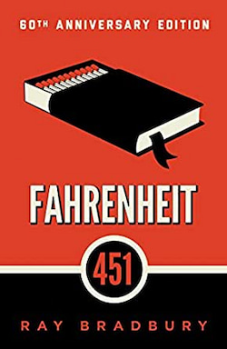

# Fahrenheit 481

Ray Bradbury - 1953

## Table of Contents

TODO: ADD TOC

## PART I - IT WAS A PLEASURE TO BURN

IT was a special pleasure to see things eaten, to see things blackened and changed.

With his symbolic helmet numbered 451 on his stolid head, and his eyes all orange flame with the thought of what came next, he flicked the igniter and the house jumped up in a gorging fire that burned the evening sky red and yellow and black.

The air seemed charged with a special calm as if someone had waited there, quietly, and only a moment before he came, simply turned to a shadow and let him through.

The girl stopped and looked as if she might pull back in surprise, but instead stood regarding Montag with eyes so dark and shining and alive, that he felt he had said something quite wonderful. But he knew his mouth had only moved to say hello, and then when she seemed hypnotized by the salamander on his arm and the phoenix-disc on his chest, he spoke again. "Of course," he said, "you're a new neighbour, aren't you?"

"Kerosene," he said, because the silence had lengthened, "is nothing but perfume to me.". "Does it seem like that, really?". "Of course. Why not?"

"Well," she said, "I'm seventeen and I'm crazy. My uncle says the two always go together. When people ask your age, he said, always say seventeen and insane. Isn't this a nice time of night to walk? I like to smell things and look at things, and sometimes stay up all night, walking, and watch the sun rise."

He saw himself in her eyes, suspended in two shining drops of bright water, himself dark and tiny, in fine detail, the lines about his mouth, everything there, as if her eyes were two miraculous bits of violet amber that might capture and hold him intact.

"Do you mind if I ask? How long have you worked at being a fireman?" "Since I was twenty, ten years ago." "Do you ever read any of the books you bum?" He laughed. "That's against the law!" "Oh. Of course."

"Is it true that long ago firemen put fires out instead of going to start them?" "No. Houses. have always been fireproof, take my word for it." "Strange. I heard once that a long time ago houses used to burn by accident and they needed firemen to stop the flames." He laughed.

"I don't mean to be insulting. It's just, I love to watch people too much, I guess."

"I sometimes think drivers don't know what grass is, or flowers, because they never see them slowly," she said. "If you showed a driver a green blur, Oh yes! he'd say, that's grass! A pink blur? That's a rose-garden! White blurs are houses. Brown blurs are cows. My uncle drove slowly on a highway once. He drove forty miles an hour and they jailed him for two days. Isn't that funny, and sad, too?"

I've lots of time for crazy thoughts, I guess.

Did you know that once billboards were only twenty feet long? But cars started rushing by so quickly they had to stretch the advertising out so it would last."

"Are you happy?" she said. "Am I what?" he cried. But she was gone-running in the moonlight. Her front door shut gently. "Happy! Of all the nonsense." He stopped laughing. He put his hand into the glove-hole of his front door and let it know his touch. The front door slid open. Of course I'm happy. What does she think? I'm not? he asked the quiet rooms. 

She had a very thin face like the dial of a small clock seen faintly in a dark room in the middle of a night when you waken to see the time and see the clock telling you the hour and the minute and the second, with a white silence and a glowing, all certainty and knowing what it has to tell of the night passing swiftly on toward further darknesses but moving also toward a new sun.

What incredible power of identification the girl had; she was like the eager watcher of a marionette show, anticipating each flicker of an eyelid, each gesture of his hand, each flick of a finger, the moment before it began. How long had they walked together? Three minutes? Five?

Darkness. He was not happy. He was not happy. He said the words to himself. He recognized this as the true state of affairs. He wore his happiness like a mask and the girl had run off across the lawn with the mask and there was no way of going to knock on her door and ask for it back.

His wife stretched on the bed, uncovered and cold... ...And in her ears the little Seashells, the thimble radios tamped tight, and an electronic ocean of sound, of music and talk and music and talk coming in, coming in on the shore of her unsleeping mind.

As he stood there the sky over the house screamed. There was a tremendous ripping sound as if two giant hands had torn ten thousand miles of black linen down the seam. Montag was cut in half. He felt his chest chopped down and split apart. The jet-bombs going over, going over, going over, one two, one two, one two, six of them, nine of them, twelve of them, one and one and one and another and another and another, did all the screaming for him. He opened his own mouth and let their shriek come down and out between his bared teeth. The house shook. The flare went out in his hand. The moonstones vanished. He felt his hand plunge toward the telephone. The jets were gone. He felt his lips move, brushing the mouthpiece of the phone. "Emergency hospital." A terrible whisper.

They had this machine. They had two machines, really. One of them slid down into your stomach like a black cobra down an echoing well looking for all the old water and the old time gathered there. It drank up the green matter that flowed to the top in a slow boil. Did it drink of the darkness? Did it suck out all the poisons accumulated with the years?

It had an Eye. The impersonal operator of the machine could, by wearing a special optical helmet, gaze into the soul of the person whom he was pumping out.

The other machine was operated by an equally impersonal fellow in non-stainable reddish-brown overalls. This machine pumped all of the blood from the body and replaced it with fresh blood and serum. "Got to clean 'em out both ways," said the operator, standing over the silent woman. "No use getting the stomach if you don't clean the blood. Leave that stuff in the blood and the blood hits the brain like a mallet, bang, a couple of thousand times and the brain just gives up, just quits."

"Neither of you is an M.D. Why didn't they send an M.D. from Emergency?" "Hell! " the operator's cigarette moved on his lips. "We get these cases nine or ten a night. Got so many, starting a few years ago, we had the special machines built. With the optical lens, of course, that was new; the rest is ancient. You don't need an M.D., case like this; all you need is two handymen, clean up the problem in half an hour. Look"-he started for the door-"we gotta go.

Call if you need us again. Keep her quiet. We got a contra-sedative in her. She'll wake up hungry. So long."

There are too many of us, he thought. There are billions of us and that's too many. Nobody knows anyone. Strangers come and violate you. Strangers come and cut your heart out. Strangers come and take your blood. Good God, who were those men? I never saw them before in my life!

Montag moved out through the french windows and crossed the lawn, without even thinking of it. He stood outside the talking house in the shadows, thinking he might even tap on their door and whisper, "Let me come in. I won't say anything. I just want to listen. What is it you're saying?"

One, Clarisse. Two, Mildred. Three, uncle. Four, fire, One, Mildred, two, Clarisse. One, two, three, four, five, Clarisse, Mildred, uncle, fire, sleeping-tablets, men, disposable tissue, coat-tails, blow, wad, flush, Clarisse, Mildred, uncle, fire, tablets, tissues, blow, wad, flush. One, two, three, one, two, three! Rain. The storm. The uncle laughing. Thunder falling downstairs. The whole world pouring down. The fire gushing up in a volcano. All rushing on down around in a spouting roar and rivering stream toward morning.

"I don't know anything any more,"

"Yes," he said. "I wanted to talk to you." He paused. "You took all the pills in your bottle last night."
"Oh, I wouldn't do that," she said, surprised.
"The bottle was empty."
"I wouldn't do a thing like that. Why would I do a thing like that?" she asked.
"Maybe you took two pills and forgot and took two more, and forgot again and took two more, and were so dopy you kept right on until you had thirty or forty of them in you."
"Heck," she said, "what would I want to go and do a silly thing like that for?"
"I don't know," he said.

"It's really fun. It'll be even more fun when we can afford to have the fourth wall installed. How long you figure before we save up and get the fourth wall torn out and a fourth wall-TV put in?
It's only two thousand dollars."
"That's one-third of my yearly pay."

"Good-bye," he said. He stopped and turned around. "Does it have a happy ending?"
"I haven't read that far."
He walked over, read the last page, nodded, folded the script, and handed it back to her. He walked out of the house into the rain.

"What do you do, go around trying everything once?" he asked.
"Sometimes twice." She looked at something in her hand.

"Fine! Let's try YOU now."
"It won't work for me."
"Here." Before he could move she had put the dandelion under his chin. He drew back and she laughed. "Hold still!"
She peered under his chin and frowned.
"Well?" he said.
"What a shame," she said. "You're not in love with anyone."
"Yes, I am ! "
"It doesn't show."

"The psychiatrist wants to know why I go out and hike around in the forests and watch the birds and collect butterflies. I'll show you my collection some day." "Good." "They want to know what I do with all my time. I tell them that sometimes I just sit and think. But I won't tell them what. I've got them running. And sometimes, I tell them, I like to put my head back, like this, and let the rain fall into my mouth. It tastes just like wine. Have you ever tried it?"

Now, may I make you angry again?" "Go ahead." "How did it start? How did you get into it? How did you pick your work and how did you happen to think to take the job you have? You're not like the others. I've seen a few; I know.

And then, very slowly, as he walked, he tilted his head back in the rain, for just a few moments, and opened his mouth....

Light flickered on bits of ruby glass and on sensitive capillary hairs in the nylon-brushed nostrils of the creature that quivered gently, gently, gently, its eight legs spidered under it on rubber-padded paws. Montag slid down the brass pole. He went out to look at the city and the clouds had cleared away completely, and he lit a cigarette and came back to bend down and look at the Hound. It was like a great bee come home from some field where the honey is full of poison wildness, of insanity and nightmare, its body crammed with that over-rich nectar and now it was sleeping the evil out of itself.

"Montag... ?" "It doesn't like me," said Montag. "What, the Hound?" The Captain studied his cards. "Come off it. It doesn't like or dislike. It just functions.' It's like a lesson in ballistics. It has a trajectory we decide for it. It follows through. It targets itself, homes itself, and cuts off. It's only copper wire, storage batteries, and electricity."

"All of those chemical balances and percentages on all of us here in the house are recorded in the master file downstairs. It would be easy for someone to set up a partial combination on the Hound's 'memory,' a touch of amino acids, perhaps. That would account for what the animal did just now. Reacted toward me."

"I was just figuring," said Montag, "what does the Hound think about down there nights? Is it coming alive on us, really? It makes me cold." "It doesn't think anything we don't want it to think." "That's sad," said Montag, quietly, "because all we put into it is hunting and finding and killing.

What a shame if that's all it can ever know."'

"It was a good question. It's been a long time since anyone cared enough to ask. A good question."

"Why aren't you in school? I see you every day wandering around." "Oh, they don't miss me," she said. "I'm anti-social, they say. I don't mix. It's so strange. I'm very social indeed. It all depends on what you mean by social, doesn't it? Social to me means talking about things like this." She rattled some chestnuts that had fallen off the tree in the front yard. "Or talking about how strange the world is. Being with people is nice. But I don't think it's social to get a bunch of people together and then not let them talk, do you? An hour of TV class, an hour of basketball or baseball or running, another hour of transcription history or painting pictures, and more sports, but do you know, we never ask questions, or at least most don't; they just run the answers at you, bing, bing, bing, and us sitting there for four more hours of film-teacher. That's not social to me at all.

But everyone I know is either shouting or dancing around like wild or beating up one another. Do you notice how people hurt each other nowadays?"

"You sound so very old." "Sometimes I'm ancient. I'm afraid of children my own age. They kill each other. Did it always used to be that way? My uncle says no... ...My uncle says his grandfather remembered when children didn't kill each other. But that was a long time ago when they had things different. They believed in responsibility, my uncle says. Do you know, I'm responsible.

"But most of all," she said, "I like to watch people.

"People don't talk about anything." "Oh, they must!" "No, not anything. They name a lot of cars or clothes or swimming-pools mostly and say how swell! But they all say the same things and nobody says anything different from anyone else.

And at the museums, have you ever been? All abstract. That's all there is now. My uncle says it was different once. A long time back sometimes pictures said things or even showed people."

Clarisse was gone. He didn't know what there was about the afternoon, but it was not seeing her somewhere in the world.

A radio hummed somewhere. ". . . war may be declared any hour. This country stands ready to defend its--" The firehouse trembled as a great flight of jet planes whistled a single note across the black morning sky.

These men were all mirror-images of himself! Were all firemen picked then for their looks as well as their proclivities? 
 
"I-I've been thinking. About the fire last week.
About the man whose library we fixed. What happened to him?"
"They took him screaming off to the asylum"
"He. wasn't insane."
Beatty arranged his cards quietly. "Any man's insane who thinks he can fool the Government and us."
"I've tried to imagine," said Montag, "just how it would feel. I mean to have firemen burn our houses and our books."
"We haven't any books."
"But if we did have some."
"You got some?"
Beatty blinked slowly.
"No." Montag gazed beyond them to the wall with the typed lists of a million forbidden books.

He said, "in the old days, before homes were completely fireproofed " Suddenly it seemed a much younger voice was speaking for him. He opened his mouth and it was Clarisse McClellan saying, "Didn't firemen prevent fires rather than stoke them up and get them going?"

"Established, 1790, to burn English-influenced books in the Colonies. First Fireman: Benjamin Franklin."
RULE 1. Answer the alarm swiftly.
2. Start the fire swiftly.
3. Burn everything.
4. Report back to firehouse immediately.
5. Stand alert for other alarms.

The alarm sounded... ...Montag slid down the pole like a man in a dream. The Mechanical Hound leapt up in its kennel, its eyes all green flame.

They crashed the front door and grabbed at a woman... ...'Play the man, Master Ridley; we shall this day light such a candle, by God's grace, in England, as I trust shall never be put out.' "Enough of that!" said Beatty. "Where are they?"... ...You know where they are or you wouldn't be here," she said.

A fountain of books sprang down upon Montag as he climbed shuddering up the sheer stair-well. How inconvenient! Always before it had been like snuffing a candle. The police went first and adhesive-taped the victim's mouth and bandaged him off into their glittering beetle cars, so when you arrived you found an empty house. You weren't hurting anyone, you were hurting only things! And since things really couldn't be hurt, since things felt nothing, and things don't scream or whimper, as this woman might begin to scream and cry out, there was nothing to tease your conscience later. You were simply cleaning up. Janitorial work, essentially. Everything to its proper place. Quick with the kerosene! Who's got a match!

Montag had only an instant to read a line, but it blazed in his mind for the next minute as if stamped there with fiery steel. "Time has fallen asleep in the afternoon sunshine." He dropped the book. Immediately, another fell into his arms.

"Enough of that!" said Beatty. "Where are they?"

## PART II - THE SIEVE AND THE SAND

## PART III - BURNING BRIGHT

