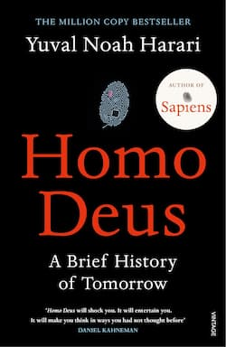
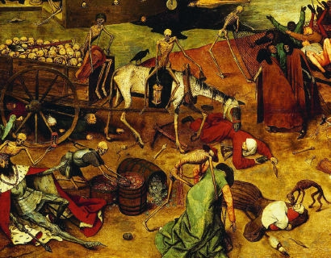
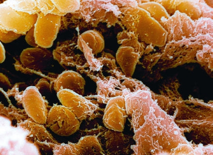
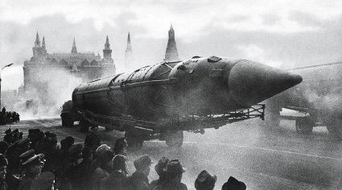

# Homo Deus A Brief History of Tomorrow

Yuval Noah Harari - 2015

## Table of Contents

1. Dedication
2. Contents
3. 1 The New Human Agenda
4. PART I Homo Sapiens Conquers the World
1. 2 The Anthropocene
2. 3 The Human Spark
5. PART II Homo Sapiens Gives Meaning to the World
1. 4 The Storytellers
2. 5 The Odd Couple
3. 6 The Modern Covenant
4. 7 The Humanist Revolution
PART I6II. Homo Sapiens Loses Control
1. 8 The Time Bomb in the Laboratory
2. 9 The Great Decoupling
3. 10 The Ocean of Consciousness
4. 11 The Data Religion
7. Notes
8. Acknowledgements
9. Index
10. About the Author
11. Also by Yuval Noah Harari
12. Credits
13. Copyright
14. About the Publisher

## 1. Dedication

## 2. Contents

In vitro fertilisation: mastering creation.

## 3. 1 The New Human Agenda

Let’s see what’s on the agenda today.’For thousands of years the answer to this question remained unchanged. The same three problems preoccupied the people of twentieth-century China, of medieval India and of ancient Egypt. Famine, plague and war were always at the top of the list.

For generation after generation humans have prayed to every god, angel and saint, and have invented countless tools, institutions and social systems – but they continued to die in their millions from starvation, epidemics and violence.

Yet at the dawn of the third millennium, humanity wakes up to an amazing realisation. Most people rarely think about it, but in the last few decades we have managed to rein in famine, plague and war.

For the first time in history, more people die today from eating too much than from eating too little; more people die from old age than from infectious diseases; and more people commit suicide than are killed by soldiers, terrorists and criminals combined
 
Like firefighters in a world without fire, so humankind in the twenty-first century needs to ask itself an unprecedented question: what are we going to do with ourselves? 

In a healthy, prosperous and harmonious world, what will demand our attention and ingenuity? 

### The Biological Poverty Line

Until recently most humans lived on the very edge of the biological poverty line, below which people succumb to malnutrition and hunger. A small mistake or a bit of bad luck could easily be a death sentence for an entire family or village.
 
 In April 1694 a French official in the town of Beauvais described the impact of famine and of soaring food prices, saying that his entire district was now filled with ‘an infinite number of poor souls, weak from hunger and wretchedness and dying from want, because, having no work or occupation, they lack the money to buy bread. Seeking to prolong their lives a little and somewhat to appease their hunger, these poor folk eat such unclean things as cats and the flesh of horses flayed and cast onto dung heaps. [Others consume] the blood that flows when cows and oxen are slaughtered, and the offal that cooks throw into the streets.

Most readers probably know how it feels when you miss lunch, when you fast on some religious holiday, or when you live for a few days on vegetable shakes as part of a new wonder diet. But how does it feel when you haven’t eaten for days on end and you have no clue where to get the next morsel of food?

Mass famines still strike some areas from time to time, but they are exceptional, and they are almost always caused by human politics rather than by natural catastrophes.
 
On the collective level, the global trade network turns droughts and floods into business opportunities, and makes it possible to overcome food shortages quickly and cheaply.
 
In France, for example, 6 million people (about 10 per cent of the population) suffer from nutritional insecurity. They wake up in the morning not knowing whether they will have anything to eat for lunch; they often go to sleep hungry; and the nutrition they do obtain is unbalanced and unhealthy – lots of starch, sugar and salt, and not enough protein and vitamins. Yet nutritional insecurity isn’t famine, and France of the early twenty-first century isn’t France of 1694. 

In the eighteenth century Marie Antoinette allegedly advised the starving masses that if they ran out of bread, they should just eat cake instead. Today, the poor are following this advice to the letter. Whereas the rich residents of Beverly Hills eat lettuce salad and steamed tofu with quinoa, in the slums and ghettos the poor gorge on Twinkie cakes, Cheetos, hamburgers and pizza.
 
Half of humankind is expected to be overweight by 2030. 
 
In 2010 famine and malnutrition combined killed about 1 million people, whereas obesity killed 3 million.

### Invisible Armadas

Bustling cities linked by a ceaseless stream of merchants, officials and pilgrims were both the bedrock of human civilisation and an ideal breeding ground for pathogens. People consequently lived their lives in ancient Athens or medieval Florence knowing that they might fall ill and die next week, or that an epidemic might suddenly erupt and destroy their entire family in one swoop.

The most famous such outbreak, the so-called Black Death, began in the 1330s, somewhere in east or central Asia, when the flea-dwelling bacterium Yersinia pestis started infecting humans bitten by the fleas. From there, riding on an army of rats and fleas, the plague quickly spread all over Asia, Europe and North Africa, taking less than twenty years to reach the shores of the Atlantic Ocean. Between 75 million and 200 million people died – more than a quarter of the population of Eurasia

Medieval people personified the Black Death as a horrific demonic force beyond human control or comprehension.The Triumph of Death, c.1562, Bruegel, Pieter the Elder © The Art Archive/Alamy Stock Photo.

 People readily believed in angels and fairies, but they could not imagine that a tiny flea or a single drop of water might contain an entire armada of deadly predators.
 
 
 The real culprit was the minuscule Yersinia pestis bacterium.© NIAID/CDC/Science Photo Library.

 More disastrous epidemics struck America, Australia and the Pacific Islands following the arrival of the first Europeans. Unbeknown to the explorers and settlers, they brought with them new infectious diseases against which the natives had no immunity. Up to 90 per cent of the local populations died as a result.
 
 In March 1520, when the Spanish fleet arrived, Mexico was home to 22 million people, by December only 14 million were still alive. Smallpox was only the first blow. While the new Spanish masters were busy enriching themselves and exploiting the natives, deadly waves of flu, measles and other infectious diseases struck Mexico one after the other, until in 1580 its population was down to less than 2 million.
 
In January 1918 soldiers in the trenches of northern France began dying in their thousands from a particularly virulent strain of flu, nicknamed ‘the Spanish Flu’. The front line was the end point of the most efficient global supply network the world had hitherto seen. Men and munitions were pouring in from Britain, the USA, India and Australia. Oil was sent from the Middle East, grain and beef from Argentina, rubber from Malaya and copper from Congo. In exchange, they all got Spanish Flu. Within a few months, about half a billion people – a third of the global population – came down with the virus. In India it killed 5 per cent of the population (15 million people). On the island of Tahiti, 14 per cent died. On Samoa, 20 per cent. In the copper mines of the Congo one out of five labourers perished. Altogether the pandemic killed between 50 million and 100 million people in less than a year. The First World War killed 40 million from 1914 to 1918.
 
Until the early twentieth century, about a third of children died before reaching adulthood from a combination of malnutrition and disease.

The global transport network is today even more efficient than in 1918. A Spanish virus can make its way to Congo or Tahiti in less than twenty-four hours.

Less than 5 per cent of children die before reaching adulthood. In the developed world the rate is less than 1 per cent.11 This miracle is due to the unprecedented achievements of twentieth-century medicine, which has provided us with vaccinations, antibiotics, improved hygiene and a much better medical infrastructure.

In 1979 the World Health Organization declared that humanity had won, and that smallpox had been completely eradicated. It was the first epidemic humans had ever managed to wipe off the face of the earth. In 1967 smallpox had still infected 15 million people and killed 2 million of them, but in 2014 not a single person was either infected or killed by smallpox. The victory has been so complete that today the WHO has stopped vaccinating humans against smallpox

 the HIV virus itself does not kill. Rather, it destroys the immune system, thereby exposing the patient to numerous other diseases. It is these secondary diseases that actually kill AIDS victims. Consequently, when AIDS began to spread, it was especially difficult to understand what was happening. When two patients were admitted to a New York hospital in 1981, one ostensibly dying from pneumonia and the other from cancer, it was not at all evident that both were in fact victims of the HIV virus, which may have infected them months or even years previously
 
Just think what would have happened if AIDS had erupted in 1581 rather than 1981. In all likelihood, nobody back then would have figured out what caused the epidemic, how it moved from person to person, or how it could be halted (let alone cured). Under such conditions, AIDS might have killed a much larger proportion of the human race, equalling and perhaps even surpassing the Black Death.

 New infectious diseases appear mainly as a result of chance mutations in pathogen genomes. These mutations allow the pathogens to jump from animals to humans, to overcome the human immune system, or to resist medicines such as antibiotics. Today such mutations probably occur and disseminate faster than in the past, due to human impact on the environment.

Some research labs are already home to nano-robots, that may one day navigate through our bloodstream, identify illnesses and kill pathogens and cancerous cells.

 and viruses, but it simultaneously turns humans themselves into an unprecedented threat. The same tools that enable doctors to quickly identify and cure new illnesses may also enable armies and terrorists to engineer even more terrible diseases and doomsday pathogens.

The era when humankind stood helpless before natural epidemics is probably over. But we may come to miss it.

### Breaking the Law of the Jungle

 Throughout history most humans took war for granted, whereas peace was a temporary and precarious state.

 From the Stone Age to the age of steam, and from the Arctic to the Sahara, every person on earth knew that at any moment the neighbours might invade their territory, defeat their army, slaughter their people and occupy their land.

  In 2012 about 56 million people died throughout the world; 620,000 of them died due to human violence (war killed 120,000 people, and crime killed another 500,000). In contrast, 800,000 committed suicide, and 1.5 million died of diabetes Sugar is now more dangerous than gunpowder.

 the global economy has been transformed from a material-based economy into a knowledge-based economy.

  Today the main source of wealth is knowledge.

 as knowledge became the most important economic resource, the profitability of war declined and wars became increasingly restricted to those parts of the world – such as the Middle East and Central Africa – where the economies are still old-fashioned material-based economies.

In 1998 it made sense for Rwanda to seize and loot the rich coltan mines of neighbouring Congo... ...Rwanda earned $240 million annually from the looted coltan... ...the Chinese have earned billions of dollars from cooperating with hi-tech giants such as Apple and Microsoft, buying their software and manufacturing their products. What Rwanda earned from an entire year of looting Congolese coltan, the Chinese earn in a single day of peaceful commerce.

 Previous generations thought about peace as the temporary absence of war. Today we think about peace as the implausibility of war.

 This New Peace is not just a hippie fantasy. Power-hungry governments and greedy corporations also count on it. When Mercedes plans its sales strategy in eastern Europe, it discounts the possibility that Germany might conquer Poland. A corporation importing cheap labourers from the Philippines is not worried that Indonesia might invade the Philippines next year.

 There is no guarantee, of course, that the New Peace will hold indefinitely.

  When the USA fought Iraq in 2003 it brought havoc to Baghdad and Mosul, but not a single bomb was dropped on Los Angeles or Chicago. In the future, though, a country such as North Korea or Iran could use logic bombs to shut down the power in California, blow up refineries in Texas and cause trains to collide in Michigan

 we should not confuse ability with motivation.

  Anton Chekhov famously said that a gun appearing in the first act of a play will inevitably be fired in the third. Throughout history, if kings and emperors acquired some new weapon, sooner or later they were tempted to use it. Since 1945, however, humankind has learned to resist this temptation. The gun that appeared in the first act of the Cold War was never fired.

 
Nuclear missiles on parade in Moscow. The gun that was always on display but never fired.Moscow, 1968 © Sovfoto/UIG via Getty Images.

 Whereas in 2010 obesity and related illnesses killed about 3 million people, terrorists killed a total of 7,697 people across the globe, most of them in developing countries.25 For the average American or European, Coca-Cola poses a far deadlier threat than al-Qaeda.

 In essence, terrorism is a show. Terrorists stage a terrifying spectacle of violence that captures our imagination and makes us feel as if we are sliding back into medieval chaos. Consequently states often feel obliged to react to the theatre of terrorism with a show of security, orchestrating immense displays of force, such as the persecution of entire populations or the invasion of foreign countries. In most cases, this overreaction to terrorism poses a far greater threat to our security than the terrorists themselves.

 By themselves, terrorists are too weak to drag us back to the Middle Ages and re-establish the Jungle Law. They may provoke us, but in the end, it all depends on our reactions.

 The message is not that famine, plague and war have completely disappeared from the face of the earth, and that we should stop worrying about them. Just the opposite.

Acknowledging our past achievements sends a message of hope and responsibility, encouraging us to make even greater efforts in the future.

 appreciating the magnitude of our achievements carries another message: history does not tolerate a vacuum. If incidences of famine, plague and war are decreasing, something is bound to take their place on the human agenda. We had better think very carefully what it is going to be. Otherwise, we might gain complete victory in the old battlefields only to be caught completely unaware on entirely new fronts.

We have managed to bring famine, plague and war under control thanks largely to our phenomenal economic growth, which provides us with abundant food, medicine, energy and raw materials. Yet this same growth destabilises the ecological equilibrium of the planet in myriad ways, which we have only begun to explore.

 Despite all the talk of pollution, global warming and climate change, most countries have yet to make any serious economic or political sacrifices to improve the situation.

  Humans are rarely satisfied with what they already have. 
  
  The most common reaction of the human mind to achievement is not satisfaction, but craving for more.

  Success breeds ambition, and our recent achievements are now pushing humankind to set itself even more daring goals.

   humanity’s next targets are likely to be immortality, happiness and divinity.

### The Last Days of Death

 Struggling against old age and death will merely carry on the time-honoured fight against famine and disease, and manifest the supreme value of contemporary culture: the worth of human life. 
 
 We are constantly reminded that human life is the most sacred thing in the universe.

  The Universal Declaration of Human Rights adopted by the UN after the Second World War – which is perhaps the closest thing we have to a global constitution – categorically states that ‘the right to life’ is humanity’s most fundamental value. Since death clearly violates this right, death is a crime against humanity, and we ought to wage total war against it.
  
  Throughout history, religions and ideologies did not sanctify life itself. They always sanctified something above or beyond earthly existence, and were consequently quite tolerant of death... ...they viewed death as a vital and positive part of the world. Humans died because God decreed it, and their moment of death was a sacred metaphysical experience exploding with meaning.

   Just try to imagine Christianity, Islam or Hinduism in a world without death – which is also a world without heaven, hell or reincarnation.
   
   Modern science and modern culture have an entirely different take on life and death. They don’t think of death as a metaphysical mystery, and they certainly don’t view death as the source of life’s meaning. Rather, for modern people death is a technical problem that we can and should solve.

  Humans always die due to some technical glitch. The heart stops pumping blood. The main artery is clogged by fatty deposits. Cancerous cells spread in the liver. Germs multiply in the lungs. And what is responsible for all these technical problems? Other technical problems. The heart stops pumping blood because not enough oxygen reaches the heart muscle. Cancerous cells spread because a chance genetic mutation rewrote their instructions. Germs settled in my lungs because somebody sneezed on the subway. Nothing metaphysical about it. It is all technical problems.

  Death personified as the Grim Reaper in medieval art.‘Death and dying’ from 14th-century French manuscript: Pilgrimage of the Human Life, Bodleian Library, Oxford © Art Media/Print Collector/Getty Images.

Every technical problem has a technical solution

 True, at present we don’t have solutions to all technical problems. But this is precisely why we invest so much time and money in researching cancer, germs, genetics and nanotechnology.

 Even when people die in a hurricane, a car accident or a war, we tend to view it as a technical failure that could and should have been prevented.

  Death has become an almost automatic reason for lawsuits and investigations. ‘How could they have died? Somebody somewhere must have screwed up.’

   Yet because old age and death are the outcome of nothing but particular problems, there is no point at which doctors and scientists are going to stop and declare: ‘Thus far, and not another step. We have overcome tuberculosis and cancer, but we won’t lift a finger to fight Alzheimer’s. People can go on dying from that.’ The Universal Declaration of Human Rights does not say that humans have ‘the right to life until the age of ninety’. It says that every human has a right to life, period. That right isn’t limited by any expiry date.

In 2012 Kurzweil was appointed a director of engineering at Google, and a year later Google launched a sub-company called Calico whose stated mission is "to solve death".

 Google Ventures is investing 36 per cent of its $2 billion portfolio in life sciences start-ups, including several ambitious life-extending projects. Using an American football analogy, Maris explained that in the fight against death, ‘We aren’t trying to gain a few yards. We are trying to win the game.’ Why? Because, says Maris, ‘it is better to live than to die’.

I think there are probably three main modes of approaching [death],’ he explained. ‘You can accept it, you can deny it or you can fight it. I think our society is dominated by people who are into denial or acceptance, and I prefer to fight it.’

 They maintain that anyone possessing a healthy body and a healthy bank account in 2050 will have a serious shot at immortality by cheating death a decade at a time. According to Kurzweil and de Grey, every ten years or so we will march into the clinic and receive a makeover treatment that will not only cure illnesses, but will also regenerate decaying tissues, and upgrade hands, eyes and brains. Before the next treatment is due, doctors will have invented a plethora of new medicines, upgrades and gadgets. If Kurzweil and de Grey are right, there may already be some immortals walking next to you on the street – at least if you happen to be walking down Wall Street or Fifth Avenue.

 In truth they will actually be a-mortal, rather than immortal... ...Which will probably make them the most anxious people in history. We mortals daily take chances with our lives, because we know they are going to end anyhow. So we go on treks in the Himalayas, swim in the sea, and do many other dangerous things like crossing the street or eating out. But if you believe you can live for ever, you would be crazy to gamble on infinity like that.

  In the twentieth century we have almost doubled life expectancy from forty to seventy, so in the twenty-first century we should at least be able to double it again to 150

   Though falling far short of immortality, this would still revolutionise human society. For starters, family structure, marriages and child–parent relationships would be transformed. Today, people still expect to be married ‘till death us do part’, and much of life revolves around having and raising children. Now try to imagine a person with a lifespan of 150 years. Getting married at forty, she still has 110 years to go. Will it be realistic to expect her marriage to last 110 years? Even Catholic fundamentalists might baulk at that

   The current trend of serial marriages is likely to intensify

Today we assume that you learn a profession in your teens and twenties, and then spend the rest of your life in that line of work. You obviously learn new things even in your forties and fifties, but life is generally divided into a learning period followed by a working period. When you live to be 150 that won’t do, especially in a world that is constantly being shaken by new technologies. 
    
People will have much longer careers, and will have to reinvent themselves again and again even at the age of ninety.

At the same time, people will not retire at sixty-five and will not make way for the new generation with its novel ideas and aspirations. The physicist Max Planck famously said that science advances one funeral at a time. He meant that only when one generation passes away do new theories have a chance to root out old ones. This is true not only of science. Think for a moment about your own workplace. No matter whether you are a scholar, journalist, cook or football player, how would you feel if your boss were 120, his ideas were formulated when Victoria was still queen, and he was likely to stay your boss for a couple of decades more?

 In the political sphere the results might be even more sinister... ...if people lived to 150, then in 2016 Stalin would still be ruling in Moscow, going strong at 138,

My own view is that the hopes of eternal youth in the twenty-first century are premature, and whoever takes them too seriously is in for a bitter disappointment. 

It is not easy to live knowing that you are going to die, but it is even harder to believe in immortality and be proven wrong.

Although average life expectancy has doubled over the last hundred years, it is unwarranted to extrapolate and conclude that we can double it again to 150 in the coming century.

those who escaped famine, plague and war could live well into their seventies and eighties, which is the natural life span of Homo sapiens.

In truth, so far modern medicine hasn’t extended our natural life span by a single year. Its great achievement has been to save us from premature death, and allow us to enjoy the full measure of our years

Even if we now overcome cancer, diabetes and the other major killers, it would mean only that almost everyone will get to live to ninety – but it will not be enough to reach 150, let alone 500. For that, medicine will need to re-engineer the most fundamental structures and processes of the human body, and discover how to regenerate organs and tissues. It is by no means clear that we can do that by 2100.

 The scientists who cry immortality are like the boy who cried wolf: sooner or later, the wolf actually comes. 
 
 even if we don’t achieve immortality in our lifetime, the war against death is still likely to be the flagship project of the coming century.

 As long as people die of something, we will strive to overcome it.

 Most scientists and bankers don’t care what they are working on, provided it gives them an opportunity to make new discoveries and greater profits.

  If you are over forty, close your eyes for a minute and try to remember the body you had at twenty-five. Not only how it looked, but above all how it felt. If you could have that body back, how much would you be willing to pay for it? No doubt some people would be happy to forgo the opportunity, but enough customers would pay whatever it takes, constituting a well-nigh infinite market.

 A large part of our artistic creativity, our political commitment and our religious piety is fuelled by the fear of death.
 
 Woody Allen, who has made a fabulous career out of the fear of death, was once asked if he hoped to live on for ever through the silver screen. Allen answered that ‘I’d rather live on in my apartment.’ He went on to add that ‘I don’t want to achieve immortality through my work. I want to achieve it by not dying.’

  Once people think (with or without good reason) that they have a serious chance of escaping death, the desire for life will refuse to go on pulling the rickety wagon of art, ideology and religion, and will sweep forward like an avalanche.

 when science makes significant progress in the war against death, the real battle will shift from the laboratories to the parliaments, courthouses and streets.

  All the wars and conflicts of history might turn out to be but a pale prelude for the real struggle ahead of us: the struggle for eternal youth.

### The Right to Happiness

 The second big project on the human agenda will probably be to find the key to happiness.

 In ancient Greece the philosopher Epicurus explained that worshipping gods is a waste of time, that there is no existence after death, and that happiness is the sole purpose of life.

Scepticism about the afterlife drives humankind to seek not only immortality, but also earthly happiness.

For Epicurus the pursuit of happiness was a personal quest. Modern thinkers, in contrast, tend to see it as a collective project. Without government planning, economic resources and scientific research, individuals will not get far in their quest for happiness.

 Jeremy Bentham declared that the supreme good is ‘the greatest happiness of the greatest number’, and concluded that the sole worthy aim of the state, the market and the scientific community is to increase global happiness.

  Industrialised nations such as Germany, France and Japan established gigantic systems of education, health and welfare, yet these systems were aimed to strengthen the nation rather than ensure individual well-being.

 Schools were founded to produce skilful and obedient citizens who would serve the nation loyally. At eighteen, youths needed to be not only patriotic but also literate, so that they could read the brigadier’s order of the day and draw up tomorrow’s battle plans.

 The same went for the health system. At the end of the nineteenth century countries such as France, Germany and Japan began providing free health care for the masses. They financed vaccinations for infants, balanced diets for children and physical education for teenagers. They drained festering swamps, exterminated mosquitoes and built centralised sewage systems. The aim wasn’t to make people happy, but to make the nation stronger. The country needed sturdy soldiers and workers, healthy women who would give birth to more soldiers and workers, and bureaucrats who came to the office punctually at 8 a.m. instead of lying sick at home.

 the welfare system was originally planned in the interest of the nation rather than of needy individuals. When Otto von Bismarck pioneered state pensions and social security in late nineteenth-century Germany, his chief aim was to ensure the loyalty of the citizens rather than to increase their well-being. You fought for your country when you were eighteen, and paid your taxes when you were forty, because you counted on the state to take care of you when you were seventy

  It’s important to note, however, that the American Declaration of Independence guaranteed the right to the pursuit of happiness, not the right to happiness itself.

 The idea was to reserve for individuals a private sphere of choice, free from state supervision. If I think I’ll be happier marrying John rather than Mary, living in San Francisco rather than Salt Lake City, and working as a bartender rather than a dairy farmer, then it’s my right to pursue happiness my way, and the state shouldn’t intervene even if I make the wrong choice.

  Bentham’s vision has been taken far more seriously. People increasingly believe that the immense systems established more than a century ago to strengthen the nation should actually serve the happiness and well-being of individual citizens. We are not here to serve the state – it is here to serve us. The right to the pursuit of happiness, originally envisaged as a restraint on state power, has imperceptibly morphed into the right to happiness – as if human beings have a natural right to be happy, and anything which makes us dissatisfied is a violation of our basic human rights, so the state should do something about it.

 nowadays thinkers, politicians and even economists are calling to supplement or even replace GDP with GDH – gross domestic happiness

 Production is important because it provides the material basis for happiness.

 When Epicurus defined happiness as the supreme good, he warned his disciples that it is hard work to be happy.

 Epicurus recommended, for example, to eat and drink in moderation, and to curb one’s sexual appetites. In the long run, a deep friendship will make us more content than a frenzied orgy.

  Indeed, it is an ominous sign that despite higher prosperity, comfort and security, the rate of suicide in the developed world is also much higher than in traditional societies.

 In Peru, Guatemala, the Philippines and Albania – developing countries suffering from poverty and political instability – about one person in 100,000 commits suicide each year. In rich and peaceful countries such as Switzerland, France, Japan and New Zealand, twenty-five people per 100,000 take their own lives annually

  in 1985 about nine South Koreans per 100,000 killed themselves, today the annual rate of suicide has more than tripled to thirty per 100,000.

   The average American thus uses sixty times more energy than the average Stone Age hunter-gatherer. Is the average American sixty times happier? We may well be sceptical about such rosy views.

  attaining positive happiness may be far more difficult than abolishing downright suffering.

   The second half of the twentieth century was a golden age for the USA. Victory in the Second World War, followed by an even more decisive victory in the Cold War, turned it into the leading global superpower. Between 1950 and 2000 American GDP grew from $2 trillion to $12 trillion. Real per capita income doubled. The newly invented contraceptive pill made sex freer than ever. Women, gays, African Americans and other minorities finally got a bigger slice of the American pie. A flood of cheap cars, refrigerators, air conditioners, vacuum cleaners, dishwashers, laundry machines, telephones, televisions and computers changed daily life almost beyond recognition. Yet studies have shown that American subjective well-being levels in the 1990s remained roughly the same as they were in the 1950s

 It appears that our happiness bangs against some mysterious glass ceiling that does not allow it to grow despite all our unprecedented accomplishments.

  Achieving real happiness is not going to be much easier than overcoming old age and death.

The glass ceiling of happiness is held in place by two stout pillars, one psychological, the other biological. On the psychological level, happiness depends on expectations rather than objective conditions. We don’t become satisfied by leading a peaceful and prosperous existence. Rather, we become satisfied when reality matches our expectations. The bad news is that as conditions improve, expectations balloon. Dramatic improvements in conditions, as humankind has experienced in recent decades, translate into greater expectations rather than greater contentment

On the biological level, both our expectations and our happiness are determined by our biochemistry, rather than by our economic, social or political situation

 According to Epicurus, we are happy when we feel pleasant sensations and are free from unpleasant ones. Jeremy Bentham similarly maintained that nature gave dominion over man to two masters – pleasure and pain – and they alone determine everything we do, say and think. Bentham’s successor, John Stuart Mill, explained that happiness is nothing but pleasure and freedom from pain, and that beyond pleasure and pain there is no good and no evil. Anyone who tries to deduce good and evil from something else (such as the word of God, or the national interest) is fooling you, and perhaps fooling himself too.

 In the days of Epicurus such talk was blasphemous. In the days of Bentham and Mill it was radical subversion. But in the early twenty-first century this is scientific orthodoxy.

 We never react to events in the outside world, but only to sensations in our own bodies.

  Nobody suffers because she lost her job, because she got divorced or because the government went to war. The only thing that makes people miserable is unpleasant sensations in their own bodies.

   A thousand things may make us angry, but anger is never an abstraction. It is always felt as a sensation of heat and tension in the body, which is what makes anger so infuriating.

   Conversely, science says that nobody is ever made happy by getting a promotion, winning the lottery or even finding true love. People are made happy by one thing and one thing only – pleasant sensations in their bodies.

 Chills run up and down your spine, waves of electricity wash over your body, and it feels as if you are dissolving into millions of exploding energy balls.

  The deeper parts of your mind know nothing about football or about jobs. They know only sensations. If you get a promotion, but for some reason don’t feel any pleasant sensations – you will not feel satisfied. The opposite is also true. If you have just been fired (or lost a decisive football match), but you are experiencing very pleasant sensations (perhaps because you popped some pill), you might still feel on top of the world.
  
  The bad news is that pleasant sensations quickly subside and sooner or later turn into unpleasant ones.

  if last year I received an unexpected promotion at work, I might still be occupying that new position, but the very pleasant sensations I experienced on hearing the news disappeared within hours. If I want to feel those wonderful sensations again, I must get another promotion. And another. And if I don’t get a promotion, I might end up far more bitter and angry than if I had remained a humble pawn.

  This is all the fault of evolution. For countless generations our biochemical system adapted to increasing our chances of survival and reproduction, not our happiness. 
  
  The biochemical system rewards actions conducive to survival and reproduction with pleasant sensations. But these are only an ephemeral sales gimmick. We struggle to get food and mates in order to avoid unpleasant sensations of hunger and to enjoy pleasing tastes and blissful orgasms. But nice tastes and blissful orgasms don’t last very long, and if we want to feel them again we have to go out looking for more food and mates.

  What might have happened if a rare mutation had created a squirrel who, after eating a single nut, enjoys an everlasting sensation of bliss? Technically, this could actually be done by rewiring the squirrel’s brain. Who knows, perhaps it really happened to some lucky squirrel millions of years ago. But if so, that squirrel enjoyed an extremely happy and extremely short life, and that was the end of the rare mutation. For the blissful squirrel would not have bothered to look for more nuts, let alone mates. The rival squirrels, who felt hungry again five minutes after eating a nut, had much better chances of surviving and passing their genes to the next generation. For exactly the same reason, the nuts we humans seek to gather – lucrative jobs, big houses, good-looking partners – seldom satisfy us for long.

  Some may say that this is not so bad, because it isn’t the goal that makes us happy – it’s the journey

  When an animal is looking for something that increases its chances of survival and reproduction (e.g. food, partners or social status), the brain produces sensations of alertness and excitement, which drive the animal to make even greater efforts because they are so very agreeable.

   Humans too may prefer the excitement of the race to resting on the laurels of success. Yet what makes the race so attractive is the exhilarating sensations that go along with it. Nobody would have wanted to climb mountains, play video games or go on blind dates if such activities were accompanied solely by unpleasant sensations of stress, despair or boredom.

   Alas, the exciting sensations of the race are as transient as the blissful sensations of victory... ...Like the rats pressing the pedal again and again, the Don Juans, business tycoons and gamers need a new kick every day. Worse still, here too expectations adapt to conditions, and yesterday’s challenges all too quickly become today’s tedium.

 Perhaps the key to happiness is neither the race nor the gold medal, but rather combining the right doses of excitement and tranquillity; but most of us tend to jump all the way from stress to boredom and back, remaining as discontented with one as with the other.

If science is right and our happiness is determined by our biochemical system, then the only way to ensure lasting contentment is by rigging this system. Forget economic growth, social reforms and political revolutions: in order to raise global happiness levels, we need to manipulate human biochemistry.

 For better or worse, a growing percentage of the population is taking psychiatric medicines on a regular basis, not only to cure debilitating mental illnesses, but also to face more mundane depressions and the occasional blues.

 In the UK the number rose from 92,000 in 1997 to 786,000 in 2012. The original aim had been to treat attention disorders, but today completely healthy kids take such medications to improve their performance and live up to the growing expectations of teachers and parents

  If pupils suffer from attention disorders, stress and low grades, perhaps we ought to blame outdated teaching methods, overcrowded classrooms and an unnaturally fast tempo of life. Maybe we should modify the schools rather than the kids? It is interesting to see how the arguments have evolved.

 Everybody still agreed on one thing: in order to improve education, we need to change the schools. Today, for the first time in history, at least some people think it would be more efficient to change the pupils’ biochemistry

  People drink alcohol to forget, they smoke pot to feel peaceful, they take cocaine and methamphetamines to be sharp and confident, whereas Ecstasy provides ecstatic sensations and LSD sends you to meet Lucy in the Sky with Diamonds. 
  
  What some people hope to get by studying, working or raising a family, others try to obtain far more easily through the right dosage of molecules.

  The state hopes to regulate the biochemical pursuit of happiness, separating ‘bad’ manipulations from ‘good’ ones. The principle is clear: biochemical manipulations that strengthen political stability, social order and economic growth are allowed and even encouraged (e.g. those that calm hyperactive kids in school, or drive anxious soldiers forward into battle). Manipulations that threaten stability and growth are banned. But each year new drugs are born in the research labs of universities, pharmaceutical companies and criminal organisations, and the needs of the state and the market also keep changing. 
  
  As the biochemical pursuit of happiness accelerates, so it will reshape politics, society and economics, and it will become ever harder to bring it under control.

No matter the exact method, gaining happiness through biological manipulation won’t be easy, for it requires altering the fundamental patterns of life. But then it wasn’t easy to overcome famine, plague and war either.

It is far from certain that humankind should invest so much effort in the biochemical pursuit of happiness. Some would argue that happiness simply isn’t important enough, and that it is misguided to regard individual satisfaction as the highest aim of human society. Others may agree that happiness is indeed the supreme good, yet would take issue with the biological definition of happiness as the experience of pleasant sensations.

 Buddha had made an even more radical claim, teaching that the pursuit of pleasant sensations is in fact the very root of suffering. Such sensations are just ephemeral and meaningless vibrations. Even when we experience them, we don’t react to them with contentment; rather, we just crave for more. Hence no matter how many blissful or exciting sensations I may experience, they will never satisfy me.

  the more I crave these pleasant sensations, the more stressed and dissatisfied I will become. To attain real happiness, humans need to slow down the pursuit of pleasant sensations, not accelerate it.This Buddhist view of happiness has a lot in common with the biochemical view.

   pleasant sensations disappear as fast as they arise, and that as long as people crave pleasant sensations without actually experiencing them, they remain dissatisfied.

  this problem has two very different solutions. The biochemical solution is to develop products and treatments that will provide humans with an unending stream of pleasant sensations, so we will never be without them. The Buddha’s suggestion was to reduce our craving for pleasant sensations, and not allow them to control our lives.

   When the mind learns to see our sensations for what they are – ephemeral and meaningless vibrations – we lose interest in pursuing them. 
   
   For what is the point of running after something that disappears as fast as it arises?

   All this is hardly enough, of course. Since Homo sapiens was not adapted by evolution to experience constant pleasure, if that is what humankind nevertheless wants, ice cream and smartphone games will not do. It will be necessary to change our biochemistry and re-engineer our bodies and minds. So we are working on that. You may debate whether it is good or bad, but it seems that the second great project of the twenty-first century – to ensure global happiness – will involve re-engineering Homo sapiens so that it can enjoy everlasting pleasure.

### The Gods of Planet Earth

In seeking bliss and immortality humans are in fact trying to upgrade themselves into gods. Not just because these are divine qualities, but because in order to overcome old age and misery humans will first have to acquire godlike control of their own biological substratum.

 Up till now increasing human power relied mainly on upgrading our external tools. In the future it may rely more on upgrading the human body and mind, or on merging directly with our tools.

there is no reason to think that Sapiens is the last station. Relatively small changes in genes, hormones and neurons were enough to transform Homo erectus – who could produce nothing more impressive than flint knives – into Homo sapiens, who produces spaceships and computers.

 bioengineers will take the old Sapiens body, and intentionally rewrite its genetic code, rewire its brain circuits, alter its biochemical balance, and even grow entirely new limbs. They will thereby create new godlings, who might be as different from us Sapiens as we are different from Homo erectus.

  If an elephant’s brain is in India, its eyes and ears in China and its feet in Australia, then this elephant is most probably dead, and even if it is in some mysterious sense alive, it cannot see, hear or walk. A cyborg, in contrast, could exist in numerous places at the same time. A cyborg doctor could perform emergency surgeries in Tokyo, in Chicago and in a space station on Mars, without ever leaving her Stockholm office

   If you wish, you can already remote-control electric devices in your house using an electric ‘mind-reading’ helmet. The helmet requires no brain implants. It functions by reading the electric signals passing through your scalp. If you want to turn on the light in the kitchen, you just wear the helmet, imagine some preprogrammed mental sign (e.g. imagine your right hand moving), and the switch turns on. You can buy such helmets online for a mere $400

Neural networks will be replaced by intelligent software, which could surf both the virtual and non-virtual worlds, free from the limitations of organic chemistry

 After 4 billion years of wandering inside the kingdom of organic compounds, life will break out into the vastness of the inorganic realm, and will take shapes that we cannot envision even in our wildest dreams.

  For as difficult as it is to predict the impact of new technologies in fields like transportation, communication and energy, technologies for upgrading humans pose a completely different kind of challenge. Since they can be used to transform human minds and desires, people possessing present-day minds and desires by definition cannot fathom their implications.

  once technology enables us to re-engineer human minds, Homo sapiens will disappear, human history will come to an end and a completely new kind of process will begin, which people like you and me cannot comprehend.

   There are many wise answers to the question, ‘What would people with minds like ours do with biotechnology?’ Yet there are no good answers to the question, "What would beings with a different kind of mind do with biotechnology?"

 In the twenty-first century, the third big project of humankind will be to acquire for us divine powers of creation and destruction, and upgrade Homo sapiens into Homo deus.

 If this sounds unscientific or downright eccentric, it is because people often misunderstand the meaning of divinity. Divinity isn’t a vague metaphysical quality. And it isn’t the same as omnipotence. When speaking of upgrading humans into gods, think more in terms of Greek gods or Hindu devas rather than the omnipotent biblical sky father.

 Certain traditional abilities that were considered divine for many millennia have today become so commonplace that we hardly think about them. The average person now moves and communicates across distances much more easily than the Greek, Hindu or African gods of old.

 In ancient agricultural societies, most religions revolved not around metaphysical questions and the afterlife, but around the very mundane issue of increasing agricultural output.

  Thanks to artificial fertilisers, industrial insecticides and genetically modified crops, agricultural production nowadays outstrips the highest expectations ancient farmers had of their gods

  We can be quite certain that humans will make a bid for divinity, because humans have many reasons to desire such an upgrade, and many ways to achieve it.

   Homo sapiens is not going to be exterminated by a robot revolt. Rather, Homo sapiens is likely to upgrade itself step by step, merging with robots and computers in the process, until our descendants will look back and realise that they are no longer the kind of animal that wrote the Bible, built the Great Wall of China and laughed at Charlie Chaplin’s antics.

In pursuit of health, happiness and power, humans will gradually change first one of their features and then another, and another, until they will no longer be human.

### Can Someone Please Hit the Brakes?

A friend once told me that what she fears most about growing old is becoming irrelevant, turning into a nostalgic old woman who cannot understand the world around her, or contribute much to it. This is what we fear collectively, as a species, when we hear of superhumans. We sense that in such a world, our identity, our dreams and even our fears will be irrelevant, and we will have nothing more to contribute.

 Whatever you are today – be it a devout Hindu cricket player or an aspiring lesbian journalist – in an upgraded world you will feel like a Neanderthal hunter in Wall Street. You won’t belong.

  Even if gods don’t walk our streets by 2100, the attempt to upgrade Homo sapiens is likely to change the world beyond recognition in this century.

  If you speak with the experts, many of them will tell you that we are still very far away from genetically engineered babies or human-level artificial intelligence. But most experts think on a timescale of academic grants and college jobs. Hence, ‘very far away’ may mean twenty years, and ‘never’ may denote no more than fifty.

   People are living much longer than expected, and there is not enough money to pay for their pensions and medical treatment. 
   
   As seventy threatens to become the new forty, experts are calling to raise the retirement age, and to restructure the entire job market.

   When people realise how fast we are rushing towards the great unknown, and that they cannot count even on death to shield them from it, their reaction is to hope that somebody will hit the brakes and slow us down

Nobody knows where the brakes are. While some experts are familiar with developments in one field, such as artificial intelligence, nanotechnology, big data or genetics, no one is an expert on everything. No one is therefore capable of connecting all the dots and seeing the full picture.

 Different fields influence one another in such intricate ways that even the best minds cannot fathom how breakthroughs in artificial intelligence might impact nanotechnology, or vice versa.

  Since no one understands the system any more, no one can stop it.

   the modern economy needs constant and indefinite growth in order to survive. If growth ever stops, the economy won’t settle down to some cosy equilibrium; it will fall to pieces. That’s why capitalism encourages us to seek immortality, happiness and divinity.

   Well, if we need limitless projects, why not settle for bliss and immortality, and at least put aside the frightening quest for superhuman powers? Because it is inextricable from the other two. When you develop bionic legs that enable paraplegics to walk again, you can also use the same technology to upgrade healthy people.

   No clear line separates healing from upgrading. 
   
   Medicine almost always begins by saving people from falling below the norm, but the same tools and know-how can then be used to surpass the norm.

   What happens to particular drugs can also happen to entire fields of medicine. Modern plastic surgery was born in the First World War, when Harold Gillies began treating facial injuries in the Aldershot military hospital. When the war was over, surgeons discovered that the same techniques could also turn perfectly healthy but ugly noses into more beautiful specimens. Though plastic surgery continued to help the sick and wounded, it devoted increasing attention to upgrading the healthy.

  Sexual reproduction is a lottery

   why not rig the lottery? Fertilise several eggs, and choose the one with the best combination. Once stem-cell research enables us to create an unlimited supply of human embryos on the cheap, you can select your optimal baby from among hundreds of candidates, all carrying your DNA, all perfectly natural, and none requiring any futuristic genetic engineering.

  why not rig the lottery? Fertilise several eggs, and choose the one with the best combination. Once stem-cell research enables us to create an unlimited supply of human embryos on the cheap, you can select your optimal baby from among hundreds of candidates, all carrying your DNA, all perfectly natural, and none requiring any futuristic genetic engineering.

## 4. PART I Homo Sapiens Conquers the World

## 1. 2 The Anthropocene

## 2. 3 The Human Spark

## 5. PART II Homo Sapiens Gives Meaning to the World

## 1. 4 The Storytellers

## 2. 5 The Odd Couple

## 3. 6 The Modern Covenant

## 4. 7 The Humanist Revolution

## PART I6II. Homo Sapiens Loses Control

## 1. 8 The Time Bomb in the Laboratory

## 2. 9 The Great Decoupling

## 3. 10 The Ocean of Consciousness

## 4. 11 The Data Religion

## 7. Notes

## 8. Acknowledgements

## 9. Index

## 10. About the Author

## 11. Also by Yuval Noah Harari

## 12. Credits

## 13. Copyright

## 14. About the Publisher

