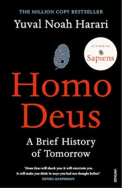

# Homo Deus A Brief History of Tomorrow

Yuval Noah Harari - 2015

## Table of Contents

1. Dedication
2. Contents
3. 1 The New Human Agenda
4. PART I Homo Sapiens Conquers the World
1. 2 The Anthropocene
2. 3 The Human Spark
5. PART II Homo Sapiens Gives Meaning to the World
1. 4 The Storytellers
2. 5 The Odd Couple
3. 6 The Modern Covenant
4. 7 The Humanist Revolution
PART I6II. Homo Sapiens Loses Control
1. 8 The Time Bomb in the Laboratory
2. 9 The Great Decoupling
3. 10 The Ocean of Consciousness
4. 11 The Data Religion
7. Notes
8. Acknowledgements
9. Index
10. About the Author
11. Also by Yuval Noah Harari
12. Credits
13. Copyright
14. About the Publisher

## 1. Dedication

## 2. Contents

In vitro fertilisation: mastering creation.

## 3. 1 The New Human Agenda

Let’s see what’s on the agenda today.’For thousands of years the answer to this question remained unchanged. The same three problems preoccupied the people of twentieth-century China, of medieval India and of ancient Egypt. Famine, plague and war were always at the top of the list.

For generation after generation humans have prayed to every god, angel and saint, and have invented countless tools, institutions and social systems – but they continued to die in their millions from starvation, epidemics and violence.

Yet at the dawn of the third millennium, humanity wakes up to an amazing realisation. Most people rarely think about it, but in the last few decades we have managed to rein in famine, plague and war.

For the first time in history, more people die today from eating too much than from eating too little; more people die from old age than from infectious diseases; and more people commit suicide than are killed by soldiers, terrorists and criminals combined
 
Like firefighters in a world without fire, so humankind in the twenty-first century needs to ask itself an unprecedented question: what are we going to do with ourselves? 

In a healthy, prosperous and harmonious world, what will demand our attention and ingenuity? 

### The Biological Poverty Line

Until recently most humans lived on the very edge of the biological poverty line, below which people succumb to malnutrition and hunger. A small mistake or a bit of bad luck could easily be a death sentence for an entire family or village.
 
 In April 1694 a French official in the town of Beauvais described the impact of famine and of soaring food prices, saying that his entire district was now filled with ‘an infinite number of poor souls, weak from hunger and wretchedness and dying from want, because, having no work or occupation, they lack the money to buy bread. Seeking to prolong their lives a little and somewhat to appease their hunger, these poor folk eat such unclean things as cats and the flesh of horses flayed and cast onto dung heaps. [Others consume] the blood that flows when cows and oxen are slaughtered, and the offal that cooks throw into the streets.

Most readers probably know how it feels when you miss lunch, when you fast on some religious holiday, or when you live for a few days on vegetable shakes as part of a new wonder diet. But how does it feel when you haven’t eaten for days on end and you have no clue where to get the next morsel of food?

Mass famines still strike some areas from time to time, but they are exceptional, and they are almost always caused by human politics rather than by natural catastrophes.
 
On the collective level, the global trade network turns droughts and floods into business opportunities, and makes it possible to overcome food shortages quickly and cheaply.
 
In France, for example, 6 million people (about 10 per cent of the population) suffer from nutritional insecurity. They wake up in the morning not knowing whether they will have anything to eat for lunch; they often go to sleep hungry; and the nutrition they do obtain is unbalanced and unhealthy – lots of starch, sugar and salt, and not enough protein and vitamins. Yet nutritional insecurity isn’t famine, and France of the early twenty-first century isn’t France of 1694. 

In the eighteenth century Marie Antoinette allegedly advised the starving masses that if they ran out of bread, they should just eat cake instead. Today, the poor are following this advice to the letter. Whereas the rich residents of Beverly Hills eat lettuce salad and steamed tofu with quinoa, in the slums and ghettos the poor gorge on Twinkie cakes, Cheetos, hamburgers and pizza.
 
Half of humankind is expected to be overweight by 2030. 
 
In 2010 famine and malnutrition combined killed about 1 million people, whereas obesity killed 3 million.

### Invisible Armadas

Bustling cities linked by a ceaseless stream of merchants, officials and pilgrims were both the bedrock of human civilisation and an ideal breeding ground for pathogens. People consequently lived their lives in ancient Athens or medieval Florence knowing that they might fall ill and die next week, or that an epidemic might suddenly erupt and destroy their entire family in one swoop.

The most famous such outbreak, the so-called Black Death, began in the 1330s, somewhere in east or central Asia, when the flea-dwelling bacterium Yersinia pestis started infecting humans bitten by the fleas. From there, riding on an army of rats and fleas, the plague quickly spread all over Asia, Europe and North Africa, taking less than twenty years to reach the shores of the Atlantic Ocean. Between 75 million and 200 million people died – more than a quarter of the population of Eurasia

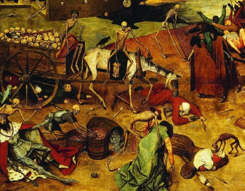
Medieval people personified the Black Death as a horrific demonic force beyond human control or comprehension.The Triumph of Death, c.1562, Bruegel, Pieter the Elder © The Art Archive/Alamy Stock Photo.

 People readily believed in angels and fairies, but they could not imagine that a tiny flea or a single drop of water might contain an entire armada of deadly predators.
 
 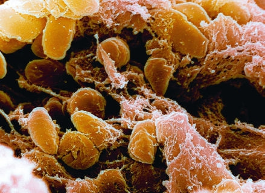
 The real culprit was the minuscule Yersinia pestis bacterium.© NIAID/CDC/Science Photo Library.

 More disastrous epidemics struck America, Australia and the Pacific Islands following the arrival of the first Europeans. Unbeknown to the explorers and settlers, they brought with them new infectious diseases against which the natives had no immunity. Up to 90 per cent of the local populations died as a result.
 
 In March 1520, when the Spanish fleet arrived, Mexico was home to 22 million people, by December only 14 million were still alive. Smallpox was only the first blow. While the new Spanish masters were busy enriching themselves and exploiting the natives, deadly waves of flu, measles and other infectious diseases struck Mexico one after the other, until in 1580 its population was down to less than 2 million.
 
In January 1918 soldiers in the trenches of northern France began dying in their thousands from a particularly virulent strain of flu, nicknamed ‘the Spanish Flu’. The front line was the end point of the most efficient global supply network the world had hitherto seen. Men and munitions were pouring in from Britain, the USA, India and Australia. Oil was sent from the Middle East, grain and beef from Argentina, rubber from Malaya and copper from Congo. In exchange, they all got Spanish Flu. Within a few months, about half a billion people – a third of the global population – came down with the virus. In India it killed 5 per cent of the population (15 million people). On the island of Tahiti, 14 per cent died. On Samoa, 20 per cent. In the copper mines of the Congo one out of five labourers perished. Altogether the pandemic killed between 50 million and 100 million people in less than a year. The First World War killed 40 million from 1914 to 1918.
 
Until the early twentieth century, about a third of children died before reaching adulthood from a combination of malnutrition and disease.

The global transport network is today even more efficient than in 1918. A Spanish virus can make its way to Congo or Tahiti in less than twenty-four hours.

Less than 5 per cent of children die before reaching adulthood. In the developed world the rate is less than 1 per cent.11 This miracle is due to the unprecedented achievements of twentieth-century medicine, which has provided us with vaccinations, antibiotics, improved hygiene and a much better medical infrastructure.

In 1979 the World Health Organization declared that humanity had won, and that smallpox had been completely eradicated. It was the first epidemic humans had ever managed to wipe off the face of the earth. In 1967 smallpox had still infected 15 million people and killed 2 million of them, but in 2014 not a single person was either infected or killed by smallpox. The victory has been so complete that today the WHO has stopped vaccinating humans against smallpox

 the HIV virus itself does not kill. Rather, it destroys the immune system, thereby exposing the patient to numerous other diseases. It is these secondary diseases that actually kill AIDS victims. Consequently, when AIDS began to spread, it was especially difficult to understand what was happening. When two patients were admitted to a New York hospital in 1981, one ostensibly dying from pneumonia and the other from cancer, it was not at all evident that both were in fact victims of the HIV virus, which may have infected them months or even years previously
 
Just think what would have happened if AIDS had erupted in 1581 rather than 1981. In all likelihood, nobody back then would have figured out what caused the epidemic, how it moved from person to person, or how it could be halted (let alone cured). Under such conditions, AIDS might have killed a much larger proportion of the human race, equalling and perhaps even surpassing the Black Death.

 New infectious diseases appear mainly as a result of chance mutations in pathogen genomes. These mutations allow the pathogens to jump from animals to humans, to overcome the human immune system, or to resist medicines such as antibiotics. Today such mutations probably occur and disseminate faster than in the past, due to human impact on the environment.

Some research labs are already home to nano-robots, that may one day navigate through our bloodstream, identify illnesses and kill pathogens and cancerous cells.

 and viruses, but it simultaneously turns humans themselves into an unprecedented threat. The same tools that enable doctors to quickly identify and cure new illnesses may also enable armies and terrorists to engineer even more terrible diseases and doomsday pathogens.

The era when humankind stood helpless before natural epidemics is probably over. But we may come to miss it.

### Breaking the Law of the Jungle

 Throughout history most humans took war for granted, whereas peace was a temporary and precarious state.

 From the Stone Age to the age of steam, and from the Arctic to the Sahara, every person on earth knew that at any moment the neighbours might invade their territory, defeat their army, slaughter their people and occupy their land.

  In 2012 about 56 million people died throughout the world; 620,000 of them died due to human violence (war killed 120,000 people, and crime killed another 500,000). In contrast, 800,000 committed suicide, and 1.5 million died of diabetes Sugar is now more dangerous than gunpowder.

 the global economy has been transformed from a material-based economy into a knowledge-based economy.

  Today the main source of wealth is knowledge.

 as knowledge became the most important economic resource, the profitability of war declined and wars became increasingly restricted to those parts of the world – such as the Middle East and Central Africa – where the economies are still old-fashioned material-based economies.

In 1998 it made sense for Rwanda to seize and loot the rich coltan mines of neighbouring Congo... ...Rwanda earned $240 million annually from the looted coltan... ...the Chinese have earned billions of dollars from cooperating with hi-tech giants such as Apple and Microsoft, buying their software and manufacturing their products. What Rwanda earned from an entire year of looting Congolese coltan, the Chinese earn in a single day of peaceful commerce.

 Previous generations thought about peace as the temporary absence of war. Today we think about peace as the implausibility of war.

 This New Peace is not just a hippie fantasy. Power-hungry governments and greedy corporations also count on it. When Mercedes plans its sales strategy in eastern Europe, it discounts the possibility that Germany might conquer Poland. A corporation importing cheap labourers from the Philippines is not worried that Indonesia might invade the Philippines next year.

 There is no guarantee, of course, that the New Peace will hold indefinitely.

  When the USA fought Iraq in 2003 it brought havoc to Baghdad and Mosul, but not a single bomb was dropped on Los Angeles or Chicago. In the future, though, a country such as North Korea or Iran could use logic bombs to shut down the power in California, blow up refineries in Texas and cause trains to collide in Michigan

 we should not confuse ability with motivation.

  Anton Chekhov famously said that a gun appearing in the first act of a play will inevitably be fired in the third. Throughout history, if kings and emperors acquired some new weapon, sooner or later they were tempted to use it. Since 1945, however, humankind has learned to resist this temptation. The gun that appeared in the first act of the Cold War was never fired.

 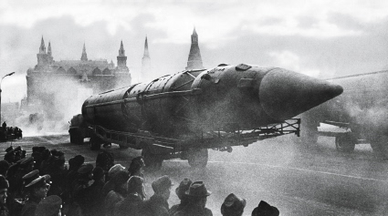
Nuclear missiles on parade in Moscow. The gun that was always on display but never fired.Moscow, 1968 © Sovfoto/UIG via Getty Images.

 Whereas in 2010 obesity and related illnesses killed about 3 million people, terrorists killed a total of 7,697 people across the globe, most of them in developing countries.25 For the average American or European, Coca-Cola poses a far deadlier threat than al-Qaeda.

 In essence, terrorism is a show. Terrorists stage a terrifying spectacle of violence that captures our imagination and makes us feel as if we are sliding back into medieval chaos. Consequently states often feel obliged to react to the theatre of terrorism with a show of security, orchestrating immense displays of force, such as the persecution of entire populations or the invasion of foreign countries. In most cases, this overreaction to terrorism poses a far greater threat to our security than the terrorists themselves.

 By themselves, terrorists are too weak to drag us back to the Middle Ages and re-establish the Jungle Law. They may provoke us, but in the end, it all depends on our reactions.

 The message is not that famine, plague and war have completely disappeared from the face of the earth, and that we should stop worrying about them. Just the opposite.

Acknowledging our past achievements sends a message of hope and responsibility, encouraging us to make even greater efforts in the future.

 appreciating the magnitude of our achievements carries another message: history does not tolerate a vacuum. If incidences of famine, plague and war are decreasing, something is bound to take their place on the human agenda. We had better think very carefully what it is going to be. Otherwise, we might gain complete victory in the old battlefields only to be caught completely unaware on entirely new fronts.

We have managed to bring famine, plague and war under control thanks largely to our phenomenal economic growth, which provides us with abundant food, medicine, energy and raw materials. Yet this same growth destabilises the ecological equilibrium of the planet in myriad ways, which we have only begun to explore.

 Despite all the talk of pollution, global warming and climate change, most countries have yet to make any serious economic or political sacrifices to improve the situation.

  Humans are rarely satisfied with what they already have. 
  
  The most common reaction of the human mind to achievement is not satisfaction, but craving for more.

  Success breeds ambition, and our recent achievements are now pushing humankind to set itself even more daring goals.

   humanity’s next targets are likely to be immortality, happiness and divinity.

### The Last Days of Death

 Struggling against old age and death will merely carry on the time-honoured fight against famine and disease, and manifest the supreme value of contemporary culture: the worth of human life. 
 
 We are constantly reminded that human life is the most sacred thing in the universe.

  The Universal Declaration of Human Rights adopted by the UN after the Second World War – which is perhaps the closest thing we have to a global constitution – categorically states that ‘the right to life’ is humanity’s most fundamental value. Since death clearly violates this right, death is a crime against humanity, and we ought to wage total war against it.
  
  Throughout history, religions and ideologies did not sanctify life itself. They always sanctified something above or beyond earthly existence, and were consequently quite tolerant of death... ...they viewed death as a vital and positive part of the world. Humans died because God decreed it, and their moment of death was a sacred metaphysical experience exploding with meaning.

   Just try to imagine Christianity, Islam or Hinduism in a world without death – which is also a world without heaven, hell or reincarnation.
   
   Modern science and modern culture have an entirely different take on life and death. They don’t think of death as a metaphysical mystery, and they certainly don’t view death as the source of life’s meaning. Rather, for modern people death is a technical problem that we can and should solve.

  Humans always die due to some technical glitch. The heart stops pumping blood. The main artery is clogged by fatty deposits. Cancerous cells spread in the liver. Germs multiply in the lungs. And what is responsible for all these technical problems? Other technical problems. The heart stops pumping blood because not enough oxygen reaches the heart muscle. Cancerous cells spread because a chance genetic mutation rewrote their instructions. Germs settled in my lungs because somebody sneezed on the subway. Nothing metaphysical about it. It is all technical problems.

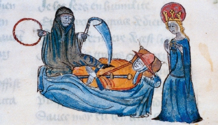
  Death personified as the Grim Reaper in medieval art.‘Death and dying’ from 14th-century French manuscript: Pilgrimage of the Human Life, Bodleian Library, Oxford © Art Media/Print Collector/Getty Images.

Every technical problem has a technical solution

 True, at present we don’t have solutions to all technical problems. But this is precisely why we invest so much time and money in researching cancer, germs, genetics and nanotechnology.

 Even when people die in a hurricane, a car accident or a war, we tend to view it as a technical failure that could and should have been prevented.

  Death has become an almost automatic reason for lawsuits and investigations. ‘How could they have died? Somebody somewhere must have screwed up.’

   Yet because old age and death are the outcome of nothing but particular problems, there is no point at which doctors and scientists are going to stop and declare: ‘Thus far, and not another step. We have overcome tuberculosis and cancer, but we won’t lift a finger to fight Alzheimer’s. People can go on dying from that.’ The Universal Declaration of Human Rights does not say that humans have ‘the right to life until the age of ninety’. It says that every human has a right to life, period. That right isn’t limited by any expiry date.

In 2012 Kurzweil was appointed a director of engineering at Google, and a year later Google launched a sub-company called Calico whose stated mission is "to solve death".

 Google Ventures is investing 36 per cent of its $2 billion portfolio in life sciences start-ups, including several ambitious life-extending projects. Using an American football analogy, Maris explained that in the fight against death, ‘We aren’t trying to gain a few yards. We are trying to win the game.’ Why? Because, says Maris, ‘it is better to live than to die’.

I think there are probably three main modes of approaching [death],’ he explained. ‘You can accept it, you can deny it or you can fight it. I think our society is dominated by people who are into denial or acceptance, and I prefer to fight it.’

 They maintain that anyone possessing a healthy body and a healthy bank account in 2050 will have a serious shot at immortality by cheating death a decade at a time. According to Kurzweil and de Grey, every ten years or so we will march into the clinic and receive a makeover treatment that will not only cure illnesses, but will also regenerate decaying tissues, and upgrade hands, eyes and brains. Before the next treatment is due, doctors will have invented a plethora of new medicines, upgrades and gadgets. If Kurzweil and de Grey are right, there may already be some immortals walking next to you on the street – at least if you happen to be walking down Wall Street or Fifth Avenue.

 In truth they will actually be a-mortal, rather than immortal... ...Which will probably make them the most anxious people in history. We mortals daily take chances with our lives, because we know they are going to end anyhow. So we go on treks in the Himalayas, swim in the sea, and do many other dangerous things like crossing the street or eating out. But if you believe you can live for ever, you would be crazy to gamble on infinity like that.

  In the twentieth century we have almost doubled life expectancy from forty to seventy, so in the twenty-first century we should at least be able to double it again to 150

   Though falling far short of immortality, this would still revolutionise human society. For starters, family structure, marriages and child–parent relationships would be transformed. Today, people still expect to be married ‘till death us do part’, and much of life revolves around having and raising children. Now try to imagine a person with a lifespan of 150 years. Getting married at forty, she still has 110 years to go. Will it be realistic to expect her marriage to last 110 years? Even Catholic fundamentalists might baulk at that

   The current trend of serial marriages is likely to intensify

Today we assume that you learn a profession in your teens and twenties, and then spend the rest of your life in that line of work. You obviously learn new things even in your forties and fifties, but life is generally divided into a learning period followed by a working period. When you live to be 150 that won’t do, especially in a world that is constantly being shaken by new technologies. 
    
People will have much longer careers, and will have to reinvent themselves again and again even at the age of ninety.

At the same time, people will not retire at sixty-five and will not make way for the new generation with its novel ideas and aspirations. The physicist Max Planck famously said that science advances one funeral at a time. He meant that only when one generation passes away do new theories have a chance to root out old ones. This is true not only of science. Think for a moment about your own workplace. No matter whether you are a scholar, journalist, cook or football player, how would you feel if your boss were 120, his ideas were formulated when Victoria was still queen, and he was likely to stay your boss for a couple of decades more?

 In the political sphere the results might be even more sinister... ...if people lived to 150, then in 2016 Stalin would still be ruling in Moscow, going strong at 138,

My own view is that the hopes of eternal youth in the twenty-first century are premature, and whoever takes them too seriously is in for a bitter disappointment. 

It is not easy to live knowing that you are going to die, but it is even harder to believe in immortality and be proven wrong.

Although average life expectancy has doubled over the last hundred years, it is unwarranted to extrapolate and conclude that we can double it again to 150 in the coming century.

those who escaped famine, plague and war could live well into their seventies and eighties, which is the natural life span of Homo sapiens.

In truth, so far modern medicine hasn’t extended our natural life span by a single year. Its great achievement has been to save us from premature death, and allow us to enjoy the full measure of our years

Even if we now overcome cancer, diabetes and the other major killers, it would mean only that almost everyone will get to live to ninety – but it will not be enough to reach 150, let alone 500. For that, medicine will need to re-engineer the most fundamental structures and processes of the human body, and discover how to regenerate organs and tissues. It is by no means clear that we can do that by 2100.

 The scientists who cry immortality are like the boy who cried wolf: sooner or later, the wolf actually comes. 
 
 even if we don’t achieve immortality in our lifetime, the war against death is still likely to be the flagship project of the coming century.

 As long as people die of something, we will strive to overcome it.

 Most scientists and bankers don’t care what they are working on, provided it gives them an opportunity to make new discoveries and greater profits.

  If you are over forty, close your eyes for a minute and try to remember the body you had at twenty-five. Not only how it looked, but above all how it felt. If you could have that body back, how much would you be willing to pay for it? No doubt some people would be happy to forgo the opportunity, but enough customers would pay whatever it takes, constituting a well-nigh infinite market.

 A large part of our artistic creativity, our political commitment and our religious piety is fuelled by the fear of death.
 
 Woody Allen, who has made a fabulous career out of the fear of death, was once asked if he hoped to live on for ever through the silver screen. Allen answered that ‘I’d rather live on in my apartment.’ He went on to add that ‘I don’t want to achieve immortality through my work. I want to achieve it by not dying.’

  Once people think (with or without good reason) that they have a serious chance of escaping death, the desire for life will refuse to go on pulling the rickety wagon of art, ideology and religion, and will sweep forward like an avalanche.

 when science makes significant progress in the war against death, the real battle will shift from the laboratories to the parliaments, courthouses and streets.

  All the wars and conflicts of history might turn out to be but a pale prelude for the real struggle ahead of us: the struggle for eternal youth.

### The Right to Happiness

 The second big project on the human agenda will probably be to find the key to happiness.

 In ancient Greece the philosopher Epicurus explained that worshipping gods is a waste of time, that there is no existence after death, and that happiness is the sole purpose of life.

Scepticism about the afterlife drives humankind to seek not only immortality, but also earthly happiness.

For Epicurus the pursuit of happiness was a personal quest. Modern thinkers, in contrast, tend to see it as a collective project. Without government planning, economic resources and scientific research, individuals will not get far in their quest for happiness.

 Jeremy Bentham declared that the supreme good is ‘the greatest happiness of the greatest number’, and concluded that the sole worthy aim of the state, the market and the scientific community is to increase global happiness.

  Industrialised nations such as Germany, France and Japan established gigantic systems of education, health and welfare, yet these systems were aimed to strengthen the nation rather than ensure individual well-being.

 Schools were founded to produce skilful and obedient citizens who would serve the nation loyally. At eighteen, youths needed to be not only patriotic but also literate, so that they could read the brigadier’s order of the day and draw up tomorrow’s battle plans.

 The same went for the health system. At the end of the nineteenth century countries such as France, Germany and Japan began providing free health care for the masses. They financed vaccinations for infants, balanced diets for children and physical education for teenagers. They drained festering swamps, exterminated mosquitoes and built centralised sewage systems. The aim wasn’t to make people happy, but to make the nation stronger. The country needed sturdy soldiers and workers, healthy women who would give birth to more soldiers and workers, and bureaucrats who came to the office punctually at 8 a.m. instead of lying sick at home.

 the welfare system was originally planned in the interest of the nation rather than of needy individuals. When Otto von Bismarck pioneered state pensions and social security in late nineteenth-century Germany, his chief aim was to ensure the loyalty of the citizens rather than to increase their well-being. You fought for your country when you were eighteen, and paid your taxes when you were forty, because you counted on the state to take care of you when you were seventy

  It’s important to note, however, that the American Declaration of Independence guaranteed the right to the pursuit of happiness, not the right to happiness itself.

 The idea was to reserve for individuals a private sphere of choice, free from state supervision. If I think I’ll be happier marrying John rather than Mary, living in San Francisco rather than Salt Lake City, and working as a bartender rather than a dairy farmer, then it’s my right to pursue happiness my way, and the state shouldn’t intervene even if I make the wrong choice.

  Bentham’s vision has been taken far more seriously. People increasingly believe that the immense systems established more than a century ago to strengthen the nation should actually serve the happiness and well-being of individual citizens. We are not here to serve the state – it is here to serve us. The right to the pursuit of happiness, originally envisaged as a restraint on state power, has imperceptibly morphed into the right to happiness – as if human beings have a natural right to be happy, and anything which makes us dissatisfied is a violation of our basic human rights, so the state should do something about it.

 nowadays thinkers, politicians and even economists are calling to supplement or even replace GDP with GDH – gross domestic happiness

 Production is important because it provides the material basis for happiness.

 When Epicurus defined happiness as the supreme good, he warned his disciples that it is hard work to be happy.

 Epicurus recommended, for example, to eat and drink in moderation, and to curb one’s sexual appetites. In the long run, a deep friendship will make us more content than a frenzied orgy.

  Indeed, it is an ominous sign that despite higher prosperity, comfort and security, the rate of suicide in the developed world is also much higher than in traditional societies.

 In Peru, Guatemala, the Philippines and Albania – developing countries suffering from poverty and political instability – about one person in 100,000 commits suicide each year. In rich and peaceful countries such as Switzerland, France, Japan and New Zealand, twenty-five people per 100,000 take their own lives annually

  in 1985 about nine South Koreans per 100,000 killed themselves, today the annual rate of suicide has more than tripled to thirty per 100,000.

   The average American thus uses sixty times more energy than the average Stone Age hunter-gatherer. Is the average American sixty times happier? We may well be sceptical about such rosy views.

  attaining positive happiness may be far more difficult than abolishing downright suffering.

   The second half of the twentieth century was a golden age for the USA. Victory in the Second World War, followed by an even more decisive victory in the Cold War, turned it into the leading global superpower. Between 1950 and 2000 American GDP grew from $2 trillion to $12 trillion. Real per capita income doubled. The newly invented contraceptive pill made sex freer than ever. Women, gays, African Americans and other minorities finally got a bigger slice of the American pie. A flood of cheap cars, refrigerators, air conditioners, vacuum cleaners, dishwashers, laundry machines, telephones, televisions and computers changed daily life almost beyond recognition. Yet studies have shown that American subjective well-being levels in the 1990s remained roughly the same as they were in the 1950s

 It appears that our happiness bangs against some mysterious glass ceiling that does not allow it to grow despite all our unprecedented accomplishments.

  Achieving real happiness is not going to be much easier than overcoming old age and death.

The glass ceiling of happiness is held in place by two stout pillars, one psychological, the other biological. On the psychological level, happiness depends on expectations rather than objective conditions. We don’t become satisfied by leading a peaceful and prosperous existence. Rather, we become satisfied when reality matches our expectations. The bad news is that as conditions improve, expectations balloon. Dramatic improvements in conditions, as humankind has experienced in recent decades, translate into greater expectations rather than greater contentment

On the biological level, both our expectations and our happiness are determined by our biochemistry, rather than by our economic, social or political situation

 According to Epicurus, we are happy when we feel pleasant sensations and are free from unpleasant ones. Jeremy Bentham similarly maintained that nature gave dominion over man to two masters – pleasure and pain – and they alone determine everything we do, say and think. Bentham’s successor, John Stuart Mill, explained that happiness is nothing but pleasure and freedom from pain, and that beyond pleasure and pain there is no good and no evil. Anyone who tries to deduce good and evil from something else (such as the word of God, or the national interest) is fooling you, and perhaps fooling himself too.

 In the days of Epicurus such talk was blasphemous. In the days of Bentham and Mill it was radical subversion. But in the early twenty-first century this is scientific orthodoxy.

 We never react to events in the outside world, but only to sensations in our own bodies.

  Nobody suffers because she lost her job, because she got divorced or because the government went to war. The only thing that makes people miserable is unpleasant sensations in their own bodies.

   A thousand things may make us angry, but anger is never an abstraction. It is always felt as a sensation of heat and tension in the body, which is what makes anger so infuriating.

   Conversely, science says that nobody is ever made happy by getting a promotion, winning the lottery or even finding true love. People are made happy by one thing and one thing only – pleasant sensations in their bodies.

 Chills run up and down your spine, waves of electricity wash over your body, and it feels as if you are dissolving into millions of exploding energy balls.

  The deeper parts of your mind know nothing about football or about jobs. They know only sensations. If you get a promotion, but for some reason don’t feel any pleasant sensations – you will not feel satisfied. The opposite is also true. If you have just been fired (or lost a decisive football match), but you are experiencing very pleasant sensations (perhaps because you popped some pill), you might still feel on top of the world.
  
  The bad news is that pleasant sensations quickly subside and sooner or later turn into unpleasant ones.

  if last year I received an unexpected promotion at work, I might still be occupying that new position, but the very pleasant sensations I experienced on hearing the news disappeared within hours. If I want to feel those wonderful sensations again, I must get another promotion. And another. And if I don’t get a promotion, I might end up far more bitter and angry than if I had remained a humble pawn.

  This is all the fault of evolution. For countless generations our biochemical system adapted to increasing our chances of survival and reproduction, not our happiness. 
  
  The biochemical system rewards actions conducive to survival and reproduction with pleasant sensations. But these are only an ephemeral sales gimmick. We struggle to get food and mates in order to avoid unpleasant sensations of hunger and to enjoy pleasing tastes and blissful orgasms. But nice tastes and blissful orgasms don’t last very long, and if we want to feel them again we have to go out looking for more food and mates.

  What might have happened if a rare mutation had created a squirrel who, after eating a single nut, enjoys an everlasting sensation of bliss? Technically, this could actually be done by rewiring the squirrel’s brain. Who knows, perhaps it really happened to some lucky squirrel millions of years ago. But if so, that squirrel enjoyed an extremely happy and extremely short life, and that was the end of the rare mutation. For the blissful squirrel would not have bothered to look for more nuts, let alone mates. The rival squirrels, who felt hungry again five minutes after eating a nut, had much better chances of surviving and passing their genes to the next generation. For exactly the same reason, the nuts we humans seek to gather – lucrative jobs, big houses, good-looking partners – seldom satisfy us for long.

  Some may say that this is not so bad, because it isn’t the goal that makes us happy – it’s the journey

  When an animal is looking for something that increases its chances of survival and reproduction (e.g. food, partners or social status), the brain produces sensations of alertness and excitement, which drive the animal to make even greater efforts because they are so very agreeable.

   Humans too may prefer the excitement of the race to resting on the laurels of success. Yet what makes the race so attractive is the exhilarating sensations that go along with it. Nobody would have wanted to climb mountains, play video games or go on blind dates if such activities were accompanied solely by unpleasant sensations of stress, despair or boredom.

   Alas, the exciting sensations of the race are as transient as the blissful sensations of victory... ...Like the rats pressing the pedal again and again, the Don Juans, business tycoons and gamers need a new kick every day. Worse still, here too expectations adapt to conditions, and yesterday’s challenges all too quickly become today’s tedium.

 Perhaps the key to happiness is neither the race nor the gold medal, but rather combining the right doses of excitement and tranquillity; but most of us tend to jump all the way from stress to boredom and back, remaining as discontented with one as with the other.

If science is right and our happiness is determined by our biochemical system, then the only way to ensure lasting contentment is by rigging this system. Forget economic growth, social reforms and political revolutions: in order to raise global happiness levels, we need to manipulate human biochemistry.

 For better or worse, a growing percentage of the population is taking psychiatric medicines on a regular basis, not only to cure debilitating mental illnesses, but also to face more mundane depressions and the occasional blues.

 In the UK the number rose from 92,000 in 1997 to 786,000 in 2012. The original aim had been to treat attention disorders, but today completely healthy kids take such medications to improve their performance and live up to the growing expectations of teachers and parents

  If pupils suffer from attention disorders, stress and low grades, perhaps we ought to blame outdated teaching methods, overcrowded classrooms and an unnaturally fast tempo of life. Maybe we should modify the schools rather than the kids? It is interesting to see how the arguments have evolved.

 Everybody still agreed on one thing: in order to improve education, we need to change the schools. Today, for the first time in history, at least some people think it would be more efficient to change the pupils’ biochemistry

  People drink alcohol to forget, they smoke pot to feel peaceful, they take cocaine and methamphetamines to be sharp and confident, whereas Ecstasy provides ecstatic sensations and LSD sends you to meet Lucy in the Sky with Diamonds. 
  
  What some people hope to get by studying, working or raising a family, others try to obtain far more easily through the right dosage of molecules.

  The state hopes to regulate the biochemical pursuit of happiness, separating ‘bad’ manipulations from ‘good’ ones. The principle is clear: biochemical manipulations that strengthen political stability, social order and economic growth are allowed and even encouraged (e.g. those that calm hyperactive kids in school, or drive anxious soldiers forward into battle). Manipulations that threaten stability and growth are banned. But each year new drugs are born in the research labs of universities, pharmaceutical companies and criminal organisations, and the needs of the state and the market also keep changing. 
  
  As the biochemical pursuit of happiness accelerates, so it will reshape politics, society and economics, and it will become ever harder to bring it under control.

No matter the exact method, gaining happiness through biological manipulation won’t be easy, for it requires altering the fundamental patterns of life. But then it wasn’t easy to overcome famine, plague and war either.

It is far from certain that humankind should invest so much effort in the biochemical pursuit of happiness. Some would argue that happiness simply isn’t important enough, and that it is misguided to regard individual satisfaction as the highest aim of human society. Others may agree that happiness is indeed the supreme good, yet would take issue with the biological definition of happiness as the experience of pleasant sensations.

 Buddha had made an even more radical claim, teaching that the pursuit of pleasant sensations is in fact the very root of suffering. Such sensations are just ephemeral and meaningless vibrations. Even when we experience them, we don’t react to them with contentment; rather, we just crave for more. Hence no matter how many blissful or exciting sensations I may experience, they will never satisfy me.

  the more I crave these pleasant sensations, the more stressed and dissatisfied I will become. To attain real happiness, humans need to slow down the pursuit of pleasant sensations, not accelerate it.This Buddhist view of happiness has a lot in common with the biochemical view.

   pleasant sensations disappear as fast as they arise, and that as long as people crave pleasant sensations without actually experiencing them, they remain dissatisfied.

  this problem has two very different solutions. The biochemical solution is to develop products and treatments that will provide humans with an unending stream of pleasant sensations, so we will never be without them. The Buddha’s suggestion was to reduce our craving for pleasant sensations, and not allow them to control our lives.

   When the mind learns to see our sensations for what they are – ephemeral and meaningless vibrations – we lose interest in pursuing them. 
   
   For what is the point of running after something that disappears as fast as it arises?

   All this is hardly enough, of course. Since Homo sapiens was not adapted by evolution to experience constant pleasure, if that is what humankind nevertheless wants, ice cream and smartphone games will not do. It will be necessary to change our biochemistry and re-engineer our bodies and minds. So we are working on that. You may debate whether it is good or bad, but it seems that the second great project of the twenty-first century – to ensure global happiness – will involve re-engineering Homo sapiens so that it can enjoy everlasting pleasure.

### The Gods of Planet Earth

In seeking bliss and immortality humans are in fact trying to upgrade themselves into gods. Not just because these are divine qualities, but because in order to overcome old age and misery humans will first have to acquire godlike control of their own biological substratum.

 Up till now increasing human power relied mainly on upgrading our external tools. In the future it may rely more on upgrading the human body and mind, or on merging directly with our tools.

there is no reason to think that Sapiens is the last station. Relatively small changes in genes, hormones and neurons were enough to transform Homo erectus – who could produce nothing more impressive than flint knives – into Homo sapiens, who produces spaceships and computers.

 bioengineers will take the old Sapiens body, and intentionally rewrite its genetic code, rewire its brain circuits, alter its biochemical balance, and even grow entirely new limbs. They will thereby create new godlings, who might be as different from us Sapiens as we are different from Homo erectus.

  If an elephant’s brain is in India, its eyes and ears in China and its feet in Australia, then this elephant is most probably dead, and even if it is in some mysterious sense alive, it cannot see, hear or walk. A cyborg, in contrast, could exist in numerous places at the same time. A cyborg doctor could perform emergency surgeries in Tokyo, in Chicago and in a space station on Mars, without ever leaving her Stockholm office

   If you wish, you can already remote-control electric devices in your house using an electric ‘mind-reading’ helmet. The helmet requires no brain implants. It functions by reading the electric signals passing through your scalp. If you want to turn on the light in the kitchen, you just wear the helmet, imagine some preprogrammed mental sign (e.g. imagine your right hand moving), and the switch turns on. You can buy such helmets online for a mere $400

Neural networks will be replaced by intelligent software, which could surf both the virtual and non-virtual worlds, free from the limitations of organic chemistry

 After 4 billion years of wandering inside the kingdom of organic compounds, life will break out into the vastness of the inorganic realm, and will take shapes that we cannot envision even in our wildest dreams.

  For as difficult as it is to predict the impact of new technologies in fields like transportation, communication and energy, technologies for upgrading humans pose a completely different kind of challenge. Since they can be used to transform human minds and desires, people possessing present-day minds and desires by definition cannot fathom their implications.

  once technology enables us to re-engineer human minds, Homo sapiens will disappear, human history will come to an end and a completely new kind of process will begin, which people like you and me cannot comprehend.

   There are many wise answers to the question, ‘What would people with minds like ours do with biotechnology?’ Yet there are no good answers to the question, "What would beings with a different kind of mind do with biotechnology?"

 In the twenty-first century, the third big project of humankind will be to acquire for us divine powers of creation and destruction, and upgrade Homo sapiens into Homo deus.

 If this sounds unscientific or downright eccentric, it is because people often misunderstand the meaning of divinity. Divinity isn’t a vague metaphysical quality. And it isn’t the same as omnipotence. When speaking of upgrading humans into gods, think more in terms of Greek gods or Hindu devas rather than the omnipotent biblical sky father.

 Certain traditional abilities that were considered divine for many millennia have today become so commonplace that we hardly think about them. The average person now moves and communicates across distances much more easily than the Greek, Hindu or African gods of old.

 In ancient agricultural societies, most religions revolved not around metaphysical questions and the afterlife, but around the very mundane issue of increasing agricultural output.

  Thanks to artificial fertilisers, industrial insecticides and genetically modified crops, agricultural production nowadays outstrips the highest expectations ancient farmers had of their gods

  We can be quite certain that humans will make a bid for divinity, because humans have many reasons to desire such an upgrade, and many ways to achieve it.

   Homo sapiens is not going to be exterminated by a robot revolt. Rather, Homo sapiens is likely to upgrade itself step by step, merging with robots and computers in the process, until our descendants will look back and realise that they are no longer the kind of animal that wrote the Bible, built the Great Wall of China and laughed at Charlie Chaplin’s antics.

In pursuit of health, happiness and power, humans will gradually change first one of their features and then another, and another, until they will no longer be human.

### Can Someone Please Hit the Brakes?

A friend once told me that what she fears most about growing old is becoming irrelevant, turning into a nostalgic old woman who cannot understand the world around her, or contribute much to it. This is what we fear collectively, as a species, when we hear of superhumans. We sense that in such a world, our identity, our dreams and even our fears will be irrelevant, and we will have nothing more to contribute.

 Whatever you are today – be it a devout Hindu cricket player or an aspiring lesbian journalist – in an upgraded world you will feel like a Neanderthal hunter in Wall Street. You won’t belong.

  Even if gods don’t walk our streets by 2100, the attempt to upgrade Homo sapiens is likely to change the world beyond recognition in this century.

  If you speak with the experts, many of them will tell you that we are still very far away from genetically engineered babies or human-level artificial intelligence. But most experts think on a timescale of academic grants and college jobs. Hence, ‘very far away’ may mean twenty years, and ‘never’ may denote no more than fifty.

   People are living much longer than expected, and there is not enough money to pay for their pensions and medical treatment. 
   
   As seventy threatens to become the new forty, experts are calling to raise the retirement age, and to restructure the entire job market.

   When people realise how fast we are rushing towards the great unknown, and that they cannot count even on death to shield them from it, their reaction is to hope that somebody will hit the brakes and slow us down

Nobody knows where the brakes are. While some experts are familiar with developments in one field, such as artificial intelligence, nanotechnology, big data or genetics, no one is an expert on everything. No one is therefore capable of connecting all the dots and seeing the full picture.

 Different fields influence one another in such intricate ways that even the best minds cannot fathom how breakthroughs in artificial intelligence might impact nanotechnology, or vice versa.

  Since no one understands the system any more, no one can stop it.

   the modern economy needs constant and indefinite growth in order to survive. If growth ever stops, the economy won’t settle down to some cosy equilibrium; it will fall to pieces. That’s why capitalism encourages us to seek immortality, happiness and divinity.

   Well, if we need limitless projects, why not settle for bliss and immortality, and at least put aside the frightening quest for superhuman powers? Because it is inextricable from the other two. When you develop bionic legs that enable paraplegics to walk again, you can also use the same technology to upgrade healthy people.

   No clear line separates healing from upgrading. 
   
   Medicine almost always begins by saving people from falling below the norm, but the same tools and know-how can then be used to surpass the norm.

   What happens to particular drugs can also happen to entire fields of medicine. Modern plastic surgery was born in the First World War, when Harold Gillies began treating facial injuries in the Aldershot military hospital. When the war was over, surgeons discovered that the same techniques could also turn perfectly healthy but ugly noses into more beautiful specimens. Though plastic surgery continued to help the sick and wounded, it devoted increasing attention to upgrading the healthy.

  Sexual reproduction is a lottery

   why not rig the lottery? Fertilise several eggs, and choose the one with the best combination. Once stem-cell research enables us to create an unlimited supply of human embryos on the cheap, you can select your optimal baby from among hundreds of candidates, all carrying your DNA, all perfectly natural, and none requiring any futuristic genetic engineering.

  why not rig the lottery? Fertilise several eggs, and choose the one with the best combination. Once stem-cell research enables us to create an unlimited supply of human embryos on the cheap, you can select your optimal baby from among hundreds of candidates, all carrying your DNA, all perfectly natural, and none requiring any futuristic genetic engineering.

   In 2000 Sharon Saarinen from West Bloomfield, Michigan, gave birth to a healthy baby girl, Alana. Alana’s nuclear DNA came from her mother, Sharon, and her father, Paul, but her mitochondrial DNA came from another woman. From a purely technical perspective, Alana has three biological parents. A year later, in 2001, the US government banned this treatment, due to safety and ethical concerns

 Following selection and replacement, the next potential step is amendment. Once it becomes possible to amend deadly genes, why go through the hassle of inserting some foreign DNA, when you can just rewrite the code and turn a dangerous mutant gene into its benign version? 
 
 Then we might start using the same mechanism to fix not just lethal genes, but also those responsible for less deadly illnesses, for autism, for stupidity and for obesity. 
 
 Who would like his or her child to suffer from any of these? Suppose a genetic test indicates that your would-be daughter will in all likelihood be smart, beautiful and kind – but will suffer from chronic depression. Wouldn’t you want to save her from years of misery by a quick and painless intervention in the test tube?

 And while you are at it, why not give the child a little push? Life is hard and challenging even for healthy people. So it would surely come in handy if the little girl had a stronger-than-normal immune system, an above-average memory or a particularly sunny disposition. And even if you don’t want that for your child – what if the neighbours are doing it for theirs? Would you have your child lag behind? And if the government forbids all citizens from engineering their babies, what if the North Koreans are doing it and producing amazing geniuses, artists and athletes that far outperform ours? And like that, in baby steps, we are on our way to a genetic child catalogue.
 
 Healing is the initial justification for every upgrade.

  When we successfully connect brains and computers, will we use this technology only to cure schizophrenia? If anybody really believes this, then they may know a great deal about brains and computers, but far less about the human psyche and human society

   Designer babies may one day become as technologically feasible as murdering people to harvest their organs – yet remain as peripheral.

Precisely because we have some choice regarding the use of new technologies, we had better understand what is happening and make up our minds about it before it makes up our minds for us.

### The Paradox of Knowledge

 Even if famine, plague and war become less prevalent, billions of humans in developing countries and seedy neighbourhoods will continue to deal with poverty, illness and violence even as the elites are already reaching for eternal youth and godlike powers

  Those living in palaces have always had different agendas to those living in shacks, and that is unlikely to change in the twenty-first century.

 Adopting these particular projects might be a big mistake. But history is full of big mistakes. Given our past record and our current values, we are likely to reach out for bliss, divinity and immortality – even if it kills us.

 Some complex systems, such as the weather, are oblivious to our predictions. The process of human development, in contrast, reacts to them. Indeed, the better our forecasts, the more reactions they engender. 
 
 Hence paradoxically, as we accumulate more data and increase our computing power, events become wilder and more unexpected. The more we know, the less we can predict.

 We may know how the economy functioned in the past – but we no longer understand how it functions in the present, not to mention the future.

Marx forgot that capitalists know how to read. At first only a handful of disciples took Marx seriously and read his writings. But as these socialist firebrands gained adherents and power, the capitalists became alarmed. They too perused Das Kapital, adopting many of the tools and insights of Marxist analysis.

As people adopted the Marxist diagnosis, they changed their behaviour accordingly. Capitalists in countries such as Britain and France strove to better the lot of the workers, strengthen their national consciousness and integrate them into the political system. Consequently when workers began voting in elections and Labour gained power in one country after another, the capitalists could still sleep soundly in their beds. As a result, Marx’s predictions came to naught.

This is the paradox of historical knowledge. Knowledge that does not change behaviour is useless. But knowledge that changes behaviour quickly loses its relevance. 

The more data we have and the better we understand history, the faster history alters its course, and the faster our knowledge becomes outdated.

 Today our knowledge is increasing at breakneck speed, and theoretically we should understand the world better and better. But the very opposite is happening. Our new-found knowledge leads to faster economic, social and political changes; in an attempt to understand what is happening, we accelerate the accumulation of knowledge, which leads only to faster and greater upheavals. Consequently we are less and less able to make sense of the present or forecast the future.

### A Brief History of Lawns

 It often seems that the chief aim of science is to predict the future – meteorologists are expected to forecast whether tomorrow will bring rain or sunshine; economists should know whether devaluing the currency will avert or precipitate an economic crisis; good doctors foresee whether chemotherapy or radiation therapy will be more successful in curing lung cancer.

 It is a waste of time to study Hannibal’s tactics in the Second Punic War so as to copy them in the Third World War. What worked well in cavalry battles will not necessarily be of much benefit in cyber warfare.

 the study of history aims above all to make us aware of possibilities we don’t normally consider. 
 
 Historians study the past not in order to repeat it, but in order to be liberated from it.
 
 Each and every one of us has been born into a given historical reality, ruled by particular norms and values, and managed by a unique economic and political system. We take this reality for granted, thinking it is natural, inevitable and immutable. 
 
 We forget that our world was created by an accidental chain of events, and that history shaped not only our technology, politics and society, but also our thoughts, fears and dreams. The cold hand of the past emerges from the grave of our ancestors, grips us by the neck and directs our gaze towards a single future. We have felt that grip from the moment we were born, so we assume that it is a natural and inescapable part of who we are. Therefore we seldom try to shake ourselves free, and envision alternative futures.

 Studying history will not tell us what to choose, but at least it gives us more options.
 
 Movements seeking to change the world often begin by rewriting history, thereby enabling people to reimagine the future.

 This is why Marxists recount the history of capitalism; why feminists study the formation of patriarchal societies; and why African Americans commemorate the horrors of the slave trade. They aim not to perpetuate the past, but rather to be liberated from it.

 The bigger and neater the lawn, the more powerful the dynasty. If you came to visit a duke and saw that his lawn was in bad shape, you knew he was in trouble

 Humans thereby came to identify lawns with political power, social status and economic wealth. No wonder that in the nineteenth century the rising bourgeoisie enthusiastically adopted the lawn. At first only bankers, lawyers and industrialists could afford such luxuries at their private residences. Yet when the Industrial Revolution broadened the middle class and gave rise to the lawnmower and then the automatic sprinkler, millions of families could suddenly afford a home turf. In American suburbia a spick-and-span lawn switched from being a rich person’s luxury into a middle-class necessity.

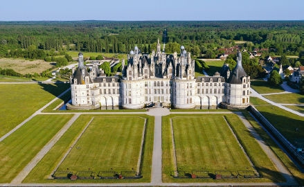
  The lawns of Château de Chambord, in the Loire Valley. King François I built it in the early sixteenth century. This is where it all began.

 
  A welcoming ceremony in honour of Queen Elizabeth II – on the White House lawn.

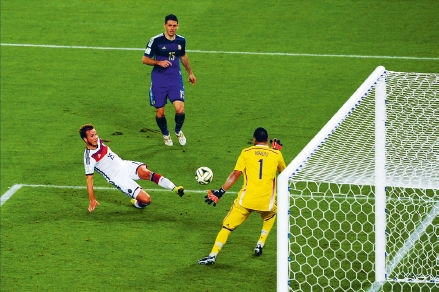
 Mario Götze scores the decisive goal, giving Germany the World Cup in 2014 – on the Maracanã lawn.

Petit-bourgeois paradise.

 when you now come to plan your dream house you might think twice about having a lawn in the front yard. You are of course still free to do it. But you are also free to shake off the cultural cargo bequeathed to you by European dukes, capitalist moguls and the Simpsons – and imagine for yourself a Japanese rock garden, or some altogether new creation. This is the best reason to learn history: not in order to predict the future, but to free yourself of the past and imagine alternative destinies

  this is not total freedom – we cannot avoid being shaped by the past. But some freedom is better than none.

### A Gun in Act I

 For 300 years the world has been dominated by humanism, which sanctifies the life, happiness and power of Homo sapiens. The attempt to gain immortality, bliss and divinity merely takes the long-standing humanist ideals to their logical conclusion

 Yet I would now like to place something else on the table: a gun. A gun that appears in Act I, to fire in Act III. The following chapters discuss how humanism – the worship of humankind – has conquered the world. Yet the rise of humanism also contains the seeds of its downfall. While the attempt to upgrade humans into gods takes humanism to its logical conclusion, it simultaneously exposes humanism’s inherent flaws. If you start with a flawed ideal, you often appreciate its defects only when the ideal is close to realisation.

  Due to similar humanist beliefs, in the twenty-first century we are likely to push humankind as a whole beyond its limits. The same technologies that can upgrade humans into gods might also make humans irrelevant. For example, computers powerful enough to understand and overcome the mechanisms of ageing and death will probably also be powerful enough to replace humans in any and all tasks.

  At present it might seem that immortality, bliss and divinity occupy the top slots on our agenda. But once we come nearer to achieving these goals the resulting upheavals are likely to deflect us towards entirely different destinations.

  we need to go back and investigate who Homo sapiens really is, how humanism became the dominant world religion and why attempting to fulfil the humanist dream is likely to cause its disintegration. This is the basic plan of the book.

  The first part of the book looks at the relationship between Homo sapiens and other animals, in an attempt to comprehend what makes our species so special.

   Homo sapiens does its best to forget the fact, but it is an animal.

  the relationship between humans and animals is the best model we have for future relations between superhumans and humans.

  Based on the conclusions of this first part, the second part of the book examines the bizarre world Homo sapiens has created in the last millennia, and the path that took us to our present crossroads.

  The third and last part of the book comes back to the early twenty-first century. Based on a much deeper understanding of humankind and of the humanist creed, it describes our current predicament and our possible futures.

   If you told people in the Middle Ages that within a few centuries God will be dead, they would have been horrified. ‘How can we live without God? Who will give life meaning and protect us from chaos?’

People are usually afraid of change because they fear the unknown. 

the single greatest constant of history is that everything changes.

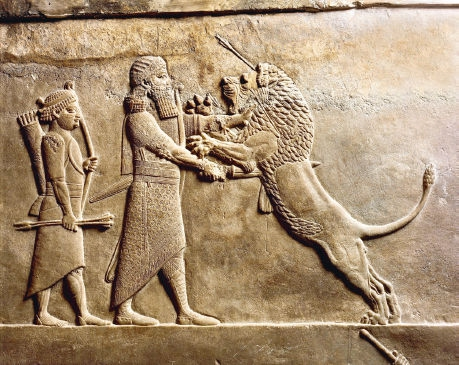
King Ashurbanipal of Assyria slaying a lion: mastering the animal kingdom.

## 4. PART I Homo Sapiens Conquers the World

What is the difference between humans and all other animals?

How did our species conquer the world?

Is Homo sapiens a superior life form, or just the local bully?

## 1. 2 The Anthropocene

With regard to other animals, humans have long since become gods. We don’t like to reflect on this too deeply, because we have not been particularly just or merciful gods.

 Our televisions, books, fantasies and nightmares are still full of them, but the Simbas, Shere Khans and Big Bad Wolves of our planet are disappearing. 
 
 The world is populated mainly by humans and their domesticated animals.

 Altogether about 200,000 wild wolves still roam the earth, but there are more than 400 million domesticated dogs.

  At present, more than 90 per cent of the large animals of the world (i.e. those weighing more than a few kilograms) are either humans or domesticated animals.

  Officially, we live in the Holocene epoch. Yet it may be better to call the last 70,000 years the Anthropocene epoch: the epoch of humanity.

Since the appearance of life, about 4 billion years ago, never has a single species changed the global ecology all by itself. Though there had been no lack of ecological revolutions and mass-extinction events, these were not caused by the actions of a particular lizard, bat or fungus. Rather, they were caused by the workings of mighty natural forces such as climate change, tectonic plate movement, volcanic eruptions and asteroid collisions.

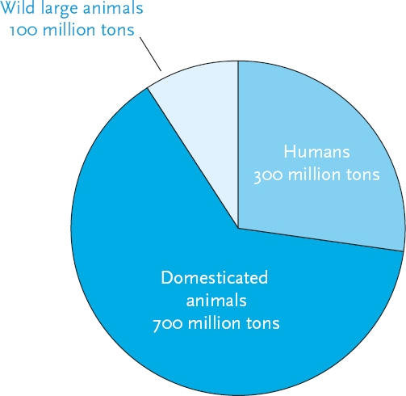
Pie chart of global biomass of large animals.

 Instead of fearing asteroids, we should fear ourselves.

  Within a century, our impact may surpass that of the asteroid that killed off the dinosaurs 65 million years ago.
  
  That asteroid changed the trajectory of terrestrial evolution, but not its fundamental rules, which have remained fixed since the appearance of the first organisms 4 billion years ago.

humankind is poised to replace natural selection with intelligent design, and to extend life from the organic realm into the inorganic.

 In the Anthropocene, the planet became for the first time a single ecological unit. Australia, Europe and America continued to have different climates and topographies, yet humans caused organisms from throughout the world to mingle on a regular basis, irrespective of distance and geography

 Sheep, wheat, rats and flu viruses that humans brought to Australia during the last 300 years are today far more important to its ecology than the native kangaroos and koalas.

 Already tens of thousands of years ago, when our Stone Age ancestors spread from East Africa to the four corners of the earth, they changed the flora and fauna of every continent and island on which they settled. They drove to extinction all the other human species of the world, 90 per cent of the large animals of Australia, 75 per cent of the large mammals of America and about 50 per cent of all the large land mammals of the planet – and all before they planted the first wheat field, shaped the first metal tool, wrote the first text or struck the first coin. Large animals were the main victims because they were relatively few, and they bred slowly

 Not that our ancestors planned on wiping out the mammoths; they were simply unaware of the consequences of their actions.

### The Serpent’s Children

Anthropological and archaeological evidence indicates that archaic hunter-gatherers were probably animists: they believed that there was no essential gap separating humans from other animals.

 when a Nayaka walking in the jungle encounters a dangerous animal such as a tiger, snake or elephant, he or she might address the animal and say: ‘You live in the forest. I too live here in the forest. You came here to eat, and I too came here to gather roots and tubers. I didn’t come to hurt you.’

  Most of us automatically see animals as essentially different and inferior. This is because even our most ancient traditions were created thousands of years after the end of the hunter-gatherer era. The Old Testament, for example, was written down in the first millennium BC, and its oldest stories reflect the realities of the second millennium BC. But in the Middle East the age of the hunter-gatherers ended more than 7,000 years earlier. It is hardly surprising, therefore, that the Bible rejects animistic beliefs and its only animistic story appears right at the beginning, as a dire warning. The Bible is a long book, bursting with miracles, wonders and marvels. Yet the only time an animal initiates a conversation with a human is when the serpent tempts Eve to eat the forbidden fruit of knowledge

The expulsion from Eden bears a striking resemblance to the Agricultural Revolution. Instead of allowing Adam to keep gathering wild fruits, an angry God condemns him ‘to eat bread by the sweat of your brow’. It might be no coincidence, then, that biblical animals spoke with humans only in the pre-agricultural era of Eden.

 Many animist cultures believed that humans descended from animals, including from snakes and other reptiles. Most Australian Aborigines believed that the Rainbow Serpent created the world

![Paradise lost (the Sistine Chapel). The serpent – who sports a human upper body – initiates the entire chain of events. While the first two chapters of Genesis are dominated by divine monologues (‘and God said . . . and God said . . . and God said . . .’), in the third chapter we finally get a dialogue – between Eve and the serpent (‘and the serpent said unto the woman . . . and the woman said unto the serpent . . .’). This unique conversation between a human and an animal leads to the fall of humanity and our expulsion from Eden.](./assets/paradise-lost.jpg)
  Paradise lost (the Sistine Chapel). The serpent – who sports a human upper body – initiates the entire chain of events. While the first two chapters of Genesis are dominated by divine monologues (‘and God said . . . and God said . . . and God said . . .’), in the third chapter we finally get a dialogue – between Eve and the serpent (‘and the serpent said unto the woman . . . and the woman said unto the serpent . . .’). This unique conversation between a human and an animal leads to the fall of humanity and our expulsion from Eden.

   While animists saw humans as just another kind of animal, the Bible argues that humans are a unique creation, and any attempt to acknowledge the animal within us denies God’s power and authority.

 Indeed, when modern humans discovered that they actually evolved from reptiles, they rebelled against God and stopped listening to Him – or even believing in His existence.

### Ancestral Needs

 The advent of farming produced new waves of mass extinctions, but more importantly, it created a completely new life form on earth: domesticated animals.

  Today more than 90 per cent of all large animals are domesticated.

 domesticated species paid for their unparalleled collective success with unprecedented individual suffering.

  Wild boars spend their days searching for food, water and shelter, and are constantly threatened by lions, parasites and floods. Domesticated pigs, in contrast, enjoy food, water and shelter provided by humans, who also treat their diseases and protect them against predators and natural disasters. True, most pigs sooner or later find themselves in the slaughterhouse. Yet does that make their fate any worse than the fate of wild boars? Is it better to be devoured by a lion than slaughtered by a man? Are crocodile teeth less deadly than steel blades?

What makes the fate of domesticated farm animals particularly harsh is not just the way they die, but above all the way they live. 

Two competing factors have shaped the living conditions of farm animals from ancient times to the present day: human desires and animal needs. Thus humans raise pigs in order to get meat, but if they want a steady supply of meat, they must ensure the long-term survival and reproduction of the pigs. 

Theoretically this should have protected the animals from extreme forms of cruelty. If a farmer did not take good care of his pigs, they would soon die without offspring and the farmer would starve.Unfortunately, humans can cause tremendous suffering to farm animals in various ways, even while ensuring their survival and reproduction.

 The theory of evolution maintains that all instincts, drives and emotions have evolved in the sole interest of survival and reproduction. If so, doesn’t the continuous reproduction of farm animals prove that all their real needs are met? How can a pig have a ‘need’ that is not really needed for his survival and reproduction?

  all instincts, drives and emotions evolved in order to meet the evolutionary pressures of survival and reproduction.

   For animals and humans alike, agriculture changed selection pressures almost overnight, but it did not change their physical, emotional and social drives.

humans in Europe and western Asia evolved the ability to digest cows’ milk, while cows lost their fear of humans, and today produce far more milk than their wild ancestors. Yet these are superficial alterations. The deep sensory and emotional structures of cows, pigs and humans alike haven’t changed much since the Stone Age.

 Why do young men drive recklessly, get involved in violent arguments and hack confidential Internet sites? Because they are following ancient genetic decrees that might be useless and even counterproductive today, but that made good evolutionary sense 70,000 years ago. 
 
  A young hunter who risked his life chasing a mammoth outshone all his competitors and won the hand of the local beauty; and we are now stuck with his macho genes.

The descendants of wild boars – domesticated pigs – inherited their intelligence, curiosity and social skills. Like wild boars, domesticated pigs communicate using a rich variety of vocal and olfactory signals: mother sows recognise the unique squeaks of their piglets, whereas two-day-old piglets already differentiate their mother’s calls from those of other sows.

Professor Stanley Curtis of the Pennsylvania State University trained two pigs – named Hamlet and Omelette – to control a special joystick with their snouts, and found that the pigs soon rivalled primates in learning and playing simple computer games.

The human farmers take care of everything the sow needs in order to survive and reproduce. She is given enough food, vaccinated against diseases, protected against the elements and artificially inseminated. From an objective perspective, the sow no longer needs to explore her surroundings, socialise with other pigs, bond with her piglets or even walk. But from a subjective perspective, the sow still feels very strong urges to do all of these things, and if these urges are not fulfilled she suffers greatly. Sows locked in gestation crates typically display acute frustration alternating with extreme despair.

This is the basic lesson of evolutionary psychology: a need shaped thousands of generations ago continues to be felt subjectively even if it is no longer necessary for survival and reproduction in the present.

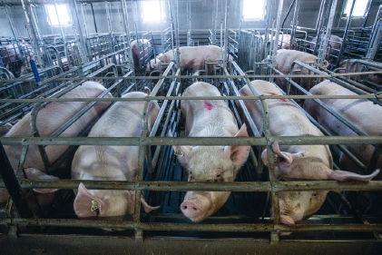
Sows confined in gestation crates. These highly social and intelligent beings spend most of their lives in this condition, as if they were already sausages.

### Organisms are Algorithms

attributing emotions to pigs doesn’t humanise them. It ‘mammalises’ them. For emotions are not a uniquely human quality – they are common to all mammals (as well as to all birds and probably to some reptiles and even fish).

emotions are biochemical algorithms that are vital for the survival and reproduction of all mammals.

 the twenty-first century will be dominated by algorithms. 
 
 ‘Algorithm’ is arguably the single most important concept in our world. If we want to understand our life and our future, we should make every effort to understand what an algorithm is, and how algorithms are connected with emotions.
 
 An algorithm is a methodical set of steps that can be used to make calculations, resolve problems and reach decisions. 
 
 An algorithm isn’t a particular calculation, but the method followed when making the calculation.

  you are probably familiar with beverage vending machines. Such machines usually have a slot for coins, an opening for cups, and rows of buttons. The first row has buttons for coffee, tea and cocoa. The second row is marked: no sugar, one spoon of sugar, two spoons of sugar. The third row indicates milk, soya milk, no milk. A man approaches the machine, inserts a coin into the slot and presses the buttons marked ‘tea’, ‘one sugar’ and ‘milk’. The machine kicks into action, following a precise set of steps. It drops a tea bag into a cup, pours boiling water, adds a spoonful of sugar and milk, and ding! A nice cup of tea emerges. This is an algorithm.
  
  Over the last few decades biologists have reached the firm conclusion that the man pressing the buttons and drinking the tea is also an algorithm.

 Humans are algorithms that produce not cups of tea, but copies of themselves

 The prize for making correct calculations is correspondingly greater. The prize is the very survival of the baboon. A timid baboon – one whose algorithms overestimate dangers – will starve to death, and the genes that shaped these cowardly algorithms will perish with him. A rash baboon – one whose algorithms underestimate dangers – will fall prey to the lion, and his reckless genes will also fail to make it to the next generation. These algorithms undergo constant quality control by natural selection. Only animals that calculate probabilities correctly leave offspring behind.

  the baboon’s entire body is the calculator.

   The baboon feels hunger, he feels fear and trembling at the sight of the lion, and he feels his mouth watering at the sight of the bananas. Within a split second, he experiences a storm of sensations, emotions and desires, which is nothing but the process of calculation.

  Sometimes the probabilities match so evenly that it is hard to decide. This too will manifest itself as a feeling. The baboon will feel confused and indecisive.

 Natural selection evolved passion and disgust as quick algorithms for evaluating reproduction odds. Beauty means ‘good chances for having successful offspring’. When a woman sees a man and thinks, ‘Wow! He is gorgeous!’ and when a peahen sees a peacock and thinks, ‘Jesus! What a tail!’ they are doing something similar to the automatic vending machine. As light reflected from the male’s body hits their retinas, extremely powerful algorithms honed by millions of years of evolution kick in. Within a few milliseconds the algorithms convert tiny cues in the male’s external appearance into reproduction probabilities, and reach the conclusion: ‘In all likelihood, this is a very healthy and fertile male, with excellent genes.

  99 per cent of our decisions – including the most important life choices concerning spouses, careers and habitats – are made by the highly refined algorithms we call sensations, emotions and desires.

  Because these algorithms control the lives of all mammals and birds (and probably some reptiles and even fish), when humans, baboons and pigs feel fear, similar neurological processes take place in similar brain areas. It is therefore likely that frightened humans, frightened baboons and frightened pigs have similar experiences.
  
  There are differences too, of course. Pigs don’t seem to experience the extremes of compassion and cruelty that characterise Homo sapiens, nor the sense of wonder that overwhelms a human gazing up at the infinitude of a starry sky. It is likely that there are also opposite examples, of swinish emotions unfamiliar to humans, but I cannot name any, for obvious reasons.

  one core emotion is apparently shared by all mammals: the mother–infant bond.

   The word ‘mammal’ comes from the Latin mamma, meaning breast

  Conversely, a sow, cow or bitch that due to some rare mutation does not care about her young may live a long and comfortable life, but her genes will not pass to the next generation. The same logic is true among giraffes, bats, whales and porcupines. We can argue about other emotions, but since mammal youngsters cannot survive without motherly care, it is evident that motherly love and a strong mother–infant bond characterise all mammals.

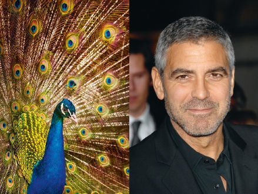
A peacock and a man. When you look at these images, data on proportions, colours and sizes gets processed by your biochemical algorithms, causing you to feel attraction, repulsion or indifference.

   Not long ago psychologists doubted the importance of the emotional bond between parents and children even among humans. In the first half of the twentieth century, and despite the influence of Freudian theories, the dominant behaviourist school argued that relations between parents and children were shaped by material feedback

  children needed mainly food, shelter and medical care; and that children bonded with their parents simply because the latter provide these material needs. Children who demanded warmth, hugs and kisses were thought to be ‘spoiled’. Childcare experts warned that children who were hugged and kissed by their parents would grow up to be needy, egotistical and insecure adults

 The popular magazine Infant Care explained that the secret of raising children is to maintain discipline and to provide the children’s material needs according to a strict daily schedule. A 1929 article instructed parents that if an infant cries out for food before the normal feeding time, ‘Do not hold him, nor rock him to stop his crying, and do not nurse him until the exact hour for the feeding comes.

 It will not hurt the baby, even the tiny baby, to cry

 Only in the 1950s and 1960s did a growing consensus of experts abandon these strict behaviourist theories and acknowledge the central importance of emotional needs. In a series of famous (and shockingly cruel) experiments, the psychologist Harry Harlow separated infant monkeys from their mothers shortly after birth, and isolated them in small cages. When given a choice between a metal dummy-mother fitted with a milk bottle, and a soft cloth-covered dummy with no milk, the baby monkeys clung to the barren cloth mother for all they were worth.

  mammals can’t live on food alone. They need emotional bonds too. 
  
  Millions of years of evolution preprogrammed the monkeys with an overwhelming desire for emotional bonding.

  How could experts fail to appreciate that children have emotional needs, and that their mental and physical health depends as much on providing for these needs as on food, shelter and medicines? Yet when it comes to other mammals we keep denying the obvious.

  farmers throughout history took care of the material needs of piglets, calves and kids, but tended to ignore their emotional needs.

   the meat and dairy industries are based on breaking the most fundamental emotional bond in the mammal kingdom.

### The Agricultural Deal

How did farmers justify their behaviour?... ...They justified their actions in the name of new theist religions, which mushroomed and spread in the wake of the Agricultural Revolution.

Biblical Judaism, for instance, catered to peasants and shepherds. Most of its commandments dealt with farming and village life, and its major holidays were harvest festivals. People today imagine the ancient temple in Jerusalem as a kind of big synagogue where priests clad in snow-white robes welcomed devout pilgrims, melodious choirs sang psalms and incense perfumed the air. In reality, it looked much more like a cross between a slaughterhouse and a barbecue joint than a modern synagogue. The pilgrims did not come empty-handed. They brought with them a never-ending stream of sheep, goats, chickens and other animals, which were sacrificed at the god’s altar and then cooked and eaten

 A modern Jewish family that celebrates a holiday by having a barbecue on their front lawn is much closer to the spirit of biblical times than an orthodox family that spends the time studying scriptures in a synagogue.

 Animist religions had previously depicted the universe as a grand Chinese opera with a limitless cast of colourful actors. Elephants and oak trees, crocodiles and rivers, mountains and frogs, ghosts and fairies, angels and demons – each had a role in the cosmic opera. Theist religions rewrote the script, turning the universe into a bleak Ibsen drama with just two main characters: man and God.

 We normally think that theist religions sanctified the great gods. We tend to forget that they sanctified humans, too.

The gods, meanwhile, were given two related roles to play. Firstly, they explained what is so special about Sapiens and why humans should dominate and exploit all other organisms. Christianity, for example, maintained that humans hold sway over the rest of creation because the Creator charged them with that authority.

 since animals have no soul, they are mere extras.

 Secondly, the gods had to mediate between humans and the ecosystem. In the animistic cosmos, everyone talked with everyone directly. If you needed something from the caribou, the fig trees, the clouds or the rocks, you addressed them yourself. In the theist cosmos, all non-human entities were silenced. Consequently you could no longer talk with trees and animals. What to do, then, when you wanted the trees to give more fruits, the cows to give more milk, the clouds to bring more rain and the locusts to stay away from your crops? That’s where the gods entered the picture.

 Today in Nepal, devotees of the goddess Gadhimai celebrate her festival every five years in the village of Bariyapur. A record was set in 2009 when 250,000 animals were sacrificed to the goddess. A local driver explained to a visiting British journalist that ‘If we want anything, and we come here with an offering to the goddess, within five years all our dreams will be fulfilled.

  The Bible thinks it is perfectly all right to destroy all animals as punishment for the crimes of Homo sapiens, as if the existence of giraffes, pelicans and ladybirds has lost all purpose if humans misbehave. 
  
 The Bible could not imagine a scenario in which God repents having created Homo sapiens, wipes this sinful ape off the face of the earth, and then spends eternity enjoying the antics of ostriches, kangaroos and panda bears.

A Talmudic tale recounts how on the way to the slaughterhouse, a calf escaped and sought refuge with Rabbi Yehuda HaNasi, one of the founders of rabbinical Judaism. The calf tucked his head under the rabbi’s flowing robes and started crying. Yet the rabbi pushed the calf away, saying, ‘Go. You were created for that very purpose.’ Since the rabbi showed no mercy, God punished him, and he suffered from a painful illness for thirteen years. Then, one day, a servant cleaning the rabbi’s house found some newborn rats and began sweeping them out. Rabbi Yehuda rushed to save the helpless creatures, instructing the servant to leave them in peace, because ‘God is good to all, and has compassion on all he has made’ (Psalms 145:9). Since the rabbi showed compassion to these rats, God showed compassion to the rabbi, and he was cured of his illness

Other religions, particularly Jainism, Buddhism and Hinduism, have demonstrated even greater empathy to animals. They emphasise the connection between humans and the rest of the ecosystem, and their foremost ethical commandment has been to avoid killing any living being. Whereas the biblical ‘Thou shalt not kill’ covered only humans, the ancient Indian principle of ahimsa (non-violence) extends to every sentient being

 Hinduism, for example, has sanctified cows and forbidden eating beef, but has also provided the ultimate justification for the dairy industry, alleging that cows are generous creatures, and positively yearn to share their milk with humankind.

 Humans thus committed themselves to an ‘agricultural deal’. According to this deal, cosmic forces gave humans command over other animals, on condition that humans fulfilled certain obligations towards the gods, towards nature and towards the animals themselves. It was easy to believe in the existence of such a cosmic compact, because it reflected the daily routine of farming life.
 
 Hunter-gatherers had not seen themselves as superior beings because they were seldom aware of their impact on the ecosystem. A typical band numbered in the dozens, it was surrounded by thousands of wild animals, and its survival depended on understanding and respecting the desires of these animals.

  Foragers had to constantly ask themselves what deer dream about, and what lions think. Otherwise, they could not hunt the deer, nor escape the lions.

 the Nayaka of southern India treat elephants, snakes and forest trees as beings equal to humans, but have a very different view of domesticated plants and animals.

We should also bear in mind how humans themselves were treated in most agricultural societies. In biblical Israel or medieval China it was common to whip humans, enslave them, torture and execute them. Humans were considered as mere property. Rulers did not dream of asking peasants for their opinions and cared little about their needs. Parents frequently sold their children into slavery, or married them off to the highest bidder. Under such conditions, ignoring the feelings of cows and chickens was hardly surprising.

### Five Hundred Years of Solitude

The rise of modern science and industry brought about the next revolution in human–animal relations. During the Agricultural Revolution humankind silenced animals and plants, and turned the animist grand opera into a dialogue between man and gods. During the Scientific Revolution humankind silenced the gods too. The world was now a one-man show.

When an archaic hunter went out to the savannah, he asked the help of the wild bull, and the bull demanded something of the hunter. When an ancient farmer wanted his cows to produce lots of milk, he asked some great heavenly god for help, and the god stipulated his conditions. When the white-coated staff in Nestlé’s Research and Development department want to increase dairy production, they study genetics – and the genes don’t ask for anything in return.

In the Garden of Eden myth, humans are punished for their curiosity and for their wish to gain knowledge. God expels them from Paradise. In the Garden of Woolsthorpe myth, nobody punishes Newton – just the opposite. Thanks to his curiosity humankind gains a better understanding of the universe, becomes more powerful and takes another step towards the technological paradise. Untold numbers of teachers throughout the world recount the Newton myth to encourage curiosity, implying that if only we gain enough knowledge, we can create paradise here on earth.

In fact, God is present even in the Newton myth: Newton himself is God.

 While theists worship theos (Greek for ‘god’), humanists worship humans.

 Everything that happens in the cosmos is judged to be good or bad according to its impact on Homo sapiens.

 In ancient Egypt, in the Roman Empire or in medieval China, humans had only a rudimental understanding of biochemistry, genetics, zoology and epidemiology. Consequently, their powers of manipulation were limited. In those days, pigs, cows and chickens ran free among the houses, and searched for edible treasures in the rubbish heap and in the nearby woods. If an ambitious peasant had tried to confine thousands of animals in a crowded coop, a deadly epidemic would probably have resulted, wiping out all the animals as well as many of the villagers. No priest, shaman or god could have prevented it.

  Would it be okay, for example, for an artificial intelligence to exploit humans and even kill them to further its own needs and desires? If it should never be allowed to do that, despite its superior intelligence and power, why is it ethical for humans to exploit and kill pigs?

 Indeed, what exactly is it about humans that make us so intelligent and powerful in the first place, and how likely is it that non-human entities will ever rival and surpass us?

## 2. 3 The Human Spark

 Is human life more precious than porcine life simply because the human collective is more powerful than the pig collective? 
 
The United States is far mightier than Afghanistan; does this imply that American lives have greater intrinsic value than Afghan lives?In practice, American lives are more valued. Far more money is invested in the education, health and safety of the average American than of the average Afghan.

The traditional monotheist answer is that only Sapiens have eternal souls. Whereas the body decays and rots, the soul journeys on towards salvation or damnation, and will experience either everlasting joy in paradise or an eternity of misery in hell. Since pigs and other animals have no soul, they don’t take part in this cosmic drama. They live only for a few years, and then die and fade into nothingness. We should therefore care far more about eternal human souls than about ephemeral pigs.

This is no kindergarten fairy tale, but an extremely powerful myth that continues to shape the lives of billions of humans and animals in the early twenty-first century. The belief that humans have eternal souls whereas animals are just evanescent bodies is a central pillar of our legal, political and economic system.

There is zero scientific evidence that in contrast to pigs, Sapiens have souls.

the life sciences doubt the existence of soul not just due to lack of evidence, but rather because the very idea of soul contradicts the most fundamental principles of evolution.

According to a 2012 Gallup survey, only 15 per cent of Americans think that Homo sapiens evolved through natural selection alone, free of all divine intervention; 32 per cent maintain that humans may have evolved from earlier life forms in a process lasting millions of years, but God orchestrated this entire show; 46 per cent believe that God created humans in their current form sometime during the last 10,000 years, just as the Bible says. 

Spending three years in college has absolutely no impact on these views. The same survey found that among BA graduates, 46 per cent believe in the biblical creation story, whereas only 14 per cent think that humans evolved without any divine supervision

Though schools evidently do a very poor job teaching evolution, religious zealots still insist that it should not be taught at all. Alternatively, they demand that children must also be taught the theory of intelligent design, according to which all organisms were created by the design of some higher intelligence (aka God). ‘Teach them both theories,’ say the zealots, ‘and let the kids decide for themselves.’

 The theory of evolution rests on the principle of the survival of the fittest, which is a clear and simple – not to say humdrum – idea. In contrast, the theory of relativity and quantum mechanics argue that you can twist time and space, that something can appear out of nothing, and that a cat can be both alive and dead at the same time. This makes a mockery of our common sense, yet nobody seeks to protect innocent schoolchildren from these scandalous ideas. Why?

 The theory of relativity makes nobody angry, because it doesn’t contradict any of our cherished beliefs. Most people don’t care an iota whether space and time are absolute or relative. If you think it is possible to bend space and time, well, be my guest.

  Darwin has deprived us of our souls. 
  
  If you really understand the theory of evolution, you understand that there is no soul. This is a terrifying thought not only to devout Christians and Muslims, but also to many secular people who don’t hold any clear religious dogma, but nevertheless want to believe that each human possesses an eternal individual essence that remains unchanged throughout life, and can survive even death intact.

The literal meaning of the word ‘individual’ is ‘something that cannot be divided’. That I am an ‘in-dividual’ implies that my true self is a holistic entity rather than an assemblage of separate parts. This indivisible essence allegedly endures from one moment to the next without losing or absorbing anything... ...Unfortunately, the theory of evolution rejects the idea that my true self is some indivisible, immutable and potentially eternal essence. According to the theory of evolution, all biological entities – from elephants and oak trees to cells and DNA molecules – are composed of smaller and simpler parts that ceaselessly combine and separate.

 even unicellular organisms have tiny organelles that enable the microorganism to distinguish light from darkness, and move towards one or the other. The path leading from such archaic sensors to the human eye is long and winding, but if you have hundreds of millions of years to spare, you can certainly cover the entire path, step by step.

  Natural selection could produce a human eye, because the eye has parts. But the soul has no parts. 
  
  If the Sapiens soul evolved step by step from the Erectus soul, what exactly were these steps? 
  
 Is there some part of the soul that is more developed in Sapiens than in Erectus? But the soul has no parts.
 
 You might argue that human souls did not evolve, but appeared one bright day in the fullness of their glory. But when exactly was that bright day? When we look closely at the evolution of humankind, it is embarrassingly difficult to find it.

 Is a single mutation, or even several mutations, enough to give an animal an essence secure against all changes, including even death?

From an evolutionary perspective, the closest thing we have to a human essence is our DNA, and the DNA molecule is the vehicle of mutation rather than the seat of eternity. 

This terrifies large numbers of people, who prefer to reject the theory of evolution rather than give up their souls.

### Why the Stock Exchange Has No Consciousness

Another story employed to justify human superiority says that of all the animals on earth, only Homo sapiens has a conscious mind.

 the mind is a flow of subjective experiences, such as pain, pleasure, anger and love. These mental experiences are made of interlinked sensations, emotions and thoughts, which flash for a brief moment, and immediately disappear.

  we often try to sort the experiences into distinct categories such as sensations, emotions and thoughts, but in actuality they are all mingled together.) 
  
  This frenzied collection of experiences constitutes the stream of consciousness. 
  
Unlike the everlasting soul, the mind has many parts, it constantly changes, and there is no reason to think it is eternal.

The soul is a story that some people accept while others reject. The stream of consciousness, in contrast, is the concrete reality we directly witness every moment.

 You cannot doubt its existence. Even when we are consumed by doubt and ask ourselves: ‘Do subjective experiences really exist?’ we can be certain that we are experiencing doubt.

  Every subjective experience has two fundamental characteristics: sensation and desire. 
  
  Robots and computers have no consciousness because despite their myriad abilities they feel nothing and crave nothing.

 the robot doesn’t experience anything. In contrast, a human being depleted of energy feels hunger and craves to stop this unpleasant sensation. That’s why we say that humans are conscious beings and robots aren’t, and why it is a crime to make people work until they collapse from hunger and exhaustion, whereas making robots work until their batteries run out carries no moral opprobrium.

  what about animals? Are they conscious? Do they have subjective experiences? Is it okay to force a horse to work until he collapses from exhaustion? As noted earlier, the life sciences currently argue that all mammals and birds, and at least some reptiles and fish, have sensations and emotions. However, the most up-to-date theories also maintain that sensations and emotions are biochemical data-processing algorithms. Since we know that robots and computers process data without having any subjective experiences, maybe it works the same with animals? Indeed, we know that even in humans many sensory and emotional brain circuits can process data and initiate actions completely unconsciously. So perhaps behind all the sensations and emotions we ascribe to animals – hunger, fear, love and loyalty – lurk only unconscious algorithms rather than subjective experiences?

 Seventeenth-century doctors and scholars dissected live dogs and observed the working of their internal organs, without either anaesthetics or scruples. They didn’t see anything wrong with that, just as we don’t see anything wrong in opening the lid of a vending machine and observing its gears and conveyors.

 how minds function, and what role they play. These are extremely difficult questions, but it is worthwhile to devote some time to them, because the mind will be the hero of several subsequent chapters.

 To be frank, science knows surprisingly little about mind and consciousness. 
 
 Current orthodoxy holds that consciousness is created by electrochemical reactions in the brain, and that mental experiences fulfil some essential data-processing function. However, nobody has any idea how a congeries of biochemical reactions and electrical currents in the brain creates the subjective experience of pain, anger or love.

 They have even managed to link individual brain neurons with specific mental content, discovering for example a ‘Bill Clinton’ neuron and a ‘Homer Simpson’ neuron. When the ‘Bill Clinton’ neuron is on, the person is thinking of the forty-second president of the USA; show the person an image of Homer Simpson, and the eponymous neuron is bound to ignite.More broadly, scientists know that if an electric storm arises in a given brain area, you probably feel angry. If this storm subsides and a different area lights up – you are experiencing love. Indeed, scientists can even induce feelings of anger or love by electrically stimulating the right neurons. But how on earth does the movement of electrons from one place to the other translate into a subjective image of Bill Clinton, or a subjective feeling of anger or love?

The most common explanation points out that the brain is a highly complex system, with more than 80 billion neurons connected into numerous intricate webs. When billions of neurons send billions of electric signals back and forth, subjective experiences emerge. Even though the sending and receiving of each electric signal is a simple biochemical phenomenon, the interaction among all these signals creates something far more complex – the stream of consciousness.

 We observe the same dynamic in many other fields. The movement of a single car is a simple action, but when millions of cars move and interact simultaneously, traffic jams emerge. The buying and selling of a single share is simple enough, but when millions of traders buy and sell millions of shares it can lead to economic crises that dumbfound even the experts.

 Yet this explanation explains nothing.

  It does not offer any insight into how one kind of phenomenon (billions of electric signals moving from here to there) creates a very different kind of phenomenon (subjective experiences of anger or love). 
  
  The analogy to other complex processes such as traffic jams and economic crises is flawed. What creates a traffic jam? If you follow a single car, you will never understand it. The jam results from the interactions among many cars. Car A influences the movement of car B, which blocks the path of car C, and so on. Yet if you map the movements of all the relevant cars, and how each impacts the other, you will get a complete account of the traffic jam. It would be pointless to ask, ‘But how do all these movements create the traffic jam?’ For ‘traffic jam’ is simply the abstract term we humans decided to use for this particular collection of events.

In contrast, ‘anger’ isn’t an abstract term we have decided to use as a shorthand for billions of electric brain signals. Anger is an extremely concrete experience which people were familiar with long before they knew anything about electricity.

 If you describe how a chemical reaction in a neuron results in an electric signal, and how billions of similar reactions result in billions of additional signals, it is still worthwhile to ask, ‘But how do these billions of events come together to create my concrete feeling of anger?’

  When millions of people sell billions of shares, we call that an economic crisis, but no great Wall Street spirit grumbles, ‘Shit, I feel I am in crisis.’ 
  
  When trillions of water molecules coalesce in the sky we call that a cloud, but no cloud consciousness emerges to announce, ‘I feel rainy.’

 The best scientists too are a long way from deciphering the enigma of mind and consciousness. 
 
 One of the wonderful things about science is that when scientists don’t know something, they can try out all kinds of theories and conjunctures, but in the end they can just admit their ignorance.

### The Equation of Life

Scientists don’t know how a collection of electric brain signals creates subjective experiences. Even more crucially, they don’t know what could be the evolutionary benefit of such a phenomenon. It is the greatest lacuna in our understanding of life.

Not long ago, biologists gave a very simple answer. Subjective experiences are essential for our survival, because if we didn’t feel hunger or fear we would not have bothered to chase rabbits and flee lions. Upon seeing a lion, why did a man flee? Well, he was frightened, so he ran away. Subjective experiences explained human actions. Yet today scientists provide a much more detailed explanation. When a man sees a lion, electric signals move from the eye to the brain. The incoming signals stimulate certain neurons, which react by firing off more signals. These stimulate other neurons down the line, which fire in their turn. If enough of the right neurons fire at a sufficiently rapid rate, commands are sent to the adrenal glands to flood the body with adrenaline, the heart is instructed to beat faster, while neurons in the motor centre send signals down to the leg muscles, which begin to stretch and contract, and the man runs away from the lion.

Ironically, the better we map this process, the harder it becomes to explain conscious feelings. The better we understand the brain, the more redundant the mind seems. If the entire system works by electric signals passing from here to there, why the hell do we also need to feel fear?

 99 per cent of bodily activities, including muscle movement and hormonal secretions, take place without any need of conscious feelings. So why do the neurons, muscles and glands need such feelings in the remaining 1 per cent of cases?

  many chain reactions begin with the mind’s own initiative rather than with any immediate external stimulus. Thus a memory of some prior lion attack might spontaneously pop up in a man’s mind, setting him thinking about the danger posed by lions.

 According to current biological theories, our memories, imaginations and thoughts don’t exist in some higher immaterial field. Rather, they too are avalanches of electric signals fired by billions of neurons. Hence even when we figure in memories, imaginations and thoughts, we are still left with a series of electrochemical reactions that pass through billions of neurons, ending with the activity of adrenal glands and leg muscles.
   
Is there even a single step on this long and twisting journey where, between the action of one neuron and the reaction of the next, the mind intervenes and decides whether the second neuron should fire or not?

 what happens in the mind that doesn’t happen in the brain? If nothing happens in the mind except what happens in our massive network of neurons – then why do we need the mind? If something does indeed happen in the mind over and above what happens in the neural network – where the hell does it happen?

  Present-day dogma holds that organisms are algorithms, and that algorithms can be represented in mathematical formulas. You can use numbers and mathematical symbols to write the series of steps a vending machine takes to prepare a cup of tea, and the series of steps a brain takes when it is alarmed by the approach of a lion. If so, and if conscious experiences fulfil some important function, they must have a mathematical representation. For they are an essential part of the algorithm. When we write the fear algorithm, and break ‘fear’ down into a series of precise calculations, we should be able to point out: ‘Here, step number ninety-three in the calculation process – this is the subjective experience of fear!’ But is there any algorithm in the huge realm of mathematics that contains a subjective experience? So far, we don’t know of any such algorithm.

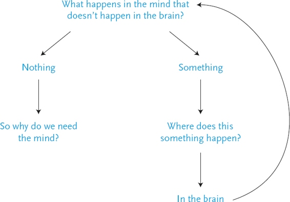
Mind and brain

Maybe we need subjective experiences in order to think about ourselves?

 As the brain tries to create a model of its own decisions, it gets trapped in an infinite digression, and abracadabra! Out of this loop, consciousness pops out.

 Many other computer programs make allowances for their own actions, yet none of them has developed consciousness, and none feels or desires anything.
 
 If we cannot explain the mind, and if we don’t know what function it fulfils, why not just discard it? The history of science is replete with abandoned concepts and theories. For instance, early modern scientists who tried to account for the movement of light postulated the existence of a substance called ether, which supposedly fills the entire universe. Light was thought to be waves of ether. However, scientists failed to find any empirical evidence for the existence of ether, whereas they did come up with alternative and better theories of light. Consequently, they threw ether into the dustbin of science.

 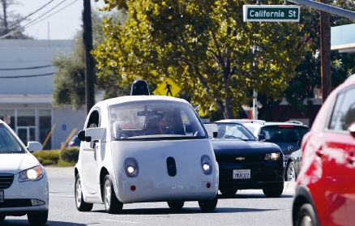
The Google autonomous car on the road.

Similarly, for thousands of years humans used God to explain numerous natural phenomena... ...Over the last few centuries scientists have not discovered any empirical evidence for God’s existence, while they did find much more detailed explanations for lightning strikes, rain and the origins of life. Consequently, with the exception of a few subfields of philosophy, no article in any peer-review scientific journal takes God’s existence seriously

The same fate has befallen the soul. For thousands of years people believed that all our actions and decisions emanate from our souls. Yet in the absence of any supporting evidence, and given the existence of much more detailed alternative theories, the life sciences have ditched the soul.

Maybe the mind should join the soul, God and ether in the dustbin of science? After all, no one has ever seen experiences of pain or love through a microscope, and we have a very detailed biochemical explanation for pain and love that leaves no room for subjective experiences.

 Since all scientists constantly experience subjective feelings such as pain and doubt, they cannot deny their existence.

 Another way to dismiss mind and consciousness is to deny their relevance rather than their existence. Some scientists – such as Daniel Dennett and Stanislas Dehaene – argue that all relevant questions can be answered by studying brain activities, without any recourse to subjective experiences. So scientists can safely delete ‘mind’, ‘consciousness’ and ‘subjective experiences’ from their vocabulary and articles. However, as we shall see in the following chapters, the whole edifice of modern politics and ethics is built upon subjective experiences, and few ethical dilemmas can be solved by referring strictly to brain activities. For example, what’s wrong with torture or rape? From a purely neurological perspective, when a human is tortured or raped certain biochemical reactions happen in the brain, and various electrical signals move from one bunch of neurons to another. What could possibly be wrong with that? Most modern people have ethical qualms about torture and rape because of the subjective experiences involved. If any scientist wants to argue that subjective experiences are irrelevant, their challenge is to explain why torture or rape are wrong without reference to any subjective experience.

  Consciousness is the biologically useless by-product of certain brain processes. Jet engines roar loudly, but the noise doesn’t propel the aeroplane forward. Humans don’t need carbon dioxide, but each and every breath fills the air with more of the stuff. Similarly, consciousness may be a kind of mental pollution produced by the firing of complex neural networks. It doesn’t do anything. It is just there. If this is true, it implies that all the pain and pleasure experienced by billions of creatures for millions of years is just mental pollution.

   it is quite amazing to realise that as of 2016, this is the best theory of consciousness that contemporary science has to offer us

 Maybe the life sciences view the problem from the wrong angle. They believe that life is all about data processing, and that organisms are machines for making calculations and taking decisions. However, this analogy between organisms and algorithms might mislead us. In the nineteenth century, scientists described brains and minds as if they were steam engines.

 Such thinking had a deep influence even on Freudian psychology, which is why much of our psychological jargon is still replete with concepts borrowed from mechanical engineering.Consider, for example, the following Freudian argument: ‘Armies harness the sex drive to fuel military aggression. The army recruits young men just when their sexual drive is at its peak. The army limits the soldiers’ opportunities of actually having sex and releasing all that pressure, which consequently accumulates inside them. The army then redirects this pent-up pressure and allows it to be released in the form of military aggression.’ This is exactly how a steam engine works. 
 
 You trap boiling steam inside a closed container. The steam builds up more and more pressure, until suddenly you open a valve, and release the pressure in a predetermined direction, harnessing it to propel a train or a loom. 
 
 Not only in armies, but in all fields of activity, we often complain about the pressure building up inside us, and we fear that unless we ‘let off some steam’, we might explode.

 Today we know of a far more sophisticated technology – the computer – so we explain the human psyche as if it were a computer processing data rather than a steam engine regulating pressure. 
 
 But this new analogy may turn out to be just as naïve. After all, computers have no minds. They don’t crave anything even when they have a bug, and the Internet doesn’t feel pain even when authoritarian regimes sever entire countries from the Web. So why use computers as a model for understanding the mind?Well, are we really sure that computers have no sensations or desires? And even if they haven’t got any at present, perhaps once they become complex enough they might develop consciousness? If that were to happen, how could we ascertain it?

  we are today capable of differentiating between conscious mental experiences and non-conscious brain activities

  This has allowed the scientists to determine, for example, whether a seemingly vegetative stroke victim has completely lost consciousness, or has merely lost control of his body and speech. If the patient’s brain displays the telltale signatures of consciousness, he is probably conscious, even though he cannot move or speak. Indeed, doctors have recently managed to communicate with such patients using fMRI imaging. They ask the patients yes/no questions, telling them to imagine themselves playing tennis if the answer is yes, and to visualise the location of their home if the answer is no.

   Starting with the assumption that we can believe humans when they report that they are conscious, we can identify the signatures of human consciousness, and then use these signatures to ‘prove’ that humans are indeed conscious. But if an artificial intelligence self-reports that it is conscious, should we just believe it?So far, we have no good answer to this problem

  thousands of years ago philosophers realised that there is no way to prove conclusively that anyone other than oneself has a mind. Indeed, even in the case of other humans, we just assume they have consciousness – we cannot know that for certain.

According to current scientific dogma, everything I experience is the result of electrical activity in my brain, and it should therefore be theoretically feasible to simulate an entire virtual world that I could not possibly distinguish from the ‘real’ world. 

Some brain scientists believe that in the not too distant future, we shall actually do such things. Well, maybe it has already been done – to you? 

For all you know, the year might be 2216 and you are a bored teenager immersed inside a ‘virtual world’ game that simulates the primitive and exciting world of the early twenty-first century. 

Once you acknowledge the mere feasibility of this scenario, mathematics leads you to a very scary conclusion: since there is only one real world, whereas the number of potential virtual worlds is infinite, the probability that you happen to inhabit the sole real world is almost zero.

  According to the Turing Test, in order to determine whether a computer has a mind, you should communicate simultaneously both with that computer and with a real person, without knowing which is which.

 Acknowledging the existence of other minds is merely a social and legal convention.
 
 The Turing Test was invented in 1950 by the British mathematician Alan Turing, one of the fathers of the computer age. Turing was also a gay man in a period when homosexuality was illegal in Britain. In 1952 he was convicted of committing homosexual acts and forced to undergo chemical castration. Two years later he committed suicide. The Turing Test is simply a replication of a mundane test every gay man had to undergo in 1950 Britain: can you pass for a straight man? Turing knew from personal experience that it didn’t matter who you really were – it mattered only what others thought about you. 
 
 According to Turing, in the future computers would be just like gay men in the 1950s. It won’t matter whether computers will actually be conscious or not. It will matter only what people think about it.

### The Depressing Lives of Laboratory Rats

 When humans try to determine whether an entity is conscious, what we usually look for is not mathematical aptitude or good memory, but rather the ability to create emotional relationships with us. People sometimes develop deep emotional attachments to fetishes like weapons, cars and even underwear, but these attachments are one-sided and never develop into relationships. 
 
 The fact that dogs can be party to emotional relationships with humans convinces most dog owners that dogs are not mindless automata.This, however, won’t satisfy sceptics, who point out that emotions are algorithms, and that no known algorithm requires consciousness in order to function. Whenever an animal displays complex emotional behaviour, we cannot prove that this is not the result of some very sophisticated but non-conscious algorithm.

 Everything a human does – including reporting on allegedly conscious states – might in theory be the work of non-conscious algorithms.

Initial tests on monkeys and mice indicate that at least monkey and mice brains indeed display the signatures of consciousness.8 However, given the differences between animal brains and human brains, and given that we are still far from deciphering all the secrets of consciousness, developing decisive tests that will satisfy the sceptics might take decades.

 in May 2015 New Zealand became the first country in the world to legally recognise animals as sentient beings, when the New Zealand parliament passed the Animal Welfare Amendment Act. The Act stipulates that it is now obligatory to recognise animals as sentient, and hence attend properly to their welfare in contexts such as animal husbandry

 Many business corporations also recognise animals as sentient beings, though paradoxically, this often exposes the animals to rather unpleasant laboratory tests. For example, pharmaceutical companies routinely use rats as experimental subjects in the development of antidepressants. According to one widely used protocol, you take a hundred rats (for statistical reliability) and place each rat inside a glass tube filled with water. The rats struggle again and again to climb out of the tubes, without success.

  After fifteen minutes most give up and stop moving. They just float in the tube, apathetic to their surroundings.You now take another hundred rats, throw them in, but fish them out of the tube after fourteen minutes, just before they are about to despair. You dry them, feed them, give them a little rest – and then throw them back in. The second time, most rats struggle for twenty minutes before calling it quits. Why the extra six minutes? Because the memory of past success triggers the release of some biochemical in the brain that gives the rats hope and delays the advent of despair. If we could only isolate this biochemical, we might use it as an antidepressant for humans. But numerous chemicals flood a rat’s brain at any given moment. How can we pinpoint the right one?For this you take more groups of rats, who have never participated in the test before. You inject each group with a particular chemical, which you suspect to be the hoped-for antidepressant. You throw the rats into the water. If rats injected with chemical A struggle for only fifteen minutes before becoming depressed, you can cross out A on your list. If rats injected with chemical B go on thrashing for twenty minutes, you can tell the CEO and the shareholders that you might have just hit the jackpot.

  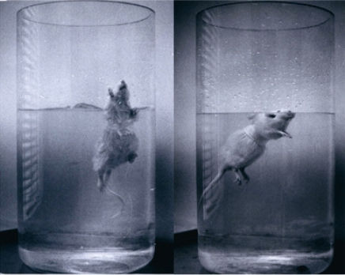
Left: A hopeful rat struggling to escape the glass tube. Right: An apathetic rat floating in the glass tube, having lost all hope.

Sceptics could object that this entire description needlessly humanises rats. Rats experience neither hope nor despair. Sometimes rats move quickly and sometimes they stand still, but they never feel anything. They are driven only by non-conscious algorithms

 Psychiatric drugs are aimed to induce changes not just in human behaviour, but above all in human feeling.

  Conducting experiments on rats can help corporations develop such a magic pill only if they presuppose that rat behaviour is accompanied by human-like emotions. And indeed, this is a common presupposition in psychiatric laboratories

### The Self-Conscious Chimpanzee

Another attempt to enshrine human superiority accepts that rats, dogs and other animals have consciousness, but argues that, unlike humans, they lack self-consciousness... ...This idea is as common as it is opaque... ... So what does it mean that they lack self-consciousness?A more sophisticated version of the argument says that there are different levels of self-consciousness. Only humans understand themselves as an enduring self that has a past and a future, perhaps because only humans can use language in order to contemplate their past experiences and future actions. Other animals exist in an eternal present. Even when they seem to remember the past or plan for the future, they are in fact reacting only to present stimuli and momentary urges.

 a squirrel hiding nuts for the winter doesn’t really remember the hunger he felt last winter, nor is he thinking about the future. He just follows a momentary urge, oblivious to the origins and purpose of this urge. That’s why even very young squirrels, who haven’t yet lived through a winter and hence cannot remember winter, nevertheless cache nuts during the summer.

  it is unclear why language should be a necessary condition for being aware of past or future events. The fact that humans use language to do so is hardly a proof.

## 5. PART II Homo Sapiens Gives Meaning to the World

## 1. 4 The Storytellers

## 2. 5 The Odd Couple

## 3. 6 The Modern Covenant

## 4. 7 The Humanist Revolution

## PART I6II. Homo Sapiens Loses Control

## 1. 8 The Time Bomb in the Laboratory

## 2. 9 The Great Decoupling

## 3. 10 The Ocean of Consciousness

## 4. 11 The Data Religion

## 7. Notes

## 8. Acknowledgements

## 9. Index

## 10. About the Author

## 11. Also by Yuval Noah Harari

## 12. Credits

## 13. Copyright

## 14. About the Publisher

