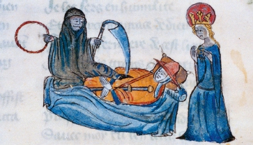

# Homo Deus A Brief History of Tomorrow

Yuval Noah Harari - 2015

## Table of Contents

1. Dedication
2. Contents
3. 1 The New Human Agenda
4. PART I Homo Sapiens Conquers the World
1. 2 The Anthropocene
2. 3 The Human Spark
5. PART II Homo Sapiens Gives Meaning to the World
1. 4 The Storytellers
2. 5 The Odd Couple
3. 6 The Modern Covenant
4. 7 The Humanist Revolution
PART I6II. Homo Sapiens Loses Control
1. 8 The Time Bomb in the Laboratory
2. 9 The Great Decoupling
3. 10 The Ocean of Consciousness
4. 11 The Data Religion
7. Notes
8. Acknowledgements
9. Index
10. About the Author
11. Also by Yuval Noah Harari
12. Credits
13. Copyright
14. About the Publisher

## 1. Dedication

## 2. Contents

In vitro fertilisation: mastering creation.

## 3. 1 The New Human Agenda

Let’s see what’s on the agenda today.’For thousands of years the answer to this question remained unchanged. The same three problems preoccupied the people of twentieth-century China, of medieval India and of ancient Egypt. Famine, plague and war were always at the top of the list.

For generation after generation humans have prayed to every god, angel and saint, and have invented countless tools, institutions and social systems – but they continued to die in their millions from starvation, epidemics and violence.

Yet at the dawn of the third millennium, humanity wakes up to an amazing realisation. Most people rarely think about it, but in the last few decades we have managed to rein in famine, plague and war.

For the first time in history, more people die today from eating too much than from eating too little; more people die from old age than from infectious diseases; and more people commit suicide than are killed by soldiers, terrorists and criminals combined
 
Like firefighters in a world without fire, so humankind in the twenty-first century needs to ask itself an unprecedented question: what are we going to do with ourselves? 

In a healthy, prosperous and harmonious world, what will demand our attention and ingenuity? 

### The Biological Poverty Line

Until recently most humans lived on the very edge of the biological poverty line, below which people succumb to malnutrition and hunger. A small mistake or a bit of bad luck could easily be a death sentence for an entire family or village.
 
 In April 1694 a French official in the town of Beauvais described the impact of famine and of soaring food prices, saying that his entire district was now filled with ‘an infinite number of poor souls, weak from hunger and wretchedness and dying from want, because, having no work or occupation, they lack the money to buy bread. Seeking to prolong their lives a little and somewhat to appease their hunger, these poor folk eat such unclean things as cats and the flesh of horses flayed and cast onto dung heaps. [Others consume] the blood that flows when cows and oxen are slaughtered, and the offal that cooks throw into the streets.

Most readers probably know how it feels when you miss lunch, when you fast on some religious holiday, or when you live for a few days on vegetable shakes as part of a new wonder diet. But how does it feel when you haven’t eaten for days on end and you have no clue where to get the next morsel of food?

Mass famines still strike some areas from time to time, but they are exceptional, and they are almost always caused by human politics rather than by natural catastrophes.
 
On the collective level, the global trade network turns droughts and floods into business opportunities, and makes it possible to overcome food shortages quickly and cheaply.
 
In France, for example, 6 million people (about 10 per cent of the population) suffer from nutritional insecurity. They wake up in the morning not knowing whether they will have anything to eat for lunch; they often go to sleep hungry; and the nutrition they do obtain is unbalanced and unhealthy – lots of starch, sugar and salt, and not enough protein and vitamins. Yet nutritional insecurity isn’t famine, and France of the early twenty-first century isn’t France of 1694. 

In the eighteenth century Marie Antoinette allegedly advised the starving masses that if they ran out of bread, they should just eat cake instead. Today, the poor are following this advice to the letter. Whereas the rich residents of Beverly Hills eat lettuce salad and steamed tofu with quinoa, in the slums and ghettos the poor gorge on Twinkie cakes, Cheetos, hamburgers and pizza.
 
Half of humankind is expected to be overweight by 2030. 
 
In 2010 famine and malnutrition combined killed about 1 million people, whereas obesity killed 3 million.

### Invisible Armadas

Bustling cities linked by a ceaseless stream of merchants, officials and pilgrims were both the bedrock of human civilisation and an ideal breeding ground for pathogens. People consequently lived their lives in ancient Athens or medieval Florence knowing that they might fall ill and die next week, or that an epidemic might suddenly erupt and destroy their entire family in one swoop.

The most famous such outbreak, the so-called Black Death, began in the 1330s, somewhere in east or central Asia, when the flea-dwelling bacterium Yersinia pestis started infecting humans bitten by the fleas. From there, riding on an army of rats and fleas, the plague quickly spread all over Asia, Europe and North Africa, taking less than twenty years to reach the shores of the Atlantic Ocean. Between 75 million and 200 million people died – more than a quarter of the population of Eurasia

Medieval people personified the Black Death as a horrific demonic force beyond human control or comprehension.The Triumph of Death, c.1562, Bruegel, Pieter the Elder © The Art Archive/Alamy Stock Photo.

 People readily believed in angels and fairies, but they could not imagine that a tiny flea or a single drop of water might contain an entire armada of deadly predators.
 
 
 The real culprit was the minuscule Yersinia pestis bacterium.© NIAID/CDC/Science Photo Library.

 More disastrous epidemics struck America, Australia and the Pacific Islands following the arrival of the first Europeans. Unbeknown to the explorers and settlers, they brought with them new infectious diseases against which the natives had no immunity. Up to 90 per cent of the local populations died as a result.
 
 In March 1520, when the Spanish fleet arrived, Mexico was home to 22 million people, by December only 14 million were still alive. Smallpox was only the first blow. While the new Spanish masters were busy enriching themselves and exploiting the natives, deadly waves of flu, measles and other infectious diseases struck Mexico one after the other, until in 1580 its population was down to less than 2 million.
 
In January 1918 soldiers in the trenches of northern France began dying in their thousands from a particularly virulent strain of flu, nicknamed ‘the Spanish Flu’. The front line was the end point of the most efficient global supply network the world had hitherto seen. Men and munitions were pouring in from Britain, the USA, India and Australia. Oil was sent from the Middle East, grain and beef from Argentina, rubber from Malaya and copper from Congo. In exchange, they all got Spanish Flu. Within a few months, about half a billion people – a third of the global population – came down with the virus. In India it killed 5 per cent of the population (15 million people). On the island of Tahiti, 14 per cent died. On Samoa, 20 per cent. In the copper mines of the Congo one out of five labourers perished. Altogether the pandemic killed between 50 million and 100 million people in less than a year. The First World War killed 40 million from 1914 to 1918.
 
Until the early twentieth century, about a third of children died before reaching adulthood from a combination of malnutrition and disease.

The global transport network is today even more efficient than in 1918. A Spanish virus can make its way to Congo or Tahiti in less than twenty-four hours.

Less than 5 per cent of children die before reaching adulthood. In the developed world the rate is less than 1 per cent.11 This miracle is due to the unprecedented achievements of twentieth-century medicine, which has provided us with vaccinations, antibiotics, improved hygiene and a much better medical infrastructure.

In 1979 the World Health Organization declared that humanity had won, and that smallpox had been completely eradicated. It was the first epidemic humans had ever managed to wipe off the face of the earth. In 1967 smallpox had still infected 15 million people and killed 2 million of them, but in 2014 not a single person was either infected or killed by smallpox. The victory has been so complete that today the WHO has stopped vaccinating humans against smallpox

 the HIV virus itself does not kill. Rather, it destroys the immune system, thereby exposing the patient to numerous other diseases. It is these secondary diseases that actually kill AIDS victims. Consequently, when AIDS began to spread, it was especially difficult to understand what was happening. When two patients were admitted to a New York hospital in 1981, one ostensibly dying from pneumonia and the other from cancer, it was not at all evident that both were in fact victims of the HIV virus, which may have infected them months or even years previously
 
Just think what would have happened if AIDS had erupted in 1581 rather than 1981. In all likelihood, nobody back then would have figured out what caused the epidemic, how it moved from person to person, or how it could be halted (let alone cured). Under such conditions, AIDS might have killed a much larger proportion of the human race, equalling and perhaps even surpassing the Black Death.

 New infectious diseases appear mainly as a result of chance mutations in pathogen genomes. These mutations allow the pathogens to jump from animals to humans, to overcome the human immune system, or to resist medicines such as antibiotics. Today such mutations probably occur and disseminate faster than in the past, due to human impact on the environment.

Some research labs are already home to nano-robots, that may one day navigate through our bloodstream, identify illnesses and kill pathogens and cancerous cells.

 and viruses, but it simultaneously turns humans themselves into an unprecedented threat. The same tools that enable doctors to quickly identify and cure new illnesses may also enable armies and terrorists to engineer even more terrible diseases and doomsday pathogens.

The era when humankind stood helpless before natural epidemics is probably over. But we may come to miss it.

### Breaking the Law of the Jungle

 Throughout history most humans took war for granted, whereas peace was a temporary and precarious state.

 From the Stone Age to the age of steam, and from the Arctic to the Sahara, every person on earth knew that at any moment the neighbours might invade their territory, defeat their army, slaughter their people and occupy their land.

  In 2012 about 56 million people died throughout the world; 620,000 of them died due to human violence (war killed 120,000 people, and crime killed another 500,000). In contrast, 800,000 committed suicide, and 1.5 million died of diabetes Sugar is now more dangerous than gunpowder.

 the global economy has been transformed from a material-based economy into a knowledge-based economy.

  Today the main source of wealth is knowledge.

 as knowledge became the most important economic resource, the profitability of war declined and wars became increasingly restricted to those parts of the world – such as the Middle East and Central Africa – where the economies are still old-fashioned material-based economies.

In 1998 it made sense for Rwanda to seize and loot the rich coltan mines of neighbouring Congo... ...Rwanda earned $240 million annually from the looted coltan... ...the Chinese have earned billions of dollars from cooperating with hi-tech giants such as Apple and Microsoft, buying their software and manufacturing their products. What Rwanda earned from an entire year of looting Congolese coltan, the Chinese earn in a single day of peaceful commerce.

 Previous generations thought about peace as the temporary absence of war. Today we think about peace as the implausibility of war.

 This New Peace is not just a hippie fantasy. Power-hungry governments and greedy corporations also count on it. When Mercedes plans its sales strategy in eastern Europe, it discounts the possibility that Germany might conquer Poland. A corporation importing cheap labourers from the Philippines is not worried that Indonesia might invade the Philippines next year.

 There is no guarantee, of course, that the New Peace will hold indefinitely.

  When the USA fought Iraq in 2003 it brought havoc to Baghdad and Mosul, but not a single bomb was dropped on Los Angeles or Chicago. In the future, though, a country such as North Korea or Iran could use logic bombs to shut down the power in California, blow up refineries in Texas and cause trains to collide in Michigan

 we should not confuse ability with motivation.

  Anton Chekhov famously said that a gun appearing in the first act of a play will inevitably be fired in the third. Throughout history, if kings and emperors acquired some new weapon, sooner or later they were tempted to use it. Since 1945, however, humankind has learned to resist this temptation. The gun that appeared in the first act of the Cold War was never fired.

 
Nuclear missiles on parade in Moscow. The gun that was always on display but never fired.Moscow, 1968 © Sovfoto/UIG via Getty Images.

 Whereas in 2010 obesity and related illnesses killed about 3 million people, terrorists killed a total of 7,697 people across the globe, most of them in developing countries.25 For the average American or European, Coca-Cola poses a far deadlier threat than al-Qaeda.

 In essence, terrorism is a show. Terrorists stage a terrifying spectacle of violence that captures our imagination and makes us feel as if we are sliding back into medieval chaos. Consequently states often feel obliged to react to the theatre of terrorism with a show of security, orchestrating immense displays of force, such as the persecution of entire populations or the invasion of foreign countries. In most cases, this overreaction to terrorism poses a far greater threat to our security than the terrorists themselves.

 By themselves, terrorists are too weak to drag us back to the Middle Ages and re-establish the Jungle Law. They may provoke us, but in the end, it all depends on our reactions.

 The message is not that famine, plague and war have completely disappeared from the face of the earth, and that we should stop worrying about them. Just the opposite.

Acknowledging our past achievements sends a message of hope and responsibility, encouraging us to make even greater efforts in the future.

 appreciating the magnitude of our achievements carries another message: history does not tolerate a vacuum. If incidences of famine, plague and war are decreasing, something is bound to take their place on the human agenda. We had better think very carefully what it is going to be. Otherwise, we might gain complete victory in the old battlefields only to be caught completely unaware on entirely new fronts.

We have managed to bring famine, plague and war under control thanks largely to our phenomenal economic growth, which provides us with abundant food, medicine, energy and raw materials. Yet this same growth destabilises the ecological equilibrium of the planet in myriad ways, which we have only begun to explore.

 Despite all the talk of pollution, global warming and climate change, most countries have yet to make any serious economic or political sacrifices to improve the situation.

  Humans are rarely satisfied with what they already have. 
  
  The most common reaction of the human mind to achievement is not satisfaction, but craving for more.

  Success breeds ambition, and our recent achievements are now pushing humankind to set itself even more daring goals.

   humanity’s next targets are likely to be immortality, happiness and divinity.

### The Last Days of Death

 Struggling against old age and death will merely carry on the time-honoured fight against famine and disease, and manifest the supreme value of contemporary culture: the worth of human life. 
 
 We are constantly reminded that human life is the most sacred thing in the universe.

  The Universal Declaration of Human Rights adopted by the UN after the Second World War – which is perhaps the closest thing we have to a global constitution – categorically states that ‘the right to life’ is humanity’s most fundamental value. Since death clearly violates this right, death is a crime against humanity, and we ought to wage total war against it.
  
  Throughout history, religions and ideologies did not sanctify life itself. They always sanctified something above or beyond earthly existence, and were consequently quite tolerant of death... ...they viewed death as a vital and positive part of the world. Humans died because God decreed it, and their moment of death was a sacred metaphysical experience exploding with meaning.

   Just try to imagine Christianity, Islam or Hinduism in a world without death – which is also a world without heaven, hell or reincarnation.
   
   Modern science and modern culture have an entirely different take on life and death. They don’t think of death as a metaphysical mystery, and they certainly don’t view death as the source of life’s meaning. Rather, for modern people death is a technical problem that we can and should solve.

  Humans always die due to some technical glitch. The heart stops pumping blood. The main artery is clogged by fatty deposits. Cancerous cells spread in the liver. Germs multiply in the lungs. And what is responsible for all these technical problems? Other technical problems. The heart stops pumping blood because not enough oxygen reaches the heart muscle. Cancerous cells spread because a chance genetic mutation rewrote their instructions. Germs settled in my lungs because somebody sneezed on the subway. Nothing metaphysical about it. It is all technical problems.

  Death personified as the Grim Reaper in medieval art.‘Death and dying’ from 14th-century French manuscript: Pilgrimage of the Human Life, Bodleian Library, Oxford © Art Media/Print Collector/Getty Images.

Every technical problem has a technical solution

 True, at present we don’t have solutions to all technical problems. But this is precisely why we invest so much time and money in researching cancer, germs, genetics and nanotechnology.

 Even when people die in a hurricane, a car accident or a war, we tend to view it as a technical failure that could and should have been prevented.

  Death has become an almost automatic reason for lawsuits and investigations. ‘How could they have died? Somebody somewhere must have screwed up.’

   Yet because old age and death are the outcome of nothing but particular problems, there is no point at which doctors and scientists are going to stop and declare: ‘Thus far, and not another step. We have overcome tuberculosis and cancer, but we won’t lift a finger to fight Alzheimer’s. People can go on dying from that.’ The Universal Declaration of Human Rights does not say that humans have ‘the right to life until the age of ninety’. It says that every human has a right to life, period. That right isn’t limited by any expiry date.

In 2012 Kurzweil was appointed a director of engineering at Google, and a year later Google launched a sub-company called Calico whose stated mission is "to solve death".

 Google Ventures is investing 36 per cent of its $2 billion portfolio in life sciences start-ups, including several ambitious life-extending projects. Using an American football analogy, Maris explained that in the fight against death, ‘We aren’t trying to gain a few yards. We are trying to win the game.’ Why? Because, says Maris, ‘it is better to live than to die’.

I think there are probably three main modes of approaching [death],’ he explained. ‘You can accept it, you can deny it or you can fight it. I think our society is dominated by people who are into denial or acceptance, and I prefer to fight it.’

 They maintain that anyone possessing a healthy body and a healthy bank account in 2050 will have a serious shot at immortality by cheating death a decade at a time. According to Kurzweil and de Grey, every ten years or so we will march into the clinic and receive a makeover treatment that will not only cure illnesses, but will also regenerate decaying tissues, and upgrade hands, eyes and brains. Before the next treatment is due, doctors will have invented a plethora of new medicines, upgrades and gadgets. If Kurzweil and de Grey are right, there may already be some immortals walking next to you on the street – at least if you happen to be walking down Wall Street or Fifth Avenue.

 In truth they will actually be a-mortal, rather than immortal... ...Which will probably make them the most anxious people in history. We mortals daily take chances with our lives, because we know they are going to end anyhow. So we go on treks in the Himalayas, swim in the sea, and do many other dangerous things like crossing the street or eating out. But if you believe you can live for ever, you would be crazy to gamble on infinity like that.

  In the twentieth century we have almost doubled life expectancy from forty to seventy, so in the twenty-first century we should at least be able to double it again to 150

   Though falling far short of immortality, this would still revolutionise human society. For starters, family structure, marriages and child–parent relationships would be transformed. Today, people still expect to be married ‘till death us do part’, and much of life revolves around having and raising children. Now try to imagine a person with a lifespan of 150 years. Getting married at forty, she still has 110 years to go. Will it be realistic to expect her marriage to last 110 years? Even Catholic fundamentalists might baulk at that

   The current trend of serial marriages is likely to intensify

Today we assume that you learn a profession in your teens and twenties, and then spend the rest of your life in that line of work. You obviously learn new things even in your forties and fifties, but life is generally divided into a learning period followed by a working period. When you live to be 150 that won’t do, especially in a world that is constantly being shaken by new technologies. 
    
People will have much longer careers, and will have to reinvent themselves again and again even at the age of ninety.

At the same time, people will not retire at sixty-five and will not make way for the new generation with its novel ideas and aspirations. The physicist Max Planck famously said that science advances one funeral at a time. He meant that only when one generation passes away do new theories have a chance to root out old ones. This is true not only of science. Think for a moment about your own workplace. No matter whether you are a scholar, journalist, cook or football player, how would you feel if your boss were 120, his ideas were formulated when Victoria was still queen, and he was likely to stay your boss for a couple of decades more?

 In the political sphere the results might be even more sinister... ...if people lived to 150, then in 2016 Stalin would still be ruling in Moscow, going strong at 138,

My own view is that the hopes of eternal youth in the twenty-first century are premature, and whoever takes them too seriously is in for a bitter disappointment. 

It is not easy to live knowing that you are going to die, but it is even harder to believe in immortality and be proven wrong.

Although average life expectancy has doubled over the last hundred years, it is unwarranted to extrapolate and conclude that we can double it again to 150 in the coming century.

 
## 4. PART I Homo Sapiens Conquers the World

## 1. 2 The Anthropocene

## 2. 3 The Human Spark

## 5. PART II Homo Sapiens Gives Meaning to the World

## 1. 4 The Storytellers

## 2. 5 The Odd Couple

## 3. 6 The Modern Covenant

## 4. 7 The Humanist Revolution

## PART I6II. Homo Sapiens Loses Control

## 1. 8 The Time Bomb in the Laboratory

## 2. 9 The Great Decoupling

## 3. 10 The Ocean of Consciousness

## 4. 11 The Data Religion

## 7. Notes

## 8. Acknowledgements

## 9. Index

## 10. About the Author

## 11. Also by Yuval Noah Harari

## 12. Credits

## 13. Copyright

## 14. About the Publisher

