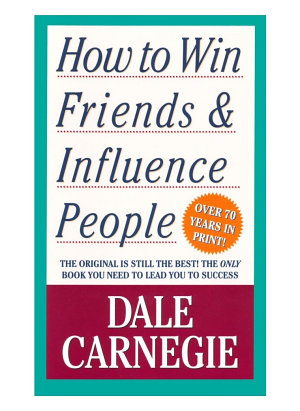

# How to win friends and influence people

Dale Carnegie - 1936

## Table of Contents

Cover

About the Author

Also by Dale Carnegie

Title Page

Dedication

Preface to revised edition

How this book was written – and why

Nine suggestions on how to get the most out of this book

PART ONE: FUNDAMENTAL TECHNIQUES IN HANDLING PEOPLE

1 ‘If You Want to Gather Honey, Don’t Kick Over the Beehive’

2 The Big Secret of Dealing with People

3 ‘He Who Can Do This Has the Whole World with Him. He Who Cannot Walks a Lonely Way’

PART TWO: SIX WAYS TO MAKE PEOPLE LIKE YOU

1 Do This and You’ll Be Welcome Anywhere

2 A Simple Way to Make a Good First Impression

3 If You Don’t Do This, You Are Headed for Trouble

4 An Easy Way to Become a Good Conversationalist

5 How to Interest People

6 How to Make People Like You Instantly

PART THREE: HOW TO WIN PEOPLE TO YOUR WAY OF THINKING

1 You Can’t Win an Argument

2 A Sure Way of Making Enemies – and How to Avoid It

3 If You’re Wrong, Admit It

4 A Drop of Honey

5 The Secret of Socrates

6 The Safety Valve in Handling Complaints

7 How to Get Cooperation

8 A Formula That Will Work Wonders for You

9 What Everybody Wants

10 An Appeal That Everybody Likes

11 The Movies Do It. TV Does It. Why Don’t You Do It?

12 When Nothing Else Works, Try This

PART FOUR: BE A LEADER: HOW TO CHANGE PEOPLE WITHOUT GIVING OFFENCE OR AROUSING RESENTMENT

1 If You Must Find Fault, This Is the Way to Begin

2 How to Criticise – and Not Be Hated for It

3 Talk About Your Own Mistakes First

4 No One Likes to Take Orders

5 Let the Other Person Save Face

6 How to Spur People On to Success

7 Give a Dog a Good Name

8 Make the Fault Seem Easy to Correct

9 Making People Glad to Do What You Want

A Shortcut to Distinction

Copyright

## Cover

## About the Author

## Also by Dale Carnegie

## Title Page

## Dedication

## Preface to revised edition

## How this book was written – and why

I conducted courses in public speaking only – courses designed to train adults, by actual experience, to think on their feet and express their ideas with more clarity, more effectiveness and more poise, both in business interviews and before groups. But gradually, as the seasons passed, I realised that as sorely as these adults needed training in effective speaking, they needed still more training in the fine art of getting along with people in everyday business and social contacts.

One can, for example, hire mere technical ability in engineering, accountancy, architecture or any other profession at nominal salaries. But the person who has technical knowledge plus the ability to express ideas, to assume leadership, and to arouse enthusiasm among people – that person is headed for higher earning power.

John D. Rockefeller said that ‘the ability to deal with people is as purchasable a commodity as sugar or coffee.’ ‘And I will pay more for that ability,’ said John D., ‘than for any other under the sun.’

The University of Chicago and the United Y.M.C.A. Schools conducted a survey to determine what adults want to study... ...That survey revealed that health is the prime interest of adults – and that their second interest is people; how to understand and get along with people; how to make people like you; and how to win others to your way of thinking.

> ‘is not knowledge but action.’ And this is an action book. - Dale Carnegie 1936

## Nine suggestions on how to get the most out of this book

If you do have this cardinal endowment, then you can achieve wonders without reading any suggestions for getting the most out of a book... ...Just this: a deep, driving desire to learn, a vigorous determination to increase your ability to deal with people.

Ask yourself just how and when you can apply each suggestion.

Marking and underscoring a book makes it more interesting, and far easier to review rapidly.

The rapidity with which we forget is astonishing. So, if you want to get a real, lasting benefit... ...don’t imagine that skimming through it once will suffice... ...you ought to spend a few hours reviewing it every month.

> ‘If you teach a man anything, he will never learn.’ - Bernard Shaw

Learning is an active process. We learn by doing.

Only knowledge that is used sticks in your mind.

each Saturday... ...process of self-examination and review and appraisal... ...“What mistakes did I make that time?” “What did I do that was right – and in what way could I have improved my performance?” “What lessons can I learn from that experience?”

In order to get the most out of this book:
a. Develop a deep, driving desire to master the principles of human relations.
b. Read each chapter twice before going on to the next one.
c. As you read, stop frequently to ask yourself how you can apply each suggestion.
d. Underscore each important idea.
e. Review this book each month.
f. Apply these principles at every opportunity. Use this volume as a working handbook to help you solve your daily problems.
g. Make a lively game out of your learning by offering some friend a dime or a dollar every time he or she catches you violating one of these principles.
h. Check up each week on the progress you are making. Ask yourself what mistakes you have made, what improvement, what lessons you have learned for the future.
i. Keep notes in the back of this book showing how and when you have applied these principles.

## PART ONE: FUNDAMENTAL TECHNIQUES IN HANDLING PEOPLE

### 1 ‘If You Want to Gather Honey, Don’t Kick Over the Beehive’

> ‘I have spent the best years of my life giving people the lighter pleasures, helping them have a good time, and all I get is abuse, the existence of a hunted man.’ - Al Capone

Capone didn’t condemn himself. He actually regarded himself as a public benefactor – an unappreciated and misunderstood public benefactor.

Ninety-nine times out of a hundred, people don’t criticise themselves for anything no matter how wrong it may be.

B.F. Skinner, the world-famous psychologist, proved through his experiments that an animal rewarded for good behaviour will learn much more rapidly and retain what it learns far more effectively than an animal punished for bad behaviour. Later studies have shown that the same applies to humans. By criticising, we do not make lasting changes and often incur resentment.

The resentment that criticism engenders can demoralise employees, family members and friends, and still not correct the situation that has been condemned.

> ‘Judge not, that ye be not judged.’ - Lincoln

Lincoln saw that. Here was a golden, heaven-sent opportunity – the opportunity to capture Lee’s army and end the war immediately. So, with a surge of hope, Lincoln ordered Meade not to call a council of war but to attack Lee immediately... ...And what did General Meade do? He did the very opposite of what he was told to do... ...In bitter disappointment, Lincoln sat down and wrote Meade this letter... ..."My dear General, I do not believe you appreciate the magnitude of the misfortune involved in Lee’s escape... ...Your golden opportunity is gone, and I am distressed immeasurably because of it."... ...Meade never saw that letter. Lincoln never mailed it... ...it is water under the bridge now. If I send this letter, it will relieve my feelings, but it will make Meade try to justify himself. It will make him condemn me. It will arouse hard feelings, impair all his further usefulness as a commander, and perhaps force him to resign from the army.’

Do you know someone you would like to change and regulate and improve? Good! That is fine. I am all in favour of it. But why not begin on yourself? From a purely selfish standpoint, that is a lot more profitable than trying to improve others – yes, and a lot less dangerous.

> ‘Don’t complain about the snow on your neighbour’s roof, when your own doorstep is unclean.’ - Confucious

If you and I want to stir up a resentment tomorrow that may rankle across the decades and endure until death, just let us indulge in a little stinging criticism – no matter how certain we are that it is justified.

When dealing with people, let us remember we are not dealing with creatures of logic. We are dealing with creatures of emotion, creatures bristling with prejudices and motivated by pride and vanity.

> ‘I will speak ill of no man, and speak all the good I know of everybody.’ - Benjamin Franklin.

Any fool can criticise, condemn and complain – and most fools do. But it takes character and self-control to be understanding and forgiving.

> ‘A great man shows his greatness, by the way he treats little men.’ - Carlyle.

Instead of condemning people, let’s try to understand them. Let’s try to figure out why they do what they do. That’s a lot more profitable and intriguing than criticism; and it breeds sympathy, tolerance and kindness. ‘To know all is to forgive all.’

PRINCIPLE 1: Don’t criticise, condemn or complain.

### 2 The Big Secret of Dealing with People

THERE IS ONLY one way under high heaven to get anybody to do anything... ...And that is by making the other person want to do it.

The only way I can get you to do anything is by giving you what you want.

Sigmund Freud said that everything you and I do springs from two motives: the sex urge and the desire to be great.

John Dewey, one of America’s most profound philosophers, phrased it a bit differently. Dr. Dewey said that the deepest urge in human nature is ‘the desire to be important.’ Remember that phrase: ‘the desire to be important.’

Some of the things most people want include:

1 Health and the preservation of life.
2 Food.
3 Sleep.
4 Money and the things money will buy.
5 Life in the hereafter.
6 Sexual gratification.
7 The well-being of our children.
8 A feeling of importance.

Almost all these wants are usually gratified – all except one. But there is one longing – almost as deep, almost as imperious, as the desire for food or sleep – which is seldom gratified. It is what Freud calls ‘the desire to be great.’ It is what Dewey calls the ‘desire to be important.’

It was this desire for a feeling of importance that inspired Dickens to write his immortal novels. This desire inspired Sir Christopher Wren to design his symphonies in stone. This desire made Rockefeller amass millions that he never spent! And this same desire made the richest family in your town build a house far too large for its requirements.

If you tell me how you get your feeling of importance, I’ll tell you what you are. That determines your character. That is the most significant thing about you.

People sometimes became invalids in order to win sympathy and attention, and get a feeling of importance.

Some authorities declare that people may actually go insane in order to find, in the dreamland of insanity, the feeling of importance that has been denied them in the harsh world of reality.

Why people went insane. Nobody knows for sure. But he did say that many people who go insane find in insanity a feeling of importance that they were unable to achieve in the world of reality.

> ‘I consider my ability to arouse enthusiasm among my people, the greatest asset I possess, and the way to develop the best that is in a person is by appreciation and encouragement. There is nothing else that so kills the ambitions of a person as criticisms from superiors. I never criticise anyone. I believe in giving a person incentive to work. So I am anxious to praise but loath to find fault. If I like anything, I am hearty in my approbation and lavish in my praise.’ - Charles Schwab

‘Once I did bad and that I heard ever/Twice I did good, but that I heard never.’

> ‘There is nothing I need so much as nourishment for my self-esteem.’ - Alfred Lunt

We nourish the bodies of our children and friends and employees, but how seldom do we nourish their self-esteem? We provide them with roast beef and potatoes to build energy, but we neglect to give them kind words of appreciation that would sing in their memories for years like the music of the morning stars.

Of course flattery seldom works with discerning people. It is shallow, selfish and insincere. It ought to fail and it usually does. True, some people are so hungry, so thirsty, for appreciation that they will swallow anything, just as a starving man will eat grass and fishworms.

In the long run, flattery will do you more harm than good. Flattery is counterfeit, and like counterfeit money, it will eventually get you into trouble if you pass it to someone else.

The difference between appreciation and flattery? That is simple. One is sincere and the other insincere.

General Obregon’s philosophy: ‘Don’t be afraid of enemies who attack you. Be afraid of the friends who flatter you.’

‘Flattery is telling the other person precisely what he thinks about himself.’

When we are not engaged in thinking about some definite problem, we usually spend about 95 percent of our time thinking about ourselves. Now, if we stop thinking about ourselves for a while and begin to think of the other person’s good points, we won’t have to resort to flattery so cheap and false that it can be spotted almost before it is out of the mouth.

One of the most neglected virtues of our daily existence is appreciation.

Hurting people not only does not change them, it is never called for.

Emerson said: ‘Every man I meet is my superior in some way. In that, I learn of him.’

Forget flattery. Give honest, sincere appreciation. Be ‘hearty in your approbation and lavish in your praise’

PRINCIPLE 2: Give honest and sincere appreciation.

### 3 He Who Can Do This Has the Whole World with Him. He Who Cannot Walks a Lonely Way

You are interested in what you want. You are eternally interested in it. But no one else is. The rest of us are just like you: we are interested in what we want. So the only way on earth to influence other people is to talk about what they want and show them how to get it.

Every act you have ever performed since the day you were born was performed because you wanted something.

> ‘Action springs out of what we fundamentally desire . . . and the best piece of advice which can be given to would-be persuaders, whether in business, in the home, in the school, in politics, is: First, arouse in the other person an eager want. He who can do this has the whole world with him. He who cannot walks a lonely way.’ - Harry A. Overstreet in Influencing Human Behaviour

## PART TWO: SIX WAYS TO MAKE PEOPLE LIKE YOU

### 1 Do This and You’ll Be Welcome Anywhere

### 2 A Simple Way to Make a Good First Impression

### 3 If You Don’t Do This, You Are Headed for Trouble

### 4 An Easy Way to Become a Good Conversationalist

### 5 How to Interest People

### 6 How to Make People Like You Instantly

## PART THREE: HOW TO WIN PEOPLE TO YOUR WAY OF THINKING

### 1 You Can’t Win an Argument

### 2 A Sure Way of Making Enemies – and How to Avoid It

### 3 If You’re Wrong, Admit It

### 4 A Drop of Honey

### 5 The Secret of Socrates

### 6 The Safety Valve in Handling Complaints

### 7 How to Get Cooperation

### 8 A Formula That Will Work Wonders for You

### 9 What Everybody Wants

### 10 An Appeal That Everybody Likes

### 11 The Movies Do It. TV Does It. Why Don’t You Do It?

### 12 When Nothing Else Works, Try This

## PART FOUR: BE A LEADER: HOW TO CHANGE PEOPLE WITHOUT GIVING OFFENCE OR AROUSING RESENTMENT

### 1 If You Must Find Fault, This Is the Way to Begin

### 2 How to Criticise – and Not Be Hated for It

### 3 Talk About Your Own Mistakes First

### 4 No One Likes to Take Orders

### 5 Let the Other Person Save Face

### 6 How to Spur People On to Success

### 7 Give a Dog a Good Name

### 8 Make the Fault Seem Easy to Correct

### 9 Making People Glad to Do What You Want

### A Shortcut to Distinction

### Copyright
