# Sapiens: A Brief History of Humankind

Yuval Noah Harari - 2011

## Table of Contents

## Timeline of History
## Part One The Cognitive Revolution
### 1 An Animal of No Significance
### 2 The Tree of Knowledge
### 3 A Day in the Life of Adam and Eve
### 4 The Flood
## Part Two The Agricultural Revolution
### 5 History’s Biggest Fraud
### 6 Building Pyramids
### 7 Memory Overload
### 8 There is No Justice in History
## Part Three The Unification of Humankind
### 9 The Arrow of History
### 10 The Scent of Money
### 11 Imperial Visions
### 12 The Law of Religion
### 13 The Secret of Success
## Part Four The Scientific Revolution
### 14 The Discovery of Ignorance
### 15 The Marriage of Science and Empire
### 16 The Capitalist Creed
### 17 The Wheels of Industry
### 18 A Permanent Revolution
### 19 And They Lived Happily Ever After
### 20 The End of Homo Sapiens
## Afterword:
## The Animal that Became a God
## Notes

## Timeline of History

|Years Before the Present| |
|---|---|
|13.5 billion |	Matter and energy appear. Beginning of physics. Atoms and molecules appear. Beginning of chemistry.|
|4.5 billion | Formation of planet Earth.|
|3.8 billion | Emergence of organisms. Beginning of biology.|
|6 million |	Last common grandmother of humans and chimpanzees.|
|2.5 million | Evolution of the genus Homo in Africa. First stone tools.|
|2 million | Humans spread from Africa to Eurasia. Evolution of different human species.|
|500,000 |	Neanderthals evolve in Europe and the Middle East.|
|300,000 |	Daily usage of fire.|
|200,000 |	Homo sapiens evolves in East Africa.|
|70,000 |	The Cognitive Revolution. Emergence of fictive language. Beginning of history. Sapiens spread out of Africa.|
|45,000 |	Sapiens settle Australia. Extinction of Australian megafauna.|
|30,000 |	Extinction of Neanderthals.|
|16,000 |	Sapiens settle America. Extinction of American megafauna.|
|13,000 |	Extinction of Homo floresiensis. Homo sapiens the only surviving human species.|
|12,000 |	The Agricultural Revolution. Domestication of plants and animals. Permanent settlements.|
|5,000 |	First kingdoms, script and money. Polytheistic religions.|
|4,250 |	First empire – the Akkadian Empire of Sargon.|
|2,500 |	Invention of coinage – a universal money. The Persian Empire – a universal political order ‘for the benefit of all humans’. Buddhism in India – a universal truth ‘to liberate all beings from suffering’.|
|2,000 |	Han Empire in China. Roman Empire in the Mediterranean. Christianity.|
|1,400 |	Islam.|
|500 |	The Scientific Revolution. Humankind admits its ignorance and begins to acquire unprecedented power. Europeans begin to conquer America and the oceans. The entire planet becomes a single historical arena. The rise of capitalism.|
|200 |	The Industrial Revolution. Family and community are replaced by state and market. Massive extinction of plants and animals.|
|The Present |	Humans transcend the boundaries of planet Earth. Nuclear weapons threaten the survival of humankind. Organisms are increasingly shaped by intelligent design rather than natural selection.|
|The Future |	Intelligent design becomes the basic principle of life? Homo sapiens is replaced by superhumans?|

## Part One The Cognitive Revolution

1. A human handprint made about 30,000 years ago, on the wall of the Chauvet-Pont-d’Arc Cave in southern France. Somebody tried to say, ‘I was here!’

### 1 An Animal of No Significance

ABOUT 13.5 BILLION YEARS AGO, MATTER, energy, time and space came into being in what is known as the Big Bang. 

About 300,000 years after their appearance, matter and energy started to coalesce into complex structures, called atoms, which then combined into molecules. The story of atoms, molecules and their interactions is called chemistry.

About 3.8 billion years ago, on a planet called Earth, certain molecules combined to form particularly large and intricate structures called organisms. The story of organisms is called biology.

About 70,000 years ago, organisms belonging to the species Homo sapiens started to form even more elaborate structures called cultures. The subsequent development of these human cultures is called history.

Three important revolutions shaped the course of history: the Cognitive Revolution kick-started history about 70,000 years ago. The Agricultural Revolution sped it up about 12,000 years ago. The Scientific Revolution, which got under way only 500 years ago, may well end history and start something completely different. This book tells the story of how these three revolutions have affected humans and their fellow organisms.

Animals much like modern humans first appeared about 2.5 million years ago.

These archaic humans loved, played, formed close friendships and competed for status and power – but so did chimpanzees, baboons and elephants. There was nothing special about them.

The most important thing to know about prehistoric humans is that they were insignificant animals with no more impact on their environment than gorillas, fireflies or jellyfish.

Biologists classify organisms into species. Animals are said to belong to the same species if they tend to mate with each other, giving birth to fertile offspring. 

Horses and donkeys have a recent common ancestor and share many physical traits. But they show little sexual interest in one another. They will mate if induced to do so – but their offspring, called mules, are sterile. Mutations in donkey DNA can therefore never cross over to horses, or vice versa. The two types of animals are consequently considered two distinct species, moving along separate evolutionary paths. By contrast, a bulldog and a spaniel may look very different, but they are members of the same species, sharing the same DNA pool. They will happily mate and their puppies will grow up to pair off with other dogs and produce more puppies.

Species that evolved from a common ancestor are bunched together under the heading ‘genus’ (plural genera)... ...Biologists label organisms with a two-part Latin name, genus followed by species. Lions, for example, are called Panthera leo, the species leo of the genus Panthera. 

Homo sapiens – the species sapiens (wise) of the genus Homo (man).

Genera in their turn are grouped into families, such as the... ...elephants (elephants, mammoths, mastodons). All members of a family trace their lineage back to a founding matriarch or patriarch.

Homo sapiens, too, belongs to a family... ...we are members of a large and particularly noisy family called the great apes. Our closest living relatives include chimpanzees, gorillas and orang-utans. The chimpanzees are the closest. Just 6 million years ago, a single female ape had two daughters. One became the ancestor of all chimpanzees, the other is our own grandmother.

#### Skeletons in the Closet

We are used to thinking about ourselves as the only humans, because for the last 10,000 years, our species has indeed been the only human species around. Yet the real meaning of the word human is ‘an animal belonging to the genus Homo’, and there used to be many other species of this genus besides Homo sapiens. Moreover, as we shall see in the last chapter of the book, in the not so distant future we might again have to contend with non-sapiens humans.

I will often use the term ‘Sapiens’ to denote members of the species Homo sapiens, while reserving the term ‘human’ to refer to all extant members of the genus Homo.

Humans first evolved in East Africa about 2.5 million years ago from an earlier genus of apes called Australopithecus, which means ‘Southern Ape’. About 2 million years ago, some of these archaic men and women left their homeland to journey through and settle vast areas of North Africa, Europe and Asia. Since survival in the snowy forests of northern Europe required different traits than those needed to stay alive in Indonesia’s steaming jungles, human populations evolved in different directions. The result was several distinct species, to each of which scientists have assigned a pompous Latin name.

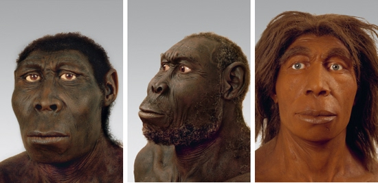

2. Our siblings, according to speculative reconstructions (left to right): Homo rudolfensis (East Africa); Homo erectus (East Asia); and Homo neanderthalensis (Europe and western Asia). All are humans.

The more eastern regions of Asia were populated by Homo erectus, ‘Upright Man’, who survived there for close to 2 million years, making it the most durable human species ever.

It is doubtful whether Homo sapiens will still be around a thousand years from now, so 2 million years is really out of our league.

On another Indonesian island – the small island of Flores – archaic humans underwent a process of dwarfing. Humans first reached Flores when the sea level was exceptionally low, and the island was easily accessible from the mainland. When the seas rose again, some people were trapped on the island, which was poor in resources. Big people, who need a lot of food, died first. Smaller fellows survived much better. Over the generations, the people of Flores became dwarves. This unique species, known by scientists as Homo floresiensis, reached a maximum height of only one metre and weighed no more than twenty-five kilograms. They were nevertheless able to produce stone tools, and even managed occasionally to hunt down some of the island’s elephants – though, to be fair, the elephants were a dwarf species as well.

Who knows how many lost relatives of ours are waiting to be discovered in other caves, on other islands, and in other climes.

evolution in East Africa did not stop. The cradle of humanity continued to nurture numerous new species, such as Homo rudolfensis, ‘Man from Lake Rudolf’, Homo ergaster, ‘Working Man’, and eventually our own species, which we’ve immodestly named Homo sapiens, ‘Wise Man’.

It’s a common fallacy to envision these species as arranged in a straight line of descent, with Ergaster begetting Erectus, Erectus begetting the Neanderthals, and the Neanderthals evolving into us. This linear model gives the mistaken impression that at any particular moment only one type of human inhabited the earth, and that all earlier species were merely older models of ourselves. The truth is that from about 2 million years ago until around 10,000 years ago, the world was home, at one and the same time, to several human species.

The earth of a hundred millennia ago was walked by at least six different species of man. It’s our current exclusivity, not that multi-species past, that is peculiar – and perhaps incriminating.

#### The Cost of Thinking

humans have extraordinarily large brains compared to other animals. Mammals weighing sixty kilograms have an average brain size of 200 cubic centimetres... ...Modern Sapiens sport a brain averaging 1,200–1,400 cubic centimetres. Neanderthal brains were even bigger... ...We are so enamoured of our high intelligence that we assume that when it comes to cerebral power, more must be better. But if that were the case, the feline family would also have produced cats who could do calculus. Why is genus Homo the only one in the entire animal kingdom to have come up with such massive thinking machines?

a jumbo brain is a jumbo drain on the body

In Homo sapiens, the brain accounts for about 2–3 per cent of total body weight, but it consumes 25 per cent of the body’s energy when the body is at rest

Archaic humans paid for their large brains in two ways. Firstly, they spent more time in search of food. Secondly, their muscles atrophied. Like a government diverting money from defence to education, humans diverted energy from biceps to neurons. 

It’s hardly a foregone conclusion that this is a good strategy for survival on the savannah. A chimpanzee can’t win an argument with a Homo sapiens, but the ape can rip the man apart like a rag doll.

Today our big brains pay off nicely... ...But cars and guns are a recent phenomenon. For more than 2 million years, human neural networks kept growing and growing, but apart from some flint knives and pointed sticks, humans had precious little to show for it. What then drove forward the evolution of the massive human brain during those 2 million years? Frankly, we don’t know.

we walk upright on two legs. Standing up, it’s easier to scan the savannah for game or enemies, and arms that are unnecessary for locomotion are freed for other purposes, like throwing stones or signalling. The more things these hands could do, the more successful their owners were, so evolutionary pressure brought about an increasing concentration of nerves and finely tuned muscles in the palms and fingers. As a result, humans can perform very intricate tasks with their hands. In particular, they can produce and use sophisticated tools. 

Adjusting to an upright position was quite a challenge, especially when the scaffolding had to support an extra-large cranium. Humankind paid for its lofty vision and industrious hands with backaches and stiff necks.

Women paid extra. An upright gait required narrower hips, constricting the birth canal – and this just when babies’ heads were getting bigger and bigger. Death in childbirth became a major hazard for human females. Women who gave birth earlier, when the infants brain and head were still relatively small and supple, fared better and lived to have more children. Natural selection consequently favoured earlier births. And, indeed, compared to other animals, humans are born prematurely, when many of their vital systems are still under-developed. 

Raising children required constant help from other family members and neighbours. It takes a tribe to raise a human. Evolution thus favoured those capable of forming strong social ties. In addition, since humans are born underdeveloped, they can be educated and socialised to a far greater extent than any other animal. Most mammals emerge from the womb like glazed earthenware emerging from a kiln – any attempt at remoulding will scratch or break them. Humans emerge from the womb like molten glass from a furnace. They can be spun, stretched and shaped with a surprising degree of freedom. This is why today we can educate our children to become Christian or Buddhist, capitalist or socialist, warlike or peace-loving.

humans enjoyed all of these advantages for a full 2 million years during which they remained weak and marginal creatures. Thus humans who lived a million years ago, despite their big brains and sharp stone tools, dwelt in constant fear of predators, rarely hunted large game, and subsisted mainly by gathering plants, scooping up insects, stalking small animals, and eating the carrion left behind by other more powerful carnivores.

the first humans specialised in extracting marrow from bones. 

Why marrow? Well, suppose you observe a pride of lions take down and devour a giraffe. You wait patiently until they’re done. But it’s still not your turn because first the hyenas and jackals – and you don’t dare interfere with them scavenge the leftovers. Only then would you and your band dare approach the carcass, look cautiously left and right – and dig into the edible tissue that remained... ...Genus Homo’s position in the food chain was, until quite recently, solidly in the middle. For millions of years, humans hunted smaller creatures and gathered what they could, all the while being hunted by larger predators. 

It was only 400,000 years ago that several species of man began to hunt large game on a regular basis, and only in the last 100,000 years – with the rise of Homo sapiens – that man jumped to the top of the food chain. That spectacular leap from the middle to the top had enormous consequences. Other animals at the top of the pyramid, such as lions and sharks, evolved into that position very gradually, over millions of years. This enabled the ecosystem to develop checks and balances that prevent lions and sharks from wreaking too much havoc. 

humankind ascended to the top so quickly that the ecosystem was not given time to adjust. Moreover, humans themselves failed to adjust. Most top predators of the planet are majestic creatures. Millions of years of dominion have filled them with self-confidence. Sapiens by contrast is more like a banana republic dictator. Having so recently been one of the underdogs of the savannah, we are full of fears and anxieties over our position, which makes us doubly cruel and dangerous. 

Many historical calamities, from deadly wars to ecological catastrophes, have resulted from this over-hasty jump.

#### A Race of Cooks

By about 300,000 years ago, Homo erectus, Neanderthals and the forefathers of Homo sapiens were using fire on a daily basis.

the best thing fire did was cook. Foods that humans cannot digest in their natural forms – such as wheat, rice and potatoes – became staples of our diet thanks to cooking. Fire not only changed food’s chemistry, it changed its biology as well. Cooking killed germs and parasites that infested food. Humans also had a far easier time chewing and digesting old favourites such as fruits, nuts, insects and carrion if they were cooked.

The advent of cooking enabled humans to eat more kinds of food, to devote less time to eating, and to make do with smaller teeth and shorter intestines. Some scholars believe there is a direct link between the advent of cooking, the shortening of the human intestinal track, and the growth of the human brain. Since long intestines and large brains are both massive energy consumers, it’s hard to have both. By shortening the intestines and decreasing their energy consumption, cooking inadvertently opened the way to the jumbo brains of Neanderthals and Sapiens.

When humans domesticated fire, they gained control of an obedient and potentially limitless force. Unlike eagles, humans could choose when and where to ignite a flame, and they were able to exploit fire for any number of tasks. Most importantly, the power of fire was not limited by the form, structure or strength of the human body. A single woman with a flint or fire stick could burn down an entire forest in a matter of hours. 

The domestication of fire was a sign of things to come.

#### Our Brothers’ Keepers

Our own species, Homo sapiens, was already present on the world stage, but so far it was just minding its own business in a corner of Africa. We don’t know exactly where and when animals that can be classified as Homo sapiens first evolved from some earlier type of humans, but most scientists agree that by 150,000 years ago, East Africa was populated by Sapiens that looked just like us. If one of them turned up in a modern morgue, the local pathologist would notice nothing peculiar. Thanks to the blessings of fire, they had smaller teeth and jaws than their ancestors, whereas they had massive brains, equal in size to ours.

When Homo sapiens landed in Arabia, most of Eurasia was already settled by other humans. What happened to them? There are two conflicting theories. The ‘Interbreeding Theory’ tells a story of attraction, sex and mingling. As the African immigrants spread around the world, they bred with other human populations, and people today are the outcome of this interbreeding.

According to the Interbreeding Theory, when Sapiens spread into Neanderthal lands, Sapiens bred with Neanderthals until the two populations merged. If this is the case, then today’s Eurasians are not pure Sapiens. They are a mixture of Sapiens and Neanderthals. Similarly, when Sapiens reached East Asia, they interbred with the local Erectus, so the Chinese and Koreans are a mixture of Sapiens and Erectus.

The opposing view, called the ‘Replacement Theory’ tells a very different story – one of incompatibility, revulsion, and perhaps even genocide. According to this theory, Sapiens and other humans had different anatomies, and most likely different mating habits and even body odours. They would have had little sexual interest in one another. And even if a Neanderthal Romeo and a Sapiens Juliet fell in love, they could not produce fertile children, because the genetic gulf separating the two populations was already unbridgeable... ...According to this view, Sapiens replaced all the previous human populations without merging with them. If that is the case, the lineages of all contemporary humans can be traced back, exclusively, to East Africa, 70,000 years ago. We are all ‘pure Sapiens’.

Map 1. Homo sapiens conquers the globe.

A lot hinges on this debate. From an evolutionary perspective, 70,000 years is a relatively short interval. If the Replacement Theory is correct, all living humans have roughly the same genetic baggage, and racial distinctions among them are negligible. But if the Interbreeding Theory is right, there might well be genetic differences between Africans, Europeans and Asians that go back hundreds of thousands of years. This is political dynamite, which could provide material for explosive racial theories.

In recent decades the Replacement Theory has been the common wisdom in the field. It had firmer archaeological backing, and was more politically correct (scientists had no desire to open up the Pandora’s box of racism by claiming significant genetic diversity among modern human populations).

in 2010, when the results of a four-year effort to map the Neanderthal genome were published... ...It turned out that 1–4 per cent of the unique human DNA of modern populations in the Middle East and Europe is Neanderthal DNA. That’s not a huge amount, but it’s significant. A second shock came several months later, when DNA extracted from the fossilised finger from Denisova was mapped. The results proved that up to 6 per cent of the unique human DNA of modern Melanesians and Aboriginal Australians is Denisovan DNA... ...the Interbreeders got at least some things right. But that doesn’t mean that the Replacement Theory is completely wrong. Since Neanderthals and Denisovans contributed only a small amount of DNA to our present-day genome, it is impossible to speak of a ‘merger’ between Sapiens and other human species.

Every two species that evolved from a common ancestor, such as horses and donkeys, were at one time just two populations of the same species, like bulldogs and spaniels. There must have been a point when the two populations were already quite different from one another, but still capable on rare occasions of having sex and producing fertile offspring. Then another mutation severed this last connecting thread, and they went their separate evolutionary ways.

50,000 years ago, Sapiens, Neanderthals and Denisovans were at that borderline point. They were almost, but not quite, entirely separate species. As we shall see in the next chapter, Sapiens were already very different from Neanderthals and Denisovans not only in their genetic code and physical traits, but also in their cognitive and social abilities, yet it appears it was still just possible, on rare occasions, for a Sapiens and a Neanderthal to produce a fertile offspring. So the populations did not merge, but a few lucky Neanderthal genes did hitch a ride on the Sapiens Express. 

It is unsettling – and perhaps thrilling – to think that we Sapiens could at one time have sex with an animal from a different species, and produce children together.

3. A speculative reconstruction of a Neanderthal child. Genetic evidence hints that at least some Neanderthals may have had fair skin and hair.

But if the Neanderthals, Denisovans and other human species didn’t merge with Sapiens, why did they vanish? One possibility is that Homo sapiens drove them to extinction. Imagine a Sapiens band reaching a Balkan valley where Neanderthals had lived for hundreds of thousands of years. The newcomers began to hunt the deer and gather the nuts and berries that were the Neanderthals’ traditional staples. Sapiens were more proficient hunters and gatherers – thanks to better technology and superior social skills – so they multiplied and spread. The less resourceful Neanderthals found it increasingly difficult to feed themselves. Their population dwindled and they slowly died out, except perhaps for one or two members who joined their Sapiens neighbours. Another possibility is that competition for resources flared up into violence and genocide. Tolerance is not a Sapiens trademark. In modern times, a small difference in skin colour, dialect or religion has been enough to prompt one group of Sapiens to set about exterminating another group. Would ancient Sapiens have been more tolerant towards an entirely different human species? It may well be that when Sapiens encountered Neanderthals, the result was the first and most significant ethnic-cleansing campaign in history.

Whichever way it happened, the Neanderthals (and the other human species) pose one of history’s great what ifs. Imagine how things might have turned out had the Neanderthals or Denisovans survived alongside Homo sapiens. What kind of cultures, societies and political structures would have emerged in a world where several different human species coexisted? How, for example, would religious faiths have unfolded? Would the book of Genesis have declared that Neanderthals descend from Adam and Eve, would Jesus have died for the sins of the Denisovans, and would the Qur’an have reserved seats in heaven for all righteous humans, whatever their species? Would Neanderthals have been able to serve in the Roman legions, or in the sprawling bureaucracy of imperial China? Would the American Declaration of Independence hold as a self-evident truth that all members of the genus Homo are created equal? Would Karl Marx have urged workers of all species to unite?

Homo sapiens has grown so accustomed to being the only human species that it’s hard for us to conceive of any other possibility. 

Our lack of brothers and sisters makes it easier to imagine that we are the epitome of creation, and that a chasm separates us from the rest of the animal kingdom. 

When Charles Darwin indicated that Homo sapiens was just another kind of animal, people were outraged. Even today many refuse to believe it.

Perhaps this is exactly why our ancestors wiped out the Neanderthals. They were too familiar to ignore, but too different to tolerate.

Whether Sapiens are to blame or not, no sooner had they arrived at a new location than the native population became extinct... ...What was the Sapiens’ secret of success? How did we manage to settle so rapidly in so many distant and ecologically different habitats? How did we push all other human species into oblivion?

Homo sapiens conquered the world thanks above all to its unique language.

### 2 The Tree of Knowledge

in the first recorded encounter between Sapiens and Neanderthals, the Neanderthals won. About 100,000 years ago, some Sapiens groups migrated north to the Levant, which was Neanderthal territory, but failed to secure a firm footing. It might have been due to nasty natives, an inclement climate, or unfamiliar local parasites. Whatever the reason, the Sapiens eventually retreated, leaving the Neanderthals as masters of the Middle East.

the internal structure of the brains of these Sapiens was probably different from ours. They looked like us, but their cognitive abilities – learning, remembering, communicating – were far more limited. Teaching such an ancient Sapiens English, persuading him of the truth of Christian dogma, or getting him to understand the theory of evolution would probably have been hopeless undertakings. Conversely, we would have had a very hard time learning his language and understanding his way of thinking.

about 70,000 years ago, Homo sapiens started doing very special things. Around that date Sapiens bands left Africa for a second time. This time they drove the Neanderthals and all other human species not only from the Middle East, but from the face of the earth. Within a remarkably short period, Sapiens reached Europe and East Asia. About 45,000 years ago, they somehow crossed the open sea and landed in Australia – a continent hitherto untouched by humans. The period from about 70,000 years ago to about 30,000 years ago witnessed the invention of boats, oil lamps, bows and arrows and needles (essential for sewing warm clothing).

the people who drove the Neanderthals to extinction, settled Australia, and carved the Stadel lion-man were as intelligent, creative and sensitive as we are. If we were to come across the artists of the Stadel Cave, we could learn their language and they ours. We’d be able to explain to them everything we know – from the adventures of Alice in Wonderland to the paradoxes of quantum physics – and they could teach us how their people view the world.

between 70,000 and 30,000 years ago, constitutes the Cognitive Revolution. What caused it? We’re not sure. The most commonly believed theory argues that accidental genetic mutations changed the inner wiring of the brains of Sapiens, enabling them to think in unprecedented ways and to communicate using an altogether new type of language. We might call it the Tree of Knowledge mutation. 

Why did it occur in Sapiens DNA rather than in that of Neanderthals? It was a matter of pure chance, as far as we can tell. 

it’s more important to understand the consequences of the Tree of Knowledge mutation than its causes. What was so special about the new Sapiens language that it enabled us to conquer the world? It was not the first language. Every animal has some kind of language.

green monkeys use calls of various kinds to communicate. Zoologists have identified one call that means, ‘Careful! An eagle!’ A slightly different call warns, ‘Careful! A lion!’ When researchers played a recording of the first call to a group of monkeys, the monkeys stopped what they were doing and looked upwards in fear. When the same group heard a recording of the second call, the lion warning, they quickly scrambled up a tree.

The most common answer is that our language is amazingly supple. We can connect a limited number of sounds and signs to produce an infinite number of sentences, each with a distinct meaning. We can thereby ingest, store and communicate a prodigious amount of information about the surrounding world. 

A green monkey can yell to its comrades, ‘Careful! A lion!’ But a modern human can tell her friends that this morning, near the bend in the river, she saw a lion tracking a herd of bison.

our unique language evolved as a means of sharing information about the world. But the most important information that needed to be conveyed was about humans, not about lions and bison. Our language evolved as a way of gossiping. According to this theory Homo sapiens is primarily a social animal. Social cooperation is our key for survival and reproduction. It is not enough for individual men and women to know the whereabouts of lions and bison. It’s much more important for them to know who in their band hates whom, who is sleeping with whom, who is honest, and who is a cheat.

4. An ivory figurine of a ‘lion-man’ (or ‘lioness-woman’) from the Stadel Cave in Germany (c.32,000 years ago). The body is human, but the head is leonine. This is one of the first indisputable examples of art, and probably of religion, and of the ability of the human mind to imagine things that do not really exist.

Neanderthals and archaic Homo sapiens probably also had a hard time talking behind each other’s backs – a much maligned ability which is in fact essential for cooperation in large numbers. The new linguistic skills that modern Sapiens acquired about seventy millennia ago enabled them to gossip for hours on end. Reliable information about who could be trusted meant that small bands could expand into larger bands, and Sapiens could develop tighter and more sophisticated types of cooperation.1

The gossip theory might sound like a joke, but numerous studies support it. Even today the vast majority of human communication – whether in the form of emails, phone calls or newspaper columns – is gossip. It comes so naturally to us that it seems as if our language evolved for this very purpose.

Gossip usually focuses on wrongdoings. Rumour-mongers are the original fourth estate, journalists who inform society about and thus protect it from cheats and freeloaders.

the truly unique feature of our language is not its ability to transmit information about men and lions. Rather, it’s the ability to transmit information about things that do not exist at all. As far as we know, only Sapiens can talk about entire kinds of entities that they have never seen, touched or smelled.

Legends, myths, gods and religions appeared for the first time with the Cognitive Revolution... ...Homo sapiens acquired the ability to say, ‘The lion is the guardian spirit of our tribe.’ This ability to speak about fictions is the most unique feature of Sapiens language.

only Homo sapiens can speak about things that don’t really exist, and believe six impossible things before breakfast. You could never convince a monkey to give you a banana by promising him limitless bananas after death in monkey heaven.

People who go to the forest looking for fairies and unicorns would seem to have less chance of survival than people who go looking for mushrooms and deer. And if you spend hours praying to non-existing guardian spirits, aren’t you wasting precious time, time better spent foraging, fighting and fornicating?

But fiction has enabled us not merely to imagine things, but to do so collectively. We can weave common myths such as the biblical creation story, the Dreamtime myths of Aboriginal Australians, and the nationalist myths of modern states. Such myths give Sapiens the unprecedented ability to cooperate flexibly in large numbers.

Sapiens can cooperate in extremely flexible ways with countless numbers of strangers. That’s why Sapiens rule the world, whereas ants eat our leftovers and chimps are locked up in zoos and research laboratories.

#### The Legend of Peugeot

Our chimpanzee cousins usually live in small troops of several dozen individuals... ...The dominant member, who is almost always a male, is termed the ‘alpha male’. Other males and females exhibit their submission to the alpha male by bowing before him while making grunting sounds, not unlike human subjects kowtowing before a king... ...When two males are contesting the alpha position, they usually do so by forming extensive coalitions of supporters, both male and female, from within the group. Ties between coalition members are based on intimate daily contact – hugging, touching, kissing, grooming and mutual favours. Just as human politicians on election campaigns go around shaking hands and kissing babies, so aspirants to the top position in a chimpanzee group spend much time hugging, back-slapping and kissing baby chimps. The alpha male usually wins his position not because he is physically stronger, but because he leads a large and stable coalition.

coalitions play a central part not only during overt struggles for the alpha position, but in almost all day-to-day activities. Members of a coalition spend more time together, share food, and help one another in times of trouble.

a typical chimpanzee troop consists of about twenty to fifty individuals. As the number of chimpanzees in a troop increases, the social order destabilises, eventually leading to a rupture and the formation of a new troop by some of the animals. Only in a handful of cases have zoologists observed groups larger than a hundred.

Researchers have documented prolonged warfare between groups, and even one case of ‘genocidal’ activity in which one troop systematically slaughtered most members of a neighbouring band. Similar patterns probably dominated the social lives of early humans, including archaic Homo sapiens.

Even if a particularly fertile valley could feed 500 archaic Sapiens, there was no way that so many strangers could live together.

Sociological research has shown that the maximum ‘natural’ size of a group bonded by gossip is about 150 individuals. Most people can neither intimately know, nor gossip effectively about, more than 150 human beings.

once the threshold of 150 individuals is crossed, things can no longer work that way. You cannot run a division with thousands of soldiers the same way you run a platoon. Successful family businesses usually face a crisis when they grow larger and hire more personnel. If they cannot reinvent themselves, they go bust.

How did Homo sapiens manage to cross this critical threshold, eventually founding cities comprising tens of thousands of inhabitants and empires ruling hundreds of millions? The secret was probably the appearance of fiction. Large numbers of strangers can cooperate successfully by believing in common myths.

Two Catholics who have never met can nevertheless go together on crusade or pool funds to build a hospital because they both believe that God was incarnated in human flesh and allowed Himself to be crucified to redeem our sins. States are rooted in common national myths. Two Serbs who have never met might risk their lives to save one another because both believe in the existence of the Serbian nation, the Serbian homeland and the Serbian flag. 

none of these things exists outside the stories that people invent and tell one another. There are no gods in the universe, no nations, no money, no human rights, no laws, and no justice outside the common imagination of human beings.

Modern business-people and lawyers are, in fact, powerful sorcerers. The principal difference between them and tribal shamans is that modern lawyers tell far stranger tales. The legend of Peugeot affords us a good example.

An icon that somewhat resembles the Stadel lion-man appears today on cars, trucks and motorcycles from Paris to Sydney... ...Peugeot began as a small family business in the village of Valentigney, just 300 kilometres from the Stadel Cave. Today the company employs about 200,000 people worldwide, most of whom are complete strangers to each other. These strangers cooperate so effectively that in 2008 Peugeot produced more than 1.5 million automobiles, earning revenues of about 55 billion euros. In what sense can we say that Peugeot SA (the company’s official name) exists? There are many Peugeot vehicles, but these are obviously not the company... ...A disaster might kill every single one of Peugeot’s employees, and go on to destroy all of its assembly lines and executive offices. Even then, the company could borrow money, hire new employees, build new factories and buy new machinery... ...All the managers could be dismissed and all its shares sold, but the company itself would remain intact... ...It doesn’t mean that Peugeot SA is invulnerable or immortal. If a judge were to mandate the dissolution of the company, its factories would remain standing and its workers, accountants, managers and shareholders would continue to live – but Peugeot SA would immediately vanish. In short, Peugeot SA seems to have no essential connection to the physical world. Does it really exist?

5. The Peugeot Lion

Peugeot is a figment of our collective imagination. Lawyers call this a ‘legal fiction’. It can’t be pointed at; it is not a physical object. But it exists as a legal entity. Just like you or me, it is bound by the laws of the countries in which it operates. It can open a bank account and own property. 

Peugeot belongs to a particular genre of legal fictions called ‘limited liability companies’. The idea behind such companies is among humanity’s most ingenious inventions. Homo sapiens lived for untold millennia without them. 

During most of recorded history property could be owned only by flesh-and-blood humans, the kind that stood on two legs and had big brains. If in thirteenth-century France Jean set up a wagon-manufacturing workshop, he himself was the business. If a wagon he’d made broke down a week after purchase, the disgruntled buyer would have sued Jean personally. If Jean had borrowed 1,000 gold coins to set up his workshop and the business failed, he would have had to repay the loan by selling his private property – his house, his cow, his land. He might even have had to sell his children into servitude... ...He was fully liable, without limit, for all obligations incurred by his workshop.

this legal situation discouraged entrepreneurship.

This is why people began collectively to imagine the existence of limited liability companies. Such companies were legally independent of the people who set them up, or invested money in them, or managed them. Over the last few centuries such companies have become the main players in the economic arena, and we have grown so used to them that we forget they exist only in our imagination. 

In the US, the technical term for a limited liability company is a ‘corporation’, which is ironic, because the term derives from ‘corpus’ (‘body’ in Latin) – the one thing these corporations lack. 

Despite their having no real bodies, the American legal system treats corporations as legal persons, as if they were flesh-and-blood human beings.

the Homo sapiens. Armand Peugeot died in 1915. Peugeot, the company, is still alive and well.

How exactly did Armand Peugeot, the man, create Peugeot, the company? In much the same way that priests and sorcerers have created gods and demons throughout history, and in which thousands of French curés were still creating Christ’s body every Sunday in the parish churches. It all revolved around telling stories, and convincing people to believe them. 

In the case of the French curés, the crucial story was that of Christ’s life and death as told by the Catholic Church. According to this story, if a Catholic priest dressed in his sacred garments solemnly said the right words at the right moment, mundane bread and wine turned into God’s flesh and blood. The priest exclaimed ‘Hoc est corpus meum!’ (Latin for ‘This is my body!’) and hocus pocus – the bread turned into Christ’s flesh. Seeing that the priest had properly and assiduously observed all the procedures, millions of devout French Catholics behaved as if God really existed in the consecrated bread and wine.

In the case of Peugeot SA the crucial story was the French legal code, as written by the French parliament. According to the French legislators, if a certified lawyer followed all the proper liturgy and rituals, wrote all the required spells and oaths on a wonderfully decorated piece of paper, and affixed his ornate signature to the bottom of the document, then hocus pocus – a new company was incorporated.

in 1896 Armand Peugeot wanted to create his company, he paid a lawyer to go through all these sacred procedures. Once the lawyer had performed all the right rituals and pronounced all the necessary spells and oaths, millions of upright French citizens behaved as if the Peugeot company really existed.

Telling effective stories is not easy. The difficulty lies not in telling the story, but in convincing everyone else to believe it. 

how does one convince millions of people to believe particular stories about gods, or nations, or limited liability companies? Yet when it succeeds, it gives Sapiens immense power, because it enables millions of strangers to cooperate and work towards common goals. 

try to imagine how difficult it would have been to create states, or churches, or legal systems if we could speak only about things that really exist, such as rivers, trees and lions.

people have woven an incredibly complex network of stories. Within this network, fictions such as Peugeot not only exist, but also accumulate immense power. 

The kinds of things that people create through this network of stories are known in academic circles as ‘fictions’, ‘social constructs’, or ‘imagined realities’. An imagined reality is not a lie. I lie when I say that there is a lion near the river when I know perfectly well that there is no lion there. There is nothing special about lies. Green monkeys and chimpanzees can lie. A green monkey, for example, has been observed calling ‘Careful! A lion!’ when there was no lion around. This alarm conveniently frightened away a fellow monkey who had just found a banana, leaving the liar all alone to steal the prize for itself.

an imagined reality is something that everyone believes in, and as long as this communal belief persists, the imagined reality exerts force in the world. 

The sculptor from the Stadel Cave may sincerely have believed in the existence of the lion-man guardian spirit. Some sorcerers are charlatans, but most sincerely believe in the existence of gods and demons. Most millionaires sincerely believe in the existence of money and limited liability companies. Most human-rights activists sincerely believe in the existence of human rights. No one was lying when, in 2011, the UN demanded that the Libyan government respect the human rights of its citizens, even though the UN, Libya and human rights are all figments of our fertile imaginations.

Ever since the Cognitive Revolution, Sapiens has thus been living in a dual reality. On the one hand, the objective reality of rivers, trees and lions; and on the other hand, the imagined reality of gods, nations and corporations. 

As time went by, the imagined reality became ever more powerful, so that today the very survival of rivers, trees and lions depends on the grace of imagined entities such as gods, nations and corporations.

#### Bypassing the Genome

The ability to create an imagined reality out of words enabled large numbers of strangers to cooperate effectively.

Since large-scale human cooperation is based on myths, the way people cooperate can be altered by changing the myths – by telling different stories.

In 1789 the French population switched almost overnight from believing in the myth of the divine right of kings to believing in the myth of the sovereignty of the people.

ever since the Cognitive Revolution Homo sapiens has been able to revise its behaviour rapidly in accordance with changing needs. This opened a fast lane of cultural evolution, bypassing the traffic jams of genetic evolution. Speeding down this fast lane, Homo sapiens soon far outstripped all other human and animal species in its ability to cooperate.

The behaviour of other social animals is determined to a large extent by their genes. DNA is not an autocrat. Animal behaviour is also influenced by environmental factors and individual quirks.

in a given environment, animals of the same species will tend to behave in a similar way.

Female common chimpanzees cannot take lessons from their bonobo relatives and stage a feminist revolution. Male chimps cannot gather in a constitutional assembly to abolish the office of alpha male and declare that from here on out all chimps are to be treated as equals. Such dramatic changes in behaviour would occur only if something changed in the chimpanzees’ DNA.

Two million years ago, genetic mutations resulted in the appearance of a new human species called Homo erectus. Its emergence was accompanied by the development of a new stone tool technology, now recognised as a defining feature of this species. As long as Homo erectus did not undergo further genetic alterations, its stone tools remained roughly the same – for close to 2 million years!

In contrast, ever since the Cognitive Revolution, Sapiens have been able to change their behaviour quickly, transmitting new behaviours to future generations without any need of genetic or environmental change.

the repeated appearance of childless elites, such as the Catholic priesthood, Buddhist monastic orders and Chinese eunuch bureaucracies. The existence of such elites goes against the most fundamental principles of natural selection, since these dominant members of society willingly give up procreation. Whereas chimpanzee alpha males use their power to have sex with as many females as possible – and consequently sire a large proportion of their troop’s young – the Catholic alpha male abstains completely from sexual intercourse and childcare.

The Catholic Church has survived for centuries, not by passing on a ‘celibacy gene’ from one pope to the next, but by passing on the stories of the New Testament and of Catholic canon law.

Sapiens could transform their social structures, the nature of their interpersonal relations, their economic activities and a host of other behaviours within a decade or two. Consider a resident of Berlin, born in 1900 and living to the ripe age of one hundred. She spent her childhood in the Hohenzollern Empire of Wilhelm II; her adult years in the Weimar Republic, the Nazi Third Reich and Communist East Germany; and she died a citizen of a democratic and reunified Germany. She had managed to be a part of five very different sociopolitical systems, though her DNA remained exactly the same.

In a one-on-one brawl, a Neanderthal would probably have beaten a Sapiens. But in a conflict of hundreds, Neanderthals wouldn’t stand a chance.

Archaeologists excavating 30,000-year-old Sapiens sites in the European heartland occasionally find there seashells from the Mediterranean and Atlantic coasts. In all likelihood, these shells got to the continental interior through long-distance trade between different Sapiens bands. Neanderthal sites lack any evidence of such trade. Each group manufactured its own tools from local materials.

6. The Catholic alpha male abstains from sexual intercourse and childcare, even though there is no genetic or ecological reason for him to do so.

no animal other than Sapiens engages in trade, and all the Sapiens trade neworks about which we have detailed evidence were based on fictions. 

Trade cannot exist without trust, and it is very difficult to trust strangers. 

The global trade network of today is based on our trust in such fictional entities as the dollar, the Federal Reserve Bank, and the totemic trademarks of corporations. 

If archaic Sapiens believing in such fictions traded shells and obsidian, it stands to reason that they could also have traded information, thus creating a much denser and wider knowledge network than the one that served Neanderthals and other archaic humans.

Hunting techniques provide another illustration of these differences. Neanderthals usually hunted alone or in small groups. Sapiens, on the other hand, developed techniques that relied on cooperation between many dozens of individuals, and perhaps even between different bands. One particularly effective method was to surround an entire herd of animals, such as wild horses, then chase them into a narrow gorge, where it was easy to slaughter them en masse. If all went according to plan, the bands could harvest tons of meat, fat and animal skins in a single afternoon of collective effort, and either consume these riches in a giant potlatch, or dry, smoke or (in Arctic areas) freeze them for later usage. Archaeologists have discovered sites where entire herds were butchered annually in such ways. There are even sites where fences and obstacles were erected in order to create artificial traps and slaughtering grounds.

if violence broke out between the two species, Neanderthals were not much better off than wild horses. Fifty Neanderthals cooperating in traditional and static patterns were no match for 500 versatile and innovative Sapiens. And even if the Sapiens lost the first round, they could quickly invent new stratagems that would enable them to win the next time.

#### What happened in the Cognitive Revolution?

|New ability| Wider consequences|
|---|---|
| The ability to transmit larger quantities of information about the world surrounding Homo sapiens	| Planning and carrying out complex actions, such as avoiding lions and hunting bison |
| The ability to transmit larger quantities of information about Sapiens social relationships |	Larger and more cohesive groups, numbering up to 150 individuals |
| The ability to transmit information about things that do not really exist, such as tribal spirits, nations, limited liability companies, and human rights |	a. Cooperation between very large numbers of strangers b. Rapid innovation of social behaviour |

#### History and Biology

The immense diversity of imagined realities that Sapiens invented, and the resulting diversity of behaviour patterns, are the main components of what we call ‘cultures’. Once cultures appeared, they never ceased to change and develop, and these unstoppable alterations are what we call ‘history’.

The Cognitive Revolution is accordingly the point when history declared its independence from biology.

‘prehistory’... ...wrongly implies that even before the Cognitive Revolution, humans were in a category of their own

To understand the rise of Christianity or the French Revolution, it is not enough to comprehend the interaction of genes, hormones and organisms. It is necessary to take into account the interaction of ideas, images and fantasies as well.

This does not mean that Homo sapiens and human culture became exempt from biological laws. We are still animals, and our physical, emotional and cognitive abilities are still shaped by our DNA.

One on one, even ten on ten, we are embarrassingly similar to chimpanzees. Significant differences begin to appear only when we cross the threshold of 150 individuals, and when we reach 1,000–2,000 individuals, the differences are astounding. 

If you tried to bunch together thousands of chimpanzees into Tiananmen Square, Wall Street, the Vatican or the headquarters of the United Nations, the result would be pandemonium. By contrast, Sapiens regularly gather by the thousands in such places. Together, they create orderly patterns – such as trade networks, mass celebrations and political institutions – that they could never have created in isolation. 

The real difference between us and chimpanzees is the mythical glue that binds together large numbers of individuals, families and groups. This glue has made us the masters of creation.

tool-making is of little consequence unless it is coupled with the ability to cooperate with many others.

Physiologically, there has been no significant improvement in our tool-making capacity over the last 30,000 years. Albert Einstein was far less dexterous with his hands than was an ancient hunter-gatherer. However, our capacity to cooperate with large numbers of strangers has improved dramatically. 

The ancient flint spearhead was manufactured in minutes by a single person, who relied on the advice and help of a few intimate friends. The production of a modern nuclear warhead requires the cooperation of millions of strangers all over the world – from the workers who mine the uranium ore in the depths of the earth to theoretical physicists who write long mathematical formulas to describe the interactions of subatomic particles.

To summarise the relationship between biology and history after the Cognitive Revolution: 
- a. Biology sets the basic parameters for the behaviour and capacities of Homo sapiens. The whole of history takes place within the bounds of this biological arena.
- b. However, this arena is extraordinarily large, allowing Sapiens to play an astounding variety of games. Thanks to their ability to invent fiction, Sapiens create more and more complex games, which each generation develops and elaborates even further.
- c. Consequently, in order to understand how Sapiens behave, we must describe the historical evolution of their actions.

What games did our Stone Age ancestors play in the arena of history? As far as we know, the people who carved the Stadel lion-man some 30,000 years ago had the same physical, emotional and intellectual abilities we have. What did they do when they woke up in the morning? What did they eat for breakfast – and lunch? What were their societies like? Did they have monogamous relationships and nuclear families?... ...The next chapter takes a peek behind the curtain of the ages, examining what life was like in the millennia separating the Cognitive Revolution from the Agricultural Revolution.

### 3 A Day in the Life of Adam and Eve

TO UNDERSTAND OUR NATURE, HISTORY and psychology, we must get inside the heads of our hunter-gatherer ancestors. For nearly the entire history of our species, Sapiens lived as foragers. The past 200 years, during which ever increasing numbers of Sapiens have obtained their daily bread as urban labourers and office workers, and the preceding 10,000 years, during which most Sapiens lived as farmers and herders, are the blink of an eye compared to the tens of thousands of years during which our ancestors hunted and gathered.

Even today, scholars in this field claim, our brains and minds are adapted to a life of hunting and gathering. Our eating habits, our conflicts and our sexuality are all the result of the way our hunter-gatherer minds interact with our current post-industrial environment, with its mega-cities, aeroplanes, telephones and computers. This environment gives us more material resources and longer lives than those enjoyed by any previous generation, but it often makes us feel alienated, depressed and pressured.

The instinct to gorge on high-calorie food was hard-wired into our genes. Today we may be living in high-rise apartments with over-stuffed refrigerators, but our DNA still thinks we are in the savannah. That’s what makes us spoon down an entire tub of Ben & Jerry’s when we find one in the freezer and wash it down with a jumbo Coke.

foragers lived in communes devoid of private property, monogamous relationships and even fatherhood. In such a band, a woman could have sex and form intimate bonds with several men (and women) simultaneously, and all of the band’s adults cooperated in parenting its children. Since no man knew definitively which of the children were his, men showed equal concern for all youngsters.

the Barí Indians. According to the beliefs of such societies, a child is not born from the sperm of a single man, but from the accumulation of sperm in a woman’s womb. A good mother will make a point of having sex with several different men, especially when she is pregnant, so that her child will enjoy the qualities (and paternal care) not merely of the best hunter, but also of the best storyteller, the strongest warrior and the most considerate lover.

The proponents of this ‘ancient commune’ theory argue that the frequent infidelities that characterise modern marriages, and the high rates of divorce, not to mention the cornucopia of psychological complexes from which both children and adults suffer, all result from forcing humans to live in nuclear families and monogamous relationships that are incompatible with our biological software.

The debate between the ‘ancient commune’ and ‘eternal monogamy schools is based on flimsy evidence. 

The Stone Age should more accurately be called the Wood Age, because most of the tools used by ancient hunter-gatherers were made of wood.
 
We hardly notice how ubiquitous our stuff is until we have to move it to a new house. Foragers moved house every month, every week, and sometimes even every day, toting whatever they had on their backs. There were no moving companies, wagons, or even pack animals to share the burden. They consequently had to make do with only the most essential possessions. It’s reasonable to presume, then, that the greater part of their mental, religious and emotional lives was conducted without the help of artefacts.

A reliance on artefacts will thus bias an account of ancient hunter-gatherer life. One way to remedy this is to look at modern forager societies. These can be studied directly, by anthropological observation. But there are good reasons to be very careful in extrapolating from modern forager societies to ancient ones.

the most notable characteristic of hunter-gatherer societies is how different they are one from the other. They differ not only from one part of the world to another but even in the same region. One good example is the huge variety the first European settlers found among the Aborigine peoples of Australia. Just before the British conquest, between 300,000 and 700,000 hunter-gatherers lived on the continent in 200–600 tribes, each of which was further divided into several bands.2 Each tribe had its own language, religion, norms and customs. Living around what is now Adelaide in southern Australia were several patrilineal clans that reckoned descent from the father’s side. These clans bonded together into tribes on a strictly territorial basis. In contrast, some tribes in northern Australia gave more importance to a person’s maternal ancestry, and a person’s tribal identity depended on his or her totem rather than his territory.

Thanks to the appearance of fiction, even people with the same genetic make-up who lived under similar ecological conditions were able to create very different imagined realities, which manifested themselves in different norms and values.

The heated debates about Homo sapiens’ ‘natural way of life’ miss the main point. Ever since the Cognitive Revolution, there hasn’t been a single natural way of life for Sapiens. There are only cultural choices, from among a bewildering palette of possibilities.

#### The Original Affluent Society

It seems safe to say that the vast majority of people lived in small bands numbering several dozen or at most several hundred individuals, and that all these individuals were humans. It is important to note this last point, because it is far from obvious. Most members of agricultural and industrial societies are domesticated animals.

There was just one exception to this general rule: the dog. The dog was the first animal domesticated by Homo sapiens, and this occurred before the Agricultural Revolution. Experts disagree about the exact date, but we have incontrovertible evidence of domesticated dogs from about 15,000 years ago. They may have joined the human pack thousands of years earlier.

Dogs that were most attentive to the needs and feelings of their human companions got extra care and food, and were more likely to survive. Simultaneously, dogs learned to manipulate people for their own needs. A 15,000-year bond has yielded a much deeper understanding and affection between humans and dogs than between humans and any other animal.4 In some cases dead dogs were even buried ceremoniously, much like humans.

Such cooperation was one of the important trademarks of Homo sapiens, and gave it a crucial edge over other human species. Sometimes relations with neighbouring bands were tight enough that together they constituted a single tribe, sharing a common language, common myths, and common norms and values.

Even if in times of crisis neighbouring bands drew closer together, and even if they occasionally gathered to hunt or feast together, they still spent the vast majority of their time in complete isolation and independence. Trade was mostly limited to prestige items such as shells, amber and pigments. There is no evidence that people traded staple goods like fruits and meat, or that the existence of one band depended on the importing of goods from another.

The average person lived many months without seeing or hearing a human from outside of her own band, and she encountered throughout her life no more than a few hundred humans.

Before the Agricultural Revolution, the human population of the entire planet was smaller than that of today’s Cairo.

7. First pet? A 12,000-year-old tomb found in northern Israel. It contains the skeleton of a fifty-year-old woman next to that of a puppy (bottom left corner). The puppy was buried close to the woman’s head. Her left hand is resting on the dog in a way that might indicate an emotional connection. There are, of course, other possible explanations. Perhaps, for example, the puppy was a gift to the gatekeeper of the next world.

Most Sapiens bands lived on the road, roaming from place to place in search of food. Their movements were influenced by the changing seasons, the annual migrations of animals and the growth cycles of plants. They usually travelled back and forth across the same home territory, an area of between several dozen and many hundreds of square kilometres.

Occasionally, bands wandered outside their turf and explored new lands, whether due to natural calamities, violent conflicts, demographic pressures or the initiative of a charismatic leader. These wanderings were the engine of human worldwide expansion. 

In some exceptional cases, when food sources were particularly rich, bands settled down in seasonal and even permanent camps. Techniques for drying, smoking and freezing food also made it possible to stay put for longer periods.

the first permanent settlements in history, long predating the Agricultural Revolution. Fishing villages might have appeared on the coasts of Indonesian islands as early as 45,000 years ago. These may have been the base from which Homo sapiens launched its first transoceanic enterprise: the invasion of Australia.

In most habitats, Sapiens bands fed themselves in an elastic and opportunistic fashion. They scrounged for termites, picked berries, dug for roots, stalked rabbits and hunted bison and mammoth. Notwithstanding the popular image of ‘man the hunter’, gathering was Sapiens’ main activity, and it provided most of their calories, as well as raw materials such as flint, wood and bamboo.

They foraged for knowledge as well. To survive, they needed a detailed mental map of their territory. To maximise the efficiency of their daily search for food, they required information about the growth patterns of each plant and the habits of each animal. They needed to know which foods were nourishing, which made you sick, and how to use others as cures

Each individual had to understand how to make a stone knife, how to mend a torn cloak, how to lay a rabbit trap, and how to face avalanches, snakebites or hungry lions. Mastery of each of these many skills required years of apprenticeship and practice.

the average forager had wider, deeper and more varied knowledge of her immediate surroundings than most of her modern descendants. Today, most people in industrial societies don’t need to know much about the natural world in order to survive. What do you really need to know in order to get by as a computer engineer, an insurance agent, a history teacher or a factory worker? You need to know a lot about your own tiny field of expertise, but for the vast majority of life’s necessities you rely blindly on the help of other experts, whose own knowledge is also limited to a tiny field of expertise. 

The human collective knows far more today than did the ancient bands. But at the individual level, ancient foragers were the most knowledgeable and skilful people in history.

There is some evidence that the size of the average Sapiens brain has actually decreased since the age of foraging.5 Survival in that era required superb mental abilities from everyone. When agriculture and industry came along people could increasingly rely on the skills of others for survival, and new ‘niches for imbeciles’ were opened up. You could survive and pass your unremarkable genes to the next generation by working as a water carrier or an assembly-line worker.

They had physical dexterity that people today are unable to achieve even after years of practising yoga or t’ai chi.

The hunter-gatherer way of life differed significantly from region to region and from season to season, but on the whole foragers seem to have enjoyed a more comfortable and rewarding lifestyle than most of the peasants, shepherds, labourers and office clerks who followed in their footsteps.

They had no dishes to wash, no carpets to vacuum, no floors to polish, no nappies to change and no bills to pay.

The forager economy provided most people with more interesting lives than agriculture or industry do. Today, a Chinese factory hand leaves home around seven in the morning, makes her way through polluted streets to a sweatshop, and there operates the same machine, in the same way, day in, day out, for ten long and mind-numbing hours, returning home around seven in the evening in order to wash dishes and do the laundry. Thirty thousand years ago, a Chinese forager might leave camp with her companions at, say, eight in the morning. They’d roam the nearby forests and meadows, gathering mushrooms, digging up edible roots, catching frogs and occasionally running away from tigers. By early afternoon, they were back at the camp to make lunch. That left them plenty of time to gossip, tell stories, play with the children and just hang out. Of course the tigers sometimes caught them, or a snake bit them, but on the other hand they didn’t have to deal with automobile accidents and industrial pollution.

foraging provided ideal nutrition. That is hardly surprising – this had been the human diet for hundreds of thousands of years, and the human body was well adapted to it. Evidence from fossilised skeletons indicates that ancient foragers were less likely to suffer from starvation or malnutrition, and were generally taller and healthier than their peasant descendants.

The foragers’ secret of success, which protected them from starvation and malnutrition, was their varied diet. Farmers tend to eat a very limited and unbalanced diet. Especially in premodern times, most of the calories feeding an agricultural population came from a single crop – such as wheat, potatoes or rice – that lacks some of the vitamins, minerals and other nutritional materials humans need. The typical peasant in traditional China ate rice for breakfast, rice for lunch, and rice for dinner... ...By contrast, ancient foragers regularly ate dozens of different foodstuffs. The peasant’s ancient ancestor, the forager, may have eaten berries and mushrooms for breakfast; fruits, snails and turtle for lunch; and rabbit steak with wild onions for dinner. Tomorrows menu might have been completely different. This variety ensured that the ancient foragers received all the necessary nutrients.

by not being dependent on any single kind of food, they were less liable to suffer when one particular food source failed. 

Agricultural societies are ravaged by famine when drought, fire or earthquake devastates the annual rice or potato crop. Forager societies were hardly immune to natural disasters, and suffered from periods of want and hunger, but they were usually able to deal with such calamities more easily

Ancient foragers also suffered less from infectious diseases. Most of the infectious diseases that have plagued agricultural and industrial societies (such as smallpox, measles and tuberculosis) originated in domesticated animals and were transferred to humans only after the Agricultural Revolution. Ancient foragers, who had domesticated only dogs, were free of these scourges. Moreover, most people in agricultural and industrial societies lived in dense, unhygienic permanent settlements – ideal hotbeds for disease. Foragers roamed the land in small bands that could not sustain epidemics.

The wholesome and varied diet, the relatively short working week, and the rarity of infectious diseases have led many experts to define pre-agricultural forager societies as ‘the original affluent societies’. It would be a mistake, however, to idealise the lives of these ancients. Though they lived better lives than most people in agricultural and industrial societies, their world could still be harsh and unforgiving. Periods of want and hardship were not uncommon, child mortality was high, and an accident which would be minor today could easily become a death sentence.

The Aché people, hunter-gatherers who lived in the jungles of Paraguay until the 1960s, offer a glimpse into the darker side of foraging. When a valued band member died, the Aché customarily killed a little girl and buried the two together. Anthropologists who interviewed the Aché recorded a case in which a band abandoned a middle-aged man who fell sick and was unable to keep up with the others. He was left under a tree. Vultures perched above him, expecting a hearty meal. But the man recuperated, and, walking briskly, he managed to rejoin the band. His body was covered with the birds’ faeces, so he was henceforth nicknamed ‘Vulture Droppings’.

When an old Aché woman became a burden to the rest of the band, one of the younger men would sneak behind her and kill her with an axe-blow to the head. An Aché man told the inquisitive anthropologists stories of his prime years in the jungle. ‘I customarily killed old women. I used to kill my aunts … The women were afraid of me … Now, here with the whites, I have become weak.’

 One woman recalled that her first baby girl was killed because the men in the band did not want another girl. On another occasion a man killed a small boy because he was ‘in a bad mood and the child was crying’. Another child was buried alive because ‘it was funny-looking and the other children laughed at it’.
 
violence between adults was very rare. Both women and men were free to change partners at will. They smiled and laughed constantly, had no leadership hierarchy, and generally shunned domineering people. They were extremely generous with their few possessions, and were not obsessed with success or wealth. The things they valued most in life were good social interactions and high-quality friendships.

The truth is that Aché society, like every human society, was very complex. We should beware of demonising or idealising it on the basis of a superficial acquaintance. The Aché were neither angels nor fiends – they were humans. So, too, were the ancient hunter-gatherers.

#### Talking Ghosts

we can calculate how many calories per day a person needed in order to survive, how many calories were obtained from a kilogram of walnuts, and how many walnuts could be gathered from a square kilometre of forest. With this data, we can make an educated guess about the relative importance of walnuts in their diet. But did they consider walnuts a delicacy or a humdrum staple? Did they believe that walnut trees were inhabited by spirits? Did they find walnut leaves pretty? If a forager boy wanted to take a forager girl to a romantic spot, did the shade of a walnut tree suffice? The world of thought, belief and feeling is by definition far more difficult to decipher.

animistic beliefs were common among ancient foragers. Animism (from ‘anima’, ‘soul’ or ‘spirit’ in Latin) is the belief that almost every place, every animal, every plant and every natural phenomenon has awareness and feelings, and can communicate directly with humans.

Animists believe that there is no barrier between humans and other beings.

What characterises all these acts of communication is that the entities being addressed are local beings. They are not universal gods, but rather a particular deer, a particular tree, a particular stream, a particular ghost.

The world does not revolve around humans or around any other particular group of beings.

Animism is not a specific religion. It is a generic name for thousands of very different religions, cults and beliefs.

Their religious experience may have been turbulent and filled with controversies, reforms and revolutions.

Any attempt to describe the specifics of archaic spirituality is highly speculative, as there is next to no evidence to go by and the little evidence we have – a handful of artefacts and cave paintings – can be interpreted in myriad ways. 

The theories of scholars who claim to know what the foragers felt shed much more light on the prejudices of their authors than on Stone Age religions.

we don’t know what stories they told. It’s one of the biggest holes in our understanding of human history.

scholars cannot even agree on the basics, such as the existence of private property, nuclear families and monogamous relationships. It’s likely that different bands had different structures. Some may have been as hierarchical, tense and violent as the nastiest chimpanzee group, while others were as laid-back, peaceful and lascivious as a bunch of bonobos.

![8. A painting from Lascaux Cave, c.15,000–20,000 years ago. What exactly do we see, and what is the painting’s meaning? Some argue that we see a man with the head of a bird and an erect penis, being killed by a bison. Beneath the man is another bird which might symbolise the soul, released from the body at the moment of death. If so, the picture depicts not a prosaic hunting accident, but rather the passage from this world to the next. But we have no way of knowing whether any of these speculations are true. It’s a Rorschach test that reveals much about the preconceptions of modern scholars, and little about the beliefs of ancient foragers.](./assets/figure9.jpg)

8. A painting from Lascaux Cave, c.15,000–20,000 years ago. What exactly do we see, and what is the painting’s meaning? Some argue that we see a man with the head of a bird and an erect penis, being killed by a bison. Beneath the man is another bird which might symbolise the soul, released from the body at the moment of death. If so, the picture depicts not a prosaic hunting accident, but rather the passage from this world to the next. But we have no way of knowing whether any of these speculations are true. It’s a Rorschach test that reveals much about the preconceptions of modern scholars, and little about the beliefs of ancient foragers.

In Sungir, Russia, archaeologists discovered in 1955 a 30,000-year-old burial site belonging to a mammoth-hunting culture. In one grave they found the skeleton of a fifty-year-old man... ...Other graves from the same site contained far fewer goods. Scholars deduced that the Sungir mammoth-hunters lived in a hierarchical society, and that the dead man was perhaps the leader of a band or of an entire tribe comprising several bands. It is unlikely that a few dozen members of a single band could have produced so many grave goods by themselves.

9. Hunter-gatherers made these handprints about 9,000 years ago in the ‘Hands Cave’, in Argentina. It looks as if these long-dead hands are reaching towards us from within the rock. This is one of the most moving relics of the ancient forager world – but nobody knows what it means.

Archaeologists then discovered an even more interesting tomb. It contained two skeletons, buried head to head. One belonged to a boy aged about twelve or thirteen, and the other to a girl of about nine or ten. The boy was covered with 5,000 ivory beads. He wore a fox-tooth hat and a belt with 250 fox teeth (at least sixty foxes had to have their teeth pulled to get that many). The girl was adorned with 5,250 ivory beads. Both children were surrounded by statuettes and various ivory objects.

It is highly unlikely that at such a young age the Sungir children had proved themselves as leaders or mammoth-hunters. Only cultural beliefs can explain why they received such an extravagant burial.

the Sungir children are among the best pieces of evidence that 30,000 years ago Sapiens could invent sociopolitical codes that went far beyond the dictates of our DNA and the behaviour patterns of other human and animal species.

#### Peace or War?

Some scholars imagine ancient hunter-gatherer societies as peaceful paradises, and argue that war and violence began only with the Agricultural Revolution, when people started to accumulate private property. Other scholars maintain that the world of the ancient foragers was exceptionally cruel and violent. 

The anthropological evidence is intriguing but very problematic. Foragers today live mainly in isolated and inhospitable areas such as the Arctic or the Kalahari, where population density is very low and opportunities to fight other people are limited. Moreover, in recent generations, foragers have been increasingly subject to the authority of modern states, which prevent the eruption of large-scale conflicts.

The archaeological findings are both scarce and opaque. What telltale clues might remain of any war that took place tens of thousands of years ago? There were no fortifications and walls back then, no artillery shells or even swords and shields. An ancient spear point might have been used in war, but it could have been used in a hunt as well.

during pre-industrial warfare more than 90 per cent of war dead were killed by starvation, cold and disease rather than by weapons. 

Imagine that 30,000 years ago one tribe defeated its neighbour and expelled it from coveted foraging grounds. In the decisive battle, ten members of the defeated tribe were killed. In the following year, another hundred members of the losing tribe died from starvation, cold and disease. Archaeologists who come across these no skeletons may too easily conclude that most fell victim to some natural disaster. How would we be able to tell that they were all victims of a merciless war?

it means that about 4.5 per cent of deaths in the ancient Danube Valley were caused by human violence. Today, the global average is only 1.5 per cent, taking war and crime together. During the twentieth century, only 5 per cent of human deaths resulted from human violence – and this in a century that saw the bloodiest wars and most massive genocides in history. If this revelation is typical, the ancient Danube Valley was as violent as the twentieth century.

Which better represents the world of the ancient foragers: the peaceful skeletons from Israel and Portugal, or the abattoirs of Jabl Sahaba and Ofnet? The answer is neither. Just as foragers exhibited a wide array of religions and social structures, so, too, did they probably demonstrate a variety of violence rates. While some areas and some periods of time may have enjoyed peace and tranquillity, others were riven by ferocious conflicts.

#### The Curtain of Silence

If the larger picture of ancient forager life is hard to reconstruct, particular events are largely irretrievable. 

When a Sapiens band first entered a valley inhabited by Neanderthals, the following years might have witnessed a breathtaking historical drama.... ...We may extract from them information about human anatomy, human technology, human diet, and perhaps even human social structure. But they reveal nothing about the political alliance forged between neighbouring Sapiens bands, about the spirits of the dead that blessed this alliance, or about the ivory beads secretly given to the local witch doctor in order to secure the blessing of the spirits.

This curtain of silence shrouds tens of thousands of years of history. These long millennia may well have witnessed wars and revolutions, ecstatic religious movements, profound philosophical theories, incomparable artistic masterpieces. The foragers may have had their all-conquering Napoleons, who ruled empires half the size of Luxembourg... ...But these are all mere guesses. The curtain of silence is so thick that we cannot even be sure such things occurred – let alone describe them in detail.

Scholars tend to ask only those questions that they can reasonably expect to answer. 

it is vital to ask questions for which no answers are available, otherwise we might be tempted to dismiss 60,000 of 70,000 years of human history with the excuse that ‘the people who lived back then did nothing of importance’.

Trekkers visiting the Siberian tundra, the deserts of central Australia and the Amazonian rainforest believe that they have entered pristine landscapes, virtually untouched by human hands. But that’s an illusion. The foragers were there before us and they brought about dramatic changes even in the densest jungles and the most desolate wildernesses.

The wandering bands of storytelling Sapiençst destructive force the animal kingdom had ever produced.

### 4 The Flood

PRIOR TO THE COGNITIVE REVOLUTION, humans of all species lived exclusively on the Afro-Asian landmass. True, they had settled a few islands by swimming short stretches of water or crossing them on improvised rafts. Flores, for example, was colonised as far back as 850,000 years ago. Yet they were unable to venture into the open sea, and none reached America, Australia, or remote islands such as Madagascar, New Zealand and Hawaii.

The sea barrier prevented not just humans but also many other Afro-Asian animals and plants from reaching this ‘Outer World’. As a result, the organisms of distant lands like Australia and Madagascar evolved in isolation for millions upon millions of years

Planet Earth was separated into several distinct ecosystems, each made up of a unique assembly of animals and plants. Homo sapiens was about to put an end to this biological exuberance.

Following the Cognitive Revolution, Sapiens acquired the technology, the organisational skills, and perhaps even the vision necessary to break out of Afro-Asia and settle the Outer World.

Every other mammal that went to sea – seals, sea cows, dolphins – had to evolve for aeons to develop specialised organs and a hydrodynamic body. The Sapiens in Indonesia, descendants of apes who lived on the African savannah, became Pacific seafarers without growing flippers and without having to wait for their noses to migrate to the top of their heads as whales did. Instead, they built boats and learned how to steer them. And these skills enabled them to reach and settle Australia.

The journey of the first humans to Australia is one of the most important events in history, at least as important as Columbus’ journey to America or the Apollo 11 expedition to the moon. It was the first time any human had managed to leave the Afro-Asian ecological system – indeed, the first time any large terrestrial mammal had managed to cross from Afro-Asia to Australia.

The moment the first hunter-gatherer set foot on an Australian beach was the moment that Homo sapiens climbed to the top rung in the food chain on a particular landmass and thereafter became the deadliest species in the annals of planet Earth.

Up until then humans had displayed some innovative adaptations and behaviours, but their effect on their environment had been negligible. They had demonstrated remarkable success in moving into and adjusting to various habitats, but they did so without drastically changing those habitats. The settlers of Australia, or more accurately, its conquerors, didn’t just adapt, they transformed the Australian ecosystem beyond recognition.

The first human footprint on a sandy Australian beach was immediately washed away by the waves. Yet when the invaders advanced inland, they left behind a different footprint, one that would never be expunged. As they pushed on, they encountered a strange universe of unknown creatures... ...Except for the birds and reptiles, all these animals were marsupials – like kangaroos, they gave birth to tiny, helpless, fetus-like young which they then nurtured with milk in abdominal pouches. Marsupial mammals were almost unknown in Africa and Asia, but in Australia they reigned supreme.

Within a few thousand years, virtually all of these giants vanished. Of the twenty-four Australian animal species weighing fifty kilograms or more, twenty-three became extinct.2 A large number of smaller species also disappeared. Food chains throughout the entire Australian ecosystem were broken and rearranged. It was the most important transformation of the Australian ecosystem for millions of years.

#### Guilty as Charged

Some scholars try to exonerate our species, placing the blame on the vagaries of the climate 

It’s common today to explain anything and everything as the result of climate change, but the truth is that earth’s climate never rests. It is in constant flux. Every event in history occurred against the background of some climate change.

During the last million years, there has been an ice age on average every 100,000 years. The last one ran from about 75,000 to 15,000 years ago. Not unusually severe for an ice age, it had twin peaks, the first about 70,000 years ago and the second at about 20,000 years ago. The giant diprotodon appeared in Australia more than 1.5 million years ago and successfully weathered at least ten previous ice ages. It also survived the first peak of the last ice age, around 70,000 years ago. Why, then, did it disappear 45,000 years ago? Of course, if diprotodons had been the only large animal to disappear at this time, it might have been just a fluke. But more than 90 per cent of Australia’s megafauna disappeared along with the diprotodon. The evidence is circumstantial, but it’s hard to imagine that Sapiens, just by coincidence, arrived in Australia at the precise point that all these animals were dropping dead of the chills.

when climate change causes mass extinctions, sea creatures are usually hit as hard as land dwellers.

Despite its burgeoning navigational abilities, Homo sapiens was still overwhelmingly a terrestrial menace.

New Zealand’s first Sapiens colonisers, reached the islands about 800 years ago. Within a couple of centuries, the majority of the local megafauna was extinct, along with 60 per cent of all bird species.

Mammoths had flourished for millions of years over most of the northern hemisphere, but as Homo sapiens spread – first over Eurasia and then over North America – the mammoths retreated. By 10,000 years ago there was not a single mammoth to be found in the world, except on a few remote Arctic islands, most conspicuously Wrangel. The mammoths of Wrangel continued to prosper for a few more millennia, then suddenly disappeared about 4,000 years ago, just when the first humans reached the island.

Were the Australian extinction an isolated event, we could grant humans the benefit of the doubt. But the historical record makes Homo sapiens look like an ecological serial killer.

How could they cause an ecological disaster? There are three explanations that mesh quite nicely. Large animals – the primary victims of the Australian extinction – breed slowly. Pregnancy is long, offspring per pregnancy are few, and there are long breaks between pregnancies. Consequently, if humans cut down even one diprotodon every few months, it would be enough to cause diprotodon deaths to outnumber births. Within a few thousand years the last, lonesome diprotodon would pass away, and with her the entire species

the Australian giants had no time to learn to run away. Humans don’t come across as particularly dangerous. They don’t have long, sharp teeth or muscular, lithe bodies. So when a diprotodon, the largest marsupial ever to walk the earth, set eyes for the first time on this frail-looking ape, he gave it one glance and then went back to chewing leaves. These animals had to evolve a fear of humankind, but before they could do so they were gone.

Faced with an alien and threatening environment, they deliberately burned vast areas of impassable thickets and dense forests to create open grasslands, which attracted more easily hunted game, and were better suited to their needs. They thereby completely changed the ecology of large parts of Australia within a few short millennia.

Eucalyptus trees were rare in Australia 45,000 years ago. But the arrival of Homo sapiens inaugurated a golden age for the species. Since eucalyptuses are particularly resistant to fire, they spread far and wide while other trees and shrubs disappeared.

Koalas, which subsist exclusively on eucalyptus leaves, happily munched their way into new territories. Most other animals suffered greatly. Many Australian food chains collapsed, driving the weakest links into extinction.

The combination of climate change and human hunting is particularly devastating for large animals, since it attacks them from different angles. 

It is hard to find a good survival strategy that will work simultaneously against multiple threats.

there are certainly good reasons to believe that if Homo sapiens had never gone Down Under, it would still be home to marsupial lions, diprotodons and giant kangaroos.

#### The End of Sloth

Homo sapiens was the first and only human species to reach the western hemisphere landmass, arriving about 16,000 years ago, that is in or around 14,000 BC. The first Americans arrived on foot, which they could do because, at the time, sea levels were low enough that a land bridge connected north-eastern Siberia with north-western Alaska.

No previous human species had managed to penetrate places like northern Siberia. Even the cold-adapted Neanderthals restricted themselves to relatively warmer regions further south. But Homo sapiens, whose body was adapted to living in the African savannah rather than in the lands of snow and ice, devised ingenious solutions. When roaming bands of Sapiens foragers migrated into colder climates, they learned to make snowshoes and effective thermal clothing composed of layers of furs and skins, sewn together tightly with the help of needles. 

as they moved north, their clothes, hunting strategies and other survival skills continued to improve.

Why banish oneself to Siberia by choice? Perhaps some bands were driven north by wars, demographic pressures or natural disasters. Others might have been lured northwards by more positive reasons, such as animal protein. The Arctic lands were full of large, juicy animals such as reindeer and mammoths. Every mammoth was a source of a vast quantity of meat (which, given the frosty temperatures, could even be frozen for later use), tasty fat, warm fur and valuable ivory.

Around 14,000 BC, the chase took some of them from north-eastern Siberia to Alaska. Of course, they didn’t know they were discovering a new world. For mammoth and man alike, Alaska was a mere extension of Siberia. At first, glaciers blocked the way from Alaska to the rest of America, allowing no more than perhaps a few isolated pioneers to investigate the lands further south. However, around 12,000 BC global warming melted the ice and opened an easier passage. Making use of the new corridor, people moved south en masse, spreading over the entire continent.

Descendants of the Siberians settled the thick forests of the eastern United States, the swamps of the Mississippi Delta, the deserts of Mexico and steaming jungles of Central America. Some made their homes in the river world of the Amazon basin, others struck roots in Andean mountain valleys or the open pampas of Argentina. And all this happened in a mere millennium or two!

The human blitzkrieg across America testifies to the incomparable ingenuity and the unsurpassed adaptability of Homo sapiens. No other animal had ever moved into such a huge variety of radically different habitats so quickly, everywhere using virtually the same genes.

The settling of America was hardly bloodless. It left behind a long trail of victims. American fauna 14,000 years ago was far richer than it is today... ...The Americas were a great laboratory of evolutionary experimentation, a place where animals and plants unknown in Africa and Asia had evolved and thrived. But no longer. Within 2,000 years of the Sapiens arrival, most of these unique species were gone.

The sabre-tooth cats, after flourishing for more than 30 million years, disappeared, and so did the giant ground sloths, the oversized lions, native American horses, native American camels, the giant rodents and the mammoths. Thousands of species of smaller mammals, reptiles, birds, and even insects and parasites also became extinct (when the mammoths died out, all species of mammoth ticks followed them to oblivion).

coprolite (the technical name for fossilised turds) 

Again, some scholars try to exonerate Homo sapiens and blame climate change (which requires them to posit that, for some mysterious reason, the climate in the Caribbean islands remained static for 7,000 years while the rest of the western hemisphere warmed). But in America, the dung ball cannot be dodged. We are the culprits. There is no way around that truth. Even if climate change abetted us, the human contribution was decisive.

#### Noah’s Ark

If we combine the mass extinctions in Australia and America, and add the smaller-scale extinctions that took place as Homo sapiens spread over Afro-Asia – such as the extinction of all other human species – and the extinctions that occurred when ancient foragers settled remote islands such as Cuba, the inevitable conclusion is that the first wave of Sapiens colonisation was one of the biggest and swiftest ecological disasters to befall the animal kingdom. Hardest hit were the large furry creatures. At the time of the Cognitive Revolution, the planet was home to about 200 genera of large terrestrial mammals weighing over fifty kilograms. At the time of the Agricultural Revolution, only about a hundred remained. Homo sapiens drove to extinction about half of the planet’s big beasts long before humans invented the wheel, writing, or iron tools.

The large island of Madagascar, about 400 kilometres east of the African mainland, offers a famous example. Through millions of years of isolation, a unique collection of animals evolved there. These included the elephant bird, a flightless creature three metres tall and weighing almost half a ton – the largest bird in the world – and the giant lemurs, the globe’s largest primates. The elephant birds and the giant lemurs, along with most of the other large animals of Madagascar, suddenly vanished about 1,500 years ago – precisely when the first humans set foot on the island.

10. Reconstructions of two giant ground sloths (Megatherium) and behind them two giant armadillos (Glyptodon). Now extinct, giant armadillos measured over three metres in length and weighed up to two tons, whereas giant ground sloths reached heights of up to six metres, and weighed up to eight tons.

Archaeologists have discovered on even the tiniest islands evidence of the existence of birds, insects and snails that lived there for countless generations, only to vanish when the first human farmers arrived.

The Galapagos Islands, to give one famous example, remained uninhabited by humans until the nineteenth century, thus preserving their unique menagerie, including their giant tortoises, which, like the ancient diprotodons, show no fear of humans.

Don’t believe tree-huggers who claim that our ancestors lived in harmony with nature. Long before the Industrial Revolution, Homo sapiens held the record among all organisms for driving the most plant and animal species to their extinctions. We have the dubious distinction of being the deadliest species in the annals of biology.

Perhaps if more people were aware of the First Wave and Second Wave extinctions, they’d be less nonchalant about the Third Wave they are part of. If we knew how many species we’ve already eradicated, we might be more motivated to protect those that still survive. This is especially relevant to the large animals of the oceans. Unlike their terrestrial counterparts, the large sea animals suffered relatively little from the Cognitive and Agricultural Revolutions. But many of them are on the brink of extinction now as a result of industrial pollution and human overuse of oceanic resources. If things continue at the present pace, it is likely that whales, sharks, tuna and dolphins will follow the diprotodons, ground sloths and mammoths to oblivion. Among all the world’s large creatures, the only survivors of the human flood will be humans themselves, and the farmyard animals that serve as galley slaves in Noah’s Ark.

## Part Two The Agricultural Revolution

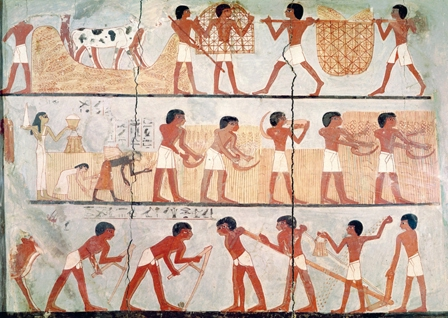

11. A wall painting from an Egyptian grave, dated to about 3,500 years ago, depicting typical agricultural scenes.

### 5 History’s Biggest Fraud

FOR 2.5 MILLION YEARS HUMANS FED themselves by gathering plants and hunting animals that lived and bred without their intervention... ...Homo sapiens spread from East Africa to the Middle East, to Europe and Asia, and finally to Australia and America – but everywhere they went, Sapiens too continued to live by gathering wild plants and hunting wild animals. Why do anything else when your lifestyle feeds you amply and supports a rich world of social structures, religious beliefs and political dynamics?

this changed about 10,000 years ago, when Sapiens began to devote almost all their time and effort to manipulating the lives of a few animal and plant species. From sunrise to sunset humans sowed seeds, watered plants, plucked weeds from the ground and led sheep to prime pastures. This work, they thought, would provide them with more fruit, grain and meat. It was a revolution in the way humans lived – the Agricultural Revolution.

The transition to agriculture began around 9500–8500 BC in the hill country of south-eastern Turkey, western Iran, and the Levant. It began slowly and in a restricted geographical area.

Even today, with all our advanced technologies, more than 90 per cent of the calories that feed humanity come from the handful of plants that our ancestors domesticated between 9500 and 3500 BC – wheat, rice, maize (called ‘corn’ in the US), potatoes, millet and barley. No noteworthy plant or animal has been domesticated in the last 2,000 years. 

If our minds are those of hunter-gatherers, our cuisine is that of ancient farmers.

Scholars once believed that agriculture spread from a single Middle Eastern point of origin to the four corners of the world. Today, scholars agree that agriculture sprang up in other parts of the world not by the action of Middle Eastern farmers exporting their revolution but entirely independently... ...By the first century AD the vast majority of people throughout most of the world were agriculturists.

Of the thousands of species that our ancestors hunted and gathered, only a few were suitable candidates for farming and herding. Those few species lived in particular places, and those are the places where agricultural revolutions occurred.

Eventually, people were so smart that they were able to decipher nature’s secrets, enabling them to tame sheep and cultivate wheat. As soon as this happened, they cheerfully abandoned the gruelling, dangerous, and often spartan life of hunter-gatherers, settling down to enjoy the pleasant, satiated life of farmers.

Map 2. Locations and dates of agricultural revolutions. The data is contentious, and the map is constantly being redrawn to incorporate the latest archaeological discoveries.

There is no evidence that people became more intelligent with time. Foragers knew the secrets of nature long before the Agricultural Revolution, since their survival depended on an intimate knowledge of the animals they hunted and the plants they gathered. Rather than heralding a new era of easy living

Agricultural Revolution left farmers with lives generally more difficult and less satisfying than those of foragers. Hunter-gatherers spent their time in more stimulating and varied ways, and were less in danger of starvation and disease. The Agricultural Revolution certainly enlarged the sum total of food at the disposal of humankind, but the extra food did not translate into a better diet or more leisure. Rather, it translated into population explosions and pampered elites. 

The average farmer worked harder than the average forager, and got a worse diet in return. The Agricultural Revolution was history’s biggest fraud.

The culprits were a handful of plant species, including wheat, rice and potatoes. These plants domesticated Homo sapiens, rather than vice versa.

the Agricultural Revolution from the viewpoint of wheat. Ten thousand years ago wheat was just a wild grass, one of many, confined to a small range in the Middle East. Suddenly, within just a few short millennia, it was growing all over the world. According to the basic evolutionary criteria of survival and reproduction, wheat has become one of the most successful plants in the history of the earth.

How did this grass turn from insignificant to ubiquitous? Wheat did it by manipulating Homo sapiens to its advantage. This ape had been living a fairly comfortable life hunting and gathering until about 10,000 years ago, but then began to invest more and more effort in cultivating wheat. Within a couple of millennia, humans in many parts of the world were doing little from dawn to dusk other than taking care of wheat plants. It wasn’t easy. Wheat demanded a lot of them. Wheat didn’t like rocks and pebbles, so Sapiens broke their backs clearing fields. Wheat didn’t like sharing its space, water and nutrients with other plants, so men and women laboured long days weeding under the scorching sun. Wheat got sick, so Sapiens had to keep a watch out for worms and blight. Wheat was defenceless against other organisms that liked to eat it, from rabbits to locust swarms, so the farmers had to guard and protect it. Wheat was thirsty, so humans lugged water from springs and streams to water it. Its hunger even impelled Sapiens to collect animal faeces to nourish the ground in which wheat grew. The body of Homo sapiens had not evolved for such tasks. It was adapted to climbing apple trees and running after gazelles, not to clearing rocks and carrying water buckets. Human spines, knees, necks and arches paid the price. Studies of ancient skeletons indicate that the transition to agriculture brought about a plethora of ailments, such as slipped discs, arthritis and hernias. Moreover, the new agricultural tasks demanded so much time that people were forced to settle permanently next to their wheat fields. This completely changed their way of life. We did not domesticate wheat. It domesticated us.

Foragers relied on dozens of species to survive, and could therefore weather difficult years even without stocks of preserved food. If the availability of one species was reduced, they could gather and hunt more of other species. Farming societies have, until very recently, relied for the great bulk of their calorie intake on a small variety of domesticated plants. In many areas, they relied on just a single staple, such as wheat, potatoes or rice. If the rains failed or clouds of locusts arrived or if a fungus learned how to infect that staple species, peasants died by the thousands and millions.

When a strong enemy threatened an agricultural village, retreat meant giving up fields, houses and granaries. In many cases, this doomed the refugees to starvation. Farmers, therefore, tended to stay put and fight to the bitter end.

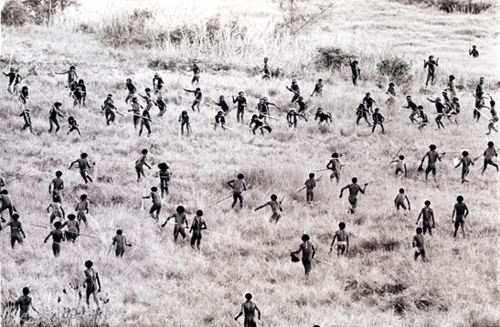

12. Tribal warfare in New Guinea between two farming communities (1960). Such scenes were probably widespread in the thousands of years following the Agricultural Revolution.

In simple agricultural societies with no political frameworks beyond village and tribe, human violence was responsible for about 15 per cent of deaths, including 25 per cent of male deaths.

human violence was brought under control through the development of larger social frameworks – cities, kingdoms and states. But it took thousands of years to build such huge and effective political structures.

Village life certainly brought the first farmers some immediate benefits, such as better protection against wild animals, rain and cold. Yet for the average person, the disadvantages probably outweighed the advantages. This is hard for people in today’s prosperous societies to appreciate. Since we enjoy affluence and security, and since our affluence and security are built on foundations laid by the Agricultural Revolution, we assume that the Agricultural Revolution was a wonderful improvement

it is wrong to judge thousands of years of history from the perspective of today.

a three-year-old girl dying from malnutrition in first-century China because her father’s crops have failed. Would she say ‘I am dying from malnutrition, but in 2,000 years, people will have plenty to eat and live in big air-conditioned houses,

What then did wheat offer agriculturists... ...It offered nothing for people as individuals. Yet it did bestow something on Homo sapiens as a species. Cultivating wheat provided much more food per unit of territory, and thereby enabled Homo sapiens to multiply exponentially.

The currency of evolution is neither hunger nor pain, but rather copies of DNA helixes. 

Just as the economic success of a company is measured only by the number of dollars in its bank account, not by the happiness of its employees, so the evolutionary success of a species is measured by the number of copies of its DNA.

From such a perspective, 1,000 copies are always better than a hundred copies. This is the essence of the Agricultural Revolution: the ability to keep more people alive under worse conditions.

why should individuals care about this evolutionary calculus? Why would any sane person lower his or her standard of living just to multiply the number of copies of the Homo sapiens genome? Nobody agreed to this deal: the Agricultural Revolution was a trap.

#### The Luxury Trap

A band of Homo sapiens gathering mushrooms and nuts and hunting deer and rabbit did not all of a sudden settle in a permanent village, ploughing fields, sowing wheat and carrying water from the river. The change proceeded by stages, each of which involved just a small alteration in daily life.

Humans, like many mammals, have hormonal and genetic mechanisms that help control procreation. In good times females reach puberty earlier, and their chances of getting pregnant are a bit higher. In bad times puberty is late and fertility decreases.

People tried to space their children three to four years apart. Women did so by nursing their children around the clock and until a late age (around-the-clock suckling significantly decreases the chances of getting pregnant). 

Other methods included full or partial sexual abstinence (backed perhaps by cultural taboos), abortions and occasionally infanticide.

About 18,000 years ago, the last ice age gave way to a period of global warming. As temperatures rose, so did rainfall. The new climate was ideal for Middle Eastern wheat and other cereals, which multiplied and spread. People began eating more wheat, and in exchange they inadvertently spread its growth. Since it was impossible to eat wild grains without first winnowing, grinding and cooking them, people who gathered these grains carried them back to their temporary campsites for processing. Wheat grains are small and numerous, so some of them inevitably fell on the way to the campsite and were lost. Over time, more and more wheat grew along favourite human trails and near campsites. When humans burned down forests and thickets, this also helped wheat. Fire cleared away trees and shrubs, allowing wheat and other grasses to monopolise the sunlight, water and nutrients. Where wheat became particularly abundant, and game and other food sources were also plentiful, human bands could gradually give up their nomadic lifestyle and settle down in seasonal and even permanent camps.

Evidence of such settlements has been discovered throughout the Middle East, particularly in the Levant, where the Natufian culture flourished from 12,500 BC to 9500 BC. The Natufians were hunter-gatherers who subsisted on dozens of wild species, but they lived in permanent villages and devoted much of their time to the intensive gathering and processing of wild cereals. 

began to cultivate them in more and more elaborate ways. When gathering wild grains, they took care to lay aside part of the harvest to sow the fields next season. They discovered that they could achieve much better results by sowing the grains deep in the ground rather than haphazardly scattering them on the surface. So they began to hoe and plough

As more effort was directed towards cereal cultivation, there was less time to gather and hunt wild species. The foragers became farmers.

With the move to permanent villages and the increase in food supply, the population began to grow. Giving up the nomadic lifestyle enabled women to have a child every year. Babies were weaned at an earlier age – they could be fed on porridge and gruel.

As people began living in disease-ridden settlements, as children fed more on cereals and less on mother’s milk, and as each child competed for his or her porridge with more and more siblings, child mortality soared. In most agricultural societies at least one out of every three children died before reaching twenty.5 Yet the increase in births still outpaced the increase in deaths; humans kept having larger numbers of children.

With time, the ‘wheat bargain’ became more and more burdensome. Children died in droves, and adults ate bread by the sweat of their brows. The average person in Jericho of 8500 BC lived a harder life than the average person in Jericho of 9500 BC or 13,000 BC. But nobody realised what was happening. Every generation continued to live like the previous generation, making only small improvements here and there in the way things were done. Paradoxically, a series of ‘improvements’, each of which was meant to make life easier, added up to a millstone around the necks of these farmers.

Why did people make such a fateful miscalculation? For the same reason that people throughout history have miscalculated. People were unable to fathom the full consequences of their decisions... ...If you worked harder, you would have a better life. That was the plan.

people did not foresee that the number of children would increase, meaning that the extra wheat would have to be shared between more children. Neither did the early farmers understand that feeding children with more porridge and less breast milk would weaken their immune system, and that permanent settlements would be hotbeds for infectious diseases. They did not foresee that by increasing their dependence on a single source of food, they were actually exposing themselves even more to the depredations of drought. Nor did the farmers foresee that in good years their bulging granaries would tempt thieves and enemies, compelling them to start building walls and doing guard duty.

it took generations for the small changes to accumulate and transform society and, by then, nobody remembered that they had ever lived differently. And partly because population growth burned humanity’s boats. If the adoption of ploughing increased a village’s population from a hundred to no, which ten people would have volunteered to starve so that the others could go back to the good old times? There was no going back. The trap snapped shut.

The pursuit of an easier life resulted in much hardship, and not for the last time. It happens to us today. How many young college graduates have taken demanding jobs in high-powered firms, vowing that they will work hard to earn money that will enable them to retire and pursue their real interests when they are thirty-five? But by the time they reach that age, they have large mortgages, children to school, houses in the suburbs that necessitate at least two cars per family, and a sense that life is not worth living without really good wine and expensive holidays abroad.

One of history’s few iron laws is that luxuries tend to become necessities and to spawn new obligations. 

Once people get used to a certain luxury, they take it for granted. Then they begin to count on it. Finally they reach a point where they can’t live without it.

Back in the snail-mail era, people usually only wrote letters when they had something important to relate. Rather than writing the first thing that came into their heads, they considered carefully what they wanted to say and how to phrase it. They expected to receive a similarly considered answer. Most people wrote and received no more than a handful of letters a month and seldom felt compelled to reply immediately. Today I receive dozens of emails each day, all from people who expect a prompt reply. We thought we were saving time; instead we revved up the treadmill of life to ten times its former speed and made our days more anxious and agitated.

Agricultural Revolution didn’t need every band in a given region to join up. It only took one. Once one band settled down and started tilling, whether in the Middle East or Central America, agriculture was irresistible. Since farming created the conditions for swift demographic growth, farmers could usually overcome foragers by sheer weight of numbers. The foragers could either run away, abandoning their hunting grounds to field and pasture, or take up the ploughshare themselves. Either way, the old life was doomed.

A series of trivial decisions aimed mostly at filling a few stomachs and gaining a little security had the cumulative effect of forcing ancient foragers to spend their days carrying water buckets under a scorching sun.

#### Divine Intervention

History is full of far more idiotic miscalculations. 

there’s another possibility. Maybe it wasn’t the search for an easier life that brought about the transformation. Maybe Sapiens had other aspirations, and were consciously willing to make their lives harder in order to achieve them.

Scientists usually seek to attribute historical developments to cold economic and demographic factors. It sits better with their rational and mathematical methods. In the case of modern history, scholars cannot avoid taking into account non-material factors such as ideology and culture. The written evidence forces their hand. We have enough documents, letters and memoirs to prove that World War Two was not caused by food shortages or demographic pressures. But we have no documents from the Natufian culture, so when dealing with ancient periods the materialist school reigns supreme. 

It is difficult to prove that preliterate people were motivated by faith rather than economic necessity.

Stonehenge in Britain. Yet as they studied Göbekli Tepe, they discovered an amazing fact. Stonehenge dates to 2500 BC, and was built by a developed agricultural society. The structures at Göbekli Tepe are dated to about 9500 BC, and all available evidence indicates that they were built by hunter-gatherers. The archaeological community initially found it difficult to credit these findings, but one test after another confirmed both the early date of the structures and the pre-agricultural society of their builders. The capabilities of ancient foragers, and the complexity of their cultures, seem to be far more impressive than was previously suspected.

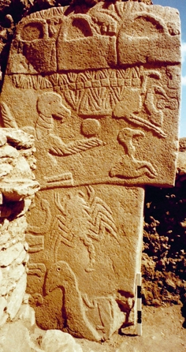

13. Opposite: The remains of a monumental structure from Göbekli Tepe. Right: One of the decorated stone pillars (about five metres high).

Why would a foraging society build such structures? They had no obvious utilitarian purpose. They were neither mammoth slaughterhouses nor places to shelter from rain or hide from lions. That leaves us with the theory that they were built for some mysterious cultural purpose that archaeologists have a hard time deciphering. Whatever it was, the foragers thought it worth a huge amount of effort and time. The only way to build Göbekli Tepe was for thousands of foragers belonging to different bands and tribes to cooperate over an extended period of time. Only a sophisticated religious or ideological system could sustain such efforts.

Recent discoveries indicate that at least one domesticated variant, einkorn wheat, originated in the Karaçadag Hills – about thirty kilometres from Göbekli Tepe.

This can hardly be a coincidence. It’s likely that the cultural centre of Göbekli Tepe was somehow connected to the initial domestication of wheat by humankind and of humankind by wheat.

In the conventional picture, pioneers first built a village, and when it prospered, they set up a temple in the middle. But Göbekli Tepe suggests that the temple may have been built first, and that a village later grew up around it.

#### Victims of the Revolution

Another deal was struck concerning the fate of animals such as sheep, goats, pigs and chickens. Nomadic bands that stalked wild sheep gradually altered the constitutions of the herds on which they preyed. This process probably began with selective hunting. Humans learned that it was to their advantage to hunt only adult rams and old or sick sheep. They spared fertile females and young lambs in order to safeguard the long-term vitality of the local herd. The second step might have been to actively defend the herd against predators, driving away lions, wolves and rival human bands. The band might next have corralled the herd into a narrow gorge in order to better control and defend it. Finally, people began to make a more careful selection among the sheep in order to tailor them to human needs.

With each passing generation, the sheep became fatter, more submissive and less curious. Voilà! Mary had a little lamb and everywhere that Mary went the lamb was sure to go.

Alternatively, hunters may have caught and adopted’ a lamb, fattening it during the months of plenty and slaughtering it in the leaner season. At some stage they began keeping a greater number of such lambs. Some of these reached puberty and began to procreate. The most aggressive and unruly lambs were first to the slaughter. The most submissive, most appealing lambs were allowed to live longer and procreate. The result was a herd of domesticated and submissive sheep.

domesticated animals – sheep, chickens, donkeys and others – supplied food (meat, milk, eggs), raw materials (skins, wool), and muscle power.

As humans spread around the world, so did their domesticated animals. Ten thousand years ago, not more than a few million sheep, cattle, goats, boars and chickens lived in restricted Afro-Asian niches. Today the world contains about a billion sheep, a billion pigs, more than a billion cattle, and more than 25 billion chickens.

From a narrow evolutionary perspective, which measures success by the number of DNA copies, the Agricultural Revolution was a wonderful boon for chickens, cattle, pigs and sheep. Unfortunately, the evolutionary perspective is an incomplete measure of success. It judges everything by the criteria of survival and reproduction, with no regard for individual suffering and happiness.

The natural lifespan of wild chickens is about seven to twelve years, and of cattle about twenty to twenty-five years. In the wild, most chickens and cattle died long before that, but they still had a fair chance of living for a respectable number of years. In contrast, the vast majority of domesticated chickens and cattle are slaughtered at the age of between a few weeks and a few months, because this has always been the optimal slaughtering age from an economic perspective. (Why keep feeding a cock for three years if it has already reached its maximum weight after three months?)

In order to turn bulls, horses, donkeys and camels into obedient draught animals, their natural instincts and social ties had to be broken, their aggression and sexuality contained, and their freedom of movement curtailed.

![14. A painting from an Egyptian grave, c.1200 BC: A pair of oxen ploughing a field. In the wild, cattle roamed as they pleased in herds with a complex social structure. The castrated and domesticated ox wasted away his life under the lash and in a narrow pen, labouring alone or in pairs in a way that suited neither its body nor its social and emotional needs. When an ox could no longer pull the plough, it was slaughtered. (Note the hunched position of the Egyptian farmer who, much like the ox, spent his life in hard labour oppressive to his body, his mind and his social relationships.)](./assets/figure14.jpg)

14. A painting from an Egyptian grave, c.1200 BC: A pair of oxen ploughing a field. In the wild, cattle roamed as they pleased in herds with a complex social structure. The castrated and domesticated ox wasted away his life under the lash and in a narrow pen, labouring alone or in pairs in a way that suited neither its body nor its social and emotional needs. When an ox could no longer pull the plough, it was slaughtered. (Note the hunched position of the Egyptian farmer who, much like the ox, spent his life in hard labour oppressive to his body, his mind and his social relationships.)

In many New Guinean societies, the wealth of a person has traditionally been determined by the number of pigs he or she owns. To ensure that the pigs can’t run away, farmers in northern New Guinea slice off a chunk of each pig’s nose. This causes severe pain whenever the pig tries to sniff. Since the pigs cannot find food or even find their way around without sniffing, this mutilation makes them completely dependent on their human owners. In another area of New Guinea, it has been customary to gouge out pigs’ eyes, so that they cannot even see where they’re going.

In many modern dairy farms a milk cow usually lives for about five years before being slaughtered. During these five years she is almost constantly pregnant, and is fertilised within 60 to 120 days after giving birth in order to preserve maximum milk production. Her calves are separated from her shortly after birth. The females are reared to become the next generation of dairy cows, whereas the males are handed over to the care of the meat industry.

Some shepherd tribes used to kill the offspring, eat its flesh, and then stuff the skin. The stuffed offspring was then presented to the mother so that its presence would encourage her milk production.

Tuareg camel breeders in the Sahara used to puncture or cut off parts of the nose and upper lip of young camels in order to make suckling painful, thereby discouraging them from consuming too much milk.

Sheep raised for wool, pet dogs and cats, war horses and race horses often enjoyed comfortable conditions. 

Shepherds and farmers throughout history showed affection for their animals and have taken great care of them, just as many slaveholders felt affection and concern for their slaves. It was no accident that kings and prophets styled themselves as shepherds and likened the way they and the gods cared for their people to a shepherd’s care for his flock.

![15. A modern calf in an industrial meat farm. Immediately after birth the calf is separated from its mother and locked inside a tiny cage not much bigger than the calf’s own body. There the calf spends its entire life – about four months on average. It never leaves its cage, nor is it allowed to play with other calves or even walk – all so that its muscles will not grow strong. Soft muscles mean a soft and juicy steak. The first time the calf has a chance to walk, stretch its muscles and touch other calves is on its way to the slaughterhouse. In evolutionary terms, cattle represent one of the most successful animal species ever to exist. At the same time, they are some of the most miserable animals on the planet.](./assets/figure15.jpg)

15. A modern calf in an industrial meat farm. Immediately after birth the calf is separated from its mother and locked inside a tiny cage not much bigger than the calf’s own body. There the calf spends its entire life – about four months on average. It never leaves its cage, nor is it allowed to play with other calves or even walk – all so that its muscles will not grow strong. Soft muscles mean a soft and juicy steak. The first time the calf has a chance to walk, stretch its muscles and touch other calves is on its way to the slaughterhouse. In evolutionary terms, cattle represent one of the most successful animal species ever to exist. At the same time, they are some of the most miserable animals on the planet.

This discrepancy between evolutionary success and individual suffering is perhaps the most important lesson we can draw from the Agricultural Revolution. 

When we study the narrative of plants such as wheat and maize, maybe the purely evolutionary perspective makes sense. Yet in the case of animals such as cattle, sheep and Sapiens, each with a complex world of sensations and emotions, we have to consider how evolutionary success translates into individual experience.

### 6 Building Pyramids

THE AGRICULTURAL REVOLUTION IS ONE of the most controversial events in history. Some partisans proclaim that it set humankind on the road to prosperity and progress. Others insist that it led to perdition. This was the turning point, they say, where Sapiens cast off its intimate symbiosis with nature and sprinted towards greed and alienation.

Around 10,000 BC, before the transition to agriculture, earth was home to about 5–8 million nomadic foragers. By the first century AD, only 1–2 million foragers remained (mainly in Australia, America and Africa), but their numbers were dwarfed by the world’s 250 million farmers

Ancient hunter-gatherers usually lived in territories covering many dozens and even hundreds of square kilometres. ‘Home’ was the entire territory, with its hills, streams, woods and open sky. Peasants, on the other hand, spent most of their days working a small field or orchard, and their domestic lives centred on a cramped structure of wood, stone or mud, measuring no more than a few dozen metres – the house. 

The typical peasant developed a very strong attachment to this structure. This was a far-reaching revolution, whose impact was psychological as much as architectural. Henceforth, attachment to ‘my house’ and separation from the neighbours became the psychological hallmark of a much more self-centred creature.

Aside from the use of fire, hunter-gatherers made few deliberate changes to the lands in which they roamed. Farmers, on the other hand, lived in artificial human islands that they laboriously carved out of the surrounding wilds. They cut down forests, dug canals, cleared fields, built houses, ploughed furrows, and planted fruit trees in tidy rows. The resulting artificial habitat was meant only for humans and ‘their’ plants and animals, and was often fenced off by walls and hedges.

As late as AD 1400, the vast majority of farmers, along with their plants and animals, clustered together in an area of just 11 million square kilometres – 2 per cent of the planet’s surface.2 Everywhere else was too cold, too hot, too dry, too wet, or otherwise unsuited for cultivation. This minuscule 2 percent of the earth’s surface constituted the stage on which history unfolded.

Ancient farmers might seem to us dirt poor, but a typical family possessed more artefacts than an entire forager tribe.

#### The Coming of the Future

In the subsistence economy of hunting and gathering, there was an obvious limit to such long-term planning. Paradoxically, it saved foragers a lot of anxieties. There was no sense in worrying about things that they could not influence.

The Agricultural Revolution made the future far more important than it had ever been before. Farmers must always keep the future in mind and must work in its service.

Although there was enough food for today, next week, and even next month, they had to worry about next year and the year after that.

Since most villages lived by cultivating a very limited variety of domesticated plants and animals, they were at the mercy of droughts, floods and pestilence. Peasants were obliged to produce more than they consumed so that they could build up reserves.

Without grain in the silo, jars of olive oil in the cellar, cheese in the pantry and sausages hanging from the rafters, they would starve in bad years. And bad years were bound to come, sooner or later. A peasant living on the assumption that bad years would not come didn’t live long.

worries about the future became major players in the theatre of the human mind.

in the valleys of the Euphrates, Indus and Yellow rivers, other peasants monitored, with no less trepidation, the height of the water. They needed the rivers to rise in order to spread the fertile topsoil washed down from the highlands, and to enable their vast irrigation systems to fill with water. But floods that surged too high or came at the wrong time could destroy their fields as much as a drought.

Peasants were worried about the future not just because they had more cause for worry, but also because they could do something about it... ...The anxious peasant was as frenetic and hardworking as a harvester ant in the summer, sweating to plant olive trees whose oil would be pressed by his children and grandchildren, putting off until the winter or the following year the eating of the food he craved today.

The stress of farming had far-reaching consequences. It was the foundation of large-scale political and social systems. Sadly, the diligent peasants almost never achieved the future economic security they so craved through their hard work in the present. Everywhere, rulers and elites sprang up, living off the peasants’ surplus food and leaving them with only a bare subsistence.

Until the late modern era, more than 90 per cent of humans were peasants who rose each morning to till the land by the sweat of their brows. The extra they produced fed the tiny minority of elites – kings, government officials, soldiers, priests, artists and thinkers – who fill the history books.

History is something that very few people have been doing while everyone else was ploughing fields and carrying water buckets.

#### An Imagined Order

The food surpluses produced by peasants, coupled with new transportation technology, eventually enabled more and more people to cram together first into large villages, then into towns, and finally into cities, all of them joined together by new kingdoms and commercial networks.

The mere fact that one can feed a thousand people in the same town or a million people in the same kingdom does not guarantee that they can agree how to divide the land and water, how to settle disputes and conflicts, and how to act in times of drought or war. And if no agreement can be reached, strife spreads, even if the storehouses are bulging. 

It was not food shortages that caused most of history’s wars and revolutions. The French Revolution was spearheaded by affluent lawyers, not by famished peasants. The Roman Republic reached the height of its power in the first century BC, when treasure fleets from throughout the Mediterranean enriched the Romans beyond their ancestors’ wildest dreams. Yet it was at that moment of maximum affluence that the Roman political order collapsed into a series of deadly civil wars. 

The problem at the root of such calamities is that humans evolved for millions of years in small bands of a few dozen individuals. The handful of millennia separating the Agricultural Revolution from the appearance of cities, kingdoms and empires was not enough time to allow an instinct for mass cooperation to evolve.

An archaic sociologist living 20,000 years ago, who had no knowledge of events following the Agricultural Revolution, might well have concluded that mythology had a fairly limited scope. Stories about ancestral spirits and tribal totems were strong enough to enable 500 people to trade seashells, celebrate the odd festival, and join forces to wipe out a Neanderthal band, but no more than that. Mythology, the ancient sociologist would have thought, could not possibly enable millions of strangers to cooperate on a daily basis. But that turned out to be wrong. Myths, it transpired, are stronger than anyone could have imagined. When the Agricultural Revolution opened opportunities for the creation of crowded cities and mighty empires, people invented stories about great gods, motherlands and joint stock companies to provide the needed social links. While human evolution was crawling at its usual snail’s pace, the human imagination was building astounding networks of mass cooperation, unlike any other ever seen on earth.

Around 8500 BC the largest settlements in the world were villages such as Jericho, which contained a few hundred individuals. By 7000 BC the town of Çatalhöyük in Anatolia numbered between 5,000 and 10,000 individuals. It may well have been the world’s biggest settlement at the time... ...Around 2250 BC Sargon the Great forged the first empire, the Akkadian. It boasted over a million subjects and a standing army of 5,400 soldiers. Between 1000 BC and 500 BC, the first mega-empires appeared in the Middle East: the Late Assyrian Empire, the Babylonian Empire, and the Persian Empire. They ruled over many millions of subjects and commanded tens of thousands of soldiers. In 221 BC the Qin dynasty united China, and shortly afterwards Rome united the Mediterranean basin. Taxes levied on 40 million Qin subjects paid for a standing army of hundreds of thousands of soldiers and a complex bureaucracy that employed more than 100,000 officials. The Roman Empire at its zenith collected taxes from up to 100 million subjects. This revenue financed a standing army of 250,000–500,000 soldiers, a road network still in use 1,500 years later, and theatres and amphitheatres that host spectacles to this day.

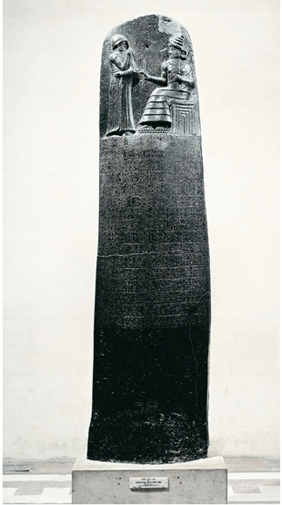

16. A stone stela inscribed with the Code of Hammurabi, c.1776 BC.

Cooperation’ sounds very altruistic, but is not always voluntary and seldom egalitarian. Most human cooperation networks have been geared towards oppression and exploitation.

The famed Roman amphitheatres were often built by slaves so that wealthy and idle Romans could watch other slaves engage in vicious gladiatorial combat. 

17. The Declaration of Independence of the United States, signed 4 July 1776.

All these cooperation networks – from the cities of ancient Mesopotamia to the Qin and Roman empires – were ‘imagined orders’. The social norms that sustained them were based neither on ingrained instincts nor on personal acquaintances, but rather on belief in shared myths.

How can myths sustain entire empires? We have already discussed one such example: Peugeot. Now let’s examine two of the best-known myths of history: the Code of Hammurabi of c.1776 BC, which served as a cooperation manual for hundreds of thousands of ancient Babylonians; and the American Declaration of Independence of 1776 AD, which today still serves as a cooperation manual for hundreds of millions of modern Americans.

In 1776 BC Babylon was the world’s biggest city. The Babylonian Empire was probably the world’s largest, with more than a million subjects. It ruled most of Mesopotamia, including the bulk of modern Iraq and parts of present-day Syria and Iran. The Babylonian king most famous today was Hammurabi. His fame is due primarily to the text that bears his name, the Code of Hammurabi... ...For example, judgements 196–9 and 209–14 read:

- 196.   	If a superior man should blind the eye of another superior man, they shall blind his eye.
- 197.	If he should break the bone of another superior man, they shall break his bone.
- 198.	If he should blind the eye of a commoner or break the bone of a commoner, he shall weigh and deliver 60 shekels of silver.
- 199.	If he should blind the eye of a slave of a superior man or break the bone of a slave of a superior man, he shall weigh and deliver one-half of - the slave’s value (in silver).5
- 209.	If a superior man strikes a woman of superior class and thereby causes her to miscarry her fetus, he shall weigh and deliver ten shekels of silver for her fetus.
- 210.	If that woman should die, they shall kill his daughter.
- 211.	If he should cause a woman of commoner class to miscarry her fetus by the beating, he shall weigh and deliver five shekels of silver.

After listing his judgements, Hammurabi again declares that These are the just decisions which Hammurabi, the able king, has established and thereby has directed the land along the course of truth and the correct way of life … I am Hammurabi, noble king. I have not been careless or negligent toward humankind, granted to my care by the god Enlil, and with whose shepherding the god Marduk charged me... ...To us it may seem strange that the killer remains unharmed whereas his innocent daughter is killed, but to Hammurabi and the Babylonians this seemed perfectly just. Hammurabi’s Code was based on the premise that if the king’s subjects all accepted their positions in the hierarchy and acted accordingly, the empire’s million inhabitants would be able to cooperate effectively. Their society could then produce enough food for its members, distribute it efficiently, protect itself against its enemies, and expand its territory so as to acquire more wealth and better security.

About 3,500 years after Hammurabi’s death, the inhabitants of thirteen British colonies in North America felt that the king of England was treating them unjustly. Their representatives gathered in the city of Philadelphia, and on 4 July 1776 the colonies declared that their inhabitants were no longer subjects of the British Crown. Their Declaration of Independence proclaimed universal and eternal principles of justice, which, like those of Hammurabi, were inspired by a divine power. However, the most important principle dictated by the American god was somewhat different from the principle dictated by the gods of Babylon. The American Declaration of Independence asserts that: We hold these truths to be self-evident, that all men are created equal, that they are endowed by their Creator with certain unalienable rights, that among these are life, liberty, and the pursuit of happiness. Like Hammurabi’s Code, the American founding document promises that if humans act according to its sacred principles, millions of them would be able to cooperate effectively, living safely and peacefully in a just and prosperous society.

The Americans would, of course, say that they are right, and that Hammurabi is wrong. Hammurabi, naturally, would retort that he is right, and that the Americans are wrong. In fact, they are both wrong. Hammurabi and the American Founding Fathers alike imagined a reality governed by universal and immutable principles of justice, such as equality or hierarchy. Yet the only place where such universal principles exist is in the fertile imagination of Sapiens, and in the myths they invent and tell one another. These principles have no objective validity.

The idea that all humans are equal is also a myth. In what sense do all humans equal one another? Is there any objective reality, outside the human imagination, in which we are truly equal? Are all humans equal to one another biologically? Let us try to translate the most famous line of the American Declaration of Independence into biological terms: We hold these truths to be self-evident, that all men are created equal, that they are endowed by their Creator with certain unalienable rights, that among these are life, liberty, and the pursuit of happiness. According to the science of biology, people were not created’. They have evolved. And they certainly did not evolve to be ‘equal’. The idea of equality is inextricably intertwined with the idea of creation. The Americans got the idea of equality from Christianity, which argues that every person has a divinely created soul, and that all souls are equal before God. However, if we do not believe in the Christian myths about God, creation and souls, what does it mean that all people are ‘equal’? 

Evolution is based on difference, not on equality. Every person carries a somewhat different genetic code, and is exposed from birth to different environmental influences. This leads to the development of different qualities that carry with them different chances of survival. ‘Created equal’ should therefore be translated into ‘evolved differently’.

There is only a blind evolutionary process, devoid of any purpose, leading to the birth of individuals. ‘Endowed by their creator’ should be translated simply into ‘born.

Equally, there are no such things as rights in biology. There are only organs, abilities and characteristics. Birds fly not because they have a right to fly, but because they have wings. And it’s not true that these organs, abilities and characteristics are ‘unalienable’. Many of them undergo constant mutations, and may well be completely lost over time. The ostrich is a bird that lost its ability to fly. So ‘unalienable rights’ should be translated into ‘mutable characteristics’.

Just like equality, rights and limited liability companies, liberty is something that people invented and that exists only in their imagination. 

what about ‘happiness’? So far biological research has failed to come up with a clear definition of happiness or a way to measure it objectively. Most biological studies acknowledge only the existence of pleasure, which is more easily defined and measured. So ‘life, liberty, and the pursuit of happiness’ should be translated into ‘life and the pursuit of pleasure’.

So here is that line from the American Declaration of Independence translated into biological terms: We hold these truths to be self-evident, that all men evolved differently, that they are born with certain mutable characteristics, and that among these are life and the pursuit of pleasure.

‘imagined order’. We believe in a particular order not because it is objectively true, but because believing in it enables us to cooperate effectively and forge a better society. 

#### True Believers

we do not want to hear that human rights are also a myth. If people realise that human rights exist only in the imagination, isn’t there a danger that our society will collapse? 

Voltaire said about God that ‘there is no God, but don’t tell that to my servant, lest he murder me at night’. Hammurabi would have said the same about his principle of hierarchy, and Thomas Jefferson about human rights. Homo sapiens has no natural rights, just as spiders, hyenas and chimpanzees have no natural rights. But don’t tell that to our servants, lest they murder us at night.

A natural order is a stable order. There is no chance that gravity will cease to function tomorrow, even if people stop believing in it. In contrast, an imagined order is always in danger of collapse, because it depends upon myths, and myths vanish once people stop believing in them. 

Armies, police forces, courts and prisons are ceaselessly at work forcing people to act in accordance with the imagined order.

When, in 1860, a majority of American citizens concluded that African slaves are human beings and must therefore enjoy the right of liberty, it took a bloody civil war to make the southern states acquiesce.

an imagined order cannot be sustained by violence alone. It requires some true believers as well... ...A single priest often does the work of a hundred soldiers far more cheaply and effectively... ...Why should the soldiers, jailors, judges and police maintain an imagined order in which they do not believe? Of all human collective activities, the one most difficult to organise is violence. To say that a social order is maintained by military force immediately raises the question: what maintains the military order? It is impossible to organise an army solely by coercion. At least some of the commanders and soldiers must truly believe in something, be it God, honour, motherland, manhood or money.

An even more interesting question concerns those standing at the top of the social pyramid. Why should they wish to enforce an imagined order if they themselves don’t believe in it? It is quite common to argue that the elite may do so out of cynical greed. Yet a cynic who believes in nothing is unlikely to be greedy. It does not take much to provide the objective biological needs of Homo sapiens. After those needs are met, more money can be spent on building pyramids, taking holidays around the world, financing election campaigns, funding your favourite terrorist organisation, or investing in the stock market and making yet more money – all of which are activities that a true cynic would find utterly meaningless. Diogenes, the Greek philosopher who founded the Cynical school, lived in a barrel. When Alexander the Great once visited Diogenes as he was relaxing in the sun, and asked if there were anything he might do for him, the Cynic answered the all-powerful conqueror, ‘Yes, there is something you can do for me. Please move a little to the side. You are blocking the sunlight.’

cynics don’t build empires and why an imagined order can be maintained only if large segments of the population – and in particular large segments of the elite and the security forces – truly believe in it

American democracy would not have lasted 250 years if the majority of presidents and congressmen failed to believe in human rights. 

The modern economic system would not have lasted a single day if the majority of investors and bankers failed to believe in capitalism.

#### The Prison Walls

How do you cause people to believe in an imagined order such as Christianity, democracy or capitalism? First, you never admit that the order is imagined. You always insist that the order sustaining society is an objective reality created by the great gods or by the laws of nature.

You also educate people thoroughly. From the moment they are born, you constantly remind them of the principles of the imagined order, which are incorporated into anything and everything.

today people believe in equality, so it’s fashionable for rich kids to wear jeans, which were originally working-class attire. In the Middle Ages people believed in class divisions, so no young nobleman would have worn a peasant’s smock. 

Three main factors prevent people from realising that the order organising their lives exists only in their imagination:

a. The imagined order is embedded in the material world. Though the imagined order exists only in our minds, it can be woven into the material reality around us, and even set in stone. Most Westerners today believe in individualism. They believe that every human is an individual, whose worth does not depend on what other people think of him or her... ...Medieval noblemen did not believe in individualism. Someone’s worth was determined by their place in the social hierarchy, and by what other people said about them.

b. The imagined order shapes our desires. Most people do not wish to accept that the order governing their lives is imaginary, but in fact every person is born into a pre-existing imagined order, and his or her desires are shaped from birth by its dominant myths. Our personal desires thereby become the imagined order’s most important defences. For instance, the most cherished desires of present-day Westerners are shaped by romantic, nationalist, capitalist and humanist myths that have been around for centuries. Friends giving advice often tell each other, ‘Follow your heart.’ But the heart is a double agent that usually takes its instructions from the dominant myths of the day, and the very recommendation to ‘Follow your heart’ was implanted in our minds by a combination of nineteenth-century Romantic myths and twentieth-century consumerist myths... ...Even what people take to be their most personal desires are usually programmed by the imagined order. Let’s consider, for example, the popular desire to take a holiday abroad... ...The elite of ancient Egypt spent their fortunes building pyramids and having their corpses mummified, but none of them thought of going shopping in Babylon or taking a skiing holiday in Phoenicia. People today spend a great deal of money on holidays abroad because they are true believers in the myths of romantic consumerism. Romanticism tells us that in order to make the most of our human potential we must have as many different experiences as we can. We must open ourselves to a wide spectrum of emotions; we must sample various kinds of relationships; we must try different cuisines; we must learn to appreciate different styles of music. One of the best ways to do all that is to break free from our daily routine, leave behind our familiar setting, and go travelling in distant lands, where we can ‘experience’ the culture, the smells, the tastes and the norms of other people. We hear again and again the romantic myths about ‘how a new experience opened my eyes and changed my life’. Consumerism tells us that in order to be happy we must consume as many products and services as possible. If we feel that something is missing or not quite right, then we probably need to buy a product (a car, new clothes, organic food) or a service (housekeeping, relationship therapy, yoga classes). Every television commercial is another little legend about how consuming some product or service will make life better. Romanticism, which encourages variety, meshes perfectly with consumerism. Their marriage has given birth to the infinite ‘market of experiences’, on which the modern tourism industry is founded. The tourism industry does not sell flight tickets and hotel bedrooms. It sells experiences... ...A wealthy man in ancient Egypt would never have dreamed of solving a relationship crisis by taking his wife on holiday to Babylon. Instead, he might have built for her the sumptuous tomb she had always wanted.

18. The Great Pyramid of Giza. The kind of thing rich people in ancient Egypt did with their money.

Like the elite of ancient Egypt, most people in most cultures dedicate their lives to building pyramids. Only the names, shapes and sizes of these pyramids change from one culture to the other. They may take the form, for example, of a suburban cottage with a swimming pool and an evergreen lawn, or a gleaming penthouse with an enviable view. Few question the myths that cause us to desire the pyramid in the first place.

c. The imagined order is inter-subjective. Even if by some superhuman effort I succeed in freeing my personal desires from the grip of the imagined order, I am just one person. In order to change the imagined order I must convince millions of strangers to cooperate with me. For the imagined order is not a subjective order existing in my own imagination – it is rather an inter-subjective order, existing in the shared imagination of thousands and millions of people. In order to understand this, we need to understand the difference between ‘objective’, ‘subjective’, and ‘inter-subjective’.

An objective phenomenon exists independently of human consciousness and human beliefs... ...The subjective is something that exists depending on the consciousness and beliefs of a single individual. It disappears or changes if that particular individual changes his or her beliefs... ...The inter-subjective is something that exists within the communication network linking the subjective consciousness of many individuals. If a single individual changes his or her beliefs, or even dies, it is of little importance. However, if most individuals in the network die or change their beliefs, the inter-subjective phenomenon will mutate or disappear. Inter-subjective phenomena are neither malevolent frauds nor insignificant charades. They exist in a different way from physical phenomena such as radioactivity, but their impact on the world may still be enormous. Many of history’s most important drivers are inter-subjective: law, money, gods, nations.

imagined orders are inter-subjective, so in order to change them we must simultaneously change the consciousness of billions of people, which is not easy. A change of such magnitude can be accomplished only with the help of a complex organisation, such as a political party, an ideological movement, or a religious cult. However, in order to establish such complex organisations, it’s necessary to convince many strangers to cooperate with one another. And this will happen only if these strangers believe in some shared myths. It follows that in order to change an existing imagined order, we must first believe in an alternative imagined order.

There is no way out of the imagined order. When we break down our prison walls and run towards freedom, we are in fact running into the more spacious exercise yard of a bigger prison.

### 7 Memory Overload

human teenagers have no genes for football. They can nevertheless play the game with complete strangers because they have all learned an identical set of ideas about football. These ideas are entirely imaginary, but if everyone shares them, we can all play the game.

large systems of cooperation that involve not twenty-two but thousands or even millions of humans require the handling and storage of huge amounts of information, much more than any single human brain can contain and process.

The large societies found in some other species, such as ants and bees, are stable and resilient because most of the information needed to sustain them is encoded in the genome. A female honeybee larva can, for example, grow up to be either a queen or a worker, depending on what food it is fed. Its DNA programmes the necessary behaviours for whatever role it will fulfil in life. Hives can be very complex social structures, containing many different kinds of workers, such as harvesters, nurses and cleaners. But so far researchers have failed to locate lawyer bees. Bees don’t need lawyers, because there is no danger that they might forget or violate the hive constitution. The queen does not cheat the cleaner bees of their food, and they never go on strike demanding higher wages. But humans do such things all the time. 

Because the Sapiens social order is imagined, humans cannot preserve the critical information for running it simply by making copies of their DNA and passing these on to their progeny. A conscious effort has to be made to sustain laws, customs, procedures and manners, otherwise the social order would quickly collapse.
 
Empires generate huge amounts of information. Beyond laws, empires have to keep accounts of transactions and taxes, inventories of military supplies and merchant vessels, and calendars of festivals and victories. For millions of years people stored information in a single place – their brains. Unfortunately, the human brain is not a good storage device for empire-sized databases, for three main reasons. First, its capacity is limited... ...Secondly, humans die, and their brains die with them. Any information stored in a brain will be erased in less than a century... ...Thirdly and most importantly, the human brain has been adapted to store and process only particular types of information... ...Consequently, evolutionary pressures have adapted the human brain to store immense quantities of botanical, zoological, topographical and social information.

But when particularly complex societies began to appear in the wake of the Agricultural Revolution, a completely new type of information became vital – numbers. Foragers were never obliged to handle large amounts of mathematical data. No forager needed to remember, say, the number of fruit on each tree in the forest. So human brains did not adapt to storing and processing numbers. Yet in order to maintain a large kingdom, mathematical data was vital. It was never enough to legislate laws and tell stories about guardian gods. One also had to collect taxes. In order to tax hundreds of thousands of people, it was imperative to collect data about peoples incomes and possessions; data about payments made; data about arrears, debts and fines; data about discounts and exemptions. This added up to millions of data bits, which had to be stored and processed. Without this capacity, the state would never know what resources it had and what further resources it could tap. When confronted with the need to memorise, recall and handle all these numbers, most human brains overdosed or fell asleep.

When the amount of people and property in a particular society crossed a critical threshold, it became necessary to store and process large amounts of mathematical data. 

Since the human brain could not do it, the system collapsed. For thousands of years after the Agricultural Revolution, human social networks remained relatively small and simple.

As the number of inhabitants grew, so did the amount of information required to coordinate their affairs. Between the years 3500 BC and 3000 BC, some unknown Sumerian geniuses invented a system for storing and processing information outside their brains, one that was custom-built to handle large amounts of mathematical data. The Sumerians thereby released their social order from the limitations of the human brain, opening the way for the appearance of cities, kingdoms and empires. The data-processing system invented by the Sumerians is called ‘writing’.

#### Signed, Kushim

The Sumerian writing system did so by combining two types of signs, which were pressed in clay tablets. One type of signs represented numbers. There were signs for 1, 10, 60, 600, 3,600 and 36,000. (The Sumerians used a combination of base-6 and base-10 numeral systems. Their base-6 system bestowed on us several important legacies, such as the division of the day into twenty-four hours and of the circle into 360 degrees.) The other type of signs represented people, animals, merchandise, territories, dates and so forth. By combining both types of signs the Sumerians were able to preserve far more data than any human brain could remember or any DNA chain could encode.

![19. A clay tablet with an administrative text from the city of Uruk, c.3400–3000 BC. ‘Kushim’ may be the generic title of an officeholder, or the name of a particular individual. If Kushim was indeed a person, he may be the first individual in history whose name is known to us! All the names applied earlier in human history – the Neanderthals, the Natufians, Chauvet Cave, Göbekli Tepe – are modern inventions. We have no idea what the builders of Göbekli Tepe actually called the place. With the appearance of writing, we are beginning to hear history through the ears of its protagonists. When Kushim’s neighbours called out to him, they might really have shouted ‘Kushim!’ It is telling that the first recorded name in history belongs to an accountant, rather than a prophet, a poet or a great conqueror.](./assets/figure19.jpg)

19. A clay tablet with an administrative text from the city of Uruk, c.3400–3000 BC. ‘Kushim’ may be the generic title of an officeholder, or the name of a particular individual. If Kushim was indeed a person, he may be the first individual in history whose name is known to us! All the names applied earlier in human history – the Neanderthals, the Natufians, Chauvet Cave, Göbekli Tepe – are modern inventions. We have no idea what the builders of Göbekli Tepe actually called the place. With the appearance of writing, we are beginning to hear history through the ears of its protagonists. When Kushim’s neighbours called out to him, they might really have shouted ‘Kushim!’ It is telling that the first recorded name in history belongs to an accountant, rather than a prophet, a poet or a great conqueror.

At this early stage, writing was limited to facts and figures... ...Writing was time-consuming and the reading public tiny, so no one saw any reason to use it for anything other than essential record-keeping.

The earliest messages our ancestors have left us read, for example, ‘29,086 measures barley 37 months Kushim.’ The most probable reading of this sentence is: ‘A total of 29,086 measures of barley were received over the course of 37 months. Signed, Kushim.’ Alas, the first texts of history contain no philosophical insights, no poetry, legends, laws, or even royal triumphs.

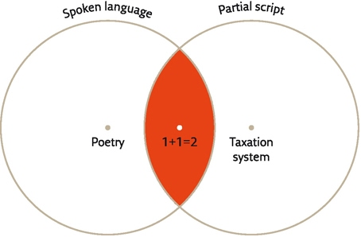

Partial script cannot express the entire spectrum of a spoken language, but it can express things that fall outside the scope of spoken language. Partial scripts such as the Sumerian and mathematical scripts cannot be used to write poetry, but they can keep tax accounts very effectively.

The earliest Sumerian writing was a partial rather than a full script. Full script is a system of material signs that can represent spoken language more or less completely. It can therefore express everything people can say, including poetry. Partial script, on the other hand, is a system of material signs that can represent only particular types of information, belonging to a limited field of activity.

Latin script, ancient Egyptian hieroglyphics and Braille are full scripts. You can use them to write tax registers, love poems, history books, food recipes and business law. In contrast, the earliest Sumerian script, like modern mathematical symbols and musical notation, are partial scripts.

You can use mathematical script to make calculations, but you cannot use it to write love poems.

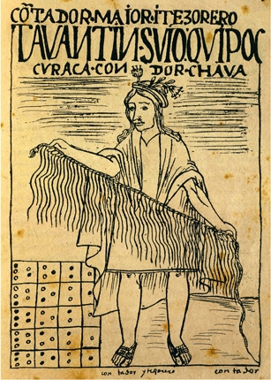

20. A man holding a quipu, as depicted in a Spanish manuscript following the fall of the Inca Empire.

Andean script was very different from its Sumerian counterpart. In fact, it was so different that many people would argue it wasn’t a script at all. It was not written on clay tablets or pieces of paper. Rather, it was written by tying knots on colourful cords called quipus. Each quipu consisted of many cords of different colours, made of wool or cotton. On each cord, several knots were tied in different places. A single quipu could contain hundreds of cords and thousands of knots. By combining different knots on different cords with different colours, it was possible to record large amounts of mathematical data relating to, for example, tax collection and property ownership.

the Inca Empire, which ruled 10–12 million people and covered today’s Peru, Ecuador and Bolivia, as well as chunks of Chile, Argentina and Colombia. Thanks to quipus, the Incas could save and process large amounts of data, without which they would not have been able to maintain the complex administrative machinery that an empire of that size requires.

In fact, quipus were so effective and accurate that in the early years following the Spanish conquest of South America, the Spaniards themselves employed quipus in the work of administering their new empire. The problem was that the Spaniards did not themselves know how to record and read quipus, making them dependent on local professionals. The continent’s new rulers realised that this placed them in a tenuous position – the native quipu experts could easily mislead and cheat their overlords. So once Spain’s dominion was more firmly established, quipus were phased out and the new empire’s records were kept entirely in Latin script and numerals.

#### The Wonders of Bureaucracy

Between 3000 BC and 2500 BC more and more signs were added to the Sumerian system, gradually transforming it into a full script that we today call cuneiform. By 2500 BC, kings were using cuneiform to issue decrees, priests were using it to record oracles, and less exalted citizens were using it to write personal letters. At roughly the same time, Egyptians developed another full script known as hieroglyphics. Other full scripts were developed in China around 1200 BC and in Central America around 1000–500 BC. From these initial centres, full scripts spread far and wide, taking on various new forms and novel tasks. People began to write poetry, history books, romances, dramas, prophecies and cookbooks.

tax registries and complex bureaucracies were born together with partial script, and the two remain inexorably linked to this day like Siamese twins – think of the cryptic entries in computerised data bases and spreadsheets.

Information stored in a persons brain is easy to retrieve... ...How, though, do you find and retrieve information stored on quipu cords or clay tablets? If you have just ten tablets or a hundred tablets, it’s not a problem. But what if you have accumulated thousands of them, as did one of Hammurabi’s contemporaries, King Zimrilim of Mari?

Imagine for a moment that it’s 1776 BC. Two Marians are quarrelling over possession of a wheat field. Jacob insists that he bought the field from Esau thirty years ago. Esau retorts that he in fact rented the field to Jacob for a term of thirty years, and that now, the term being up, he intends to reclaim it. They shout and wrangle and start pushing one another before they realise that they can resolve their dispute by going to the royal archive, where are housed the deeds and bills of sale that apply to all the kingdom’s real estate. Upon arriving at the archive they are shuttled from one official to the other. They wait through several herbal tea breaks, are told to come back tomorrow, and eventually are taken by a grumbling clerk to look for the relevant clay tablet. The clerk opens a door and leads them into a huge room lined, floor to ceiling, with thousands of clay tablets. No wonder the clerk is sour-faced. How is he supposed to locate the deed to the disputed wheat field written thirty years ago? Even if he finds it, how will he be able to cross-check to ensure that the one from thirty years ago is the latest document relating to the field in question? If he can’t find it, does that prove that Esau never sold or rented out the field? Or just that the document got lost, or turned to mush when some rain leaked into the archive?

Many writing systems developed independently in cultures distant in time and place from each other. Every decade archaeologists discover another few forgotten scripts. Some of them might prove to be even older than the Sumerian scratches in clay. But most of them remain curiosities because those who invented them failed to invent efficient ways of cataloguing and retrieving data.

a glimpse into the lives of these students, some 4,000 years ago: 

> I went in and sat down, and my teacher read my tablet. He said, ‘There’s something missing!’
And he caned me.
One of the people in charge said, ‘Why did you open your mouth without my permission?’
And he caned me.
The one in charge of rules said, ‘Why did you get up without my permission?’
And he caned me.
The gatekeeper said, ‘Why are you going out without my permission?’ And he caned me.
The keeper of the beer jug said, ‘Why did you get some without my permission?’
And he caned me.
The Sumerian teacher said, ‘Why did you speak Akkadian?’*
And he caned me.
My teacher said, ‘Your handwriting is no good!’
And he caned me.

In order to function, the people who operate such a system of drawers must be reprogrammed to stop thinking as humans and to start thinking as clerks and accountants. As everyone from ancient times till today knows, clerks and accountants think in a non-human fashion. They think like filing cabinets. This is not their fault. If they don’t think that way their drawers will all get mixed up and they won’t be able to provide the services their government, company or organisation requires.

#### The Language of Numbers

As the centuries passed, bureaucratic methods of data processing grew ever more different from the way humans naturally think – and ever more important. 

A critical step was made sometime before the ninth century AD, when a new partial script was invented, one that could store and process mathematical data with unprecedented efficiency. This partial script was composed of ten signs, representing the numbers from 0 to 9. Confusingly, these signs are known as Arabic numerals even though they were first invented by the Hindus (even more confusingly, modern Arabs use a set of digits that look quite different from Western ones). 

the Arabs get the credit because when they invaded India they encountered the system, understood its usefulness, refined it, and spread it through the Middle East and then to Europe.

Although this system of writing remains a partial script, it has become the world’s dominant language. Almost all states, companies, organisations and institutions – whether they speak Arabic, Hindi, English or Norwegian – use mathematical script to record and process data.

A person who wishes to influence the decisions of governments, organisations and companies must therefore learn to speak in numbers. Experts do their best to translate even ideas such as ‘poverty’, ‘happiness’ and ‘honesty’ into numbers (‘the poverty line’, ‘subjective well-being levels’, ‘credit rating’).

![An equation for calculating the acceleration of mass i under the influence of gravity, according to the Theory of Relativity. When most laypeople see such an equation, they usually panic and freeze, like a deer caught in the headlights of a speeding vehicle. The reaction is quite natural, and does not betray a lack of intelligence or curiosity. With rare exceptions, human brains are simply incapable of thinking through concepts like relativity and quantum mechanics. Physicists nevertheless manage to do so, because they set aside the traditional human way of thinking, and learn to think anew with the help of external data-processing systems. Crucial parts of their thought process take place not in the head, but inside computers or on classroom blackboards.](./assets/equation-for-calculating-the-acceleration-of-mass.jpg)

An equation for calculating the acceleration of mass i under the influence of gravity, according to the Theory of Relativity. When most laypeople see such an equation, they usually panic and freeze, like a deer caught in the headlights of a speeding vehicle. The reaction is quite natural, and does not betray a lack of intelligence or curiosity. With rare exceptions, human brains are simply incapable of thinking through concepts like relativity and quantum mechanics. Physicists nevertheless manage to do so, because they set aside the traditional human way of thinking, and learn to think anew with the help of external data-processing systems. Crucial parts of their thought process take place not in the head, but inside computers or on classroom blackboards.

Writing was born as the maidservant of human consciousness, but is increasingly becoming its master. Our computers have trouble understanding how Homo sapiens talks, feels and dreams. So we are teaching Homo sapiens to talk, feel and dream in the language of numbers, which can be understood by computers.

### 8 There is No Justice in History

UNDERSTANDING HUMAN HISTORY IN THE millennia following the Agricultural Revolution boils down to a single question: how did humans organise themselves in mass-cooperation networks, when they lacked the biological instincts necessary to sustain such networks? The short answer is that humans created imagined orders and devised scripts. These two inventions filled the gaps left by our biological inheritance.

The imagined orders sustaining these networks were neither neutral nor fair. They divided people into make-believe groups, arranged in a hierarchy. The upper levels enjoyed privileges and power, while the lower ones suffered from discrimination and oppression.

Many of those who signed the Declaration of Independence were slaveholders. They did not release their slaves upon signing the Declaration, nor did they consider themselves hypocrites. In their view, the rights of men had little to do with Negroes.

Liberty, too, carried very different connotations than it does today. In 1776, it did not mean that the disempowered (certainly not blacks or Indians or, God forbid, women) could gain and exercise power. It meant simply that the state could not, except in unusual circumstances, confiscate a citizen’s private property or tell him what to do with it. 

Nature, it was claimed, rewarded merit with wealth while penalising indolence.

many people who have viewed the hierarchy of free persons and slaves as natural and correct have argued that slavery is not a human invention. Hammurabi saw it as ordained by the gods. Aristotle argued that slaves have a ‘slavish nature’ whereas free people have a ‘free nature’. Their status in society is merely a reflection of their innate nature.

The rich have more money, in this view, because they are more capable and diligent. No one should be bothered, then, if the wealthy get better health care, better education and better nutrition. The rich richly deserve every perk they enjoy.

21. A sign on a South African beach from the period of apartheid, restricting its usage to whites’ only. People with lighter skin colour are typically more in danger of sunburn than people with darker skin. Yet there was no biological logic behind the division of South African beaches. Beaches reserved for people with lighter skin were not characterised by lower levels of ultraviolet radiation.

According to a famous Hindu creation myth, the gods fashioned the world out of the body of a primeval being, the Purusa. The sun was created from the Purusa’s eye, the moon from the Purusa’s brain, the Brahmins (priests) from its mouth, the Kshatriyas (warriors) from its arms, the Vaishyas (peasants and merchants) from its thighs, and the Shudras (servants) from its legs. Accept this explanation and the sociopolitical differences between Brahmins and Shudras are as natural and eternal as the differences between the sun and the moon.

Human laws and norms have turned some people into slaves and others into masters. Between blacks and whites there are some objective biological differences, such as skin colour and hair type, but there is no evidence that the differences extend to intelligence or morality.

Modern Westerners are taught to scoff at the idea of racial hierarchy. They are shocked by laws prohibiting blacks to live in white neighbourhoods, or to study in white schools, or to be treated in white hospitals. But the hierarchy of rich and poor – which mandates that rich people live in separate and more luxurious neighbourhoods, study in separate and more prestigious schools, and receive medical treatment in separate and better-equipped facilities – seems perfectly sensible to many Americans and Europeans.

it’s a proven fact that most rich people are rich for the simple reason that they were born into a rich family, while most poor people will remain poor throughout their lives simply because they were born into a poor family.

Unfortunately, complex human societies seem to require imagined hierarchies and unjust discrimination.

scholars know of no large society that has been able to dispense with discrimination altogether. 

Time and again people have created order in their societies by classifying the population into imagined categories, such as superiors, commoners and slaves; whites and blacks; patricians and plebeians; Brahmins and Shudras; or rich and poor. These categories have regulated relations between millions of humans by making some people legally, politically or socially superior to others.

Hierarchies serve an important function. They enable complete strangers to know how to treat one another without wasting the time and energy needed to become personally acquainted.

A modern Eliza working at a florist’s needs to know how much effort to put into selling roses and gladioli to the dozens of people who enter the shop each day. She can’t make a detailed enquiry into the tastes and wallets of each individual. Instead, she uses social cues – the way the person is dressed, his or her age, and if she’s not politically correct his skin colour. That is how she immediately distinguishes between the accounting-firm partner who’s likely to place a large order for expensive roses, and a messenger boy who can only afford a bunch of daisies.

First and foremost, most abilities have to be nurtured and developed. Even if somebody is born with a particular talent, that talent will usually remain latent if it is not fostered, honed and exercised. Not all people get the same chance to cultivate and refine their abilities. Whether or not they have such an opportunity will usually depend on their place within their society’s imagined hierarchy.

Even if people belonging to different classes develop exactly the same abilities, they are unlikely to enjoy equal success because they will have to play the game by different rules. If, in British-ruled India, an Untouchable, a Brahmin, a Catholic Irishman and a Protestant Englishman had somehow developed exactly the same business acumen, they still would not have had the same chance of becoming rich. The economic game was rigged by legal restrictions and unofficial glass ceilings.

#### The Vicious Circle

All societies are based on imagined hierarchies, but not necessarily on the same hierarchies. What accounts for the differences? Why did traditional Indian society classify people according to caste, Ottoman society according to religion, and American society according to race? In most cases the hierarchy originated as the result of a set of accidental historical circumstances and was then perpetuated and refined over many generations as different groups developed vested interests in it.

The invaders, who were few in number, feared losing their privileged status and unique identity. To forestall this danger, they divided the population into castes, each of which was required to pursue a specific occupation or perform a specific role in society. Each had different legal status, privileges and duties. Mixing of castes – social interaction, marriage, even the sharing of meals – was prohibited. And the distinctions were not just legal – they became an inherent part of religious mythology and practice.

Throughout history, and in almost all societies, concepts of pollution and purity have played a leading role in enforcing social and political divisions and have been exploited by numerous ruling classes to maintain their privileges. 

The fear of pollution is not a complete fabrication of priests and princes, however. It probably has its roots in biological survival mechanisms that make humans feel an instinctive revulsion towards potential disease carriers, such as sick persons and dead bodies. 

If you want to keep any human group isolated – women, Jews, Roma, gays, blacks – the best way to do it is convince everyone that these people are a source of pollution.

Castes were not immune to change. In fact, as time went by, large castes were divided into sub-castes. Eventually the original four castes turned into 3,000 different groupings called jati (literally ‘birth’). But this proliferation of castes did not change the basic principle of the system, according to which every person is born into a particular rank, and any infringement of its rules pollutes the person and society as a whole. 

A persons jati determines her profession, the food she can eat, her place of residence and her eligible marriage partners. Usually a person can marry only within his or her caste, and the resulting children inherit that status.

Groups that failed to win recognition as a caste were, literally, outcasts – in this stratified society, they did not even occupy the lowest rung. They became known as Untouchables. They had to live apart from all other people and scrape together a living in humiliating and disgusting ways, such as sifting through garbage dumps for scrap material.

In modern India, matters of marriage and work are still heavily influenced by the caste system, despite all attempts by the democratic government of India to break down such distinctions and convince Hindus that there is nothing polluting in caste mixing.

#### Purity in America

From the sixteenth to the eighteenth century, the European conquerors imported millions of African slaves to work the mines and plantations of America. They chose to import slaves from Africa rather than from Europe or East Asia due to three circumstantial factors. Firstly, Africa was closer, so it was cheaper to import slaves from Senegal than from Vietnam. Secondly, in Africa there already existed a well-developed slave trade (exporting slaves mainly to the Middle East), whereas in Europe slavery was very rare. It was obviously far easier to buy slaves in an existing market than to create a new one from scratch. Thirdly, and most importantly, American plantations in places such as Virginia, Haiti and Brazil were plagued by malaria and yellow fever, which had originated in Africa. Africans had acquired over the generations a partial genetic immunity to these diseases, whereas Europeans were totally defenceless and died in droves.

Paradoxically, genetic superiority (in terms of immunity) translated into social inferiority:

America were to be divided into a ruling caste of white Europeans and a subjugated caste of black Africans.

Like the Aryan conquerors of India, white Europeans in the Americas wanted to be seen not only as economically successful but also as pious, just and objective. Religious and scientific myths were pressed into service to justify this division.

Biologists argued that blacks are less intelligent than whites and their moral sense less developed. Doctors alleged that blacks live in filth and spread diseases – in other words, they are a source of pollution.

even though the slaves were freed, the racist myths that justified slavery persisted. Separation of the races was maintained by racist legislation and social custom.

In 1865 the Thirteenth Amendment to the US Constitution outlawed slavery and the Fourteenth Amendment mandated that citizenship and the equal protection of the law could not be denied on the basis of race. However, two centuries of slavery meant that most black families were far poorer and far less educated than most white families.

By 1865 whites, as well as many blacks, took it to be a simple matter of fact that blacks were less intelligent, more violent and sexually dissolute, lazier and less concerned about personal cleanliness than whites. They were thus the agents of violence, theft, rape and disease – in other words, pollution.

You might think that people would gradually understand that these stigmas were myth rather than fact and that blacks would be able, over time, to prove themselves just as competent, law-abiding and clean as whites. In fact, the opposite happened – these prejudices became more and more entrenched as time went by. Since all the best jobs were held by whites, it became easier to believe that blacks really are inferior. ‘Look,’ said the average white citizen, ‘blacks have been free for generations, yet there are almost no black professors, lawyers, doctors or even bank tellers. Isn’t that proof that blacks are simply less intelligent and hard-working?’

The vicious circle did not stop there. As anti-black stigmas grew stronger, they were translated into a system of ‘Jim Crow’ laws and norms that were meant to safeguard the racial order. Blacks were forbidden to vote in elections, to study in white schools, to buy in white stores, to eat in white restaurants, to sleep in white hotels. 

The justification for all of this was that blacks were foul, slothful and vicious, so whites had to be protected from them.

Clennon King, a black student who applied to the University of Mississippi in 1958, was forcefully committed to a mental asylum. The presiding judge ruled that a black person must surely be insane to think that he could be admitted to the University of Mississippi.

The vicious circle: a chance histotical situation is translated into a rigid social system.

With time, the racism spread to more and more cultural arenas. American aesthetic culture was built around white standards of beauty. The physical attributes of the white race – for example light skin, fair and straight hair, a small upturned nose – came to be identified as beautiful. Typical black features – dark skin, dark and bushy hair, a flattened nose – were deemed ugly. These preconceptions ingrained the imagined hierarchy at an even deeper level of human consciousness.

Unjust discrimination often gets worse, not better, with time. Money comes to money, and poverty to poverty. Education comes to education, and ignorance to ignorance.

Since the biological distinctions between different groups of Homo sapiens are, in fact, negligible, biology can’t explain the intricacies of Indian society or American racial dynamics. We can only understand those phenomena by studying the events, circumstances, and power relations that transformed figments of imagination into cruel – and very real – social structures.

#### He and She

One hierarchy, however, has been of supreme importance in all known human societies: the hierarchy of gender. People everywhere have divided themselves into men and women. And almost everywhere men have got the better deal, at least since the Agricultural Revolution.

when Communist China enacted the ‘one child’ policy, many Chinese families continued to regard the birth of a girl as a misfortune. Parents would occasionally abandon or murder newborn baby girls in order to have another shot at getting a boy.

In many societies women were simply the property of men, most often their fathers, husbands or brothers. Rape, in many legal systems, falls under property violation – in other words, the victim is not the woman who was raped but the male who owns her.

The Bible decrees that ‘If a man meets a virgin who is not betrothed, and seizes her and lies with her, and they are found, then the man who lay with her shall give to the father of the young woman fifty shekels of silver, and she shall be his wife’ (Deuteronomy 22:28–9). The ancient Hebrews considered this a reasonable arrangement.

Raping a woman who did not belong to any man was not considered a crime at all, just as picking up a lost coin on a busy street is not considered theft.

the idea that a husband could rape his wife was an oxymoron. To be a husband was to have full control of your wife’s sexuality. To say that a husband ‘raped’ his wife was as illogical as saying that a man stole his own wallet.

As of 2006, there were still fifty-three countries where a husband could not be prosecuted for the rape of his wife. Even in Germany, rape laws were amended only in 1997 to create a legal category of marital rape.

in democratic Athens of the fifth century BC, an individual possessing a womb had no independent legal status and was forbidden to participate in popular assemblies or to be a judge. With few exceptions, such an individual could not benefit from a good education, nor engage in business or in philosophical discourse. None of Athens’ political leaders, none of its great philosophers, orators, artists or merchants had a womb. Does having a womb make a person unfit, biologically, for these professions? The ancient Athenians thought so. 

Modern Athenians disagree. In present-day Athens, women vote, are elected to public office, make speeches, design everything from jewellery to buildings to software, and go to university. Their wombs do not keep them from doing any of these things as successfully as men do.

Many modern Greeks also think that an integral part of being a man is being sexually attracted to women only, and having sexual relations exclusively with the opposite sex. They don’t see this as a cultural bias, but rather as a biological reality – relations between two people of the opposite sex are natural, and between two people of the same sex unnatural. In fact, though, Mother Nature does not mind if men are sexually attracted to one another.

A significant number of human cultures have viewed homosexual relations as not only legitimate but even socially constructive, ancient Greece being the most notable example. The Iliad does not mention that Thetis had any objection to her son Achilles’ relations with Patroclus. Queen Olympias of Macedon was one of the most temperamental and forceful women of the ancient world, and even had her own husband, King Philip, assassinated. Yet she didn’t have a fit when her son, Alexander the Great, brought his lover Hephaestion home for dinner.

How can we distinguish what is biologically determined from what people merely try to justify through biological myths? A good rule of thumb is ‘Biology enables, Culture forbids.’ Biology is willing to tolerate a very wide spectrum of possibilities. It’s culture that obliges people to realise some possibilities while forbidding others. 

Biology enables women to have children – some cultures oblige women to realise this possibility. Biology enables men to enjoy sex with one another – some cultures forbid them to realise this possibility.

Culture tends to argue that it forbids only that which is unnatural. But from a biological perspective, nothing is unnatural. Whatever is possible is by definition also natural. 

A truly unnatural behaviour, one that goes against the laws of nature, simply cannot exist, so it would need no prohibition. No culture has ever bothered to forbid men to photosynthesise, women to run faster than the speed of light, or negatively charged electrons to be attracted to each other.

In truth, our concepts ‘natural’ and unnatural’ are taken not from biology, but from Christian theology. The theological meaning of ‘natural’ is ‘in accordance with the intentions of the God who created nature’.

If we use our limbs and organs for the purpose envisioned by God, then it is a natural activity. To use them differently than God intends is unnatural. 

But evolution has no purpose. Organs have not evolved with a purpose, and the way they are used is in constant flux. There is not a single organ in the human body that only does the job its prototype did when it first appeared hundreds of millions of years ago. 

Organs evolve to perform a particular function, but once they exist, they can be adapted for other usages as well. Mouths, for example, appeared because the earliest multicellular organisms needed a way to take nutrients into their bodies. We still use our mouths for that purpose, but we also use them to kiss, speak 

According to one theory, insect wings evolved millions of years ago from body protrusions on flightless bugs. Bugs with bumps had a larger surface area than those without bumps, and this enabled them to absorb more sunlight and thus stay warmer. In a slow evolutionary process, these solar heaters grew larger. The same structure that was good for maximum sunlight absorption – lots of surface area, little weight – also, by coincidence, gave the insects a bit of a lift when they skipped and jumped. Those with bigger protrusions could skip and jump farther. Some insects started using the things to glide, and from there it was a small step to wings that could actually propel the bug through the air. 

Next time a mosquito buzzes in your ear, accuse her of unnatural behaviour. If she were well behaved and content with what God gave her, she’d use her wings only as solar panels.

Sex first evolved for procreation and courtship rituals as a way of sizing up the fitness of a potential mate. But many animals now put both to use for a multitude of social purposes that have little to do with creating little copies of themselves. Chimpanzees, for example, use sex to cement political alliances, establish intimacy and defuse tensions. Is that unnatural?

#### Sex and Gender

Most of the laws, norms, rights and obligations that define manhood and womanhood reflect human imagination more than biological reality.

While in the great majority of cases in most human societies men are males and women are females, the social terms carry a lot of baggage that has only a tenuous, if any, relationship to the biological terms. A man is not a Sapiens with particular biological qualities such as XY chromosomes, testicles and lots of testosterone. Rather, he fits into a particular slot in his society’s imagined human order. 

His culture’s myths assign him particular masculine roles (like engaging in politics), rights (like voting) and duties (like military service). Likewise, a woman is not a Sapiens with two X chromosomes, a womb and plenty of oestrogen. Rather, she is a female member of an imagined human order. The myths of her society assign her unique feminine roles (raising children), rights (protection against violence) and duties (obedience to her husband). Since myths, rather than biology, define the roles, rights and duties of men and women, the meaning of ‘manhood’ and ‘womanhood’ have varied immensely from one society to another.

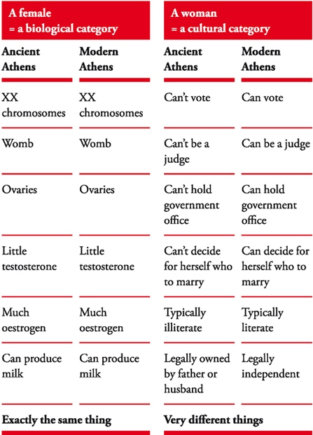

22. Eighteenth-century masculinity: an official portrait of King Louis XIV of France. Note the long wig, stockings, high-heeled shoes, dancers posture – and huge sword. In contemporary Europe, all these (except for the sword) would be considered marks of effeminacy. But in his time Louis was a European paragon of manhood and virility.

![23. Twenty-first-century masculinity: an official portrait of Barack Obama. What happened to the wig, stockings, high heels – and sword? Dominant men have never looked so dull and dreary as they do today. During most of history, dominant men have been colourful and flamboyant, such as American Indian chiefs with their feathered headdresses and Hindu maharajas decked out in silks and diamonds. Throughout the animal kingdom males tend to be more colourful and accessorised than females – think of peacocks’ tails and lions’ manes.](./assets/figure23.jpg)

23. Twenty-first-century masculinity: an official portrait of Barack Obama. What happened to the wig, stockings, high heels – and sword? Dominant men have never looked so dull and dreary as they do today. During most of history, dominant men have been colourful and flamboyant, such as American Indian chiefs with their feathered headdresses and Hindu maharajas decked out in silks and diamonds. Throughout the animal kingdom males tend to be more colourful and accessorised than females – think of peacocks’ tails and lions’ manes.

Scholars usually distinguish between ‘sex’, which is a biological category, and ‘gender’, a cultural category. Sex is divided between males and females, and the qualities of this division are objective and have remained constant throughout history. Gender is divided between men and women (and some cultures recognise other categories).

Sex is child’s play; but gender is serious business. To get to be a member of the male sex is the simplest thing in the world. You just need to be born with an X and a Y chromosome. To get to be a female is equally simple. A pair of X chromosomes will do it. In contrast, becoming a man or a woman is a very complicated and demanding undertaking. Since most masculine and feminine qualities are cultural rather than biological, no society automatically crowns each male a man, or every female a woman.

Males in particular live in constant dread of losing their claim to manhood. Throughout history, males have been willing to risk and even sacrifice their lives, just so that people will say ‘He’s a real man!’

#### What’s So Good About Men?

since the Agricultural Revolution, most human societies have been patriarchal societies that valued men more highly than women. No matter how a society defined ‘man’ and ‘woman’, to be a man was always better. 

Patriarchal societies educate men to think and act in a masculine way and women to think and act in a feminine way, punishing anyone who dares cross those boundaries.

Qualities considered masculine are more valued than those considered feminine, and members of a society who personify the feminine ideal get less than those who exemplify the masculine ideal. Fewer resources are invested in the health and education of women;... ...Gender is a race in which some of the runners compete only for the bronze medal.

a handful of women have made it to the alpha position, such as Cleopatra of Egypt, Empress Wu Zetian of China (c. AD 700) and Elizabeth I of England. Yet they are the exceptions that prove the rule. Throughout Elizabeth’s forty-five-year reign, all Members of Parliament were men, all officers in the Royal Navy and army were men,

Patriarchy has been the norm in almost all agricultural and industrial societies. It has tenaciously weathered political upheavals, social revolutions and economic transformations. 

Since patriarchy is so universal, it cannot be the product of some vicious circle that was kick-started by a chance occurrence. It is particularly noteworthy that even before 1492, most societies in both America and Afro-Asia were patriarchal, even though they had been out of contact for thousands of years... ...It is far more likely that even though the precise definition of ‘man’ and ‘woman’ varies between cultures, there is some universal biological reason why almost all cultures valued manhood over womanhood. We do not know what this reason is. There are plenty of theories, none of them convincing.

#### Muscle Power

Men are stronger than women, and that they have used their greater physical power to force women into submission. A more subtle version of this claim argues that their strength allows men to monopolise tasks that demand hard manual labour, such as ploughing and harvesting. This gives them control of food production, which in turn translates into political clout.

There are two problems with this emphasis on muscle power. First, the statement that men are stronger than women’ is true only on average, and only with regard to certain types of strength. Women are generally more resistant to hunger, disease and fatigue than men. There are also many women who can run faster and lift heavier weights than many men. Furthermore, and most problematically for this theory, women have, throughout history, been excluded mainly from jobs that require little physical effort (such as the priesthood, law and politics), while engaging in hard manual labour in the fields, in crafts and in the household. If social power were divided in direct relation to physical strength or stamina, women should have got far more of it.

there simply is no direct relation between physical strength and social power among humans. People in their sixties usually exercise power over people in their twenties, even though twentysomethings are much stronger than their elders.

In forager societies, political dominance generally resides with the person possessing the best social skills rather than the most developed musculature.

Even among chimpanzees, the alpha male wins his position by building a stable coalition with other males and females, not through mindless violence.

In fact, human history shows that there is often an inverse relation between physical prowess and social power. In most societies, it’s the lower classes who do the manual labour. This may reflect Homo sapiens position in the food chain. If all that counted were raw physical abilities, Sapiens would have found themselves on a middle rung of the ladder. But their mental and social skills placed them at the top. It is therefore only natural that the chain of power within the species will also be determined by mental and social abilities more than by brute force. 

It is therefore hard to believe that the most influential and most stable social hierarchy in history is founded on men’s ability physically to coerce women.

#### The Scum of Society

Another theory explains that masculine dominance results not from strength but from aggression. Millions of years of evolution have made men far more violent than women. Women can match men as far as hatred, greed and abuse are concerned, but when push comes to shove, the theory goes, men are more willing to engage in raw physical violence. 

This is why throughout history warfare has been a masculine prerogative. In times of war, men’s control of the armed forces has made them the masters of civilian society, too. They then used their control of civilian society to fight more and more wars, and the greater the number of wars, the greater men’s control of society. This feedback loop explains both the ubiquity of war and the ubiquity of patriarchy.

Recent studies of the hormonal and cognitive systems of men and women strengthen the assumption that men indeed have more aggressive and violent tendencies, and are therefore, on average, better suited to serve as common soldiers.

granted that the common soldiers are all men, does it follow that the ones managing the war and enjoying its fruits must also be men? That makes no sense. It’s like assuming that because all the slaves cultivating cotton fields are black, plantation owners will be black as well. 

Just as an all-black workforce might be controlled by an all-white management, why couldn’t an all-male soldiery be controlled by an all-female or at least partly female government?

in numerous societies throughout history, the top officers did not work their way up from the rank of private. Aristocrats, the wealthy and the educated were automatically assigned officer rank and never served a day in the ranks.

One can’t reasonably argue that their physical weakness or low testosterone levels prevented women from being successful mandarins, generals and politicians. In order to manage a war, you surely need stamina, but not much physical strength or aggressiveness. 

Wars are not a pub brawl. They are very complex projects that require an extraordinary degree of organisation, cooperation and appeasement.

The militarily incompetent Augustus succeeded in establishing a stable imperial regime, achieving something that eluded both Julius Caesar and Alexander the Great, who were much better generals. Both his admiring contemporaries and modern historians often attribute this feat to his virtue of clementia – mildness and clemency.

Women are often stereotyped as better manipulators and appeasers than men, and are famed for their superior ability to see things from the perspective of others. If there’s any truth in these stereotypes, then women should have made excellent politicians and empire-builders, leaving the dirty work on the battlefields to testosterone-charged but simple-minded machos.

#### Patriarchal Genes

men and women evolved different survival and reproduction strategies. As men competed against each other for the opportunity to impregnate fertile women, an individual’s chances of reproduction depended above all on his ability to outperform and defeat other men. As time went by, the masculine genes that made it to the next generation were those belonging to the most ambitious, aggressive and competitive men.

A woman, on the other hand, had no problem finding a man willing to impregnate her. However, if she wanted her children to provide her with grandchildren, she needed to carry them in her womb for nine arduous months, and then nurture them for years. During that time she had fewer opportunities to obtain food, and required a lot of help. She needed a man. In order to ensure her own survival and the survival of her children, the woman had little choice but to agree to whatever conditions the man stipulated so that he would stick around and share some of the burden. As time went by, the feminine genes that made it to the next generation belonged to women who were submissive caretakers. Women who spent too much time fighting for power did not leave any of those powerful genes for future generations.

The result of these different survival strategies – so the theory goes – is that men have been programmed to be ambitious and competitive, and to excel in politics and business, whereas women have tended to move out of the way and dedicate their lives to raising children.

There are many species of animals, such as elephants and bonobo chimpanzees, in which the dynamics between dependent females and competitive males results in a matriarchal society. Since females need external help, they are obliged to develop their social skills and learn how to cooperate and appease. They construct all-female social networks that help each member raise her children. Males, meanwhile, spend their time fighting and competing.

Though bonobo females are weaker on average than the males, the females often gang up to beat males who overstep their limits.

Sapiens are relatively weak animals, whose advantage rests in their ability to cooperate in large numbers. If so, we should expect that dependent women, even if they are dependent on men, would use their superior social skills to cooperate to outmanoeuvre and manipulate aggressive, autonomous and self-centred men.

How did it happen that in the one species whose success depends above all on cooperation, individuals who are supposedly less cooperative (men) control individuals who are supposedly more cooperative (women)? At present, we have no good answer. 

Maybe the common assumptions are just wrong. Maybe males of the species Homo sapiens are characterised not by physical strength, aggressiveness and competitiveness, but rather by superior social skills and a greater tendency to cooperate. We just don’t know.

during the last century gender roles have undergone a tremendous revolution. More and more societies today not only give men and women equal legal status, political rights and economic opportunities, but also completely rethink their most basic conceptions of gender and sexuality. Though the gender gap is still significant, events have been moving at a breathtaking speed. 

If, as is being demonstrated today so clearly, the patriarchal system has been based on unfounded myths rather than on biological facts, what accounts for the universality and stability of this system?

## Part Three The Unification of Humankind

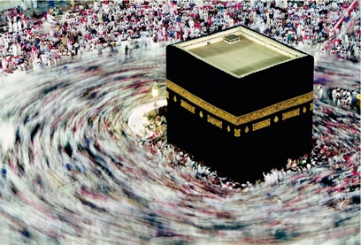

24. Pilgrims circling the Ka’aba in Mecca.

### 9 The Arrow of History

AFTER THE AGRICULTURAL REVOLUTION, human societies grew ever larger and more complex, while the imagined constructs sustaining the social order also became more elaborate. 

Myths and fictions accustomed people, nearly from the moment of birth, to think in certain ways, to behave in accordance with certain standards, to want certain things, and to observe certain rules.

artificial instincts that enabled millions of strangers to cooperate effectively. This network of artificial instincts is called culture’.

During the first half of the twentieth century, scholars taught that every culture was complete and harmonious,... ...In this view, cultures left to their own devices did not change. They just kept going at the same pace and in the same direction. Only a force applied from outside could change them.

Today, most scholars of culture have concluded that the opposite is true. Every culture has its typical beliefs, norms and values, but these are in constant flux. The culture may transform itself in response to changes in its environment or through interaction with neighbouring cultures.

Even a completely isolated culture existing in an ecologically stable environment cannot avoid change. 

Unlike the laws of physics, which are free of inconsistencies, every man-made order is packed with internal contradictions. 

Cultures are constantly trying to reconcile these contradictions, and this process fuels change.

in medieval Europe the nobility believed in both Christianity and chivalry. A typical nobleman went to church in the morning, and listened as the priest held forth on the lives of the saints. ‘Vanity of vanities,’ said the priest, ‘all is vanity. Riches, lust and honour are dangerous temptations. You must rise above them, and follow in Christ’s footsteps. Be meek like Him, avoid violence and extravagance, and if attacked – just turn the other cheek.’ Returning home in a meek and pensive mood, the nobleman would change into his best silks and go to a banquet in his lord’s castle. There the wine flowed like water, the minstrel sang of Lancelot and Guinevere, and the guests exchanged dirty jokes and bloody war tales. ‘It is better to die,’ declared the barons, ‘than to live with shame. If someone questions your honour, only blood can wipe out the insult. And what is better in life than to see your enemies flee before you, and their pretty daughters tremble at your feet?’ The contradiction was never fully resolved. But as the European nobility, clergy and commoners grappled with it, their culture changed

the modern political order. Ever since the French Revolution, people throughout the world have gradually come to see both equality and individual freedom as fundamental values. Yet the two values contradict each other. Equality can be ensured only by curtailing the freedoms of those who are better off. Guaranteeing that every individual will be free to do as he wishes inevitably short-changes equality. The entire political history of the world since 1789 can be seen as a series of attempts to reconcile this contradiction.

Anyone who has read a novel by Alexander Solzhenitsyn knows how Communisms egalitarian ideal produced brutal tyrannies that tried to control every aspect of daily life.

Contemporary American politics also revolve around this contradiction. Democrats want a more equitable society, even if it means raising taxes to fund programmes to help the poor, elderly and infirm. But that infringes on the freedom of individuals to spend their money as they wish. Why should the government force me to buy health insurance if I prefer using the money to put my kids through college? Republicans, on the other hand, want to maximise individual freedom, even if it means that the income gap between rich and poor will grow wider and that many Americans will not be able to afford health care.

Just as medieval culture did not manage to square chivalry with Christianity, so the modern world fails to square liberty with equality.

Such contradictions are an inseparable part of every human culture. In fact, they are culture’s engines, responsible for the creativity and dynamism of our species.

Consistency is the playground of dull minds.

If tensions, conflicts and irresolvable dilemmas are the spice of every culture, a human being who belongs to any particular culture must hold contradictory beliefs and be riven by incompatible values. It’s such an essential feature of any culture that it even has a name: cognitive dissonance. 

Cognitive dissonance is often considered a failure of the human psyche. In fact, it is a vital asset. Had people been unable to hold contradictory beliefs and values, it would probably have been impossible to establish and maintain any human culture.

#### The Spy Satellite

Human cultures are in constant flux. Is this flux completely random, or does it have some overall pattern? In other words, does history have a direction? The answer is yes.

Over the millennia, small, simple cultures gradually coalesce into bigger and more complex civilisations, so that the world contains fewer and fewer mega-cultures, each of which is bigger and more complex. This is of course a very crude generalisation, true only at the macro level. At the micro level, it seems that for every group of cultures that coalesces into a mega-culture, there’s a mega-culture that breaks up into pieces.

Christianity converted hundreds of millions of people at the same time that it splintered into innumerable sects. The Latin language spread through western and central Europe, then split into local dialects that themselves eventually became national languages. But these break-ups are temporary reversals in an inexorable trend towards unity.

When we adopt the proverbial bird’s-eye view of history, which examines developments in terms of decades or centuries, it’s hard to say whether history moves in the direction of unity or of diversity. However, to understand long-term processes the bird’s eye view is too myopic. We would do better to adopt instead the viewpoint of a cosmic spy satellite, which scans millennia rather than centuries. From such a vantage point it becomes crystal clear that history is moving relentlessly towards unity. The sectioning of Christianity and the collapse of the Mongol Empire are just speed bumps on history’s highway.

The best way to appreciate the general direction of history is to count the number of separate human worlds that coexisted at any given moment on planet Earth. Today, we are used to thinking about the whole planet as a single unit, but for most of history, earth was in fact an entire galaxy of isolated human worlds.

Tasmania, a medium-sized island south of Australia. It was cut off from the Australian mainland in about 10,000 BC as the end of the Ice Age caused the sea level to rise. A few thousand hunter-gatherers were left on the island, and had no contact with any other humans until the arrival of the Europeans in the nineteenth century. For 12,000 years, nobody else knew the Tasmanians were there, and they didn’t know that there was anyone else in the world. They had their wars, political struggles, social oscillations and cultural developments. Yet as far as the emperors of China or the rulers of Mesopotamia were concerned, Tasmania could just as well have been located on one of Jupiter’s moons. The Tasmanians lived in a world of their own.

America and Europe, too, were separate worlds for most of their histories. In AD 378, the Roman emperor Valence was defeated and killed by the Goths at the battle of Adrianople. In the same year, King Chak Tok Ich’aak of Tikal was defeated and killed by the army of Teotihuacan. (Tikal was an important Mayan city state, while Teotihuacan was then the largest city in America, with almost 250,000 inhabitants – of the same order of magnitude as its contemporary, Rome.) There was absolutely no connection between the defeat of Rome and the rise of Teotihuacan. Rome might just as well have been located on Mars, and Teotihuacan on Venus.

By AD 1450, their numbers had declined even more drastically. At that time, just prior to the age of European exploration, earth still contained a significant number of dwarf worlds such as Tasmania. But close to 90 per cent of humans lived in a single mega-world: the world of Afro-Asia. Most of Asia, most of Europe, and most of Africa (including substantial chunks of sub-Saharan Africa) were already connected by significant cultural, political and economic ties.

Most of the remaining tenth of the world’s human population was divided between four worlds of considerable size and complexity:

1. The Mesoamerican World, which encompassed most of Central America and parts of North America.
2. The Andean World, which encompassed most of western South America.
3. The Australian World, which encompassed the continent of Australia.
4. The Oceanic World, which encompassed most of the islands of the south-western Pacific Ocean, from Hawaii to New Zealand.

Over the next 300 years, the Afro-Asian giant swallowed up all the other worlds

Australian continent in 1606, and that pristine world came to an end when British colonisation began in earnest in 1788. Fifteen years later the Britons established their first settlement in Tasmania, thus bringing the last autonomous human world into the Afro-Asian sphere of influence.

Today almost all humans share the same geopolitical system (the entire planet is divided into internationally recognised states); the same economic system (capitalist market forces shape even the remotest corners of the globe); the same legal system (human rights and international law are valid everywhere, at least theoretically); and the same scientific system (experts in Iran, Israel, Australia and Argentina have exactly the same views about the structure of atoms or the treatment of tuberculosis).

The single global culture is not homogeneous.

A real ‘clash of civilisations’ is like the proverbial dialogue of the deaf. Nobody can grasp what the other is saying. Today when Iran and the United States rattle swords at one another, they both speak the language of nation states, capitalist economies, international rights and nuclear physics.

Map 3. Earth in AD 1450. The named locations within the Afro-Asian World were places visited by the fourteenth-century Muslim traveller Ibn Battuta. A native of Tangier, in Morocco, Ibn Battuta visited Timbuktu, Zanzibar, southern Russia, Central Asia, India, China and Indonesia. His travels illustrate the unity of Afro-Asia on the eve of the modern era.

We still talk a lot about ‘authentic’ cultures, but if by authentic’ we mean something that developed independently, and that consists of ancient local traditions free of external influences, then there are no authentic cultures left on earth.

One of the most interesting examples of this globalisation is ‘ethnic’ cuisine. In an Italian restaurant we expect to find spaghetti in tomato sauce; in Polish and Irish restaurants lots of potatoes; in an Argentinian restaurant we can choose between dozens of kinds of beefsteaks; in an Indian restaurant hot chillies are incorporated into just about everything; and the highlight at any Swiss café is thick hot chocolate under an alp of whipped cream. But none of these foods is native to those nations. Tomatoes, chilli peppers and cocoa are all Mexican in origin; they reached Europe and Asia only after the Spaniards conquered Mexico. Julius Caesar and Dante Alighieri never twirled tomato-drenched spaghetti on their forks (even forks hadn’t been invented yet), William Tell never tasted chocolate, and Buddha never spiced up his food with chilli. Potatoes reached Poland and Ireland no more than 400 years ago. The only steak you could obtain in Argentina in 1492 was from a llama.

Hollywood films have perpetuated an image of the Plains Indians as brave horsemen, courageously charging the wagons of European pioneers to protect the customs of their ancestors. However, these Native American horsemen were not the defenders of some ancient, authentic culture. Instead, they were the product of a major military and political revolution that swept the plains of western North America in the seventeenth and eighteenth centuries, a consequence of the arrival of European horses. In 1492 there were no horses in America. The culture of the nineteenth-century Sioux and Apache has many appealing features, but it was a modern culture – a result of global forces – much more than authentic’.

#### The Global Vision

the most important stage in the process of global unification occurred in the last few centuries, when empires grew and trade intensified. Ever-tightening links were formed between the people of Afro-Asia, America, Australia and Oceania. Thus Mexican chilli peppers made it into Indian food and Spanish cattle began grazing in Argentina.

from an ideological perspective, an even more important development occurred during the first millennium BC, when the idea of a universal order took root. For thousands of years previously, history was already moving slowly in the direction of global unity, but the idea of a universal order governing the entire world was still alien to most people.

25. Sioux chiefs (1905). Neither the Sioux nor any other Great Plains tribe had horses prior to 1492.

Homo sapiens evolved to think of people as divided into us and them. ‘Us’ was the group immediately around you, whoever you were, and ‘them’ was everyone else. In fact, no social animal is ever guided by the interests of the entire species to which it belongs.

no lion alpha male makes a bid for becoming the king of all lions.

But beginning with the Cognitive Revolution, Homo sapiens became more and more exceptional in this respect. People began to cooperate on a regular basis with complete strangers, whom they imagined as ‘brothers’ or ‘friends’. Yet this brotherhood was not universal. Somewhere in the next valley, or beyond the mountain range, one could still sense ‘them’. 

When the first pharaoh, Menes, united Egypt around 3000 BC, it was clear to the Egyptians that Egypt had a border, and beyond the border lurked ‘barbarians’.

The first millennium BC witnessed the appearance of three potentially universal orders, whose devotees could for the first time imagine the entire world and the entire human race as a single unit governed by a single set of laws. Everyone was ‘us’, at least potentially. There was no longer ‘them’. 

The first universal order to appear was economic: the monetary order. The second universal order was political: the imperial order. The third universal order was religious: the order of universal religions such as Buddhism, Christianity and Islam.

For the merchants, the entire world was a single market and all humans were potential customers. They tried to establish an economic order that would apply to all, everywhere.

the greatest conqueror in history, a conqueror possessed of extreme tolerance and adaptability, thereby turning people into ardent disciples. This conqueror is money. People who do not believe in the same god or obey the same king are more than willing to use the same money. Osama Bin Laden, for all his hatred of American culture, American religion and American politics, was very fond of American dollars. How did money succeed where gods and kings failed?

### 10 The Scent of Money

IN 1519 HERNÁN CORTÉS AND HIS CONQUISTADORS invaded Mexico, hitherto an isolated human world. The Aztecs, as the people who lived there called themselves, quickly noticed that the aliens showed an extraordinary interest in a certain yellow metal. In fact, they never seemed to stop talking about it. The natives were not unfamiliar with gold – it was pretty and easy to work, so they used it to make jewellery and statues, and they occasionally used gold dust as a medium of exchange. But when an Aztec wanted to buy something, he generally paid in cocoa beans or bolts of cloth.

 What was so important about a metal that could not be eaten, drunk or woven, and was too soft to use for tools or weapons? When the natives questioned Cortés as to why the Spaniards had such a passion for gold, the conquistador answered, ‘Because I and my companions suffer from a disease of the heart which can be cured only with gold.
 
Three centuries before the conquest of Mexico, the ancestors of Cortés and his army waged a bloody war of religion against the Muslim kingdoms in Iberia and North Africa. The followers of Christ and the followers of Allah killed each other by the thousands, devastated fields and orchards, and turned prosperous cities into smouldering ruins – all for the greater glory of Christ or Allah.

As the Christians gradually gained the upper hand, they marked their victories not only by destroying mosques and building churches,but also by issuing new gold and silver coins bearing the sign of the cross and thanking God for His help in combating the infidels. Yet alongside the new currency, the victors minted another type of coin, called the millares, which carried a somewhat different message. These square coins made by the Christian conquerors were emblazoned with flowing Arabic script that declared: ‘There is no god except Allah, and Muhammad is Allah’s messenger.’ Even the Catholic bishops of Melgueil and Agde issued these faithful copies of popular Muslim coins, and God-fearing Christians happily used them. Tolerance flourished on the other side of the hill too. Muslim merchants in North Africa conducted business using Christian coins

#### How Much is It?

Hunter-gatherers had no money... ...Different band members may have specialised in different tasks, but they shared their goods and services through an economy of favours and obligations... ...The band was economically independent; only a few rare items that could not be found locally – seashells, pigments, obsidian and the like – had to be obtained from strangers. This could usually be done by simple barter: 'We’ll give you pretty seashells, and you’ll give us high-quality flint'

Little of this changed with the onset of the Agricultural Revolution. Most people continued to live in small, intimate communities. Much like a hunter-gatherer band, each village was a self-sufficient economic unit, maintained by mutual favours and obligations plus a little barter with outsiders.

The rise of cities and kingdoms and the improvement in transport infrastructure brought about new opportunities for specialisation.

Densely populated cities provided full-time employment not just for professional shoemakers and doctors, but also for carpenters, priests, soldiers and lawyers. Villages that gained a reputation for producing really good wine, olive oil or ceramics discovered that it was worth their while to specialise nearly exclusively in that product and trade it with other settlements for all the other goods they needed.

Climates and soils differ, so why drink mediocre wine from your backyard if you can buy a smoother variety from a place whose soil and climate is much better suited to grape vines?

specialisation created a problem – how do you manage the exchange of goods between the specialists? An economy of favours and obligations doesn’t work when large numbers of strangers try to cooperate. It’s one thing to provide free assistance to a sister or a neighbour, a very different thing to take care of foreigners who might never reciprocate the favour.

barter is effective only when exchanging a limited range of products. It cannot form the basis for a complex economy.
 
In order to understand the limitations of barter, imagine that you own an apple orchard in the hill country that produces the crispest, sweetest apples in the entire province. You work so hard in your orchard that your shoes wear out. So you harness up your donkey cart and head to the market town down by the river. Your neighbour told you that a shoemaker on the south end of the marketplace made him a really sturdy pair of boots that’s lasted him through five seasons. You find the shoemaker’s shop and offer to barter some of your apples in exchange for the shoes you need. The shoemaker hesitates. How many apples should he ask for in payment? Every day he encounters dozens of customers, a few of whom bring along sacks of apples, while others carry wheat, goats or cloth – all of varying quality. Still others offer their expertise in petitioning the king or curing backaches. The last time the shoemaker exchanged shoes for apples was three months ago, and back then he asked for three sacks of apples. Or was it four? But come to think of it, those apples were sour valley apples, rather than prime hill apples. On the other hand, on that previous occasion, the apples were given in exchange for small women’s shoes. This fellow is asking for man-size boots. Besides, in recent weeks a disease has decimated the flocks around town, and skins are becoming scarce. The tanners are starting to demand twice as many finished shoes in exchange for the same quantity of leather. Shouldn’t that be taken into consideration? In a barter economy, every day the shoemaker and the apple grower will have to learn anew the relative prices of dozens of commodities. If one hundred different commodities are traded in the market, then buyers and sellers will have to know 4,950 different exchange rates. And if 1,000 different commodities are traded, buyers and sellers must juggle 499,500 different exchange rates!5 How do you figure it out? It gets worse. Even if you manage to calculate how many apples equal one pair of shoes, barter is not always possible. After all, a trade requires that each side want what the other has to offer. What happens if the shoemaker doesn’t like apples and, if at the moment in question, what he really wants is a divorce? True, the farmer could look for a lawyer who likes apples and set up a three-way deal. But what if the lawyer is full up on apples but really needs a haircut?

Some societies tried to solve the problem by establishing a central barter system that collected products from specialist growers and manufacturers and distributed them to those who needed them. The largest and most famous such experiment was conducted in the Soviet Union, and it failed miserably. ‘Everyone would work according to their abilities, and receive according to their needs’ turned out in practice into 'everyone would work as little as they can get away with, and receive as much as they could grab'

#### Shells and Cigarettes

Money was created many times in many places. Its development required no technological breakthroughs – it was a purely mental revolution. It involved the creation of a new inter-subjective reality that exists solely in people’s shared imagination.

Money is not coins and banknotes. Money is anything that people are willing to use in order to represent systematically the value of other things for the purpose of exchanging goods and services.

 Money enables people to compare quickly and easily the value of different commodities (such as apples, shoes and divorces), to easily exchange one thing for another, and to store wealth conveniently.
 
There have been many types of money. The most familiar is the coin, which is a standardised piece of imprinted metal. Yet money existed long before the invention of coinage, and cultures have prospered using other things as currency, such as shells, cattle, skins, salt, grain, beads, cloth and promissory notes. Cowry shells were used as money for about 4,000 years all over Africa, South Asia, East Asia and Oceania.

Taxes could still be paid in cowry shells in British Uganda in the early twentieth century.

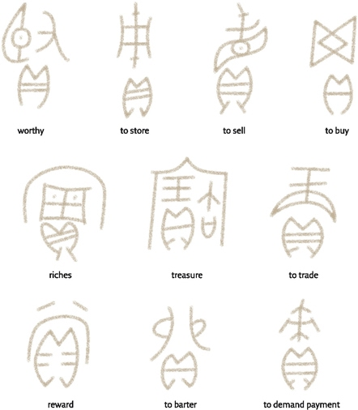

26. In ancient Chinese script the cowry-shell sign represented money, in words such as ‘to sell’ or ‘reward’.

In modern prisons and POW camps, cigarettes have often served as money. Even non-smoking prisoners have been willing to accept cigarettes in payment, and to calculate the value of all other goods and services in cigarettes.

In “normal” times, that is, when the candidates to the gas chambers were coming in at a regular pace, a loaf of bread cost twelve cigarettes; a 300-gram package of margarine, thirty; a watch, eighty to 200; a litre of alcohol, 400 cigarettes!

In fact, even today coins and banknotes are a rare form of money. In 2006, the sum total of money in the world is about $60 trillion, yet the sum total of coins and banknotes was less than $6 trillion.7 More than 90 per cent of all money – more than $50 trillion appearing in our accounts – exists only on computer servers.

For complex commercial systems to function, some kind of money is indispensable. A shoemaker in a money economy needs to know only the prices charged for various kinds of shoes – there is no need to memorise the exchange rates between shoes and apples or goats. Money also frees apple experts from the need to search out apple-craving shoemakers, because everyone always wants money.

This is perhaps its most basic quality. Everyone always wants money because everyone else also always wants money, which means you can exchange money for whatever you want or need.

Money is thus a universal medium of exchange that enables people to convert almost everything into almost anything else.

Health is converted to justice when a physician uses her fees to hire a lawyer – or bribe a judge. It is even possible to convert sex into salvation, as fifteenth-century prostitutes did when they slept with men for money, which they in turn used to buy indulgences from the Catholic Church.
 
 Grain, for example, can be stored for years, but to do so you need to build huge storehouses and guard against rats, mould, water, fire and thieves. Money, whether paper, computer bits or cowry shells, solves these problems. Cowry shells don’t rot, are unpalatable to rats, can survive fires and are compact enough to be locked up in a safe.
 
Because money can convert, store and transport wealth easily and cheaply, it made a vital contribution to the appearance of complex commercial networks and dynamic markets. Without money, commercial networks and markets would have been doomed to remain very limited in their size, complexity and dynamism.
 
#### How Does Money Work?
 
Cowry shells and dollars have value only in our common imagination.
 
money isn’t a material reality – it is a psychological construct.
 
works by converting matter into mind

Why are you willing to flip hamburgers, sell health insurance or babysit three obnoxious brats when all you get for your exertions is a few pieces of coloured paper? People are willing to do such things when they trust the figments of their collective imagination.

Trust is the raw 

material from which all types of money are minted

Money is accordingly a system of mutual trust, and not just any system of mutual trust: money is the most universal and most efficient system of mutual trust ever devised.

What created this trust was a very complex and long-term network of political, social and economic relations. Why do I believe in the cowry shell or gold coin or dollar bill? Because my neighbours believe in them. And my neighbours believe in them because I believe in them. And we all believe in them because our king believes in them and demands them in taxes, and because our priest believes in them and demands them in tithes. 

 The crucial role of trust explains why our financial systems are so tightly bound up with our political, social and ideological systems, why financial crises are often triggered by political developments, and why the stock market can rise or fall depending on the way traders feel on a particular morning.
 
Initially, when the first versions of money were created, people didn’t have this sort of trust, so it was necessary to define as ‘money’ things that had real intrinsic value. History’s first known money Sumerian barley money – is a good example. It appeared in Sumer around 3000 BC, at the same time and place, and under the same circumstances, in which writing appeared. Just as writing developed to answer the needs of intensifying administrative activities, so barley money developed to answer the needs of intensifying economic activities.

Barley money was simply barley – fixed amounts of barley grains used as a universal measure for evaluating and exchanging all other goods and services. The most common measurement was the sila, equivalent to roughly one litre.

 A male labourer earned sixty silas a month, a female labourer thirty silas. A foreman could earn between 1,200 and 5,000 silas. Not even the most ravenous foreman could eat 5,000 litres of barley a month, but he could use the silas he didn’t eat to buy all sorts of other commodities – oil, goats, slaves, and something else to eat besides barley.
 
 think what would happen if you took a sack full of barley to your local shopping centre, and tried to buy a shirt or a pizza. The vendors would probably call security. Still, it was somewhat easier to build trust in barley as the first type of money, because barley has an inherent biological value. Humans can eat it. 
 
On the other hand, it was difficult to store and transport barley. The real breakthrough in monetary history occurred when people gained trust in money that lacked inherent value, but was easier to store and transport. Such money appeared in ancient Mesopotamia in the middle of the third millennium BC. This was the silver shekel.
 
The silver shekel was not a coin, but rather 8.33 grams of silver... ...Unlike the barley sila, the silver shekel had no inherent value. You cannot eat, drink or clothe yourself in silver, and it’s too soft for making useful tools... ...Their value is purely cultural.

Set weights of precious metals eventually gave birth to coins. The first coins in history were struck around 640 BC by King Alyattes of Lydia, in western Anatolia. These coins had a standardised weight of gold or silver, and were imprinted with an identification mark. The mark testified to two things. First, it indicated how much precious metal the coin contained. Second, it identified the authority that issued the coin and that guaranteed its contents. Almost all coins in use today are descendants of the Lydian coins.

Coins had two important advantages over unmarked metal ingots. First, the latter had to be weighed for every transaction. Second, weighing the ingot is not enough. How does the shoemaker know that the silver ingot I put down for my boots is really made of pure silver, and not of lead covered on the outside by a thin silver coating? Coins help solve these problems. The mark imprinted on them testifies to their exact value, so the shoemaker doesn’t have to keep a scale on his cash register. More importantly, the mark on the coin is the signature of some political authority that guarantees the coin’s value.

The shape and size of the mark varied tremendously throughout history, but the message was always the same: ‘I, the Great King So-And-So, give you my personal word that this metal disc contains exactly five grams of gold. If anyone dares counterfeit this coin, it means he is fabricating my own signature, which would be a blot on my reputation. I will punish such a crime with the utmost severity.’

 Counterfeiting is not just cheating – it’s a breach of sovereignty, an act of subversion against the power, privileges and person of the king.
 
The legal term is lese-majesty (violating majesty), and was typically punished by torture and death.

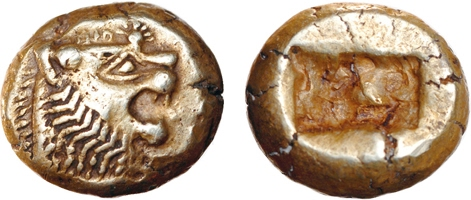
27. One of the earliest coins in history, from Lydia of the seventh century BC.

#### The Gospel of Gold

The trust in Rome’s coins was so strong that even outside the empire’s borders, people were happy to receive payment in denarii.

The Indians had such a strong confidence in the denarius and the image of the emperor that when local rulers struck coins of their own they closely imitated the denarius, down to the portrait of the Roman emperor!

The name ‘denarius’ became a generic name for coins.
 
Muslim caliphs Arabicised this name and issued ‘dinars’. The dinar is still the official name of the currency in Jordan, Iraq, Serbia, Macedonia, Tunisia and several other countries.

 China developed a slightly different monetary system, based on bronze coins and unmarked silver and gold ingots. Yet the two monetary systems had enough in common (especially the reliance on gold and silver) that close monetary and commercial relations were established between the Chinese zone and the Lydian zone.
 
By the late modern era the entire world was a single monetary zone, relying first on gold and silver, and later on a few trusted currencies such as the British pound and the American dollar.

The appearance of a single transnational and transcultural monetary zone laid the foundation for the unification of Afro-Asia, and eventually of the entire globe, into a single economic and political sphere.

People continued to speak mutually incomprehensible languages, obey different rulers and worship distinct gods, but all believed in gold and silver and in gold and silver coins.

 The gold and silver that sixteenth-century conquistadors found in America enabled European merchants to buy silk, porcelain and spices in East Asia, thereby moving the wheels of economic growth in both Europe and East Asia.
 
 why should Chinese, Indians, Muslims and Spaniards – who belonged to very different cultures that failed to agree about much of anything – nevertheless share the belief in gold? Why didn’t it happen that Spaniards believed in gold, while Muslims believed in barley, Indians in cowry shells, and Chinese in rolls of silk? Economists have a ready answer. Once trade connects two areas, the forces of supply and demand tend to equalise the prices of transportable goods. In order to understand why, consider a hypothetical case. Assume that when regular trade opened between India and the Mediterranean, Indians were uninterested in gold, so it was almost worthless. But in the Mediterranean, gold was a coveted status symbol, hence its value was high. What would happen next? Merchants travelling between India and the Mediterranean would notice the difference in the value of gold. In order to make a profit, they would buy gold cheaply in India and sell it dearly in the Mediterranean. Consequently, the demand for gold in India would skyrocket, as would its value. At the same time the Mediterranean would experience an influx of gold, whose value would consequently drop. Within a short time the value of gold in India and the Mediterranean would be quite similar. The mere fact that Mediterranean people believed in gold would cause Indians to start believing in it as well. Even if Indians still had no real use for gold, the fact that Mediterranean people wanted it would be enough to make the Indians value it.

 Christians and Muslims who could not agree on religious beliefs could nevertheless agree on a monetary belief, because whereas religion asks us to believe in something, money asks us to believe that other people believe in something.

For thousands of years, philosophers, thinkers and prophets have besmirched money and called it the root of all evil. Be that as it may, money is also the apogee of human tolerance. Money is more open-minded than language, state laws, cultural codes, religious beliefs and social habits. Money is the only trust system created by humans that can bridge almost any cultural gap, and that does not discriminate on the basis of religion, gender, race, age or sexual orientation. Thanks to money, even people who don’t know each other and don’t trust each other can nevertheless cooperate effectively.

#### The Price of Money

Money is based on two universal principles:
a. Universal convertibility: with money as an alchemist, you can turn land into loyalty, justice into health, and violence into knowledge.
b. Universal trust: with money as a go-between, any two people can cooperate on any project.

 But these seemingly benign principles have a dark side. When everything is convertible, and when trust depends on anonymous coins and cowry shells, it corrodes local traditions, intimate relations and human values, replacing them with the cold laws of supply and demand.
 
Human communities and families have always been based on belief in ‘priceless’ things, such as honour, loyalty, morality and love. These things lie outside the domain of the market, and they shouldn’t be bought or sold for money. Even if the market offers a good price, certain things just aren’t done. Parents mustn’t sell their children into slavery; a devout Christian must not commit a mortal sin; a loyal knight must never betray his lord; and ancestral tribal lands shall never be sold to foreigners. Money has always tried to break through these barriers, like water seeping through cracks in a dam. Parents have been reduced to selling some of their children into slavery in order to buy food for the others. Devout Christians have murdered, stolen and cheated – and later used their spoils to buy forgiveness from the church. Ambitious knights auctioned their allegiance to the highest bidder, while securing the loyalty of their own followers by cash payments. Tribal lands were sold to foreigners from the other side of the world in order to purchase an entry ticket into the global economy.

 although money builds universal trust between strangers, this trust is invested not in humans, communities or sacred values, but in money itself and in the impersonal systems that back it.
 
If they run out of coins, we run out of trust.

 As money brings down the dams of community, religion and state, the world is in danger of becoming one big and rather heartless marketplace.
 
People rely on money to facilitate cooperation with strangers, but they’re afraid it will corrupt human values and intimate relations. With one hand people willingly destroy the communal dams that held at bay the movement of money and commerce for so long. Yet with the other hand they build new dams to protect society, religion and the environment from enslavement to market forces.

Brutal warriors, religious fanatics and concerned citizens have repeatedly managed to trounce calculating merchants, and even to reshape the economy. It is therefore impossible to understand the unification of humankind as a purely economic process.

In order to understand how thousands of isolated cultures coalesced over time to form the global village of today, we must take into account the role of gold and silver, but we cannot disregard the equally crucial role of steel.

### 11 Imperial Visions

THE ANCIENT ROMANS WERE USED TO being defeated.

 An empire that cannot sustain a blow and remain standing is not really an empire.
 
In the middle of the second century BC. A small, insignificant mountain town called Numantia, inhabited by the peninsula’s native Celts, had dared to throw off the Roman yoke. Rome at the time was the unquestioned master of the entire Mediterranean basin, having vanquished the Macedonian and Seleucid empires, subjugated the proud city states of Greece, and turned Carthage into a smouldering ruin. The Numantians had nothing on their side but their fierce love of freedom and their inhospitable terrain. Yet they forced legion after legion to surrender or retreat in shame. Eventually, in 134 BC, Roman patience snapped. The Senate decided to send Scipio Aemilianus, Rome’s foremost general and the man who had levelled Carthage, to take care of the Numantians. He was given a massive army of more than 30,000 soldiers. Scipio, who respected the fighting spirit and martial skill of the Numantians, preferred not to waste his soldiers in unnecessary combat. Instead, he encircled Numantia with a line of fortifications, blocking the town’s contact with the outside world. Hunger did his work for him. After more than a year, the food supply ran out. When the Numantians realised that all hope was lost, they burned down their town; according to Roman accounts, most of them killed themselves so as not to become Roman slaves.

 In the 1950s and 1960s, the most popular comic books in Spain weren’t about Superman and Spiderman – they told of the adventures of El Jabato, an imaginary ancient Iberian hero who fought against the Roman oppressors. The ancient Numantians are to this day Spain’s paragons of heroism and patriotism, cast as role models for the country’s young people.
 
 Spanish patriots who admire Numantian heroism tend also to be loyal followers of the Roman Catholic Church – don’t miss that first word – a church whose leader still sits in Rome and whose God prefers to be addressed in Latin.
 
Similarly, modern Spanish law derives from Roman law; Spanish politics is built on Roman foundations; and Spanish cuisine and architecture owe a far greater debt to Roman legacies than to those of the Celts of Iberia.

The victory of Rome over Numantia was so complete that the victors co-opted the very memory of the vanquished.

It’s not our kind of story. We like to see underdogs win. But there is no justice in history. Most past cultures have sooner or later fallen prey to the armies of some ruthless empire, which have consigned them to oblivion. Empires, too, ultimately fall, but they tend to leave behind rich and enduring legacies.

#### What is an Empire?

An empire is a political order with two important characteristics. First, to qualify for that designation you have to rule over a significant number of distinct peoples, each possessing a different cultural identity and a separate territory... ...Second, empires are characterised by flexible borders and a potentially unlimited appetite. They can swallow and digest more and more nations and territories without altering their basic structure or identity.

Cultural diversity and territorial flexibility give empires not only their unique character, but also their central role in history.

It should be stressed that an empire is defined solely by its cultural diversity and flexible borders, rather than by its origins, its form of government, its territorial extent, or the size of its population. 

An empire need not emerge from military conquest.

 Nor must an empire be ruled by an autocratic emperor. The British Empire, the largest empire in history, was ruled by a democracy. Other democratic (or at least republican) empires have included the modern Dutch, French, Belgian and American empires, as well as the premodern empires of Novgorod, Rome, Carthage and Athens.
 
 The Athenian Empire at its zenith was much smaller in size and population than today’s Greece. The Aztec Empire was smaller than today’s Mexico. Both were nevertheless empires, whereas modern Greece and modern Mexico are not, because the former gradually subdued dozens and even hundreds of different polities while the latter have not. Athens lorded it over more than a hundred formerly independent city states, whereas the Aztec Empire, if we can trust its taxation records, ruled 371 different tribes and peoples.
 
How was it possible to squeeze such a human potpourri into the territory of a modest modern state? It was possible because in the past there were many more distinct peoples in the world, each of which had a smaller population and occupied less territory than today’s typical people. The land between the Mediterranean and the Jordan River, which today struggles to satisfy the ambitions of just two peoples, easily accommodated in biblical times dozens of nations, tribes, petty kingdoms and city states.
Empires were one of the main reasons for the drastic reduction in human diversity. The imperial steamroller gradually obliterated the unique characteristics of numerous peoples (such as the Numantians), forging out of them new and much larger groups.

#### Evil Empires?

The contemporary critique of empires commonly takes two forms:

1. Empires do not work. In the long run, it is not possible to rule effectively over a large number of conquered peoples.

2. Even if it can be done, it should not be done, because empires are evil engines of destruction and exploitation. Every people has a right to self-determination, and should never be subject to the rule of another.

From a historical perspective, the first statement is plain nonsense, and the second is deeply problematic.

The truth is that empire has been the world’s most common form of political organisation for the last 2,500 years. Most humans during these two and a half millennia have lived in empires.

 conquered peoples don’t have a very good record of freeing themselves from their imperial overlords. Most have remained subjugated for hundreds of years. Typically, they have been slowly digested by the conquering empire, until their distinct cultures fizzled out.
 
In many cases, the destruction of one empire hardly meant independence for subject peoples. Instead, a new empire stepped into the vacuum created when the old one collapsed or retreated.

the political, economic and social practices of modern Jews, for example, owe far more to the empires under which they lived during the past two millennia than to the traditions of the ancient kingdom of Judaea.

Building and maintaining an empire usually required the vicious slaughter of large populations and the brutal oppression of everyone who was left. The standard imperial toolkit included wars, enslavement, deportation and genocide. 
 
To colour all empires black and to disavow all imperial legacies is to reject most of human culture. Imperial elites used the profits of conquest to finance not only armies and forts but also philosophy, art, justice and charity. A significant proportion of humanity’s cultural achievements owe their existence to the exploitation of conquered populations. 

The profits and prosperity brought by Roman imperialism provided Cicero, Seneca and St Augustine with the leisure and wherewithal to think and write; the Taj Mahal could not have been built without the wealth accumulated by Mughal exploitation of their Indian subjects; and the Habsburg Empire’s profits from its rule over its Slavic, Hungarian and Romanian-speaking provinces paid Haydn’s salaries and Mozart’s commissions.

 Most East Asians speak and dream in the language of the Han Empire. No matter what their origins, nearly all the inhabitants of the two American continents, from Alaska’s Barrow Peninsula to the Straits of Magellan, communicate in one of four imperial languages: Spanish, Portuguese, French or English. Present-day Egyptians speak Arabic, think of themselves as Arabs, and identify wholeheartedly with the Arab Empire that conquered Egypt in the seventh century and crushed with an iron fist the repeated revolts that broke out against its rule.
 
#### It’s for Your Own Good

The first empire about which we have definitive information was the Akkadian Empire of Sargon the Great (c.2250 BC)... ...The Akkadian Empire did not last long after its founder’s death, but Sargon left behind an imperial mantle that seldom remained unclaimed. For the next 1,700 years, Assyrian, Babylonian and Hittite kings adopted Sargon as a role model, boasting that they, too, had conquered the entire world. Then, around 550 BC, Cyrus the Great of Persia came along with an even more impressive boast.

Map 4. The Akkadian Empire and the Persian Empire.

The kings of Assyria always remained the kings of Assyria. Even when they claimed to rule the entire world, it was obvious that they were doing it for the greater glory of Assyria, and they were not apologetic about it. Cyrus, on the other hand, claimed not merely to rule the whole world, but to do so for the sake of all people. ‘We are conquering you for your own benefit,’ said the Persians. Cyrus wanted the peoples he subjected to love him and to count themselves lucky to be Persian vassals. The most famous example of Cyrus’ innovative efforts to gain the approbation of a nation living under the thumb of his empire was his command that the Jewish exiles in Babylonia be allowed to return to their Judaean homeland and rebuild their temple. He even offered them financial assistance. Cyrus did not see himself as a Persian king ruling over Jews – he was also the king of the Jews, and thus responsible for their welfare.

Sapiens instinctively divide humanity into two parts, ‘we’ and ‘they’. We are people like you and me, who share our language, religion and customs. We are all responsible for each other, but not responsible for them. We were always distinct from them, and owe them nothing. We don’t want to see any of them in our territory, and we don’t care an iota what happens in their territory. They are barely even human.

In contrast with this ethnic exclusiveness, imperial ideology from Cyrus onward has tended to be inclusive and all-encompassing. Even though it has often emphasised racial and cultural differences between rulers and ruled, it has still recognised the basic unity of the entire world, the existence of a single set of principles governing all places and times, and the mutual responsibilities of all human beings. Humankind is seen as a large family: the privileges of the parents go hand in hand with responsibility for the welfare of the children.

This new imperial vision passed from Cyrus and the Persians to Alexander the Great, and from him to Hellenistic kings, Roman emperors, Muslim caliphs, Indian dynasts, and eventually even to Soviet premiers and American presidents. 

This benevolent imperial vision has justified the existence of empires, and negated not only attempts by subject peoples to rebel, but also attempts by independent peoples to resist imperial expansion.

The first emperor of the united Chinese empire, Qín Shǐ Huángdì, boasted that ‘throughout the six directions [of the universe] everything belongs to the emperor … wherever there is a human footprint, there is not one who did not become a subject [of the emperor] … his kindness reaches even oxen and horses.

 In Chinese political thinking as well as Chinese historical memory, imperial periods were henceforth seen as golden ages of order and justice. In contradiction to the modern Western view that a just world is composed of separate nation states, in China periods of political fragmentation were seen as dark ages of chaos and injustice. This perception has had far-reaching implications for Chinese history. Every time an empire collapsed, the dominant political theory goaded the powers that be not to settle for paltry independent principalities, but to attempt reunification. Sooner or later these attempts always succeeded.

#### When They Become Us

Empires have played a decisive part in amalgamating many small cultures into fewer big cultures. Ideas, people, goods and technology spread more easily within the borders of an empire than in a politically fragmented region.

Often enough, it was the empires themselves which deliberately spread ideas, institutions, customs and norms. One reason was to make life easier for themselves. It is difficult to rule an empire in which every little district has its own set of laws, its own form of writing, its own language and its own money. 
 
Standardisation was a boon to emperors.

The benefits were sometimes salient – law enforcement, urban planning, standardisation of weights and measures – and sometimes questionable – taxes, conscription, emperor worship. But most imperial elites earnestly believed that they were working for the general welfare of all the empires inhabitants. 

China’s ruling class treated their country’s neighbours and its foreign subjects as miserable barbarians to whom the empire must bring the benefits of culture. The Mandate of Heaven was bestowed upon the emperor not in order to exploit the world, but in order to educate humanity. 

The Romans, too, justified their dominion by arguing that they were endowing the barbarians with peace, justice and refinement. The wild Germans and painted Gauls had lived in squalor and ignorance until the Romans tamed them with law, cleaned them up in public bathhouses, and improved them with philosophy.

 The Spanish and Portuguese empires proclaimed that it was not riches they sought in the Indies and America, but converts to the true faith. The sun never set on the British mission to spread the twin gospels of liberalism and free trade. The Soviets felt duty-bound to facilitate the inexorable historical march from capitalism towards the utopian dictatorship of the proletariat. 
 
 Many Americans nowadays maintain that their government has a moral imperative to bring Third World countries the benefits of democracy and human rights, even if these goods are delivered by cruise missiles and F-16s.
 
 While some emperors sought to purify their cultures and return to what they viewed as their roots, for the most part empires have begot hybrid civilisations that absorbed much from their subject peoples. 
  
 The imperial culture of Rome was Greek almost as much as Roman.
 
The imperial civilisation may well have absorbed numerous contributions from various conquered peoples, but the hybrid result was still alien to the vast majority. 

The process of assimilation was often painful and traumatic. It is not easy to give up a familiar and loved local tradition, just as it is difficult and stressful to understand and adopt a new culture.
 
 The generations between conquest and acceptance were left out in the cold. They had already lost their beloved local culture, but they were not allowed to take an equal part in the imperial world. On the contrary, their adopted culture continued to view them as barbarians.
 
Imagine an Iberian of good stock living a century after the fall of Numantia. He speaks his native Celtic dialect with his parents, but has acquired impeccable Latin, with only a slight accent, because he needs it to conduct his business and deal with the authorities. He indulges his wife’s penchant for elaborately ornate baubles, but is a bit embarrassed that she, like other local women, retains this relic of Celtic taste – he’d rather have her adopt the clean simplicity of the jewellery worn by the Roman governor’s wife. He himself wears Roman tunics and, thanks to his success as a cattle merchant, due in no small part to his expertise in the intricacies of Roman commercial law, he has been able to build a Roman-style villa. Yet, even though he can recite Book III of Virgil’s Georgics by heart, the Romans still treat him as though he’s semi-barbarian. He realises with frustration that he’ll never get a government appointment, or one of the really good seats in the amphitheatre.

In the late nineteenth century, many educated Indians were taught the same lesson by their British masters. One famous anecdote tells of an ambitious Indian who mastered the intricacies of the English language, took lessons in Western-style dance, and even became accustomed to eating with a knife and fork. Equipped with his new manners, he travelled to England, studied law at University College London, and became a qualified barrister. Yet this young man of law, bedecked in suit and tie, was thrown off a train in the British colony of South Africa for insisting on travelling first class instead of settling for third class, where ‘coloured’ men like him were supposed to ride. His name was Mohandas Karamchand Gandhi.

In some cases the processes of acculturation and assimilation eventually broke down the barriers between the newcomers and the old elite. The conquered no longer saw the empire as an alien system of occupation, and the conquerors came to view their subjects as equal to themselves.

 In AD 48 the emperor Claudius admitted to the Senate several Gallic notables, who, he noted in a speech, through ‘customs, culture, and the ties of marriage have blended with ourselves’. Snobbish senators protested introducing these former enemies into the heart of the Roman political system. Claudius reminded them of an inconvenient truth. Most of their own senatorial families descended from Italian tribes who once fought against Rome,
 
The empire’s new citizens adopted Roman imperial culture with such zest that, for centuries and even millennia after the empire itself collapsed, they continued to speak the empire’s language, to believe in the Christian God that the empire had adopted from one of its Levantine provinces, and to live by the empire’s laws.

The Arab Empire. When it was established in the mid-seventh century AD, it was based on a sharp division between the ruling Arab–Muslim elite and the subjugated Egyptians, Syrians, Iranians and Berbers, who were neither Arabs nor Muslim. Many of the empire’s subjects gradually adopted the Muslim faith, the Arabic language and a hybrid imperial culture. The old Arab elite looked upon these parvenus with deep hostility, fearing to lose its unique status and identity. The frustrated converts clamoured for an equal share within the empire and in the world of Islam. Eventually they got their way. Egyptians, Syrians and Mesopotamians were increasingly seen as ‘Arabs’. Arabs, in their turn – whether authentic’ Arabs from Arabia or newly minted Arabs from Egypt and Syria – came to be increasingly dominated by non-Arab Muslims, in particular by Iranians, Turks and Berbers.

In China the success of the imperial project was even more thorough. For more than 2,000 years, a welter of ethnic and cultural groups first termed barbarians were successfully integrated into imperial Chinese culture and became Han Chinese (so named after the Han Empire that ruled China from 206 BC to AD 220). The ultimate achievement of the Chinese Empire is that it is still alive and kicking, yet it is hard to see it as an empire except in outlying areas such as Tibet and Xinjiang. More than 90 per cent of the population of China are seen by themselves and by others as Han.

 During the modern era Europeans conquered much of the globe under the guise of spreading a superior Western culture. They were so successful that billions of people gradually adopted significant parts of that culture. Indians, Africans, Arabs, Chinese and Maoris learned French, English and Spanish. They began to believe in human rights and the principle of self-determination, and they adopted Western ideologies such as liberalism, capitalism, Communism, feminism and nationalism.

#### The Imperial Cycle

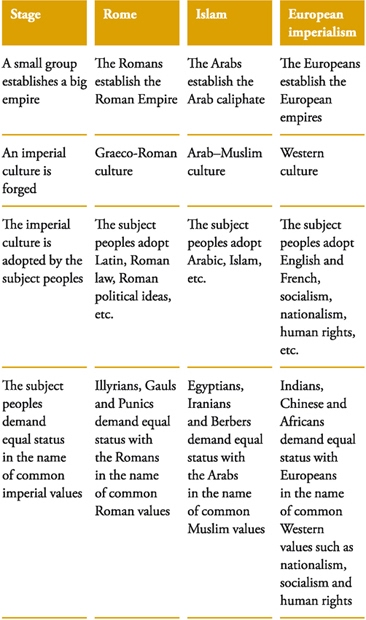
The Imperial Cycle Part 1

The Imperial Cycle Part 2

 Just as Egyptians, Iranians and Turks adopted and adapted the imperial culture that they inherited from the original Arab conquerors, so today’s Indians, Africans and Chinese have accepted much of the imperial culture of their former Western overlords, while seeking to mould it in accordance with their needs and traditions.
 
#### Good Guys and Bad Guys in History

 the vast majority of empires were founded on blood, and maintained their power through oppression and war. Yet most of today’s cultures are based on imperial legacies. If empires are by definition bad, what does that say about us?

There are schools of thought and political movements that seek to purge human culture of imperialism, leaving behind what they claim is a pure, authentic civilisation, untainted by sin. These ideologies are at best naïve; at worst they serve as disingenuous window-dressing for crude nationalism and bigotry. Perhaps you could make a case that some of the myriad cultures that emerged at the dawn of recorded history were pure, untouched by sin and unadulterated by other societies. But no culture since that dawn can reasonably make that claim, certainly no culture that exists now on earth. 

All human cultures are at least in part the legacy of empires and imperial civilisations, and no academic or political surgery can cut out the imperial legacies without killing the patient.

 many Indians adopted, with the zest of converts, Western ideas such as self-determination and human rights, and were dismayed when the British refused to live up to their own declared values by granting native Indians either equal rights as British subjects or independence. Nevertheless, the modern Indian state is a child of the British Empire. The British killed, injured and persecuted the inhabitants of the subcontinent, but they also united a bewildering mosaic of warring kingdoms, principalities and tribes, creating a shared national consciousness and a country that functioned more or less as a single political unit.
 
 English is still the subcontinent’s lingua franca, a neutral tongue that native speakers of Hindi, Tamil and Malayalam can use to communicate. Indians are passionate cricket players and chai (tea) drinkers, and both game and beverage are British legacies.
 

28. The Chhatrapati Shivaji train station in Mumbai. It began its life as Victoria Station, Bombay. The British built it in the Neo-Gothic style that was popular in late nineteenth-century Britain. A Hindu nationalist government changed the names of both city and station, but showed no appetite for razing such a magnificent building, even if it was built by foreign oppressors.

How many Indians today would want to call a vote to divest themselves of democracy, English, the railway network, the legal system, cricket and tea on the grounds that they are imperial legacies? And if they did, wouldn’t the very act of calling a vote to decide the issue demonstrate their debt to their former overlords?

29. The Taj Mahal. An example of ‘authentic’ Indian culture, or the alien creation of Muslim imperialism?

Even if we were to completely disavow the legacy of a brutal empire in the hope of reconstructing and safeguarding the ‘authentic’ cultures that preceded it, in all probability what we will be defending is nothing but the legacy of an older and no less brutal empire.

 If an extreme Hindu nationalist were to destroy all the buildings left by the British conquerors, such as Mumbai’s main train station, what about the structures left by India’s Muslim conquerors, such as the Taj Mahal?
 
 dividing the past into good guys and bad guys leads nowhere. Unless, of course, we are willing to admit that we usually follow the lead of the bad guys.
 
#### The New Global Empire

Since around 200 BC, most humans have lived in empires. It seems likely that in the future, too, most humans will live in one. But this time the empire will be truly global. The imperial vision of dominion over the entire world could be imminent.

More and more people believe that all of humankind is the legitimate source of political authority, rather than the members of a particular nationality, and that safeguarding human rights and protecting the interests of the entire human species should be the guiding light of politics.
 
No sovereign state will be able to overcome global warming on its own. The Chinese Mandate of Heaven was given by Heaven to solve the problems of humankind. The modern Mandate of Heaven will be given by humankind to solve the problems of heaven, such as the hole in the ozone layer and the accumulation of greenhouse gases. The colour of the global empire may well be green.

States are increasingly open to the machinations of global markets, to the interference of global companies and NGOs, and to the supervision of global public opinion and the international judicial system. States are obliged to conform to global standards of financial behaviour, environmental policy and justice.

The global empire being forged before our eyes is not governed by any particular state or ethnic group. Much like the Late Roman Empire, it is ruled by a multi-ethnic elite, and is held together by a common culture and common interests. 

Throughout the world, more and more entrepreneurs, engineers, experts, scholars, lawyers and managers are called to join the empire. They must ponder whether to answer the imperial call or to remain loyal to their state and their people. More and more choose the empire.

### 12 The Law of Religion

IN THE MEDIEVAL MARKET IN SAMARKAND, a city built on a Central Asian oasis, Syrian merchants ran their hands over fine Chinese silks, fierce tribesmen from the steppes displayed the latest batch of straw-haired slaves from the far west, and shopkeepers pocketed shiny gold coins imprinted with exotic scripts and the profiles of unfamiliar kings. Here, at one of that era’s major crossroads between east and west, north and south, the unification of humankind was an everyday fact.

around the holy Ka’aba in Mecca, human unification was proceeding by other means. Had you been a pilgrim to Mecca, circling Islam’s holiest shrine in the year 1300, you might have found yourself in the company of a party from Mesopotamia, their robes floating in the wind, their eyes blazing with ecstasy, and their mouths repeating one after the other the ninety-nine names of God. Just ahead you might have seen a weather-beaten Turkish patriarch from the Asian steppes, hobbling on a stick and stroking his beard thoughtfully. To one side, gold jewellery shining against jet-black skin, might have been a group of Muslims from the African kingdom of Mali. The aroma of clove, turmeric, cardamom and sea salt would have signalled the presence of brothers from India, or perhaps from the mysterious spice islands further east.

Today religion is often considered a source of discrimination, disagreement and disunion. Yet, in fact, religion has been the third great unifier of humankind, alongside money and empires.

 the larger the society, the more fragile it is.
 
 Religions assert that our laws are not the result of human caprice, but are ordained by an absolute and supreme authority.

Religion can thus be defined as a system of human norms and values that is founded on a belief in a superhuman order.

two distinct criteria:

1. Religions hold that there is a superhuman order, which is not the product of human whims or agreements. Professional football is not a religion, because despite its many laws, rites and often bizarre rituals, everyone knows that human beings invented football themselves, and FIFA may at any moment enlarge the size of the goal or cancel the offside rule.

2. Based on this superhuman order, religion establishes norms and values that it considers binding.

Despite their ability to legitimise widespread social and political orders, not all religions have actuated this potential. 

In order to unite under its aegis a large expanse of territory inhabited by disparate groups of human beings, a religion must possess two further qualities. First, it must espouse a universal superhuman order that is true always and everywhere. Second, it must insist on spreading this belief to everyone. In other words, it must be universal and missionary.

The best-known religions of history, such as Islam and Buddhism, are universal and missionary... ...the majority of ancient religions were local and exclusive.

 As far as we know, universal and missionary religions began to appear only in the first millennium BC. Their emergence was one of the most important revolutions in history, and made a vital contribution to the unification of humankind, much like the emergence of universal empires and universal money.
 
#### Silencing the Lambs

When animism was the dominant belief system, human norms and values had to take into consideration the outlook and interests of a multitude of other beings, such as animals, plants, fairies and ghosts. For example, a forager band in the Ganges Valley may have established a rule forbidding people to cut down a particularly large fig tree, lest the fig-tree spirit become angry and take revenge. Another forager band living in the Indus Valley may have forbidden people from hunting white-tailed foxes, because a white-tailed fox once revealed to a wise old woman where the band might find precious obsidian. Such religions tended to be very local in outlook, and to emphasise the unique features of specific locations, climates and phenomena.

 Most foragers spent their entire lives within an area of no more than a thousand square kilometres.
 
The Agricultural Revolution seems to have been accompanied by a religious revolution. Hunter-gatherers picked and pursued wild plants and animals, which could be seen as equal in status to Homo sapiens. The fact that man hunted sheep did not make sheep inferior to man, just as the fact that tigers hunted man did not make man inferior to tigers. Beings communicated with one another directly and negotiated the rules governing their shared habitat. In contrast, farmers owned and manipulated plants and animals, and could hardly degrade themselves by negotiating with their possessions. Hence the first religious effect of the Agricultural Revolution was to turn plants and animals from equal members of a spiritual round table into property.

This, however, created a big problem. Farmers may have desired absolute control of their sheep, but they knew perfectly well that their control was limited. They could lock the sheep in pens, castrate rams and selectively breed ewes, yet they could not ensure that the ewes conceived and gave birth to healthy lambs, nor could they prevent the eruption of deadly epidemics. How then to safeguard the fecundity of the flocks? A leading theory about the origin of the gods argues that gods gained importance because they offered a solution to this problem. Gods such as the fertility goddess, the sky god and the god of medicine took centre stage when plants and animals lost their ability to speak, and the gods’ main role was to mediate between humans and the mute plants and animals.

For thousands of years after the Agricultural Revolution, religious liturgy consisted mainly of humans sacrificing lambs, wine and cakes to divine powers, who in exchange promised abundant harvests and fecund flocks.

once kingdoms and trade networks expanded, people needed to contact entities whose power and authority encompassed a whole kingdom or an entire trade basin.

The attempt to answer these needs led to the appearance of polytheistic religions (from the Greek: poly = many, theos = god). These religions understood the world to be controlled by a group of powerful gods, such as the fertility goddess, the rain god and the war god. Humans could appeal to these gods and the gods might, if they received devotions and sacrifices, deign to bring rain, victory and health.

 the greatest impact of the rise of great gods was not on sheep or demons, but upon the status of Homo sapiens. Animists thought that humans were just one of many creatures inhabiting the world. Polytheists, on the other hand, increasingly saw the world as a reflection of the relationship between gods and humans. Our prayers, our sacrifices, our sins and our good deeds determined the fate of the entire ecosystem.

 Polytheism thereby exalted not only the status of the gods, but also that of humankind. Less fortunate members of the old animist system lost their stature and became either extras or silent decor in the great drama of man’s relationship with the gods.
 
#### The Benefits of Idolatry 

Two thousand years of monotheistic brainwashing have caused most Westerners to see polytheism as ignorant and childish idolatry. This is an unjust stereotype. In order to understand the inner logic of polytheism, it is necessary to grasp the central idea buttressing the belief in many gods.

Polytheism does not necessarily dispute the existence of a single power or law governing the entire universe. In fact, most polytheist and even animist religions recognised such a supreme power that stands behind all the different gods, demons and holy rocks. In classical Greek polytheism, Zeus, Hera, Apollo and their colleagues were subject to an omnipotent and all-encompassing power – Fate (Moira, Ananke).

The fundamental insight of polytheism, which distinguishes it from monotheism, is that the supreme power governing the world is devoid of interests and biases, and therefore it is unconcerned with the mundane desires, cares and worries of humans. It’s pointless to ask this power for victory in war, for health or for rain, because from its all-encompassing vantage point, it makes no difference whether a particular kingdom wins or loses, whether a particular city prospers or withers, whether a particular person recuperates or dies. The Greeks did not waste any sacrifices on Fate, and Hindus built no temples to Atman.

The only reason to approach the supreme power of the universe would be to renounce all desires and embrace the bad along with the good – to embrace even defeat, poverty, sickness and death. Thus some Hindus, known as Sadhus or Sannyasis, devote their lives to uniting with Atman, thereby achieving enlightenment. They strive to see the world from the viewpoint of this fundamental principle, to realise that from its eternal perspective all mundane desires and fears are meaningless and ephemeral phenomena.

Most Hindus, however, are not Sadhus. They are sunk deep in the morass of mundane concerns, where Atman is not much help. For assistance in such matters, Hindus approach the gods with their partial powers. Precisely because their powers are partial rather than all-encompassing, gods such as Ganesha, Lakshmi and Saraswati have interests and biases. Humans can therefore make deals with these partial powers and rely on their help in order to win wars and recuperate from illness. There are necessarily many of these smaller powers, since once you start dividing up the all-encompassing power of a supreme principle, you’ll inevitably end up with more than one deity. Hence the plurality of gods.

 Since polytheists believe, on the one hand, in one supreme and completely disinterested power, and on the other hand in many partial and biased powers, there is no difficulty for the devotees of one god to accept the existence and efficacy of other gods. Polytheism is inherently open-minded, and rarely persecutes ‘heretics’ and ‘infidels’.
 
 when polytheists conquered huge empires, they did not try to convert their subjects. The Egyptians, the Romans and the Aztecs did not send missionaries to foreign lands to spread the worship of Osiris, Jupiter or Huitzilopochtli (the chief Aztec god), and they certainly didn’t dispatch armies for that purpose.
 
In many cases the imperial elite itself adopted the gods and rituals of subject people. The Romans happily added the Asian goddess Cybele and the Egyptian goddess Isis to their pantheon. The only god that the Romans long refused to tolerate was the monotheistic and evangelising god of the Christians.

 Still, if we combine all the victims of all these persecutions, it turns out that in these three centuries, the polytheistic Romans killed no more than a few thousand Christians.1 In contrast, over the course of the next 1,500 years, Christians slaughtered Christians by the millions to defend slightly different interpretations of the religion of love and compassion.
 
 Protestants believed that the divine love is so great that God was incarnated in flesh and allowed Himself to be tortured and crucified, thereby redeeming the original sin and opening the gates of heaven to all those who professed faith in Him. Catholics maintained that faith, while essential, was not enough. To enter heaven, believers had to participate in church rituals and do good deeds. Protestants refused to accept this, arguing that this quid pro quo belittles God’s greatness and love. Whoever thinks that entry to heaven depends upon his or her own good deeds magnifies his own importance, and implies that Christ’s suffering on the cross and God’s love for humankind are not enough. These theological disputes turned so violent that during the sixteenth and seventeenth centuries, Catholics and Protestants killed each other by the hundreds of thousands. 

On 23 August 1572, French Catholics who stressed the importance of good deeds attacked communities of French Protestants who highlighted God’s love for humankind. In this attack, the St Bartholomew’s Day Massacre, between 5,000 and 10,000 Protestants were slaughtered in less than twenty-four hours. When the pope in Rome heard the news from France, he was so overcome by joy that he organised festive prayers to celebrate the occasion and commissioned Giorgio Vasari to decorate one of the Vatican’s rooms with a fresco of the massacre (the room is currently off-limits to visitors).2 More Christians were killed by fellow Christians in those twenty-four hours than by the polytheistic Roman Empire throughout its entire existence.
 
#### God is One
 
With time some followers of polytheist gods became so fond of their particular patron that they drifted away from the basic polytheist insight. They began to believe that their god was the only god, and that He was in fact the supreme power of the universe. Yet at the same time they continued to view Him as possessing interests and biases, and believed that they could strike deals with Him. Thus were born monotheist religions, whose followers beseech the supreme power of the universe to help them recover from illness, win the lottery and gain victory in war.
 
The first monotheist religion known to us appeared in Egypt, c.350 BC, when Pharaoh Akhenaten declared that one of the minor deities of the Egyptian pantheon, the god Aten... ...After his death, the worship of Aten was abandoned in favour of the old pantheon.

 other monotheist religions, but they remained marginal, not least because they failed to digest their own universal message. Judaism, for example, argued that the supreme power of the universe has interests and biases, yet His chief interest is in the tiny Jewish nation and in the obscure land of Israel. Judaism had little to offer other nations, and throughout most of its existence it has not been a missionary religion. This stage can be called the stage of ‘local monotheism’.
 
The big breakthrough came with Christianity. This faith began as an esoteric Jewish sect that sought to convince Jews that Jesus of Nazareth was their long-awaited messiah. However, one of the sect’s first leaders, Paul of Tarsus, reasoned that if the supreme power of the universe has interests and biases, and if He had bothered to incarnate Himself in the flesh and to die on the cross for the salvation of humankind, then this is something everyone should hear about, not just Jews. It was thus necessary to spread the good word – the gospel – about Jesus throughout the world.

Christians began organising widespread missionary activities aimed at all humans. In one of history’s strangest twists, this esoteric Jewish sect took over the mighty Roman Empire.

Christian success served as a model for another monotheist religion that appeared in the Arabian peninsula in the seventh century – Islam. Like Christianity, Islam, too, began as a small sect in a remote corner of the world, but in an even stranger and swifter historical surprise it managed to break out of the deserts of Arabia and conquer an immense empire stretching from the Atlantic Ocean to India. Henceforth, the monotheist idea played a central role in world history.

Monotheists have tended to be far more fanatical and missionary than polytheists.

Since monotheists have usually believed that they are in possession of the entire message of the one and only God, they have been compelled to discredit all other religions.

 Around AD 500, one of the world’s largest empires – the Roman Empire – was a Christian polity, and missionaries were busy spreading Christianity to other parts of Europe, Asia and Africa. By the end of the first millennium AD, most people in Europe, West Asia and North Africa were monotheists, and empires from the Atlantic Ocean to the Himalayas claimed to be ordained by the single great God.
 
Today most people outside East Asia adhere to one monotheist religion or another, and the global political order is built on monotheistic foundations.

Who would want to approach a lowly bureaucrat when the president’s office is open to you? Indeed, monotheist theology tends to deny the existence of all gods except the supreme God, and to pour hellfire and brimstone over anyone who dares worship them.

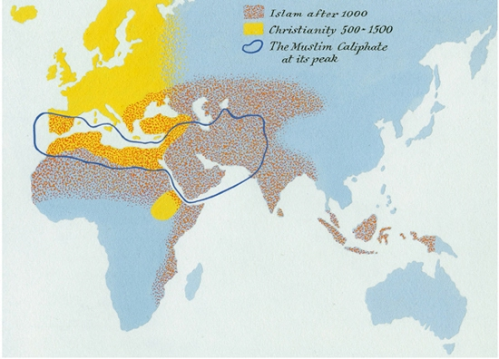
Map 5. The Spread of Christianity and Islam.

Most people have found it difficult to digest the monotheist idea fully. They have continued to divide the world into ‘we’ and ‘they’, and to see the supreme power of the universe as too distant and alien for their mundane needs. 

The monotheist religions expelled the gods through the front door with a lot of fanfare, only to take them back in through the side window. Christianity, for example, developed its own pantheon of saints, whose cults differed little from those of the polytheistic gods... ...The city of Milan had St Ambrose, while St Mark watched over Venice. St Florian protected chimney cleaners, whereas St Mathew lent a hand to tax collectors in distress. If you suffered from headaches you had to pray to St Agathius, but if from toothaches, then St Apollonia was a much better audience.

#### The Battle of Good and Evil

Polytheism gave birth not merely to monotheist religions, but also to dualistic ones. Dualistic religions espouse the existence of two opposing powers: good and evil.

Dualism is a very attractive world view because it has a short and simple answer to the famous Problem of Evil, one of the fundamental concerns of human thought. ‘Why is there evil in the world? Why is there suffering? Why do bad things happen to good people?’ Monotheists have to practise intellectual gymnastics to explain how an all-knowing, all-powerful and perfectly good God allows so much suffering in the world. 

One well-known explanation is that this is God’s way of allowing for human free will. Were there no evil, humans could not choose between good and evil, and hence there would be no free will. This, however, is a non-intuitive answer that immediately raises a host of new questions. Freedom of will allows humans to choose evil. Many indeed choose evil and, according to the standard monotheist account, this choice must bring divine punishment in its wake. If God knew in advance that a particular person would use her free will to choose evil, and that as a result she would be punished for this by eternal tortures in hell, why did God create her?

Dualism has its own drawbacks. While solving the Problem of Evil, it is unnerved by the Problem of Order. If the world was created by a single God, it’s clear why it is such an orderly place, where everything obeys the same laws. But if Good and Evil battle for control of the world, who enforces the laws governing this cosmic war? Two rival states can fight one another because both obey the same laws of physics. A missile launched from Pakistan can hit targets in India because gravity works the same way in both countries. When Good and Evil fight, what common laws do they obey, and who decreed these laws?

So, monotheism explains order, but is mystified by evil. Dualism explains evil, but is puzzled by order. There is one logical way of solving the riddle: to argue that there is a single omnipotent God who created the entire universe – and He’s evil. But nobody in history has had the stomach for such a belief.

Dualistic religions flourished for more than a thousand years. Sometime between 1500 BC and 1000 BC a prophet named Zoroaster (Zarathustra) was active somewhere in Central Asia. His creed passed from generation to generation until it became the most important of dualistic religions – Zoroastrianism... ...It exerted a major influence on almost all subsequent Middle Eastern and Central Asian religions, and it inspired a number of other dualist religions, such as Gnosticism and Manichaeanism. During the third and fourth centuries AD, the Manichaean creed spread from China to North Africa, and for a moment it appeared that it would beat Christianity to achieve dominance in the Roman Empire. Yet the Manichaeans lost the soul of Rome to the Christians, the Zoroastrian Sassanid Empire was overrun by the monotheistic Muslims, and the dualist wave subsided. Today only a handful of dualist communities survive in India and the Middle East.

How can a monotheist adhere to such a dualistic belief (which, by the way, is nowhere to be found in the Old Testament)? Logically, it is impossible. Either you believe in a single omnipotent God or you believe in two opposing powers, neither of which is omnipotent. Still, humans have a wonderful capacity to believe in contradictions. So it should not come as a surprise that millions of pious Christians, Muslims and Jews manage to believe at one and the same time in an omnipotent God and an independent Devil.

Another key dualistic concept, particularly in Gnosticism and Manichaeanism, was the sharp distinction between body and soul, between matter and spirit. Gnostics and Manichaeans argued that the good god created the spirit and the soul, whereas matter and bodies are the creation of the evil god. Man, according to this view, serves as a battleground between the good soul and the evil body. From a monotheistic perspective, this is nonsense – why distinguish so sharply between body and soul, or matter and spirit? And why argue that body and matter are evil? After all, everything was created by the same good God. But monotheists could not help but be captivated by dualist dichotomies, precisely because they helped them address the problem of evil. So such oppositions eventually became cornerstones of Christian and Muslim thought. Belief in heaven (the realm of the good god) and hell (the realm of the evil god) was also dualist in origin. There is no trace of this belief in the Old Testament, which also never claims that the souls of people continue to live after the death of the body.

monotheism, as it has played out in history, is a kaleidoscope of monotheist, dualist, polytheist and animist legacies, jumbling together under a single divine umbrella. The average Christian believes in the monotheist God, but also in the dualist Devil, in polytheist saints, and in animist ghosts.

simultaneous avowal of different and even contradictory ideas and the combination of rituals and practices taken from different sources. It’s called syncretism. Syncretism might, in fact, be the single great world religion.

#### The Law of Nature

The religious history of the world does not boil down to the history of gods. During the first millennium BC, religions of an altogether new kind began to spread through Afro-Asia. The newcomers, such as Jainism and Buddhism in India, Daoism and Confucianism in China, and Stoicism, Cynicism and Epicureanism in the Mediterranean basin, were characterised by their disregard of gods.

Gods had their niche in the ecosystem, just as elephants and porcupines had theirs, but could no more change the laws of nature than elephants can. A prime example is Buddhism, the most important of the ancient natural law religions, which remains one of the major faiths.

The central figure of Buddhism is not a god but a human being, Siddhartha Gautama. According to Buddhist tradition, Gautama was heir to a small Himalayan kingdom, sometime around 500 BC. The young prince was deeply affected by the suffering evident all around him. He saw that men and women, children and old people, all suffer not just from occasional calamities such as war and plague, but also from anxiety, frustration and discontent, all of which seem to be an inseparable part of the human condition. People pursue wealth and power, acquire knowledge and possessions, beget sons and daughters, and build houses and palaces. Yet no matter what they achieve, they are never content. Those who live in poverty dream of riches. Those who have a million want two million. Those who have two million want 10 million. Even the rich and famous are rarely satisfied. They too are haunted by ceaseless cares and worries, until sickness, old age and death put a bitter end to them. Everything that one has accumulated vanishes like smoke.

Life is a pointless rat race. But how to escape it?
 
Gautama slipped away from his palace in the middle of the night... ...He travelled as a homeless vagabond throughout northern India, searching for a way out of suffering. He visited ashrams and sat at the feet of gurus but nothing liberated him entirely – some dissatisfaction always remained. He did not despair. He resolved to investigate suffering on his own until he found a method for complete liberation... ...he came to the realisation that suffering is not caused by ill fortune, by social injustice, or by divine whims. Rather, suffering is caused by the behaviour patterns of one’s own mind.

Gautama’s insight was that no matter what the mind experiences, it usually reacts with craving, and craving always involves dissatisfaction. When the mind experiences something distasteful it craves to be rid of the irritation. When the mind experiences something pleasant, it craves that the pleasure will remain and will intensify. Therefore, the mind is always dissatisfied and restless.

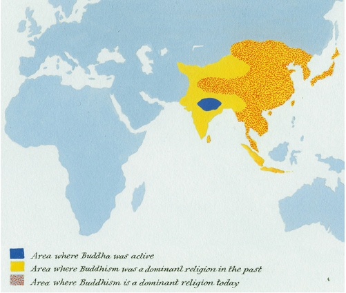
Map 6. The Spread of Buddhism.

Hence even the greatest kings are doomed to live in angst, constantly fleeing grief and anguish, forever chasing after greater pleasures.

Gautama found that there was a way to exit this vicious circle. If, when the mind experiences something pleasant or unpleasant, it simply understands things as they are, then there is no suffering. If you experience sadness without craving that the sadness go away, you continue to feel sadness but you do not suffer from it. There can actually be richness in the sadness. If you experience joy without craving that the joy linger and intensify, you continue to feel joy without losing your peace of mind.

train the mind to focus all its attention on the question, ‘What am I experiencing now?’ rather than on ‘What would I rather be experiencing?’ It is difficult to achieve this state of mind, but not impossible.

Avoid killing, promiscuous sex and theft, since such acts necessarily stoke the fire of craving (for power, for sensual pleasure, or for wealth). 

When the flames are completely extinguished, craving is replaced by a state of perfect contentment and serenity, known as nirvana (the literal meaning of which is ‘extinguishing the fire’). 

Those who have attained nirvana are fully liberated from all suffering. They experience reality with the utmost clarity, free of fantasies and delusions. While they will most likely still encounter unpleasantness and pain, such experiences cause them no misery. A person who does not crave cannot suffer.

suffering arises from craving; the only way to be fully liberated from suffering is to be fully liberated from craving; and the only way to be liberated from craving is to train the mind to experience reality as it is.

This law, known as dharma or dhamma, is seen by Buddhists as a universal law of nature. That ‘suffering arises from craving’ is always and everywhere true, just as in modern physics E always equals mc2. Buddhists are people who believe in this law and make it the fulcrum of all their activities. Belief in gods, on the other hand, is of minor importance to them. The first principle of monotheist religions is ‘God exists. What does He want from me?’ The first principle of Buddhism is ‘Suffering exists. How do I escape it?’

 However, 99 per cent of Buddhists did not attain nirvana, and even if they hoped to do so in some future lifetime, they devoted most of their present lives to the pursuit of mundane achievements. So they continued to worship various gods, such as the Hindu gods in India, the Bon gods in Tibet, and the Shinto gods in Japan.
  
#### The Worship of Man

The last 300 years are often depicted as an age of growing secularism, in which religions have increasingly lost their importance. If we are talking about theist religions, this is largely correct. But if we take into consideration natural-law religions, then modernity turns out to be an age of intense religious fervour, unparalleled missionary efforts, and the bloodiest wars of religion in history.

 The modern age has witnessed the rise of a number of new natural-law religions, such as liberalism, Communism, capitalism, nationalism and Nazism. These creeds do not like to be called religions, and refer to themselves as ideologies. But this is just a semantic exercise. If a religion is a system of human norms and values that is founded on belief in a superhuman order, then Soviet Communism was no less a religion than Islam.
 
 Like Buddhists, Communists believed in a superhuman order of natural and immutable laws that should guide human actions. Whereas Buddhists believe that the law of nature was discovered by Siddhartha Gautama, Communists believed that the law of nature was discovered by Karl Marx, Friedrich Engels and Vladimir Ilyich Lenin.
 

Religion is a system of human norms and values that is founded on belief in a superhuman order. The theory of relativity is not a religion, because (at least so far) there are no human norms and values that are founded on it. Football is not a religion because nobody argues that its rules reflect superhuman edicts. Islam, Buddhism and Communism are all religions, because all are systems of human norms and values that are founded on belief in a superhuman order. (Note the difference between ‘superhuman’ and ‘supernatural’. The Buddhist law of nature and the Marxist laws of history are superhuman, since they were not legislated by humans. Yet they are not supernatural.)

 Humanist religions worship humanity, or more correctly, Homo sapiens. Humanism is a belief that Homo sapiens has a unique and sacred nature, which is fundamentally different from the nature of all other animals and of all other phenomena.
 
All humanists worship humanity, but they do not agree on its definition. Humanism has split into three rival sects that fight over the exact definition of ‘humanity’, just as rival Christian sects fought over the exact definition of God. Today, the most important humanist sect is liberal humanism, which believes that ‘humanity’ is a quality of individual humans, and that the liberty of individuals is therefore sacrosanct. According to liberals, the sacred nature of humanity resides within each and every individual Homo sapiens. 

The inner core of individual humans gives meaning to the world, and is the source for all ethical and political authority. If we encounter an ethical or political dilemma, we should look inside and listen to our inner voice – the voice of humanity.
 
 In early modern Europe, murderers were thought to violate and destabilise the cosmic order. To bring the cosmos back to balance, it was necessary to torture and publicly execute the criminal, so that everyone could see the order re-established. Attending gruesome executions was a favourite pastime for Londoners and Parisians in the era of Shakespeare and Molière. In today’s Europe, murder is seen as a violation of the sacred nature of humanity. In order to restore order, present-day Europeans do not torture and execute criminals. Instead, they punish a murderer in what they see as the most ‘humane’ way possible, thus safeguarding and even rebuilding his human sanctity. By honouring the human nature of the murderer, everyone is reminded of the sanctity of humanity, and order is restored. By defending the murderer, we right what the murderer has wronged.
 
Without recourse to eternal souls and a Creator God, it becomes embarrassingly difficult for liberals to explain what is so special about individual Sapiens.
  
 Whereas liberal humanism seeks as much freedom as possible for individual humans, socialist humanism seeks equality between all humans. \
 
According to socialists, inequality is the worst blasphemy against the sanctity of humanity, because it privileges peripheral qualities of humans over their universal essence. For example, when the rich are privileged over the poor, it means that we value money more than the universal essence of all humans, which is the same for rich and poor alike.

Like liberal humanism, socialist humanism is built on monotheist foundations. The idea that all humans are equal is a revamped version of the monotheist conviction that all souls are equal before God.  

 What distinguished the Nazis from other humanist sects was a different definition of ‘humanity’, one deeply influenced by the theory of evolution. In contrast to other humanists, the Nazis believed that humankind is not something universal and eternal, but rather a mutable species that can evolve or degenerate. Man can evolve into superman, or degenerate into a subhuman.
 
 According to the Nazis, Homo sapiens had already divided into several distinct races, each with its own unique qualities. One of these races, the Aryan race, had the finest qualities – rationalism, beauty, integrity, diligence. The Aryan race therefore had the potential to turn man into superman. Other races, such as Jews and blacks, were today’s Neanderthals, possessing inferior qualities.
 
Biologists have since debunked Nazi racial theory. In particular, genetic research conducted after 1945 has demonstrated that the differences between the various human lineages are far smaller than the Nazis postulated. But these conclusions are relatively new. Given the state of scientific knowledge in 1933, Nazi beliefs were hardly outside the pale.

 The existence of different human races, the superiority of the white race, and the need to protect and cultivate this superior race were widely held beliefs among most Western elites... ...Politicians in Washington, London and Canberra took it for granted that it was their job to prevent the adulteration and degeneration of the white race, by, for example, restricting immigration from China or even Italy to ‘Aryan’ countries such as the USA and Australia.

#### Humanist Religions – Religions that Worship Humanity

Homo sapiens has a unique and sacred nature that is fundamentally different from the nature of all other beings and phenomena. The supreme good is the good of humanity. 

| Liberal humanism                                                                                                                                                         | Socialist humanism                                                               | Evolutionary humanism                                                                                                              |
| ------------------------------------------------------------------------------------------------------------------------------------------------------------------------ | -------------------------------------------------------------------------------- | ---------------------------------------------------------------------------------------------------------------------------------- |
| ‘Humanity’ is individualistic and resides within each individual Homo sapiens.                                                                                           | ‘Humanity’ is collective and resides within the species Homo sapiens as a whole. | ‘Humanity’ is a mutable species. Humans might degenerate into subhumans or evolve into superhumans.                                |
| The supreme commandment is to protect the inner core and freedom of each individual Homo sapiens.                                                                        | The supreme commandment is to protect equality within the species Homo sapiens.  | The supreme commandment is to protect humankind from degenerating into subhumans, and to encourage its evolution into superhumans. |

These positions did not change simply because new scientific research was published. Sociological and political developments were far more powerful engines of change. In this sense, Hitler dug not just his own grave but that of racism in general. When he launched World War Two, he compelled his enemies to make clear distinctions between ‘us’ and ‘them’. Afterwards, precisely because Nazi ideology was so racist, racism became discredited in the West. But the change took time. White supremacy remained a mainstream ideology in American politics at least until the 1960s.

30. A Nazi propaganda poster showing on the right a ‘racially pure Aryan’ and on the left a ‘cross-breed’. Nazi admiration for the human body is evident, as is their fear that the lower races might pollute humanity and cause its degeneration.

 By succouring the weak, liberalism and Communism not only allowed unfit individuals to survive, they actually gave them the opportunity to reproduce, thereby undermining natural selection. In such a world, the fittest humans would inevitably drown in a sea of unfit degenerates. Humankind would become less and less fit with each passing generation – which could lead to its extinction.
 
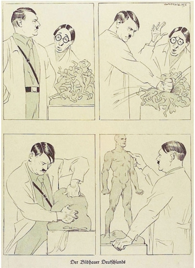
31. A Nazi cartoon of 1933. Hitler is presented as a sculptor who creates the superman. A bespectacled liberal intellectual is appalled by the violence needed to create the superman. (Note also the erotic glorification of the human body.)

A 1942 German biology textbook explains in the chapter ‘The Laws of Nature and Mankind’ that the supreme law of nature is that all beings are locked in a remorseless struggle for survival.

At the dawn of the third millennium, the future of evolutionary humanism is unclear. For sixty years after the end of the war against Hitler it was taboo to link humanism with evolution and to advocate using biological methods to upgrade’ Homo sapiens. But today such projects are back in vogue. No one speaks about exterminating lower races or inferior people, but many contemplate using our increasing knowledge of human biology to create superhumans.

 Our liberal political and judicial systems are founded on the belief that every individual has a sacred inner nature, indivisible and immutable, which gives meaning to the world, and which is the source of all ethical and political authority. This is a reincarnation of the traditional Christian belief in a free and eternal soul that resides within each individual. Yet over the last 200 years, the life sciences have thoroughly undermined this belief.
 
Scientists studying the inner workings of the human organism have found no soul there. 

They increasingly argue that human behaviour is determined by hormones, genes and synapses, rather than by free will – the same forces that determine the behaviour of chimpanzees, wolves, and ants. Our judicial and political systems largely try to sweep such inconvenient discoveries under the carpet. But in all frankness, how long can we maintain the wall separating the department of biology from the departments of law and political science?

### 13 The Secret of Success

 Looking at the bigger picture, though, the transition from many small cultures to a few large cultures and finally to a single global society was probably an inevitable result of the dynamics of human history.
 
#### 1. The Hindsight Fallacy

Every point in history is a crossroads. A single travelled road leads from the past to the present, but myriad paths fork off into the future. Some of those paths are wider, smoother and better marked, and are thus more likely to be taken, but sometimes history – or the people who make history – takes unexpected turns.

 Historians can speculate, but not provide any definitive answer. They can describe how Christianity took over the Roman Empire, but they cannot explain why this particular possibility was realised.

What is the difference between describing ‘how’ and explaining ‘why’? To describe ‘how’ means to reconstruct the series of specific events that led from one point to another. To explain ‘why means to find causal connections that account for the occurrence of this particular series of events to the exclusion of all others. 

there was something about the geography, genetics or economy of the Roman Mediterranean that made the rise of a monotheist religion inevitable. Yet most historians tend to be sceptical of such deterministic theories. This is one of the distinguishing marks of history as an academic discipline – the better you know a particular historical period, the harder it becomes to explain why things happened one way and not another. Those who have only a superficial knowledge of a certain period tend to focus only on the possibility that was eventually realised. They offer a just-so story to explain with hindsight why that outcome was inevitable. Those more deeply informed about the period are much more cognisant of the roads not taken.

It is an iron rule of history that what looks inevitable in hindsight was far from obvious at the time.
 
 Are we heading towards ecological disaster or technological paradise?
 
 In a few decades, people will look back and think that the answers to all of these questions were obvious.
 
 When Constantine assumed the throne in 306, Christianity was little more than an esoteric Eastern sect. If you were to suggest then that it was about to become the Roman state religion, you’d have been laughed out of the room just as you would be today if you were to suggest that by the year 2050 Hare Krishna would be the state religion of the USA.
 
Not that everything is possible. Geographical, biological and economic forces create constraints. Yet these constraints leave ample room for surprising developments, which do not seem bound by any deterministic laws.

Determinism is appealing because it implies that our world and our beliefs are a natural and inevitable product of history. It is natural and inevitable that we live in nation states, organise our economy along capitalist principles, and fervently believe in human rights. To acknowledge that history is not deterministic is to acknowledge that it is just a coincidence that most people today believe in nationalism, capitalism and human rights.
 
Chaotic systems come in two shapes. Level one chaos is chaos that does not react to predictions about it. The weather, for example, is a level one chaotic system. Though it is influenced by myriad factors, we can build computer models that take more and more of them into consideration, and produce better and better weather forecasts. Level two chaos is chaos that reacts to predictions about it, and therefore can never be predicted accurately. Markets, for example, are a level two chaotic system. What will happen if we develop a computer program that forecasts with 100 per cent accuracy the price of oil tomorrow? The price of oil will immediately react to the forecast, which would consequently fail to materialise. If the current price of oil is $90 a barrel, and the infallible computer program predicts that tomorrow it will be $100, traders will rush to buy oil so that they can profit from the predicted price rise. As a result, the price will shoot up to $100 a barrel today rather than tomorrow. Then what will happen tomorrow? Nobody knows.
 
 Revolutions are, by definition, unpredictable. A predictable revolution never erupts.

So why study history? Unlike physics or economics, history is not a means for making accurate predictions. We study history not to know the future but to widen our horizons, to understand that our present situation is neither natural nor inevitable, and that we consequently have many more possibilities before us than we imagine.

 studying how Europeans came to dominate Africans enables us to realise that there is nothing natural or inevitable about the racial hierarchy, and that the world might well be arranged differently.
 
#### 2. Blind Clio

We cannot explain the choices that history makes, but we can say something very important about them: history’s choices are not made for the benefit of humans. There is absolutely no proof that human well-being inevitably improves as history rolls along. There is no proof that cultures that are beneficial to humans must inexorably succeed and spread, while less beneficial cultures disappear.
 
There is no proof that history is working for the benefit of humans because we lack an objective scale on which to measure such benefit. Different cultures define the good differently, and we have no objective yardstick by which to judge between them. 

The victors, of course, always believe that their definition is correct. But why should we believe the victors? Christians believe that the victory of Christianity over Manichaeism was beneficial to humankind, but if we do not accept the Christian world view then there is no reason to agree with them.
 
It may well be that we’d all be better off if Christianity and Islam had been forgotten or defeated.
 
scholars see cultures as a kind of mental infection or parasite, with humans as its unwitting host. Organic parasites, such as viruses, live inside the body of their hosts. They multiply and spread from one host to the other, feeding off their hosts, weakening them, and sometimes even killing them. As long as the hosts live long enough to pass along the parasite, it cares little about the condition of its host. In just this fashion, cultural ideas live inside the minds of humans. They multiply and spread from one host to another, occasionally weakening the hosts and sometimes even killing them. 

A cultural idea – such as belief in Christian heaven above the clouds or Communist paradise here on earth – can compel a human to dedicate his or her life to spreading that idea, even at the price of death. 

The human dies, but the idea spreads.
 
cultures are not conspiracies concocted by some people in order to take advantage of others (as Marxists tend to think). Rather, cultures are mental parasites that emerge accidentally, and thereafter take advantage of all people infected by them.

memetics. It assumes that, just as organic evolution is based on the replication of organic information units called ‘genes’, so cultural evolution is based on the replication of cultural information units called 'memes'.

Successful cultures are those that excel in reproducing their memes, irrespective of the costs and benefits to their human hosts.
 
 postmodernism. Postmodernist thinkers speak about discourses rather than memes as the building blocks of culture. Yet they too see cultures as propagating themselves with little regard for the benefit of humankind. For example, postmodernist thinkers describe nationalism as a deadly plague that spread throughout the world in the nineteenth and twentieth centuries, causing wars, oppression, hate and genocide. The moment people in one country were infected with it, those in neighbouring countries were also likely to catch the virus. The nationalist virus presented itself as being beneficial for humans, yet it has been beneficial mainly to itself.
 
Game theory explains how in multi-player systems, views and behaviour patterns that harm all players nevertheless manage to take root and spread.
 
billions of dollars that could have been invested in education or health are spent on weapons. Yet the arms race dynamic is hard to resist. ‘Arms racing’ is a pattern of behaviour that spreads itself like a virus from one country to another, harming everyone, but benefiting itself, under the evolutionary criteria of survival and reproduction. 

No matter what you call it – game theory, postmodernism or memetics – the dynamics of history are not directed towards enhancing human well-being.

There is no basis for thinking that the most successful cultures in history are necessarily the best ones for Homo sapiens. 

Like evolution, history disregards the happiness of individual organisms. 

Individual humans, for their part, are usually far too ignorant and weak to influence the course of history to their own advantage.

History proceeds from one junction to the next, choosing for some mysterious reason to follow first this path, then another. 

Around AD 1500, history made its most momentous choice, changing not only the fate of humankind, but arguably the fate of all life on earth. We call it the Scientific Revolution. It began in western Europe, a large peninsula on the western tip of Afro-Asia, which up till then played no important role in history. Why did the Scientific Revolution begin there of all places, and not in China or India? Why did it begin at the midpoint of the second millennium AD rather than two centuries before or three centuries later? We don’t know. Scholars have proposed dozens of theories, but none of them is particularly convincing.

History has a very wide horizon of possibilities, and many possibilities are never realised. 

It is conceivable to imagine history going on for generations upon generations while bypassing the Scientific Revolution, just as it is conceivable to imagine history without Christianity, without a Roman Empire, and without gold coins.

## Part Four The Scientific Revolution

32. Alamogordo, 16 July 1945, 05:29:53. Eight seconds after the first atomic bomb was detonated. The nuclear physicist Robert Oppenheimer, upon seeing the explosion, quoted from the Bhagavadgita: ‘Now I am become Death, the destroyer of worlds.’)

### 14 The Discovery of Ignorance

WERE, SAY, A SPANISH PEASANT TO HAVE fallen asleep in AD 1000 and woken up 500 years later, to the din of Columbus’ sailors boarding the Niña, Pinta and Santa Maria, the world would have seemed to him quite familiar. Despite many changes in technology, manners and political boundaries, this medieval Rip Van Winkle would have felt at home. But had one of Columbus’ sailors fallen into a similar slumber and woken up to the ringtone of a twenty-first-century iPhone, he would have found himself in a world strange beyond comprehension.

In the year 1500, there were about 500 million Homo sapiens in the entire world. Today, there are 7 billion.1 The total value of goods and services produced by humankind in the year 1500 is estimated at $250 billion, in today’s dollars.2 Nowadays the value of a year of human production is close to $60 trillion.

A modern computer could easily store every word and number in all the codex books and scrolls in every single medieval library with room to spare. Any large bank today holds more money than all the world’s premodern kingdoms put together. In 1500, few cities had more than 100,000 inhabitants. Most buildings were constructed of mud, wood and straw; a three-storey building was a skyscraper.

At sunset, the cityscape went black, with only an occasional candle or torch flickering in the gloom. If an inhabitant of such a city could see modern Tokyo, New York or Mumbai, what would she think?

Prior to the sixteenth century, no human had circumnavigated the earth. This changed in 1522, when Magellan’s expedition returned to Spain after a journey of 72,000 kilometres. It took three years and cost the lives of almost all the crew members, Magellan included. In 1873, Jules Verne could imagine that Phileas Fogg, a wealthy British adventurer, might just be able to make it around the world in eighty days. Today anyone with a middle-class income can safely and easily circumnavigate the globe in just forty-eight hours.

On 20 July 1969 humans landed on the moon. This was not merely a historical achievement, but an evolutionary and even cosmic feat. During the previous 4 billion years of evolution, no organism managed even to leave the earth’s atmosphere, and certainly none left a foot or tentacle print on the moon.

Today we engineer bacteria to produce medications, manufacture biofuel and kill parasites.

The single most remarkable and defining moment of the past 500 years came at 05:29:45 on 16 July 1945. At that precise second, American scientists detonated the first atomic bomb at Alamogordo, New Mexico. From that point onward, humankind had the capability not only to change the course of history, but to end it.
 
The typical premodern ruler gave money to priests, philosophers and poets in the hope that they would legitimise his rule and maintain the social order. He did not expect them to discover new medications, invent new weapons or stimulate economic growth.
 
The more proofs there were, the more resources wealthy people and governments were willing to put into science. We would never have been able to walk on the moon, engineer microorganisms and split the atom without such investments.

The Scientific Revolution’s feedback loop. Science needs more than just research to make progress. It depends on the mutual reinforcement of science, politics and economics. Political and economic institutions provide the resources without which scientific research is almost impossible. In return, scientific research provides new powers that are used, among other things, to obtain new resources, some of which are reinvested in research.

Why did modern humans develop a growing belief in their ability to obtain new powers through research? What forged the bond between science, politics and economics? This chapter looks at the unique nature of modern science in order to provide part of the answer. The next two chapters examine the formation of the alliance between science, the European empires and the economics of capitalism.

#### Ignoramus

 Our ancestors put a great deal of time and effort into trying to discover the rules that govern the natural world. But modern science differs from all previous traditions of knowledge in three critical ways:
 
a. The willingness to admit ignorance. Modern science is based on the Latin injunction ignoramus – ‘we do not know’. It assumes that we don’t know everything. Even more critically, it accepts that the things that we think we know could be proven wrong as we gain more knowledge.

b. The centrality of observation and mathematics. Having admitted ignorance, modern science aims to obtain new knowledge. It does so by gathering observations and then using mathematical tools to connect these observations into comprehensive theories.

c. The acquisition of new powers. Modern science is not content with creating theories. It uses these theories in order to acquire new powers, and in particular to develop new technologies.

The great discovery that launched the Scientific Revolution was the discovery that humans do not know the answers to their most important questions.

Premodern traditions of knowledge such as Islam, Christianity, Buddhism and Confucianism asserted that everything that is important to know about the world was already known.

 It was inconceivable that the Bible, the Qur’an or the Vedas were missing out on a crucial secret of the universe – a secret that might yet be discovered by flesh-and-blood creatures.
 
Ancient traditions of knowledge admitted only two kinds of ignorance. First, an individual might be ignorant of something important. To obtain the necessary knowledge, all he needed to do was ask somebody wiser. There was no need to discover something that nobody yet knew. For example, if a peasant in some thirteenth-century Yorkshire village wanted to know how the human race originated, he assumed that Christian tradition held the definitive answer. All he had to do was ask the local priest. Second, an entire tradition might be ignorant of unimportant things. By definition, whatever the great gods or the wise people of the past did not bother to tell us was unimportant. For example, if our Yorkshire peasant wanted to know how spiders weave their webs, it was pointless to ask the priest, because there was no answer to this question in any of the Christian Scriptures. That did not mean, however, that Christianity was deficient. Rather, it meant that understanding how spiders weave their webs was unimportant. After all, God knew perfectly well how spiders do it. If this were a vital piece of information, necessary for human prosperity and salvation, God would have included a comprehensive explanation in the Bible.

 In every age, even the most pious and conservative, there were people who argued that there were important things of which their entire tradition was ignorant. Yet such people were usually marginalised or persecuted
 
Modern-day science is a unique tradition of knowledge, inasmuch as it openly admits collective ignorance regarding the most important questions.

After centuries of extensive scientific research, biologists admit that they still don’t have any good explanation for how brains produce consciousness. 
 
Physicists admit that they don’t know what caused the Big Bang, or how to reconcile quantum mechanics with the theory of general relativity.

particular theories are supported so consistently by the available evidence, that all alternatives have long since fallen by the wayside. Such theories are accepted as true – yet everyone agrees that were new evidence to emerge that contradicts the theory, it would have to be revised or discarded. Good examples of these are the plate tectonics theory and the theory of evolution.

The willingness to admit ignorance has made modern science more dynamic, supple and inquisitive than any previous tradition of knowledge... ...But it presents us with a serious problem that most of our ancestors did not have to cope with. Our current assumption that we do not know everything... ...If the evidence shows that many of those myths are doubtful, how can we hold society together? How can our communities, countries and international system function?

All modern attempts to stabilise the sociopolitical order... ...rely on either of two unscientific methods:

a. Take a scientific theory, and in opposition to common scientific practices, declare that it is a final and absolute truth... ...Nazis (who claimed that their racial policies were the corollaries of biological facts)

b. Leave science out of it and live in accordance with a non-scientific absolute truth. This has been the strategy of liberal humanism, which is built on a dogmatic belief in the unique worth and rights of human beings – a doctrine which has embarrassingly little in common with the scientific study of Homo sapiens.

One of the things that has made it possible for modern social orders to hold together is the spread of an almost religious belief in technology and in the methods of scientific research, which have replaced to some extent the belief in absolute truths.
 
#### The Scientific Dogma 

People throughout history collected empirical observations, but the importance of these observations was usually limited. Why waste precious resources obtaining new observations when we already have all the answers we need? But as modern people came to admit that they did not know the answers to some very important questions, they found it necessary to look for completely new knowledge.

the dominant modern research method takes for granted the insufficiency of old knowledge

When present observation collides with past tradition, we give precedence to the observation.

In order to understand the universe, we need to connect observations into comprehensive theories. 
 
Earlier traditions usually formulated their theories in terms of stories. Modern science uses mathematics.

In 1687, Isaac Newton published The Mathematical Principles of Natural Philosophy, arguably the most important book in modern history. 

Newton presented a general theory of movement and change. 

The greatness of Newton’s theory was its ability to explain and predict the movements of all bodies in the universe, from falling apples to shooting stars, using three very simple mathematical laws:

By inserting these numbers into Newton’s equations, the future position of the object could be predicted. It worked like magic.

Only around the end of the nineteenth century did scientists come across a few observations that did not fit well with Newton’s laws, and these led to the next revolutions in physics – the theory of relativity and quantum mechanics.
 
 A new branch of mathematics was developed over the last 200 years to deal with the more complex aspects of reality: statistics.
 
In 1744, two Presbyterian clergymen in Scotland, Alexander Webster and Robert Wallace, decided to set up a life-insurance fund that would provide pensions for the widows and orphans of dead clergymen. They proposed that each of their church’s ministers would pay a small portion of his income into the fund, which would invest the money. If a minister died, his widow would receive dividends on the fund’s profits. This would allow her to live comfortably for the rest of her life. But to determine how much the ministers had to pay in so that the fund would have enough money to live up to its obligations, Webster and Wallace had to be able to predict how many ministers would die each year, how many widows and orphans they would leave behind, and by how many years the widows would outlive their husbands. Take note of what the two churchmen did not do. They did not pray to God to reveal the answer. Nor did they search for an answer in the Holy Scriptures or among the works of ancient theologians... ...they contacted a professor of mathematics from the University of Edinburgh, Colin Maclaurin. The three of them collected data on the ages at which people died and used these to calculate how many ministers were likely to pass away in any given year. Their work was founded on several recent breakthroughs in the fields of statistics and probability. One of these was Jacob Bernoulli’s Law of Large Numbers. Bernoulli had codified the principle that while it might be difficult to predict with certainty a single event, such as the death of a particular person, it was possible to predict with great accuracy the average outcome of many similar events... ...Fortunately, they had ready-made data that they could use. Actuary tables published fifty years previously by Edmond Halley proved particularly useful. Halley had analysed records of 1,238 births and 1,174 deaths that he obtained from the city of Breslau, Germany. Halley’s tables made it possible to see that, for example, a twenty-year-old person has a 1:100 chance of dying in a given year, but a fifty-year-old person has a 1:39 chance. Processing these numbers, Webster and Wallace concluded that, on average, there would be 930 living Scottish Presbyterian ministers at any given moment, and an average of twenty-seven ministers would die each year, eighteen of whom would be survived by widows... ...These figures enabled Webster and Wallace to determine how much money the ministers who joined their fund had to pay in order to provide for their loved ones. By contributing £2 12s. 2d. a year, a minister could guarantee that his widowed wife would receive at least £10 a year – a hefty sum in those days... ...According to their calculations, by the year 1765 the Fund for a Provision for the Widows and Children of the Ministers of the Church of Scotland would have capital totalling £58,348. Their calculations proved amazingly accurate. When that year arrived, the fund’s capital stood at £58,347 – just £1 less than the prediction! This was even better than the prophecies of Habakkuk, Jeremiah or St John. Today, Webster and Wallace’s fund, known simply as Scottish Widows, is one of the largest pension and insurance companies in the world.

Demography in its turn was the cornerstone on which Charles Darwin (who almost became an Anglican pastor) built his theory of evolution. While there are no equations that predict what kind of organism will evolve under a specific set of conditions, geneticists use probability calculations to compute the likelihood that a particular mutation will spread in a given population.

 Throughout most of history, mathematics was an esoteric field that even educated people rarely studied seriously. In medieval Europe, logic, grammar and rhetoric formed the educational core, while the teaching of mathematics seldom went beyond simple arithmetic and geometry. 
  
Nobody studied statistics. 

The undisputed monarch of all sciences was theology.
 
Today few students study rhetoric; logic is restricted to philosophy departments, and theology to seminaries. But more and more students are motivated – or forced – to study mathematics.
 
 There is an irresistible drift towards the exact sciences – defined as ‘exact’ by their use of mathematical tools.
 
Even fields of study that were traditionally part of the humanities, such as the study of human language (linguistics) and the human psyche (psychology), rely increasingly on mathematics and seek to present themselves as exact sciences. 

Statistics courses are now part of the basic requirements not just in physics and biology, but also in psychology, sociology, economics and political science.

 Confucius, Buddha, Jesus and Muhammad would have been bewildered if you told them that in order to understand the human mind and cure its illnesses you must first study statistics.
 
 The undisputed monarch of all sciences was theology.
Today few students study rhetoric; logic is restricted to philosophy departments, and theology to seminaries. But more and more students are motivated – or forced – to study mathematics.

 There is an irresistible drift towards the exact sciences – defined as ‘exact’ by their use of mathematical tools.
 
Even fields of study that were traditionally part of the humanities, such as the study of human language (linguistics) and the human psyche (psychology), rely increasingly on mathematics and seek to present themselves as exact sciences. 
  
Statistics courses are now part of the basic requirements not just in physics and biology, but also in psychology, sociology, economics and political science.

 Confucius, Buddha, Jesus and Muhammad would have been bewildered if you told them that in order to understand the human mind and cure its illnesses you must first study statistics.
 
#### Knowledge is Power
 
Out of the 7 billion people in the world, how many really understand quantum mechanics, cell biology or macroeconomics?

In 1620 Francis Bacon published a scientific manifesto tided The New Instrument. In it he argued that ‘knowledge is power’. The real test of ‘knowledge’ is not whether it is true, but whether it empowers us. Scientists usually assume that no theory is 100 per cent correct. Consequently, truth is a poor test for knowledge. The real test is utility. A theory that enables us to do new things constitutes knowledge.

 The connection forged between science and technology is so strong that today people tend to confuse the two. 
 
 We often think that it is impossible to develop new technologies without scientific research, and that there is little point in research if it does not result in new technologies.

in 1800, most rulers who wanted a strong army, and most business magnates who wanted a successful business, did not bother to finance research in physics, biology or economics. I don’t mean to claim that there is no exception to this rule. A good historian can find precedent for everything. But an even better historian knows when these precedents are but curiosities that cloud the big picture.

Rulers financed educational institutions whose mandate was to spread traditional knowledge for the purpose of buttressing the existing order.

Cart manufacturers built the same carts from the same materials year in year out. They did not set aside a percentage of their annual profits in order to research and develop new cart models. Cart design occasionally improved, but it was usually thanks to the ingenuity of some local carpenter who never set foot in a university and did not even know how to read.

 The world’s military forces initiate, fund and steer a large part of humanity’s scientific research and technological development.
 
When World War One bogged down into interminable trench warfare, both sides called in the scientists to break the deadlock and save the nation. The men in white answered the call, and out of the laboratories rolled a constant stream of new wonder-weapons: combat aircraft, poison gas, tanks, submarines and ever more efficient machine guns, artillery pieces, rifles and bombs.
 
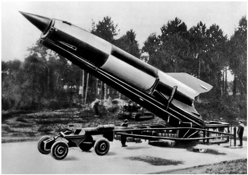
33. German V-2 rocket ready to launch. It didn’t defeat the Allies, but it kept the Germans hoping for a technological miracle until the very last days of the war.

By late 1944 Germany was losing the war and defeat was imminent... ...One reason German soldiers and civilians thought not all was lost was that they believed German scientists were about to turn the tide with so-called miracle weapons such as the V-2 rocket and jet-powered aircraft.

While the Germans were working on rockets and jets, the American Manhattan Project successfully developed atomic bombs. By the time the bomb was ready, in early August 1945, Germany had already surrendered, but Japan was fighting on.

 American generals told President Harry S. Truman that an invasion of Japan would cost the lives of a million American soldiers and would extend the war well into 1946. Truman decided to use the new bomb. Two weeks and two atom bombs later, Japan surrendered unconditionally and the war was over.
 
 It plays a major role in our defences as well. Today many Americans believe that the solution to terrorism is technological rather than political. Just give millions more to the nanotechnology industry, they believe, and the United States could send bionic spy-flies into every Afghan cave, Yemenite redoubt and North African encampment. Once that’s done, Osama Bin Laden’s heirs will not be able to make a cup of coffee without a CIA spy-fly passing this vital information back to headquarters in Langley.
 
Is it wise to develop bionic flies and thought-reading scanners? Not necessarily. Be that as it may, as you read these lines, the US Department of Defense is transferring millions of dollars to nanotechnology and brain laboratories for work on these and other such ideas.

 Most empires did not rise thanks to technological wizardry, and their rulers did not give much thought to technological improvement. The Arabs did not defeat the Sassanid Empire thanks to superior bows or swords, the Seljuks had no technological advantage over the Byzantines, and the Mongols did not conquer China with the help of some ingenious new weapon. In fact, in all these cases the vanquished enjoyed superior military and civilian technology. The Roman army is a particularly good example. It was the best army of its day, yet technologically speaking, Rome had no edge over Carthage, Macedonia or the Seleucid Empire. Its advantage rested on efficient organisation, iron discipline and huge manpower reserves.
 
 Now imagine what would happen to a general from a few centuries back – say Napoleon – if he led his troops against a modern armoured brigade. Napoleon was a brilliant tactician, and his men were crack professionals, but their skills would be useless in the face of modern weaponry.
 
 The most important military invention in the history of China was gunpowder. Yet to the best of our knowledge, gunpowder was invented accidentally, by Daoist alchemists searching for the elixir of life.
 
 no emperor set up a medieval Manhattan Project to save the empire by inventing a doomsday weapon. Only in the fifteenth century – about 600 years after the invention of gunpowder – did cannons become a decisive factor on Afro-Asian battlefields.
 
 Why did it take so long for the deadly potential of this substance to be put to military use? Because it appeared at a time when neither kings, scholars, nor merchants thought that new military technology could save them or make them rich.
 
 Napoleon himself, despite being an artilleryman, had little interest in new weapons, even though scientists and inventors tried to persuade him to fund the development of flying machines, submarines and rockets.

Science, industry and military technology intertwined only with the advent of the capitalist system and the Industrial Revolution. Once this relationship was established, however, it quickly transformed the world.

#### The Ideal of Progress

Until the Scientific Revolution most human cultures did not believe in progress. They thought the golden age was in the past, and that the world was stagnant, if not deteriorating.

 If even Muhammad, Jesus, Buddha and Confucius – who knew everything there is to know – were unable to abolish famine, disease, poverty and war from the world, how could we expect to do so?
 
the notion that humankind could do so by discovering new knowledge and inventing new tools was worse than ludicrous – it was hubris.

 As science began to solve one unsolvable problem after another, many became convinced that humankind could overcome any and every problem by acquiring and applying new knowledge.
 

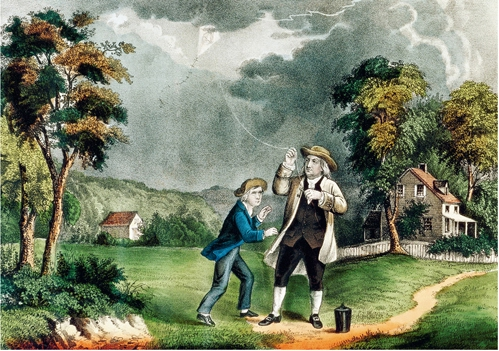
 34. Benjamin Franklin disarming the gods.

 Benjamin Franklin flew a kite during a lightning storm to test the hypothesis that lightning is simply an electric current. Franklins empirical observations, coupled with his knowledge about the qualities of electrical energy, enabled him to invent the lightning rod and disarm the gods.
 
 Jesus defended her, saying that ‘The poor you will always have with you, and you can help them any time you want. But you will not always have me’ (Mark 14:7). Today, fewer and fewer people, including fewer and fewer Christians, agree with Jesus on this matter. Poverty is increasingly seen as a technical problem amenable to intervention. 
  
It’s common wisdom that policies based on the latest findings in agronomy, economics, medicine and sociology can eliminate poverty.

two kinds of poverty: social poverty, which withholds from some people the opportunities available to others; and biological poverty, which puts the very lives of individuals at risk due to lack of food and shelter. Perhaps social poverty can never be eradicated, but in many countries around the world biological poverty is a thing of the past.

 Natural disasters and man-made calamities often plunged entire populations over the abyss, causing the death of millions. Today most of the world’s people have a safety net stretched below them.
 
in most countries nobody is starving to death. In fact, in many societies more people are in danger of dying from obesity than from starvation

#### The Gilgamesh Project

Of all mankind’s ostensibly insoluble problems, one has remained the most vexing, interesting and important: the problem of death itself. Before the late modern era, most religions and ideologies took it for granted that death was our inevitable fate. Moreover, most faiths turned death into the main source of meaning in life. 

Try to imagine Islam, Christianity or the ancient Egyptian religion in a world without death. These creeds taught people that they must come to terms with death and pin their hopes on the afterlife, rather than seek to overcome death and live for ever here on earth.

For men of science, death is not an inevitable destiny, but merely a technical problem. People die not because the gods decreed it, but due to various technical failures – a heart attack, cancer, an infection.

 And every technical problem has a technical solution... ...True, at present we cannot solve all technical problems. But we are working on them. Our best minds are not wasting their time trying to give meaning to death. Instead, they are busy investigating the physiological, hormonal and genetic systems responsible for disease and old age.
 
We’re now at a point, however, where we can be frank about it. The leading project of the Scientific Revolution is to give humankind eternal life. Even if killing death seems a distant goal, we have already achieved things that were inconceivable a few centuries ago. 

In 1199, King Richard the Lionheart was struck by an arrow in his left shoulder. Today we’d say he incurred a minor injury. But in 1199, in the absence of antibiotics and effective sterilisation methods, this minor flesh wound turned infected and gangrene set in. The only way to stop the spread of gangrene in twelfth-century Europe was to cut off the infected limb, impossible when the infection was in a shoulder. The gangrene spread through the Lionheart’s body and no one could help the king. He died in great agony two weeks later. As recently as the nineteenth century, the best doctors still did not know how to prevent infection and stop the putrefaction of tissues. In field hospitals doctors routinely cut off the hands and legs of soldiers who received even minor limb injuries, fearing gangrene. 

These amputations, as well as all other medical procedures (such as tooth extraction), were done without any anaesthetics.

 Before the advent of chloroform, four soldiers had to hold down a wounded comrade while the doctor sawed off the injured limb. 
 
On the morning after the battle of Waterloo (1815), heaps of sawn-off hands and legs could be seen adjacent to the field hospitals. In those days, carpenters and butchers who enlisted to the army were often sent to serve in the medical corps, because surgery required little more than knowing your way with knives and saws.
 
 Pills, injections and sophisticated operations save us from a spate of illnesses and injuries that once dealt an inescapable death sentence. They also protect us against countless daily aches and ailments, which premodern people simply accepted as part of life.

Death suffered its worst setbacks in the arena of child mortality. Until the twentieth century, between a quarter and a third of the children of agricultural societies never reached adulthood. Most succumbed to childhood diseases such as diphtheria, measles and smallpox. In seventeenth-century England, 150 out of every 1,000 newborns died during their first year, and a third of all children were dead before they reached fifteen. Today, only five out of 1,000 English babies die during their first year, and only seven out of 1,000 die before age fifteen.

The youngest, Edward, was the first of the boys to survive the dangerous years of childhood, and at his fathers death he ascended the English throne as King Edward II. In other words, it took Eleanor sixteen tries to carry out the most fundamental mission of an English queen – to provide her husband with a male heir. Edward II’s mother must have been a woman of exceptional patience and fortitude. Not so the woman Edward chose for his wife, Isabella of France. She had him murdered when he was forty-three. To the best of our knowledge, Eleanor and Edward I were a healthy couple and passed no fatal hereditary illnesses on to their children. Nevertheless, ten out of the sixteen – 62 per cent – died during childhood. Only six managed to live beyond the age of eleven, and only three – just 18 per cent – lived beyond the age of forty. In addition to these births, Eleanor most likely had a number of pregnancies that ended in miscarriage. On average, Edward and Eleanor lost a child every three years, ten children one after another. It’s nearly impossible for a parent today to imagine such loss.

 A few serious scholars suggest that by 2050, some humans will become a-mortal (not immortal, because they could still die of some accident, but a-mortal, meaning that in the absence of fatal trauma their lives could be extended indefinitely).
 
 most late-modern religions and ideologies have already taken death and the afterlife out of the equation. Until the eighteenth century, religions considered death and its aftermath central to the meaning of life. Beginning in the eighteenth century, religions and ideologies such as liberalism, socialism and feminism lost all interest in the afterlife.
 
The only modern ideology that still awards death a central role is nationalism. In its more poetic and desperate moments, nationalism promises that whoever dies for the nation will forever live in its collective memory.

#### The Sugar Daddy of Science

science is not an enterprise that takes place on some superior moral or spiritual plane above the rest of human activity. Like all other parts of our culture, it is shaped by economic, political and religious interests.

Science is a very expensive affair. A biologist seeking to understand the human immune system requires laboratories, test tubes, chemicals and electron microscopes, not to mention lab assistants, electricians, plumbers and cleaners. An economist seeking to model credit markets must buy computers, set up giant databanks and develop complicated data-processing programs. An archaeologist who wishes to understand the behaviour of archaic hunter-gatherers must travel to distant lands, excavate ancient ruins and date fossilised bones and artefacts. All of this costs money.

 If these particular geniuses had never been born, their insights would probably have occurred to others. But if the proper funding were unavailable, no intellectual brilliance could have compensated for that.
 
If Darwin had never been born, for example, we’d today attribute the theory of evolution to Alfred Russel Wallace, who came up with the idea of evolution via natural selection independently of Darwin and just a few years later.

In academic circles, many are naïve enough to believe in pure science. They believe that government and business altruistically give them money to pursue whatever research projects strike their fancy. But this hardly describes the realities of science funding. Most scientific studies are funded because somebody believes they can help attain some political, economic or religious goal.

Scientists themselves are not always aware of the political, economic and religious interests that control the flow of money

To channel limited resources we must answer questions such as ‘What is more important?’ and ‘What is good?’ And these are not scientific questions. Science can explain what exists in the world, how things work, and what might be in the future.

Science is unable to set its own priorities. It is also incapable of determining what to do with its discoveries.

from a purely scientific viewpoint it is unclear what we should do with our increasing understanding of genetics. Should we use this knowledge to cure cancer, to create a race of genetically engineered supermen, or to engineer dairy cows with super-sized udders? It is obvious that a liberal government, a Communist government, a Nazi government and a capitalist business corporation would use the very same scientific discovery for completely different purposes, and there is no scientific reason to prefer one usage over others.

In short, scientific research can flourish only in alliance with some religion or ideology.

 The ideology justifies the costs of the research. In exchange, the ideology influences the scientific agenda and determines what to do with the discoveries.
 
in order to comprehend how humankind has reached Alamogordo and the moon – rather than any number of alternative destinations – it is not enough to survey the achievements of physicists, biologists and sociologists. We have to take into account the ideological, political and economic forces that shaped physics, biology and sociology, pushing them in certain directions while neglecting others. 

The feedback loop between science, empire and capital has arguably been history’s chief engine for the past 500 years.

### 15 The Marriage of Science and Empire

HOW FAR IS THE SUN FROM THE EARTH? It’s a question that intrigued many early modern astronomers, particularly after Copernicus argued that the sun, rather than the earth, is located at the centre of the universe.

Every few years, the planet Venus passes directly between the sun and the earth. The duration of the transit differs when seen from distant points on the earths surface because of the tiny difference in the angle at which the observer sees it. If several observations of the same transit were made from different continents, simple trigonometry was all it would take to calculate our exact distance from the sun. Astronomers predicted that the next Venus transits would occur in 1761 and 1769. So expeditions were sent from Europe to the four corners of the world in order to observe the transits from as many distant points as possible. In 1761 scientists observed the transit from Siberia, North America, Madagascar and South Africa. As the 1769 transit approached, the European scientific community mounted a supreme effort, and scientists were dispatched as far as northern Canada and California (which was then a wilderness). The Royal Society of London for the Improvement of Natural Knowledge concluded that this was not enough. To obtain the most accurate results it was imperative to send an astronomer all the way to the south-western Pacific Ocean. The Royal Society resolved to send an eminent astronomer, Charles Green, to Tahiti, and spared neither effort nor money. But, since it was funding such an expensive expedition, it hardly made sense to use it to make just a single astronomical observation. Green was therefore accompanied by a team of eight other scientists from several disciplines, headed by botanists Joseph Banks and Daniel Solander. The team also included artists assigned to produce drawings of the new lands, plants, animals and peoples that the scientists would no doubt encounter. Equipped with the most advanced scientific instruments that Banks and the Royal Society could buy, the expedition was placed under the command of Captain James Cook, an experienced seaman as well as an accomplished geographer and ethnographer. The expedition left England in 1768, observed the Venus transit from Tahiti in 1769, reconnoitred several Pacific islands, visited Australia and New Zealand, and returned to England in 1771. It brought back enormous quantities of astronomical, geographical, meteorological, botanical, zoological and anthropological data. Its findings made major contributions to a number of disciplines, sparked the imagination of Europeans with astonishing tales of the South Pacific, and inspired future generations of naturalists and astronomers. One of the fields that benefited from the Cook expedition was medicine. At the time, ships that set sail to distant shores knew that more than half their crew members would die on the journey. The nemesis was not angry natives, enemy warships or homesickness. It was a mysterious ailment called scurvy. Men who came down with the disease grew lethargic and depressed, and their gums and other soft tissues bled. As the disease progressed, their teeth fell out, open sores appeared and they grew feverish, jaundiced, and lost control of their limbs. Between the sixteenth and eighteenth centuries, scurvy is estimated to have claimed the lives of about 2 million sailors. No one knew what caused it, and no matter what remedy was tried, sailors continued to die in droves. The turning point came in 1747, when a British physician, James Lind, conducted a controlled experiment on sailors who suffered from the disease. He separated them into several groups and gave each group a different treatment. One of the test groups was instructed to eat citrus fruits, a common folk remedy for scurvy. The patients in this group promptly recovered. Lind did not know what the citrus fruits had that the sailors’ bodies lacked, but we now know that it is vitamin C. A typical shipboard diet at that time was notably lacking in foods that are rich in this essential nutrient. On long-range voyages sailors usually subsisted on biscuits and beef jerky, and ate almost no fruits or vegetables. The Royal Navy was not convinced by Lind’s experiments, but James Cook was. He resolved to prove the doctor right. He loaded his boat with a large quantity of sauerkraut and ordered his sailors to eat lots of fresh fruits and vegetables whenever the expedition made landfall. Cook did not lose a single sailor to scurvy. In the following decades, all the world’s navies adopted Cook’s nautical diet, and the lives of countless sailors and passengers were saved

 The discovery of an effective treatment for scurvy greatly contributed to British control of the world’s oceans and its ability to send armies to the other side of the world. Cook claimed for Britain many of the islands and lands he ‘discovered’, most notably Australia. The Cook expedition laid the foundation for the British occupation of the south-western Pacific Ocean; for the conquest of Australia, Tasmania and New Zealand; for the settlement of millions of Europeans in the new colonies; and for the extermination of their native cultures and most of their native populations.

 The native population dropped by up to 90 per cent and the survivors were subjected to a harsh regime of racial oppression. For the Aborigines of Australia and the Maoris of New Zealand, the Cook expedition was the beginning of a catastrophe from which they have never recovered.
 
An even worse fate befell the natives of Tasmania. Having survived for 10,000 years in splendid isolation, they were completely wiped out, to the last man, woman and child, within a century of Cook’s arrival. European settlers first drove them off the richest parts of the island, and then, coveting even the remaining wilderness, hunted them down and killed them systematically. The few survivors were hounded into an evangelical concentration camp, where well-meaning but not particularly open-minded missionaries tried to indoctrinate them in the ways of the modern world. The Tasmanians were instructed in reading and writing, Christianity and various ‘productive skills’ such as sewing clothes and farming. But they refused to learn. They became ever more melancholic, stopped having children, lost all interest in life, and finally chose the only escape route from the modern world of science and progress – death.

Was Cook’s ship a scientific expedition protected by a military force or a military expedition with a few scientists tagging along? That’s like asking whether your petrol tank is half empty or half full. It was both. 

The Scientific Revolution and modern imperialism were inseparable. People such as Captain James Cook and the botanist Joseph Banks could hardly distinguish science from empire.

#### Why Europe?

 Not long before Cook’s expedition, the British Isles and western Europe in general were but distant backwaters of the Mediterranean world. Little of importance ever happened there. Even the Roman Empire – the only important premodern European empire – derived most of its wealth from its North African, Balkan and Middle Eastern provinces. Rome’s western European provinces were a poor Wild West, which contributed little aside from minerals and slaves. 
 
Northern Europe was so desolate and barbarous that it wasn’t even worth conquering.

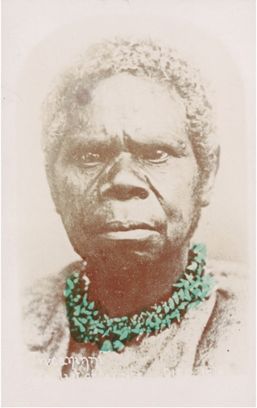
35. Truganini, the last native Tasmanian.

In 1775 Asia accounted for 80 per cent of the world economy.

The combined economies of India and China alone represented two-thirds of global production. In comparison, Europe was an economic dwarf.

The global centre of power shifted to Europe only between 1750 and 1850, when Europeans humiliated the Asian powers in a series of wars and conquered large parts of Asia.

In 1950 western Europe and the United States together accounted for more than half of global production, whereas Chinas portion had been reduced to 5 per cent. Under the European aegis a new global order and global culture emerged. 

Today all humans are, to a much greater extent than they usually want to admit, European in dress, thought and taste.

How did the people of this frigid finger of Eurasia manage to break out of their remote corner of the globe and conquer the entire world? Europe’s scientists are often given much of the credit. It’s unquestionable that from 1850 onward European domination rested to a large extent on the military–industrial–scientific complex and technological wizardry.

In 1770, James Cook certainly had far better technology than the Australian Aborigines, but so did the Chinese and the Ottomans. Why then was Australia explored and colonised by Captain James Cook and not by Captain Wan Zhengse or Captain Hussein Pasha? More importantly, if in 1770 Europeans had no significant technological advantage over Muslims, Indians and Chinese, how did they manage in the following century to open such a gap between themselves and the rest of the world? Why did the military-industrial-scientific complex blossom in Europe rather than India? When Britain leaped forward, why were France, Germany and the United States quick to follow, whereas China lagged behind?

In 1880, the West boasted more than 350,000 kilometres of railroads, whereas in the rest of the world there were but 35,000 kilometres of train lines (and most of these were laid by the British in India)
 
The Chinese and Persians did not lack technological inventions such as steam engines (which could be freely copied or bought). They lacked the values, myths, judicial apparatus and sociopolitical structures that took centuries to form and mature in the West and which could not be copied and internalised rapidly.

The apparent equality between Europe, China and the Muslim world in 1750 was a mirage. Imagine two builders, each busy constructing very tall towers. One builder uses wood and mud bricks, whereas the other uses steel and concrete. At first it seems that there is not much of a difference between the two methods, since both towers grow at a similar pace and reach a similar height. However, once a critical threshold is crossed, the wood and mud tower cannot stand the strain and collapses, whereas the steel and concrete tower grows storey by storey, as far as the eye can see.

it is hardly coincidental that science and capitalism form the most important legacy that European imperialism has bequeathed the post-European world of the twenty-first century. Europe and Europeans no longer rule the world, but science and capital are growing ever stronger

#### The Mentality of Conquest

Modern science flourished in and thanks to European empires. The discipline obviously owes a huge debt to ancient scientific traditions, such as those of classical Greece, China, India and Islam, yet its unique character began to take shape only in the early modern period, hand in hand with the imperial expansion of Spain, Portugal, Britain, France, Russia and the Netherlands.

The Far East and the Islamic world produced minds as intelligent and curious as those of Europe. However, between 1500 and 1950 they did not produce anything that comes even close to Newtonian physics or Darwinian biology.

modern science began as a European speciality, but is today becoming a multi-ethnic enterprise.

What forged the historical bond between modern science and European imperialism? Technology was an important factor in the nineteenth and twentieth centuries, but in the early modern era it was of limited importance. The key factor was that the plant-seeking botanist and the colony-seeking naval officer shared a similar mindset. Both scientist and conqueror began by admitting ignorance – they both said, ‘I don’t know what’s out there.’ They both felt compelled to go out and make new discoveries. And they both hoped the new knowledge thus acquired would make them masters of the world.

European imperialism was entirely unlike all other imperial projects in history. Previous seekers of empire tended to assume that they already understood the world. Conquest merely utilised and spread their view of the world... ...In contrast, European imperialists set out to distant shores in the hope of obtaining new knowledge along with new territories.

When Napoleon invaded Egypt in 1798, he took 165 scholars with him. Among other things, they founded an entirely new discipline, Egyptology, and made important contributions to the study of religion, linguistics and botany.

In 1831, the Royal Navy sent the ship HMS Beagle to map the coasts of South America, the Falklands Islands and the Galapagos Islands. The navy needed this knowledge in order to be better prepared in the event of war. The ship’s captain, who was an amateur scientist, decided to add a geologist to the expedition to study geological formations they might encounter on the way. After several professional geologists refused his invitation, the captain offered the job to a twenty-two-year-old Cambridge graduate, Charles Darwin. Darwin had studied to become an Anglican parson but was far more interested in geology and natural sciences than in the Bible. He jumped at the opportunity, and the rest is history. The captain spent his time on the voyage drawing military maps while Darwin collected the empirical data and formulated the insights that would eventually become the theory of evolution.

#### Empty Maps

During the fifteenth and sixteenth centuries, Europeans began to draw world maps with lots of empty spaces – one indication of the development of the scientific mindset, as well as of the European imperial drive. The empty maps were a psychological and ideological breakthrough, a clear admission that Europeans were ignorant of large parts of the world.

The crucial turning point came in 1492, when Christopher Columbus sailed westward from Spain, seeking a new route to East Asia. Columbus still believed in the old ‘complete’ world maps. Using them, Columbus calculated that Japan should have been located about 7,000 kilometres west of Spain. In fact, more than 20,000 kilometres and an entire unknown continent separate East Asia from Spain. On 12 October 1492, at about 2:00 a.m., Columbus’ expedition collided with the unknown continent. Juan Rodriguez Bermejo, watching from the mast of the ship Pinta, spotted an island in what we now call the Bahamas, and shouted ‘Land! Land!’ Columbus believed he had reached a small island off the East Asian coast. He called the people he found there ‘Indians’ because he thought he had landed in the Indies – what we now call the East Indies or the Indonesian archipelago. Columbus stuck to this error for the rest of his life. The idea that he had discovered a completely unknown continent was inconceivable for him and for many of his generation. For thousands of years, not only the greatest thinkers and scholars but also the infallible Scriptures had known only Europe, Africa and Asia. Could they all have been wrong? Could the Bible have missed half the world? It would be as if in 1969, on its way to the moon, Apollo 11 had crashed into a hitherto unknown moon circling the earth, which all previous observations had somehow failed to spot.

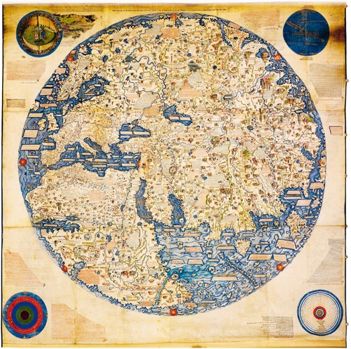
36. A European world map from 1459 (Europe is in the top left corner). The map is filled with details, even when depicting areas that were completely unfamiliar to Europeans, such as southern Africa.

The first modern man was Amerigo Vespucci, an Italian sailor who took part in several expeditions to America in the years 1499–1504. Between 1502 and 1504, two texts describing these expeditions were published in Europe. They were attributed to Vespucci. These texts argued that the new lands discovered by Columbus were not islands off the East Asian coast, but rather an entire continent unknown to the Scriptures, classical geographers and contemporary Europeans. In 1507, convinced by these arguments, a respected mapmaker named Martin Waldseemüller published an updated world map, the first to show the place where Europe’s westward-sailing fleets had landed as a separate continent. Having drawn it, Waldseemüller had to give it a name. Erroneously believing that Amerigo Vespucci had been the person who discovered it, Waldseemüller named the continent in his honour – America. The Waldseemüller map became very popular and was copied by many other cartographers, spreading the name he had given the new land. 

There is poetic justice in the fact that a quarter of the world, and two of its seven continents, are named after a little-known Italian whose sole claim to fame is that he had the courage to say, ‘We don’t know.’

The discovery of America was the foundational event of the Scientific Revolution. It not only taught Europeans to favour present observations over past traditions, but the desire to conquer America also obliged Europeans to search for new knowledge at breakneck speed.

The European imperial expeditions transformed the history of the world: from being a series of histories of isolated peoples and cultures, it became the history of a single integrated human society.

37. The Salviati World Map, 1525. While the 1459 world map is full of continents, islands and detailed explanations, the Salviati map is mostly empty. The eye wanders south along the American coastline, until it peters into emptiness. Anyone looking at the map and possessing even minimal curiosity is tempted to ask, ‘What’s beyond this point?’ The map gives no answers. It invites the observer to set sail and find out.
 
Throughout history most human societies were so busy with local conflicts and neighbourhood quarrels that they never considered exploring and conquering distant lands. Most great empires extended their control only over their immediate neighbourhood
 
the Romans conquered Etruria in order to defend Rome (c.350–300 BC). They then conquered the Po Valley in order to defend Etruria (c.200 BC). They subsequently conquered Provence to defend the Po Valley (c.120 BC), Gaul to defend Provence (c.50 BC), and Britain in order to defend Gaul (c. AD 50). It took them 400 years to get from Rome to London. In 350 BC, no Roman would have conceived of sailing directly to Britain and conquering it.
 
 The campaigns of Alexander the Great, for example, did not result in the establishment of a new empire, but rather in the usurpation of an existing empire – that of the Persians.
 
Many scholars argue that the voyages of Admiral Zheng He of the Chinese Ming dynasty heralded and eclipsed the European voyages of discovery. Between 1405 and 1433, Zheng led seven huge armadas from China to the far reaches of the Indian Ocean. The largest of these comprised almost 300 ships and carried close to 30,000 people.7 They visited Indonesia, Sri Lanka, India, the Persian Gulf, the Red Sea and East Africa. Chinese ships anchored in Jedda, the main harbour of the Hejaz, and in Malindi, on the Kenyan coast. Columbus’ fleet of 1492 – which consisted of three small ships manned by 120 sailors – was like a trio of mosquitoes compared to Zheng He’s drove of dragons.

Zheng He explored the oceans, and assisted pro-Chinese rulers, but he did not try to conquer or colonise the countries he visited.
 
The Zheng He expeditions prove that Europe did not enjoy an outstanding technological edge. What made Europeans exceptional was their unparalleled and insatiable ambition to explore and conquer.

 Although they might have had the ability, the Romans never attempted to conquer India or Scandinavia, the Persians never attempted to conquer Madagascar or Spain, and the Chinese never attempted to conquer Indonesia or Africa. Most Chinese rulers left even nearby Japan to its own devices. There was nothing peculiar about that. The oddity is that early modern Europeans caught a fever that drove them to sail to distant and completely unknown lands full of alien cultures, take one step on to their beaches, and immediately declare, ‘I claim all these territories for my king!’

38. Zheng He’s flagship next to that of Columbus.

#### Invasion from Outer Space

 The previous rulers of Central America – the Aztecs, the Toltecs, the Maya – barely knew South America existed, and never made any attempt to subjugate it, over the course of 2,000 years. Yet within little more than ten years of the Spanish conquest of Mexico, Francisco Pizarro had discovered the Inca Empire in South America, vanquishing it in 1532.
 
 Within twenty years, almost the entire native Caribbean population was wiped out. The Spanish colonists began importing African slaves to fill the vacuum.
 
When Cortés and his men landed on the sunny beaches of today’s Vera Cruz, it was the first time the Aztecs encountered a completely unknown people.
The Aztecs did not know how to react. They had trouble deciding what these strangers were. Unlike all known humans, the aliens had white skins. They also had lots of facial hair. Some had hair the colour of the sun. They stank horribly. (Native hygiene was far better than Spanish hygiene. 

When the Spaniards first arrived in Mexico, natives bearing incense burners were assigned to accompany them wherever they went. The Spaniards thought it was a mark of divine honour. We know from native sources that they found the newcomers’ smell unbearable.)

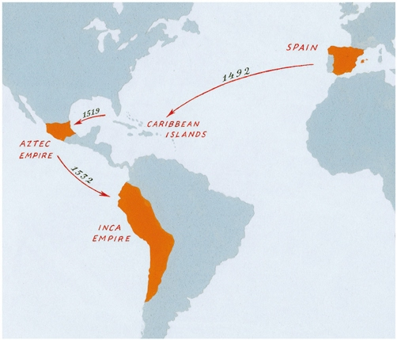
Map 7. The Aztec and Inca empires at the time of the Spanish conquest.

The aliens’ material culture was even more bewildering. They came in giant ships, the like of which the Aztecs had never imagined, let alone seen. They rode on the back of huge and terrifying animals, swift as the wind. They could produce lightning and thunder out of shiny metal sticks. They had flashing long swords and impenetrable armour, against which the natives’ wooden swords and flint spears were useless. Some Aztecs thought these must be gods.

They saw no reason to rush. After all, Cortés had no more than 550 Spaniards with him. What could 550 men do to an empire of millions?
 
For the modern European conqueror, like the modern European scientist, plunging into the unknown was exhilarating.
 
We come in peace. Take us to your leader.’ Cortés explained that he was a peaceful emissary from the great king of Spain, and asked for a diplomatic interview with the Aztec ruler, Montezuma II. (This was a shameless lie. Cortés led an independent expedition of greedy adventurers. The king of Spain had never heard of Cortés, nor of the Aztecs.) Cortés was given guides, food and some military assistance by local enemies of the Aztecs. He then marched towards the Aztec capital, the great metropolis of Tenochtitlan.

The Aztecs allowed the aliens to march all the way to the capital, then respectfully led the aliens’ leader to meet Emperor Montezuma. In the middle of the interview, Cortés gave a signal, and steel-armed Spaniards butchered Montezuma’s bodyguards (who were armed only with wooden clubs, and stone blades). The honoured guest took his host prisoner. Cortés was now in a very delicate situation. He had captured the emperor, but was surrounded by tens of thousands of furious enemy warriors, millions of hostile civilians, and an entire continent about which he knew practically nothing. He had at his disposal only a few hundred Spaniards, and the closest Spanish reinforcements were in Cuba, more than 1,500 kilometres away.

Cortés kept Montezuma captive in the palace, making it look as if the king remained free and in charge and as if the ‘Spanish ambassador’ were no more than a guest. The Aztec Empire was an extremely centralised polity, and this unprecedented situation paralysed it. Montezuma continued to behave as if he ruled the empire, and the Aztec elite continued to obey him, which meant they obeyed Cortés.

The Aztec elite eventually revolted against Cortés and Montezuma, elected a new emperor, and drove the Spaniards from Tenochtitlan. However, by now numerous cracks had appeared in the imperial edifice. Cortés used the knowledge he had gained to prise the cracks open wider and split the empire from within. He convinced many of the empire’s subject peoples to join him against the ruling Aztec elite. The subject peoples miscalculated badly. They hated the Aztecs, but knew nothing of Spain or the Caribbean genocide. They assumed that with Spanish help they could shake off the Aztec yoke. The idea that the Spanish would take over never occurred to them. They were sure that if Cortés and his few hundred henchmen caused any trouble, they could easily be overwhelmed. The rebellious peoples provided Cortés with an army of tens of thousands of local troops, and with its help Cortés besieged Tenochtitlan and conquered the city.

When the local peoples realised what was happening, it was too late. Within a century of the landing at Vera Cruz, the native population of the Americas had shrunk by about 90 per cent, due mainly to unfamiliar diseases that reached America with the invaders.
 
Ten years after Cortés landed in Mexico, Pizarro arrived on the shore of the Inca Empire. He had far fewer soldiers than Cortés – his expedition numbered just 168 men! Yet Pizarro benefited from all the knowledge and experience gained in previous invasions. The Inca, in contrast, knew nothing about the fate of the Aztecs. Pizarro plagiarised Cortés. He declared himself a peaceful emissary from the king of Spain, invited the Inca ruler, Atahualpa, to a diplomatic interview, and then kidnapped him.

If the subject peoples of the Inca Empire had known the fate of the inhabitants of Mexico, they would not have thrown in their lot with the invaders. But they did not know.

The native peoples of America were not the only ones to pay a heavy price for their parochial outlook. The great empires of Asia – the Ottoman, the Safavid, the Mughal and the Chinese – very quickly heard that the Europeans had discovered something big. Yet they displayed little interest in these discoveries.

The first non-European power that tried to send a military expedition to America was Japan. That happened in June 1942, when a Japanese expedition conquered Kiska and Attu, two small islands off the Alaskan coast, capturing in the process ten US soldiers and a dog. The Japanese never got any closer to the mainland.

For 300 years, Europeans enjoyed undisputed mastery in America and Oceania, in the Atlantic and the Pacific. The only significant struggles in those regions were between different European powers. 

The wealth and resources accumulated by the Europeans eventually enabled them to invade Asia too, defeat its empires, and divide it among themselves. When the Ottomans, Persians, Indians and Chinese woke up and began paying attention, it was too late.

Only in the twentieth century did non-European cultures adopt a truly global vision. This was one of the crucial factors that led to the collapse of European hegemony.

 Algerian guerrillas defeated a French army with an overwhelming numerical, technological and economic advantage. The Algerians prevailed because they were supported by a global anti-colonial network, and because they worked out how to harness the world’s media to their cause – as well as public opinion in France itself.
 
guerrilla forces showed that even superpowers could be defeated if a local struggle became a global cause. 

It is interesting to contemplate what might have happened had Montezuma been able to manipulate public opinion in Spain and gain assistance from one of Spain’s rivals – Portugal, France or the Ottoman Empire.

#### Rare Spiders and Forgotten Scripts

Modern science and modern empires were motivated by the restless feeling that perhaps something important awaited beyond the horizon – something they had better explore and master.

 Not just the motivation, but also the practices of empire-builders were entangled with those of scientists.
 
 building an empire was a scientific project, while setting up a scientific discipline was an imperial project.
 
On 10 April 1802 the Great Survey of India was launched. It lasted sixty years. With the help of tens of thousands of native labourers, scholars and guides, the British carefully mapped the whole of India, marking borders, measuring distances, and even calculating for the first time the exact height of Mount Everest and the other Himalayan peaks.

Mohenjo-daro was one of the chief cities of the Indus Valley civilisation, which flourished in the third millennium BC and was destroyed around 1900 BC. None of India’s pre-British rulers – neither the Mauryas, nor the Guptas, nor the Delhi sultans, nor the great Mughals – had given the ruins a second glance. But a British archaeological survey took notice of the site in 1922. A British team then excavated it, and discovered the first great civilisation of India, which no Indian had been aware of.

the deciphering of cuneiform script. This was the main script used throughout the Middle East for close to 3,000 years, but the last person able to read it probably died sometime in the early first millennium AD... ...Cuneiform came to the attention of Europeans in 1618, when the Spanish ambassador in Persia went sightseeing in the ruins of ancient Persepolis, where he saw inscriptions that nobody could explain to him... ...In 1657 European scholars published the first transcription of a cuneiform text from Persepolis. More and more transcriptions followed, and for close to two centuries scholars in the West tried to decipher them. None succeeded. In the 1830s, a British officer named Henry Rawlinson was sent to Persia to help the shah train his army in the European style. In his spare time Rawlinson travelled around Persia and one day he was led by local guides to a cliff in the Zagros Mountains and shown the huge Behistun Inscription. About fifteen metres high and twenty-five metres wide, it had been etched high up on the cliff face on the command of King Darius I sometime around 500 BC. It was written in cuneiform script in three languages: Old Persian, Elamite and Babylonian. The inscription was well known to the local population, but nobody could read it... ...The first step in deciphering the lettering was to produce an accurate transcription that could be sent back to Europe. Rawlinson defied death to do so, scaling the steep cliff to copy the strange letters... ...In 1847 the project was completed, and a full and accurate copy was sent to Europe... ...An understanding of the Old Persian section gave him the key he needed to unlock the secrets of the Elamite and Babylonian sections. The great door swung open, and out came a rush of ancient but lively voices – the bustle of Sumerian bazaars, the proclamations of Assyrian kings, the arguments of Babylonian bureaucrats. Without the efforts of modern European imperialists such as Rawlinson, we would not have known much about the fate of the ancient Middle Eastern empires.

William Jones. Jones arrived in India in September 1783 to serve as a judge in the Supreme Court of Bengal... ...In his publications Jones pointed out surprising similarities between Sanskrit, an ancient Indian language that became the sacred tongue of Hindu ritual, and the Greek and Latin languages, as well as similarities between all these languages and Gothic, Celtic, Old Persian, German, French and English. Thus in Sanskrit, ‘mother’ is ‘matar’, in Latin it is ‘mater’, and in Old Celtic it is ‘mathir’. Jones surmised that all these languages must share a common origin, developing from a now-forgotten ancient ancestor. He was thus the first to identify what later came to be called the Indo-European family of languages.

The European empires believed that in order to govern effectively they must know the languages and cultures of their subjects. British officers arriving in India were supposed to spend up to three years in a Calcutta college, where they studied Hindu and Muslim law alongside English law; Sanskrit, Urdu and Persian alongside Greek and Latin; and Tamil, Bengali and Hindustani culture alongside mathematics, economics and geography. The study of linguistics provided invaluable help in understanding the structure and grammar of local languages.

Yet these practical advantages were not the only reason why empires financed the study of linguistics, botany, geography and history. No less important was the fact that science gave the empires ideological justification. Modern Europeans came to believe that acquiring new knowledge was always good. The fact that the empires produced a constant stream of new knowledge branded them as progressive and positive enterprises.

Histories of botany have little to say about the suffering of the Aboriginal Australians, but they usually find some kind words for James Cook and Joseph Banks.
 
The British conquered Bengal, the richest province of India, in 1764. The new rulers were interested in little except enriching themselves. They adopted a disastrous economic policy that a few years later led to the outbreak of the Great Bengal Famine. It began in 1769, reached catastrophic levels in 1770, and lasted until 1773. About 10 million Bengalis, a third of the province’s population, died in the calamity.

 The European empires did so many different things on such a large scale, that you can find plenty of examples to support whatever you want to say about them. You think that these empires were evil monstrosities that spread death, oppression and injustice around the world? You could easily fill an encyclopedia with their crimes. You want to argue that they in fact improved the conditions of their subjects with new medicines, better economic conditions and greater security? You could fill another encyclopedia with their achievements. 
 
Due to their close cooperation with science, these empires wielded so much power and changed the world to such an extent that perhaps they cannot be simply labelled as good or evil.

After William Jones argued that all Indo-European languages descend from a single ancient language many scholars were eager to discover who the speakers of that language had been. They noticed that the earliest Sanskrit speakers, who had invaded India from Central Asia more than 3,000 years ago, had called themselves Arya. The speakers of the earliest Persian language called themselves Airiia. European scholars consequently surmised that the people who spoke the primordial language that gave birth to both Sanskrit and Persian (as well as to Greek, Latin, Gothic and Celtic) must have called themselves Aryans. Could it be a coincidence that those who founded the magnificent Indian, Persian, Greek and Roman civilisations were all Aryans? Next, British, French and German scholars wedded the linguistic theory about the industrious Aryans to Darwin’s theory of natural selection and posited that the Aryans were not just a linguistic group but a biological entity – a race. And not just any race, but a master race of tall, light-haired, blue-eyed, hard-working, and super-rational humans who emerged from the mists of the north to lay the foundations of culture throughout the world. Regrettably, the Aryans who invaded India and Persia intermarried with the local natives they found in these lands, losing their light complexions and blond hair, and with them their rationality and diligence. The civilisations of India and Persia consequently declined. In Europe, on the other hand, the Aryans preserved their racial purity. This is why Europeans had managed to conquer the world, and why they were fit to rule it – provided they took precautions not to mix with inferior races.

People continue to conduct a heroic struggle against racism without noticing that the battlefront has shifted, and that the place of racism in imperial ideology has now been replaced by ‘culturism’.

We no longer say, ‘It’s in their blood.’ We say, ‘It’s in their culture.’

the French Front National, the Dutch Party for Freedom, the Alliance for the Future of Austria and their like tend to argue that Western culture, as it has evolved in Europe, is characterised by democratic values, tolerance and gender equality, whereas Muslim culture, which evolved in the Middle East, is characterised by hierarchical politics, fanaticism and misogyny. Since the two cultures are so different, and since many Muslim immigrants are unwilling (and perhaps unable) to adopt Western values, they should not be allowed to enter, lest they foment internal conflicts and corrode European democracy and liberalism.

whereas biologists today have an easy time disavowing racism, simply explaining that the biological differences between present-day human populations are trivial, it is harder for historians and anthropologists to disavow culturism.

Without imperial support, it is doubtful whether modern science would have progressed very far. There are very few scientific disciplines that did not begin their lives as servants to imperial growth and that do not owe a large proportion of their discoveries, collections, buildings and scholarships to the generous help of army officers, navy captains and imperial governors.

Science was supported by other institutions, not just by empires. And the European empires rose and flourished thanks also to factors other than science. 

Behind the meteoric rise of both science and empire lurks one particularly important force: capitalism. Were it not for businessmen seeking to make money, Columbus would not have reached America, James Cook would not have reached Australia, and Neil Armstrong would never have taken that small step on the surface of the moon.

### 16 The Capitalist Creed

is money the ultimate goal of these undertakings, or perhaps just a dangerous necessity?

To understand modern economic history, you really need to understand just a single word. The word is growth.

In 1500, global production of goods and services was equal to about $250 billion; today it hovers around $60 trillion. More importantly, in 1500, annual per capita production averaged $550, while today every man, woman and child produces, on the average, $8,800 a year.

Samuel Greedy, a shrewd financier, founds a bank in El Dorado, California. A. A. Stone, an up-and-coming contractor in El Dorado, finishes his first big job, receiving payment in cash to the tune of $1 million. He deposits this sum in Mr Greedy’s bank. The bank now has $1 million in capital. In the meantime, Jane McDoughnut, an experienced but impecunious El Dorado chef, thinks she sees a business opportunity – there’s no really good bakery in her part of town. But she doesn’t have enough money of her own to buy a proper facility complete with industrial ovens, sinks, knives and pots. She goes to the bank, presents her business plan to Greedy, and persuades him that it’s a worthwhile investment. He issues her a $1 million loan, by crediting her account in the bank with that sum. McDoughnut now hires Stone, the contractor, to build and furnish her bakery. His price is $1,000,000. When she pays him, with a cheque drawn on her account, Stone deposits it in his account in the Greedy bank. So how much money does Stone have in his bank account? Right, $2 million. How much money, cash, is actually located in the bank’s safe? Yes, $1 million. It doesn’t stop there. As contractors are wont to do, two months into the job Stone informs McDoughnut that, due to unforeseen problems and expenses, the bill for constructing the bakery will actually be $2 million. Mrs McDoughnut is not pleased, but she can hardly stop the job in the middle. So she pays another visit to the bank, convinces Mr Greedy to give her an additional loan, and he puts another $1 million in her account. She transfers the money to the contractor’s account. How much money does Stone have in his account now? He’s got $3 million. But how much money is actually sitting in the bank? Still just $1 million. In fact, the same $1 million that’s been in the bank all along.

Current US banking law permits the bank to repeat this exercise seven more times. The contractor would eventually have $10 million in his account, even though the bank still has but $1 million in its vaults. Banks are allowed to loan $10 for every dollar they actually possess, which means that 90 per cent of all the money in our bank accounts is not covered by actual coins and notes.

It sounds like a giant Ponzi scheme, doesn’t it? But if it’s a fraud, then the entire modern economy is a fraud. The fact is, it’s not a deception, but rather a tribute to the amazing abilities of the human imagination. 

What enables banks – and the entire economy – to survive and flourish is our trust in the future.

In the bakery example, the discrepancy between the contractor’s account statement and the amount of money actually in the bank is Mrs McDoughnut’s bakery. Mr Greedy has put the bank’s money into the asset, trusting that one day it would be profitable... ...The entire enterprise is thus founded on trust in an imaginary future – the trust that the entrepreneur and the banker have in the bakery of their dreams, along with the contractor’s trust in the future solvency of the bank.

money is an astounding thing because it can represent myriad different objects and convert anything into almost anything else.

 before the modern era... ...In most cases, money could represent and convert only things that actually existed in the present.
 
Credit enables us to build the present at the expense of the future. 

It’s founded on the assumption that our future resources are sure to be far more abundant than our present resources.

If credit is such a wonderful thing, why did nobody think of it earlier? Of course they did... ...The problem in previous eras was not that no one had the idea or knew how to use it. It was that people seldom wanted to extend much credit because they didn’t trust that the future would be better than the present.

They believed that the total amount of wealth was limited, if not dwindling.

You could cut the pie in many different ways, but it never got any bigger.

That’s why many cultures concluded that making bundles of money was sinful. As Jesus said, ‘It is easier for a camel to pass through the eye of a needle than for a rich man to enter into the kingdom of God’ (Matthew 19:24). If the pie is static, and I have a big part of it, then I must have taken somebody else’s slice. The rich were obliged to do penance for their evil deeds by giving some of their surplus wealth to charity.

The Entrepreneur’s Dilemma

If the global pie stayed the same size, there was no margin for credit. Credit is the difference between today’s pie and tomorrows pie. If the pie stays the same, why extend credit? It would be an unacceptable risk unless you believed that the baker or king asking for your money might be able to steal a slice from a competitor. So it was hard to get a loan in the premodern world, and when you got one it was usually small, short-term, and subject to high interest rates. Upstart entrepreneurs thus found it difficult to open new bakeries and great kings who wanted to build palaces or wage wars had no choice but to raise the necessary funds through high taxes and tariffs.

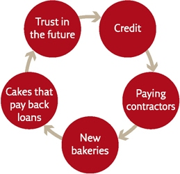
The Magic Circle of the Modern Economy

It was lose-lose. Because credit was limited, people had trouble financing new businesses. Because there were few new businesses, the economy did not grow. Because it did not grow, people assumed it never would, and those who had capital were wary of extending credit. The expectation of stagnation fulfilled itself.

#### A Growing Pie

The idea of progress is built on the notion that if we admit our ignorance and invest resources in research, things can improve.

one could open a new bakery specialising in chocolate cakes and croissants without causing bakeries specialising in bread to go bust. Everybody would simply develop new tastes and eat more. I can be wealthy without your becoming poor; I can be obese without your dying of hunger. The entire global pie can grow.

the idea of progress convinced people to put more and more trust in the future. This trust created credit; credit brought real economic growth; and growth strengthened the trust in the future and opened the way for even more credit.

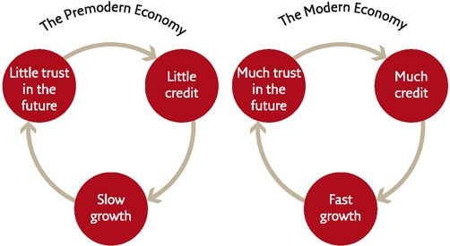
The Economic History of the World in a Nutshell

In 1776 the Scottish economist Adam Smith published The Wealth of Nations, probably the most important economics manifesto of all time... ...It follows that an increase in the profits of private entrepreneurs is the basis for the increase in collective wealth and prosperity.

Smith’s claim that the selfish human urge to increase private profits is the basis for collective wealth is one of the most revolutionary ideas in human history – revolutionary not just from an economic perspective, but even more so from a moral and political perspective.

 greed is good, and that by becoming richer I benefit everybody, not just myself. Egoism is altruism.
 
 Smith denied the traditional contradiction between wealth and morality, and threw open the gates of heaven for the rich. Being rich meant being moral. In Smiths story, people become rich not by despoiling their neighbours, but by increasing the overall size of the pie. And when the pie grows, everyone benefits.
 
All this depends, however, on the rich using their profits to open new factories and hire new employees, rather than wasting them on non-productive activities... ...A crucial part of the modern capitalist economy was the emergence of a new ethic, according to which profits ought to be reinvested in production. This brings about more profits, which are again reinvested in production, which brings more profits, et cetera ad infinitum.

In the new capitalist creed, the first and most sacred commandment is: ‘The profits of production must be reinvested in increasing production.’

why capitalism is called ‘capitalism’. Capitalism distinguishes ‘capital’ from mere ‘wealth’. Capital consists of money, goods and resources that are invested in production. Wealth, on the other hand, is buried in the ground or wasted on unproductive activities.

The idea that ‘The profits of production must be reinvested in increasing production’ sounds trivial. Yet it was alien to most people throughout history. In premodern times, people believed that production was more or less constant. So why reinvest your profits if production won’t increase by much, no matter what you do? Thus medieval noblemen espoused an ethic of generosity and conspicuous consumption.

Premodern economy vs Modern economy

In the modern era, the nobility has been overtaken by a new elite whose members are true believers in the capitalist creed. The new capitalist elite is made up not of dukes and marquises, but of board chairmen, stock traders and industrialists.

The typical venture capitalist rushes from one business meeting to another, trying to figure out where to invest his capital and following the ups and downs of the stocks and bonds he owns. True, his suits might be Versace and he might get to travel in a private jet, but these expenses are nothing compared to what he invests in increasing human production.

 Governments too strive to invest their tax revenues in productive enterprises that will increase future income – for example, building a new port could make it easier for factories to export their products, enabling them to make more taxable income, thereby increasing the government’s future revenues. Another government might prefer to invest in education, on the grounds that educated people form the basis for the lucrative high-tech industries, which pay lots of taxes without needing extensive port facilities.
 
capitalism gradually became far more than just an economic doctrine. It now encompasses an ethic – a set of teachings about how people should behave, educate their children and even think. Its principal tenet is that economic growth is the supreme good, or at least a proxy for the supreme good, because justice, freedom and even happiness all depend on economic growth.

This new religion has had a decisive influence on the development of modern science, too. Scientific research is usually funded by either governments or private businesses. When capitalist governments and businesses consider investing in a particular scientific project, the first questions are usually, ‘Will this project enable us to increase production and profits? Will it produce economic growth?’ A project that can’t clear these hurdles has little chance of finding a sponsor. No history of modern science can leave capitalism out of the picture.

Capitalisms belief in perpetual economic growth flies in the face of almost everything we know about the universe.

 A society of wolves would be extremely foolish to believe that the supply of sheep would keep on growing indefinitely. The human economy has nevertheless managed to grow exponentially throughout the modern era, thanks only to the fact that scientists come up with another discovery or gadget every few years – such as the continent of America, the internal combustion engine, or genetically engineered sheep.
 
Over the last few years, banks and governments have been frenziedly printing money. Everybody is terrified that the current economic crisis may stop the growth of the economy. So they are creating trillions of dollars, euros and yen out of thin air, pumping cheap credit into the system, and hoping that the scientists, technicians and engineers will manage to come up with something really big, before the bubble bursts.

If the labs do not fulfil these expectations before the bubble bursts, we are heading towards very rough times.

#### Columbus Searches for an Investor

credit was not invented in modern Europe. It existed in almost all agricultural societies, and in the early modern period the emergence of European capitalism was closely linked to economic developments in Asia.

Most non-European empires of the early modern era were established by great conquerors such as Nurhaci and Nader Shah, or by bureaucratic and military elites as in the Qing and Ottoman empires. Financing wars through taxes and plunder (without making fine distinctions between the two), they owed little to credit systems, and they cared even less about the interests of bankers and investors.
 
In Europe, on the other hand, kings and generals gradually adopted the mercantile way of thinking, until merchants and bankers became the ruling elite.

The empires built by bankers and merchants in frock coats and top hats defeated the empires built by kings and noblemen in gold clothes and shining armour

Nobody wants to pay taxes, but everyone is happy to invest.
 
As every school-child knows, Isabella hit the jackpot. Columbus’ discoveries enabled the Spaniards to conquer America, where they established gold and silver mines as well as sugar and tobacco plantations that enriched the Spanish kings, bankers and merchants beyond their wildest dreams.
 
A hundred years later, princes and bankers were willing to extend far more credit to Columbus’ successors, and they had more capital at their disposal, thanks to the treasures reaped from America. 
 
This was the magic circle of imperial capitalism: credit financed new discoveries; discoveries led to colonies; colonies provided profits; profits built trust; and trust translated into more credit.

In order to increase the number of potential investors and reduce the risk they incurred, Europeans turned to limited liability joint-stock companies. Instead of a single investor betting all his money on a single rickety ship, the joint-stock company collected money from a large number of investors, each risking only a small portion of his capital. The risks were thereby curtailed, but no cap was placed on the profits. Even a small investment in the right ship could turn you into a millionaire.

western Europe witnessed the development of a sophisticated financial system that could raise large amounts of credit on short notice and put it at the disposal of private entrepreneurs and governments. This system could finance explorations and conquests far more efficiently than any kingdom or empire.
 
The new-found power of credit can be seen in the bitter struggle between Spain and the Netherlands. In the sixteenth century, Spain was the most powerful state in Europe, holding sway over a vast global empire. It ruled much of Europe, huge chunks of North and South America, the Philippine Islands, and a string of bases along the coasts of Africa and Asia. Every year, fleets heavy with American and Asian treasures returned to the ports of Seville and Cadiz. The Netherlands was a small and windy swamp, devoid of natural resources, a small corner of the king of Spain’s dominions. 

In 1568 the Dutch, who were mainly Protestant, revolted against their Catholic Spanish overlord. At first the rebels seemed to play the role of Don Quixote, courageously tilting at invincible windmills. Yet within eighty years the Dutch had not only secured their independence from Spain, but had managed to replace the Spaniards and their Portuguese allies as masters of the ocean highways, build a global Dutch empire, and become the richest state in Europe. The secret of Dutch success was credit. The Dutch burghers, who had little taste for combat on land, hired mercenary armies to fight the Spanish for them. The Dutch themselves meanwhile took to the sea in ever-larger fleets. Mercenary armies and cannon-brandishing fleets cost a fortune, but the Dutch were able to finance their military expeditions more easily than the mighty Spanish Empire because they secured the trust of the burgeoning European financial system at a time when the Spanish king was carelessly eroding its trust in him. Financiers extended the Dutch enough credit to set up armies and fleets, and these armies and fleets gave the Dutch control of world trade routes, which in turn yielded handsome profits. The profits allowed the Dutch to repay the loans, which strengthened the trust of the financiers. Amsterdam was fast becoming not only one of the most important ports of Europe, but also the continent’s financial Mecca.

How exactly did the Dutch win the trust of the financial system? Firstly, they were sticklers about repaying their loans on time and in full, making the extension of credit less risky for lenders. Secondly, their country’s judicial system enjoyed independence and protected private rights – in particular private property rights. Capital trickles away from dictatorial states that fail to defend private individuals and their property. Instead, it flows into states upholding the rule of law and private property.

Imagine that you are the son of a solid family of German financiers. Your father sees an opportunity to expand the business by opening branches in major European cities. He sends you to Amsterdam and your younger brother to Madrid, giving you each 10,000 gold coins to invest. Your brother lends his start-up capital at interest to the king of Spain, who needs it to raise an army to fight the king of France. You decide to lend yours to a Dutch merchant, who wants to invest in scrubland on the southern end of a desolate island called Manhattan, certain that property values there will skyrocket as the Hudson River turns into a major trade artery. Both loans are to be repaid within a year. The year passes. The Dutch merchant sells the land he’s bought at a handsome markup and repays your money with the interest he promised. Your father is pleased. But your little brother in Madrid is getting nervous. The war with France ended well for the king of Spain, but he has now embroiled himself in a conflict with the Turks. He needs every penny to finance the new war, and thinks this is far more important than repaying old debts. Your brother sends letters to the palace and asks friends with connections at court to intercede, but to no avail. Not only has your brother not earned the promised interest – he’s lost the principal. Your father is not pleased. Now, to make matters worse, the king sends a treasury official to your brother to tell him, in no uncertain terms, that he expects to receive another loan of the same size, forthwith. Your brother has no money to lend. He writes home to Dad, trying to persuade him that this time the king will come through. The paterfamilias has a soft spot for his youngest, and agrees with a heavy heart. Another 10,000 gold coins disappear into the Spanish treasury, never to be seen again. Meanwhile in Amsterdam, things are looking bright. You make more and more loans to enterprising Dutch merchants, who repay them promptly and in full. But your luck does not hold indefinitely. One of your usual clients has a hunch that wooden clogs are going to be the next fashion craze in Paris, and asks you for a loan to set up a footwear emporium in the French capital. You lend him the money, but unfortunately the clogs don’t catch on with the French ladies, and the disgruntled merchant refuses to repay the loan. Your father is furious, and tells both of you it is time to unleash the lawyers. Your brother files suit in Madrid against the Spanish monarch, while you file suit in Amsterdam against the erstwhile wooden-shoe wizard. In Spain, the law courts are subservient to the king – the judges serve at his pleasure and fear punishment if they do not do his will. In the Netherlands, the courts are a separate branch of government, not dependent on the country’s burghers and princes. The court in Madrid throws out your brother’s suit, while the court in Amsterdam finds in your favour and puts a lien on the clog-merchant’s assets to force him to pay up. Your father has learned his lesson. Better to do business with merchants than with kings, and better to do it in Holland than in Madrid. And your brother’s travails are not over. The king of Spain desperately needs more money to pay his army. He’s sure that your father has cash to spare. So he brings trumped-up treason charges against your brother. If he doesn’t come up with 20,000 gold coins forthwith, he’ll get cast into a dungeon and rot there until he dies. Your father has had enough. He pays the ransom for his beloved son, but swears never to do business in Spain again. He closes his Madrid branch and relocates your brother to Rotterdam. Two branches in Holland now look like a really good idea. He hears that even Spanish capitalists are smuggling their fortunes out of their country. They, too, realise that if they want to keep their money and use it to gain more wealth, they are better off investing it where the rule of law prevails and where private property is respected – in the Netherlands, for example. In such ways did the king of Spain squander the trust of investors at the same time that Dutch merchants gained their confidence. And it was the Dutch merchants – not the Dutch state – who built the Dutch Empire. The king of Spain kept on trying to finance and maintain his conquests by raising unpopular taxes from a disgruntled populace. The Dutch merchants financed conquest by getting loans, and increasingly also by selling shares in their companies that entitled their holders to receive a portion of the company’s profits. Cautious investors who would never have given their money to the king of Spain, and who would have thought twice before extending credit to the Dutch government, happily invested fortunes in the Dutch joint-stock companies that were the mainstay of the new empire. If you thought a company was going to make a big profit but it had already sold all its shares, you could buy some from people who owned them, probably for a higher price than they originally paid. If you bought shares and later discovered that the company was in dire straits, you could try to unload your stock for a lower price. The resulting trade in company shares led to the establishment in most major European cities of stock exchanges, places where the shares of companies were traded. The most famous Dutch joint-stock company, the Vereenigde Oostindische Compagnie, or VOC for short, was chartered in 1602, just as the Dutch were throwing off Spanish rule and the boom of Spanish artillery could still be heard not far from Amsterdam’s ramparts. VOC used the money it raised from selling shares to build ships, send them to Asia, and bring back Chinese, Indian and Indonesian goods. It also financed military actions taken by company ships against competitors and pirates. Eventually VOC money financed the conquest of Indonesia. Indonesia is the world’s biggest archipelago. Its thousands upon thousands of islands were ruled in the early seventeenth century by hundreds of kingdoms, principalities, sultanates and tribes. When VOC merchants first arrived in Indonesia in 1603, their aims were strictly commercial. However, in order to secure their commercial interests and maximise the profits of the shareholders, VOC merchants began to fight against local potentates who charged inflated tariffs, as well as against European competitors. VOC armed its merchant ships with cannons; it recruited European, Japanese, Indian and Indonesian mercenaries; and it built forts and conducted full-scale battles and sieges. This enterprise may sound a little strange to us, but in the early modern age it was common for private companies to hire not only soldiers, but also generals and admirals, cannons and ships, and even entire off-the-shelf armies. The international community took this for granted and didn’t raise an eyebrow when a private company established an empire. Island after island fell to VOC mercenaries and a large part of Indonesia became a VOC colony. VOC ruled Indonesia for close to 200 years. Only in 1800 did the Dutch state assume control of Indonesia, making it a Dutch national colony for the following 150 years. Today some people warn that twenty-first-century corporations are accumulating too much power. Early modern history shows just how far that can go if businesses are allowed to pursue their self-interest unchecked. While VOC operated in the Indian Ocean, the Dutch West Indies Company, or WIC, plied the Atlantic. In order to control trade on the important Hudson River, WIC built a settlement called New Amsterdam on an island at the river’s mouth. The colony was threatened by Indians and repeatedly attacked by the British, who eventually captured it in 1664. The British changed its name to New York. The remains of the wall built by WIC to defend its colony against Indians and British are today paved over by the world’s most famous street – Wall Street.

In 1717 the Mississippi Company, chartered in France, set out to colonise the lower Mississippi valley, establishing the city of New Orleans in the process. To finance its ambitious plans, the company, which had good connections at the court of King Louis XV, sold shares on the Paris stock exchange. John Law, the company’s director, was also the governor of the central bank of France. Furthermore, the king had appointed him controller-general of finances, an office roughly equivalent to that of a modern finance minister... ...Initially, shares were offered at 500 livres apiece. On 1 August 1719, shares traded at 2,750 livres. By 30 August, they were worth 4,100 livres, and on 4 September, they reached 5,000 livres. On 2 December the price of a Mississippi share crossed the threshold of 10,000 livres. Euphoria swept the streets of Paris

39. New Amsterdam in 1660, at the tip of Manhattan Island. The settlement’s protective wall is today paved over by Wall Street.

A few days later, the panic began. Some speculators realised that the share prices were totally unrealistic and unsustainable. They figured that they had better sell while stock prices were at their peak. As the supply of shares available rose, their price declined. When other investors saw the price going down, they also wanted to get out quick. The stock price plummeted further, setting off an avalanche. In order to stabilise prices, the central bank of France – at the direction of its governor, John Law – bought up Mississippi shares, but it could not do so for ever. Eventually it ran out of money. When this happened, the controller-general of finances, the same John Law, authorised the printing of more money in order to buy additional shares. This placed the entire French financial system inside the bubble. And not even this financial wizardry could save the day. The price of Mississippi shares dropped from 10,000 livres back to 1,000 livres, and then collapsed completely, and the shares lost every sou of their worth. By now, the central bank and the royal treasury owned a huge amount of worthless stock and had no money. The big speculators emerged largely unscathed – they had sold in time. Small investors lost everything, and many committed suicide.

 This became one of the chief reasons that the overseas French Empire fell into British hands. While the British could borrow money easily and at low interest rates, France had difficulties securing loans, and had to pay high interest on them.

Reluctantly, in 1789, Louis XVI convened the Estates General, the French parliament that had not met for a century and a half, in order to find a solution to the crisis. Thus began the French Revolution.

While the French overseas empire was crumbling, the British Empire was expanding rapidly. Like the Dutch Empire before it, the British Empire was established and run largely by private joint-stock companies based in the London stock exchange.

The Indian subcontinent too was conquered not by the British state, but by the mercenary army of the British East India Company. This company outperformed even the VOC. From its headquarters in Leadenhall Street, London, it ruled a mighty Indian empire for about a century, maintaining a huge military force of up to 350,000 soldiers, considerably outnumbering the armed forces of the British monarchy.

Napoleon made fun of the British, calling them a nation of shopkeepers. Yet these shopkeepers defeated Napoleon himself, and their empire was the largest the world has ever seen.

#### In the Name of Capital

The nationalisation of Indonesia by the Dutch crown (1800) and of India by the British crown (1858) hardly ended the embrace of capitalism and empire.

Joint-stock companies no longer needed to establish and govern private colonies – their managers and large shareholders now pulled the strings of power in London, Amsterdam and Paris, and they could count on the state to look after their interests.

As Marx and other social critics quipped, Western governments were becoming a capitalist trade union.

The most notorious example of how governments did the bidding of big money was the First Opium War, fought between Britain and China (1840–42). In the first half of the nineteenth century, the British East India Company and sundry British business people made fortunes by exporting drugs, particularly opium, to China. Millions of Chinese became addicts, debilitating the country both economically and socially. In the late 1830s the Chinese government issued a ban on drug trafficking, but British drug merchants simply ignored the law. Chinese authorities began to confiscate and destroy drug cargos. The drug cartels had close connections in Westminster and Downing Street – many MPs and Cabinet ministers in fact held stock in the drug companies – so they pressured the government to take action. In 1840 Britain duly declared war on China in the name of ‘free trade’. It was a walkover. The overconfident Chinese were no match for Britain’s new wonder weapons – steamboats, heavy artillery, rockets and rapid-fire rifles. Under the subsequent peace treaty, China agreed not to constrain the activities of British drug merchants and to compensate them for damages inflicted by the Chinese police. Furthermore, the British demanded and received control of Hong Kong, which they proceeded to use as a secure base for drug trafficking (Hong Kong remained in British hands until 1997). In the late nineteenth century, about 40 million Chinese, a tenth of the country’s population, were opium addicts.

Egypt, too, learned to respect the long arm of British capitalism. During the nineteenth century, French and British investors lent huge sums to the rulers of Egypt, first in order to finance the Suez Canal project, and later to fund far less successful enterprises. Egyptian debt swelled, and European creditors increasingly meddled in Egyptian affairs. In 1881 Egyptian nationalists had had enough and rebelled. They declared a unilateral abrogation of all foreign debt. Queen Victoria was not amused. A year later she dispatched her army and navy to the Nile and Egypt remained a British protectorate until after World War Two.

 London financiers saw an opportunity as well. They proposed to the rebel leaders the issue of tradable Greek Rebellion Bonds on the London stock exchange. The Greeks would promise to repay the bonds, plus interest, if and when they won their independence. Private investors bought bonds to make a profit, or out of sympathy for the Greek cause, or both. The value of Greek Rebellion Bonds rose and fell on the London stock exchange in tempo with military successes and failures on the battlefields of Hellas. The Turks gradually gained the upper hand. With a rebel defeat imminent, the bondholders faced the prospect of losing their trousers. The bondholders’ interest was the national interest, so the British organised an international fleet that, in 1827, sank the main Ottoman flotilla in the Battle of Navarino. After centuries of subjugation, Greece was finally free. But freedom came with a huge debt that the new country had no way of repaying. The Greek economy was mortgaged to British creditors for decades to come.

After the Battle of Navarino, British capitalists were more willing to invest their money in risky overseas deals. They had seen that if a foreign debtor refused to repay loans, Her Majesty’s army would get their money back.

today a country’s credit rating is far more important to its economic well-being than are its natural resources. Credit ratings indicate the probability that a country will pay its debts. In addition to purely economic data, they take into account political, social and even cultural factors

#### The Cult of the Free Market

Ardent capitalists tend to argue that capital should be free to influence politics, but politics should not be allowed to influence capital. They argue that when governments interfere in the markets, political interests cause them to make unwise investments that result in slower growth.

For example, a government may impose heavy taxation on industrialists and use the money to give lavish unemployment benefits, which are popular with voters. In the view of many business people, it would be far better if the government left the money with them. They would use it, they claim, to open new factories and hire the unemployed. In this view, the wisest economic policy is to keep politics out of the economy, reduce taxation and government regulation to a minimum, and allow market forces free rein to take their course. Private investors, unencumbered by political considerations, will invest their money where they can get the most profit, so the way to ensure the most economic growth – which will benefit everyone, industrialists and workers – is for the government to do as little as possible. This free-market doctrine is today the most common and influential variant of the capitalist creed.

belief in the free market is as naïve as belief in Santa Claus. There simply is no such thing as a market free of all political bias. 

The most important economic resource is trust in the future, and this resource is constantly threatened by thieves and charlatans.

When kings fail to do their jobs and regulate the markets properly, it leads to loss of trust, dwindling credit and economic depression

#### The Capitalist Hell

what happens if the greedy shoemaker increases his profits by paying employees less and increasing their work hours? The standard answer is that the free market would protect the employees. If our shoemaker pays too little and demands too much, the best employees would naturally abandon him and go to work for his competitors. The tyrant shoemaker would find himself left with the worst labourers, or with no labourers at all. He would have to mend his ways or go out of business. His own greed would compel him to treat his employees well. This sounds bulletproof in theory, but in practice the bullets get through all too easily. In a completely free market, unsupervised by kings and priests, avaricious capitalists can establish monopolies or collude against their workforces.

 At the end of the Middle Ages, slavery was almost unknown in Christian Europe. During the early modern period, the rise of European capitalism went hand in hand with the rise of the Atlantic slave trade.

In the Middle Ages, sugar was a rare luxury in Europe. It was imported from the Middle East at prohibitive prices and used sparingly as a secret ingredient in delicacies and snake-oil medicines.

 The annual sugar intake of the average Englishman rose from near zero in the early seventeenth century to around eight kilograms in the early nineteenth century.

 growing cane and extracting its sugar was a labour-intensive business. Few people wanted to work long hours in malaria-infested sugar fields under a tropical sun. Contract labourers would have produced a commodity too expensive for mass consumption. Sensitive to market forces, and greedy for profits and economic growth, European plantation owners switched to slaves.

From the sixteenth to the nineteenth centuries, about 10 million African slaves were imported to America. About 70 per cent of them worked on the sugar plantations. Labour conditions were abominable. Most slaves lived a short and miserable life, and millions more died during wars waged to capture slaves or during the long voyage from inner Africa to the shores of America. All this so that Europeans could enjoy their sweet tea and candy – and sugar barons could enjoy huge profits.

Throughout the eighteenth century the yield on slave-trade investments was about 6 per cent a year – they were extremely profitable, as any modern consultant would be quick to admit.

This is the fly in the ointment of free-market capitalism. It cannot ensure that profits are gained in a fair way, or distributed in a fair manner.

When growth becomes a supreme good, unrestricted by any other ethical considerations, it can easily lead to catastrophe.

Christianity and Nazism, have killed millions out of burning hatred. Capitalism has killed millions out of cold indifference coupled with greed

The nineteenth century brought no improvement in the ethics of capitalism. The Industrial Revolution that swept through Europe enriched the bankers and capital-owners, but condemned millions of workers to a life of abject poverty. 

In the European colonies things were even worse. In 1876, King Leopold II of Belgium set up a nongovernmental humanitarian organisation with the declared aim of exploring Central Africa and fighting the slave trade along the Congo River... ...Nobody asked the opinion of the territory’s 20–30 million inhabitants. Within a short time the humanitarian organisation became a business enterprise whose real aim was growth and profit. The schools and hospitals were forgotten, and the Congo basin was instead filled with mines and plantations, run by mostly Belgian officials who ruthlessly exploited the local population... ...According to the most moderate estimates, between 1885 and 1908 the pursuit of growth and profits cost the lives of 6 million individuals (at least 20 per cent of the Congo’s population). Some estimates reach up to 10 million deaths.

The economic pie of 2014 is far larger than the pie of 1500, but it is distributed so unevenly that many African peasants and Indonesian labourers return home after a hard day’s work with less food than did their ancestors 500 years ago. 

Much like the Agricultural Revolution, so too the growth of the modern economy might turn out to be a colossal fraud. The human species and the global economy may well keep growing, but many more individuals may live in hunger and want.

In 8500 BC one could cry bitter tears over the Agricultural Revolution, but it was too late to give up agriculture. Similarly, we may not like capitalism, but we cannot live without it.

There are, indeed, some positive signs. At least when we use purely material criteria – such as life expectancy, child mortality and calorie intake – the standard of living of the average human in 2014 is significantly higher than it was in 1914, despite the exponential growth in the number of humans.

 Every pie requires raw materials and energy. Prophets of doom warn that sooner or later Homo sapiens will exhaust the raw materials and energy of planet Earth. And what will happen then?

### 17 The Wheels of Industry

Economic growth also requires energy and raw materials, and these are finite. When and if they run out, the entire system will collapse.

Counter-intuitively, while humankind’s use of energy and raw materials has mushroomed in the last few centuries, the amounts available for our exploitation have actually increased. Whenever a shortage of either has threatened to slow economic growth, investments have flowed into scientific and technological research. These have invariably produced not only more efficient ways of exploiting existing resources, but also completely new types of energy and materials.

Whereas in 1700 the global vehicle industry relied overwhelmingly on wood and iron, today it has at its disposal a cornucopia of new-found materials such as plastic, rubber, aluminium and titanium, none of which our ancestors even knew about.

For millennia prior to the Industrial Revolution, humans already knew how to make use of a large variety of energy sources. They burned wood in order to smelt iron, heat houses and bake cakes. Sailing ships harnessed wind power to move around, and watermills captured the flow of rivers to grind grain. Yet all these had clear limits and problems. Trees were not available everywhere, the wind didn’t always blow when you needed it, and water power was only useful if you lived near a river.

An even bigger problem was that people didn’t know how to convert one type of energy into another. They could harness the movement of wind and water to sail ships and push millstones, but not to heat water or smelt iron.

Humans had only one machine capable of performing such energy conversion tricks: the body... ...Men, women and beasts could consume grain and meat, burn up their carbohydrates and fats, and use the energy to haul a rickshaw or pull a plough. Since human and animal bodies were the only energy conversion device available, muscle power was the key to almost all human activities.

The energy that fuelled these organic muscle-machines came ultimately from a single source – plants. Plants in their turn obtained their energy from the sun. By the process of photosynthesis, they captured solar energy and packed it into organic compounds. Almost everything people did throughout history was fuelled by solar energy that was captured by plants and converted into muscle power.

Human history was consequently dominated by two main cycles: the growth cycles of plants and the changing cycles of solar energy (day and night, summer and winter). When sunlight was scarce and when wheat fields were still green, humans had little energy. Granaries were empty, tax collectors were idle, soldiers found it difficult to move and fight, and kings tended to keep the peace.

Everyone was fuelled by solar energy – captured and packaged in wheat, rice and potatoes.

#### The Secret in the Kitchen

Throughout these long millennia, day in and day out, people stood face to face with the most important invention in the history of energy production... ...The minute the water boiled, the lid of the kettle or the pot jumped. Heat was being converted to movement. But jumping pot lids were an annoyance... ...Nobody saw their real potential.

 About 600 years passed between the invention of gunpowder and the development of effective artillery.

The new technology was born in British coal mines... ...Britain suffered from an increasing shortage of firewood. It began burning coal as a substitute. Many coal seams were located in waterlogged areas, and flooding prevented miners from accessing the lower strata of the mines. It was a problem looking for a solution... ...There are many types of steam engines, but they all share one common principle. You burn some kind of fuel, such as coal, and use the resulting heat to boil water, producing steam. As the steam expands it pushes a piston. The piston moves, and anything that is connected to the piston moves with it. You have converted heat into movement! In eighteenth-century British coal mines, the piston was connected to a pump that extracted water from the bottom of the mineshafts. The earliest engines were incredibly inefficient. You needed to burn a huge load of coal in order to pump out even a tiny amount of water. But in the mines coal was plentiful and close at hand, so nobody cared.

In 1825, a British engineer connected a steam engine to a train of mine wagons full of coal. The engine drew the wagons along an iron rail some twenty kilometres long from the mine to the nearest harbour. This was the first steam-powered locomotive in history. Clearly, if steam could be used to transport coal, why not other goods? And why not even people? On 15 September 1830, the first commercial railway line was opened, connecting Liverpool with Manchester.

 Six hundred years passed between the moment Chinese alchemists discovered gunpowder and the moment Turkish cannon pulverised the walls of Constantinople. Only forty years passed between the moment Einstein determined that any kind of mass could be converted into energy – that’s what E = mc2 means – and the moment atom bombs obliterated Hiroshima and Nagasaki and nuclear power stations mushroomed all over the globe.

 Petroleum had been known for thousands of years, and was used to waterproof roofs and lubricate axles. Yet until just a century ago nobody thought it was useful for much more than that. The idea of spilling blood for the sake of oil would have seemed ludicrous. You might fight a war over land, gold, pepper or slaves, but not oil.

We flick our fingers and it prints books and sews clothes, keeps our vegetables fresh and our ice cream frozen, cooks our dinners and executes our criminals, registers our thoughts and records our smiles, lights up our nights and entertains us with countless television shows. Few of us understand how electricity does all these things, but even fewer can imagine life without it.

#### An Ocean of Energy

the Industrial Revolution has been a revolution in energy conversion. It has demonstrated again and again that there is no limit to the amount of energy at our disposal. Or, more precisely, that the only limit is set by our ignorance

Clearly the world does not lack energy. All we lack is the knowledge necessary to harness and convert it to our needs. 

Prior to the Industrial Revolution, the human energy market was almost completely dependent on plants. People lived alongside a green energy reservoir carrying 3,000 exajoules a year, and tried to pump as much of its energy as they could. Yet there was a clear limit to how much they could extract. During the Industrial Revolution, we came to realise that we are actually living alongside an enormous ocean of energy, one holding billions upon billions of exajoules of potential power. All we need to do is invent better pumps.

Chemists discovered aluminium only in the 1820s, but separating the metal from its ore was extremely difficult and costly. For decades, aluminium was much more expensive than gold. In the 1860S, Emperor Napoleon III of France commissioned aluminium cutlery to be laid out for his most distinguished guests. Less important visitors had to make do with the gold knives and forks.

a Jewish chemist named Fritz Haber, had discovered in 1908 a process for producing ammonia literally out of thin air. When war broke out, the Germans used Haber’s discovery to commence industrial production of explosives using air as a raw material. Some scholars believe that if it hadn’t been for Haber’s discovery, Germany would have been forced to surrender long before November 1918.6 The discovery won Haber (who during the war also pioneered the use of poison gas in battle) a Nobel Prize in 1918. In chemistry, not in peace.

#### Life on the Conveyor Belt

The Industrial Revolution yielded an unprecedented combination of cheap and abundant energy and cheap and abundant raw materials. The result was an explosion in human productivity.

the Industrial Revolution was above all else the Second Agricultural Revolution. During the last 200 years, industrial production methods became the mainstay of agriculture. Machines such as tractors began to undertake tasks that were previously performed by muscle power, or not performed at all. Fields and animals became vastly more productive thanks to artificial fertilisers, industrial insecticides and an entire arsenal of hormones and medications. Refrigerators, ships and aeroplanes have made it possible to store produce for months, and transport it quickly and cheaply to the other side of the world. Europeans began to dine on fresh Argentinian beef and Japanese sushi.

 Around the time that Homo sapiens was elevated to divine status by humanist religions, farm animals stopped being viewed as living creatures that could feel pain and distress, and instead came to be treated as machines.

Treating living creatures possessing complex emotional worlds as if they were machines is likely to cause them not only physical discomfort, but also much social stress and psychological frustration.

40. Chicks on a conveyor belt in a commercial hatchery. Male chicks and imperfect female chicks are picked off the conveyor belt and are then asphyxiated in gas chambers, dropped into automatic shredders, or simply thrown into the rubbish, where they are crushed to death. Hundreds of millions of chicks die each year in such hatcheries.

Just as the Atlantic slave trade did not stem from hatred towards Africans, so the modern animal industry is not motivated by animosity.

Again, it is fuelled by indifference.

Evolutionary psychology maintains that the emotional and social needs of farm animals evolved in the wild, when they were essential for survival and reproduction

a wild cow had to know how to form close relations with other cows and bulls, or else she could not survive and reproduce. In order to learn the necessary skills, evolution implanted in calves – as in the young of all other social mammals – a strong desire to play (playing is the mammalian way of learning social behaviour). And it implanted in them an even stronger desire to bond with their mothers, whose milk and care were essential for survival.

the basic lesson of evolutionary psychology: a need shaped in the wild continues to be felt subjectively even if it is no longer really necessary for survival and reproduction.

The tragedy of industrial agriculture is that it takes great care of the objective needs of animals, while neglecting their subjective needs.

The truth of this theory has been known at least since the 1950s, when the American psychologist Harry Harlow studied the development of monkeys. Harlow separated infant monkeys from their mothers several hours after birth. The monkeys were isolated inside cages, and then raised by dummy mothers. In each cage, Harlow placed two dummy mothers. One was made of metal wires, and was fitted with a milk bottle from which the infant monkey could suck. The other was made of wood covered with cloth, which made it resemble a real monkey mother, but it provided the infant monkey with no material sustenance whatsoever. It was assumed that the infants would cling to the nourishing metal mother rather than to the barren cloth one. To Harlow’s surprise, the infant monkeys showed a marked preference for the cloth mother, spending most of their time with her. When the two mothers were placed in close proximity, the infants held on to the cloth mother even while they reached over to suck milk from the metal mother. Harlow suspected that perhaps the infants did so because they were cold. So he fitted an electric bulb inside the wire mother, which now radiated heat. Most of the monkeys, except for the very young ones, continued to prefer the cloth mother.

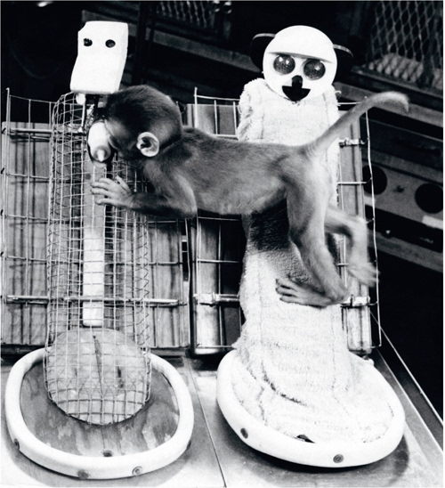
41. One of Harlow’s orphaned monkeys clings to the cloth mother even while sucking milk from the metal mother.

Follow-up research showed that Harlow’s orphaned monkeys grew up to be emotionally disturbed even though they had received all the nourishment they required. They never fitted into monkey society, had difficulties communicating with other monkeys, and suffered from high levels of anxiety and aggression. The conclusion was inescapable: monkeys must have psychological needs and desires that go beyond their material requirements, and if these are not fulfilled, they will suffer greatly. Harlow’s infant monkeys preferred to spend their time in the hands of the barren cloth mother because they were looking for an emotional bond and not only for milk.

Before the industrialisation of agriculture, most of the food produced in fields and farms was ‘wasted’ feeding peasants and farmyard animals.

In almost all societies peasants comprised more than 90 per cent of the population. Following the industrialisation of agriculture, a shrinking number of farmers was enough to feed a growing number of clerks and factory hands. Today in the United States, only 2 per cent of the population makes a living from agriculture, yet this 2 per cent produces enough not only to feed the entire US population, but also to export surpluses to the rest of the world.

As those factories and offices absorbed the billions of hands and brains that were released from fieldwork, they began pouring out an unprecedented avalanche of products. Humans now produce far more steel, manufacture much more clothing, and build many more structures than ever before. In addition, they produce a mind-boggling array of previously unimaginable goods, such as light bulbs, mobile phones, cameras and dishwashers. For the first time in human history, supply began to outstrip demand. And an entirely new problem was born: who is going to buy all this stuff?

#### The Age of Shopping

it’s not enough just to produce. Somebody must also buy the products, or industrialists and investors alike will go bust. 

To prevent this catastrophe and to make sure that people will always buy whatever new stuff industry produces, a new kind of ethic appeared: consumerism.

A good person avoided luxuries, never threw food away, and patched up torn trousers instead of buying a new pair.

Consumerism sees the consumption of ever more products and services as a positive thing. It encourages people to treat themselves, spoil themselves, and even kill themselves slowly by overconsumption.

Consumerism has worked very hard, with the help of popular psychology (‘Just do it!’) to convince people that indulgence is good for you, whereas frugality is self-oppression.

It has succeeded. We are all good consumers. We buy countless products that we don’t really need, and that until yesterday we didn’t know existed.

Shopping has become a favourite pastime, and consumer goods have become essential mediators in relationships between family members, spouses and friends.

The flowering of the consumerist ethic is manifested most clearly in the food market. Traditional agricultural societies lived in the awful shade of starvation. In the affluent world of today one of the leading health problems is obesity, which strikes the poor (who stuff themselves with hamburgers and pizzas) even more severely than the rich (who eat organic salads and fruit smoothies). 

Each year the US population spends more money on diets than the amount needed to feed all the hungry people in the rest of the world. 

Obesity is a double victory for consumerism. Instead of eating little, which will lead to economic contraction, people eat too much and then buy diet products – contributing to economic growth twice over.

 As in previous eras, there is today a division of labour between the elite and the masses. In medieval Europe, aristocrats spent their money carelessly on extravagant luxuries, whereas peasants lived frugally, minding every penny. Today, the tables have turned. The rich take great care managing their assets and investments, while the less well heeled go into debt buying cars and televisions they don’t really need.

The capitalist and consumerist ethics are two sides of the same coin, a merger of two commandments. The supreme commandment of the rich is ‘Invest!’ The supreme commandment of the rest of us is ‘Buy!’

Most previous ethical systems presented people with a pretty tough deal. They were promised paradise, but only if they cultivated compassion and tolerance, overcame craving and anger, and restrained their selfish interests. This was too tough for most. The history of ethics is a sad tale of wonderful ideals that nobody can live up to. Most Christians did not imitate Christ, most Buddhists failed to follow Buddha... ...In contrast, most people today successfully live up to the capitalist-consumerist ideal. The new ethic promises paradise on condition that the rich remain greedy and spend their time making more money, and that the masses give free rein to their cravings and passions – and buy more and more. This is the first religion in history whose followers actually do what they are asked to do. How, though, do we know that we’ll really get paradise in return? We’ve seen it on television.

### 18 A Permanent Revolution

As the world was moulded to fit the needs of Homo sapiens, habitats were destroyed and species went extinct. Our once green and blue planet is becoming a concrete and plastic shopping centre.

There are about 80,000 giraffes in the world, compared to 1.5 billion cattle; only 200,000 wolves, compared to 400 million domesticated dogs; only 250,000 chimpanzees – in contrast to billions of humans. Humankind really has taken over the world.

the resources available to humankind are constantly increasing, and are likely to continue to do so. That’s why doomsday prophesies of resource scarcity are probably misplaced. In contrast, the fear of ecological degradation is only too well founded.

ecological turmoil might endanger the survival of Homo sapiens itself. Global warming, rising oceans and widespread pollution could make the earth less hospitable to our kind, and the future might consequently see a spiralling race between human power and human-induced natural disasters. 

As humans use their power to counter the forces of nature and subjugate the ecosystem to their needs and whims, they might cause more and more unanticipated and dangerous side effects. These are likely to be controllable only by even more drastic manipulations of the ecosystem, which would result in even worse chaos.

Many call this process ‘the destruction of nature’. But it’s not really destruction, it’s change. Nature cannot be destroyed. Sixty-five million years ago, an asteroid wiped out the dinosaurs, but in so doing opened the way forward for mammals. Today, humankind is driving many species into extinction and might even annihilate itself

 Perhaps 65 million years from now, intelligent rats will look back gratefully on the decimation wrought by humankind, just as we today can thank that dinosaur-busting asteroid.

 In 1700 the world was home to some 700 million humans. In 1800 there were 950 million of us. By 1900 we almost doubled our numbers to 1.6 billion. And by 2000 that quadrupled to 6 billion. Today there are just shy of 7 billion Sapiens.

#### Modern Time

The Industrial Revolution opened the way to a long line of experiments in social engineering and an even longer series of unpremeditated changes in daily life and human mentality. One example among many is the replacement of the rhythms of traditional agriculture with the uniform and precise schedule of industry.

Traditional agriculture depended on cycles of natural time and organic growth. Most societies were unable to make precise time measurements, nor were they terribly interested in doing so. The world went about its business without clocks and timetables, subject only to the movements of the sun and the growth cycles of plants. There was no uniform working day, and all routines changed drastically from season to season.

If a lost time traveller popped up in a medieval village and asked a passerby, ‘What year is this?’ the villager would be as bewildered by the question as by the strangers ridiculous clothing.

modern industry cares little about the sun or the season. It sanctifies precision and uniformity. For example, in a medieval workshop each shoemaker made an entire shoe, from sole to buckle. If one shoemaker was late for work, it did not stall the others. However, in a modern footwear-factory assembly line, every worker mans a machine that produces just a small part of a shoe, which is then passed on to the next machine. If the worker who operates machine no. 5 has overslept, it stalls all the other machines. In order to prevent such calamities, everybody must adhere to a precise timetable. Each worker arrives at work at exactly the same time. Everybody takes their lunch break together, whether they are hungry or not. Everybody goes home when a whistle announces that the shift is over – not when they have finished their project.

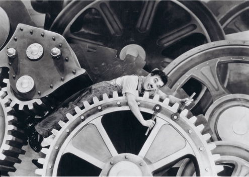
42. Charlie Chaplin as a simple worker caught in the wheels of the industrial assembly line, from the film Modern Times (1936).

The Industrial Revolution turned the timetable and the assembly line into a template for almost all human activities.

Even in places devoid of assembly lines and machines, the timetable became king. If the shift at the factory ends at 5 p.m., the local pub had better be open for business by 5:02.

In 1784 a carriage service with a published schedule began operating in Britain. Its timetable specified only the hour of departure, not arrival. Back then, each British city and town had its own local time, which could differ from London time by up to half an hour. When it was 12:00 in London, it was perhaps 12:20 in Liverpool and 11:50 in Canterbury. Since there were no telephones, no radio or television, and no fast trains – who could know, and who cared?

The trains were much faster than the old carriages, so the quirky differences in local hours became a severe nuisance. In 1847, British train companies put their heads together and agreed that henceforth all train timetables would be calibrated to Greenwich Observatory time,

 in 1880, the British government took the unprecedented step of legislating that all timetables in Britain must follow Greenwich. For the first time in history, a country adopted a national time and obliged its population to live according to an artificial clock rather than local ones or sunrise-to-sunset cycles.

 When the broadcast media – first radio, then television – made their debut, they entered a world of timetables and became its main enforcers and evangelists.

Among the first things radio stations broadcast were time signals, beeps that enabled far-flung settlements and ships at sea to set their clocks. Later, radio stations adopted the custom of broadcasting the news every hour. 
 
Nowadays, the first item of every news broadcast – more important even than the outbreak of war – is the time. During World War Two, BBC News was broadcast to Nazi-occupied Europe. Each news programme opened with a live broadcast of Big Ben tolling the hour – the magical sound of freedom. Ingenious German physicists found a way to determine the weather conditions in London based on tiny differences in the tone of the broadcast ding-dongs. This information offered invaluable help to the Luftwaffe. When the British Secret Service discovered this, they replaced the live broadcast with a set recording of the famous clock.

Today, a single affluent family generally has more timepieces at home than an entire medieval country.

You need to make a conscious effort not to know what time it is. The typical person consults these clocks several dozen times a day, because almost everything we do has to be done on time. 

An alarm clock wakes us up at 7 a.m., we heat our frozen bagel for exactly fifty seconds in the microwave, brush our teeth for three minutes until the electric toothbrush beeps, catch the 07:40 train to work, run on the treadmill at the gym until the beeper announces that half an hour is over, sit down in front of the TV at 7 p.m. to watch our favourite show, get interrupted at preordained moments by commercials that cost $1,000 per second, and eventually unload all our angst on a therapist who restricts our prattle to the now standard fifty-minute therapy hour.

The Industrial Revolution brought about dozens of major upheavals in human society. Adapting to industrial time is just one of them. Other notable examples include urbanisation, the disappearance of the peasantry, the rise of the industrial proletariat, the empowerment of the common person, democratisation, youth culture and the disintegration of patriarchy.

Yet all of these upheavals are dwarfed by the most momentous social revolution that ever befell humankind: the collapse of the family and the local community and their replacement by the state and the market.

more than a million years ago, humans lived in small, intimate communities, most of whose members were kin. The Cognitive Revolution and the Agricultural Revolution did not change that. They glued together families and communities to create tribes, cities, kingdoms and empires, but families and communities remained the basic building blocks of all human societies. The Industrial Revolution, on the other hand, managed within little more than two centuries to break these building blocks into atoms. Most of the traditional functions of families and communities were handed over to states and markets.

#### The Collapse of the Family and the Community

Prior to the Industrial Revolution, the daily life of most humans ran its course within three ancient frames: the nuclear family, the extended family and the local intimate community.* Most people worked in the family business – the family farm or the family workshop, for example – or they worked in their neighbours’ family businesses. The family was also the welfare system, the health system, the education system, the construction industry, the trade union, the pension fund, the insurance company, the radio, the television, the newspapers, the bank and even the police.

When a person fell sick, the family took care of her. When a person grew old, the family supported her, and her children were her pension fund. When a person died, the family took care of the orphans. If a person wanted to build a hut, the family lent a hand. If a person wanted to open a business, the family raised the necessary money.

when my neighbour was in need, I helped build his hut and guard his sheep, without expecting any payment in return. When I was in need, my neighbour returned the favour. At the same time, the local potentate might have drafted all of us villagers to construct his castle without paying us a penny. In exchange, we counted on him to defend us against brigands and barbarians. Village life involved many transactions but few payments.

Yet less than 10 per cent of commonly used products and services were bought in the market. Most human needs were taken care of by the family and the community.

Traditional agricultural economies had few surpluses with which to feed crowds of government officials, policemen, social workers, teachers and doctors. Consequently, most rulers did not develop mass welfare systems, health-care systems or educational systems.

on rare occasions when rulers tried to intervene more intensively in the daily lives of the peasantry (as happened, for example, in the Qin Empire in China), they did so by converting family heads and community elders into government agents.

The Ottoman Empire, for instance, allowed family vendettas to mete out justice, rather than supporting a large imperial police force. If my cousin killed somebody, the victim’s brother might kill me in sanctioned revenge. The sultan in Istanbul or even the provincial pasha did not intervene in such clashes, as long as violence remained within acceptable limits.

In the Chinese Ming Empire (1368–1644), the population was organised into the baojia system. Ten families were grouped to form a jia, and ten jia constituted a bao. When a member of a bao commited a crime, other bao members could be punished for it, in particular the bao elders. 

Taxes too were levied on the bao, and it was the responsibility of the bao elders rather than of the state officials to assess the situation of each family and determine the amount of tax it should pay.

Many kingdoms and empires were in truth little more than large protection rackets. The king was the capo di tutti capi who collected protection money, and in return made sure that neighbouring crime syndicates and local small fry did not harm those under his protection. He did little else.

Life in the bosom of family and community was far from ideal. Families and communities could oppress their members no less brutally than do modern states.

A person who lost her family and community around 1750 was as good as dead. She had no job, no education and no support in times of sickness and distress.

In order to survive, such a person quickly had to find an alternative family or community. 
 
Boys and girls who ran away from home could expect, at best, to become servants in some new family. At worst, there was the army or the brothel.

The Industrial Revolution gave the market immense new powers, provided the state with new means of communication and transportation, and placed at the government’s disposal an army of clerks, teachers, policemen and social workers.

Over time, states and markets used their growing power to weaken the traditional bonds of family and community. The state sent its policemen to stop family vendettas and replace them with court decisions. The market sent its hawkers to wipe out longstanding local traditions and replace them with ever-changing commercial fashions. Yet this was not enough. In order really to break the power of family and community, they needed the help of a fifth column.

The state and the market approached people with an offer that could not be refused. ‘Become individuals,’ they said. ‘Marry whomever you desire, without asking permission from your parents. Take up whatever job suits you, even if community elders frown. Live wherever you wish, even if you cannot make it every week to the family dinner. You are no longer dependent on your family or your community. We, the state and the market, will take care of you instead. We will provide food, shelter, education, health, welfare and employment. We will provide pensions, insurance and protection.’

The state and the market are the mother and father of the individual, and the individual can survive only thanks to them. 
 
The market provides us with work, insurance and a pension.

Not only adult men, but also women and children, are recognised as individuals. Throughout most of history, women were often seen as the property of family or community. Modern states, on the other hand, see women as individuals, enjoying economic and legal rights independently of their family and community. They may hold their own bank accounts, decide whom to marry, and even choose to divorce or live on their own.

the liberation of the individual comes at a cost. Many of us now bewail the loss of strong families and communities and feel alienated and threatened by the power the impersonal state and market wield over our lives

The deal between states, markets and individuals is an uneasy one. The state and the market disagree about their mutual rights and obligations, and individuals complain that both demand too much and provide too little. In many cases individuals are exploited by markets, and states employ their armies, police forces and bureaucracies to persecute individuals instead of defending them. Yet it is amazing that this deal works at all – however imperfectly. For it breaches countless generations of human social arrangements. Millions of years of evolution have designed us to live and think as community members. Within a mere two centuries we have become alienated individuals. Nothing testifies better to the awesome power of culture.

 When states and markets took from the family most of its economic and political roles, they left it some important emotional functions. The modern family is still supposed to provide for intimate needs, which state and market are (so far) incapable of providing.

Whereas traditionally the family was the main matchmaker, today it’s the market that tailors our romantic and sexual preferences, and then lends a hand in providing for them – for a fat fee.

Today courting is done at bars and cafés, and money passes from the hands of lovers to waitresses. Even more money is transferred to the bank accounts of fashion designers, gym managers, dieticians, cosmeticians and plastic surgeons, who help us arrive at the café looking as similar as possible to the markets ideal of beauty.

Family and community vs. state and market

Until not long ago, the suggestion that the state ought to prevent parents from beating or humiliating their children would have been rejected out of hand as ludicrous and unworkable. In most societies parental authority was sacred.

#### Imagined Communities

Like the nuclear family, the community could not completely disappear from our world without any emotional replacement. Markets and states today provide most of the material needs once provided by communities, but they must also supply tribal bonds. Markets and states do so by fostering ‘imagined communities’ that contain millions of strangers, and which are tailored to national and commercial needs. 

An imagined community is a community of people who don’t really know each other, but imagine that they do.

The intimate communities fulfilled the emotional needs of their members and were essential for everyone’s survival and welfare. In the last two centuries, the intimate communities have withered, leaving imagined communities to fill in the emotional vacuum.

The two most important examples for the rise of such imagined communities are the nation and the consumer tribe. The nation is the imagined community of the state. The consumer tribe is the imagined community of the market. 

Both are imagined communities because it is impossible for all customers in a market or for all members of a nation really to know one another the way villagers knew one another in the past.

Consumerism and nationalism work extra hours to make us imagine that millions of strangers belong to the same community as ourselves, that we all have a common past, common interests and a common future. 

This isn’t a lie. It’s imagination. 

Like money, limited liability companies and human rights, nations and consumer tribes are inter-subjective realities. They exist only in our collective imagination, yet their power is immense.

Most nations argue that they are a natural and eternal entity, created in some primordial epoch by mixing the soil of the motherland with the blood of the people. Yet such claims are usually exaggerated. Nations existed in the distant past, but their importance was much smaller than today because the importance of the state was much smaller.

whatever importance ancient nations may have had, few of them survived. Most existing nations evolved only after the Industrial Revolution.

Those who worked hard to construct Iraq or Syria made use of real historical, geographical and cultural raw materials – some of which are centuries and millennia old. Saddam Hussein co-opted the heritage of the Abbasid caliphate and the Babylonian Empire, even calling one of his crack armoured units the Hammurabi Division.

In recent decades, national communities have been increasingly eclipsed by tribes of customers who do not know one another intimately but share the same consumption habits and interests, and therefore feel part of the same consumer tribe – and define themselves as such.

Madonna fans, for example, constitute a consumer tribe. They define themselves largely by shopping. They buy Madonna concert tickets, CDs, posters, shirts and ring tones, and thereby define who they are. Manchester United fans, vegetarians and environmentalists are other examples. 

They, too, are defined above all by what they consume

A German vegetarian might well prefer to marry a French vegetarian than a German carnivore.

#### Perpetuum Mobile

The revolutions of the last two centuries have been so swift and radical that they have changed the most fundamental characteristic of the social order.

‘Order’ implied stability and continuity. Swift social revolutions were exceptional, and most social transformations resulted from the accumulation of numerous small steps. Humans tended to assume that the social structure was inflexible and eternal.

People tended to reconcile themselves to the status quo, declaring that ‘this is how it always was, and this is how it always will be’.

When we speak of modern revolutions we tend to think of 1789 (the French Revolution)... ...But the fact is that, these days, every year is revolutionary. Today, even a thirty-year-old can honestly tell disbelieving teenagers, ‘When I was young, the world was completely different.’

any attempt to define the characteristics of modern society is akin to defining the colour of a chameleon. 

The only characteristic of which we can be certain is the incessant change.

most of us think about the social order as something flexible, which we can engineer and improve at will.

In the last two centuries, the currency of politics is that it promises to destroy the old world and build a better one in its place. Not even the most conservative of political parties vows merely to keep things as they are.

Just as geologists expect that tectonic movements will result in earthquakes and volcanic eruptions, so might we expect that drastic social movements will result in bloody outbursts of violence. The political history of the nineteenth and twentieth centuries is often told as a series of deadly wars, holocausts and revolutions.

There is truth here, but this all too familiar list of calamities is somewhat misleading. We focus too much on the puddles and forget about the dry land separating them. The late modern era has seen unprecedented levels not only of violence and horror, but also of peace and tranquillity.

Of the seven decades that have elapsed since the end of World War Two. During this period humankind has for the first time faced the possibility of complete self-annihilation and has experienced a fair number of actual wars and genocides. Yet these decades were also the most peaceful era in human history – and by a wide margin.

This is surprising because these very same decades experienced more economic, social and political change than any previous era. The tectonic plates of history are moving at a frantic pace, but the volcanoes are mostly silent.

#### Peace in Our Time

Most people don’t appreciate just how peaceful an era we live in.

Many more people think about the wars raging today in Afghanistan and Iraq than about the peace in which most Brazilians and Indians live.

Even more importantly, it’s easier to relate to the suffering of individuals than of entire populations.

The figures for 2002 are even more surprising. Out of 57 million dead, only 172,000 people died in war and 569,000 died of violent crime (a total of 741,000 victims of human violence). In contrast, 873,000 people committed suicide.5 It turns out that in the year following the 9/11 attacks, despite all the talk of terrorism and war, the average person was more likely to kill himself than to be killed by a terrorist, a soldier or a drug dealer.

Well-off British subjects travel daily from Nottingham to London through Sherwood Forest without fear that a gang of merry green-clad brigands will ambush them and take their money to give to the poor (or, more likely, murder them and take the money for themselves).

children need not fear that they will be sold into slavery when their parents can’t pay their bills, and women know that the law forbids their husbands from beating them and forcing them to stay at home. Increasingly, around the world, these expectations are fulfilled.

In the decentralised kingdoms of medieval Europe, about twenty to forty people were murdered each year for every 100,000 inhabitants. In recent decades, when states and markets have become all-powerful and communities have vanished, violence rates have dropped even further.

Today the global average is only nine murders a year per 100,000 people, and most of these murders take place in weak states such as Somalia and Colombia. In the centralised states of Europe, the average is one murder a year per 100,000 people.

During the twentieth century, tens of millions if not hundreds of millions of people were killed by the security forces of their own states. Still, from a macro perspective, state-run courts and police forces have probably increased the level of security worldwide.

In 1964 a military dictatorship was established in Brazil. It ruled the country until 1985. During these twenty years, several thousand Brazilians were murdered by the regime. Thousands more were imprisoned and tortured. Yet even in the worst years, the average Brazilian in Rio de Janeiro was far less likely to die at human hands than the average Waorani, Arawete or Yanomamo. The Waorani, Arawete and Yanomamo are indigenous people who live in the depths of the Amazon forest, without army, police or prisons. Anthropological studies have indicated that between a quarter and a half of their menfolk die sooner or later in violent conflicts over property, women or prestige.

#### Imperial Retirement

It is perhaps debatable whether violence within states has decreased or increased since 1945. What nobody can deny is that international violence has dropped to an all-time low.

Since 1945 most empires have opted for peaceful early retirement. Their process of collapse became relatively swift, calm and orderly. In 1945 Britain ruled a quarter of the globe. Thirty years later it ruled just a few small islands. In the intervening decades it retreated from most of its colonies in a peaceful and orderly manner.

At least some of the praise usually heaped on Mahatma Gandhi for his non-violent creed is actually owed to the British Empire. Despite many years of bitter and often violent struggle, when the end of the Raj came, the Indians did not have to fight the British in the streets of Delhi and Calcutta. The empire’s place was taken by a slew of independent states, most of which have since enjoyed stable borders and have for the most part lived peacefully alongside their neighbours.

when compared to the long-term historical average, the British withdrawal was an exemplar of peace and order. 

The French Empire was more stubborn. Its collapse involved bloody rearguard actions in Vietnam and Algeria that cost hundreds of thousands of lives

Yet the Soviet elite, and the Communist regimes through most of eastern Europe (Romania and Serbia were the exceptions), chose not to use even a tiny fraction of this military power. When its members realised that Communism was bankrupt, they renounced force, admitted their failure, packed their suitcases and went home.

#### Pax Atomica

With very few exceptions, since 1945 states no longer invade other states in order to conquer and swallow them up.

campaigns of conquest like those of the Romans, Mongols and Ottomans cannot take place today anywhere in the world. 

Since 1945, no independent country recognised by the UN has been conquered and wiped off the map

We seldom think of the Arab world as particularly peaceful. Yet only once since the Arab countries won their independence has one of them mounted a full-scale invasion of another (the Iraqi invasion of Kuwait in 1990). There have been quite a few border clashes (e.g. Syria vs Jordan in 1970), many armed interventions of one in the affairs of another (e.g. Syria in Lebanon), numerous civil wars (Algeria, Yemen, Libya) and an abundance of coups and revolts. Yet there have been no full-scale international wars among the Arab states except the Gulf War. Even widening the scope to include the entire Muslim world adds only one more example, the Iran-Iraq War. There was no Turkey—Iran War, Pakistan-Afghanistan War, or Indonesia-Malaysia War.

For real peace is not the mere absence of war. Real peace is the implausibility of war. 

There has never been real peace in the world. Between 1871 and 1914, a European war remained a plausible eventuality, and the expectation of war dominated the thinking of armies, politicians and ordinary citizens alike.

An iron law of international politics decreed, ‘For every two nearby polities, there is a plausible scenario that will cause them to go to war against one another within one year.’ This law of the jungle was in force in late nineteenth-century Europe, in medieval Europe, in ancient China and in classical Greece.

Today humankind has broken the law of the jungle. There is at last real peace, and not just absence of war. For most polities, there is no plausible scenario leading to full-scale conflict within one year. What could lead to war between Germany and France next year? Or between China and Japan?

This situation might of course change in the future and, with hindsight, the world of today might seem incredibly naïve. Yet from a historical perspective, our very naïvety is fascinating. Never before has peace been so prevalent that people could not even imagine war.

the price of war has gone up dramatically. The Nobel Peace Prize to end all peace prizes should have been given to Robert Oppenheimer and his fellow architects of the atomic bomb. Nuclear weapons have turned war between superpowers into collective suicide, and made it impossible to seek world domination by force of arms.

while the price of war soared, its profits declined. For most of history, polities could enrich themselves by looting or annexing enemy territories. Most wealth consisted of fields, cattle, slaves and gold, so it was easy to loot it or occupy it. Today, wealth consists mainly of human capital, technical know-how and complex socio-economic structures such as banks. Consequently it is difficult to carry it off or incorporate it into one’s territory.

There are no silicon mines in Silicon Valley. The wealth resides in the minds of Google engineers and Hollywood script doctors, directors and special-effects wizards, who would be on the first plane to Bangalore or Mumbai long before the Chinese tanks rolled into Sunset Boulevard.

43. Gold miners in California during the Gold Rush, and Facebook’s headquarters near San Francisco. In 1849 California built its fortunes on gold.

44. Today, California builds its fortunes on silicon. But whereas in 1849 the gold actually lay there in the Californian soil, the real treasures of Silicon Valley are locked inside the heads of high-tech employees.

in 1400 England and France were at peace, the French did not have to pay heavy war taxes and to suffer destructive English invasions, but otherwise it did not benefit their wallets. In modern capitalist economies, foreign trade and investments have become all-important. Peace therefore brings unique dividends. As long as China and the USA are at peace, the Chinese can prosper by selling products to the USA, trading in Wall Street and receiving US investments.

Last but not least, a tectonic shift has taken place in global political culture. Many elites in history – Hun chieftains, Viking noblemen and Aztec priests, for example – viewed war as a positive good. Others viewed it as evil, but an inevitable one, which we had better turn to our own advantage. Ours is the first time in history that the world is dominated by a peace-loving elite – politicians, business people, intellectuals and artists who genuinely see war as both evil and avoidable. 

There were pacifists in the past, such as the early Christians, but in the rare cases that they gained power, they tended to forget about their requirement to ‘turn the other cheek’.

trade increases both the profits of peace and the costs of war

The tightening web of international connections erodes the independence of most countries, lessening the chance that any one of them might single-handedly let slip the dogs of war. 

Most countries no longer engage in full-scale war for the simple reason that they are no longer independent. Though citizens in Israel, Italy, Mexico or Thailand may harbour illusions of independence, the fact is that their governments cannot conduct independent economic or foreign policies, and they are certainly incapable of initiating and conducting full-scale war on their own.

 we are witnessing the formation of a global empire. Like previous empires, this one, too, enforces peace within its borders. And since its borders cover the entire globe, the World Empire effectively enforces world peace.
 
To satisfy both optimists and pessimists, we may conclude by saying that we are on the threshold of both heaven and hell, moving nervously between the gateway of the one and the anteroom of the other. History has still not decided where we will end up, and a string of coincidences might yet send us rolling in either direction.

### 19 And They Lived Happily Ever After

are we happier? Did the wealth humankind accumulated over the last five centuries translate into a new-found contentment? Did the discovery of inexhaustible energy resources open before us inexhaustible stores of bliss? Going further back, have the seventy or so turbulent millennia since the Cognitive Revolution made the world a better place to live? 

Was the late Neil Armstrong, whose footprint remains intact on the windless moon, happier than the nameless hunter-gatherer who 30,000 years ago left her handprint on a wall in Chauvet Cave? If not, what was the point of developing agriculture, cities, writing, coinage, empires, science and industry?

Historians seldom ask such questions... ...Yet these are the most important questions one can ask of history. 

Most current ideologies and political programmes are based on rather flimsy ideas concerning the real source of human happiness.

 Capitalists maintain that only the free market can ensure the greatest happiness of the greatest number, by creating economic growth and material abundance and by teaching people to be self-reliant and enterprising. What would happen if serious research were to disprove these hypotheses? If economic growth and self-reliance do not make people happier, what’s the benefit of Capitalism? 
 
What if it turns out that the subjects of large empires are generally happier than the citizens of independent states and that, for example, Algerians were happier under French rule than under their own? What would that say about the process of decolonisation and the value of national self-determination?
 
Historians have avoided raising these questions – not to mention answering them. 

They have researched the history of just about everything politics, society, economics, gender, diseases, sexuality, food, clothing – yet they have seldom stopped to ask how these influence human happiness.

 In one common view, human capabilities have increased throughout history. Since humans generally use their capabilities to alleviate miseries and fulfil aspirations, it follows that we must be happier than our medieval ancestors, and they must have been happier than Stone Age hunter-gatherers. But this progressive account is unconvincing
 
 When humans learned to farm in the Agricultural Revolution, their collective power to shape their environment increased, but the lot of many individual humans grew harsher. Peasants had to work harder than foragers to eke out less varied and nutritious food, and they were far more exposed to disease and exploitation.
 
Some challengers of this view take a diametrically opposed position. They argue for a reverse correlation between human capabilities and happiness. Power corrupts, they say, and as humankind gained more and more power, it created a cold mechanistic world ill-suited to our real needs. 

Evolution moulded our minds and bodies to the life of hunter-gatherers. The transition first to agriculture and then to industry has condemned us to living unnatural lives that cannot give full expression to our inherent inclinations and instincts, and therefore cannot satisfy our deepest yearnings. 

Nothing in the comfortable lives of the urban middle class can approach the wild excitement and sheer joy experienced by a forager band on a successful mammoth hunt. 

Every new invention just puts another mile between us and the Garden of Eden.

Perhaps we are out of touch with our inner hunter-gatherer. 

It’s not all bad. For instance, over the last two centuries modern medicine has decreased child mortality from 33 per cent to less than 5 per cent. Can anyone doubt that this made a huge contribution to the happiness not only of those children who would otherwise have died, but also of their families and friends?

 Other unprecedented achievements include the steep drop in violence, the virtual disappearance of international wars, and the near elimination of large-scale famines.
 
Yet this, too, is an oversimplification. Firstly, it bases its optimistic assessment on a very small sample of years. The majority of humans began to enjoy the fruits of modern medicine no earlier than 1850, and the drastic drop in child mortality is a twentieth-century phenomenon. Mass famines continued to blight much of humanity up to the middle of the twentieth century. 

During Communist Chinas Great Leap Forward of 1958–61, somewhere between 10 and 50 million human beings starved to death.

though the last few decades have been an unprecedented golden age for humanity, it is too early to know whether this represents a fundamental shift in the currents of history or an ephemeral eddy of good fortune. 
 
 When judging modernity, it is all too tempting to take the viewpoint of a twenty-first-century middle-class Westerner. We must not forget the viewpoints of a nineteenth-century Welsh coal miner, Chinese opium addict or Tasmanian Aborigine.

Over the last few decades, we have been disturbing the ecological equilibrium of our planet in myriad new ways, with what seem likely to be dire consequences. 
 
A lot of evidence indicates that we are destroying the foundations of human prosperity in an orgy of reckless consumption.

Finally, we can congratulate ourselves on the unprecedented accomplishments of modern Sapiens only if we completely ignore the fate of all other animals.

Much of the vaunted material wealth that shields us from disease and famine was accumulated at the expense of laboratory monkeys, dairy cows and conveyor-belt chickens. Over the last two centuries tens of billions of them have been subjected to a regime of industrial exploitation whose cruelty has no precedent in the annals of planet Earth. 

If we accept a mere tenth of what animal-rights activists are claiming, then modern industrial agriculture might well be the greatest crime in history. When evaluating global happiness, it is wrong to count the happiness only of the upper classes, of Europeans or of men. Perhaps it is also wrong to consider only the happiness of humans.

#### Counting Happiness

If people are richer and healthier, then they must also be happier. But is that really so obvious? Philosophers, priests and poets have brooded over the nature of happiness for millennia, and many have concluded that social, ethical and spiritual factors have as great an impact on our happiness as material conditions. 
 
Perhaps people in modern affluent societies suffer greatly from alienation and meaninglessness despite their prosperity. And perhaps our less well-to-do ancestors found much contentment in community, religion and a bond with nature.

 The generally accepted definition of happiness is ‘subjective well-being’. Happiness, according to this view, is something I feel inside myself, a sense of either immediate pleasure or long-term contentment with the way my life is going.
 
 If it’s something felt inside, how can it be measured from outside? Presumably, we can do so by asking people to tell us how they feel.
 
A typical subjective well-being questionnaire asks interviewees to grade on a scale of zero to ten their agreement with statements such as ‘I feel pleased with the way I am’, ‘I feel that life is very rewarding’, ‘I am optimistic about the future’ and ‘Life is good’. The researcher then adds up all the answers and calculates the interviewee’s general level of subjective well-being.

One study might compare a thousand people who earn $100,000 a year with a thousand people who earn $50,000. If the study discovers that the first group has an average subjective well-being level of 8.7, while the latter has an average of only 7.3, the researcher may reasonably conclude that there is a positive correlation between wealth and subjective well-being. To put it in simple English, money brings happiness.

If people are happier in democracies and married people are happier than divorcees, a historian has a basis for arguing that the democratisation process of the last few decades contributed to the happiness of humankind, whereas the growing rates of divorce indicate an opposite trend.

One interesting conclusion is that money does indeed bring happiness. But only up to a point, and beyond that point it has little significance. For people stuck at the bottom of the economic ladder, more money means greater happiness.

Another interesting finding is that illness decreases happiness in the short term, but is a source of long-term distress only if a person’s condition is constantly deteriorating or if the disease involves ongoing and debilitating pain. People who are diagnosed with chronic illness such as diabetes are usually depressed for a while, but if the illness does not get worse they adjust to their new condition and rate their happiness as highly as healthy people do.

Family and community seem to have more impact on our happiness than money and health. 

People with strong families who live in tight-knit and supportive communities are significantly happier than people whose families are dysfunctional and who have never found (or never sought) a community to be part of.

This raises the possibility that the immense improvement in material conditions over the last two centuries was offset by the collapse of the family and the community. If so, the average person might well be no happier today than in 1800.

 With the individual wielding unprecedented power to decide her own path in life, we find it ever harder to make commitments. We thus live in an increasingly lonely world of unravelling communities and families.
 
But the most important finding of all is that happiness does not really depend on objective conditions of either wealth, health or even community. Rather, it depends on the correlation between objective conditions and subjective expectations.

This is why winning the lottery has, over time, the same impact on people’s happiness as a debilitating car accident. When things improve, expectations balloon, and consequently even dramatic improvements in objective conditions can leave us dissatisfied. When things deteriorate, expectations shrink, and consequently even a severe illness might leave you pretty much as happy as you were before.

Prophets, poets and philosophers realised thousands of years ago that being satisfied with what you already have is far more important than getting more of what you want.

It’s nice when modern research – bolstered by lots of numbers and charts – reaches the same conclusions the ancients did.

### 20 The End of Homo Sapiens

## Afterword:

## The Animal that Became a God

## Notes
