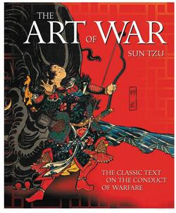

# The Art of War

Sun Tzu - 5th century BC

## Table of Contents

I Laying Plans

II Waging War

III Attack by Stratagem

IV Tactical Dispositions

V Energy

VI Weak Points and Strong

VII Maneuvering

VIII Variations in Tactics

IX The Army on the March

X Terrain

XI The Nine Situations

XII The Attack by Fire

XIII The Use of Spies

## I Laying Plans

The art of war is of vital importance to the State.

It is a matter of life and death, a road either to safety or to ruin. Hence it is a subject of inquiry which can on no account be neglected.

The art of war, then, is governed by five constant factors, to be taken into account in one’s deliberations... ...These are: (1) The Moral Law; (2) Heaven; (3) Earth; (4) The Commander; (5) Method and discipline.

The MORAL LAW causes the people to be in complete accord with their ruler... ...HEAVEN signifies night and day, cold and heat, times and seasons. EARTH comprises distances, great and small; danger and security... ... the chances of life and death. The COMMANDER stands for the virtues of wisdom, sincerely, benevolence, courage and strictness. By METHOD AND DISCIPLINE are to be understood the marshaling of the army in its proper subdivisions... ...the maintenance of roads by which supplies may reach the army, and the control of military expenditure.

Therefore, in your deliberations, when seeking to determine the military conditions, let them be made the basis of a comparison, in this wise:

- (1)Which of the two sovereigns is imbued with the Moral law?
- (2)Which of the two generals has most ability?
- (3)With whom lie the advantages derived from Heaven and Earth?
- (4)On which side is discipline most rigorously enforced?
- (5)Which army is stronger?
- (6)On which side are officers and men more highly trained?
- (7)In which army is there the greater constancy both in reward and punishment?

By means of these seven considerations I can forecast victory or defeat.

Avail yourself also of any helpful circumstances over and beyond the ordinary rules.

All warfare is based on deception. Hence, when able to attack, we must seem unable; when using our forces, we must seem inactive; when we are near, we must make the enemy believe we are far away.

If he is secure at all points, be prepared for him. If he is in superior strength, evade him.

If your opponent is of choleric temper, seek to irritate him. Pretend to be weak, that he may grow arrogant.

Attack him where he is unprepared, appear where you are not expected.

Now the general who wins a battle makes many calculations in his temple ere the battle is fought. The general who loses a battle makes but few calculations beforehand. Thus do many calculations lead to victory, and few calculations to defeat: how much more no calculation at all! It is by attention to this point that I can foresee who is likely to win or lose.

## II Waging War

When you engage in actual fighting, if victory is long in coming, then men’s weapons will grow dull and their ardor will be damped. If you lay siege to a town, you will exhaust your strength.

Now, when your weapons are dulled, your ardor damped, your strength exhausted and your treasure spent, other chieftains will spring up to take advantage of your extremity. Then no man, however wise, will be able to avert the consequences that must ensue.

There is no instance of a country having benefited from prolonged warfare.

It is only one who is thoroughly acquainted with the evils of war can thoroughly understand the profitable way of carrying it on.

Bring war material with you from home, but forage on the enemy. Thus the army will have food enough for its needs.

Contributing to maintain an army at a distance causes the people to be impoverished.

The proximity of an army causes prices to go up; and high prices cause the people’s substance to be drained away. When their substance is drained away, the peasantry will be afflicted by heavy exactions

With this loss of substance and exhaustion of strength, the homes of the people will be stripped bare, and three-tenths of their income will be dissipated; while government expenses for broken chariots, worn-out horses, breast-plates and helmets, bows and arrows, spears and shields, protective mantles, draughtoxen and heavy wagons, will amount to four-tenths of its total revenue.

A wise general makes a point of foraging on the enemy.

In order to kill the enemy, our men must be roused to anger; that there may be advantage from defeating the enemy, they must have their rewards.

In chariot fighting, when ten or more chariots have been taken, those should be rewarded who took the first. Our own flags should be substituted for those of the enemy, and the chariots mingled and used in conjunction with ours. The captured soldiers should be kindly treated and kept.

Using the conquered foe to augment one’s own strength.

In war, then, let your great object be victory, not lengthy campaigns. Thus it may be known that the leader of armies is the arbiter of the people’s fate, the man on whom it depends whether the nation shall be in peace or in peril.

## III Attack by Stratagem

Sun Tzu said: In the practical art of war, the best thing of all is to take the enemy’s country whole and intact; to shatter and destroy it is not so good.

It is better... ...to capture a regiment, a detachment or a company entire than to destroy them.

To fight and conquer in all your battles is not supreme excellence; supreme excellence consists in breaking the enemy’s resistance without fighting.

the highest form of generalship is to balk the enemy’s plans; the next best is to prevent the junction of the enemy’s forces; the next in order is to attack the enemy’s army in the field; and the worst policy of all is to besiege walled cities.

The rule is, not to besiege walled cities if it can possibly be avoided... ...The general, unable to control his irritation, will launch his men to the assault like swarming ants, with the result that one-third of his men are slain, while the town still remains untaken. Such are the disastrous effects of a siege.

The skillful leader subdues the enemy’s troops without any fighting; he captures their cities without laying siege to them; he overthrows their kingdom without lengthy operations in the field.

It is the rule in war, if our forces are ten to the enemy’s one, to surround him; if five to one, to attack him; if twice as numerous, to divide our army into two. If equally matched, we can offer battle; if slightly inferior in numbers, we can avoid the enemy; if quite unequal in every way, we can flee from him.

There are three ways in which a ruler can bring misfortune upon his army:

- (1)By commanding the army to advance or to retreat, being ignorant of the fact that it cannot obey. This is called hobbling the army.
- (2)By attempting to govern an army in the same way as he administers a kingdom, being ignorant of the conditions which obtain in an army. This causes restlessness in the soldier’s minds.
- (3)By employing the officers of his army without discrimination, through ignorance of the military principle of adaptation to circumstances. This shakes the confidence of the soldiers.

When the army is restless and distrustful, trouble is sure to come from the other feudal princes. This is simply bringing anarchy into the army, and flinging victory away.

Five essentials for victory:

- (1)He will win who knows when to fight and when not to fight.
- (2)He will win who knows how to handle both superior and inferior forces.
- (3)He will win whose army is animated by the same spirit throughout all its ranks.
- (4)He will win who, prepared himself, waits to take the enemy unprepared.
- (5)He will win who has military capacity and is not interfered with by the sovereign.

If you know the enemy and know yourself, you need not fear the result of a hundred battles. If you know yourself but not the enemy, for every victory gained you will also suffer a defeat. If you know neither the enemy nor yourself, you will succumb in every battle.

## IV Tactical Dispositions

The good fighters of old first put themselves beyond the possibility of defeat, and then waited for an opportunity of defeating the enemy.

To secure ourselves against defeat lies in our own hands, but the opportunity of defeating the enemy is provided by the enemy himself.

One may KNOW how to conquer without being able to DO it.

The general who is skilled in defense hides in the most secret recesses of the earth; he who is skilled in attack flashes forth from the topmost heights of heaven. Thus on the one hand we have ability to protect ourselves; on the other, a victory that is complete.

To see victory only when it is within the ken of the common herd is not the acme of excellence. Neither is it the acme of excellence if you fight and conquer and the whole Empire says, “Well done!”... ...What the ancients called a clever fighter is one who not only wins, but excels in winning with ease.

He wins his battles by making no mistakes. Making no mistakes is what establishes the certainty of victory, for it means conquering an enemy that is already defeated.

In war the victorious strategist only seeks battle after the victory has been won, whereas he who is destined to defeat first fights and afterwards looks for victory.

In respect of military method, we have, firstly, Measurement; secondly, Estimation of quantity; thirdly, Calculation; fourthly, Balancing of chances; fifthly, Victory.

## V Energy

> The control of a large force is the same principle as the control of a few men: it is merely a question of dividing up their numbers. - Sun Tzu

To ensure that your whole host may withstand the brunt of the enemy’s attack and remain unshaken—this is effected by maneuvers direct and indirect.

In all fighting, the direct method may be used for joining battle, but indirect methods will be needed in order to secure victory.

There are not more than five primary colors (blue, yellow, red, white, and black), yet in combination they produce more hues than can ever been seen.

In battle, there are not more than two methods of attack—the direct and the indirect; yet these two in combination give rise to an endless series of maneuvers.

The direct and the indirect lead on to each other in turn. It is like moving in a circle—you never come to an end. Who can exhaust the possibilities of their combination?

The good fighter will be terrible in his onset, and prompt in his decision.

Amid the turmoil and tumult of battle, there may be seeming disorder and yet no real disorder at all; amid confusion and chaos, your array may be without head or tail, yet it will be proof against defeat. Simulated disorder postulates perfect discipline, simulated fear postulates courage; simulated weakness postulates strength. Hiding order beneath the cloak of disorder is simply a question of subdivision; concealing courage under a show of timidity presupposes a fund of latent energy; masking strength with weakness is to be effected by tactical dispositions.

Thus one who is skillful at keeping the enemy on the move maintains deceitful appearances, according to which the enemy will act. He sacrifices something, that the enemy may snatch at it.

The clever combatant looks to the effect of combined energy, and does not require too much from individuals. Hence his ability to pick out the right men and utilize combined energy. When he utilizes combined energy, his fighting men become as it were like unto rolling logs or stones. For it is the nature of a log or stone to remain motionless on level ground, and to move when on a slope; if four-cornered, to come to a standstill, but if round-shaped, to go rolling down. Thus the energy developed by good fighting men is as the momentum of a round stone rolled down a mountain thousands of feet in height. So much on the subject of energy.

## VI Weak Points and Strong

> Whoever is first in the field and awaits the coming of the enemy, will be fresh for the fight; whoever is second in the field and has to hasten to battle will arrive exhausted. - Sun Tzu

The clever combatant imposes his will on the enemy, but does not allow the enemy’s will to be imposed on him.

Appear at points which the enemy must hasten to defend; march swiftly to places where you are not expected.

An army may march great distances without distress, if it marches through country where the enemy is not.

You can be sure of succeeding in your attacks if you only attack places which are undefended. You can ensure the safety of your defense if you only hold positions that cannot be attacked.

O divine art of subtlety and secrecy! Through you we learn to be invisible, through you inaudible; and hence we can hold the enemy’s fate in our hands.

If we wish to fight, the enemy can be forced to an engagement even though he be sheltered behind a high rampart and a deep ditch. All we need do is attack some other place that he will be obliged to relieve. If we do not wish to fight, we can prevent the enemy from engaging us even though the lines of our encampment be merely traced out on the ground. All we need do is to throw something odd and unaccountable in his way.

We can form a single united body, while the enemy must split up into fractions. Hence there will be a whole pitted against separate parts of a whole, which means that we shall be many to the enemy’s few. And if we are able thus to attack an inferior force with a superior one, our opponents will be in dire straits.

The spot where we intend to fight must not be made known; for then the enemy will have to prepare against a possible attack at several different points; and his forces being thus distributed in many directions, the numbers we shall have to face at any given point will be proportionately few.

If he sends reinforcements everywhere, he will everywhere be weak.

Numerical weakness comes from having to prepare against possible attacks; numerical strength, from compelling our adversary to make these preparations against us.

Though the enemy be stronger in numbers, we may prevent him from fighting. Scheme so as to discover his plans and the likelihood of their success.

Rouse him, and learn the principle of his activity or inactivity. Force him to reveal himself, so as to find out his vulnerable spots.

In making tactical dispositions, the highest pitch you can attain is to conceal them; conceal your dispositions, and you will be safe from the prying of the subtlest spies, from the machinations of the wisest brains.

Do not repeat the tactics which have gained you one victory, but let your methods be regulated by the infinite variety of circumstances.

In war, the way is to avoid what is strong and to strike at what is weak.

Water shapes its course according to the nature of the ground over which it flows.

Therefore, just as water retains no constant shape, so in warfare there are no constant conditions. He who can modify his tactics in relation to his opponent and thereby succeed in winning, may be called a heaven-born captain.

## VII Maneuvering

Sun Tzu said: In war, the general receives his commands from the sovereign.

The difficulty of tactical maneuvering consists in turning the devious into the direct, and misfortune into gain.

To take a long and circuitous route, after enticing the enemy out of the way, and though starting after him, to contrive to reach the goal before him, shows knowledge of the artifice of DEVIATION.

Maneuvering with an army is advantageous; with an undisciplined multitude, most dangerous.

If you order your men to roll up their buff-coats, and make forced marches without halting day or night, covering double the usual distance at a stretch, doing a hundred LI in order to wrest an advantage, the leaders of all your three divisions will fall into the hands of the enemy.

An army without its baggage-train is lost; without provisions it is lost; without bases of supply it is lost.

We cannot enter into alliances until we are acquainted with the designs of our neighbors.

We are not fit to lead an army on the march unless we are familiar with the face of the country.

In war, practice dissimulation, and you will succeed.

Whether to concentrate or to divide your troops, must be decided by circumstances.

In raiding and plundering be like fire, in immovability like a mountain.

Let your plans be dark and impenetrable as night, and when you move, fall like a thunderbolt.

Ponder and deliberate before you make a move.

The Book of Army Management says: On the field of battle, the spoken word does not carry far enough: hence the institution of gongs and drums. Nor can ordinary objects be seen clearly enough: hence the institution of banners and flags.

Gongs and drums, banners and flags, are means whereby the ears and eyes of the host may be focused on one particular point.

A solider’s spirit is keenest in the morning; by noonday it has begun to flag; and in the evening, his mind is bent only on returning to camp.

A clever general, therefore, avoids an army when its spirit is keen, but attacks it when it is sluggish and inclined to return. This is the art of studying moods.

To be near the goal while the enemy is still far from it, to wait at ease while the enemy is toiling and struggling, to be well-fed while the enemy is famished—this is the art of husbanding one’s strength.

It is a military axiom not to advance uphill against the enemy, nor to oppose him when he comes downhill.

When you surround an army, leave an outlet free. Do not press a desperate foe too hard.

## VIII Variations in Tactics

Sun Tzu said: In war, the general receives his commands from the sovereign, collects his army and concentrates his forces.

When in difficult country, do not encamp.

Do not linger in dangerously isolated positions. In hemmed-in situations, you must resort to stratagem. In desperate position, you must fight.

There are roads which must not be followed, armies which must be not attacked, towns which must not be besieged, positions which must not be contested, commands of the sovereign which must not be obeyed.

The general who thoroughly understands the advantages that accompany variation of tactics knows how to handle his troops.

So, the student of war who is unversed in the art of war of varying his plans, even though he be acquainted with the Five Advantages, will fail to make the best use of his men.

In the wise leader’s plans, considerations of advantage and of disadvantage will be blended together.

Reduce the hostile chiefs by inflicting damage on them; and make trouble for them, and keep them constantly engaged; hold out specious allurements, and make them rush to any given point.

The art of war teaches us to rely not on the likelihood of the enemy’s not coming, but on our own readiness to receive him; not on the chance of his not attacking, but rather on the fact that we have made our position unassailable.

Five dangerous faults which may affect a general:

- (1)Recklessness, which leads to destruction;
- (2)cowardice, which leads to capture;
- (3)a hasty temper, which can be provoked by insults;
- (4)a delicacy of honor which is sensitive to shame;
- (5)over-solicitude for his men, which exposes him to worry and trouble.

These are the five besetting sins of a general, ruinous to the conduct of war. When an army is overthrown and its leader slain, the cause will surely be found among these five dangerous faults. Let them be a subject of meditation.

## IX The Army on the March

Camp in high places, facing the sun. Do not climb heights in order to fight. So much for mountain warfare.

After crossing a river, you should get far away from it.

Moor your craft higher up than the enemy, and facing the sun. Do not move upstream to meet the enemy. So much for river warfare.

In dry, level country, take up an easily accessible position with rising ground to your right and on your rear, so that the danger may be in front, and safety lie behind. So much for campaigning in flat country.

All armies prefer high ground to low and sunny places to dark.

If you are careful of your men, and camp on hard ground, the army will be free from disease of every kind, and this will spell victory.

When, in consequence of heavy rains up-country, a river which you wish to ford is swollen and flecked with foam, you must wait until it subsides.

Country in which there are precipitous cliffs with torrents running between, deep natural hollows, confined places, tangled thickets, quagmires and crevasses, should be left with all possible speed and not approached. While we keep away from such places, we should get the enemy to approach them; while we face them, we should let the enemy have them on his rear.

When the enemy is close at hand and remains quiet, he is relying on the natural strength of his position. When he keeps aloof and tries to provoke a battle, he is anxious for the other side to advance.

Movement amongst the trees of a forest shows that the enemy is advancing... ...The rising of birds in their flight is the sign of an ambuscade. Startled beasts indicate that a sudden attack is coming.

Humble words and increased preparations are signs that the enemy is about to advance. Violent language and driving forward as if to the attack are signs that he will retreat.

Peace proposals unaccompanied by a sworn covenant indicate a plot.

When the soldiers stand leaning on their spears, they are faint from want of food. If those who are sent to draw water begin by drinking themselves, the army is suffering from thirst.

If the enemy sees an advantage to be gained and makes no effort to secure it, the soldiers are exhausted.

If there is disturbance in the camp, the general’s authority is weak. If the banners and flags are shifted about, sedition is afoot. If the officers are angry, it means that the men are weary.

When an army feeds its horses with grain and kills its cattle for food, and when the men do not hang their cooking pots over the campfires, showing that they will not return to their tents, you may know that they are determined to fight to the death.

To begin by bluster, but afterwards to take fright at the enemy’s numbers, shows a supreme lack of intelligence.

If our troops are no more in number than the enemy, that is amply sufficient; it only means that no direct attack can be made. What we can do is simply to concentrate all our available strength, keep a close watch on the enemy, and obtain reinforcements.

He who exercises no forethought but makes light of his opponents is sure to be captured by them.

Soldiers must be treated in the first instance with humanity, but kept under control by means of iron discipline. This is a certain road to victory.

## X Terrain

## XI The Nine Situations

## XII The Attack by Fire

## XIII The Use of Spies

