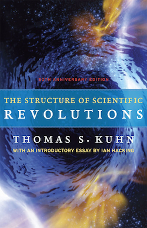

# The Structure of Scientific Revolutions

Thomas S. Kuhn - 1962

## Table of Contents

TODO

## Introductory Essay by Ian Hacking

Great books are rare.

The Essential Tension is a superb collection of philosophical (as opposed to historical) papers that he published immediately before or soon after Structure.1 It can be thought of as a series of commentaries and expansions, so it is excellent companion reading.

like all great books, this is a work of passion and a passionate desire to get things right.

Thomas Kuhn was out to change our understanding of the sciences—that is, of the activities that have enabled our species, for better or worse, to dominate the planet. He succeeded.

### 1962

Nineteen sixty-two was a long time ago... ...The queen of the sciences, then, was physics. Kuhn had been trained as a physicist. Few people knew much physics, but everybody knew that physics was where the action was. A cold war was in progress, so everyone knew about the Bomb. American schoolchildren had to practice cowering under their desks. At least once a year towns sounded an air raid siren, at which everyone had to take shelter. Those who protested against a nuclear weapon, by ostentatiously not taking shelter, could be arrested, and some were. Bob Dylan first performed “A Hard Rain’s A-Gonna Fall” in September 1962; everyone assumed it was about nuclear fallout. In October 1962 there was the Cuban Missile Crisis, the closest the world has come, after 1945, to nuclear war. Physics and its threat were on everyone’s mind.

Another event of 1962 was the awarding of Nobel prizes to Francis Crick and James Watson for the molecular biology of DNA and to Max Perutz and John Kendrew for the molecular biology of hemoglobin. That was the harbinger of change. Today, biotechnology rules.

You will have to decide, after reading his book, about the extent to which what he said about the physical sciences holds true in the teeming, present world

Experiment is not what it was, for it has been modified and to a certain extent replaced by computer simulation.

In 1962 there were competing cosmologies: steady state and big bang, two completely different pictures of the universe and its origin. After 1965 and the almost fortuitous discovery of universal background radiation, there is only the big bang, full of outstanding problems pursued as normal science.

As he reorganized his own past, he increasingly presented himself as always having had primarily philosophical interests.9 Although Structure had an immense immediate impact on the community of historians of science, its more enduring effects have probably been upon philosophy of science and, indeed, on public culture. That is the perspective from which this introduction is written.

### Structure

He had a gift for aphorism; and his names have acquired an unusual status, for although they were once arcane, some of them are now part of colloquial English.

That is the structure of scientific revolutions: normal science with a paradigm and a dedication to solving puzzles; followed by serious anomalies, which lead to a crisis; and finally resolution of the crisis by a new paradigm.

Incommensurability. This is the idea that, in the course of a revolution and paradigm shift, the new ideas and assertions cannot be strictly compared to the old ones. Even if the same words are in use, their very meaning has changed. That in turn led to the idea that a new theory was not chosen to replace an old one, because it was true but more because of a change in world view 

Progress in science is not a simple line leading to the truth. It is more progress away from less adequate conceptions of, and interactions with, the world

### Revolution

Immanuel Kant. He saw two great intellectual revolutions... ...One was the transition in mathematical practice in which techniques familiar in Babylonia and Egypt were transformed in Greece to proofs from postulates. The second was the emergence of the experimental method and the laboratory, a series of events that he identified as beginning with Galileo.

He had proposed that there was a “second scientific revolution.”15 It took place during the early years of the nineteenth century; whole new fields were mathematized. Heat, light, electricity, and magnetism acquired paradigms, and suddenly a whole mass of unsorted phenomena began to make sense. This coincided with—went hand-in-with—what we call the industrial revolution. It was arguably the beginning of the modern technoscientific world in which we live.

Einstein’s special (1905) and then general (1916) theory of relativity were more shattering events than we can well conceive. Relativity had, at the beginning, far more repercussions in the humanities and arts than genuine testable consequences in physics. Yes, there was the famous expedition of Sir Arthur Eddington to test an astronomical prediction of the theory, but it was only later that relativity became integral to many branches of physics.

The quantum revolution, also a two-stage affair, with Max Planck’s introduction of quanta around 1900 and then the full quantum theory of 1926–27, complete with Heisenberg’s uncertainty principle. Combined, relativity and quantum physics overthrew not only old science but basic metaphysics.

Before Kuhn, Karl Popper (1902–94) was the most influential philosopher of science—I mean the most widely read, and to some extent believed, by practicing scientists.16 Popper had come of age during the second quantum revolution. It taught him that science proceeds by conjectures and refutations, to use the title of one of his books. 

First we frame bold conjectures, as testable as possible, and inevitably find them wanting. They are refuted, and a new conjecture must be found that fits the facts. Hypotheses can count as “scientific” only if they are falsifiable. This purist vision of science would have been unthinkable before the great turn-of-the-century revolutions.

The sciences look different today. In 2009 the 150th anniversary of Darwin’s The Origin of Species by Means of Natural Selection was celebrated with great fanfare. With all the books, shows, and festivals, I suspect that many bystanders, if asked what was the most revolutionary scientific work of all time, would very reasonably have answered The Origin of Species. So it is striking that Darwin’s revolution is never mentioned in Structure. Natural selection does enter in an important way on pages 171–72 but only to serve as analogy to scientific development. Now that the life sciences have replaced physics as top dog, we have to ask about the extent to which Darwin’s revolution fits Kuhn’s template.

I regret the recent debasing of revolution to mere hype, but it is a fact that makes the comprehension of Kuhn a little more difficult.

A single sentence of page 35 sums up Kuhn’s doctrine: “The most striking feature of the normal research problems we have just encountered is how little they aim to produce major novelties, conceptual or phenomenal.”

If you look at any research journal, he wrote, you will find three types of problems addressed: (1) determination of significant facts, (2) matching of facts with theory, and (3) articulation of theory. To expand slightly:

1. Theory leaves certain quantities or phenomena inadequately described and only qualitatively tells us what to expect. Measurement and other procedures determine the facts more precisely.
2. Known observations don’t quite tally with theory. What’s wrong? Tidy up the theory or show that the experimental data were defective.
3. The theory may have a solid mathematical formulation, but one is not yet able to comprehend its consequences. Kuhn gives the apt name of articulation to the process of bringing out what is implicit in the theory, often by mathematical analysis.

Since the 1980s there has been a substantial shift in emphasis, with historians, sociologists, and philosophers attending seriously to experimental science.

Immense experimental or instrumental novelty is simply missed in Kuhn’s theoretical stance, so normal science may have a great deal of novelty, just not theoretical. And for the general public, which wants technologies and cures, the novelties for which science is admired are usually not theoretical at all. That is why Kuhn’s remark sounds somehow wrongheaded.

In Kuhn’s idea of normal science, notice that the high-energy physics most widely reported by science journalists is the search for the Higgs particle. This involves an incredible treasury of both money and talent, all of which is dedicated to confirming what present physics teaches—that there is an as yet undetected particle that plays an essential role in the very existence of matter.

In one sense, nothing new in the way of theory or even phenomena is anticipated. That’s what Kuhn was right about. Normal science does not aim at novelty. But novelty can emerge from confirmation of theories already held. 

it is hoped that when the right conditions for eliciting the particle are finally established, an entire new generation of high-energy physics will begin.

### Paradigm (§V)

Kuhn single-handedly changed the currency of the word paradigm so that a new reader attaches very different connotations to the word than were available to the author in 1962.

Nowadays paradigm, along with its companion paradigm shift, is embarrassingly everywhere.

Today, it is pretty hard to escape the damn word, which is why Kuhn wrote even in 1970 that he had lost control of it.

The Greek word paradeigma played an important part in Aristotle’s theory of argument, especially in the book called Rhetoric. That book is about practical argument between two parties, an orator and an audience, who share a great many beliefs that hardly need stating. In English translations the ancestor of our word paradigm is usually rendered as example, but Aristotle meant something more like exemplar, a very best and most instructive example. He thought that there are two basic types of arguments. One kind of argument is essentially deductive, but with many unstated premises. The other is essentially analogical.

In general: Something is in dispute. One states a compelling example about which almost everyone in the audience will agree—a paradigm. The implication is that what is in dispute is “just like that.”

In Latin translations of Aristotle, paradeigma became exemplum, which pursued its own career in mediaeval and renaissance theories of argument. The word paradigm was, however, conserved in modern European languages but largely divorced from rhetoric.

When schoolchildren had to learn Latin, they were told to conjugate to love—“I love,” “thou lovest,” “he/she/it loves”—as amo, amas, amat, and so on. That was the paradigm, the model to imitate with similar verbs. The primary use of the word paradigm was in connection with grammar, but it was always available as a metaphor.

You cannot claim we lack free will (for example), because we had to learn the use of the expression “free will” from examples, and they are the paradigms.

Moreover, the achievements are not just anything notable. They are

1.“sufficiently unprecedented to attract an enduring group of adherents” away from what has been going on. And
2.they are open-ended, with plenty of problems for the “redefined group of practitioners to resolve.”

Kuhn concluded: “Achievements that share these two characteristics I shall henceforth refer to as ‘paradigms’ ”

Paradigms are integral to normal science, and a normal science, practiced by a scientific community, continues as long as there is plenty to do, open problems which yield to research using methods (laws, instruments, etc.) acknowledged by the tradition.

All is well until the methods legitimated by the paradigm cannot cope with a cluster of anomalies; crisis results and persists until a new achievement redirects research and serves as a new paradigm. That is a paradigm shift.

Natural analogies and resemblances can be found within almost any group of items; a paradigm is not only an achievement but also a particular way of modeling future practice upon it.

One has to acquire an “ability to see resemblances between apparently disparate problems.”

Kuhn admitted in “Second Thoughts on Paradigms” that he was far too generous in his use of the word paradigm. So he distinguished two families of uses of the idea, one global and one local. The local uses are various types of exemplar. The global use focuses first on the idea of a scientific community.

There is no question about what a scientific community “is.” The question is what binds its members together as working in the same discipline.

What keeps the group together as a group? What will cause a group to divide into sects, or simply to fall apart? 

“What shared elements account for the relatively unproblematic character of professional communication and for the relative unanimity of professional judgment? To this question The Structure of Scientific Revolutions licenses the answer ‘a paradigm’ or ‘a set of paradigms.’”

In Structure, a normal science begins with an achievement that serves as paradigm. Before then we have a pre-paradigm period of speculation, for example early discussions of phenomena of heat, of magnetism, of electricity, before “the second scientific revolution” brought with it a wave of paradigms for these fields.

“Whatever paradigms may be, they are possessed by any scientific community, including the schools of the so-called preparadigm period.”

Second thoughts are not necessarily better than first thoughts.

### Anomaly (§VI)

Normal science does not aim at novelty but at clearing up the status quo. It tends to discover what it expects to discover. 

Discovery comes not when something goes right but when something is awry, a novelty that runs counter to what was expected. In short, what appears to be an anomaly.

The a in anomaly is the a that means ‘not’, as in ‘amoral’ or ‘atheist’. The nom is from the Greek word for ‘law’. Anomalies are contrary to lawlike regularities, more generally, contrary to expectations.

We have a tendency to see what we expect, even when it is not there.

Not every anomaly is taken to matter... ...Once understood, the motion was powerful evidence for the molecular theory, but previously it was a mere curiosity. The same is true of many phenomena that run counter to theory but are just put aside. There are always discrepancies between theory and data, many of them large. The recognition of something as a significant anomaly that must be explained—more than a discrepancy that will sort itself out in time—is itself a complex historical event, not a simple refutation.

### Crisis (§§VII–VIII)

“The decision to reject one paradigm is always simultaneously the decision to accept another, and the judgment leading to that decision involves the comparison of both paradigms with nature and with each other”

“To reject one paradigm without simultaneously substituting another is to reject science itself.”

A crisis involves a period of extraordinary, rather than normal, research, with a “proliferation of competing articulations, the willingness to try anything, the expression of explicit discontent, the recourse to philosophy and to debate over fundamentals”

Without this pattern of anomaly, crisis, and new paradigm, we would be stuck in the mud. We would simply not get new theories.

### Changes of World View (§X)

Most people have no problem with the idea that the world views of a community or of an individual can change over time... ...Of course, if there has been a paradigm shift, a revolution in ideas, knowledge, and research projects, one’s vision of the kind of world in which we live will change. 

The cautious will gladly say that one’s view of the world changes, but the world stays the same.

After a revolution, scientists, in the field that has been changed, work in a different world. 

There is a lot of room for confusion if one starts talking about different worlds. All sorts of things may be meant.

But it is not a “hypothesis” that there is just one world in which I am gardening, the same one in which Lavoisier went to the guillotine. (But what a different world that was!) I hope you see how confusing things can get.

“say what you want so long as you know what you mean”

Kuhn wanted to say more than that. But in print he stuck to the try-out mode, of what one “may want to say.” He never asserted in cold print that after Lavoisier (1743–94) chemists lived in a different world, and a different one again after Dalton (1766–1844).

### Incommensurability

Here is a simplistic parody of one line of thinking that is heavily linguistic, that is, focused on meanings. I am not saying anyone said anything quite this simpleminded, but it does capture the idea. It was thought that the names of things you can observe can be learned by pointing. But what about theoretical entities, such as electrons, at which one cannot point? They get their meaning, it was taught, only from the context of the theory in which they occur. Hence a change in theory must entail a change in meaning. Hence a statement about electrons in the context of one theory means something different from the same string of words in the context of another theory. If one theory says the sentence is true and another says it is false, there is no contradiction, for the sentence expresses different statements in the two theories, and they cannot be compared.

Theories should be accurate in their predictions, consistent, broad in scope, present phenomena in an orderly and coherent way, and be fruitful in suggesting new phenomena or relationships between phenomena. 

Kuhn was calling in question the very idea of theory choice. It is usually close to nonsense to speak of an investigator choosing a theory within which to work.

Large-scale investigations, in for example high-energy physics, usually require collaboration between many specialties which in detail are opaque to each other. How is this possible? They evolve a “trading-zone” analogous to the creoles that emerge when two very different linguistic groups engage in trade.

The idea of incommensurability is helpful in an unexpected way. 

Specialization is a fact of human civilization, and it is a fact of the sciences.

Kuhn thought this was predictable. Science, he said, is Darwinian, and revolutions are often like speciation events, in which one species splits into two, or in which one species continues but with a variant on the side following its own trajectory. 
 
In crisis more than one paradigm may emerge, each able to incorporate a different group of anomalies and branch out in new research directions. As these new subdisciplines develop, each with its own achievements on which research is modeled, it becomes increasingly difficult for practitioners of one to understand what the other is doing. This is not a deep metaphysical point; it is a familiar fact of life to any working scientist.

Kuhn devoted the end of his career to trying to explain this and other sorts of incommensurability in terms of a new theory of scientific language. He was a physicist ever, and what he proposed has the same property of trying to reduce everything to a simple rather abstract structure.

The work of Kuhn’s final years can be said to be engaged in the logical syntax of the language of science.

### Progress through Revolutions (§13)

Scientific knowledge is cumulative, building upon previous benchmarks to scale new peaks.

A revolution destroys the continuity. Many things that an older science did well may be forgotten as a new set of problems is posed by a new paradigm.

We had thought of a science as progressing towards the truth in its domain.

A revolution changes the domain, changes even (according to Kuhn) the very language in which we speak about some aspect of nature.

Revolutions progress away from previous conceptions of the world that have run into cataclysmic difficulties.

The thought that there is one and only one complete true account of everything is deep in the Western tradition. It descends from what Comte, the founder of positivism, called the theological stage of human inquiry.

This image gets transposed to fundamental physics, many of whose practitioners, who might proudly proclaim themselves to be atheists, take for granted that there just is, waiting to be discovered, one full and complete account of nature.

Kuhn rejected that picture. “Does it really help,” he asked on page 170, “to imagine that there is some one full, objective, true account of nature and that the proper measure of scientific achievement is the extent to which it brings us closer to that ultimate goal?” Many scientists would say that yes, it does; it grounds their image of what they do, and why it is worthwhile. Kuhn was too brief with his rhetorical question. It is a topic for the reader to pursue. 

A majority of hard-headed analytic philosophers probably do the same, if only on the obvious ground of circularity—there is no way to specify the fact to which an arbitrary statement corresponds except by stating the statement.

In the wave of skepticism that swept American scholarship at the end of the twentieth century, many influential intellectuals took Kuhn as an ally in their denials of truth as a virtue. I mean the thinkers of the sort that cannot write down or utter the word true except by literally or figuratively putting quotation marks around it—to indicate how they shudder at the very thought of so harmful a notion.

One of Kuhn’s marvelous legacies is science studies as we know it today.

## Preface

Whatever their pedagogic utility and their abstract plausibility, those notions did not at all fit the enterprise that historical study displayed. Yet they were and are fundamental to many discussions of science, and their failures of verisimilitude therefore seemed thoroughly worth pursuing. The result was a drastic shift in my career plans, a shift from physics to history of science.

Eight public lectures, delivered during March, 1951, on “The Quest for Physical Theory.” In the next year I began to teach history of science proper, and for almost a decade the problems of instructing in a field I had never systematically studied left little time for explicit articulation of the ideas that had first brought me to it.

Spend the year 1958–59 at the Center for Advanced Studies in the Behavioral Sciences. Once again I was able to give undivided attention to the problems discussed below. Even more important, spending the year in a community composed predominantly of social scientists confronted me with unanticipated problems about the differences between such communities and those of the natural scientists among whom I had been trained. Particularly, I was struck by the number and extent of the overt disagreements between social scientists about the nature of legitimate scientific problems and methods.

Attempting to discover the source of that difference led me to recognize the role in scientific research of what I have since called “paradigms.” These  I take to be universally recognized scientific achievements that for a time provide model problems and solutions to a community of practitioners.

The view of science to be developed here suggests the potential fruitfulness of a number of new sorts of research, both historical and sociological. 

If I am right that each scientific revolution alters the historical perspective of the community that experiences it, then that change of perspective should affect the structure of postrevolutionary textbooks and research publications.

The need for drastic condensation has also forced me to forego discussion of a number of major problems.

Clearly, there are such implications, and I have tried both to point out and to document the main ones. But in doing so I have usually refrained from detailed discussion of the various positions taken by contemporary philosophers on the corresponding issues. Where I have indicated skepticism, it has more often been directed to a philosophical attitude than to any one of its fully articulated expressions.

## I Introduction: A Role for History

History, if viewed as a repository for more than anecdote or chronology, could produce a decisive transformation in the image of science by which we are now possessed. That image has previously been drawn, even by scientists themselves, mainly from the study of finished scientific achievements as these are recorded in the classics and, more recently, in the textbooks from which each new scientific generation learns to practice its trade.

If science is the constellation of facts, theories, and methods collected in current texts, then scientists are the men who, successfully or not, have striven to contribute one or another element to that particular constellation. Scientific development becomes the piecemeal process by which these items have been added, singly and in combination, to the ever growing stockpile that constitutes scientific technique and knowledge. And history of science becomes the discipline that chronicles both these successive increments and the obstacles that have inhibited their accumulation. 

In recent years, however, a few historians of science have been finding it more and more difficult to fulfil the functions that the concept of development-by-accumulation assigns to them. As chroniclers of an incremental process, they discover that additional research makes it harder, not easier, to answer questions like: When was oxygen discovered? Who first conceived of energy conservation? Increasingly, a few of them suspect that these are simply the wrong sorts of questions to ask. Perhaps science does not develop by the accumulation of individual discoveries and inventions. Simultaneously, these same historians confront growing difficulties in distinguishing the “scientific” component of past observation and belief from what their predecessors had readily labeled “error” and “superstition.” The more carefully they study, say, Aristotelian dynamics, phlogistic chemistry, or caloric thermodynamics, the more certain they feel that those once current views of nature were, as a whole, neither less scientific nor more the product of human idiosyncrasy than those current today.

Out-of-date theories are not in principle unscientific because they have been discarded.

The same historical research that displays the difficulties in isolating individual inventions and discoveries gives ground for profound doubts about the cumulative process through which these individual contributions to science were thought to have been compounded.

Gradually, and often without entirely realizing they are doing so, historians of science have begun to ask new sorts of questions and to trace different, and often less than cumulative, developmental lines for the sciences. Rather than seeking the permanent contributions of an older science to our present vantage, they attempt to display the historical integrity of that science in its own time. 

They ask, for example, not about the relation of Galileo’s views to those of modern science, but rather about the relationship between his views and those of his group, i.e., his teachers, contemporaries, and immediate successors in the sciences.

Seen through the works that result, works perhaps best exemplified in the writings of Alexandre Koyré, science does not seem altogether the same enterprise as the one discussed by writers in the older historiographic tradition. By implication, at least, these historical studies suggest the possibility of a new image of science. This essay aims to delineate that image by making explicit some of the new historiography’s implications.

Instructed to examine electrical or chemical phenomena, the man who is ignorant of these fields but who knows what it is to be scientific may legitimately reach any one of a number of incompatible conclusions... ...What beliefs about the stars, for example, does he bring to the study of chemistry or electricity? Which of the many conceivable experiments relevant to the new field does he elect to perform first? And what aspects of the complex phenomenon that then results strike him as particularly relevant to an elucidation of the nature of chemical change or of electrical affinity? For the individual, at least, and sometimes for the scientific community as well, answers to questions like these are often essential determinants of scientific development.

Observation and experience can and must drastically restrict the range of admissible scientific belief, else there would be no science.
'
Effective research scarcely begins before a scientific community thinks it has acquired firm answers to questions like the following: What are the fundamental entities of which the universe is composed? How do these interact with each other and with the senses? What questions may legitimately be asked about such entities and what techniques employed in seeking solutions? At least in the mature sciences, answers (or full substitutes for answers) to questions like these are firmly embedded in the educational initiation that prepares and licenses the student for professional practice.

Normal science, the activity in which most scientists inevitably spend almost all their time, is predicated on the assumption that the scientific community knows what the world is like. Much of the success of the enterprise derives from the community’s willingness to defend that assumption, if necessary at considerable cost. Normal science, for example, often suppresses fundamental novelties because they are necessarily subversive of its basic commitments.

When, that is, the profession can no longer evade anomalies that subvert the existing tradition of scientific practice—then begin the extraordinary investigations that lead the profession at last to a new set of commitments, a new basis for the practice of science. The extraordinary episodes in which that shift of professional commitments occurs are the ones known in this essay as scientific revolutions. They are the tradition-shattering complements to the tradition-bound activity of normal science.

the major turning points in scientific development associated with the names of Copernicus, Newton, Lavoisier, and Einstein. More clearly than most other episodes in the history of at least the physical sciences, these display what all scientific revolutions are about. Each of them necessitated the community’s rejection of one time-honored scientific theory in favor of another incompatible with it.

each transformed the scientific imagination in ways that we shall ultimately need to describe as a transformation of the world within which scientific work was done. Such changes, together with the controversies that almost always accompany them, are the defining characteristics of scientific revolutions.

That is why a new theory, however special its range of application, is seldom or never just an increment to what is already known.

No wonder historians have had difficulty in dating precisely this extended process that their vocabulary impels them to view as an isolated event.

The commitments that govern normal science specify not only what sorts of entities the universe does contain, but also, by implication, those that it does not.

That is why the unexpected discovery is not simply factual in its import and why the scientist’s world is qualitatively transformed as well as quantitatively enriched by fundamental novelties of either fact or theory.

Competition between segments of the scientific community is the only historical process that ever actually results in the rejection of one previously accepted theory or in the adoption of another. 

## II The Route to Normal Science

‘normal science’ means research firmly based upon one or more past scientific achievements, achievements that some particular scientific community acknowledges for a time as supplying the foundation for its further practice.

Aristotle’s Physica, Ptolemy’s Almagest, Newton’s Principia and Opticks, Franklin’s Electricity, Lavoisier’s Chemistry, and Lyell’s Geology—these and many other works served for a time implicitly to define the legitimate problems and methods of a research field for succeeding generations of practitioners. They were able to do so because they shared two essential characteristics. Their achievement was sufficiently unprecedented to attract an enduring group of adherents away from competing modes of scientific activity. Simultaneously, it was sufficiently open-ended to leave all sorts of problems for the redefined group of practitioners to resolve. Achievements that share these two characteristics I shall henceforth refer to as ‘paradigms,’ a term that relates closely to ‘normal science.’ 

The study of paradigms, including many that are far more specialized than those named illustratively above, is what mainly prepares the student for membership in the particular scientific community with which he will later practice.

Men whose research is based on shared paradigms are committed to the same rules and standards for scientific practice. That commitment and the apparent consensus it produces are prerequisites for normal science, i.e., for the genesis and continuation of a particular research tradition.

Acquisition of a paradigm and of the more esoteric type of research it permits is a sign of maturity in the development of any given scientific field.

Today’s physics textbooks tell the student that light is photons, i.e., quantum-mechanical entities that exhibit some characteristics of waves and some of particles. Research proceeds accordingly, or rather according to the more elaborate and mathematical characterization from which this usual verbalization is derived. That characterization of light is, however, scarcely half a century old. Before it was developed by Planck, Einstein, and others early in this century, physics texts taught that light was transverse wave motion, a conception rooted in a paradigm that derived ultimately from the optical writings of Young and Fresnel in the early nineteenth century. Nor was the wave theory the first to be embraced by almost all practitioners of optical science. During the eighteenth century the paradigm for this field was provided by Newton’s Opticks, which taught that light was material corpuscles. At that time physicists sought evidence, as the early wave theorists had not, of the pressure exerted by light particles impinging on solid bodies.

These transformations of the paradigms of physical optics are scientific revolutions, and the successive transition from one paradigm to another via revolution is the usual developmental pattern of mature science.

No period between remote antiquity and the end of the seventeenth century exhibited a single generally accepted view about the nature of light. 

One group took light to be particles emanating from material bodies... ...another explained light in terms of an interaction of the medium with an emanation from the eye; and there were other combinations and modifications besides... ...At various times all these schools made significant contributions to the body of concepts, phenomena, and techniques from which Newton drew the first nearly uniformly accepted paradigm for physical optics.

Being able to take no common body of belief for granted, each writer on physical optics felt forced to build his field anew from its foundations. In doing so, his choice of supporting observation and experiment was relatively free, for there was no standard set of methods or of phenomena that every optical writer felt forced to employ and explain. Under these circumstances, the dialogue of the resulting books was often directed as much to the members of other schools as it was to nature.

The history of electrical research in the first half of the eighteenth century provides a more concrete and better known example of the way a science develops before it acquires its first universally received paradigm. During that period there were almost as many views about the nature of electricity as there were important electrical experimenters... ...All their numerous concepts of electricity had something in common—they were partially derived from one or another version of the mechanico-corpuscular philosophy that guided all scientific research of the day... ...Yet though all the experiments were electrical and though most of the experimenters read each other’s works, their theories had no more than a family resemblance. One early group of theories, following seventeenth-century practice, regarded attraction and frictional generation as the fundamental electrical phenomena. This group tended to treat repulsion as a secondary effect due to some sort of mechanical rebounding and also to postpone for as long as possible both discussion and systematic research on Gray’s newly discovered effect, electrical conduction. Other “electricians” (the term is their own) took attraction and repulsion to be equally elementary manifestations of electricity and modified their theories and research accordingly... ...But they had as much difficulty as the first group in accounting simultaneously for any but the simplest conduction effects. Those effects, however, provided the starting point for still a third group, one which tended to speak of electricity as a “fluid” that could run through conductors rather than as an “effluvium” that emanated from non-conductors... ...Only through the work of Franklin and his immediate successors did a theory arise that could account with something like equal facility for very nearly all these effects and that therefore could and did provide a subsequent generation of “electricians” with a common paradigm for its research.

Excluding those fields, like mathematics and astronomy, in which the first firm paradigms date from prehistory and also those, like biochemistry, that arose by division and recombination of specialties already matured, the situations outlined above are historically typical.

History suggests that the road to a firm research consensus is extraordinarily arduous.

The resulting pool of facts contains those accessible to casual observation and experiment together with some of the more esoteric data retrievable from established crafts like medicine, calendar making, and metallurgy. Because the crafts are one readily accessible source of facts that could not have been casually discovered, technology has often played a vital role in the emergence of new sciences.

Since any description must be partial, the typical natural history often omits from its immensely circumstantial accounts just those details that later scientists will find sources of important illumination. Almost none of the early “histories” of electricity, for example, mention that chaff, attracted to a rubbed glass rod, bounces off again.

Only very occasionally, as in the cases of ancient statics, dynamics, and geometrical optics, do facts collected with so little guidance from pre-established theory speak with sufficient clarity to permit the emergence of a first paradigm. This is the situation that creates the schools characteristic of the early stages of a science’s development.

No natural history can be interpreted in the absence of at least some implicit body of intertwined theoretical and methodological belief that permits selection, evaluation, and criticism.

In the early stages of the development of any science different men confronting the same range of phenomena, but not usually all the same particular phenomena, describe and interpret them in different ways. 

Such initial divergences should ever largely disappear... ...Furthermore, their disappearance is usually caused by the triumph of one of the pre-paradigm schools, which, because of its own characteristic beliefs and preconceptions, emphasized only some special part of the too sizable and inchoate pool of information. 

What the fluid theory of electricity did for the subgroup that held it, the Franklinian paradigm later did for the entire group of electricians. It suggested which experiments would be worth performing and which, because directed to secondary or to overly complex manifestations of electricity, would not. Only the paradigm did the job far more effectively, partly because the end of interschool debate ended the constant reiteration of fundamentals and partly because the confidence that they were on the right track encouraged scientists to undertake more precise, esoteric, and consuming sorts of work

Francis Bacon’s acute methodological dictum: “Truth emerges more readily from error than from confusion.”

When, in the development of a natural science, an individual or group first produces a synthesis able to attract most of the next generation’s practitioners, the older schools gradually disappear. In part their disappearance is caused by their members’ conversion to the new paradigm. But there are always some men who cling to one or another of the older views, and they are simply read out of the profession, which thereafter ignores their work. The new paradigm implies a new and more rigid definition of the field. Those unwilling or unable to accommodate their work to it must proceed in isolation or attach themselves to some other group.11 Historically, they have often simply stayed in the departments of philosophy from which so many of the special sciences have been spawned.

The more rigid definition of the scientific group has other consequences. When the individual scientist can take a paradigm for granted, he need no longer, in his major works, attempt to build his field anew, starting from first principles and justifying the use of each concept introduced. That can be left to the writer of textbooks. Given a textbook, however, the creative scientist can begin his research where it leaves off and thus concentrate exclusively upon the subtlest and most esoteric aspects of the natural phenomena that concern his group.

Today in the sciences, books are usually either texts or retrospective reflections upon one aspect or another of the scientific life. The scientist who writes one is more likely to find his professional reputation impaired than enhanced. Only in the earlier, pre-paradigm, stages of the development of the various sciences did the book ordinarily possess the same relation to professional achievement that it still retains in other creative fields. 

Ever since prehistoric antiquity one field of study after another has crossed the divide between what the historian might call its prehistory as a science and its history proper. These transitions to maturity have seldom been so sudden or so unequivocal as my necessarily schematic discussion may have implied. But neither have they been historically gradual, coextensive, that is to say, with the entire development of the fields within which they occurred. Writers on electricity during the first four decades of the eighteenth century possessed far more information about electrical phenomena than had their sixteenth-century predecessors.

Sometime between 1740 and 1780, electricians were for the first time enabled to take the foundations of their field for granted. From that point they pushed on to more concrete and recondite problems, and increasingly they then reported their results in articles addressed to other electricians rather than in books addressed to the learned world at large... ... They had, that is, achieved a paradigm that proved able to guide the whole group’s research. Except with the advantage of hindsight, it is hard to find another criterion that so clearly proclaims a field a science.

## III The Nature of Normal Science

In its established usage, a paradigm is an accepted model or pattern, and that aspect of its meaning has enabled me, lacking a better word, to appropriate ‘paradigm’ here. But it will shortly be clear that the sense of ‘model’ and ‘pattern’ that permits the appropriation is not quite the one usual in defining ‘paradigm.’ In grammar, for example, ‘amo, amas, amat’ is a paradigm because it displays the pattern to be used in conjugating a large number of other Latin verbs, e.g., in producing ‘laudo, laudas, laudat.’ In this standard application, the paradigm functions by permitting the replication of examples any one of which could in principle serve to replace it. In a science, on the other hand, a paradigm is rarely an object for replication. Instead, like an accepted judicial decision in the common law, it is an object for further articulation and specification under new or more stringent conditions.

Paradigms gain their status because they are more successful than their competitors in solving a few problems that the group of practitioners has come to recognize as acute.

The success of a paradigm... ...is at the start largely a promise of success discoverable in selected and still incomplete examples. Normal science consists in the actualization of that promise, an actualization achieved by extending the knowledge of those facts that the paradigm displays as particularly revealing, by increasing the extent of the match between those facts and the paradigm’s predictions, and by further articulation of the paradigm itself.

Mopping-up operations are what engage most scientists throughout their careers. They constitute what I am here calling normal science. Closely examined, whether historically or in the contemporary laboratory, that enterprise seems an attempt to force nature into the preformed and relatively inflexible box that the paradigm supplies.

No part of the aim of normal science is to call forth new sorts of phenomena; indeed those that will not fit the box are often not seen at all. Nor do scientists normally aim to invent new theories, and they are often intolerant of those invented by others.1 Instead, normal-scientific research is directed to the articulation of those phenomena and theories that the paradigm already supplies.

By focusing attention upon a small range of relatively esoteric problems, the paradigm forces scientists to investigate some part of nature in a detail and depth that would otherwise be unimaginable.

Normal science possesses a built-in mechanism that ensures the relaxation of the restrictions that bound research whenever the paradigm from which they derive ceases to function effectively. At that point scientists begin to behave differently, and the nature of their research problems changes. In the interim, however, during the period when the paradigm is successful, the profession will have solved problems that its members could scarcely have imagined and would never have undertaken without commitment to the paradigm. And at least part of that achievement always proves to be permanent.

On what aspects of nature do scientists ordinarily report? What determines their choice? And, since most scientific observation consumes much time, equipment, and money, what motivates the scientist to pursue that choice to a conclusion?

There are, I think, only three normal foci for factual scientific investigation, and they are neither always nor permanently distinct. First is that class of facts that the paradigm has shown to be particularly revealing of the nature of things. By employing them in solving problems, the paradigm has made them worth determining both with more precision and in a larger variety of situations... ...Attempts to increase the accuracy and scope with which facts like these are known occupy a significant fraction of the literature of experimental and observational science. Again and again complex special apparatus has been designed for such purposes, and the invention, construction, and deployment of that apparatus have demanded first-rate talent, much time, and considerable financial backing... ...A second usual but smaller class of factual determinations is directed to those facts that, though often without much intrinsic interest, can be compared directly with predictions from the paradigm theory. As we shall see shortly, when I turn from the experimental to the theoretical problems of normal science, there are seldom many areas in which a scientific theory, particularly if it is cast in a predominantly mathematical form, can be directly compared with nature. No more than three such areas are even yet accessible to Einstein’s general theory of relativity.2 Furthermore, even in those areas where application is possible, it often demands theoretical and instrumental approximations that severely limit the agreement to be expected. Improving that agreement or finding new areas in which agreement can be demonstrated at all presents a constant challenge to the skill and imagination of the experimentalist and observer... ...The existence of the paradigm sets the problem to be solved; often the paradigm theory is implicated directly in the design of apparatus able to solve the problem... ...A third class of experiments and observations exhausts, I think, the fact-gathering activities of normal science. It consists of empirical work undertaken to articulate the paradigm theory, resolving some of its residual ambiguities and permitting the solution of problems to which it had previously only drawn attention. This class proves to be the most important of all, and its description demands its subdivision. In the more mathematical sciences, some of the experiments aimed at articulation are directed to the determination of physical constants. Newton’s work, for example, indicated that the force between two unit masses at unit distance would be the same for all types of matter at all positions in the universe. But his own problems could be solved without even estimating the size of this attraction, the universal gravitational constant; and no one else devised apparatus able to determine it for a century after the Principia appeared... ...Because of its central position in physical theory, improved values of the gravitational constant have been the object of repeated efforts ever since by a number of outstanding experimentalists.4Other examples of the same sort of continuing work would include determinations of the astronomical unit, Avogadro’s number, Joule’s coefficient, the electronic charge, and so on. Few of these elaborate efforts would have been conceived and none would have been carried out without a paradigm theory to define the problem and to guarantee the existence of a stable solution.

Boyle’s experiments were not conceivable (and if conceived would have received another interpretation or none at all) until air was recognized as an elastic fluid to which all the elaborate concepts of hydrostatics could be applied.5 Coulomb’s success depended upon his constructing special apparatus to measure the force between point charges. (Those who had previously measured electrical forces using ordinary pan balances, etc., had found no consistent or simple regularity at all.) But that design, in turn, depended upon the previous recognition that every particle of electric fluid acts upon every other at a distance. It was for the force between such particles—the only force which might safely be assumed a simple function of distance—that Coulomb was looking.

So general and close is the relation between qualitative paradigm and quantitative law that, since Galileo, such laws have often been correctly guessed with the aid of a paradigm years before apparatus could be designed for their experimental determination.

Often a paradigm developed for one set of phenomena is ambiguous in its application to other closely related ones. Then experiments are necessary to choose among the alternative ways of applying the paradigm to the new area of interest.

A part of normal theoretical work, though only a small part, consists simply in the use of existing theory to predict factual information of intrinsic value. The manufacture of astronomical ephemerides, the computation of lens characteristics, and the production of radio propagation curves are examples of problems of this sort. Scientists, however, generally regard them as hack work to be relegated to engineers or technicians. At no time do very many of them appear in significant scientific journals. 

The Principia had been designed for application chiefly to problems of celestial mechanics. How to adapt it for terrestrial applications, particularly for those of motion under constraint, was by no means clear. Terrestrial problems were, in any case, already being attacked with great success by a quite different set of techniques developed originally by Galileo and Huyghens and extended on the Continent during the eighteenth century by the Bernoullis, d’Alembert, and many others. Presumably their techniques and those of the Principia could be shown to be special cases of a more general formulation, but for some time no one saw quite how.

Special equipment... ...was required in order to provide the special data that the concrete applications of Newton’s paradigm demanded... ...In applying his laws to pendulums, for example, Newton was forced to treat the bob as a mass point in order to provide a unique definition of pendulum length. Most of his theorems, the few exceptions being hypothetical and preliminary, also ignored the effect of air resistance. These were sound physical approximations. Nevertheless, as approximations they restricted the agreement to be expected between Newton’s predictions and actual experiments.

None of those who questioned the validity of Newton’s work did so because of its limited agreement with experiment and observation. Nevertheless, these limitations of agreement left many fascinating theoretical problems for Newton’s successors. Theoretical techniques were, for example, required for treating the motions of more than two simultaneously attracting bodies and for investigating the stability of perturbed orbits. Problems like these occupied many of Europe’s best mathematicians during the eighteenth and early nineteenth century.

Even in the mathematical sciences there are also theoretical problems of paradigm articulation; and during periods when scientific development is predominantly qualitative, these problems dominate. Some of the problems, in both the more quantitative and more qualitative sciences, aim simply at clarification by reformulation. 

from Euler and Lagrange in the eighteenth century to Hamilton, Jacobi, and Hertz in the nineteenth, many of Europe’s most brilliant mathematical physicists repeatedly endeavored to reformulate mechanical theory in an equivalent but logically and aesthetically more satisfying form. They wished, that is, to exhibit the explicit and implicit lessons of the Principia and of Continental mechanics in a logically more coherent version, one that would be at once more uniform and less equivocal in its application to the newly elaborated problems of mechanics. Similar reformulations of a paradigm have occurred repeatedly in all of the sciences, but most of them have produced more substantial changes in the paradigm than the reformulations of the Principia cited above. 

the problems of paradigm articulation are simultaneously theoretical and experimental

They were working both with fact and with theory, and their work produced not simply new information but a more precise paradigm, obtained by the elimination of ambiguities that the original from which they worked had retained. In many sciences, most normal work is of this sort.

These three classes of problems—determination of significant fact, matching of facts with theory, and articulation of theory—exhaust, I think, the literature of normal science, both empirical and theoretical.

Work under the paradigm can be conducted in no other way, and to desert the paradigm is to cease practicing the science it defines. We shall shortly discover that such desertions do occur. They are the pivots about which scientific revolutions turn.

## IV Normal Science as Puzzle-solving

Perhaps the most striking feature of the normal research problems we have just encountered is how little they aim to produce major novelties, conceptual or phenomenal. Sometimes, as in a wave-length measurement, everything but the most esoteric detail of the result is known in advance, and the typical latitude of expectation is only somewhat wider.

In the eighteenth century, for example, little attention was paid to the experiments that measured electrical attraction with devices like the pan balance. Because they yielded neither consistent nor simple results, they could not be used to articulate the paradigm from which they derived. Therefore, they remained mere facts, unrelated and unrelatable to the continuing progress of electrical research. Only in retrospect, possessed of a subsequent paradigm, can we see what characteristics of electrical phenomena they display.

Even the project whose goal is paradigm articulation does not aim at the unexpected novelty.

To scientists, at least, the results gained in normal research are significant because they add to the scope and precision with which the paradigm can be applied. That answer, however, cannot account for the enthusiasm and devotion that scientists display for the problems of normal research

Bringing a normal research problem to a conclusion is achieving the anticipated in a new way, and it requires the solution of all sorts of complex instrumental, conceptual, and mathematical puzzles. The man who succeeds proves himself an expert puzzle-solver, and the challenge of the puzzle is an important part of what usually drives him on.

Puzzles are, in the entirely standard meaning here employed, that special category of problems that can serve to test ingenuity or skill in solution.

The really pressing problems, e.g., a cure for cancer or the design of a lasting peace, are often not puzzles at all, largely because they may not have any solution.

One of the things a scientific community acquires with a paradigm is a criterion for choosing problems that, while the paradigm is taken for granted, can be assumed to have solutions.

Other problems, including many that had previously been standard, are rejected as metaphysical, as the concern of another discipline, or sometimes as just too problematic to be worth the time.

One of the reasons why normal science seems to progress so rapidly is that its practitioners concentrate on problems that only their own lack of ingenuity should keep them from solving.

A man may be attracted to science for all sorts of reasons. Among them are the desire to be useful, the excitement of exploring new territory, the hope of finding order, and the drive to test established knowledge.

The scientific enterprise as a whole does from time to time prove useful, open up new territory, display order, and test long-accepted belief. 

Nevertheless, the individual engaged on a normal research problem is almost never doing any one of these things. Once engaged, his motivation is of a rather different sort. What then challenges him is the conviction that, if only he is skilful enough, he will succeed in solving a puzzle that no one before has solved or solved so well. Many of the greatest scientific minds have devoted all of their professional attention to demanding puzzles of this sort. 

If we can accept a considerably broadened use of the term ‘rule’—one that will occasionally equate it with ‘established viewpoint’ or with ‘preconception’—then the problems accessible within a given research tradition display something much like this set of puzzle characteristics.

The electron-scattering maxima that were later diagnosed as indices of electron wave length had no apparent significance when first observed and recorded. Before they became measures of anything, they had to be related to a theory that predicted the wave-like behavior of matter in motion. And even after that relation was pointed out, the apparatus had to be redesigned so that the experimental results might be correlated unequivocally with theory.2 Until those conditions had been satisfied, no problem had been solved.

Throughout the eighteenth century those scientists who tried to derive the observed motion of the moon from Newton’s laws of motion and gravitation consistently failed to do so. As a result, some of them suggested replacing the inverse square law with a law that deviated from it at small distances. To do that, however, would have been to change the paradigm, to define a new puzzle, and not to solve the old one. In the event, scientists preserved the rules until, in 1750, one of them discovered how they could successfully be applied.3 Only a change in the rules of the game could have provided an alternative.

The study of normal-scientific traditions discloses many additional rules, and these provide much information about the commitments that scientists derive from their paradigms. What can we say are the main categories into which these rules fall?4 The most obvious and probably the most binding is exemplified by the sorts of generalizations we have just noted. These are explicit statements of scientific law and about scientific concepts and theories. While they continue to be honored, such statements help to set puzzles and to limit acceptable solutions.

Changing attitudes toward the role of fire in chemical analyses played a vital part in the development of chemistry in the seventeenth century.

After about 1630, for example, and particularly after the appearance of Descartes’s immensely influential scientific writings, most physical scientists assumed that the universe was composed of microscopic corpuscles and that all natural phenomena could be explained in terms of corpuscular shape, size, motion, and interaction. That nest of commitments proved to be both metaphysical and methodological. As metaphysical, it told scientists what sorts of entities the universe did and did not contain: there was only shaped matter in motion. As methodological, it told them what ultimate laws and fundamental explanations must be like: laws must specify corpuscular motion and interaction, and explanation must reduce any given natural phenomenon to corpuscular action under these laws. 

The scientist must, for example, be concerned to understand the world and to extend the precision and scope with which it has been ordered. That commitment must, in turn, lead him to scrutinize, either for himself or through colleagues, some aspect of nature in great empirical detail. And, if that scrutiny displays pockets of apparent disorder, then these must challenge him to a new refinement of his observational techniques or to a further articulation of his theories.

Because it provides rules that tell the practitioner of a mature specialty what both the world and his science are like, he can concentrate with assurance upon the esoteric problems that these rules and existing knowledge define for him.

## V The Priority of Paradigms

Close historical investigation of a given specialty at a given time discloses a set of recurrent and quasi-standard illustrations of various theories in their conceptual, observational, and instrumental applications. These are the community’s paradigms, revealed in its textbooks, lectures, and laboratory exercises.

The historian, of course, will discover in addition a penumbral area occupied by achievements whose status is still in doubt, but the core of solved problems and techniques will usually be clear. Despite occasional ambiguities, the paradigms of a mature scientific community can be determined with relative ease.

The search for a body of rules competent to constitute a given normal research tradition becomes a source of continual and deep frustration.

Normal science can be determined in part by the direct inspection of paradigms, a process that is often aided by but does not depend upon the formulation of rules and assumptions. 

the existence of a paradigm need not even imply that any full set of rules exists.

What need we know, Wittgenstein asked, in order that we apply terms like ‘chair,’ or ‘leaf,’ or ‘game’ unequivocally and without provoking argument? That question is very old and has generally been answered by saying that we must know, consciously or intuitively, what a chair, or leaf, or game is. We must, that is, grasp some set of attributes that all games and that only games have in common. Wittgenstein, however, concluded that, given the way we use language and the sort of world to which we apply it, there need be no such set of characteristics. Though a discussion of some of the attributes shared by a number of games or chairs or leaves often helps us learn how to employ the corresponding term, there is no set of characteristics that is simultaneously applicable to all members of the class and to them alone. Instead, confronted with a previously unobserved activity, we apply the term ‘game’ because what we are seeing bears a close “family resemblance” to a number of the activities that we have previously learned to call by that name. For Wittgenstein, in short, games, and chairs, and leaves are natural families, each constituted by a network of overlapping and crisscross resemblances. The existence of such a network sufficiently accounts for our success in identifying the corresponding object or activity. Only if the families we named overlapped and merged gradually into one another—only, that is, if there were no natural families—would our success in identifying and naming provide evidence for a set of common characteristics corresponding to each of the class names we employ.

research problems and techniques that arise within a single normal-scientific tradition. What these have in common is not that they satisfy some explicit or even some fully discoverable set of rules and assumptions that gives the tradition its character and its hold upon the scientific mind. Instead, they may relate by resemblance and by modeling to one or another part of the scientific corpus which the community in question already recognizes as among its established achievements.

That scientists do not usually ask or debate what makes a particular problem or solution legitimate tempts us to suppose that, at least intuitively, they know the answer. But it may only indicate that neither the question nor the answer is felt to be relevant to their research. 

Paradigms may be prior to, more binding, and more complete than any set of rules for research that could be unequivocally abstracted from them.

This point has been entirely theoretical: paradigms could determine normal science without the intervention of discoverable rules. Let me now try to increase both its clarity and urgency by indicating some of the reasons for believing that paradigms actually do operate in this manner... ...the severe difficulty of discovering the rules that have guided particular normal-scientific traditions. That difficulty is very nearly the same as the one the philosopher encounters when he tries to say what all games have in common. The second, to which the first is really a corollary, is rooted in the nature of scientific education. Scientists, it should already be clear, never learn concepts, laws, and theories in the abstract and by themselves. Instead, these intellectual tools are from the start encountered in a historically and pedagogically prior unit that displays them with and through their applications.

A new theory is always announced together with applications to some concrete range of natural phenomena; without them it would not be even a candidate for acceptance. After it has been accepted, those same applications or others accompany the theory into the textbooks from which the future practitioner will learn his trade.

If, for example, the student of Newtonian dynamics ever discovers the meaning of terms like ‘force,’ ‘mass,’ ‘space,’ and ‘time,’ he does so less from the incomplete though sometimes helpful definitions in his text than by observing and participating in the application of these concepts to problem-solution.

As the student proceeds from his freshman course to and through his doctoral dissertation, the problems assigned to him become more complex and less completely precedented. But they continue to be closely modeled on previous achievements as are the problems that normally occupy him during his subsequent independent scientific career.

These consequences of scientific education have a converse that provides a third reason to suppose that paradigms guide research by direct modeling as well as through abstracted rules. Normal science can proceed without rules only so long as the relevant scientific community accepts without question the particular problem-solutions already achieved. 

Rules should therefore become important and the characteristic unconcern about them should vanish whenever paradigms or models are felt to be insecure. That is, moreover, exactly what does occur. 

The pre-paradigm period, in particular, is regularly marked by frequent and deep debates over legitimate methods, problems, and standards of solution, though these serve rather to define schools than to produce agreement.

debates like these do not vanish once and for all with the appearance of a paradigm. Though almost non-existent during periods of normal science, they recur regularly just before and during scientific revolutions, the periods when paradigms are first under attack and then subject to change. 

The transition from Newtonian to quantum mechanics evoked many debates about both the nature and the standards of physics, some of which still continue.

While paradigms remain secure, however, they can function without agreement over rationalization or without any attempted rationalization at all.

The introduction to this essay suggested that there can be small revolutions as well as large ones, that some revolutions affect only the members of a professional subspecialty, and that for such groups even the discovery of a new and unexpected phenomenon may be revolutionary.

What has been said so far may have seemed to imply that normal science is a single monolithic and unified enterprise that must stand or fall with any one of its paradigms as well as with all of them together. But science is obviously seldom or never like that.

substituting paradigms for rules should make the diversity of scientific fields and specialties easier to understand.

they do not all learn the same applications of these laws, and they are not therefore all affected in the same ways by changes in quantum-mechanical practice. On the road to professional specialization, a few physical scientists encounter only the basic principles of quantum mechanics. Others study in detail the paradigm applications of these principles to chemistry, still others to the physics of the solid state, and so on. 

What quantum mechanics means to each of them depends upon what courses he has had, what texts he has read, and which journals he studies. It follows that, though a change in quantum-mechanical law will be revolutionary for all of these groups, a change that reflects only on one or another of the paradigm applications of quantum mechanics need be revolutionary only for the members of a particular professional subspecialty. 

One brief illustration of specialization’s effect may give this whole series of points additional force. An investigator who hoped to learn something about what scientists took the atomic theory to be asked a distinguished physicist and an eminent chemist whether a single atom of helium was or was not a molecule. Both answered without hesitation, but their answers were not the same. For the chemist the atom of helium was a molecule because it behaved like one with respect to the kinetic theory of gases. For the physicist, on the other hand, the helium atom was not a molecule because it displayed no molecular spectrum.7 Presumably both men were talking of the same particle, but they were viewing it through their own research training and practice.

## VI Anomaly and the Emergence of Scientific Discoveries

Normal science, the puzzle-solving activity we have just examined, is a highly cumulative enterprise, eminently successful in its aim, the steady extension of the scope and precision of scientific knowledge.

Normal science does not aim at novelties of fact or theory and, when successful, finds none. New and unsuspected phenomena are, however, repeatedly uncovered by scientific research, and radical new theories have again and again been invented by scientists.

fundamental novelties of fact and theory do. Produced inadvertently by a game played under one set of rules, their assimilation requires the elaboration of another set. After they have become parts of science, the enterprise, at least of those specialists in whose particular field the novelties lie, is never quite the same again.

distinction between discovery and invention or between fact and theory will, however, immediately prove to be exceedingly artificial. Its artificiality is an important clue to several of this essay’s main theses.

Discovery commences with the awareness of anomaly, i.e., with the recognition that nature has somehow violated the paradigm-induced expectations that govern normal science. It then continues with a more or less extended exploration of the area of anomaly. And it closes only when the paradigm theory has been adjusted so that the anomalous has become the expected. 

Assimilating a new sort of fact demands a more than additive adjustment of theory, and until that adjustment is completed—until the scientist has learned to see nature in a different way—the new fact is not quite a scientific fact at all.

In any case, when was oxygen discovered? In that form the question could be asked even if only one claimant had existed. As a ruling about priority and date, an answer does not at all concern us. Nevertheless, an attempt to produce one will illuminate the nature of discovery, because there is no answer of the kind that is sought. Discovery is not the sort of process about which the question is appropriately asked. The fact that it is asked—the priority for oxygen has repeatedly been contested since the 1780’s—is a symptom of something askew in the image of science that gives discovery so fundamental a role.

Clearly we need a new vocabulary and concepts for analyzing events like the discovery of oxygen. Though undoubtedly correct, the sentence, “Oxygen was discovered,” misleads by suggesting that discovering something is a single simple act assimilable to our usual (and also questionable) concept of seeing.

we so readily assume that discovering, like seeing or touching, should be unequivocally attributable to an individual and to a moment in time. But the latter attribution is always impossible, and the former often is as well.

if both observation and conceptualization, fact and assimilation to theory, are inseparably linked in discovery, then discovery is a process and must take time. Only when all the relevant conceptual categories are prepared in advance, in which case the phenomenon would not be of a new sort, can discovering that and discovering what occur effortlessly, together, and in an instant.

Grant now that discovery involves an extended, though not necessarily long, process of conceptual assimilation. Can we also say that it involves a change in paradigm? To that question, no general answer can yet be given, but in this case at least, the answer must be yes.

Indeed, if the discovery of oxygen had not been an intimate part of the emergence of a new paradigm for chemistry, the question of priority from which we began would never have seemed so important.

the fact that a major paradigm revision was needed to see what Lavoisier saw must be the principal reason why Priestley was, to the end of his long life, unable to see it.

X-rays, is a classic case of discovery through accident, a type that occurs more frequently than the impersonal standards of scientific reporting allow us easily to realize. Its story opens on the day that the physicist Roentgen interrupted a normal investigation of cathode rays because he had noticed that a barium platinocyanide screen at some distance from his shielded apparatus glowed when the discharge was in process. Further investigations—they required seven hectic weeks during which Roentgen rarely left the laboratory—indicated that the cause of the glow came in straight lines from the cathode ray tube, that the radiation cast shadows, could not be deflected by a magnet, and much else besides. Before announcing his discovery, Roentgen had convinced himself that his effect was not due to cathode rays but to an agent with at least some similarity to light.

the perception that something had gone wrong was only the prelude to discovery.

the existence of significant parallels between the discoveries of oxygen and of X-rays is far less apparent. Unlike the discovery of oxygen, that of X-rays was not, at least for a decade after the event, implicated in any obvious upheaval in scientific theory. In what sense, then, can the assimilation of that discovery be said to have necessitated paradigm change? The case for denying such a change is very strong.

X-rays, however, were greeted not only with surprise but with shock... ...Though X-rays were not prohibited by established theory, they violated deeply entrenched expectations. Those expectations, I suggest, were implicit in the design and interpretation of established laboratory procedures.

X-rays, to be sure, opened up a new field and thus added to the potential domain of normal science. But they also, and this is now the more important point, changed fields that had already existed. In the process they denied previously paradigmatic types of instrumentation their right to that title.

uranium fission. One reason why that nuclear reaction proved especially difficult to recognize was that men who knew what to expect when bombarding uranium chose chemical tests aimed mainly at elements from the upper end of the periodic table.10 Ought we conclude from the frequency with which such instrumental commitments prove misleading that science should abandon standard tests and standard instruments? That would result in an inconceivable method of research. 

Paradigm procedures and applications are as necessary to science as paradigm laws and theories, and they have the same effects. Inevitably they restrict the phenomenological field accessible for scientific investigation at any given time. 

Recognizing that much, we may simultaneously see an essential sense in which a discovery like X-rays necessitates paradigm change—and therefore change in both procedures and expectations—for a special segment of the scientific community.

not all theories are paradigm theories. Both during pre-paradigm periods and during the crises that lead to large-scale changes of paradigm, scientists usually develop many speculative and unarticulated theories that can themselves point the way to discovery. 

Often, however, that discovery is not quite the one anticipated by the speculative and tentative hypothesis. Only as experiment and tentative theory are together articulated to a match does the discovery emerge and the theory become a paradigm.

The discovery of the Leyden jar... ...One of the competing schools of electricians took electricity to be a fluid, and that conception led a number of men to attempt bottling the fluid by holding a water-filled glass vial in their hands and touching the water to a conductor suspended from an active electrostatic generator. On removing the jar from the machine and touching the water (or a conductor connected to it) with his free hand, each of these investigators experienced a severe shock... ...The initial attempts to store electrical fluid worked only because investigators held the vial in their hands while standing upon the ground. Electricians had still to learn that the jar required an outer as well as an inner conducting coating and that the fluid is not really stored in the jar at all.

characteristic of all discoveries from which new sorts of phenomena emerge. Those characteristics include: the previous awareness of anomaly, the gradual and simultaneous emergence of both observational and conceptual recognition, and the consequent change of paradigm categories and procedures often accompanied by resistance. 

In science... ...by resistance, against a background provided by expectation. Initially, only the anticipated and usual are experienced even under circumstances where anomaly is later to be observed. Further acquaintance, however, does result in awareness of something wrong or does relate the effect to something that has gone wrong before. That awareness of anomaly opens a period in which conceptual categories are adjusted until the initially anomalous has become the anticipated. At this point the discovery has been completed.

In the development of any science, the first received paradigm is usually felt to account quite successfully for most of the observations and experiments easily accessible to that science’s practitioners. Further development, therefore, ordinarily calls for the construction of elaborate equipment, the development of an esoteric vocabulary and skills, and a refinement of concepts that increasingly lessens their resemblance to their usual common-sense prototypes. That professionalization leads, on the one hand, to an immense restriction of the scientist’s vision and to a considerable resistance to paradigm change. The science has become increasingly rigid. On the other hand, within those areas to which the paradigm directs the attention of the group, normal science leads to a detail of information and to a precision of the observation-theory match that could be achieved in no other way.

that detail and precision-of-match have a value that transcends their not always very high intrinsic interest. Without the special apparatus that is constructed mainly for anticipated functions, the results that lead ultimately to novelty could not occur. And even when the apparatus exists, novelty ordinarily emerges only for the man who, knowing with precision what he should expect, is able to recognize that something has gone wrong. 

Anomaly appears only against the background provided by the paradigm. The more precise and far-reaching that paradigm is, the more sensitive an indicator it provides of anomaly and hence of an occasion for paradigm change.

The very fact that a significant scientific novelty so often emerges simultaneously from several laboratories is an index both to the strongly traditional nature of normal science and to the completeness with which that traditional pursuit prepares the way for its own change.

## VII Crisis and the Emergence of Scientific Theories

After the discovery had been assimilated, scientists were able to account for a wider range of natural phenomena or to account with greater precision for some of those previously known. But that gain was achieved only by discarding some previously standard beliefs or procedures and, simultaneously, by replacing those components of the previous paradigm with others.

Discoveries are not, however, the only sources of these destructive-constructive paradigm changes. In this section we shall begin to consider the similar, but usually far larger, shifts that result from the invention of new theories.

Having argued already that in the sciences fact and theory, discovery and invention, are not categorically and permanently distinct, we can anticipate overlap between this section and the last. 

The sorts of discoveries considered in the last section were not, at least singly, responsible for such paradigm shifts as the Copernican, Newtonian, chemical, and Einsteinian revolutions. Nor were they responsible for the somewhat smaller, because more exclusively professional, changes in paradigm produced by the wave theory of light, the dynamical theory of heat, or Maxwell’s electromagnetic theory. How can theories like these arise from normal science, an activity even less directed to their pursuit than to that of discoveries?

If awareness of anomaly plays a role in the emergence of new sorts of phenomena, it should surprise no one that a similar but more profound awareness is prerequisite to all acceptable changes of theory.

The state of Ptolemaic astronomy was a scandal before Copernicus’ announcement.1 Galileo’s contributions to the study of motion depended closely upon difficulties discovered in Aristotle’s theory by scholastic critics.

The emergence of new theories is generally preceded by a period of pronounced professional insecurity

Failure of existing rules is the prelude to a search for new ones.

to be admirably successful is never, for a scientific theory, to be completely successful.

Given a particular discrepancy, astronomers were invariably able to eliminate it by making some particular adjustment in Ptolemy’s system of compounded circles. But as time went on, a man looking at the net result of the normal research effort of many astronomers could observe that astronomy’s complexity was increasing far more rapidly than its accuracy and that a discrepancy corrected in one place was likely to show up in another.

By the thirteenth century Alfonso X could proclaim that if God had consulted him when creating the universe, he would have received good advice.

Copernicus himself wrote in the Preface to the De Revolutionibus that the astronomical tradition he inherited had finally created only a monster. 

By the early sixteenth century an increasing number of Europe’s best astronomers were recognizing that the astronomical paradigm was failing in application to its own traditional problems. That recognition was prerequisite to Copernicus’ rejection of the Ptolemaic paradigm and his search for a new one. 

An extended treatment would also discuss the social pressure for calendar reform, a pressure that made the puzzle of precession particularly urgent. In addition, a fuller account would consider medieval criticism of Aristotle, the rise of Renaissance Neoplatonism, and other significant historical elements besides. But technical breakdown would still remain the core of the crisis. In a mature science—and astronomy had become that in antiquity—external factors like those cited above are principally significant in determining the timing of breakdown, the ease with which it can be recognized, and the area in which, because it is given particular attention, the breakdown first occurs.

the crisis that preceded the emergence of Lavoisier’s oxygen theory of combustion. In the 1770’s many factors combined to generate a crisis in chemistry, and historians are not altogether agreed about either their nature or their relative importance. But two of them are generally accepted as of first-rate significance: the rise of pneumatic chemistry and the question of weight relations... ...chemists continued to believe that air was the only sort of gas. Until 1756, when Joseph Black showed that fixed air (CO2) was consistently distinguishable from normal air, two samples of gas were thought to be distinct only in their impurities.

Scheele actually first produced oxygen by an elaborate chain of experiments designed to dephlogisticate heat. Yet the net result of their experiments was a variety of gas samples and gas properties so elaborate that the phlogiston theory proved increasingly little able to cope with laboratory experience.

proliferation of versions of a theory is a very usual symptom of crisis. In his preface, Copernicus complained of it as well.

At least a few Islamic chemists had known that some metals gain weight when roasted. In the seventeenth century several investigators had concluded from this same fact that a roasted metal takes up some ingredient from the atmosphere. But in the seventeenth century that conclusion seemed unnecessary to most chemists. If chemical reactions could alter the volume, color, and texture of the ingredients, why should they not alter weight as well? Weight was not always taken to be the measure of quantity of matter. Besides, weight-gain on roasting remained an isolated phenomenon. Most natural bodies (e.g., wood) lose weight on roasting as the phlogiston theory was later to say they should.

these initially adequate responses to the problem of weight-gain became increasingly difficult to maintain. Partly because the balance was increasingly used as a standard chemical tool and partly because the development of pneumatic chemistry made it possible and desirable to retain the gaseous products of reactions... ...Simultaneously, the gradual assimilation of Newton’s gravitational theory led chemists to insist that gain in weight must mean gain in quantity of matter... ...Like the problems of pneumatic chemistry, those of weight-gain were making it harder and harder to know what the phlogiston theory was. Though still believed and trusted as a working tool, a paradigm of eighteenth-century chemistry was gradually losing its unique status. Increasingly, the research it guided resembled that conducted under the competing schools of the pre-paradigm period, another typical effect of crisis.

The technical problems to which a relativistic philosophy of space was ultimately to be related began to enter normal science with the acceptance of the wave theory of light after about 1815, though they evoked no crisis until the 1890’s. If light is wave motion propagated in a mechanical ether governed by Newton’s Laws, then both celestial observation and terrestrial experiment become potentially capable of detecting drift through the ether... ...During the central decades of the century Fresnel, Stokes, and others devised numerous articulations of the ether theory designed to explain the failure to observe drift. Each of these articulations assumed that a moving body drags some fraction of the ether with it. And each was sufficiently successful to explain the negative results not only of celestial observation but also of terrestrial experimentation, including the famous experiment of Michelson and Morley.11 There was still no conflict excepting that between the various articulations. In the absence of relevant experimental techniques, that conflict never became acute.

In practice, however, as has happened again and again in scientific development, the required articulation proved immensely difficult to produce. 

The years after 1890 therefore witnessed a long series of attempts, both experimental and theoretical, to detect motion with respect to the ether and to work ether drag into Maxwell’s theory. The former were uniformly unsuccessful, though some analysts thought their results equivocal. The latter produced a number of promising starts, particularly those of Lorentz and Fitzgerald, but they also disclosed still other puzzles and finally resulted in just that proliferation of competing theories that we have previously found to be the concomitant of crisis.14 It is against that historical setting that Einstein’s special theory of relativity emerged in 1905.The years after 1890 therefore witnessed a long series of attempts, both experimental and theoretical, to detect motion with respect to the ether and to work ether drag into Maxwell’s theory. The former were uniformly unsuccessful, though some analysts thought their results equivocal. The latter produced a number of promising starts, particularly those of Lorentz and Fitzgerald, but they also disclosed still other puzzles and finally resulted in just that proliferation of competing theories that we have previously found to be the concomitant of crisis.14 It is against that historical setting that Einstein’s special theory of relativity emerged in 1905.

In each case a novel theory emerged only after a pronounced failure in the normal problem-solving activity.

Failure with a new sort of problem is often disappointing but never surprising. Neither problems nor puzzles yield often to the first attack. Finally, these examples share another characteristic that may help to make the case for the role of crisis impressive: the solution to each of them had been at least partially anticipated during a period when there was no crisis in the corresponding science; and in the absence of crisis those anticipations had been ignored

It is often said that if Greek science had been less deductive and less ridden by dogma, heliocentric astronomy might have begun its development eighteen centuries earlier than it did

The whole development of Ptolemaic astronomy, both its triumphs and its breakdown, falls in the centuries after Aristarchus’ proposal. Besides, there were no obvious reasons for taking Aristarchus seriously. Even Copernicus’ more elaborate proposal was neither simpler nor more accurate than Ptolemy’s system. 

Philosophers of science have repeatedly demonstrated that more than one theoretical construction can always be placed upon a given collection of data. 

History of science indicates that, particularly in the early developmental stages of a new paradigm, it is not even very difficult to invent such alternates.

So long as the tools a paradigm supplies continue to prove capable of solving the problems it defines, science moves fastest and penetrates most deeply through confident employment of those tools. 

As in manufacture so in science—retooling is an extravagance to be reserved for the occasion that demands it. 

The significance of crises is the indication they provide that an occasion for retooling has arrived.

## VIII The Response to Crisis

crises are a necessary precondition for the emergence of novel theories and ask next how scientists respond to their existence. Part of the answer, as obvious as it is important, can be discovered by noting first what scientists never do when confronted by even severe and prolonged anomalies. Though they may begin to lose faith and then to consider alternatives, they do not renounce the paradigm that has led them into crisis. 

once it has achieved the status of paradigm, a scientific theory is declared invalid only if an alternate candidate is available to take its place.

the act of judgment that leads scientists to reject a previously accepted theory is always based upon more than a comparison of that theory with the world. 

The decision to reject one paradigm is always simultaneously the decision to accept another, and the judgment leading to that decision involves the comparison of both paradigms with nature and with each other.

they can at best help to create a crisis or, more accurately, to reinforce one that is already very much in existence. By themselves they cannot and will not falsify that philosophical theory, for its defenders will do what we have already seen scientists doing when confronted by anomaly. They will devise numerous articulations ad hoc modifications of their theory in order to eliminate any apparent conflict. Many of the relevant modifications and qualifications are, in fact, already in the literature.

Furthermore, if a typical pattern, which we shall later observe in scientific revolutions, is applicable here, these anomalies will then no longer seem to be simply facts. From within a new theory of scientific knowledge, they may instead seem very much like tautologies, statements of situations that could not conceivably have been otherwise.

Newton’s second law of motion, though it took centuries of difficult factual and theoretical research to achieve, behaves for those committed to Newton’s theory very much like a purely logical statement that no amount of observation could refute.

some men have undoubtedly been driven to desert science because of their inability to tolerate crisis. 

Like artists, creative scientists must occasionally be able to live in a world out of joint—elsewhere I have described that necessity as “the essential tension” implicit in scientific research.2 But that rejection of science in favor of another occupation is, I think, the only sort of paradigm rejection to which counterinstances by themselves can lead.

To reject one paradigm without simultaneously substituting another is to reject science itself. 

That act reflects not on the paradigm but on the man. Inevitably he will be seen by his colleagues as “the carpenter who blames his tools.”

there is no such thing as research without counterinstances. For what is it that differentiates normal science from science in a crisis state? Not, surely, that the former confronts no counterinstances.

Excepting those that are exclusively instrumental, every problem that normal science sees as a puzzle can be seen, from another viewpoint, as a counterinstance and thus as a source of crisis.

the existence of crisis does not by itself transform a puzzle into a counterinstance. There is no such sharp dividing line. Instead, by proliferating versions of the paradigm, crisis loosens the rules of normal puzzle-solving in ways that ultimately permit a new paradigm to emerge. 

There are, I think, only two alternatives: either no scientific theory ever confronts a counterinstance, or all such theories confront counterinstances at all times.

truth and falsity are uniquely and unequivocally determined by the confrontation of statement with fact. 

Normal science does and must continually strive to bring theory and fact into closer agreement, and that activity can easily be seen as testing or as a search for confirmation or falsification.

Failure to achieve a solution discredits only the scientist and not the theory. Here, even more than above, the proverb applies: “It is a poor carpenter who blames his tools.”

Given the slightest reason for doing so, the man who reads a science text can easily take the applications to be the evidence for the theory, the reasons why it ought to be believed. But science students accept theories on the authority of teacher and text, not because of evidence... ...The applications given in texts are not there as evidence but because learning them is part of learning the paradigm at the base of current practice. 

If applications were set forth as evidence, then the very failure of texts to suggest alternative interpretations or to discuss problems for which scientists have failed to produce paradigm solutions would convict their authors of extreme bias.

How, then, to return to the initial question, do scientists respond to the awareness of an anomaly in the fit between theory and nature? What has just been said indicates that even a discrepancy unaccountably larger than that experienced in other applications of the theory need not draw any very profound response. There are always some discrepancies. Even the most stubborn ones usually respond at last to normal practice. Very often scientists are willing to wait, particularly if there are many problems available in other parts of the field.

if an anomaly is to evoke crisis, it must usually be more than just an anomaly.

We therefore have to ask what it is that makes an anomaly seem worth concerted scrutiny, and to that question there is probably no fully general answer.

an anomaly without apparent fundamental import may evoke crisis if the applications that it inhibits have a particular practical importance,

When, for these reasons or others like them, an anomaly comes to seem more than just another puzzle of normal science, the transition to crisis and to extraordinary science has begun. 

The anomaly itself now comes to be more generally recognized as such by the profession. More and more attention is devoted to it by more and more of the field’s most eminent men. If it still continues to resist, as it usually does not, many of them may come to view its resolution as the subject matter of their discipline. 

The early attacks upon the resistant problem will have followed the paradigm rules quite closely. But with continuing resistance, more and more of the attacks upon it will have involved some minor or not so minor articulation of the paradigm, no two of them quite alike, each partially successful, but none sufficiently so to be accepted as paradigm by the group.

Though there still is a paradigm, few practitioners prove to be entirely agreed about what it is. Even formerly standard solutions of solved problems are called in question.

Copernicus complained that in his day astronomers were so “inconsistent in these [astronomical] investigations . . . that they cannot even explain or observe the constant length of the seasonal year.” “With them,” he continued, “it is as though an artist were to gather the hands, feet, head and other members for his images from diverse models, each part excellently drawn, but not related to a single body, and since they in no way match each other, the result would be monster rather than man.”

Wolfgang Pauli, in the months before Heisenberg’s paper on matrix mechanics pointed the way to a new quantum theory, wrote to a friend, “At the moment physics is again terribly confused. In any case, it is too difficult for me, and I wish I had been a movie comedian or something of the sort and had never heard of physics.” That testimony is particularly impressive if contrasted with Pauli’s words less than five months later: “Heisenberg’s type of mechanics has again given me hope and joy in life. To be sure it does not supply the solution to the riddle, but I believe it is again possible to march forward.”

All crises begin with the blurring of a paradigm and the consequent loosening of the rules for normal research.

research during crisis very much resembles research during the pre-paradigm period, except that in the former the locus of difference is both smaller and more clearly defined.

all crises close in one of three ways. Sometimes normal science ultimately proves able to handle the crisis-provoking problem despite the despair of those who have seen it as the end of an existing paradigm. On other occasions the problem resists even apparently radical new approaches. Then scientists may conclude that no solution will be forthcoming in the present state of their field. The problem is labelled and set aside for a future generation with more developed tools. Or, finally, the case that will most concern us here, a crisis may end with the emergence of a new candidate for paradigm and with the ensuing battle over its acceptance.

The transition from a paradigm in crisis to a new one from which a new tradition of normal science can emerge... ...is a reconstruction of the field from new fundamentals, a reconstruction that changes some of the field’s most elementary theoretical generalizations as well as many of its paradigm methods and applications. 

During the transition period there will be a large but never complete overlap between the problems that can be solved by the old and by the new paradigm.

When the transition is complete, the profession will have changed its view of the field, its methods, and its goals.

“handling the same bundle of data as before, but placing them in a new system of relations with one another by giving them a different framework.

Scientists do not see something as something else; instead, they simply see it.

the scientist does not preserve the gestalt subject’s freedom to switch back and forth between ways of seeing. Nevertheless, the switch of gestalt, particularly because it is today so familiar, is a useful elementary prototype for what occurs in full-scale paradigm shift.

crisis as an appropriate prelude to the emergence of new theories,

the emergence of a new theory breaks with one tradition of scientific practice and introduces a new one conducted under different rules and within a different universe of discourse,

That remark is, however, no more than a prelude to the investigation of the crisis-state, and, unfortunately, the questions to which it leads demand the competence of the psychologist even more than that of the historian. What is extraordinary research like? How is anomaly made lawlike? How do scientists proceed when aware only that something has gone fundamentally wrong at a level with which their training has not equipped them to deal? Those questions need far more investigation, and it ought not all be historical

Faced with an admittedly fundamental anomaly in theory, the scientist’s first effort will often be to isolate it more precisely and to give it structure. Though now aware that they cannot be quite right, he will push the rules of normal science harder than ever to see, in the area of difficulty, just where and how far they can be made to work. Simultaneously he will seek for ways of magnifying the breakdown, of making it more striking and perhaps also more suggestive than it had been when displayed in experiments the outcome of which was thought to be known in advance.

in the latter effort, more than in any other part of the post-paradigm development of science, he will look almost like our most prevalent image of the scientist. He will, in the first place, often seem a man searching at random, trying experiments just to see what will happen, looking for an effect whose nature he cannot quite guess.

since no experiment can be conceived without some sort of theory, the scientist in crisis will constantly try to generate speculative theories that, if successful, may disclose the road to a new paradigm and, if unsuccessful, can be surrendered with relative ease.

the best illustrations of all come from contemporary research in field theory and on fundamental particles. In the absence of a crisis that made it necessary to see just how far the rules of normal science could stretch, would the immense effort required to detect the neutrino have seemed justified? Or, if the rules had not obviously broken down at some undisclosed point, would the radical hypothesis of parity non-conservation have been either suggested or tested? Like much other research in physics during the past decade, these experiments were in part attempts to localize and define the source of a still diffuse set of anomalies.

It is, I think, particularly in periods of acknowledged crisis that scientists have turned to philosophical analysis as a device for unlocking the riddles of their field. 

Scientists have not generally needed or wanted to be philosophers. Indeed, normal science usually holds creative philosophy at arm’s’length, and probably for good reasons. To the extent that normal research work can be conducted by using the paradigm as a model, rules and assumptions need not be made explicit.

By concentrating scientific attention upon a narrow area of trouble and by preparing the scientific mind to recognize experimental anomalies for what they are, crisis often proliferates new discoveries. 

And still others, like the colors of scratches and of thick plates, were effects that had often been seen and occasionally remarked before, but that, like Priestley’s oxygen, had been assimilated to well-known effects in ways that prevented their being seen for what they were.

crisis simultaneously loosens the stereotypes and provides the incremental data necessary for a fundamental paradigm shift. 

Sometimes the shape of the new paradigm is foreshadowed in the structure that extraordinary research has given to the anomaly.

What the nature of that final stage is—how an individual invents (or finds he has invented) a new way of giving order to data now all assembled—must here remain inscrutable and may be permanently so.

Almost always the men who achieve these fundamental inventions of a new paradigm have been either very young or very new to the field whose paradigm they change.15 And perhaps that point need not have been made explicit, for obviously these are the men who, being little committed by prior practice to the traditional rules of normal science, are particularly likely to see that those rules no longer define a playable game and to conceive another set that can replace them.

The resulting transition to a new paradigm is scientific revolution.

Confronted with anomaly or with crisis, scientists take a different attitude toward existing paradigms, and the nature of their research changes accordingly. 
 
The proliferation of competing articulations, the willingness to try anything, the expression of explicit discontent, the recourse to philosophy and to debate over fundamentals, all these are symptoms of a transition from normal to extraordinary research.

## IX The Nature and Necessity of Scientific Revolutions

scientific revolutions are here taken to be those non-cumulative developmental episodes in which an older paradigm is replaced in whole or in part by an incompatible new one.

Why should a change of paradigm be called a revolution? In the face of the vast and essential differences between political and scientific development, what parallelism can justify the metaphor that finds revolutions in both?

One aspect of the parallelism must already be apparent. Political revolutions are inaugurated by a growing sense, often restricted to a segment of the political community, that existing institutions have ceased adequately to meet the problems posed by an environment that they have in part created. In much the same way, scientific revolutions are inaugurated by a growing sense, again often restricted to a narrow subdivision of the scientific community, that an existing paradigm has ceased to function adequately in the exploration of an aspect of nature to which that paradigm itself had previously led the way.

Scientific revolutions, as we noted at the end of Section V, need seem revolutionary only to those whose paradigms are affected by them. To outsiders they may, like the Balkan revolutions of the early twentieth century, seem normal parts of the developmental process. 

Astronomers, for example, could accept X-rays as a mere addition to knowledge, for their paradigms were unaffected by the existence of the new radiation. But for men like Kelvin, Crookes, and Roentgen, whose research dealt with radiation theory or with cathode ray tubes, the emergence of X-rays necessarily violated one paradigm as it created another. That is why these rays could be discovered only through something’s first going wrong with normal research.

Political revolutions aim to change political institutions in ways that those institutions themselves prohibit

the parties to a revolutionary conflict must finally resort to the techniques of mass persuasion, often including force. 

When paradigms enter, as they must, into a debate about paradigm choice, their role is necessarily circular. Each group uses its own paradigm to argue in that paradigm’s defense.

The premises and values shared by the two parties to a debate over paradigms are not sufficiently extensive for that. As in political revolutions, so in paradigm choice—there is no standard higher than the assent of the relevant community. To discover how scientific revolutions are effected, we shall therefore have to examine not only the impact of nature and of logic, but also the techniques of persuasive argumentation effective within the quite special groups that constitute the community of scientists.

Granting that paradigm rejection has been a historic fact, does it illuminate more than human credulity and confusion? Are there intrinsic reasons why the assimilation of either a new sort of phenomenon or a new scientific theory must demand the rejection of an older paradigm?

Though discovering life on the moon would today be destructive of existing paradigms (these tell us things about the moon that seem incompatible with life’s existence there), discovering life in some less well-known part of the galaxy would not.

Today, the theory of energy conservation provides just such links between dynamics, chemistry, electricity, optics, thermal theory, and so on. 

In the evolution of science new knowledge would replace ignorance rather than replace knowledge of another and incompatible sort.

Of course, science (or some other enterprise, perhaps less effective) might have developed in that fully cumulative manner. Many people have believed that it did so, and most still seem to suppose that cumulation is at least the ideal that historical development would display if only it had not so often been distorted by human idiosyncrasy.

After the pre-paradigm period the assimilation of all new theories and of almost all new sorts of phenomena has in fact demanded the destruction of a prior paradigm and a consequent conflict between competing schools of scientific thought. Cumulative acquisition of unanticipated novelties proves to be an almost non-existent exception to the rule of scientific development.

cumulative acquisition of novelty is not only rare in fact but improbable in principle. Normal research, which is cumulative, owes its success to the ability of scientists regularly to select problems that can be solved with conceptual and instrumental techniques close to those already in existence. (That is why an excessive concern with useful problems, regardless of their relation to existing knowledge and technique, can so easily inhibit scientific development.) The man who is striving to solve a problem defined by existing knowledge and technique is not, however, just looking around. He knows what he wants to achieve, and he designs his instruments and directs his thoughts accordingly. Unanticipated novelty, the new discovery, can emerge only to the extent that his anticipations about nature and his instruments prove wrong. Often the importance of the resulting discovery will itself be proportional to the extent and stubbornness of the anomaly that foreshadowed it.

There are, in principle, only three types of phenomena about which a new theory might be developed. The first consists of phenomena already well explained by existing paradigms, and these seldom provide either motive or point of departure for theory construction. When they do, as with the three famous anticipations discussed at the end of Section VII, the theories that result are seldom accepted, because nature provides no ground for discrimination. A second class of phenomena consists of those whose nature is indicated by existing paradigms but whose details can be understood only through further theory articulation. These are the phenomena to which scientists direct their research much of the time, but that research aims at the articulation of existing paradigms rather than at the invention of new ones. Only when these attempts at articulation fail do scientists encounter the third type of phenomena, the recognized anomalies whose characteristic feature is their stubborn refusal to be assimilated to existing paradigms. This type alone gives rise to new theories. Paradigms provide all phenomena except anomalies with a theory-determined place in the scientist’s field of vision.

That difference could not occur if the two were logically compatible. In the process of being assimilated, the second must displace the first. Even a theory like energy conservation, which today seems a logical superstructure that relates to nature only through independently established theories, did not develop historically without paradigm destruction. Instead, it emerged from a crisis in which an essential ingredient was the incompatibility between Newtonian dynamics and some recently formulated consequences of the caloric theory of heat. 

Only after the caloric theory had been rejected could energy conservation become part of science.1 And only after it had been part of science for some time could it come to seem a theory of a logically higher type, one not in conflict with its predecessors. It is hard to see how new theories could arise without these destructive changes in beliefs about nature. Though logical inclusiveness remains a permissible view of the relation between successive scientific theories, it is a historical implausibility.

The best-known and the strongest case for this restricted conception of a scientific theory emerges in discussions of the relation between contemporary Einsteinian dynamics and the older dynamical equations that descend from Newton’s Principia. From the viewpoint of this essay these two theories are fundamentally incompatible in the sense illustrated by the relation of Copernican to Ptolemaic astronomy: Einstein’s theory can be accepted only with the recognition that Newton’s was wrong. Today this remains a minority view.2 We must therefore examine the most prevalent objections to it.

Einstein’s theory can be used to show that predictions from Newton’s equations will be as good as our measuring instruments in all applications that satisfy a small number of restrictive conditions. For example, if Newtonian theory is to provide a good approximate solution, the relative velocities of the bodies considered must be small compared with the velocity of light. Subject to this condition and a few others, Newtonian theory seems to be derivable from Einsteinian, of which it is therefore a special case.

Some Newtonians were so incautious as to claim that Newtonian theory yielded entirely precise results or that it was valid at very high relative velocities. Since they could not have had any evidence for such claims, they betrayed the standards of science when they made them. In so far as Newtonian theory was ever a truly scientific theory supported by valid evidence, it still is. Only extravagant claims for the theory—claims that were never properly parts of science—can have been shown by Einstein to be wrong. Purged of these merely human extravagances, Newtonian theory has never been challenged and cannot be.

to save theories in this way, their range of application must be restricted to those phenomena and to that precision of observation with which the experimental evidence in hand already deals.

Even in its present form the restriction forbids the scientist to rely upon a theory in his own research whenever that research enters an area or seeks a degree of precision for which past practice with the theory offers no precedent. 

These prohibitions are logically unexceptionable. But the result of accepting them would be the end of the research through which science may develop further.

Without commitment to a paradigm there could be no normal science. Furthermore, that commitment must extend to areas and to degrees of precision for which there is no full precedent. If it did not, the paradigm could provide no puzzles that had not already been solved. Besides, it is not only normal science that depends upon commitment to a paradigm. If existing theory binds the scientist only with respect to existing applications, then there can be no surprises, anomalies, or crises.

If positivistic restrictions on the range of a theory’s legitimate applicability are taken literally, the mechanism that tells the scientific community what problems may lead to fundamental change must cease to function. And when that occurs, the community will inevitably return to something much like its pre-paradigm state, a condition in which all members practice science but in which their gross product scarcely resembles science at all.

Apparently Newtonian dynamics has been derived from Einsteinian, subject to a few limiting conditions. Yet the derivation is spurious, at least to this point. Though the N1’s are a special case of the laws of relativistic mechanics, they are not Newton’s Laws. Or at least they are not unless those laws are reinterpreted in a way that would have been impossible until after Einstein’s work. The variables and parameters that in the Einsteinian E1’s represented spatial position, time, mass, etc., still occur in the N1’s; and they there still represent Einsteinian space, time, and mass. But the physical referents of these Einsteinian concepts are by no means identical with those of the Newtonian concepts that bear the same name.

Newtonian mass is conserved; Einsteinian is convertible with energy. Only at low relative velocities may the two be measured in the same way, and even then they must not be conceived to be the same.

This need to change the meaning of established and familiar concepts is central to the revolutionary impact of Einstein’s theory. Though subtler than the changes from geocentrism to heliocentrism, from phlogiston to oxygen, or from corpuscles to waves, the resulting conceptual transformation is no less decisively destructive of a previously established paradigm.

the transition from Newtonian to Einsteinian mechanics illustrates with particular clarity the scientific revolution as a displacement of the conceptual network through which scientists view the world.

At least for scientists, most of the apparent differences between a discarded scientific theory and its successor are real. Though an out-of-date theory can always be viewed as a special case of its up-to-date successor, it must be transformed for the purpose.

even if that transformation were a legitimate device to employ in interpreting the older theory, the result of its application would be a theory so restricted that it could only restate what was already known. Because of its economy, that restatement would have utility, but it could not suffice for the guidance of research.

## X Revolutions as Changes of World View

## XI The Invisibility of Revolutions

## XII The Resolution of Revolutions

## XIII Progress through Revolutions

## Postscript—1969

## Notes

## Index
