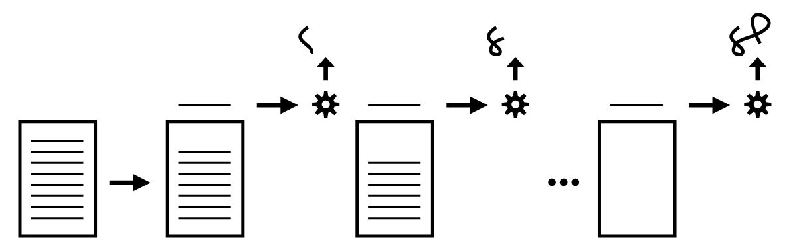

# You Don't Know JS Yet: Get Started

Kyle Simpson - 2020

## Table of Contents

- [Foreword](#foreword)
- [Preface](#preface)
  - [The Parts](#the-parts)
  - [The Title?](#the-title)
  - [The Mission](#the-mission)
  - [The Path](#the-path)
- [Chapter 1: What Is JavaScript?](#chapter-1-what-is-javascript)
  - [About This Book](#about-this-book)
  - [What’s With That Name?](#whats-with-that-name)
  - [Language Specification](#language-specification)
  - [Many Faces](#many-faces)
  - [Backwards & Forwards](#backwards--forwards)
  - [What’s in an Interpretation?](#whats-in-an-interpretation)
  - [Strictly Speaking](#strictly-speaking)
  - [Defined](#defined)
- [Chapter 2: Surveying JS](#chapter-2-surveying-js)
  - [Each File is a Program](#each-file-is-a-program)
  - [Values](#values)
    - [Arrays And Objects](#arrays-and-objects)
    - [Value Type Determination](#value-type-determination)
    - [Warning](#warning)
  - [Declaring and Using Variables](#declaring-and-using-variables)
  - [Functions](#functions)
  - [Comparisons](#comparisons)
    - [Coercive Comparisons](#coercive-comparisons)
  - [How We Organize in JS](#how-we-organize-in-js)
    - [Classes](#classes)
    - [Modules](#modules)
  - [The Rabbit Hole Deepens](#the-rabbit-hole-deepens)
- [Chapter 3: Digging to the Roots of JS](#chapter-3-digging-to-the-roots-of-js)
  - [Iteration](#iteration)
    - [Consuming Iterators](#consuming-iterators)
    - [Iterables](#iterables)
  - [Closure](#closure)
  - [this Keyword](#this-keyword)
  - [Prototypes](#prototypes)
    - [Object Linkage](#object-linkage)
    - [`this` Revisited](#this-revisited)
  - [Asking “Why?”](#asking-why)
- [Chapter 4: The Bigger Picture](#chapter-4-the-bigger-picture)
  - [Pillar 1: Scope and Closure](#pillar-1-scope-and-closure)
  - [Pillar 2: Prototypes](#pillar-2-prototypes)
  - [Pillar 3: Types and Coercion](#pillar-3-types-and-coercion)
  - [With the Grain](#with-the-grain)
  - [In Order](#in-order)
- [Appendix A: Exploring Further](#appendix-a-exploring-further)
  - [Values vs. References](#values-vs-references)
  - [So Many Function Forms](#so-many-function-forms)
  - [Coercive Conditional Comparison](#coercive-conditional-comparison)
  - [Prototypal “Classes”](#prototypal-classes)
- [Appendix B: Practice, Practice, Practice!](#appendix-b-practice-practice-practice)
  - [Practicing Comparisons](#practicing-comparisons)
  - [Practicing Closure](#practicing-closure)
  - [Practicing Prototypes](#practicing-prototypes)
  - [Suggested Solutions](#suggested-solutions)

## Foreword

This is what this book series is great for. It’s not just for someone picking up the language for the first time (though it’s for them, too); it’s for all software craftspeople who want to master their tools, who want to understand the ins and outs of their trade, and who want to select the proper methods for solving problems.

## Preface

### The Parts

These books approach JavaScript intentionally opposite of how The Good Parts treats the language. No, that doesn’t mean we’re looking at the bad parts, but rather, exploring all the parts.

You may have been told, or felt yourself, that JS is a deeply flawed language that was poorly designed and inconsistently implemented. Many have asserted that it’s the worst most popular language in the world; that nobody writes JS because they want to, only because they have to given its place at the center of the web. That’s a ridiculous, unhealthy, and wholly condescending claim. Millions of developers write JavaScript every day, and many of them appreciate and respect the language. Like any great language, it has its brilliant parts as well as its scars. Even the creator of JavaScript himself, Brendan Eich, laments some of those parts as mistakes. But he’s wrong: they weren’t mistakes at all. JS is what it is today—the world’s most ubiquitous and thus most influential programming language—precisely because of all those parts.

Don’t buy the lie that you should only learn and use a small collection of good parts while avoiding all the bad stuff. Don’t buy the “X is the new Y” snake oil, that some new feature of the language instantly relegates all usage of a previous feature as obsolete and ignorant.

Every part of JS is useful. Some parts are more useful than others. Some parts require you to be more careful and intentional.

You should go about learning all parts of JavaScript, and where appropriate, use them!

### The Title?

Most JS developers don’t take the time to really understand how the code that they write works. They know that it works—that it produces a desired outcome. But they either don’t understand exactly how, or worse, they have an inaccurate mental model for the how that falters on closer scrutiny.

Why is one way better or more appropriate than the other half-dozen ways you could have accomplished it? Why do all the “popular kids” say to do X with your code, but it turns out that Y might be a better choice?

You don’t finish knowing everything about JS, you just keep learning more and more as you spend more time with the language. And the deeper you go, the more you revisit what you knew before, and you re-learn it from that more experienced perspective.

You can always know JS better than you currently do.

### The Mission

Far too often, what counts is generally just the result of the program, not how the program is written or how/why it works.

You will always be more effective in your development work if you more completely understand how your code works than you are solely just getting it to produce a desired outcome.

Good enough to work is not, and should not be, good enough.

All developers regularly struggle with some piece of code not working correctly, and they can’t figure out why. But far too often, JS developers will blame this on the language rather than admitting it’s their own understanding that is falling short.

### The Path

My suggestion is you take your time going through YDKJSY. Take one chapter, read it completely through start to finish, and then go back and re-read it section by section. Stop in between each section, and practice the code or ideas from that section. For larger concepts, it probably is a good idea to expect to spend several days digesting, re-reading, practicing, then digesting some more.

The deeper you understand JS, the more questions you will ask and the more you will have to explore! That’s what I find so exciting!

## Chapter 1: What Is JavaScript?

You don’t know JS, yet. Neither do I, not fully anyway. None of us do. But we can all start getting to know JS better.

We need to start by covering a variety of important background housekeeping details, clearing up some myths and misconceptions about what the language really is (and isn’t!).

### About This Book

Knowing JS is not a destination, it’s a direction

Three main pillars around which the JS language is organized: scope/closures, prototypes/objects, and types/coercion. JS is a broad and sophisticated language, with many features and capabilities. But all of JS is founded on these three foundational pillars.

A good start always depends on a solid first step.

### What’s With That Name?

JavaScript is an artifact of marketing shenanigans. When Brendan Eich first conceived of the language, he code-named it Mocha. Internally at Netscape, the brand LiveScript was used. But when it came time to publicly name the language, “JavaScript” won the vote.

There are some superficial resemblances between JavaScript’s code and Java code... ...both languages targeting developers with assumed syntax expectations from C (and to an extent, C++). For example, we use the { to begin a block of code and the } to end that block of code, just like C/C++ and Java. We also use the ; to punctuate the end of a statement.

The official name of the language specified by TC39 and formalized by the ECMA standards body is ECMAScript. 

“Java is to JavaScript as ham is to hamster.” –Jeremy Keith, 2009

### Language Specification

TC39, the technical steering committee that manages JS. Their primary task is managing the official specification for the language.

ES2019 happens to be the 10th major numbered specification/revision since JS’s inception in 1995, so in the specification’s official URL as hosted by ECMA, you’ll find “10.0”: https://www.ecma-international.org/ecma-262/10.0/

All TC39 proposals progress through a five-stage process—of course, since we’re programmers, it’s 0-based!—Stage 0 through Stage 4. You can read more about the Stage process here: https://tc39.es/process-document/

Lots of ideas that non-TC39 members “propose,” through informal means such as social media or blog posts, are really “pre-stage 0.” You have to get a TC39 member to champion a proposal for it to be considered “Stage 0” officially.

All proposals are managed in the open, on TC39’s Github repository: https://github.com/tc39/proposals

There’s just one JS, the official standard as maintained by TC39 and ECMA.

The Web Rules Everything About (JS)

For the most part, the JS defined in the specification and the JS that runs in browser-based JS engines is the same. But there are some differences that must be considered. Sometimes the JS specification will dictate some new or refined behavior, and yet that won’t exactly match with how it works in browser-based JS engines... ...occasionally, TC39 will decide the specification should stick firm on some point even though it is unlikely that browser-based JS engines will ever conform. The solution? Appendix B, “Additional ECMAScript Features for Web Browsers”.1 The JS specification includes this appendix to detail out any known mismatches between the official JS specification and the reality of JS on the web. In other words, these are exceptions that are allowed only for web JS; other JS environments must stick to the letter of the law... ...additions to JS (syntax and APIs) that web JS includes, again for historical reasons, but which TC39 does not plan to formally specify in the core of JS.

Wherever possible, adhere to the JS specification and don’t rely on behavior that’s only applicable in certain JS engine environments.

Various JS environments (like browser JS engines, Node.js, etc.) add APIs into the global scope of your JS programs that give you environment-specific capabilities, like being able to pop an alert-style box in the user’s browser.

`console.log(..)` (and all the other `console.*` methods!). These are not specified in JS, but because of their universal utility are defined by pretty much every JS environment, according to a roughly agreed consensus.

an `alert(..)` call is JS, but `alert` itself is really just a guest, not part of the official JS specification.

Developer Tools are… tools for developers. Their primary purpose is to make life easier for developers. They prioritize DX (Developer Experience). It is not a goal of such tools to accurately and purely reflect all nuances of strict-spec JS behavior. As such, there’s many quirks that may act as “gotchas” if you’re treating the console as a pure JS environment.

We can’t and shouldn’t expect such tools to always adhere strictly to the way JS programs are handled, because that’s not the purpose of these tools.

some examples of quirks that have been true at various points in different JS console environments, to reinforce my point about not assuming native JS behavior while using them:
- Whether a `var` or `function` declaration in the top-level “global scope” of the console actually creates a real global variable (and mirrored `window` property, and vice versa!).
- What happens with multiple `let` and `const` declarations in the top-level “global scope.”
- Whether `"use strict";` on one line-entry (pressing `<enter>` after) enables strict mode for the rest of that console session, the way it would on the first line of a .js file, as well as whether you can use `"use strict";` beyond the “first line” and still get strict mode turned on for that session.
- How non-strict mode `this` default-binding works for function calls, and whether the “global object” used will contain expected global variables.
- How hoisting (see Book 2, Scope & Closures) works across multiple line entries.
- ...several others

The developer console is not trying to pretend to be a JS compiler that handles your entered code exactly the same way the JS engine handles a .js file. It’s trying to make it easy for you to quickly enter a few lines of code and see the results immediately. These are entirely different use cases, and as such, it’s unreasonable to expect one tool to handle both equally.

Think of the console as a “JS-friendly” environment. That’s useful in its own right.

### Many Faces

No matter what a program’s individual style may be, the big picture divisions around paradigms are almost always evident at first glance of any program.

Paradigm-level code categories include procedural, object-oriented (OO/classes), and functional (FP):
- Procedural style organizes code in a top-down, linear progression through a pre-determined set of operations, usually collected together in related units called procedures.
- OO style organizes code by collecting logic and data together into units called classes.
- FP style organizes code into functions (pure computations as opposed to procedures), and the adaptations of those functions as values.

Paradigms are neither right nor wrong. They’re orientations that guide and mold how programmers approach problems and solutions, how they structure and maintain their code.

JavaScript is most definitely a multi-paradigm language. You can write procedural, class-oriented, or FP-style code, and you can make those decisions on a line-by-line basis instead of being forced into an all-or-nothing choice.

### Backwards & Forwards

One of the most foundational principles that guides JavaScript is preservation of backwards compatibility.

Backwards compatibility means that once something is accepted as valid JS, there will not be a future change to the language that causes that code to become invalid JS.

TC39 members often proclaim, “we don’t break the web!”

Maintaining backwards compatibility, stretched out across almost 25 years of the language’s history, creates an enormous burden and a whole slew of unique challenges. You’d be hard pressed to find many other examples in computing of such a commitment to backwards compatibility.

There are some small exceptions to this rule. JS has had some backwards-incompatible changes, but TC39 is extremely cautious in doing so. They study existing code on the web (via browser data gathering) to estimate the impact of such breakage, and browsers ultimately decide and vote on whether they’re willing to take the heat from users for a very small-scale breakage weighed against the benefits of fixing or improving some aspect of the language for many more sites (and users). These kinds of changes are rare, and are almost always in corner cases of usage that are unlikely to be observably breaking in many sites.

Being forwards-compatible means that including a new addition to the language in a program would not cause that program to break if it were run in an older JS engine. JS is not forwards-compatible, despite many wishing such, and even incorrectly believing the myth that it is.

Though JS isn’t, and can’t be, forwards-compatible, it’s critical to recognize JS’s backwards compatibility, including the enduring benefits to the web and the constraints and difficulties it places on JS as a result.

Since JS is not forwards-compatible, it means that there is always the potential for a gap between code that you can write that’s valid JS, and the oldest engine that your site or application needs to support. If you run a program that uses an ES2019 feature in an engine from 2016, you’re very likely to see the program break and crash.

Transpiling is a contrived and community-invented term to describe using a tool to convert the source code of a program from one form to another (but still as textual source code).

A developer may write a snippet of code like:
```
if (something) {
    let x = 3;
    console.log(x);
}
else {
    let x = 4;
    console.log(x);
}
```

the Babel transpiler might convert that code to look like this:

```
var x$0, x$1;
if (something) {
    x$0 = 3;
    console.log(x$0);
}
else {
    x$1 = 4;
    console.log(x$1);
}
```

Developers should focus on writing the clean, new syntax forms, and let the tools take care of producing a forwards-compatible version of that code that is suitable to deploy and run on the oldest-supported JS engine environments.

Missing API method that was only recently added, the most common solution is to provide a definition for that missing API method that stands in and acts as if the older environment had already had it natively defined. This pattern is called a polyfill (aka “shim”).

Always write code using the most appropriate features to communicate its ideas and intent effectively.

Avoid negatively impacting the code’s readability by trying to manually adjust for the syntax/API gaps. That’s what tools are for!

### What’s in an Interpretation?

A long-debated question for code written in JS: is it an interpreted script or a compiled program? The majority opinion seems to be that JS is an interpreted (scripting) language. But the truth is more complicated than that... ...The real reason it matters to have a clear picture on whether JS is interpreted or compiled relates to the nature of how errors are handled.

Historically, scripted or interpreted languages were executed in generally a top-down and line-by-line fashion; there’s typically not an initial pass through the program to process it before execution begins (see Figure 1).



an error on line 5 of a program won’t be discovered until lines 1 through 4 have already executed... ...Depending on context, deferring error handling to the line the error occurs on may be a desirable or undesirable effect. Compare that to languages which do go through a processing step (typically, called parsing) before any execution occurs, as illustrated in Figure 2:


All compiled languages are parsed. So a parsed language is quite a ways down the road toward being compiled already. In classic compilation theory, the last remaining step after parsing is code generation: producing an executable form.

Parsed languages usually also perform code generation before execution, so it’s not that much of a stretch to say that, in spirit, they’re compiled languages.

So JS is a parsed language, but is it compiled? The answer is closer to yes than no. The parsed JS is converted to an optimized (binary) form, and that “code” is subsequently executed (Figure 2); the engine does not commonly switch back into line-by-line execution (like Figure 2) mode after it has finished all the hard work of parsing—most languages/engines wouldn’t, because that would be highly inefficient. To be specific, this “compilation” produces a binary byte code (of sorts), which is then handed to the “JS virtual machine” to execute. Some like to say this VM is “interpreting” the byte code. But then that means Java, and a dozen other JVM-driven languages, for that matter, are interpreted rather than compiled. Of course, that contradicts the typical assertion that Java/etc are compiled languages. Interestingly, while Java and JavaScript are very different languages, the question of interpreted/compiled is pretty closely related between them!

The entire flow of a JS source program: 
1. After a program leaves a developer’s editor, it gets transpiled by Babel, then packed by Webpack (and perhaps half a dozen other build processes), then it gets delivered in that very different form to a JS engine.
2. The JS engine parses the code to an AST.
3. Then the engine converts that AST to a kind-of byte code, a binary intermediate representation (IR), which is then refined/converted even further by the optimizing JIT compiler.
4. Finally, the JS VM executes the program.
To visualize thoses steps, again:


In spirit, if not in practice, JS is a compiled language. And again, the reason that matters is, since JS is compiled, we are informed of static errors (such as malformed syntax) before our code is executed. That is a substantively different interaction model than we get with traditional “scripting” programs, and arguably more helpful!

Web Assembly (WASM)... ...In 2013, engineers from Mozilla Firefox demonstrated a port of the Unreal 3 game engine from C to JS... ...the JS version of the Unreal engine’s code used a style of code that favored a subset of the JS language, named “ASM.js”... ...ASM.js was introduced as one way of addressing the pressures on the runtime performance of JS. But it’s important to note that ASM.js was never intended to be code that was authored by developers, but rather a representation of a program having been transpiled from another language (such as C), where these typing “annotations” were inserted automatically by the tooling. Several years after ASM.js demonstrated the validity of tooling-created versions of programs that can be processed more efficiently by the JS engine, another group of engineers (also, initially, from Mozilla) released Web Assembly (WASM).

WASM is similar to ASM.js in that its original intent was to provide a path for non-JS programs (C, etc.) to be converted to a form that could run in the JS engine.

WASM is a representation format more akin to Assembly (hence, its name) that can be processed by a JS engine by skipping the parsing/compilation that the JS engine normally does. The parsing/compilation of a WASM-targeted program happen ahead of time (AOT); what’s distributed is a binary-packed program ready for the JS engine to execute with very minimal processing.

In other words, WASM relieves the pressure to add features to JS that are mostly/exclusively intended to be used by transpiled programs from other languages. That means JS feature development can be judged (by TC39) without being skewed by interests/demands in other language ecosystems, while still letting those languages have a viable path onto the web.

WASM isn’t only for the web, and WASM also isn’t JS. Ironically, even though WASM runs in the JS engine, the JS language is one of the least suitable languages to source WASM programs with, because WASM relies heavily on static typing information.

WASM will not replace JS. WASM significantly augments what the web (including JS) can accomplish. That’s a great thing, entirely orthogonal to whether some people will use it as an escape hatch from having to write JS.

### Strictly Speaking

Strict mode shouldn’t be thought of as a restriction on what you can’t do, but rather as a guide to the best way to do things so that the JS engine has the best chance of optimizing and efficiently running the code.

Most strict mode controls are in the form of early errors, meaning errors that aren’t strictly syntax errors but are still thrown at compile time (before the code is run). 

The best mindset is that strict mode is like a linter reminding you how JS should be written to have the highest quality and best chance at performance.

Strict mode can alternatively be turned on per-function scope, with exactly the same rules about its surroundings:

```js
function someOperations() {
    // whitespace and comments are fine here
    "use strict";
    // all this code will run in strict mode
}
```

The only valid reason to use a per-function approach to strict mode is when you are converting an existing non-strict mode program file and need to make the changes little by little over time. Otherwise, it’s vastly better to simply turn strict mode on for the entire file/program.

ES6 modules assume strict mode, so all code in such files is automatically defaulted to strict mode.

### Defined

JS is an implementation of the ECMAScript standard... ...which is guided by the TC39 committee and hosted by ECMA. It runs in browsers and other JS environments such as Node.js. JS is a multi-paradigm language, meaning the syntax and capabilities allow a developer to mix and match (and bend and reshape!) concepts from various major paradigms, such as procedural, object-oriented (OO/classes), and functional (FP). JS is a compiled language, meaning the tools (including the JS engine) process and verify a program (reporting any errors!) before it executes.

## Chapter 2: Surveying JS

The best way to learn JS is to start writing JS.

We’re just going to survey some of the major topic areas of the language... ...Please don’t expect this chapter to be a quick read. It’s long and there’s plenty of detail to chew on. Take your time.

### Each File is a Program

In JS, each standalone file is its own separate program.

The reason this matters is primarily around error handling. Since JS treats files as programs, one file may fail (during parse/compile or execution) and that will not necessarily prevent the next file from being processed.

Ensure that each file works properly, and that to whatever extent possible, they handle failure in other files as gracefully as possible.

Many projects use build process tools that end up combining separate files from the project into a single file to be delivered to a web page. When this happens, JS treats this single combined file as the entire program.

The only way multiple standalone .js files act as a single program is by sharing their state (and access to their public functionality) via the “global scope.” They mix together in this global scope namespace, so at runtime they act as as whole.

Though you wouldn’t typically think about a module—a collection of state and publicly exposed methods to operate on that state—as a standalone program, JS does in fact still treat each module separately. Similar to how “global scope” allows standalone files to mix together at runtime, importing a module into another allows runtime interoperation between them.

Regardless of which code organization pattern (and loading mechanism) is used for a file (standalone or module), you should still think of each file as its own (mini) program, which may then cooperate with other (mini) programs to perform the functions of your overall application.

### Values

The most fundamental unit of information in a program is a value. Values are data. They’re how the program maintains state. 

Values come in two forms in JS: primitive and object.

Values are embedded in programs using literals: `greeting("My name is Kyle.");` In this program, the value `"My name is Kyle."` is a primitive string literal; strings are ordered collections of characters, usually used to represent words and sentences.

The choice of which quote character is entirely stylistic. The important thing, for code readability and maintainability sake, is to pick one and to use it consistently throughout the program.

The better approach is to use `"` or `'` (again, pick one and stick to it!) for strings unless you need interpolation; reserve ` `` ` only for strings that will include interpolated expressions.

Numbers are most often used in programs for counting steps, such as loop iterations, and accessing information in numeric positions (i.e., an array index).

JS array indices are 0-based (0 is the first position).

In addition to strings, numbers, and booleans, two other primitive values in JS programs are null and undefined. While there are differences between them (some historic and some contemporary), for the most part both values serve the purpose of indicating emptiness (or absence) of a value.

#### Arrays And Objects

Arrays are a special type of object that’s comprised of an ordered and numerically indexed list of data

Functions, like arrays, are a special kind (aka, sub-type) of object. 

Objects are more general: an unordered, keyed collection of any various values.

#### Value Type Determination

For distinguishing values, the typeof operator tells you its built-in type, if primitive, or "object" otherwise:

```js
typeof 42;                  // "number"
typeof "abc";               // "string"
typeof true;                // "boolean"
typeof undefined;           // "undefined"
typeof null;                // "object" -- oops, bug!
typeof { "a": 1 };          // "object"
typeof [1,2,3];             // "object"
typeof function hello(){};  // "function"
```

#### Warning

typeof null unfortunately returns "object" instead of the expected "null". Also, typeof returns the specific "function" for functions, but not the expected "array" for arrays.

Converting from one value type to another... ...is referred to in JS as “coercion.” 

### Declaring and Using Variables

Think of variables as just containers for values... ...There are various syntax forms that declare variables (aka, “identifiers”), and each form has different implied behaviors.

The var keyword declares a variable to be used in that part of the program, and optionally allows initial value assignment.

The let keyword has some differences to var, with the most obvious being that let allows a more limited access to the variable than var. This is called “block scoping” as opposed to regular or function scoping.

```
var adult = true;

if (adult) {
    var name = "Kyle";
    let age = 39;
    console.log("Shhh, this is a secret!");
}

console.log(name);
// Kyle

console.log(age);
// Error!
```

The attempt to access age outside of the if statement results in an error, because age was block-scoped to the if, whereas name was not.

Block-scoping is very useful for limiting how widespread variable declarations are in our programs, which helps prevent accidental overlap of their names.

It’s very common to suggest that var should be avoided in favor of let (or const!),... ...I believe this to be overly restrictive advice and ultimately unhelpful. It’s assuming you are unable to learn and use a feature properly in combination with other features. I believe you can and should learn any features available, and use them where appropriate!

const declared variables are not “unchangeable”, they just cannot be re-assigned. It’s ill-advised to use const with object values, because those values can still be changed even though the variable can’t be re-assigned. This leads to potential confusion down the line.

The best semantic use of a const is when you have a simple primitive value that you want to give a useful name to, such as using myBirthday instead of true. This makes programs easier to read.

If you stick to using const only with primitive values, you avoid any confusion of re-assignment (not allowed) vs. mutation (allowed)! That’s the safest and best way to use const.

### Functions

In JS, we should consider “function” to take the broader meaning of another related term: “procedure.” A procedure is a collection of statements that can be invoked one or more times, may be provided some inputs, and may give back one or more outputs.

```js
function awesomeFunction(coolThings) {
    // ..
    return amazingStuff;
}
```

This is called a function declaration because it appears as a statement by itself, not as an expression in another statement. The association between the identifier awesomeFunction and the function value happens during the compile phase of the code, before that code is executed. In contrast to a function declaration statement, a function expression can be defined and assigned like this:

```js
// let awesomeFunction = ..
// const awesomeFunction = ..
var awesomeFunction = function(coolThings) {
    // ..
    return amazingStuff;
};
```

This function is an expression that is assigned to the variable awesomeFunction. Different from the function declaration form, a function expression is not associated with its identifier until that statement during runtime.

In JS, functions are values that can be assigned (as shown in this snippet) and passed around. In fact, JS functions are a special type of the object value type. Not all languages treat functions as values, but it’s essential for a language to support the functional programming pattern, as JS does.

Since functions are values, they can be assigned as properties on objects:
```js
var whatToSay = {
    greeting() {
        console.log("Hello!");
    },
    question() {
        console.log("What's your name?");
    },
    answer() {
        console.log("My name is Kyle.");
    }
};

whatToSay.greeting();
// Hello!
```

### Comparisons

We must be aware of the nuanced differences between an equality comparison and an equivalence comparison.

Specifically, `===` disallows any sort of type conversion (aka, “coercion”) in its comparison, where other JS comparisons do allow coercion.

The `===` operator is designed to lie in two cases of special values: NaN and -0. Consider:

```js
NaN === NaN;            // false
0 === -0;               // true
```

In the case of NaN, the === operator lies and says that an occurrence of NaN is not equal to another NaN. In the case of -0 (yes, this is a real, distinct value you can use intentionally in your programs!), the === operator lies and says it’s equal to the regular 0 value.

You could think of `Object.is(..)` as the “quadruple-equals” `====`, the really-really-strict comparison!

When we consider comparisons of object values (non-primitives). Consider:
```js
[ 1, 2, 3 ] === [ 1, 2, 3 ];    // false
{ a: 42 } === { a: 42 }         // false
(x => x * 2) === (x => x * 2)   // false
```
What’s going on here?... ...JS does not define `===` as structural equality for object values. Instead, `===` uses identity equality for object values.

In JS, all object values are held by reference are assigned and passed by reference-copy, and to our current discussion, are compared by reference (identity) equality. Consider:
```js
var x = [ 1, 2, 3 ];

// assignment is by reference-copy, so
// y references the *same* array as x,
// not another copy of it.
var y = x;

y === x;              // true
y === [ 1, 2, 3 ];    // false
x === [ 1, 2, 3 ];    // false
```
In this snippet, y `===` x is true because both variables hold a reference to the same initial array... ...The array structure and contents don’t matter in this comparison, only the reference identity.

JS doesn’t provide structural equality comparison because it’s almost intractable to handle all the corner cases!

#### Coercive Comparisons

Coercion means a value of one type being converted to its respective representation in another type (to whatever extent possible). 

Few JS features draw more ire in the broader JS community than the `==` operator, generally referred to as the “loose equality” operator. The majority of all writing and public discourse on JS condemns this operator as poorly designed and dangerous/bug-ridden when used in JS programs. Even the creator of the language himself, Brendan Eich, has lamented how it was designed as a big mistake.

The `==` operator performs an equality comparison similarly to how the `===` performs it. In fact, both operators consider the type of the values being compared. And if the comparison is between the same value type, both `==` and `===` do exactly the same thing, no difference whatsoever.

If the value types being compared are different, the `==` differs from `===` in that it allows coercion before the comparison

Relational comparison operators like <, > (and even <= and >=). Just like `==,` these operators will perform as if they’re “strict” if the types being relationally compared already match, but they’ll allow coercion first (generally, to numbers) if the types differ. Consider:
```js
var arr = [ "1", "10", "100", "1000" ];
for (let i = 0; i < arr.length && arr[i] < 500; i++) {
    // will run 3 times
}
```

Relational operators typically use numeric comparisons, except in the case where both values being compared are already strings; in this case, they use alphabetical (dictionary-like) comparison of the strings:

```js
var x = "10";
var y = "9";

x < y;      // true, watch out!
```

There’s no way to get these relational operators to avoid coercion, other than to just never use mismatched types in the comparisons. That’s perhaps admirable as a goal, but it’s still pretty likely you’re going to run into a case where the types may differ.

### How We Organize in JS

Two major patterns for organizing code (data and behavior) are used broadly across the JS ecosystem: classes and modules.

Being proficient in JS requires understanding both patterns and where they are appropriate (and not!).

#### Classes

A class in a program is a definition of a “type” of custom data structure that includes both data and behaviors that operate on that data. Classes define how such a data structure works, but classes are not themselves concrete values. To get a concrete value that you can use in the program, a class must be instantiated (with the new keyword) one or more times.

Behavior (methods) can only be called on instances (not the classes themselves)

The class mechanism allows packaging data (text and pages) to be organized together with their behaviors... ...The same program could have been built without any class definitions, but it would likely have been much less organized, harder to read and reason about, and more susceptible to bugs and subpar maintenance.

Class Inheritance... ...Another aspect inherent to traditional “class-oriented” design, though a bit less commonly used in JS, is “inheritance” (and “polymorphism”)

The fact that both the inherited and overridden methods can have the same name and co-exist is called polymorphism.

Inheritance is a powerful tool for organizing data/behavior in separate logical units (classes), but allowing the child class to cooperate with the parent by accessing/using its behavior and data.

#### Modules

The module pattern has essentially the same goal as the class pattern, which is to group data and behavior together into logical units. Also like classes, modules can “include” or “access” the data and behaviors of other modules, for cooperation sake. But modules have some important differences from classes. Most notably, the syntax is entirely different.

ES6 added a module syntax form to native JS syntax... ...But from the early days of JS, modules was an important and common pattern that was leveraged in countless JS programs, even without a dedicated syntax.

The key hallmarks of a classic module are an outer function (that runs at least once), which returns an “instance” of the module with one or more functions exposed that can operate on the module instance’s internal (hidden) data.

The `class` form stores methods and data on an object instance, which must be accessed with the `this.` prefix. With modules, the methods and data are accessed as identifier variables in scope, without any `this.` prefix. With `class`, the “API” of an instance is implicit in the class definition—also, all data and methods are public. With the module factory function, you explicitly create and return an object with any publicly exposed methods, and any data or other unreferenced methods remain private inside the factory function.

First, there’s no wrapping function to define a module. The wrapping context is a file. ESMs are always file-based; one file, one module. Second, you don’t interact with a module’s “API” explicitly, but rather use the `export` keyword to add a variable or method to its public API definition. If something is defined in a module but not `export`ed, then it stays hidden (just as with classic modules). Third, and maybe most noticeably different from previously discussed patterns, you don’t “instantiate” an ES module, you just `import` it to use its single instance. ESMs are, in effect, “singletons,” in that there’s only one instance ever created, at first `import` in your program, and all other `import`s just receive a reference to that same single instance. If your module needs to support multiple instantiations, you have to provide a classic module-style factory function on your ESM definition for that purpose.

```js
function printDetails(title,author,pubDate) {
    console.log(`
        Title: ${ title }
        By: ${ author }
        ${ pubDate }
    `);
}

export function create(title,author,pubDate) {
    var publicAPI = {
        print() {
            printDetails(title,author,pubDate);

        }
    };

    return publicAPI;
}
```

To import and use this module, from another ES module like `blogpost.js`:

```js
import { create as createPub } from "publication.js";

function printDetails(pub,URL) {
    pub.print();
    console.log(URL);
}

export function create(title,author,pubDate,URL) {
    var pub = createPub(title,author,pubDate);

    var publicAPI = {
        print() {
            printDetails(pub,URL);
        }
    };

    return publicAPI;
}
```

And finally, to use this module, we import into another ES module like `main.js`:

```js
import { create as newBlogPost } from "blogpost.js";

var forAgainstLet = newBlogPost(
    "For and against let",
    "Kyle Simpson",
    "October 27, 2014",
    "https://davidwalsh.name/for-and-against-let"
);

forAgainstLet.print();
// Title: For and against let
// By: Kyle Simpson
// October 27, 2014
// https://davidwalsh.name/for-and-against-let
```

ES modules can use classic modules internally if they need to support multiple-instantiation. Alternatively, we could have exposed a `class` from our module instead of a `create(..)` factory function, with generally the same outcome. However, since you’re already using ESM at that point, I’d recommend sticking with classic modules instead of `class`.

If your module only needs a single instance, you can skip the extra layers of complexity: `export` its public methods directly.

### The Rabbit Hole Deepens

In the next chapter, we’re going to dig much deeper into some important aspects of how JS works at its core. But before you follow that rabbit hole deeper, make sure you’ve taken adequate time to fully digest what we’ve just covered here.

## Chapter 3: Digging to the Roots of JS

This chapter should begin to answer some of the “Why?” questions that may be cropping up as you explore JS... ...Our goal here is still just to get started, and become more comfortable with, the feel of JS, how it ebbs and flows... ...As I’ve said a dozen times already, take your time. Even still, you’ll probably finish this chapter with remaining questions. That’s OK, because there’s a whole book series ahead of you to keep exploring!

### Iteration

Since programs are essentially built to process data (and make decisions on that data), the patterns used to step through the data have a big impact on the program’s readability. The iterator pattern has been around for decades, and suggests a “standardized” approach to consuming data from a source one chunk at a time. The idea is that it’s more common and helpful to iterate the data source—to progressively handle the collection of data by processing the first part, then the next, and so on, rather than handling the entire set all at once.

The iterator pattern defines a data structure called an “iterator” that has a reference to an underlying data source (like the query result rows), which exposes a method like `next()`. Calling `next()` returns the next piece of data (i.e., a “record” or “row” from a database query).

The importance of the iterator pattern is in adhering to a standard way of processing data iteratively, which creates cleaner and easier to understand code, as opposed to having every data structure/source define its own custom way of handling its data.

ES6 standardized a specific protocol for the iterator pattern directly in the language. The protocol defines a `next()` method whose return is an object called an iterator result; the object has value and done properties, where done is a boolean that is `false` until the iteration over the underlying data source is complete.

#### Consuming Iterators

This approach is rather manual, so ES6 also included several mechanisms (syntax and APIs) for standardized consumption of these iterators. One such mechanism is the `for..of` loop:

```js
// given an iterator of some data source:
var it = /* .. */;

// loop over its results one at a time
for (let val of it) {
    console.log(`Iterator value: ${ val }`);
}
// Iterator value: ..
// Iterator value: ..
// ..
```
The `...` operator... ...has two symmetrical forms: spread and rest (or gather, as I prefer). The spread form is an iterator-consumer. To spread an iterator, you have to have something to spread it into.

#### Iterables

The iterator-consumption protocol is technically defined for consuming iterables; an iterable is a value that can be iterated over.

The protocol automatically creates an iterator instance from an iterable, and consumes just that iterator instance to its completion. This means a single iterable could be consumed more than once; each time, a new iterator instance would be created and used.

ES6 defined the basic data structure/collection types in JS as iterables. This includes strings, arrays, maps, sets, and others.

Since arrays are iterables, we can shallow-copy an array using iterator consumption via the `...` spread operator:

```js
var arrCopy = [ ...arr ];
```

Maps have a different default iteration than seen here, in that the iteration is not just over the map’s values but instead its entries. An entry is a tuple (2-element array) including both a key and a value.

```js
// given two DOM elements, `btn1` and `btn2`
var buttonNames = new Map();
buttonNames.set(btn1,"Button 1");
buttonNames.set(btn2,"Button 2");

for (let [btn,btnName] of buttonNames) {
    btn.addEventListener("click",function onClick(){
        console.log(`Clicked ${ btnName }`);
    });
}
```

In the `for..of` loop over the default map iteration, we use the `[btn,btnName]` syntax (called “array destructuring”) to break down each consumed tuple into the respective key/value pairs (`btn1` / `"Button 1"` and `btn2` / `"Button 2"`).

if we want to consume only the values of the above `buttonNames` map, we can call `values()` to get a values-only iterator:

```js
for (let btnName of buttonNames.values()) {
    console.log(btnName);
}
// Button 1
// Button 2
```

For the most part, all built-in iterables in JS have three iterator forms available: keys-only (`keys()`), values-only (`values()`), and entries (`entries()`).

We started by talking about consuming **iterators**, but then switched to talking about iterating over **iterables**. The iteration-consumption protocol expects an iterable, but the reason we can provide a direct iterator is that an iterator is just an iterable of itself! When creating an iterator instance from an existing iterator, the iterator itself is returned.

### Closure

Closure is one of the most pervasive programming functionalities across a majority of languages. It might even be as important to understand as variables or loops; that’s how fundamental it is. Yet it feels kind of hidden, almost magical. And it’s often talked about in either very abstract or very informal terms, which does little to help us nail down exactly what it is.

The presence or lack of closure is sometimes the cause of bugs (or even the cause of performance issues).

Closure is when a function remembers and continues to access variables from outside its scope, even when the function is executed in a different scope.

First, closure is part of the nature of a function. Objects don’t get closures, functions do. Second, to observe a closure, you must execute a function in a different scope than where that function was originally defined.

These closures are not a snapshot of the msg variable’s value; they are a direct link and preservation of the variable itself. That means closure can actually observe (or make!) updates to these variables over time.

```js
function counter(step = 1) {
    var count = 0;
    return function increaseCount(){
        count = count + step;
        return count;
    };
}

var incBy1 = counter(1);
var incBy3 = counter(3);

incBy1();       // 1
incBy1();       // 2

incBy3();       // 3
incBy3();       // 6
incBy3();       // 9
```

Each instance of the inner `increaseCount()` function is closed over both the `count` and `step` variables from its outer `counter(..)` function’s scope. `step` remains the same over time, but `count` is updated on each invocation of that inner function. Since closure is over the variables and not just snapshots of the values, these updates are preserved.

It’s not necessary that the outer scope be a function—it usually is, but not always—just that there be at least one variable in an outer scope accessed from an inner function:

```js
for (let [idx,btn] of buttons.entries()) {
    btn.addEventListener("click",function onClick(){
       console.log(`Clicked on button (${ idx })!`);
    });
}
```

Because this loop is using let declarations, each iteration gets new block-scoped (aka, local) idx and btn variables; the loop also creates a new inner `onClick(..)` function each time. That inner function closes over idx, preserving it for as long as the click handler is set on the `btn`. So when each button is clicked, its handler can print its associated index value, because the handler remembers its respective idx variable.

### this Keyword

Functions also have another characteristic besides their scope that influences what they can access. This characteristic is best described as an execution context, and it’s exposed to the function via its `this` keyword.

Scope is static and contains a fixed set of variables available at the moment and location you define a function, but a function’s execution context is dynamic, entirely dependent on how it is called (regardless of where it is defined or even called from).

`this` is not a fixed characteristic of a function based on the function’s definition, but rather a dynamic characteristic that’s determined each time the function is called.

One way to think about the execution context is that it’s a tangible object whose properties are made available to a function while it executes. Compare that to scope, which can also be thought of as an object; except, the scope object is hidden inside the JS engine, it’s always the same for that function, and its properties take the form of identifier variables available inside the function.

```js
function classroom(teacher) {
    return function study() {
        console.log(
            `${ teacher } says to study ${ this.topic }`
        );
    };
}
var assignment = classroom("Kyle");
```

The outer `classroom(..)` function makes no reference to a `this` keyword, so it’s just like any other function we’ve seen so far. But the inner `study()` function does reference `this`, which makes it a `this`-aware function. In other words, it’s a function that is dependent on its execution context.

Context-aware functions that are called without any context specified default the context to the global object (`window` in the browser). As there is no global variable named `topic` (and thus no such property on the global object), `this.topic` resolves to `undefined`.

```js
var otherHomework = {
    topic: "Math"
};

assignment.call(otherHomework);
// Kyle says to study Math
```

A third way to invoke a function is with the `call(..)` method, which takes an object (`otherHomework` here) to use for setting the `this` reference for the function call. The property reference `this.topic` resolves to `"Math"`.

A function that closes over a scope can never reference a different scope or set of variables. But a function that has dynamic `this` context awareness can be quite helpful for certain tasks.

### Prototypes

Where `this` is a characteristic of function execution, a prototype is a characteristic of an object, and specifically resolution of a property access. Think about a prototype as a linkage between two objects; the linkage is hidden behind the scenes, though there are ways to expose and observe it. This prototype linkage occurs when an object is created; it’s linked to another object that already exists. A series of objects linked together via prototypes is called the “prototype chain.”

The purpose of this prototype linkage (i.e., from an object B to another object A) is so that accesses against B for properties/methods that B does not have, are delegated to A to handle. Delegation of property/method access allows two (or more!) objects to cooperate with each other to perform a task.

its default prototype linkage connects to the `Object.prototype` object, which has common built-in methods on it like `toString()` and `valueOf()`, among others.

```js
homework.toString();    // [object Object]
```

`homework.toString()` works even though homework doesn’t have a `toString()` method defined; the delegation invokes `Object.prototype.toString()` instead.


#### Object Linkage

To define an object prototype linkage, you can create the object using the `Object.create(..)` 

Figure 4 shows how the three objects (`otherHomework`, `homework`, and `Object.prototype`) are linked in a prototype chain:

 

`Object.create(null)` creates an object that is not prototype linked anywhere, so it’s purely just a standalone object; in some circumstances, that may be preferable.

The assignment to `topic` creates a property of that name directly on `otherHomework`; there’s no effect on the `topic` property on `homework`. The next statement then accesses `otherHomework.topic`, and we see the non-delegated answer from that new property: `"Math"`.

Figure 5 shows the objects/properties after the assignment that creates the otherHomework.topic property:

 

The `topic` on `otherHomework` is “shadowing” the property of the same name on the `homework` object in the chain.

#### `this` Revisited

One of the main reasons `this` supports dynamic context based on how the function is called is so that method calls on objects which delegate through the prototype chain still maintain the expected `this`.

```js
var homework = {
    study() {
        console.log(`Please study ${ this.topic }`);
    }
};

var jsHomework = Object.create(homework);
jsHomework.topic = "JS";
jsHomework.study();
// Please study JS

var mathHomework = Object.create(homework);
mathHomework.topic = "Math";
mathHomework.study();
// Please study Math
```

The two objects `jsHomework` and `mathHomework` each prototype link to the single `homework` object, which has the `study()` function. `jsHomework` and `mathHomework` are each given their own `topic` property (see Figure 6).

 

The preceding code snippet would be far less useful if `this` was resolved to `homework`. Yet, in many other languages, it would seem `this` would be `homework` because the `study()` method is indeed defined on `homework`. Unlike many other languages, JS’s `this` being dynamic is a critical component of allowing prototype delegation, and indeed `class`, to work as expected!

### Asking “Why?”

Asking the right questions is a critical skill of becoming a better developer.

## Chapter 4: The Bigger Picture

This final chapter divides the organization of the JS language into three main pillars, then offers a brief roadmap of what to expect from the rest of the book series.

### Pillar 1: Scope and Closure

The organization of variables into units of scope (functions, blocks) is one of the most foundational characteristics of any language; perhaps no other characteristic has a greater impact on how programs behave.

Scopes are like buckets, and variables are like marbles you put into those buckets. The scope model of a language is like the rules that help you determine which color marbles go in which matching-color buckets.

Scopes nest inside each other, and for any given expression or statement, only variables at that level of scope nesting, or in higher/outer scopes, are accessible; variables from lower/inner scopes are hidden and inaccessible. This is how scopes behave in most languages, which is called lexical scope.

It’s an author-time decision: where you locate a function/scope in the program determines what the scope structure of that part of the program will be.

_Hoisting:_ when all variables declared anywhere in a scope are treated as if they’re declared at the beginning of the scope. The other is that var-declared variables are function scoped, even if they appear inside a block.

`let`/`const` declarations have a peculiar error behavior called the “Temporal Dead Zone” (TDZ) which results in observable but unusable variables. Though TDZ can be strange to encounter, it’s also not an invalidation of lexical scoping. 

Closure is a natural result of lexical scope when the language has functions as first-class values, as JS does. When a function makes reference to variables from an outer scope, and that function is passed around as a value and executed in other scopes, it maintains access to its original scope variables; this is closure.

### Pillar 2: Prototypes

JS is one of very few languages where you have the option to create objects directly and explicitly, without first defining their structure in a class.

The beauty and power of the prototype system: the ability for two objects to simply connect with each other and cooperate dynamically (during function/method execution) through sharing a `this` context.

To simply embrace objects as objects, forget classes altogether, and let objects cooperate through the prototype chain. This is called _behavior delegation._ I think delegation is more powerful than class inheritance, as a means for organizing behavior and data in our programs.

Class inheritance gets almost all the attention. And the rest goes to functional programming (FP), as the sort of “anti-class” way of designing programs. This saddens me, because it snuffs out any chance for exploration of delegation as a viable alternative.

### Pillar 3: Types and Coercion

Type-aware tooling can help developers, assuming they have gained and used this knowledge in the first place!

We don’t have to follow the “static typing” way to be smart and solid with types in our programs. There are other options, if you’re just willing to go against the grain of the crowd, and with the grain of JS

Even if you love TypeScript/Flow, you are not going to get the most out of those tools or coding approaches if you aren’t deeply familiar with how the language itself manages value types.

### With the Grain

Consider the _grain_ (as in, wood) of how most people approach and use JS.

If you ever want to break out from the crowd, you’re going to have to break from how the crowd does it!

If you don’t like what the specification says, or my relaying of it, take that up with TC39! If you’re in an interview and they claim you’re wrong on the facts, ask them right then and there if you can look it up in the specification. If the interviewer won’t re-consider, then you shouldn’t want to work there anyway.

Don’t just parrot what I say. Own your opinions. Defend them. And if someone you were hoping to work with disagrees, walk away with your head still held high.

Don’t be afraid to go against the _grain_

There’s a grain you really should pay attention to and follow: the grain of how JS works, at the language level. There are things that work well and naturally in JS, given the right practice and approach, and there are things you really shouldn’t try to do in the language.

You should learn and embrace the JS way, and make your JS programs as JS’y as is practical... ...JS has a lot of patterns and idioms that are recognizably “JS,” and going with that grain is the general path to best success.

Finally, maybe the most important grain to recognize is how the existing program(s) you’re working on, and developers you’re working with, do stuff. Don’t read these books and then try to change all that grain in your existing projects over night. That approach will always fail.

Always keep looking for better ways to use what JS gives us to author more readable code. Everyone who works on your code, including your future self, will thank you!

### In Order

1. Get started with a solid foundation of JS from Get Started (Book 1) – good news, you’ve already almost finished this book!
2. In Scope & Closures (Book 2), dig into the first pillar of JS: lexical scope, how that supports closure, and how the module pattern organizes code.
3. In Objects & Classes (Book 3), focus on the second pillar of JS: how JS’s `this` works, how object prototypes support delegation, and how prototypes enable the `class` mechanism for OO-style code organization.
4. In Types & Grammar (Book 4), tackle the third and final pillar of JS: types and type coercion, as well as how JS’s syntax and grammar define how we write our code.
5. With the **three pillars** solidly in place, Sync & Async (Book 5) then explores how we use flow control to model state change in our programs, both synchronously (right away) and asynchronously (over time).
6. The series concludes with ES.Next & Beyond (Book 6), a forward look at the near- and mid-term future of JS, including a variety of features likely coming to your JS programs before too long.

However you choose to proceed with YDKJSY, check out the appendices of this book first, especially practicing the snippets in Appendix B, “Practice, Practice, Practice!”

There’s no better way to learn code than to write it.

## Appendix A: Exploring Further

### Values vs. References

Two main types of values: primitives and objects... ...how these values are assigned and passed around. In many languages, the developer can choose between assigning/passing a value as the value itself, or as a reference to the value. In JS, however, this decision is entirely determined by the kind of value.

If you assign/pass a value itself, the value is copied... ...Here, the yourName variable has a separate copy of the `"Kyle"` string from the value that’s stored in `myName`. That’s because the value is a primitive, and primitive values are always assigned/passed as **value copies.**

```js
var myName = "Kyle";

var yourName = myName;

myName = "Frank";

console.log(myName);
// Frank

console.log(yourName);
// Kyle
```

References are the idea that two or more variables are pointing at the same value, such that modifying this shared value would be reflected by an access via any of those references. In JS, only object values (arrays, objects, functions, etc.) are treated as references.

Consider:

```js
var myAddress = {
    street: "123 JS Blvd",
    city: "Austin",
    state: "TX"
};

var yourAddress = myAddress;

// I've got to move to a new house!
myAddress.street = "456 TS Ave";

console.log(yourAddress.street);
// 456 TS Ave
```

The value assigned to myAddress is an object, it’s held/assigned by reference, and thus the assignment to the yourAddress variable is a copy of the reference, not the object value itself.

Primitives are held by value, objects are held by reference. There’s no way to override this in JS, in either direction.

### So Many Function Forms

```js
var awesomeFunction = function(coolThings) {
    // ..
    return amazingStuff;
};
```

Even if a name is inferred, it’s still an anonymous function. Why? Because the inferred name is a metadata string value, not an available identifier to refer to the function. An anonymous function doesn’t have an identifier to use to refer to itself from inside itself—for recursion, event unbinding, etc.

Compare the anonymous function expression form to:
```js
// let awesomeFunction = ..
// const awesomeFunction = ..
var awesomeFunction = function someName(coolThings) {
    // ..
    return amazingStuff;
};

awesomeFunction.name;
// "someName"
```

This function expression is a named function expression, since the identifier `someName` is directly associated with the function expression at compile time; the association with the identifier `awesomeFunction` still doesn’t happen until runtime at the time of that statement. Those two identifiers don’t have to match; sometimes it makes sense to have them be different, other times it’s better to have them be the same. Notice also that the explicit function name, the identifier `someName`, takes precedence when assigning a name for the `name` property.

If a function exists in your program, it has a purpose; otherwise, take it out! And if it has a purpose, it has a natural name that describes that purpose.

Even a trivial function body like `x * 2` has to be read to infer a name like “double” or “multBy2”; that brief extra mental work is unnecessary when you could just take a second to name the function “double” or “multBy2” once, saving the reader that repeated mental work every time it’s read in the future.

Keep in mind that arrow function expressions are syntactically anonymous, meaning the syntax doesn’t provide a way to provide a direct name identifier for the function. The function expression may get an inferred name, but only if it’s one of the assignment forms, not in the (more common!) form of being passed as a function call argument (as in the last line of the snippet). Since I don’t think anonymous functions are a good idea to use frequently in your programs, I’m not a fan of using the => arrow function form. This kind of function actually has a specific purpose (i.e., handling the `this` keyword lexically), but that doesn’t mean we should use it for every function we write.

Use the most appropriate tool for each job.

### Coercive Conditional Comparison

`if` and `? :`-ternary statements, as well as the test clauses in `while` and `for` loops, all perform an implicit value comparison. But what sort? Is it “strict” or “coercive”? Both, actually.

This is the more accurate mental model:

```js
var x = "hello";

if (Boolean(x) == true) {
    // will run
}

// which is the same as:

if (Boolean(x) === true) {
    // will run
}
```

Since the `Boolean(..)` function always returns a value of type boolean, the `==` vs `===` in this snippet is irrelevant; they’ll both do the same thing. But the important part is to see that before the comparison, a coercion occurs, from whatever type `x` currently is, to boolean.

You just can’t get away from coercions in JS comparisons. Buckle down and learn them.

### Prototypal “Classes”

```js
function Classroom() {
    // ..
}

Classroom.prototype.welcome = function hello() {
    console.log("Welcome, students!");
};

var mathClass = new Classroom();

mathClass.welcome();
// Welcome, students!
```

All functions by default reference an empty object at a property named `prototype`. Despite the confusing naming, this is not the function’s _prototype_ (where the function is prototype linked to), but rather the prototype object to link to when other objects are created by calling the function with `new`. We add a `welcome` property on that empty object (called `Classroom.prototype`), pointing at the `hello()` function. Then `new Classroom()` creates a new object (assigned to `mathClass`), and prototype links it to the existing `Classroom.prototype` object. Though `mathClass` does not have a `welcome()` property/function, it successfully delegates to the function `Classroom.prototype.welcome()`. This “prototypal class” pattern is now strongly discouraged, in favor of using ES6’s `class` mechanism:

```js
class Classroom {
    constructor() {
        // ..
    }

    welcome() {
        console.log("Welcome, students!");
    }
}

var mathClass = new Classroom();

mathClass.welcome();
// Welcome, students!
```

Under the covers, the same prototype linkage is wired up, but this `class` syntax fits the class-oriented design pattern much more cleanly than “prototypal classes”.

## Appendix B: Practice, Practice, Practice!

### Practicing Comparisons

### Practicing Closure

### Practicing Prototypes

### Suggested Solutions

Just keep coding, because that’s the best way to learn!
