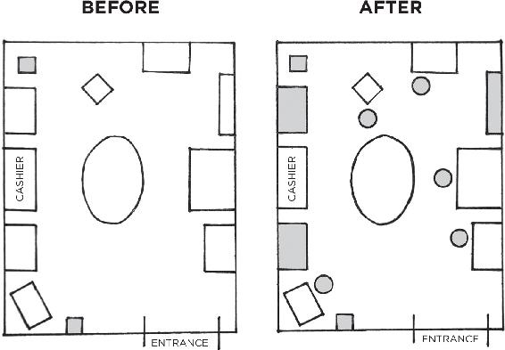
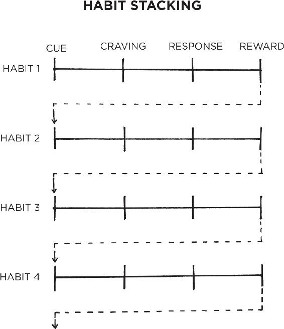
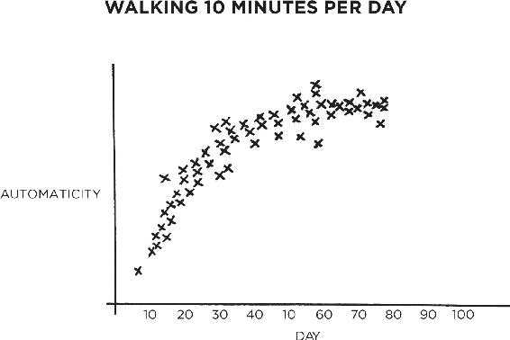

 

<h1 align="center">Atomic Habits.</h1>

<h3 align="center">James Clear - 2018</h3> 

## Table of Contents

- About the Book
- About the Author
- Title Page
- Epigraph
- Introduction: My Story 
- The Fundamentals Why Tiny Changes Make a Big Difference
- 1 The Surprising Power of Atomic Habits
- 2 How Your Habits Shape Your Identity (and Vice Versa)
- 3 How to Build Better Habits in 4 Simple Steps
- The 1st Law Make It Obvious
- 4 The Man Who Didn’t Look Right
- 5 The Best Way to Start a New Habit
- 6 Motivation is Overrated; Environment Often Matters More
- 7 The Secret to Self-Control
- The 2nd Law Make It Attractive
- 8 How to Make a Habit Irresistible
- 9 The Role of Family and Friends in Shaping Your Habits
- 10 How to Find and Fix the Causes of Your Bad Habits
- The 3rd Law Make It Easy
- 11 Walk Slowly, but Never Backward
- 12 The Law of Least Effort
- 13 How to Stop Procrastinating by Using the Two-Minute Rule
- 14 How to Make Good Habits Inevitable and Bad Habits Impossible
- The 4th Law Make It Satisfying
- 15 The Cardinal Rule of Behavior Change
- 16 How to Stick with Good Habits Every Day
- 17 How an Accountability Partner Can Change Everything
- Advanced Tactics How to Go from Being Merely Good to Being Truly Great
- 18 The Truth About Talent (When Genes Matter and When They Don’t)
- 19 The Goldilocks Rule: How to Stay Motivated in Life and Work
- 20 The Downside of Creating Good Habits
- Conclusion: The Secret to Results That Last
- Appendix
- What Should You Read Next?
- Little Lessons from the Four Laws
- How to Apply These Ideas to Business
- How to Apply These Ideas to Parenting
- Acknowledgments
- Notes
- Index
- Copyright

## About the Book

Accomplish more by focusing on less.

Minuscule changes can grow into such life-altering outcomes.

## About the Author

## Title Page

## Epigraph

a·tom·ic 

1. an extremely small amount of a thing; the single irreducible unit of a larger system. 
2. the source of immense energy or power. 

hab·it

1. a routine or practice performed regularly; an automatic response to a specific situation.

## Introduction: My Story 

ON THE FINAL day of my sophomore year of high school, I was hit in the face with a baseball bat... ...After yet another seizure—my third of the day—I was put into a medically induced coma and placed on a ventilator... ...My mother would tell me later, “It was one of the worst nights I’ve ever had.”

### MY RECOVERY

By the next morning my breathing had rebounded to the point where the doctors felt comfortable releasing me from the coma... ...The following months were hard. It felt like everything in my life was on pause... ...Despite my lackluster high school career, I still believed I could become a great player. And I knew that if things were going to improve, I was the one responsible for making it happen.

### HOW I LEARNED ABOUT HABITS

Good sleep habits and went to bed early each night... ...keep my room neat and tidy. These improvements were minor, but they gave me a sense of control over my life. I started to feel confident again... ...A habit is a routine or behavior that is performed regularly—and, in many cases, automatically.

I fulfilled my potential.

We all face challenges in life.

Changes that seem small and unimportant at first will compound into remarkable results if you’re willing to stick with them for years.

In the long run, the quality of our lives often depends on the quality of our habits.

With the same habits, you’ll end up with the same results. But with better habits, anything is possible.

The only way I made progress—the only choice I had—was to start small.

### HOW AND WHY I WROTE THIS BOOK

In 2014, my email list expanded to over one hundred thousand subscribers, which made it one of the fastest-growing newsletters on the internet. I had felt like an impostor when I began writing two years earlier, but now I was becoming known as an expert on habits—a new label that excited me but also felt uncomfortable.

As I put the finishing touches on this book in 2018, jamesclear.com is receiving millions of visitors per month and nearly five hundred thousand people subscribe to my weekly email newsletter—a number that is so far beyond my expectations when I began that I’m not even sure what to think of it.

### HOW THIS BOOK WILL BENEFIT YOU

Naval Ravikant has said, “To write a great book, you must first become the book.”

Small habits helped me fulfill my potential,

In the pages that follow, I will share a step-by-step plan for building better habits—not for days or weeks, but for a lifetime.

This book... ...it’s an operating manual. You’ll find wisdom and practical advice front and center as I explain the science of how to create and change your habits in a way that is easy to understand and apply.

The backbone of this book is my four-step model of habits—cue, craving, response, and reward—and the four laws of behavior change that evolve out of these steps.

Behavioral scientists like Skinner realized that if you offered the right reward or punishment, you could get people to act in a certain way. But while Skinner’s model did an excellent job of explaining how external stimuli influenced our habits, it lacked a good explanation for how our thoughts, feelings, and beliefs impact our behavior. Internal states—our moods and emotions—matter, too. In recent decades, scientists have begun to determine the connection between our thoughts, feelings, and behavior.

Human behavior is always changing: situation to situation, moment to moment, second to second. But this book is about what _doesn’t_ change. It’s about the fundamentals of human behavior.

As long as human behavior is involved, this book will be your guide.

## The Fundamentals Why Tiny Changes Make a Big Difference

## 1 The Surprising Power of Atomic Habits

Brailsford said, “The whole principle came from the idea that if you broke down everything you could think of that goes into riding a bike, and then improve it by 1 percent, you will get a significant increase when you put them all together.”

Why do small improvements accumulate into such remarkable results, and how can you replicate this approach in your own life?

### WHY SMALL HABITS MAKE A BIG DIFFERENCE

It is so easy to overestimate the importance of one defining moment and underestimate the value of making small improvements on a daily basis.

Too often, we convince ourselves that massive success requires massive action.

Improving by 1 percent isn’t particularly notable—sometimes it isn’t even _noticeable_ —but it can be far more meaningful, especially in the long run.

If you can get 1 percent better each day for one year, you’ll end up thirty-seven times better by the time you’re done. Conversely, if you get 1 percent worse each day for one year, you’ll decline nearly down to zero.

FIGURE 1: The effects of small habits compound over time. For example, if you can get just 1 percent better each day, you’ll end up with results that are nearly 37 times better after one year.

Habits are the compound interest of self-improvement.

The effects of your habits multiply as you repeat them. They seem to make little difference on any given day and yet the impact they deliver over the months and years can be enormous.

It is only when looking back two, five, or perhaps ten years later that the value of good habits and the cost of bad ones becomes strikingly apparent.

We make a few changes, but the results never seem to come quickly and so we slide back into our previous routines.

Unfortunately, the slow pace of transformation also makes it easy to let a bad habit slide.

But when we repeat 1 percent errors, day after day, by replicating poor decisions, duplicating tiny mistakes, and rationalizing little excuses, our small choices compound into toxic results.

It’s the accumulation of many missteps—a 1 percent decline here and there—that eventually leads to a problem.

The impact created by a change in your habits is similar to the effect of shifting the route of an airplane by just a few degrees.

Imagine you are flying from Los Angeles to New York City. If a pilot leaving from LAX adjusts the heading just 3.5 degrees south, you will land in Washington, D.C., instead of New York. Such a small change is barely noticeable at takeoff—the nose of the airplane moves just a few feet—but when magnified across the entire United States, you end up hundreds of miles apart.

A slight change in your daily habits can guide your life to a very different destination.

Making a choice that is 1 percent better or 1 percent worse seems insignificant in the moment, but over the span of moments that make up a lifetime these choices determine the difference between who you are and who you could be.

Success is the product of daily habits—not once-in-a-lifetime transformations.

What matters is whether your habits are putting you on the path toward success. 

You should be far more concerned with your current trajectory than with your current results.

Your outcomes are a lagging measure of your habits.

Your net worth is a lagging measure of your financial habits. Your weight is a lagging measure of your eating habits. Your knowledge is a lagging measure of your learning habits... ...You get what you repeat.

If you want to predict where you’ll end up in life, all you have to do is follow the curve of tiny gains or tiny losses, and see how your daily choices will compound ten or twenty years down the line.

Time magnifies the margin between success and failure. It will multiply whatever you feed it. Good habits make time your ally. Bad habits make time your enemy.

Habits are a double-edged sword. 15 Bad habits can cut you down just as easily as good habits can build you up, which is why understanding the details is crucial. You need to know how habits work and how to design them to your liking, so you can avoid the dangerous half of the blade.

### YOUR HABITS CAN COMPOUND FOR YOU OR AGAINST YOU

| Positive Compounding | Negative Compounding |
| -------------------- | -------------------- |
| **Productivity compounds.**... ...The effect of automating an old task or mastering a new skill can be even greater. The more tasks you can handle without thinking, the more your brain is free to focus on other areas. | **Stress compounds.**... ...common causes of stress are manageable. But when they persist for years, little stresses compound into serious health issues.|
| **Knowledge compounds.**... ...a commitment to lifelong learning can be transformative. Furthermore, each book you read not only teaches you something new but also opens up different ways of thinking about old ideas. | **Negative thoughts compound.** The more you think of yourself as worthless, stupid, or ugly, the more you condition yourself to interpret life that way. You get trapped in a thought loop. The same is true for how you think about others. Once you fall into the habit of seeing people as angry, unjust, or selfish, you see those kind of people everywhere. |
| **Relationships compound.** People reflect your behavior back to you. The more you help others, the more others want to help you. Being a little bit nicer in each interaction can result in a network of broad and strong connections over time. | **Outrage compounds.**... ...series of microaggressions and daily aggravations slowly multiply until one event tips the scales and outrage spreads like wildfire. |

> “That’s how knowledge works. It builds up, like compound interest.”
> -Warren Buffett
 
### WHAT PROGRESS IS REALLY LIKE

Imagine that you have an ice cube sitting on the table in front of you. The room is cold and you can see your breath. It is currently twenty-five degrees. Ever so slowly, the room begins to heat up. Twenty-six degrees. Twenty-seven. Twenty-eight. The ice cube is still sitting on the table in front of you. Twenty-nine degrees. Thirty. Thirty-one. Still, nothing has happened. Then, thirty-two degrees. The ice begins to melt. A one-degree shift, seemingly no different from the temperature increases before it, has unlocked a huge change.

Breakthrough moments are often the result of many previous actions, which build up the potential required to unleash a major change.

Bamboo can barely be seen for the first five years as it builds extensive root systems underground before exploding ninety feet into the air within six weeks.

Habits often appear to make no difference until you cross a critical threshold and unlock a new level of performance.

It’s frustrating how ineffective changes can seem during the first days, weeks, and even months. It doesn’t feel like you are going anywhere... ...the most powerful outcomes are delayed.

It is so hard to build habits that last. People make a few small changes, fail to see a tangible result, and decide to stop.

in order to make a meaningful difference, habits need to persist long enough to break through this plateau—what I call the _Plateau of Latent Potential._ 

If you find yourself struggling to build a good habit or break a bad one, it is not because you have lost your ability to improve. It is often because you have not yet crossed the Plateau of Latent Potential.

When you finally break through the Plateau of Latent Potential, people... ...only sees the most dramatic event rather than all that preceded it. But you know that it’s the work you did long ago—when... ...progress—that makes the jump today possible.

Mastery requires patience.

> Jacob Riis hanging in their locker room: “When nothing seems to help, I go and look at a stonecutter hammering away at his rock, perhaps a hundred times without as much as a crack showing in it. 19 Yet at the hundred and first blow it will split in two, and I know it was not that last blow that did it—but all that had gone before.”
> -Jacob Riis
 

FIGURE 2: We often expect progress to be linear... ...In reality, the results of our efforts are often delayed... ...This can result in a “valley of disappointment” where people feel discouraged after putting in weeks or months of hard work without experiencing any results. However, this work was not wasted... ...It is not until much later that the full value of previous efforts is revealed.

All big things come from small beginnings.

The seed of every habit is a single, tiny decision. But as that decision is repeated, a habit sprouts and grows stronger.

The task of breaking a bad habit is like uprooting a powerful oak within us. And the task of building a good habit is like cultivating a delicate flower one day at a time.

### FORGET ABOUT GOALS, FOCUS ON SYSTEMS INSTEAD

Prevailing wisdom claims that the best way to achieve what we want in life... ...is to set specific, actionable goals. For many years, this was how I approached my habits, too... ...Eventually, I began to realize that my results had very little to do with the goals I set and nearly everything to do with the systems I followed.

What’s the difference between systems and goals?... ...Goals are about the results you want to achieve. Systems are about the processes that lead to those results.

Now for the interesting question: If you completely ignored your goals and focused only on your system, would you still succeed?... ...I think you would.

> “The score takes care of itself.”
> Bill Walsh
 
If you want better results, then forget about setting goals. Focus on your system instead.

Goals are good for setting a direction, but systems are best for making progress.

A handful of problems arise when you spend too much time thinking about your goals and not enough time designing your systems.

**Problem #1: Winners and losers have the same goals.**

If successful and unsuccessful people share the same goals, then the goal cannot be what differentiates the winners from the losers.

It wasn’t the _goal_... ...The goal had always been there. It was only when they implemented a _system_ of continuous small improvements that they achieved a different outcome.

**Problem #2: Achieving a goal is only a momentary change.**

Imagine you have a messy room and you set a goal to clean it. If you summon the energy to tidy up, then you will have a clean room—for now. But if you maintain the same sloppy, pack-rat habits that led to a messy room in the first place, soon you’ll be looking at a new pile of clutter and hoping for another burst of motivation.

You’re left chasing the same outcome because you never changed the system behind it.

You treated a symptom without addressing the cause.

Achieving a goal only changes your life _for the moment._

We think we need to change our results, but the results are not the problem. What we really need to change are the systems that cause those results.

When you solve problems at the results level, you only solve them temporarily. In order to improve for good, you need to solve problems at the systems level.

Fix the inputs and the outputs will fix themselves.

**Problem #3: Goals restrict your happiness.**

The implicit assumption behind any goal is this: “Once I reach my goal, then I’ll be happy.” The problem with a goals-first mentality is that you’re continually putting happiness off until the next milestone.

Furthermore, goals create an “either-or” conflict: either you achieve your goal and are successful or you fail and you are a disappointment. 

You mentally box yourself into a narrow version of happiness. This is misguided. 

It is unlikely that your actual path through life will match the exact journey you had in mind when you set out.

It makes no sense to restrict your satisfaction to one scenario when there are many paths to success.

When you fall in love with the process rather than the product, you don’t have to wait to give yourself permission to be happy. You can be satisfied anytime your system is running.

A system can be successful in many different forms, not just the one you first envision.

**Problem #4: Goals are at odds with long-term progress.**

When all of your hard work is focused on a particular goal, what is left to push you forward after you achieve it? This is why many people find themselves reverting to their old habits after accomplishing a goal. 

The purpose of setting goals is to win the game. The purpose of building systems is to continue playing the game. 

True long-term thinking is goal-less thinking.

It is about the cycle of endless refinement and continuous improvement. 

Ultimately, it is your commitment to the _process_ that will determine your _progress._

### A SYSTEM OF ATOMIC HABITS

If you’re having trouble changing your habits, the problem isn’t you. The problem is your system. 

Bad habits repeat themselves again and again not because you don’t want to change, but because you have the wrong system for change. 

You do not rise to the level of your goals. You fall to the level of your systems.

Atomic habits... ...are little habits that are part of a larger system. Just as atoms are the building blocks of molecules, atomic habits are the building blocks of remarkable results.

At first, these tiny routines seem insignificant, but soon they build on each other and fuel bigger wins that multiply to a degree that far outweighs the cost of their initial investment.

_atomic habits_ —a regular practice or routine that is not only small and easy to do, but also the source of incredible power; a component of the system of compound growth.

Chapter Summary:
- Habits are the compound interest of self-improvement. Getting 1 percent better every day counts for a lot in the long-run. 
- Habits are a double-edged sword. They can work for you or against you, which is why understanding the details is essential. 
- Small changes often appear to make no difference until you cross a critical threshold. The most powerful outcomes of any compounding process are delayed. You need to be patient. 
- An atomic habit is a little habit that is part of a larger system. Just as atoms are the building blocks of molecules, atomic habits are the building blocks of remarkable results.
- If you want better results, then forget about setting goals. Focus on your system instead. 
- You do not rise to the level of your goals. You fall to the level of your systems.

## 2 How Your Habits Shape Your Identity (and Vice Versa)

WHY IS IT so easy to repeat bad habits and so hard to form good ones?

It often feels difficult to keep good habits going for more than a few days, even with sincere effort and the occasional burst of motivation.

once your habits are established, they seem to stick around forever—especially the unwanted ones.

Changing our habits is challenging for two reasons: (1) we try to change the wrong thing and (2) we try to change our habits in the wrong way.

Our first mistake is that we try to change the wrong thing... ...consider that there are three levels at which change can occur. You can imagine them like the layers of an onion.
 

FIGURE 3: There are three layers of behavior change: a change in your outcomes, a change in your processes, or a change in your identity.

**The first layer is changing your outcomes.** This level is concerned with changing your results:... ...Most of the goals you set are associated with this level of change... ...**The second layer is changing your process.** This level is concerned with changing your habits and systems:... ...Most of the habits you build are associated with this level. **The third and deepest layer is changing your identity.** This level is concerned with changing your beliefs:... ...Most of the beliefs, assumptions, and biases you hold are associated with this level.

Outcomes are about what you get. Processes are about what you do. Identity is about what you believe.

When it comes to building habits that last... ...the problem is not that one level is “better” or “worse” than another. All levels of change are useful in their own way. The problem is the _direction_ of change.

Many people begin the process of changing their habits by focusing on _what_ they want to achieve. This leads us to outcome-based habits. The alternative is to build identity-based habits. With this approach, we start by focusing on _who_ we wish to become.

FIGURE 4: With outcome-based habits, the focus is on what you want to achieve. With identity-based habits, the focus is on who you wish to become.

Imagine two people resisting a cigarette. When offered a smoke, the first person says, “No thanks. I’m trying to quit.” It sounds like a reasonable response, but this person still believes they are a smoker who is trying to be something else. They are hoping their behavior will change while carrying around the same beliefs. The second person declines by saying, “No thanks. I’m not a smoker.” It’s a small difference, but this statement signals a shift in identity. Smoking was part of their former life, not their current one. They no longer identify as someone who smokes.

Most people don’t even consider identity change when they set out to improve... ...They set goals and determine the actions they should take to achieve those goals without considering the beliefs that drive their actions. They never shift the way they look at themselves, and they don’t realize that their old identity can sabotage their new plans for change.

Behind every system of actions are a system of beliefs.

There are a set of beliefs and assumptions that shape the system, an identity behind the habits. 

Behavior that is incongruent with the self will not last.

You may want better health, but if you continue to prioritize comfort over accomplishment, you’ll be drawn to relaxing rather than training. 

It’s hard to change your habits if you never change the underlying beliefs that led to your past behavior. You have a new goal and a new plan, but you haven’t changed _who_ you are.

The ultimate form of intrinsic motivation is when a habit becomes part of your identity. It’s one thing to say I’m the type of person who _wants_ this. It’s something very different to say I’m the type of person who is this. 

The more pride you have in a particular aspect of your identity, the more motivated you will be to maintain the habits associated with it.

True behavior change is identity change. 

You might start a habit because of motivation, but the only reason you’ll stick with one is that it becomes part of your identity. 

Anyone can convince themselves to visit the gym or eat healthy once or twice, but if you don’t shift the belief behind the behavior, then it is hard to stick with long-term changes. 

Improvements are only temporary until they become part of who you are.

The goal is not to read a book, the goal is to _become_ a reader.

What you do is an indication of the type of person you believe that you are.

Once a person believes in a particular aspect of their identity, they are more likely to act in alignment with that belief.

Doing the right thing is easy. After all, when your behavior and your identity are fully aligned, you are no longer pursuing behavior change. You are simply acting like the type of person you already believe yourself to be.

When working against you, though, identity change can be a curse. Once you have adopted an identity, it can be easy to let your allegiance to it impact your ability to change.

Many people walk through life in a cognitive slumber, blindly following the norms attached to their identity. “I’m terrible with directions.” “I’m not a morning person.” ...and a thousand other variations.

The more deeply a thought or action is tied to your identity, the more difficult it is to change it.

It can feel comfortable to believe what your culture believes (group identity) or to do what upholds your self-image (personal identity), even if it’s wrong.

The biggest barrier to positive change at any level—individual.

Good habits can make rational sense, but if they conflict with your identity, you will fail to put them into action.

On any given day, you may struggle with your habits... ...Over the long run, however, the real reason you fail to stick with habits is that your self-image gets in the way.

Progress requires unlearning. 

Becoming the best version of yourself requires you to continuously edit your beliefs, and to upgrade and expand your identity.

If your beliefs and worldview play such an important role in your behavior, where do they come from in the first place? How, exactly, is your identity formed? And how can you emphasize new aspects of your identity that serve you and gradually erase the pieces that hinder you?

### THE TWO-STEP PROCESS TO CHANGING YOUR IDENTITY

Your identity emerges out of your habits.

You are not born with preset beliefs. Every belief, including those about yourself, is learned and conditioned through experience.

Your habits are how you embody your identity. When you make your bed each day, you embody the identity of an organized person.

The more you repeat a behavior, the more you reinforce the identity associated with that behavior.

The word _identity_ was originally derived from the Latin words _essentitas,_ which means _being,_ and _identidem,_ which means _repeatedly._ Your identity is literally your “repeated beingness.”

If you go to the gym even when it’s snowing, you have evidence that you are committed to fitness. The more evidence you have for a belief, the more strongly you will believe it.

I published a new article every Monday and Thursday for the first few years. As the evidence grew, so did my identity as a writer. I didn’t start out as a writer. I _became_ one through my habits.

As you repeat these actions, however, the evidence accumulates and your self-image begins to change.

Your habits contribute most of the evidence that shapes your identity. In this way, the process of building habits is actually the process of becoming yourself.

This is a gradual evolution... ...We change bit by bit, day by day, habit by habit. We are continually undergoing microevolutions of the self... ...If you finish a book, then perhaps you are the type of person who likes reading... ...Every action you take is a vote for the type of person you wish to become.

Meaningful change does not require radical change. Small habits can make a meaningful difference by providing evidence of a new identity. And if a change is meaningful, it actually is big. That’s the paradox of making small improvements.

Habits are the path to changing your identity. The most practical way to change _who_ you are is to change _what_ you do.

Each habit not only gets results but also teaches you something far more important: to trust yourself. You start to believe you can actually accomplish these things.

When... ...the evidence begins to change, the story you tell yourself begins to change as well.

Every time you choose to perform a bad habit, it’s a vote for that identity. The good news is that you don’t need to be perfect. In any election, there are going to be votes for both sides. You don’t need a unanimous vote to win an election; you just need a majority. It doesn’t matter if you cast a few votes for a bad behavior or an unproductive habit. Your goal is simply to win the majority of the time.

New identities require new evidence. If you keep casting the same votes you’ve always cast, you’re going to get the same results you’ve always had.

If nothing changes, nothing is going to change.

It is a simple two-step process: 1. Decide the type of person you want to be. 2. Prove it to yourself with small wins.

First, decide who you want to be... ...at any level—as an individual, as a team, as a community, as a nation. What do you want to stand for? What are your principles and values? Who do you wish to become? These are big questions, and many people aren’t sure where to begin—but they do know what kind of results they want... ...That’s fine. Start there and work backward from the results you want to the type of person who could get those results. Ask yourself, “Who is the type of person that could get the outcome I want?”... ...Who is the type of person that could learn a new language?

For example, “Who is the type of person who could write a book?” It’s probably someone who is consistent and reliable. Now your focus shifts from writing a book (outcome-based) to being the type of person who is consistent and reliable (identity-based).

Beliefs like: 
- “I’m the kind of teacher who stands up for her students.” 
- “I’m the kind of doctor who gives each patient the time and empathy they need.” 
- “I’m the kind of manager who advocates for her employees.”

Feedback loops. Your habits shape your identity, and your identity shapes your habits. It’s a two-way street. The formation of all habits is a feedback loop.

It’s important to let your values, principles, and identity drive the loop rather than your results. The focus should always be on becoming that type of person, not getting a particular outcome.

### THE REAL REASON HABITS MATTER

Identity change is the North Star of habit change.

“Are you becoming the type of person you want to become?” The first step is not _what_ or _how,_ but _who._ You need to know who you want to be. Otherwise, your quest for change is like a boat without a rudder.

You have the power to change your beliefs about yourself. Your identity is not set in stone. You have a choice in every moment. 

You can choose the identity you want to reinforce today with the habits you choose today.

It’s not about achieving external measures of success like earning more money, losing weight, or reducing stress. Habits... ...are not about _having_ something. They are about _becoming_ someone.

Your habits matter because they help you become the type of person you wish to be. They are the channel through which you develop your deepest beliefs about yourself. Quite literally, you become your habits.

Chapter Summary:
- There are three levels of change: outcome change, process change, and identity change. 
- The most effective way to change your habits is to focus not on what you want to achieve, but on who you wish to become. 
- Your identity emerges out of your habits. Every action is a vote for the type of person you wish to become. 
- Becoming the best version of yourself requires you to continuously edit your beliefs, and to upgrade and expand your identity. 
- The real reason habits matter is not because they can get you better results (although they can do that), but because they can change your beliefs about yourself.

## 3 How to Build Better Habits in 4 Simple Steps

> “behaviors followed by satisfying consequences tend to be repeated and those that produce unpleasant consequences are less likely to be repeated.”
> -Thorndike

### WHY YOUR BRAIN BUILDS HABITS

A habit is a behavior that has been repeated enough times to become automatic. 

The process of habit formation begins with trial and error.

Whenever you encounter a new situation in life, your brain has to make a decision. _How do I respond to this?_ The first time you come across a problem, you’re not sure how to solve it... ...you’re just trying things out to see what works.

After you stumble upon an unexpected reward, you alter your strategy for next time. Your brain immediately begins to catalog the events that preceded the reward.

The feedback loop behind all human behavior: try, fail, learn, try differently. With practice, the useless movements fade away and the useful actions get reinforced. That’s a habit forming.

Whenever you face a problem repeatedly, your brain begins to automate the process of solving it.

> “Habits are, simply, reliable solutions to recurring problems in our environment.”
> -Jason Hreha
 
As habits are created, the level of activity in the brain _decreases._ You learn to lock in on the cues that predict success and tune out everything else. When a similar situation arises in the future, you know exactly what to look for.

Your brain skips the process of trial and error and creates a mental rule: if this, then that.

A habit is just a memory of the steps you previously followed to solve a problem in the past.

The primary reason the brain remembers the past is to better predict what will work in the future.

Habit formation is incredibly useful because the conscious mind is the bottleneck of the brain. It can only pay attention to one problem at a time.

Whenever possible, the conscious mind likes to pawn off tasks to the nonconscious mind to do automatically... ...Habits reduce cognitive load and free up mental capacity, so you can allocate your attention to other tasks.

Habits do not restrict freedom. They create it.

If you’re always being forced to make decisions about simple tasks... ...then you have less time for freedom. It’s only by making the fundamentals of life easier that you can create the mental space needed for free thinking and creativity.

When you have your habits dialed in and the basics of life are handled and done, your mind is free to focus on new challenges and master the next set of problems.

Building habits in the present allows you to do more of what you want in the future.

### THE SCIENCE OF HOW HABITS WORK

The process of building a habit can be divided into four simple steps: cue, craving, response, and reward.

FIGURE 5: All habits proceed through four stages in the same order: cue, craving, response, and reward.

The cue triggers your brain to initiate a behavior. It is a bit of information that predicts a reward.

Your mind is continuously analyzing your internal and external environment for hints of where rewards are located. Because the cue is the first indication that we’re close to a reward, it naturally leads to a craving.

Cravings are the second step, and they are the motivational force behind every habit. Without some level of motivation or desire—without craving a change—we have no reason to act. 

What you crave is not the habit itself but the change in state it delivers.

You are not motivated by brushing your teeth but rather by the feeling of a clean mouth.

Cravings differ from person to person. In theory, any piece of information could trigger a craving, but in practice, people are not motivated by the same cues.

Cues are meaningless until they are interpreted. The thoughts, feelings, and emotions of the observer are what transform a cue into a craving. 

The third step is the response... ...is the actual habit you perform, which can take the form of a thought or an action.

Whether a response occurs depends on how motivated you are and how much friction is associated with the behavior. If a particular action requires more physical or mental effort than you are willing to expend, then you won’t do it.

It sounds simple, but a habit can occur only if you are capable of doing it.

Rewards are the end goal of every habit. The cue is about noticing the reward. The craving is about wanting the reward. The response is about obtaining the reward. We chase rewards because they serve two purposes: (1) they satisfy us and (2) they teach us.

Yes, rewards provide benefits on their own. Food and water deliver the energy you need to survive... ...But the more immediate benefit is that rewards satisfy your craving to eat.

At least for a moment, rewards deliver contentment and relief from craving.

Second, rewards teach us which actions are worth remembering in the future.

Feelings of pleasure and disappointment are part of the feedback mechanism that helps your brain distinguish useful actions from useless ones.

If a behavior is insufficient in any of the four stages, it will not become a habit.

Eliminate the cue and your habit will never start. Reduce the craving and you won’t experience enough motivation to act. Make the behavior difficult and you won’t be able to do it. And if the reward fails to satisfy your desire, then you’ll have no reason to do it again in the future.

Without the first three steps, a behavior will not occur. Without all four, a behavior will not be repeated.

FIGURE 6: The four stages of habit are best described as a feedback loop. They form an endless cycle that is running every moment you are alive. This “habit loop” is continually scanning the environment, predicting what will happen next, trying out different responses, and learning from the results.

Together, these four steps form a neurological feedback loop—cue, craving, response, reward; cue, craving, response, reward—that ultimately allows you to create automatic habits. This cycle is known as the habit loop.

This four-step process... ...is running and active during every moment you are alive

We can split these four steps into two phases: the problem phase and the solution phase. The problem phase includes the cue and the craving, and it is when you realize that something needs to change. The solution phase includes the response and the reward, and it is when you take action and achieve the change you desire.

All behavior is driven by the desire to solve a problem. 

Sometimes the problem is that you notice something good and you want to obtain it. Sometimes the problem is that you are experiencing pain and you want to relieve it.

By the time we become adults, we rarely notice the habits that are running our lives. Most of us never give a second thought to the fact that we tie the same shoe first each morning, or unplug the toaster after each use, or always change into comfortable clothes after getting home from work. After decades of mental programming, we automatically slip into these patterns of thinking and acting.

## The 1st Law Make It Obvious

## 4 The Man Who Didn’t Look Right

The human brain is a prediction machine. 5 It is continuously taking in your surroundings and analyzing the information it comes across.

Whenever you experience something repeatedly... ...your brain begins noticing what is important, sorting through the details and highlighting the relevant cues, and cataloging that information for future use. With enough practice, you can pick up on the cues that predict certain outcomes without consciously thinking about it.

We can’t always explain what it is we are learning, but learning is happening all along the way.

We underestimate how much our brains and bodies can do without thinking. You do not tell your hair to grow, your heart to pump, your lungs to breathe, or your stomach to digest. And yet your body handles all this and more on autopilot. You are much more than your conscious self.

You don’t need to be aware of the cue for a habit to begin. You can notice an opportunity and take action without dedicating conscious attention to it. This is what makes habits useful.

As habits form, your actions come under the direction of your automatic and nonconscious mind. You fall into old patterns before you realize what’s happening. Unless someone points it out, you may not notice that you cover your mouth with your hand whenever you laugh, that you apologize before asking a question, or that you have a habit of finishing other people’s sentences. And the more you repeat these patterns, the less likely you become to question what you’re doing and why you’re doing it.

We must begin the process of behavior change with awareness.

Before we can effectively build new habits, we need to get a handle on our current ones.

> “Until you make the unconscious conscious, it will direct your life and you will call it fate.”
> -Carl Jung

### THE HABITS SCORECARD

_Pointing-and-Calling,_ is a safety system designed to reduce mistakes... ...reduces errors by up to 85 percent and cuts accidents by 30 percent... ...is so effective because it raises the level of awareness from a nonconscious habit to a more conscious level.

The more automatic a behavior becomes, the less likely we are to consciously think about it. And when we’ve done something a thousand times before, we begin to overlook things.

We’re so used to doing what we’ve always done that we don’t stop to question whether it’s the right thing to do at all.

Many of our failures in performance are largely attributable to a lack of self-awareness.

One of our greatest challenges in changing habits is maintaining awareness of what we are actually doing. This helps explain why the consequences of bad habits can sneak up on us. We need a “point-and-call” system for our personal lives. That’s the origin of the Habits Scorecard, which is a simple exercise you can use to become more aware of your behavior.

make a list of your daily habits... ...Once you have a full list, look at each behavior, and ask yourself, “Is this a good habit, a bad habit, or a neutral habit?” If it is a good habit, write “+” next to it. If it is a bad habit, write “–”. If it is a neutral habit, write “=”.

- Wake up = 
- Turn off alarm = 
- Check my phone – 
- Go to the bathroom = 
- Weigh myself + 
- Take a shower + 
- Brush my teeth + 
- Floss my teeth + 
- Put on deodorant + 
- Hang up towel to dry = 
- Get dressed = 
- Make a cup of tea +

The marks you give to a particular habit will depend on your situation and your goals... ...It all depends on what you’re working toward.

There are no good habits or bad habits. There are only effective habits. That is, effective at solving problems.

All habits serve you in some way—even the bad ones—which is why you repeat them.

Categorize your habits by how they will benefit you in the long run... ...Smoking a cigarette may reduce stress right now (that’s how it’s serving you), but it’s not a healthy long-term behavior.

how it’s serving you), but it’s not a healthy long-term behavior. If you’re still having trouble determining how to rate a particular habit, here is a question I like to use: “Does this behavior help me become the type of person I wish to be? Does this habit cast a vote for or against my desired identity?” Habits that reinforce your desired identity are usually good. Habits that conflict with your desired identity are usually bad.

As you create your Habits Scorecard, there is no need to change anything at first. The goal is to simply notice what is actually going on... ...Don’t blame yourself for your faults. Don’t praise yourself for your successes.

The first step to changing bad habits is to be on the lookout for them. If you feel like you need extra help, then you can try Pointing-and-Calling in your own life. Say out loud the action that you are thinking of taking and what the outcome will be.

If you want to cut back on your junk food habit but notice yourself grabbing another cookie, say out loud, “I’m about to eat this cookie, but I don’t need it. Eating it will cause me to gain weight and hurt my health.” Hearing your bad habits spoken aloud makes the consequences seem more real. It adds weight to the action rather than letting yourself mindlessly slip into an old routine.

The process of behavior change always starts with awareness.

Chapter Summary:
- With enough practice, your brain will pick up on the cues that predict certain outcomes without consciously thinking about it. 
- Once our habits become automatic, we stop paying attention to what we are doing. 
- The process of behavior change always starts with awareness. You need to be aware of your habits before you can change them. 
- Pointing-and-Calling raises your level of awareness from a nonconscious habit to a more conscious level by verbalizing your actions. 
- The Habits Scorecard is a simple exercise you can use to become more aware of your behavior.

## 5 The Best Way to Start a New Habit

_implementation intention,_ which is a plan you make beforehand about when and where to act. That is, how you intend to _implement_ a particular habit.

The cues that can trigger a habit come in a wide range of forms—the feel of your phone buzzing in your pocket, the smell of chocolate chip cookies, the sound of ambulance sirens—but the two most common cues are time and location. Implementation intentions leverage both of these cues.

Broadly speaking, the format for creating an implementation intention is: “When situation X arises, I will perform response Y.”

People who make a specific plan for when and where they will perform a new habit are more likely to follow through.

Too many people try to change their habits without these basic details figured out. We tell ourselves, “I’m going to eat healthier” or “I’m going to write more,” but we never say when and where these habits are going to happen. We leave it up to chance and hope that we will “just remember to do it” or feel motivated at the right time.

Many people think they lack motivation when what they really lack is clarity. It is not always obvious when and where to take action. Some people spend their entire lives waiting for the time to be right to make an improvement.

Once an implementation intention has been set, you don’t have to wait for inspiration to strike... ...When the moment of action occurs, there is no need to make a decision. Simply follow your predetermined plan.

Fill out this sentence: I will [BEHAVIOR] at [TIME] in [LOCATION]. Example: Meditation. I will meditate for one minute at 7 a.m. in my kitchen.

If we have hope, we have a reason to take action. A fresh start feels motivating.

Being specific about what you want and how you will achieve it helps you say no to things that derail progress, distract your attention, and pull you off course.

When your dreams are vague, it’s easy to rationalize little exceptions all day long and never get around to the specific things you need to do to succeed.

The goal is to make the time and location so obvious that, with enough repetition, you get an urge to do the right thing at the right time, even if you can’t say why.

> Obviously you’re never going to just work out without conscious thought
> - Jason Zweig

### HABIT STACKING: A SIMPLE PLAN TO OVERHAUL YOUR HABITS

The Diderot Effect states that obtaining a new possession often creates a spiral of consumption that leads to additional purchases.

Many human behaviors follow this cycle. You often decide what to do next based on what you have just finished doing.

No behavior happens in isolation. Each action becomes a cue that triggers the next behavior.

One of the best ways to build a new habit is to identify a current habit you already do each day and then stack your new behavior on top. This is called _habit stacking._

The habit stacking formula is: “After [CURRENT HABIT], I will [NEW HABIT].”

The key is to tie your desired behavior into something you already do each day.

Once you have mastered this basic structure, you can begin to create larger stacks by chaining small habits together. This allows you to take advantage of the natural momentum that comes from one behavior leading into the next—a positive version of the Diderot Effect. 

FIGURE 7: Habit stacking increases the likelihood that you’ll stick with a habit by stacking your new behavior on top of an old one. This process can be repeated to chain numerous habits together, each one acting as the cue for the next.

Habit stacking allows you to create a set of simple rules that guide your future behavior. It’s like you always have a game plan for which action should come next.

Strategy, the secret to creating a successful habit stack is selecting the right cue to kick things off.

Unlike an implementation intention, which specifically states the time and location for a given behavior, habit stacking implicitly has the time and location built into.

Don’t ask yourself to do a habit when you’re likely to be occupied with something else.

Your cue should also have the same frequency as your desired habit. If you want to do a habit every day, but you stack it on top of a habit that only happens on Mondays, that’s not a good choice.

Habit stacking works best when the cue is highly specific and immediately actionable.

Habits like “read more” or “eat better” are worthy causes, but these goals do not provide instruction on how and when to act. Be specific and clear:... ...The specificity is important. 

The more tightly bound your new habit is to a specific cue, the better the odds are that you will notice when the time comes to act.

The 1st Law of Behavior Change is to _make it obvious._ Strategies like implementation intentions and habit stacking are among the most practical ways to create obvious cues for your habits and design a clear plan for when and where to take action.

Chapter Summary:
- The 1st Law of Behavior Change is make it obvious .
- The two most common cues are time and location.
- Creating an implementation intention is a strategy you can use to pair a new habit with a specific time and location.
- The implementation intention formula is: I will [BEHAVIOR] at [TIME] in [LOCATION].
- Habit stacking is a strategy you can use to pair a new habit with a current habit.
- The habit stacking formula is: After [CURRENT HABIT], I will [NEW HABIT].

## 6 Motivation is Overrated; Environment Often Matters More

ANNE THORNDIKE, A primary care physician at Massachusetts General Hospital in Boston, had a crazy idea. 1 She believed she could improve the eating habits of thousands of hospital staff and visitors without changing their willpower or motivation in the slightest way. In fact, she didn’t plan on talking to them at all. Thorndike and her colleagues designed a six-month study to alter the “choice architecture” of the hospital cafeteria. They started by changing how drinks were arranged in the room.

FIGURE 8: Here is a representation of what the cafeteria looked like before the environment design changes were made (left) and after (right). The shaded boxes indicate areas where bottled water was available in each instance. Because the amount of water in the environment was increased, behavior shifted naturally and without additional motivation.

People often choose products not because of _what_ they are, but because of _where_ they are.

Your habits change depending on the room you are in and the cues in front of you.

Environment is the invisible hand that shapes human behavior. 

Despite our unique personalities, certain behaviors tend to arise again and again under certain environmental conditions.

The most common form of change is not internal, but external: we are changed by the world around us. Every habit is context dependent.

> Behavior is a function of the Person in their Environment, or B = f (P,E)
> - Psychologist Kurt Lewin, 1936

In 1952, the economist Hawkins Stern described a phenomenon he called _Suggestion Impulse Buying,_ which “is triggered when a shopper sees a product for the first time and visualizes a need for it.” 4 In other words, customers will occasionally buy products not because they _want_ them but because of how they are _presented_ to them.

The more obviously available a product or service is, the more likely you are to try it.

We like to think that we are in control... ...The truth, however, is that many of the actions we take each day are shaped not by purposeful drive and choice but by the most obvious option.

Snakes can smell by “tasting the air” with their highly sensitive tongues.

In humans, perception is directed by the sensory nervous system. We perceive the world through sight, sound, smell, touch, and taste. But we also have other ways of sensing stimuli. Some are conscious, but many are nonconscious.

The most powerful of all human sensory abilities, however, is vision. The human body has about eleven million sensory receptors. Approximately ten million of those are dedicated to sight. Some experts estimate that half of the brain’s resources are used on vision.

Visual cues are the greatest catalyst of our behavior.

A small change in what you _see_ can lead to a big shift in what you _do._

Live and work in environments that are filled with productive cues and devoid of unproductive ones.

You don’t have to be the victim of your environment. You can also be the architect of it.

### HOW TO DESIGN YOUR ENVIRONMENT FOR SUCCESS

Every habit is initiated by a cue, and we are more likely to notice cues that stand out.

Unfortunately, the environments where we live and work often make it easy not to do certain actions because there is no obvious cue to trigger the behavior. It’s easy not to practice the guitar when it’s tucked away in the closet. It’s easy not to read a book when the bookshelf is in the corner of the guest room... ...When the cues that spark a habit are subtle or hidden, they are easy to ignore.

Creating obvious visual cues can draw your attention toward a desired habit.

In the early 1990s, the cleaning staff at Schiphol Airport in Amsterdam installed a small sticker that looked like a fly near the center of each urinal. Apparently, when men stepped up to the urinals, they aimed for what they thought was a bug. The stickers improved their aim and significantly reduced “spillage” around the urinals. Further analysis determined that the stickers cut bathroom cleaning costs by 8 percent per year.

If you want to make a habit a big part of your life, make the cue a big part of your environment.

Make sure the best choice is the most obvious one. Making a better decision is easy and natural when the cues for good habits are right in front of you.

Most people live in a world others have created for them. But you can alter the spaces where you live and work to increase your exposure to positive cues and reduce your exposure to negative ones.

Become the architect of your life. Be the designer of your world and not merely the consumer of it.

### THE CONTEXT IS THE CUE

The cues that trigger a habit can start out very specific, but over time your habits become associated not with a single trigger but with the entire _context_ surrounding the behavior.

Many people drink more in social situations than they would ever drink alone. The trigger is rarely a single cue, but rather the whole situation: watching your friends order drinks, hearing the music at the bar, seeing the beers on tap.

Each location develops a connection to certain habits and routines.

Our behavior is not defined by the objects in the environment but by our relationship to them.

Stop thinking about your environment as filled with objects. Start thinking about it as filled with relationships.

In one study, scientists instructed insomniacs to get into bed only when they were tired. If they couldn’t fall asleep, they were told to sit in a different room until they became sleepy. Over time, subjects began to associate the context of their bed with the action of sleeping, and it became easier to quickly fall asleep when they climbed in bed. Their brains learned that sleeping—not browsing on their phones, not watching television, not staring at the clock—was the only action that happened in that room.

Habits can be easier to change in a new environment. It helps to escape the subtle triggers and cues that nudge you toward your current habits.

When you step outside your normal environment, you leave your behavioral biases behind. You aren’t battling old environmental cues, which allows new habits to form without interruption.

Want to think more creatively?... ...Take a break from the space where you do your daily work, which is also linked to your current thought patterns.

When you can’t manage to get to an entirely new environment, redefine or rearrange your current one.

“One space, one use.”

It was easier for me to turn off the professional side of my brain when there was a clear dividing line between work life and home life. Each room had one primary use.

Whenever possible, avoid mixing the context of one habit with another. When you start mixing contexts, you’ll start mixing habits—and the easier ones will usually win out.

When you can use your phone to do nearly anything, it becomes hard to associate it with one task. You want to be productive, but you’re also conditioned to browse social media,

If your space is limited, divide your room into activity zones: a chair for reading, a desk for writing, a table for eating.

Every habit should have a home.

If you want behaviors that are stable and predictable, you need an environment that is stable and predictable.

Chapter Summary:
- Small changes in context can lead to large changes in behavior over time.
- Every habit is initiated by a cue. We are more likely to notice cues that stand out. 
- Make the cues of good habits obvious in your environment. 
- Gradually, your habits become associated not with a single trigger but with the entire context surrounding the behavior. The context becomes the cue. 
- It is easier to build new habits in a new environment because you are not fighting against old cues.

## 7 The Secret to Self-Control

This finding contradicted the prevailing view at the time, which considered heroin addiction to be a permanent and irreversible condition. Instead, Robins revealed that addictions could spontaneously dissolve if there was a radical change in the environment... ...Once a soldier returned to the United States, though, he found himself in an environment devoid of those triggers. When the context changed, so did the habit.

Typically, 90 percent of heroin users become re-addicted once they return home from rehab.

If you’re overweight, a smoker, or an addict, you’ve been told your entire life that it is because you lack self-control—maybe even that you’re a bad person. The idea that a little bit of discipline would solve all our problems is deeply embedded in our culture.

“disciplined” people are better at structuring their lives in a way that does not require heroic willpower and self-control. In other words, they spend less time in tempting situations.

The people with the best self-control are typically the ones who need to use it the least. 

It’s easier to practice self-restraint when you don’t have to use it very often.

The way to improve... ...is not by wishing you were a more disciplined person, but by creating a more disciplined environment.

A habit that has been encoded in the mind is ready to be used whenever the relevant situation arises.

Once a habit has been encoded, the urge to act follows whenever the environmental cues reappear.

Showing pictures of blackened lungs to smokers leads to higher levels of anxiety, which drives many people to reach for a cigarette. If you’re not careful about cues, you can cause the very behavior you want to stop.

Bad habits are autocatalytic: the process feeds itself. They foster the feelings they try to numb.

Worrying about your health makes you feel anxious, which causes you to smoke to ease your anxiety, which makes your health even worse and soon you’re feeling more anxious.

“cue-induced wanting”: an external trigger causes a compulsive craving to repeat a bad habit. Once you _notice_ something, you begin to _want_ it.

Scientists have found that showing addicts a picture of cocaine for just thirty-three milliseconds stimulates the reward pathway in the brain and sparks desire.

You can break a habit, but you’re unlikely to forget it. Once the mental grooves of habit have been carved into your brain, they are nearly impossible to remove entirely—even if they go unused for quite a while.

Simply resisting temptation is an ineffective strategy.

In the short-run, you can choose to overpower temptation. In the long-run, we become a product of the environment that we live in.

I have never seen someone consistently stick to positive habits in a negative environment.

One of the most practical ways to eliminate a bad habit is to reduce exposure to the cue that causes it.

This practice is an inversion of the 1st Law of Behavior Change. Rather than _make it obvious,_ you can _make it invisible._

Self-control is a short-term strategy, not a long-term one. You may be able to resist temptation once or twice, but it’s unlikely you can muster the willpower to override your desires every time. 

Instead of summoning a new dose of willpower whenever you want to do the right thing, your energy would be better spent optimizing your environment.

The secret to self-control. Make the cues of your good habits obvious and the cues of your bad habits invisible.

Chapter Summary
- The inversion of the 1st Law of Behavior Change is make it invisible. 
- Once a habit is formed, it is unlikely to be forgotten. 
- People with high self-control tend to spend less time in tempting situations. It’s easier to avoid temptation than resist it. 
- One of the most practical ways to eliminate a bad habit is to reduce exposure to the cue that causes it. 
- Self-control is a short-term strategy, not a long-term one.

You can download a printable version of this habits cheat sheet at: http://atomichabits.com/cheatsheet

## The 2nd Law Make It Attractive

## 8 How to Make a Habit Irresistible

IN THE 1940S, a Dutch scientist named Niko Tinbergen performed a series of experiments that transformed our understanding of what motivates us... ...investigating herring gulls... ...Adult herring gulls have a small red dot on their beak, and Tinbergen noticed that newly hatched chicks would peck this spot whenever they wanted food... ...Eventually, he created a beak with three large red dots on it. When he placed it over the nest, the baby birds went crazy with delight. They pecked at the little red patches as if it was the greatest beak they had ever seen.

Like the baby gulls automatically pecking at red dots, the greylag goose was following an instinctive rule: _When I see a round object nearby, I must roll it back into the nest. The bigger the round object, the harder I should try to get it._

Scientists refer to exaggerated cues as _supernormal stimuli._ A supernormal stimulus is a heightened version of reality—like a beak with three red dots or an egg the size of a volleyball—and it elicits a stronger response than usual.

After spending hundreds of thousands of years hunting and foraging for food in the wild, the human brain has evolved to place a high value on salt, sugar, and fat. Such foods are often calorie-dense and they were quite rare when our ancient ancestors were roaming the savannah. When you don’t know where your next meal is coming from, eating as much as possible is an excellent strategy for survival. Today, however, we live in a calorie-rich environment. Food is abundant, but your brain continues to crave it like it is scarce. Placing a high value on salt, sugar, and fat is no longer advantageous to our health, but the craving persists because the brain’s reward centers have not changed for approximately fifty thousand years. The modern food industry relies on stretching our Paleolithic instincts beyond their evolutionary purpose.

Foods that are high in dynamic contrast keep the experience novel and interesting, encouraging you to eat more.

> “We’ve gotten too good at pushing our own buttons.
> - Stephan Guyenet, a neuroscientist who specializes in eating behavior and obesity

The more attractive an opportunity is, the more likely it is to become habit-forming.

Society is filled with highly engineered versions of reality that are more attractive than the world our ancestors evolved in... ...These are the supernormal stimuli of our modern world. They exaggerate features that are naturally attractive to us, and our instincts go wild as a result, driving us into excessive shopping habits, social media habits, porn habits, eating habits, and many others.

The trend is for rewards to become more concentrated and stimuli to become more enticing.

Compared to nature, these pleasure-packed experiences are hard to resist. We have the brains of our ancestors but temptations they never had to face.

While it is not possible to transform every habit into a supernormal stimulus, we can make any habit more enticing. To do this, we must start by understanding what a craving is and how it works.

### THE DOPAMINE-DRIVEN FEEDBACK LOOP

By implanting electrodes in the brains of rats, the researchers blocked the release of dopamine. To the surprise of the scientists, the rats lost all will to live. 10 They wouldn’t eat. They wouldn’t have sex. They didn’t crave anything. Within a few days, the animals died of thirst.

Without dopamine, desire died. And without desire, action stopped.

Habits are a dopamine-driven feedback loop. Every behavior that is highly habit-forming—taking drugs, eating junk food, playing video games, browsing social media—is associated with higher levels of dopamine.

For years, scientists assumed dopamine was all about pleasure, but now we know it plays a central role in many neurological processes, including motivation, learning and memory, punishment and aversion, and voluntary movement.

Dopamine is released not only when you _experience pleasure,_ but also when you _anticipate it._

Whenever you predict that an opportunity will be rewarding, your levels of dopamine spike in anticipation. And whenever dopamine rises, so does your motivation to act.

It is the anticipation of a reward—not the fulfillment of it—that gets us to take action.

The reward system that is activated in the brain when you _receive_ a reward is the same system that is activated when you _anticipate_ a reward.

The anticipation of an experience can often feel better than the attainment of it... ...As an adult, daydreaming about an upcoming vacation can be more enjoyable than actually being on vacation. Scientists refer to this as the difference between “wanting” and “liking.”

FIGURE 9: Before a habit is learned (A), dopamine is released when the reward is experienced for the first time. The next time around (B), dopamine rises before taking action, immediately after a cue is recognized. This spike leads to a feeling of desire and a craving to take action whenever the cue is spotted. Once a habit is learned, dopamine will not rise when a reward is experienced because you already expect the reward. However, if you see a cue and expect a reward, but do not get one, then dopamine will drop in disappointment (C). The sensitivity of the dopamine response can clearly be seen when a reward is provided late (D). First, the cue is identified and dopamine rises as a craving builds. Next, a response is taken but the reward does not come as quickly as expected and dopamine begins to drop. Finally, when the reward comes a little later than you had hoped, dopamine spikes again. It is as if the brain is saying, “See! I knew I was right. Don’t forget to repeat this action next time.”

Your brain has far more neural circuitry allocated for _wanting_ rewards than for _liking_ them... ...researchers have found that 100 percent of the nucleus accumbens is activated during wanting. 19 Meanwhile, only 10 percent of the structure is activated during liking.

Desire is the engine that drives behavior. Every action is taken because of the anticipation that precedes it.

### HOW TO USE TEMPTATION BUNDLING TO MAKE YOUR HABITS MORE ATTRACTIVE

Temptation bundling works by linking an action you want to do with an action you need to do.

You’re more likely to find a behavior attractive if you get to do one of your favorite things at the same time.

Premack’s Principle. Named after the work of professor David Premack, the principle states that “more probable behaviors will reinforce less probable behaviors.”

You can even combine temptation bundling with the habit stacking strategy.

If you want to check Facebook, but you need to exercise more: 

1. After I pull out my phone, I will do ten burpees (need). 
2. After I do ten burpees, I will check Facebook (want). 

The hope is that eventually you’ll look forward to... ...doing ten burpees because it means you get to read the latest sports news or check Facebook. Doing the thing you need to do means you get to do the thing you want to do.

Temptation bundling is one way to create a heightened version of any habit by connecting it with something you already want.

Chapter Summary
- The 2nd Law of Behavior Change is make it attractive. 
- The more attractive an opportunity is, the more likely it is to become habit-forming. 
- Habits are a dopamine-driven feedback loop. When dopamine rises, so does our motivation to act. 
- It is the anticipation of a reward—not the fulfillment of it—that gets us to take action. The greater the anticipation, the greater the dopamine spike. 
- Temptation bundling is one way to make your habits more attractive. The strategy is to pair an action you want to do with an action you need to do.

## 9 The Role of Family and Friends in Shaping Your Habits

> “A genius is not born, but is educated and trained.”
> - Laszlo Polgar

Laszlo decided chess would be a suitable field for the experiment, and he laid out a plan to raise his children to become chess prodigies. The kids would be home-schooled, a rarity in Hungary at the time. The house would be filled with chess books and pictures of famous chess players. The children would play against each other constantly and compete in the best tournaments they could find. The family would keep a meticulous file system of the tournament history of every competitor the children faced. Their lives would be dedicated to chess. Laszlo successfully courted Klara, and within a few years, the Polgars were parents to three young girls: Susan, Sofia, and Judit... ...The childhood of the Polgar sisters was atypical, to say the least. And yet, if you ask them about it, they claim their lifestyle was attractive, even enjoyable... ...The Polgar sisters grew up in a culture that prioritized chess above all else—praised them for it, rewarded them for it. In their world, an obsession with chess was normal. And as we are about to see, whatever habits are normal in your culture are among the most attractive behaviors you’ll find.

### THE SEDUCTIVE PULL OF SOCIAL NORMS

Humans are herd animals. We want to fit in, to bond with others, and to earn the respect and approval of our peers. Such inclinations are essential to our survival.

> “In the long history of humankind, those who learned to collaborate and improvise most effectively have prevailed.”
> - Charles Darwin

We don’t choose our earliest habits, we imitate them.

We follow the script handed down by our friends and family, our church or school, our local community and society at large. Each of these cultures and groups comes with its own set of expectations and standards—when and whether to get married, how many children to have, which holidays to celebrate, how much money to spend on your child’s birthday party.

> “The customs and practices of life in society sweep us along.”
> - Michel de Montaigne

Most of the time, going along with the group does not feel like a burden. Everyone wants to belong.

Behaviors are attractive when they help us fit in.

We imitate the habits of three groups in particular:

1. The close.
2. The many.
3. The powerful.

### 1. Imitating the Close

Proximity has a powerful effect on our behavior. This is true of the physical environment, as we discussed in Chapter 6 , but it is also true of the social environment. We pick up habits from the people around us.

In college, I began to talk like my roommates. When traveling to other countries, I unconsciously imitate the local accent despite reminding myself to stop.

The closer we are to someone, the more likely we are to imitate some of their habits.

“A person’s chances of becoming obese increased by 57 percent if he or she had a friend who became obese.”

Our friends and family provide a sort of invisible peer pressure that pulls us in their direction.

One study found that the higher your best friend’s IQ at age eleven or twelve, the higher your IQ would be at age fifteen, even after controlling for natural levels of intelligence.

One of the most effective things you can do to build better habits is to join a culture where your desired behavior is the normal behavior. New habits seem achievable when you see others doing them every day.

Surround yourself with people who have the habits you want to have yourself. You’ll rise together.

Join a culture where (1) your desired behavior is the normal behavior and (2) you already have something in common with the group.

Nothing sustains motivation better than belonging to the tribe. It transforms a personal quest into a shared one.

Remaining part of a group after achieving a goal is crucial to maintaining your habits. It’s friendship and community that embed a new identity and help behaviors last over the long run.

### 2. Imitating the Many

FIGURE 10: This is a representation of two cards used by Solomon Asch in his famous social conformity experiments. The length of the line on the first card (left) is obviously the same as line C, but when a group of actors claimed it was a different length the research subjects would often change their minds and go with the crowd rather than believe their own eyes.

Whenever we are unsure how to act, we look to the group to guide our behavior.

We check reviews on Amazon or Yelp or TripAdvisor because we want to imitate the “best” buying, eating, and travel habits. It’s usually a smart strategy. There is evidence in numbers. But there can be a downside. The normal behavior of the tribe often overpowers the desired behavior of the individual.

There is tremendous internal pressure to comply with the norms of the group. The reward of being accepted is often greater than the reward of winning an argument, looking smart, or finding truth. 

Most days, we’d rather be wrong with the crowd than be right by ourselves. 

The human mind knows how to get along with others. It wants to get along with others. This is our natural mode. You can override it—you can choose to ignore the group or to stop caring what other people think—but it takes work. Running against the grain of your culture requires extra effort. 

When changing your habits means challenging the tribe, change is unattractive. When changing your habits means fitting in with the tribe, change is very attractive.

### 3. Imitating the Powerful

Humans everywhere pursue power, prestige, and status.

Historically, a person with greater power and status has access to more resources, worries less about survival, and proves to be a more attractive mate.

Once we fit in, we start looking for ways to stand out. This is one reason we care so much about the habits of highly effective people. We try to copy the behavior of successful people because we desire success ourselves.

High-status people enjoy the approval, respect, and praise of others. And that means if a behavior can get us approval, respect, and praise, we find it attractive. 

We are also motivated to avoid behaviors that would lower our status.

We are continually wondering “What will others think of me?” and altering our behavior based on the answer.

Chapter Summary
- The culture we live in determines which behaviors are attractive to us. 
- We tend to adopt habits that are praised and approved of by our culture because we have a strong desire to fit in and belong to the tribe. 
- We tend to imitate the habits of three social groups: the close (family and friends), the many (the tribe), and the powerful (those with status and prestige). 
- One of the most effective things you can do to build better habits is to join a culture where (1) your desired behavior is the normal behavior and (2) you already have something in common with the group. 
- The normal behavior of the tribe often overpowers the desired behavior of the individual. Most days, we’d rather be wrong with the crowd than be right by ourselves. 
- If a behavior can get us approval, respect, and praise, we find it attractive.

## 10 How to Find and Fix the Causes of Your Bad Habits

Allen Carr’s Easy Way to Stop Smoking... ...reframes each cue associated with smoking and gives it a new meaning. He says things like:

- You think you are quitting something, but you’re not quitting anything because cigarettes do nothing for you.
- You think smoking is something you need to do to be social, but it’s not. You can be social without smoking at all.
- You think smoking is about relieving stress, but it’s not. Smoking does not relieve your nerves, it destroys them.

It is an inversion of the 2nd Law of Behavior Change: _make it unattractive._

### WHERE CRAVINGS COME FROM

Every behavior has a surface level craving and a deeper, underlying motive.

Some of our underlying motives include: 
- Conserve energy
- Obtain food and water
- Find love and reproduce
- Connect and bond with others
- Win social acceptance and approval
- Reduce uncertainty
- Achieve status and prestige

A craving is just a specific manifestation of a deeper underlying motive.

Your brain did not evolve with a desire to smoke cigarettes or to check Instagram or to play video games. At a deep level, you simply want to reduce uncertainty and relieve anxiety, to win social acceptance and approval, or to achieve status.

Look at nearly any product that is habit-forming and you’ll see that it does not create a new motivation, but rather latches onto the underlying motives of human nature.
 
Your habits are modern-day solutions to ancient desires.

There are many different ways to address the same underlying motive. One person might learn to reduce stress by smoking a cigarette. Another person learns to ease their anxiety by going for a run. 

Your current habits are not necessarily the best way to solve the problems you face; they are just the methods you learned to use. Once you associate a solution with the problem you need to solve, you keep coming back to it. 

Habits are all about associations. These associations determine whether we predict a habit to be worth repeating or not.

You see a cue, categorize it based on past experience, and determine the appropriate response. This all happens in an instant, but it plays a crucial role in your habits because every action is preceded by a prediction.

Life feels reactive, but it is actually predictive. All day long, you are making your best guess of how to act given what you’ve just seen and what has worked for you in the past. You are endlessly predicting what will happen in the next moment.

Our behavior is heavily dependent on how we interpret the events that happen to us, not necessarily the objective reality of the events themselves.

Predictions lead to feelings, which is how we typically describe a craving—a feeling, a desire, an urge. 

Feelings and emotions transform the cues we perceive and the predictions we make into a signal that we can apply.

Desire is the difference between where you are now and where you want to be in the future. Even the tiniest action is tinged with the motivation to feel differently than you do in the moment. 

When you binge-eat or light up or browse social media, what you really want is _not_ a potato chip or a cigarette or a bunch of likes. What you really want is to _feel_ different. 
 
Our feelings and emotions tell us whether to hold steady in our current state or to make a change. They help us decide the best course of action. 

Neurologists have discovered that when emotions and feelings are impaired, we actually lose the ability to make decisions. 2 We have no signal of what to pursue and what to avoid. As the neuroscientist Antonio Damasio explains, “It is emotion that allows you to mark things as good, bad, or indifferent.” 

The specific cravings you feel and habits you perform are really an attempt to address your fundamental underlying motives. Whenever a habit successfully addresses a motive, you develop a craving to do it again.

Habits are attractive when we associate them with positive feelings,

### HOW TO REPROGRAM YOUR BRAIN TO ENJOY HARD HABITS

You can make hard habits more attractive if you can learn to associate them with a positive experience.

For instance, we often talk about everything we have to do in a given day. You have to wake up early for work... ...You have to cook dinner for your family. Now, imagine changing just one word: You don’t “have” to. You “get” to. You _get_ to wake up early for work... ...You _get_ to cook dinner for your family. You transition from seeing these behaviors as burdens and turn them into opportunities. The key point is that both versions of reality are true. You have to do those things, and you also _get_ to do them. We can find evidence for whatever mind-set we choose.

Reframing your habits to highlight their benefits rather than their drawbacks is a fast and lightweight way to reprogram your mind and make a habit seem more attractive.

**Exercise.** Instead of telling yourself “I need to go run in the morning,” say “It’s time to build endurance and get fast.”

**Finance.** Living below your current means _increases_ your future means.

**Meditation.** Distraction is a good thing because you need distractions to practice meditation.

**Pregame jitters.** You can reframe “I am nervous” to “I am excited and I’m getting an adrenaline rush to help me concentrate.”

Little mind-set shifts aren’t magic, but they can help change the feelings you associate with a particular habit or situation. 

If you want to take it a step further, you can create a _motivation ritual._ You simply practice associating your habits with something you enjoy, then you can use that cue whenever you need a bit of motivation.

You can adapt this strategy for nearly any purpose. Say you want to feel happier in general. Find something that makes you truly happy—like petting your dog or taking a bubble bath—and then create a short routine that you perform every time _before_ you do the thing you love. Maybe you take three deep breaths and smile. Three deep breaths. Smile. Pet the dog. Repeat. Eventually, you’ll begin to associate this breathe-and-smile routine with being in a good mood. It becomes a cue that means feeling happy.

Once a habit has been built, the cue can prompt a craving, even if it has little to do with the original situation. 

The key to finding and fixing the causes of your bad habits is to reframe the associations you have about them. It’s not easy, but if you can reprogram your predictions, you can transform a hard habit into an attractive one.

Chapter Summary
- The inversion of the 2nd Law of Behavior Change is make it unattractive.
- Every behavior has a surface level craving and a deeper underlying motive. 
- Your habits are modern-day solutions to ancient desires. 
- The cause of your habits is actually the prediction that precedes them. The prediction leads to a feeling. 
- Highlight the benefits of avoiding a bad habit to make it seem unattractive. 
- Habits are attractive when we associate them with positive feelings and unattractive when we associate them with negative feelings. Create a motivation ritual by doing something you enjoy immediately before a difficult habit.

## The 3rd Law Make It Easy

## 11 Walk Slowly, but Never Backward

It is easy to get bogged down trying to find the optimal plan for change: the fastest way to lose weight, the best program to build muscle, the perfect idea for a side hustle. We are so focused on figuring out the best approach that we never get around to taking action. 

As Voltaire once wrote, “The best is the enemy of the good.”

Difference between being in motion and taking action... ...When you’re in motion, you’re planning and strategizing and learning. Those are all good things, but they don’t produce a result. Action, on the other hand, is the type of behavior that will deliver an outcome.

If motion doesn’t lead to results, why do we do it? Sometimes we do it because we actually need to plan or learn more. But more often than not, we do it because motion allows us to feel like we’re making progress without running the risk of failure.

Motion makes you feel like you’re getting things done. But really, you’re just preparing to get something done. When preparation becomes a form of procrastination, you need to change something. You don’t want to merely be planning. You want to be practicing. 

If you want to master a habit, the key is to start with repetition, not perfection.

### HOW LONG DOES IT ACTUALLY TAKE TO FORM A NEW HABIT?

Habit formation is the process by which a behavior becomes progressively more automatic through repetition. The more you repeat an activity, the more the structure of your brain changes to become efficient at that activity. 

Neuroscientists call this _long-term potentiation,_ which refers to the strengthening of connections between neurons in the brain based on recent patterns of activity. 3 With each repetition, cell-to-cell signaling improves and the neural connections tighten.

Hebb’s Law: “Neurons that fire together wire together.”

Both common sense and scientific evidence agree: repetition is a form of change. 

Each time you repeat an action, you are activating a particular neural circuit associated with that habit. This means that simply putting in your reps is one of the most critical steps you can take to encoding a new habit.

All habits follow a similar trajectory from effortful practice to automatic behavior, a process known as _automaticity._ Automaticity is the ability to perform a behavior without thinking about each step, which occurs when the nonconscious mind takes over.

FIGURE 11: In the beginning (point A), a habit requires a good deal of effort and concentration to perform. After a few repetitions (point B), it gets easier, but still requires some conscious attention. With enough practice (point C), the habit becomes more automatic than conscious. Beyond this threshold— the habit line —the behavior can be done more or less without thinking. A new habit has been formed.

FIGURE 12: This graph shows someone who built the habit of walking for ten minutes after breakfast each day. Notice that as the repetitions increase, so does automaticity, until the behavior is as easy and automatic as it can be.

There is nothing magical about time passing with regard to habit formation... ...What matters is the rate at which you perform the behavior.

It’s the frequency that makes the difference. Your current habits have been internalized over the course of hundreds, if not thousands, of repetitions. New habits require the same level of frequency.

In practice, it doesn’t really matter how long it takes for a habit to become automatic. What matters is that you take the actions you need to take to make progress. Whether an action is fully automatic is of less importance.

Chapter Summary
- The 3rd Law of Behavior Change is make it easy.
- The most effective form of learning is practice, not planning.
- Focus on taking action, not being in motion.
- Habit formation is the process by which a behavior becomes progressively more automatic through repetition.
- The amount of time you have been performing a habit is not as important as the number of times you have performed it.

## 12 The Law of Least Effort

FIGURE 13: The primary axis of Europe and Asia is east-west. The primary axis of the Americas and Africa is north-south. This leads to a wider range of climates up-and-down the Americas than across Europe and Asia. As a result, agriculture spread nearly twice as fast across Europe and Asia than it did elsewhere. The behavior of farmers—even across hundreds or thousands of years—was constrained by the amount of friction in the environment.

The changes started out small—a crop that spread slightly farther, a population that grew slightly faster—but compounded into substantial differences over time.

Conventional wisdom holds that motivation is the key to habit change. Maybe if you really wanted it, you’d actually do it. But the truth is, our real motivation is to be lazy and to do what is convenient. And despite what the latest productivity best seller will tell you, this is a smart strategy, not a dumb one.

It is human nature to follow the Law of Least Effort, which states that when deciding between two similar options, people will naturally gravitate toward the option that requires the least amount of work.

We are motivated to do what is easy.

The less energy a habit requires, the more likely it is to occur.

Look at any behavior that fills up much of your life and you’ll see that it can be performed with very low levels of motivation. Habits like scrolling on our phones, checking email, and watching television steal so much of our time because they can be performed almost without effort. They are remarkably convenient.

In a sense, every habit is just an obstacle to getting what you really want. Dieting is an obstacle to getting fit. Meditation is an obstacle to feeling calm. Journaling is an obstacle to thinking clearly. You don’t actually want the habit itself. What you really want is the outcome the habit delivers. 

It is crucial to make your habits so easy that you’ll do them even when you don’t feel like it. 

Certainly, you are capable of doing very hard things. The problem is that some days you feel like doing the hard work and some days you feel like giving in. 

The less friction you face, the easier it is for your stronger self to emerge. The idea behind make it easy is not to only do easy things. The idea is to make it as easy as possible in the moment to do things that payoff in the long run.

### HOW TO ACHIEVE MORE WITH LESS EFFORT

Trying to pump up your motivation to stick with a hard habit is like trying to force water through a bent hose. You can do it, but it requires a lot of effort and increases the tension in your life. Meanwhile, making your habits simple and easy is like removing the bend in the hose. Rather than trying to overcome the friction in your life, you reduce it.

When deciding where to practice a new habit, it is best to choose a place that is already along the path of your daily routine. Habits are easier to build when they fit into the flow of your life. You are more likely to go to the gym if it is on your way to work because stopping doesn’t add much friction to your lifestyle.

We try to write a book in a chaotic household. We try to concentrate while using a smartphone filled with distractions. It doesn’t have to be this way. We can remove the points of friction that hold us back.

In the 1970s. In an article published in the New Yorker titled “Better All the Time,” James Suroweicki writes: “Japanese firms emphasized what came to be known as ‘lean production,’ relentlessly looking to remove waste of all kinds from the production process, down to redesigning workspaces, so workers didn’t have to waste time twisting and turning to reach their tools. The result was that Japanese factories were more efficient and Japanese products were more reliable than American ones. In 1974, service calls for American-made color televisions were five times as common as for Japanese televisions. By 1979, it took American workers three times as long to assemble their sets.

Addition by subtraction... ...when we remove the points of friction that sap our time and energy, we can achieve more with less effort.

If you look at the most habit-forming products, you’ll notice that one of the things these goods and services do best is remove little bits of friction from your life. Meal delivery services reduce the friction of shopping for groceries. Dating apps reduce the friction of making social introductions.

Successful companies design their products to automate, eliminate, or simplify as many steps as possible. They reduce the number of fields on each form. They paredown the number of clicks required to create an account.

Business is a never-ending quest to deliver the same result in an easier fashion.

The central idea is to create an environment where doing the right thing is as easy as possible. 

Much of the battle of building better habits comes down to finding ways to reduce the friction associated with our good habits and increase the friction associated with our bad ones.

### PRIME THE ENVIRONMENT FOR FUTURE USE

“resetting the room.”... ...When he leaves his car, he throws any trash away. Whenever he takes a shower, he wipes down the toilet while the shower is warming up. (As he notes, the “perfect time to clean the toilet is right before you wash yourself in the shower anyway.”8) The purpose of resetting each room is not simply to clean up after the last action, but to prepare for the next action... ...People think I work hard but I’m actually really lazy. I’m just proactively lazy. It gives you so much time back.”

Prime your environment so it’s ready for immediate use.

Want to improve your diet? Chop up a ton of fruits and vegetables on weekends and pack them in containers, so you have easy access to healthy, ready-to-eat options during the week.

You can also invert this principle and prime the environment to make bad behaviors difficult. If you find yourself watching too much television, for example, then unplug it after each use.

I leave my phone in a different room until lunch. When it’s right next to me, I’ll check it all morning for no reason at all. But when it is in another room, I rarely think about it. And the friction is high enough that I won’t go get it without a reason. As a result, I get three to four hours each morning when I can work without interruption.

A little bit of friction can be the difference between sticking with a good habit or sliding into a bad one.

Redesign your life so the actions that matter most are also the actions that are easiest to do.

Chapter Summary
- Human behavior follows the Law of Least Effort. We will naturally gravitate toward the option that requires the least amount of work.
- Create an environment where doing the right thing is as easy as possible.
- Reduce the friction associated with good behaviors. When friction is low, habits are easy.
- Increase the friction associated with bad behaviors. When friction is high, habits are difficult.
- Prime your environment to make future actions easier.

## 13 How to Stop Procrastinating by Using the Two-Minute Rule

Researchers estimate that 40 to 50 percent of our actions on any given day are done out of habit.

Habits are automatic choices that influence the conscious decisions that follow.

Habits are like the entrance ramp to a highway. They lead you down a path and, before you know it, you’re speeding toward the next behavior. It seems to be easier to continue what you are already doing than to start doing something different... ...You check your phone for “just a second” and soon you have spent twenty minutes staring at the screen. In this way, the habits you follow without thinking often determine the choices you make when you are thinking.

Every day, there are a handful of moments that deliver an outsized impact. I refer to these little choices as _decisive moments._

Decisive moments set the options available to your future self.

FIGURE 14: The difference between a good day and a bad day is often a few productive and healthy choices made at decisive moments. Each one is like a fork in the road, and these choices stack up throughout the day and can ultimately lead to very different outcomes.

We are limited by where our habits lead us.

Each day is made up of many moments, but it is really a few habitual choices that determine the path you take. These little choices stack up, each one setting the trajectory for how you spend the next chunk of time.

Habits are the entry point, not the end point.

### THE TWO-MINUTE RULE

Even when you know you should start small, it’s easy to start too big. When you dream about making a change, excitement inevitably takes over and you end up trying to do too much too soon. 

The Two-Minute Rule, which states, “When you start a new habit, it should take less than two minutes to do.” 

Any habit can be scaled down into a two-minute version:
- “Read before bed each night” becomes “Read one page.”
- “Do thirty minutes of yoga” becomes “Take out my yoga mat.”
- “Study for class” becomes “Open my notes.”

This is a powerful strategy because once you’ve started doing the right thing, it is much easier to continue doing it.

A new habit should not feel like a challenge. The actions that follow can be challenging, but the first two minutes should be easy. What you want is a “gateway habit” that naturally leads you down a more productive path.

The point is not to do one thing. The point is to master the habit of showing up.

A habit must be established before it can be improved.

As you master the art of showing up, the first two minutes simply become a ritual at the beginning of a larger routine.

The more you ritualize the beginning of a process, the more likely it becomes that you can slip into the state of deep focus that is required to do great things.

The secret is to always stay below the point where it feels like work.

> “The best way is to always stop when you are going good,” - Ernest Hemingway

Strategies like this work for another reason, too: they reinforce the identity you want to build. If you show up at the gym five days in a row—even if it’s just for two minutes—you are casting votes for your new identity. You’re not worried about getting in shape. You’re focused on becoming the type of person who doesn’t miss workouts. You’re taking the smallest action that confirms the type of person you want to be.

We rarely think about change this way because everyone is consumed by the end goal. But one push-up is better than not exercising.

It’s better to do less than you hoped than to do nothing at all.

Once you’ve established the habit and you’re showing up each day, you can combine the Two-Minute Rule with a technique we call habit shaping to scale your habit back up toward your ultimate goal... ...Eventually, you’ll end up with the habit you had originally hoped to build while still keeping your focus where it should be: on the first two minutes of the behavior.

Chapter Summary:
- Habits can be completed in a few seconds but continue to impact your behavior for minutes or hours afterward.
- Many habits occur at decisive moments—choices that are like a fork in the road—and either send you in the direction of a productive day or an unproductive one.
- The Two-Minute Rule states, “When you start a new habit, it should take less than two minutes to do.”
- The more you ritualize the beginning of a process, the more likely it becomes that you can slip into the state of deep focus that is required to do great things.
- Standardize before you optimize. You can’t improve a habit that doesn’t exist.

## 14 How to Make Good Habits Inevitable and Bad Habits Impossible

Sometimes success is less about making good habits easy and more about making bad habits hard. This is an inversion of the 3rd Law of Behavior Change: make it difficult.

A commitment device is a choice you make in the present that controls your actions in the future.2 It is a way to lock in future behavior, bind you to good habits, and restrict you from bad ones.

My friend and fellow habits expert Nir Eyal purchased an outlet timer, which is an adapter that he plugged in between his internet router and the power outlet. At 10 p.m. each night, the outlet timer cuts off the power to the router.3 When the internet goes off, everyone knows it is time to go to bed.

Commitment devices are useful because they enable you to take advantage of good intentions before you can fall victim to temptation. 

To cut calories, for example, I will ask the waiter to split my meal and box half of it to go before the meal is served. If I waited until the meal came out and told myself “I’ll just eat half,” it would never work.

The key is to change the task such that it requires more work to get out of the good habit than to get started on it.

Commitment devices increase the odds that you’ll do the right thing in the future by making bad habits difficult in the present. However, we can do even better. We can make good habits inevitable and bad habits impossible.

### HOW TO AUTOMATE A HABIT AND NEVER THINK ABOUT IT AGAIN

In the mid-1800s, employee theft was a common problem. Receipts were kept in an open drawer and could easily be altered or discarded. There were no video cameras to review behavior and no software to track transactions. Unless you were willing to hover over your employees every minute of the day, or to manage all transactions yourself, it was difficult to prevent theft.

The best way to break a bad habit is to make it impractical to do. Increase the friction until you don’t even have the option to act.

I’m fascinated by the idea that a single choice can deliver returns again and again, and I surveyed my readers on their favorite onetime actions that lead to better long-term habits.6 The table on the following page shares some of the most popular answers... ...These onetime actions are a straightforward way to employ the 3rd Law of Behavior Change. They make it easier to sleep well, eat healthy, be productive, save money, and generally live better.

### ONETIME ACTIONS THAT LOCK IN GOOD HABITS

| Nutrition                                                                                                                                                                                   | Happiness                                                                                                                     |
|---------------------------------------------------------------------------------------------------------------------------------------------------------------------------------------------|-------------------------------------------------------------------------------------------------------------------------------|
| Buy a water filter to clean your drinking water. Use smaller plates to reduce caloric intake.                                                                                               | Get a dog. Move to a friendly, social neighborhood.                                                                           |
| Sleep                                                                                                                                                                                       | General Health                                                                                                                |
| Buy a good mattress. Get blackout curtains. Remove your television from your bedroom.                                                                                                       | Get vaccinated. Buy good shoes to avoid back pain. Buy a supportive chair or standing desk.                                   |
| Productivity                                                                                                                                                                                | Finance                                                                                                                       |
| Unsubscribe from emails. Turn off notifications and mute group chats. Set your phone to silent. Use email filters to clear up your inbox. Delete games and social media apps on your phone. | Enroll in an automatic savings plan. Set up automatic bill pay. Cut cable service. Ask service providers to lower your bills. |

Technology can transform actions that were once hard, annoying, and complicated into behaviors that are easy, painless, and simple. It is the most reliable and effective way to guarantee the right behavior.

Things you have to do monthly or yearly are never repeated frequently enough to become a habit, so they benefit in particular from technology “remembering” to do them for you.

When you automate as much of your life as possible, you can spend your effort on the tasks machines cannot do yet. 

Each habit that we hand over to the authority of technology frees up time and energy to pour into the next stage of growth

> “Civilization advances by extending the number of operations we can perform without thinking about them.” - Alfred North Whitehead

When the effort required to act on your desires becomes effectively zero, you can find yourself slipping into whatever impulse arises at the moment. 

The downside of automation is that we can find ourselves jumping from easy task to easy task without making time for more difficult, but ultimately more rewarding, work.

New time management strategy. Every Monday, my assistant would reset the passwords on all my social media accounts, which logged me out on each device. All week I worked without distraction. On Friday, she would send me the new passwords. I had the entire weekend to enjoy what social media had to offer until Monday morning when she would do it again. (If you don’t have an assistant, team up with a friend or family member and reset each other’s passwords each week.)

Once my bad habit became impossible, I discovered that I did actually have the motivation to work on more meaningful tasks. 

After I removed the mental candy from my environment, it became much easier to eat the healthy stuff.

When working in your favor, automation can make your good habits inevitable and your bad habits impossible.

By utilizing commitment devices, strategic onetime decisions, and technology, you can create an environment of inevitability—a space where good habits are not just an outcome you hope for but an outcome that is virtually guaranteed.

Chapter Summary:
- The inversion of the 3rd Law of Behavior Change is make it difficult.
- A commitment device is a choice you make in the present that locks in better behavior in the future.
- The ultimate way to lock in future behavior is to  automate your habits.
- Onetime choices—like buying a better mattress or enrolling in an automatic savings plan—are single actions that automate your future habits and deliver increasing returns over time.
- Using technology to automate your habits is the most reliable and effective way to guarantee the right behavior.

## The 4th Law Make It Satisfying

## 15 The Cardinal Rule of Behavior Change

“It is a lot easier for people to adopt a product that provides a strong positive sensory signal, for example the mint taste of toothpaste, than it is to adopt a habit that does not provide pleasurable sensory feedback, like flossing one’s teeth. 

We are more likely to repeat a behavior when the experience is satisfying. This is entirely logical. Feelings of pleasure—even minor ones like washing your hands with soap that smells nice and lathers well—are signals that tell the brain: “This feels good. Do this again, next time.” 

Pleasure teaches your brain that a behavior is worth remembering and repeating.

Chewing gum had been sold commercially throughout the 1800s, but it wasn’t until Wrigley launched in 1891 that it became a worldwide habit. Early versions were made from relatively bland resins—chewy, but not tasty. Wrigley revolutionized the industry by adding flavors like Spearmint and Juicy Fruit, which made the product flavorful and fun to use. Then they went a step further and began pushing chewing gum as a pathway to a clean mouth. Advertisements told readers to “Refresh Your Taste.” Tasty flavors and the feeling of a fresh mouth provided little bits of immediate reinforcement and made the product satisfying to use. Consumption skyrocketed, and Wrigley became the largest chewing gum company in the world.

Conversely, if an experience is not satisfying, we have little reason to repeat it.

Cardinal Rule of Behavior Change: What is rewarded is repeated. What is punished is avoided. 

You learn what to do in the future based on what you were rewarded for doing (or punished for doing) in the past. Positive emotions cultivate habits. Negative emotions destroy them.

The first three laws of behavior change—make it obvious, make it attractive, and make it easy—increase the odds that a behavior will be performed this time. The fourth law of behavior change—make it satisfying—increases the odds that a behavior will be repeated next time. It completes the habit loop.

We are not looking for just any type of satisfaction. We are looking for immediate satisfaction.

### THE MISMATCH BETWEEN IMMEDIATE AND DELAYED REWARDS

An immediate-return environment because your actions instantly deliver clear and immediate outcomes.

In modern society, many of the choices you make today will not benefit you immediately. If you do a good job at work, you’ll get a paycheck in a few weeks... ...You live in what scientists call a delayed-return environment because you can work for years before your actions deliver the intended payoff.

The human brain did not evolve for life in a delayed-return environment.

It is only recently—during the last five hundred years or so—that society has shifted to a predominantly delayed-return environment.14 fn1 Compared to the age of the brain, modern society is brand-new. In the last one hundred years, we have seen the rise of the car, the airplane, the television, the personal computer, the internet, the smartphone, and Beyoncé. The world has changed much in recent years, but human nature has changed little.

Our ancestors spent their days responding to grave threats, securing the next meal, and taking shelter from a storm. It made sense to place a high value on instant gratification. The distant future was less of a concern. And after thousands of generations in an immediate-return environment, our brains evolved to prefer quick payoffs to long-term ones.

Behavioral economists refer to this tendency as time inconsistency. That is, the way your brain evaluates rewards is inconsistent across time.fn2 You value the present more than the future.

Our bias toward instant gratification causes problems... ...The consequences of bad habits are delayed while the rewards are immediate. Smoking might kill you in ten years, but it reduces stress and eases your nicotine cravings now.

With our bad habits, the immediate outcome usually feels good, but the ultimate outcome feels bad. With good habits, it is the reverse: the immediate outcome is unenjoyable, but the ultimate outcome feels good.

> “It almost always happens that when the immediate consequence is favorable, the later consequences are disastrous, and vice versa... Often, the sweeter the first fruit of a habit, the more bitter are its later fruits.” - Frédéric Bastiat

The costs of your good habits are in the present. The costs of your bad habits are in the future.

When you envision what you want your life to be like, it is easy to see the value in taking actions with long-term benefits. We all want better lives for our future selves. However, when the moment of decision arrives, instant gratification usually wins. You are no longer making a choice for Future You.

The more immediate pleasure you get from an action, the more strongly you should question whether it aligns with your long-term goals.

What is immediately rewarded is repeated. What is immediately punished is avoided.

The road less traveled is the road of delayed gratification. If you’re willing to wait for the rewards, you’ll face less competition and often get a bigger payoff.

The last mile is always the least crowded.

At some point, success in nearly every field requires you to ignore an immediate reward in favor of a delayed reward.

Most people know that delaying gratification is the wise approach... ...But these outcomes are seldom top-of-mind at the decisive moment.

It’s possible to train yourself to delay gratification—but you need to work with the grain of human nature, not against it. The best way to do this is to add a little bit of immediate pleasure to the habits that pay off in the long-run and a little bit of immediate pain to ones that don’t.

### HOW TO TURN INSTANT GRATIFICATION TO YOUR ADVANTAGE

The vital thing in getting a habit to stick is to feel successful—even if it’s in a small way. The feeling of success is a signal that your habit paid off and that the work was worth the effort.

In a perfect world, the reward for a good habit is the habit itself. In the real world, good habits tend to feel worthwhile only after they have provided you with something. Early on, it’s all sacrifice.

The ending of any experience is vital because we tend to remember it more than other phases. You want the ending of your habit to be satisfying.

Habit stacking,... ...ties your habit to an immediate cue, which makes it obvious when to start. Reinforcement ties your habit to an immediate reward, which makes it satisfying when you finish.

Immediate reinforcement can be especially helpful when dealing with habits of avoidance, which are behaviors you want to stop doing... ...It can be hard to feel satisfied when there is no action in the first place. All you’re doing is resisting temptation, and there isn’t much satisfying about that.

One solution is to turn the situation on its head. You want to make avoidance visible. Open a savings account and label it for something you want—maybe “Leather Jacket.”... ...The immediate reward of seeing yourself save money toward the leather jacket feels a lot better than being deprived. You are making it satisfying to do nothing.

It is worth noting that it is important to select short-term rewards that reinforce your identity rather than ones that conflict with it. Buying a new jacket is fine if you’re trying to lose weight or read more books, but it doesn’t work if you’re trying to budget and save money.

Eventually, as intrinsic rewards like a better mood, more energy, and reduced stress kick in, you’ll become less concerned with chasing the secondary reward. The identity itself becomes the reinforcer. You do it because it’s who you are and it feels good to be you.

The more a habit becomes part of your life, the less you need outside encouragement to follow through. 

Incentives can start a habit. Identity sustains a habit.

It takes time for the evidence to accumulate and a new identity to emerge. Immediate reinforcement helps maintain motivation in the short term while you’re waiting for the long-term rewards to arrive.

Chapter Summary:
- The 4th Law of Behavior Change is make it satisfying.
- We are more likely to repeat a behavior when the experience is satisfying.
- The human brain evolved to prioritize immediate rewards over delayed rewards.
- The Cardinal Rule of Behavior Change: What is immediately rewarded is repeated. What is immediately punished is avoided.
- To get a habit to stick you need to feel immediately successful—even if it’s in a small way.
- The first three laws of behavior change—make it obvious, make it attractive, and make it easy—increase the odds that a behavior will be performed this time. The fourth law of behavior change—make it satisfying—increases the odds that a behavior will be repeated next time.

## 16 How to Stick with Good Habits Every Day

“Every morning I would start with 120 paper clips in one jar and I would keep dialing the phone until I had moved them all to the second jar,”... ...I like to refer to this technique as the Paper Clip Strategy

Making progress is satisfying, and visual measures provide clear evidence of your progress. As a result, they reinforce your behavior and add a little bit of immediate satisfaction to any activity.

Visual measurement comes in many forms: food journals, workout logs, loyalty punch cards, the progress bar on a software download, even the page numbers in a book. But perhaps the best way to measure your progress is with a habit tracker.

### HOW TO KEEP YOUR HABITS ON TRACK

A habit tracker is a simple way to measure whether you did a habit.

Benjamin Franklin.2 Beginning at age twenty, Franklin carried a small booklet everywhere he went and used it to track thirteen personal virtues. This list included goals like “Lose no time. Be always employed in something useful” and “Avoid trifling conversation.” At the end of each day, Franklin would open his booklet and record his progress.

Habit tracking is powerful because it leverages multiple Laws of Behavior Change. It simultaneously makes a behavior obvious, attractive, and satisfying.

### Benefit #1: Habit tracking is obvious.

Recording your last action creates a trigger that can initiate your next one.

Research has shown that people who track their progress on goals like losing weight, quitting smoking, and lowering blood pressure are all more likely to improve than those who don’t.

The mere act of tracking a behavior can spark the urge to change it.

Habit tracking also keeps you honest. Most of us have a distorted view of our own behavior. We think we act better than we do. Measurement offers one way to overcome our blindness to our own behavior and notice what’s really going on each day.

When the evidence is right in front of you, you’re less likely to lie to yourself.

### Benefit #2: Habit tracking is attractive.

The most effective form of motivation is progress.6 When we get a signal that we are moving forward, we become more motivated to continue down that path. In this way, habit tracking can have an addictive effect on motivation. Each small win feeds your desire.

The empty square you see each morning can motivate you to get started because you don’t want to lose your progress by breaking the streak.

### Benefit #3: Habit tracking is satisfying.

Tracking can become its own form of reward... ...It feels good to watch your results grow... ...and if it feels good, then you’re more likely to endure.

Habit tracking also helps keep your eye on the ball: you’re focused on the process rather than the result. You’re not fixated on getting six-pack abs, you’re just trying to keep the streak alive and become the type of person who doesn’t miss workouts.

In summary, habit tracking (1) creates a visual cue that can remind you to act, (2) is inherently motivating because you see the progress you are making and don’t want to lose it, and (3) feels satisfying whenever you record another successful instance of your habit. 

Habit tracking provides visual proof that you are casting votes for the type of person you wish to become, which is a delightful form of immediate and intrinsic gratification.

Many people resist the idea of tracking and measuring. It can feel like a burden because it forces you into two habits: the habit you’re trying to build and the habit of tracking it.

Tracking isn’t for everyone, and there is no need to measure your entire life. But nearly anyone can benefit from it in some form—even if it’s only temporary.

What can we do to make tracking easier? First, whenever possible, measurement should be automated... ...Second, manual tracking should be limited to your most important habits... ...Finally, record each measurement immediately after the habit occurs. The completion of the behavior is the cue to write it down. This approach allows you to combine the habit-stacking method mentioned in Chapter 5 with habit tracking.

The habit stacking + habit tracking formula is: After [CURRENT HABIT], I will [TRACK MY HABIT].

It’s always interesting to see how you’ve actually been spending your time.

### HOW TO RECOVER QUICKLY WHEN YOUR HABITS BREAK DOWN

No matter how consistent you are with your habits, it is inevitable that life will interrupt you at some point. Perfection is not possible.

The first mistake is never the one that ruins you.7 It is the spiral of repeated mistakes that follows. Missing once is an accident.8 Missing twice is the start of a new habit.

Anyone can have a bad performance, a bad workout, or a bad day at work. But when successful people fail, they rebound quickly. The breaking of a habit doesn’t matter if the reclaiming of it is fast.

Too often, we fall into an all-or-nothing cycle with our habits. The problem is not slipping up; the problem is thinking that if you can’t do something perfectly, then you shouldn’t do it at all.

If you start with $100, then a 50 percent gain will take you to $150. But you only need a 33 percent loss to take you back to $100. In other words, avoiding a 33 percent loss is just as valuable as achieving a 50 percent gain. 

As Charlie Munger says, “The first rule of compounding: Never interrupt it unnecessarily.”

Sluggish days and bad workouts maintain the compound gains you accrued from previous good days.

Don’t put up a zero. Don’t let losses eat into your compounding.

It’s about being the type of person who doesn’t miss workouts. It’s easy to train when you feel good, but it’s crucial to show up when you don’t feel like it.

The all-or-nothing cycle of behavior change is just one pitfall that can derail your habits.

### KNOWING WHEN (AND WHEN NOT) TO TRACK A HABIT

The dark side of tracking a particular behavior is that we become driven by the number rather than the purpose behind it.

If your success is measured by a lower number on the scale, you will optimize for a lower number on the scale.

We focus on working long hours instead of getting meaningful work done.

We teach for standardized tests instead of emphasizing learning, curiosity, and critical thinking.

We optimize for what we measure. When we choose the wrong measurement, we get the wrong behavior.

Charles Goodhart, the principle states, “When a measure becomes a target, it ceases to be a good measure.”

Measurement is only useful when it guides you and adds context to a larger picture, not when it consumes you.

In our data-driven world, we tend to overvalue numbers and undervalue anything ephemeral, soft, and difficult to quantify. We mistakenly think the factors we can measure are the only factors that exist. But just because you can measure something doesn’t mean it’s the most important thing. And just because you can’t measure something doesn’t mean it’s not important at all.

It can feel satisfying to record a habit and track your progress, but the measurement is not the only thing that matters.

If you’re not feeling motivated by the number on the scale, perhaps it’s time to focus on a different measurement—one that gives you more signals of progress.

Habit tracking offers a simple way to make your habits more satisfying. Each measurement provides a little bit of evidence that you’re moving in the right direction and a brief moment of immediate pleasure for a job well done.

Chapter Summary
- One of the most satisfying feelings is the feeling of making progress.
- A habit tracker is a simple way to measure whether you did a habit—like marking an X on a calendar.
- Habit trackers and other visual forms of measurement can make your habits satisfying by providing clear evidence of your progress.
- Don’t break the chain. Try to keep your habit streak alive.
- Never miss twice. If you miss one day, try to get back on track as quickly as possible.
- Just because you can measure something doesn’t mean it’s the most important thing.

## 17 How an Accountability Partner Can Change Everything

Just as we are more likely to repeat an experience when the ending is satisfying, we are also more likely to avoid an experience when the ending is painful. 

Pain is an effective teacher. If a failure is painful, it gets fixed. If a failure is relatively painless, it gets ignored.

The more immediate and more costly a mistake is, the faster you will learn from it

The more immediate the pain, the less likely the behavior. If you want to prevent bad habits and eliminate unhealthy behaviors, then adding an instant cost to the action is a great way to reduce their odds.

We repeat bad habits because they serve us in some way, and that makes them hard to abandon.

There is, of course, a limit to this. If you’re going to rely on punishment to change behavior, then the strength of the punishment must match the relative strength of the behavior it is trying to correct. 

To be productive, the cost of procrastination must be greater than the cost of action.

In general, the more local, tangible, concrete, and immediate the consequence, the more likely it is to influence individual behavior. The more global, intangible, vague, and delayed the consequence, the less likely it is to influence individual behavior.

### THE HABIT CONTRACT

As a society, we collectively agree to abide by certain rules and then enforce them as a group.

Just as governments use laws to hold citizens accountable, you can create a habit contract to hold yourself accountable. A habit contract is a verbal or written agreement in which you state your commitment to a particular habit and the punishment that will occur if you don’t follow through. Then you find one or two people to act as your accountability partners and sign off on the contract with you.

To make bad habits unsatisfying, your best option is to make them painful in the moment.

Knowing that someone is watching can be a powerful motivator. You are less likely to procrastinate or give up because there is an immediate cost. If you don’t follow through, perhaps they’ll see you as untrustworthy or lazy. Suddenly, you are not only failing to uphold your promises to yourself, but also failing to uphold your promises to others.

Thomas Frank, an entrepreneur in Boulder, Colorado, wakes up at 5:55 each morning.7 And if he doesn’t, he has a tweet automatically scheduled that says, “It’s 6:10 and I’m not up because I’m lazy! Reply to this for $5 via PayPal (limit 5), assuming my alarm didn’t malfunction.”

Chapter Summary
- The inversion of the 4th Law of Behavior Change is make it unsatisfying.
- We are less likely to repeat a bad habit if it is painful or unsatisfying.
- An accountability partner can create an immediate cost to inaction. We care deeply about what others think of us, and we do not want others to have a lesser opinion of us.
- A habit contract can be used to add a social cost to any behavior. It makes the costs of violating your promises public and painful.
- Knowing that someone else is watching you can be a powerful motivator.

## Advanced Tactics How to Go from Being Merely Good to Being Truly Great

## 18 The Truth About Talent (When Genes Matter and When They Don’t)

The secret to maximizing your odds of success is to choose the right field of competition.

Habits are easier to perform, and more satisfying to stick with, when they align with your natural inclinations and abilities.

People are born with different abilities. Some people don’t like to discuss this fact. On the surface, your genes seem to be fixed, and it’s no fun to talk about things you cannot control. Plus, phrases like biological determinism makes it sound like certain individuals are destined for success and others doomed to failure.

Our environment determines the suitability of our genes and the utility of our natural talents. When our environment changes, so do the qualities that determine success. This is true not just for physical characteristics but for mental ones as well. I’m smart if you ask me about habits and human behavior; not so much when it comes to knitting, rocket propulsion, or guitar chords. Competence is highly dependent on context.

The people at the top of any competitive field are not only well trained, they are also well suited to the task. And this is why, if you want to be truly great, selecting the right place to focus is crucial.

In short: genes do not determine your destiny. They determine your areas of opportunity.

> “Genes can predispose, but they don’t predetermine." - Gabor Mate

The areas where you are genetically predisposed to success are the areas where habits are more likely to be satisfying. The key is to direct your effort toward areas that both excite you and match your natural skills, to align your ambition with your ability.

### HOW YOUR PERSONALITY INFLUENCES YOUR HABITS

Your genes are operating beneath the surface of every habit. Indeed, beneath the surface of every behavior.

There’s a strong genetic component to how obedient or rebellious you are when facing authority, how vulnerable or resistant you are to stressful events, how proactive or reactive you tend to be, and even how captivated or bored you feel during sensory experiences like attending a concert.

> “It is now at the point where we have stopped testing to see if traits have a genetic component because we literally can’t find a single one that isn’t influenced by our genes. - Robert Plomin, a behavioral geneticist at King’s College in London

Your personality is the set of characteristics that is consistent from situation to situation. The most proven scientific analysis of personality traits is known as the “Big Five,” which breaks them down into five spectrums of behavior.

1. Openness to experience: from curious and inventive on one end to cautious and consistent on the other.
2. Conscientiousness: organized and efficient to easygoing and spontaneous.
3. Extroversion: outgoing and energetic to solitary and reserved (you likely know them as extroverts vs. introverts).
4. Agreeableness: friendly and compassionate to challenging and detached.
5. Neuroticism: anxious and sensitive to confident, calm, and stable.

People who are high in agreeableness are kind, considerate, and warm.12 They also tend to have higher natural oxytocin levels, a hormone that plays an important role in social bonding, increases feelings of trust, and can act as a natural antidepressant

People who are more sensitive to negative cues in their environment are more likely to score high in neuroticism.

Our habits are not solely determined by our personalities, but there is no doubt that our genes nudge us in a certain direction. Our deeply rooted preferences make certain behaviors easier for some people than for others.

A person who scores lower on conscientiousness, for example, will be less likely to be orderly by nature and may need to rely more heavily on environment design to stick with good habits.

You should build habits that work for your personality.

Read whatever fascinates you. 

You don’t have to build the habits everyone tells you to build. Choose the habit that best suits you, not the one that is most popular.

### HOW TO FIND A GAME WHERE THE ODDS ARE IN YOUR FAVOR

Learning to play a game where the odds are in your favor is critical for maintaining motivation and feeling successful. 

In theory, you can enjoy almost anything. In practice, you are more likely to enjoy the things that come easily to you. 

People who are talented in a particular area tend to be more competent at that task and are then praised for doing a good job. They stay energized because they are making progress where others have failed, and because they get rewarded with better pay and bigger opportunities, which not only makes them happier but also propels them to produce even higher-quality work. It’s a virtuous cycle.

Pick the right habit and progress is easy. Pick the wrong habit and life is a struggle.

You need to make sure you’re playing the right game for your skillset. How do you figure that out? The most common approach is trial and error. Of course, there’s a problem with this strategy: life is short. You don’t have time to try every career, date every eligible bachelor, or play every musical instrument. Thankfully, there is an effective way to manage this conundrum, and it is known as the explore/exploit trade-off.

The proper balance depends on whether you’re winning or losing. If you are currently winning, you exploit, exploit, exploit. If you are currently losing, you continue to explore, explore, explore.

The optimal approach also depends on how much time you have. If you have a lot of time—like someone at the beginning of their career—it makes more sense to explore because once you find the right thing, you still have a good amount of time to exploit it. If you’re pressed for time—say, as you come up on the deadline for a project—you should implement the best solution you’ve found so far and get some results.

Questions you can ask yourself to continually narrow in on the habits and areas that will be most satisfying to you: 

**What feels like fun to me, but work to others?** The mark of whether you are made for a task is not whether you love it but whether you can handle the pain of the task easier than most people. 

**What makes me lose track of time?** Flow is the mental state you enter when you are so focused on the task at hand that the rest of the world fades away. This blend of happiness and peak performance is what athletes and performers experience when they are “in the zone.”

**Where do I get greater returns than the average person?** We are continually comparing ourselves to those around us, and a behavior is more likely to be satisfying when the comparison is in our favor.

**What comes naturally to me?** For just a moment, ignore what you have been taught. Ignore what society has told you. Ignore what others expect of you. Look inside yourself and ask, “What feels natural to me? When have I felt alive? When have I felt like the real me?” No internal judgments or people-pleasing. No second-guessing or self-criticism. Just feelings of engagement and enjoyment. Whenever you feel authentic and genuine, you are headed in the right direction.

We all have limited time on this planet, and the truly great among us are the ones who not only work hard but also have the good fortune to be exposed to opportunities that favor us.

If you can’t find a game where the odds are stacked in your favor, create one.

When you can’t win by being better, you can win by being different. By combining your skills, you reduce the level of competition, which makes it easier to stand out. 

Specialization is a powerful way to overcome the “accident” of bad genetics. The more you master a specific skill, the harder it becomes for others to compete with you.

Even if you’re not the most naturally gifted, you can often win by being the best in a very narrow category.

Boiling water will soften a potato but harden an egg. You can’t control whether you’re a potato or an egg, but you can decide to play a game where it’s better to be hard or soft.

### HOW TO GET THE MOST OUT OF YOUR GENES

Our genes do not eliminate the need for hard work. They clarify it. They tell us what to work hard on.

The better we understand our nature, the better our strategy can be.

Biological differences matter. Even so, it’s more productive to focus on whether you are fulfilling your own potential than comparing yourself to someone else.

People get so caught up in the fact that they have limits that they rarely exert the effort required to get close to them.

Until you work as hard as those you admire, don’t explain away their success as luck.

One of the best ways to ensure your habits remain satisfying over the long-run is to pick behaviors that align with your personality and skills. Work hard on the things that come easy.

Chapter Summary
- The secret to maximizing your odds of success is to choose the right field of competition.
- Pick the right habit and progress is easy. Pick the wrong habit and life is a struggle.
- Genes cannot be easily changed, which means they provide a powerful advantage in favorable circumstances and a serious disadvantage in unfavorable circumstances.
- Habits are easier when they align with your natural abilities. Choose the habits that best suit you.
- Play a game that favors your strengths. If you can’t find a game that favors you, create one.
- Genes do not eliminate the need for hard work. They clarify it. They tell us what to work hard on.

## 19 The Goldilocks Rule: How to Stay Motivated in Life and Work

The way to maintain motivation and achieve peak levels of desire is to work on tasks of “just manageable difficulty."

The human brain loves a challenge, but only if it is within an optimal zone of difficulty.

If you love tennis and try to play a serious match against a four-year-old, you will quickly become bored. It’s too easy. You’ll win every point. In contrast, if you play a professional tennis player like Roger Federer or Serena Williams, you will quickly lose motivation because the match is too difficult.

The Goldilocks Rule states that humans experience peak motivation when working on tasks that are right on the edge of their current abilities. Not too hard. Not too easy. Just right.

When you’re starting a new habit, it’s important to keep the behavior as easy as possible so you can stick with it even when conditions aren’t perfect... ...Once a habit has been established, however, it’s important to continue to advance in small ways. These little improvements and new challenges keep you engaged.

FIGURE 15: Maximum motivation occurs when facing a challenge of just manageable difficulty. In psychology research this is known as the Yerkes–Dodson law, which describes the optimal level of arousal as the midpoint between boredom and anxiety.

A flow state is the experience of being “in the zone” and fully immersed in an activity. Scientists have tried to quantify this feeling. They found that to achieve a state of flow, a task must be roughly 4 percent beyond your current ability.5 In real life it’s typically not feasible to quantify the difficulty of an action in this way, but the core idea of the Goldilocks Rule remains: working on challenges of just manageable difficulty—something on the perimeter of your ability—seems crucial for maintaining motivation.

Behaviors need to remain novel in order for them to stay attractive and satisfying. Without variety, we get bored. And boredom is perhaps the greatest villain on the quest for self-improvement.

### HOW TO STAY FOCUSED WHEN YOU GET BORED WORKING ON YOUR GOALS

“At some point it comes down to who can handle the boredom of training every day, doing the same lifts over and over and over.”

People talk about getting “amped up” to work on their goals. Whether it’s business or sports or art, you hear people say things like, “It all comes down to passion.”... ...As a result, many of us get depressed when we lose focus or motivation... ...But this coach was saying that really successful people feel the same lack of motivation as everyone else. The difference is that they still find a way to show up despite the feelings of boredom.

Mastery requires practice. But the more you practice something, the more boring and routine it becomes.

The greatest threat to success is not failure but boredom. We get bored with habits because they stop delighting us.

As our habits become ordinary, we start derailing our progress to seek novelty.

Machiavelli noted, “Men desire novelty to such an extent that those who are doing well wish for a change as much as those who are doing badly

> “Men desire novelty to such an extent that those who are doing well wish for a change as much as those who are doing badly." - Machiavelli noted

Variable rewards won’t create a craving—that is, you can’t take a reward people are uninterested in, give it to them at a variable interval, and hope it will change their mind—but they are a powerful way to amplify the cravings we already experience because they reduce boredom.

The sweet spot of desire occurs at a 50/50 split between success and failure. Half of the time you get what you want. Half of the time you don’t. You need just enough “winning” to experience satisfaction and just enough “wanting” to experience desire.

Variable rewards or not, no habit will stay interesting forever. At some point, everyone faces the same challenge on the journey of self-improvement: you have to fall in love with boredom.

If you only do the work when it’s convenient or exciting, then you’ll never be consistent enough to achieve remarkable results.

Professionals stick to the schedule; amateurs let life get in the way. Professionals know what is important to them and work toward it with purpose; amateurs get pulled off course by the urgencies of life.

The only way to become excellent is to be endlessly fascinated by doing the same thing over and over. You have to fall in love with boredom.

Chapter Summary

- The Goldilocks Rule states that humans experience peak motivation when working on tasks that are right on the edge of their current abilities.
- The greatest threat to success is not failure but boredom.
- As habits become routine, they become less interesting and less satisfying. We get bored.
- Anyone can work hard when they feel motivated. It’s the ability to keep going when work isn’t exciting that makes the difference.
- Professionals stick to the schedule; amateurs let life get in the way.

## 20 The Downside of Creating Good Habits

When you can do it “good enough” on autopilot, you stop thinking about how to do it better.

The upside of habits is that we can do things without thinking. The downside of habits is that you get used to doing things a certain way and stop paying attention to little errors.

You assume you’re getting better because you’re gaining experience. In reality, you are merely reinforcing your current habits—not improving them. In fact, some research has shown that once a skill has been mastered there is usually a slight decline in performance over time.

However, when you want to maximize your potential and achieve elite levels of performance, you need a more nuanced approach.

Habits + Deliberate Practice = Mastery

But after one habit has been mastered, you have to return to the effortful part of the work and begin building the next habit.

Mastery is the process of narrowing your focus to a tiny element of success, repeating it until you have internalized the skill, and then using this new habit as the foundation to advance to the next frontier of your development.

Each habit unlocks the next level of performance. It’s an endless cycle.

FIGURE 16: The process of mastery requires that you progressively layer improvements on top of one another, each habit building upon the last until a new level of performance has been reached and a higher range of skills has been internalized.

It is precisely at the moment when you begin to feel like you have mastered a skill—right when things are starting to feel automatic and you are becoming comfortable—that you must avoid slipping into the trap of complacency.

### HOW TO REVIEW YOUR HABITS AND MAKE ADJUSTMENTS

> “Sustaining an effort is the most important thing for any enterprise.5 The way to be successful is to learn how to do things right, then do them the same way every time.” - Pat Riley

Reflection and review enables the long-term improvement of all habits because it makes you aware of your mistakes and helps you consider possible paths for improvement.

Without reflection, we can make excuses, create rationalizations, and lie to ourselves. We have no process for determining whether we are performing better or worse compared to yesterday.

Improvement is not just about learning habits, it’s also about fine-tuning them.

You don’t want to keep practicing a habit if it becomes ineffective.

Personally, I employ two primary modes of reflection and review. Each December, I perform an Annual Review, in which I reflect on the previous year.9 I tally my habits for the year by counting up how many articles I published, how many workouts I put in, how many new places I visited, and more.fn2 Then, I reflect on my progress (or lack thereof) by answering three questions:

1. What went well this year?
2. What didn’t go so well this year?
3. What did I learn?

Six months later, when summer rolls around, I conduct an Integrity Report. Like everyone, I make a lot of mistakes. My Integrity Report helps me realize where I went wrong and motivates me to get back on course. I use it as a time to revisit my core values and consider whether I have been living in accordance with them. This is when I reflect on my identity and how I can work toward being the type of person I wish to become. My yearly Integrity Report answers three questions:

1. What are the core values that drive my life and work?
2. How am I living and working with integrity right now?
3. How can I set a higher standard in the future?

Reflection can also bring a sense of perspective. Daily habits are powerful because of how they compound, but worrying too much about every daily choice is like looking at yourself in the mirror from an inch away. You can see every imperfection and lose sight of the bigger picture. There is too much feedback. Conversely, never reviewing your habits is like never looking in the mirror. You aren’t aware of easily fixable flaws—a spot on your shirt, a bit of food in your teeth. There is too little feedback. Periodic reflection and review is like viewing yourself in the mirror from a conversational distance. You can see the important changes you should make without losing sight of the bigger picture. You want to view the entire mountain range, not obsess over each peak and valley.

### HOW TO BREAK THE BELIEFS THAT HOLD YOU BACK

In the beginning, repeating a habit is essential to build up evidence of your desired identity. As you latch on to that new identity, however, those same beliefs can hold you back from the next level of growth. When working against you, your identity creates a kind of “pride” that encourages you to deny your weak spots and prevents you from truly growing. This is one of the greatest downsides of building habits.

The more sacred an idea is to us—that is, the more deeply it is tied to our identity—the more strongly we will defend it against criticism.

The tighter we cling to an identity, the harder it becomes to grow beyond it.
 
Avoid making any single aspect of your identity an overwhelming portion of who you are.

> “keep your identity small.” - Paul Graham

The more you let a single belief define you, the less capable you are of adapting when life challenges you.

When chosen effectively, an identity can be flexible rather than brittle. Like water flowing around an obstacle, your identity works with the changing circumstances rather than against them.

> Men are born soft and supple;
dead, they are stiff and hard.
Plants are born tender and pliant;
dead, they are brittle and dry.
Thus whoever is stiff and inflexible
is a disciple of death.
Whoever is soft and yielding
is a disciple of life.
The hard and stiff will be broken.
The soft and supple will prevail.
— LAO TZU

Life is constantly changing, so you need to periodically check in to see if your old habits and beliefs are still serving you.

Chapter Summary
- The upside of habits is that we can do things without thinking. The downside is that we stop paying attention to little errors.
- Habits + Deliberate Practice = Mastery
- Reflection and review is a process that allows you to remain conscious of your performance over time.
- The tighter we cling to an identity, the harder it becomes to grow beyond it.

## Conclusion: The Secret to Results That Last

## Appendix

## What Should You Read Next? 
  
  
## Little Lessons from the Four Laws

## How to Apply These Ideas to Business

## How to Apply These Ideas to Parenting

## Acknowledgments

## Notes

## Index

## Copyright

TODO: Add stuff from here https://jamesclear.com/atomic-habits/resources
and here https://jamesclear.com/atomic-habits/endnotes
add the links to the folder in the repo or directly to the pdfs online
