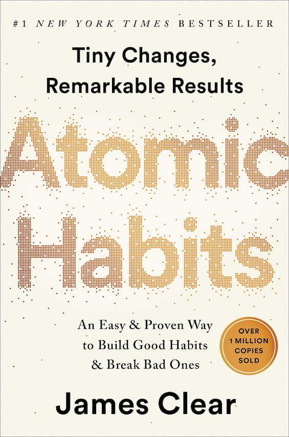

 

<h1 align="center">Atomic Habits.</h1>

<h3 align="center">James Clear - 2018</h3> 

## Table of Contents

- About the Book
- About the Author
- Title Page
- Epigraph
- Introduction: My Story 
- The Fundamentals Why Tiny Changes Make a Big Difference
- 1 The Surprising Power of Atomic Habits
- 2 How Your Habits Shape Your Identity (and Vice Versa)
- 3 How to Build Better Habits in 4 Simple Steps
- The 1st Law Make It Obvious
- 4 The Man Who Didn’t Look Right
- 5 The Best Way to Start a New Habit
- 6 Motivation is Overrated; Environment Often Matters More
- 7 The Secret to Self-Control
- The 2nd Law Make It Attractive
- 8 How to Make a Habit Irresistible
- 9 The Role of Family and Friends in Shaping Your Habits
- 10 How to Find and Fix the Causes of Your Bad Habits
- The 3rd Law Make It Easy
- 11 Walk Slowly, but Never Backward
- 12 The Law of Least Effort
- 13 How to Stop Procrastinating by Using the Two-Minute Rule
- 14 How to Make Good Habits Inevitable and Bad Habits Impossible
- The 4th Law Make It Satisfying
- 15 The Cardinal Rule of Behavior Change
- 16 How to Stick with Good Habits Every Day
- 17 How an Accountability Partner Can Change Everything
- Advanced Tactics How to Go from Being Merely Good to Being Truly Great
- 18 The Truth About Talent (When Genes Matter and When They Don’t)
- 19 The Goldilocks Rule: How to Stay Motivated in Life and Work
- 20 The Downside of Creating Good Habits
- Conclusion: The Secret to Results That Last
- Appendix
- What Should You Read Next?
- Little Lessons from the Four Laws
- How to Apply These Ideas to Business
- How to Apply These Ideas to Parenting
- Acknowledgments
- Notes
- Index
- Copyright

## About the Book

Accomplish more by focusing on less.

Minuscule changes can grow into such life-altering outcomes.

## About the Author

## Title Page

## Epigraph

a·tom·ic 

1. an extremely small amount of a thing; the single irreducible unit of a larger system. 
2. the source of immense energy or power. 

hab·it

1. a routine or practice performed regularly; an automatic response to a specific situation.

## Introduction: My Story 

ON THE FINAL day of my sophomore year of high school, I was hit in the face with a baseball bat... ...After yet another seizure—my third of the day—I was put into a medically induced coma and placed on a ventilator... ...My mother would tell me later, “It was one of the worst nights I’ve ever had.”

### MY RECOVERY

By the next morning my breathing had rebounded to the point where the doctors felt comfortable releasing me from the coma... ...The following months were hard. It felt like everything in my life was on pause... ...Despite my lackluster high school career, I still believed I could become a great player. And I knew that if things were going to improve, I was the one responsible for making it happen.

### HOW I LEARNED ABOUT HABITS

Good sleep habits and went to bed early each night... ...keep my room neat and tidy. These improvements were minor, but they gave me a sense of control over my life. I started to feel confident again... ...A habit is a routine or behavior that is performed regularly—and, in many cases, automatically.

I fulfilled my potential.

We all face challenges in life.

Changes that seem small and unimportant at first will compound into remarkable results if you’re willing to stick with them for years.

In the long run, the quality of our lives often depends on the quality of our habits.

With the same habits, you’ll end up with the same results. But with better habits, anything is possible.

The only way I made progress—the only choice I had—was to start small.

### HOW AND WHY I WROTE THIS BOOK

In 2014, my email list expanded to over one hundred thousand subscribers, which made it one of the fastest-growing newsletters on the internet. I had felt like an impostor when I began writing two years earlier, but now I was becoming known as an expert on habits—a new label that excited me but also felt uncomfortable.

As I put the finishing touches on this book in 2018, jamesclear.com is receiving millions of visitors per month and nearly five hundred thousand people subscribe to my weekly email newsletter—a number that is so far beyond my expectations when I began that I’m not even sure what to think of it.

### HOW THIS BOOK WILL BENEFIT YOU

Naval Ravikant has said, “To write a great book, you must first become the book.”

Small habits helped me fulfill my potential,

In the pages that follow, I will share a step-by-step plan for building better habits—not for days or weeks, but for a lifetime.

This book... ...it’s an operating manual. You’ll find wisdom and practical advice front and center as I explain the science of how to create and change your habits in a way that is easy to understand and apply.

The backbone of this book is my four-step model of habits—cue, craving, response, and reward—and the four laws of behavior change that evolve out of these steps.

Behavioral scientists like Skinner realized that if you offered the right reward or punishment, you could get people to act in a certain way. But while Skinner’s model did an excellent job of explaining how external stimuli influenced our habits, it lacked a good explanation for how our thoughts, feelings, and beliefs impact our behavior. Internal states—our moods and emotions—matter, too. In recent decades, scientists have begun to determine the connection between our thoughts, feelings, and behavior.

Human behavior is always changing: situation to situation, moment to moment, second to second. But this book is about what _doesn’t_ change. It’s about the fundamentals of human behavior.

As long as human behavior is involved, this book will be your guide.

## The Fundamentals Why Tiny Changes Make a Big Difference

## 1 The Surprising Power of Atomic Habits

## 2 How Your Habits Shape Your Identity (and Vice Versa)

## 3 How to Build Better Habits in 4 Simple Steps

## The 1st Law Make It Obvious

## 4 The Man Who Didn’t Look Right

## 5 The Best Way to Start a New Habit

## 6 Motivation is Overrated; Environment Often Matters More

## 7 The Secret to Self-Control

## The 2nd Law Make It Attractive

## 8 How to Make a Habit Irresistible

## 9 The Role of Family and Friends in Shaping Your Habits

## 10 How to Find and Fix the Causes of Your Bad Habits

## The 3rd Law Make It Easy

## 11 Walk Slowly, but Never Backward

## 12 The Law of Least Effort

## 13 How to Stop Procrastinating by Using the Two-Minute Rule

## 14 How to Make Good Habits Inevitable and Bad Habits Impossible

## The 4th Law Make It Satisfying

## 15 The Cardinal Rule of Behavior Change

## 16 How to Stick with Good Habits Every Day

## 17 How an Accountability Partner Can Change Everything

## Advanced Tactics How to Go from Being Merely Good to Being Truly Great

## 18 The Truth About Talent (When Genes Matter and When They Don’t)

## 19 The Goldilocks Rule: How to Stay Motivated in Life and Work

## 20 The Downside of Creating Good Habits

## Conclusion: The Secret to Results That Last

## Appendix

## What Should You Read Next? 
  
  
## Little Lessons from the Four Laws

## How to Apply These Ideas to Business

## How to Apply These Ideas to Parenting

## Acknowledgments

## Notes

## Index

## Copyright

