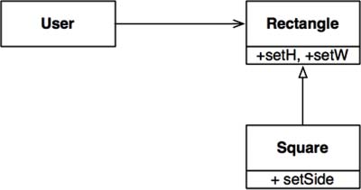
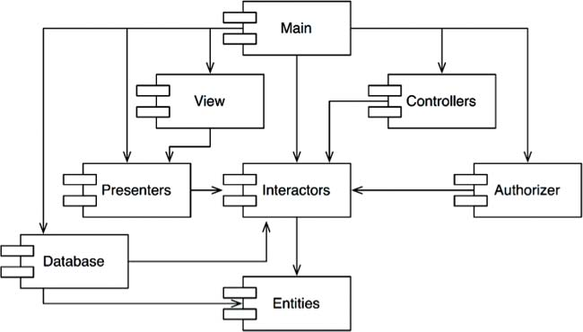
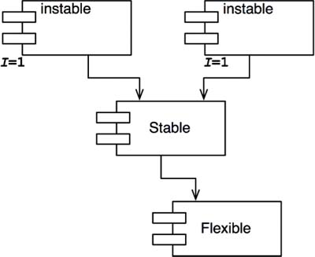
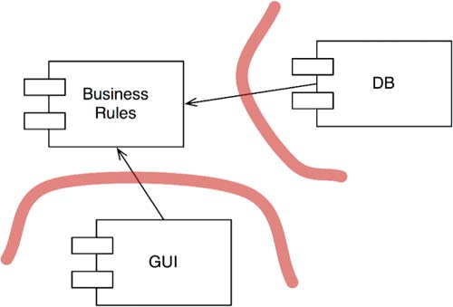
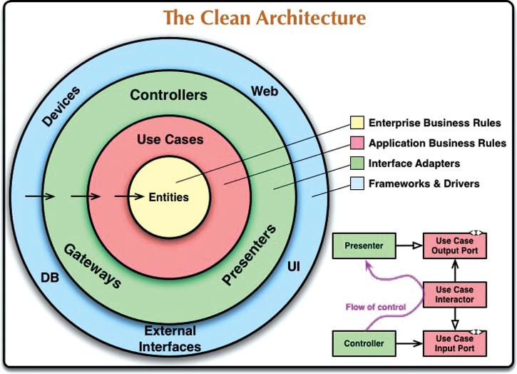

<p align="center"></p> 

<h1 align="center">Clean Architecture. A Craftsman's Guide to Software Structure and Design.</h1>

<h3 align="center">Robert Martin - 2017</h3> 

## Table of Contents

TODO

## Foreword

As with any metaphor, describing software through the lens of architecture can hide as much as it can reveal. It can both promise more than it can deliver and deliver more than it promises.

It’s not obvious that software structure obeys our intuition the way building structure does.

Software is made of software. Large software constructs are made from smaller software components, which are in turn made of smaller software components still, and so on.

Software is recursive and fractal in nature, etched and sketched in code. Everything is details.

You can even argue quite convincingly that there is more design activity and focus in software than in building architecture—in this sense, it’s not unreasonable to consider software architecture more architectural than building architecture!

To mistake boxes for _the_ big picture— for _the_ architecture—is to miss the big picture and the architecture: Software architecture doesn’t look like anything.

Software may be such stuff as dreams are made on, but it runs in the physical world.

> This is the monstrosity in love, lady, that the will is infinite, and the execution confined; that the desire is boundless, and the act a slave to limit.
> — William Shakespeare

> Architecture represents the significant design decisions that shape a system, where significant is measured by cost of change.
> — Grady Booch

A good architecture meet the needs of its users, developers, and owners at a given point in time, but it also meets them over time.

> If you think good architecture is expensive, try bad architecture.
> — Brian Foote and Joseph Yoder

The kinds of changes a system’s development typically experiences should not be the changes that are costly, that are hard to make, that take managed projects of their own rather than being folded into the daily and weekly flow of work.

> Architecture is the decisions that you wish you could get right early in a project, but that you are not necessarily more likely to get them right than any other.
> — Ralph Johnson

Understanding the past is hard enough as it is; our grasp of the present is slippery at best; predicting the future is nontrivial.

The darkest path... ...strong and stable architecture comes from authority and rigidity. If change is expensive, change is eliminated... ...The architect’s mandate is total and totalitarian, with the architecture becoming a dystopia for its developers and a constant source of frustration for all... ...another path... ...speculative generality. A route filled with hard-coded guesswork, countless parameters, tombs of dead code, and more accidental complexity than you can shake a maintenance budget at... ...The path...cleanest... ...recognizes the softness of software and aims to preserve it as a first-class property of the system. It recognizes that we operate with incomplete knowledge, but it also understands that, as humans, operating with incomplete knowledge is something we do, something we’re good at. It plays more to our strengths than to our weaknesses. We create things and we discover things. We ask questions and we run experiments. A good architecture comes from understanding it more as a journey than as a destination, more as an ongoing process of enquiry than as a frozen artifact.

A good architecture comes from understanding it more as a journey than as a destination, more as an ongoing process of enquiry than as a frozen artifact.

> Architecture is a hypothesis, that needs to be proven by implementation and measurement.
> — Tom Gilb

> The only way to go fast, is to go well.
> — Robert C. Martin

## Preface

_The rules of software architecture are independent of every other variable._

There is one thing about the software we have now, compared to the software from back then: _It’s made of the same stuff._ It’s made of `if` statements, assignment statements, and `while` loops... ...you might object and say that we’ve got much better languages and superior paradigms... ...True—and yet the code is still just an assemblage of sequence, selection, and iteration, just as it was back in the 1960s and 1950s.

Changelessness of the code is the reason that the rules of software architecture are so consistent across system types. The rules of software architecture are the rules of ordering and assembling the building blocks of programs. And since those building blocks are universal and haven’t changed, the rules for ordering them are likewise universal and changeless.

## PART I Introduction

It doesn’t take a huge amount of knowledge and skill to get a program working... ...Getting it right is another matter entirely.

Getting software right is _hard._ It takes knowledge and skills... ...discipline and dedication... ...Mostly, it takes a passion for the craft and the desire to be a professional.

When software is done right, it requires a fraction of the human resources to create and maintain.

It is far more common to fight your way through terrible software designs than it is to enjoy the pleasure of working with a good one.

## Chapter 1 What Is Design and Architecture?

What is design? What is architecture? What are the differences between the two?... ...there is no difference between them. _None at all._

The low-level details and the high-level structure are all part of the same whole. They form a continuous fabric that defines the shape of the system. You can’t have one without the other; indeed, no clear dividing line separates them. There is simply a continuum of decisions from the highest to the lowest levels.

### The Goal?

_The goal of software architecture is to minimize the human resources required to build and maintain the required system._

The measure of design quality is simply the measure of the effort required to meet the needs of the customer. If that effort is low, and stays low... ...the design is good. If that effort grows with each new release, the design is bad.

### Case Study

“The race is not to the swift, nor the battle to the strong.”

“The more haste, the less speed.”

Modern developers... ...work their butts off. But a part of their brain _does_ sleep—the part that knows that good, clean, well-designed code _matters._

A familiar lie: “We can clean it up later; we just have to get to market first!” Of course, things never do get cleaned up later, because market pressures never abate. Getting to market first simply means that you’ve now got a horde of competitors on your tail, and you have to stay ahead of them by running as fast as you can.

Developers are overconfident in their ability to remain productive. But the creeping mess of code that saps their productivity never sleeps and never relents. If given its way, it will reduce productivity to zero in a matter of months.

The bigger lie that developers buy into is the notion that writing messy code makes them go fast in the short term, and just slows them down in the long term. Developers who accept this lie exhibit... ...overconfidence in their ability to switch modes from making messes to cleaning up messes sometime in the future, but they also make a simple error of fact. The fact is that _making messes is always slower than staying clean,_ no matter which time scale you are using.

_Making messes is always slower than staying clean._

_The only way to go fast, is to go well._

The only way to reverse the decline in productivity and the increase in cost is to get the developers to stop thinking... ...overconfident... ...and start taking responsibility for the mess that they’ve made.

_Their overconfidence will drive the redesign into the same mess as the original project._

### Conclusion

The best option is for the development organization to recognize and avoid its own overconfidence and to start taking the quality of its software architecture seriously.

To take software architecture seriously, you need to know what good software architecture is.

## Chapter 2 A Tale of Two Values

Every software system provides two different values to the stakeholders: behavior and structure.

### Behavior

The first value of software is its behavior. Programmers are hired to make machines behave in a way that makes or saves money for the stakeholders... ...Many programmers believe that is the entirety of their job. They believe their job is to make the machine implement the requirements and to fix any bugs. They are sadly mistaken.

### Architecture

Software was invented to be “soft.” It was intended to be a way to easily change the behavior of machines. If we’d wanted the behavior of machines to be hard to change, we would have called it _hardware._

Software must be soft—that is, it must be easy to change.

The difficulty in making a change should be proportional only to the scope of the change, and not to the _shape_ of the change.

It is this difference between scope and shape that often drives the growth in software development costs... ...From the stakeholders’ point of view, they are simply providing a stream of changes of roughly similar scope. From the developers’ point of view, the stakeholders are giving them a stream of jigsaw puzzle pieces that they must fit into a puzzle of ever-increasing complexity. Each new request is harder
to fit than the last, because the shape of the system does not match the shape of the request.

The more architecture prefers one shape over another, the more likely new features will be harder and harder to fit into that structure. Therefore architectures should be as shape agnostic are practical.

### The Greater Value

Function or architecture? Which of these two provides the greater value? Is it more important for the software system to work, or is it more important for the software system to be easy to change?... ...simple logical tool of examining the extremes

- _If you give me a program that works perfectly but is impossible to change, then it won’t work when the requirements change, and I won’t be able to make it work. Therefore the program will become useless._
- _If you give me a program that does not work but is easy to change, then I can make it work, and keep it working as requirements change. Therefore the program will remain continually useful._

If you ask the business managers if they want to be able to make changes, they’ll say that of course they do, but may then qualify their answer by noting that the current functionality is more important than any later flexibility. In contrast, if the business managers ask you for a change, and your estimated costs for that change are unaffordably high, the business managers will likely be furious that you allowed the system to get to the point where the change was impractical.

### Eisenhower’s Matrix

> I have two kinds of problems, the urgent and the important. The urgent are not important, and the important are never urgent.
> — Dwight D. Eisenhower

| **Important Urgent**   | **Important Not Urgent**   |
|------------------------|----------------------------|
| **Unimportant Urgent** | **Unimportant Not Urgent** |
Figure 2.1 Eisenhower matrix

The first value of software—behavior—is urgent but not always particularly important. The second value of software—architecture—is important but never particularly urgent.

four couplets into priorities:
1. Urgent and important
2. Not urgent and important
3. Urgent and not important
4. Not urgent and not important

The architecture of the code... ...is in the top two... ...whereas the behavior... ...occupies the first and _third_ positions.

The mistake... ...is to elevate items in position 3 to position 1... ...fail to separate those features that are urgent but not important from those features that truly are urgent and important... ...leads to ignoring the important architecture... ...in favor of the unimportant features.

Business managers are not equipped to evaluate the importance of architecture. _That’s what software developers were hired to do._ Therefore it is the responsibility of the software development team to assert the importance of architecture over the urgency of features.

### Fight for the Architecture

Remember, as a software developer, _you are a stakeholder._ You have a stake in the software that you need to safeguard. That’s part of your role, and part of your duty. And it’s a big part of why you were hired.

Software architects are... ...more focused on the structure of the system than on its features and functions... ...create an architecture that allows those features and functions to be easily developed, modified, and extended.

If architecture comes last, then the system will become ever more costly to develop, and eventually change will become practically impossible for part or all of the system.

## PART II Starting with the Bricks: Programming Paradigms

Software architecture begins with the code.

Alan Turing... ...was the first to understand that programs were simply data... ...writing real programs on real computers... ...in the late 1940s, came assemblers... ...relieved the programmers... ...of translating their programs into binary. In 1951, Grace Hopper invented A0, the first compiler. In fact, she coined the term _compiler._ Fortran was invented in 1953... ...What followed was an unceasing flood of new programming languages.

Paradigms are ways of programming, relatively unrelated to languages. A paradigm tells you which programming structures to use, and when to use them. 

## Chapter 3 Paradigm Overview

### Structured Programming

Dijkstra in 1968... ...showed that the use of unrestrained jumps (`goto` statements) is harmful to program structure... ...he replaced those jumps with... ...`if/then/else` and `do/while/until` constructs.

_Structured programming imposes discipline on direct transfer of control._

### Object-Oriented Programming

1966... ...Ole Johan Dahl and Kristen Nygaard... ...noticed that the function call stack frame in the `ALGOL` language could be moved to a heap, thereby allowing local variables declared by a function to exist long after the function returned. The function became a constructor for a class, the local variables became instance variables, and the nested functions became methods. This led inevitably to the discovery of polymorphism through the disciplined use of function pointers.

_Object-oriented programming imposes discipline on indirect transfer of control._

### Functional Programming

Its invention predates computer programming itself... ...Alonzo Church, in 1936 invented λ-calculus while pursuing the same mathematical problem that was motivating Alan Turing at the same time. His λ-calculus is the foundation of the LISP language, invented in 1958 by John McCarthy. A foundational notion of λ-calculus is immutability—that is, the notion that the values of symbols do not change. This effectively means that a functional language has no assignment statement.

_Functional programming imposes discipline upon assignment._

### Food for Thought

Each of the paradigms _removes_ capabilities from the programmer. None of them adds new capabilities. Each imposes some extra discipline that is _negative_ in its intent. The paradigms tell us what _not_ to do, more than they tell us what _to_ do.

The three paradigms together remove `goto` statements, function pointers, and assignment.

These three paradigms are likely to be the only three we will see... ...they were all discovered within the ten years between 1958 and 1968. In the many decades that have followed, no new paradigms have been added.

### Conclusion

What... ...paradigms have to do with architecture? Everything. We use polymorphism as the mechanism to cross architectural boundaries; we use functional programming to impose discipline on the location of and access to data; and we use structured programming as the algorithmic foundation of our modules... ...those three align with the three big concerns of architecture: function, separation of components, and data management.

## Chapter 4 Structured Programming

### Proof

Dijkstra recognized... ...that programming is _hard,_ and that programmers don’t do it very well... ...Dijkstra’s solution was to apply the mathematical discipline of _proof_... ...Dijkstra discovered that certain uses of `goto`... ...preventing use of the divide-and-conquer approach necessary for reasonable proofs. Other uses of `goto`, however, did not have this problem... ...these “good” uses of `goto` corresponded to... ...structures such as `if/then/else` and `do/while.` Modules that used those kinds of control structures _could_ be recursively subdivided into provable units... ...those control structures, when combined with sequential execution, were special... ...Böhm and Jacopini, who proved that all programs can be constructed from just three structures: sequence, selection, and iteration... ...The very control structures that made a module provable were the same minimum set of control structures from which all programs can be built. Thus structured programming was born.

### A Harmful Proclamation

Nowadays we are all structured programmers, though not necessarily by choice. It’s just that our languages don’t give us the option to use undisciplined direct transfer of control.

### Functional Decomposition

Structured programming allows modules to be recursively decomposed into provable units, which in turn means that modules can be functionally decomposed.

By following these disciplines, programmers could break down large proposed systems into modules and components that could be further broken down into tiny provable functions.

### No Formal Proofs

But the proofs never came. The Euclidean hierarchy of theorems was never built. And programmers at large never saw the benefits of working through the laborious process of formally proving each and every little function correct. In the end, Dijkstra’s dream faded and died.

### Science to the Rescue

Science is fundamentally different from mathematics, in that scientific theories and laws cannot be proven correct... ...I can demonstrate these laws to you, and I can make measurements that show them correct to many decimal places, but I cannot prove them in the sense of a mathematical proof...there is always the chance that some experiment will show that those laws... ...are incorrect.

Scientific theories and laws are _falsifiable_ but not provable.

Science does not work by proving statements true, but rather by _proving statements false._ Those statements that we cannot prove false, after much effort, we deem to be true enough for our purposes.

Not all statements are provable. The statement "This is a lie" is neither true nor false.

Mathematics is the discipline of proving provable statements true. Science, in contrast, is the discipline of proving provable statements false.

### Tests

> Testing shows the presence, not the absence, of bugs.
> — Dijkstra

A program can be proven incorrect by a test, but it cannot be proven correct.

Tests... ...after sufficient testing effort allow us to deem a program to be correct enough for our purposes.

Software development is not a mathematical endeavor, even though it seems to manipulate mathematical constructs. Rather, software is like a science. We show correctness by failing to prove incorrectness, despite our best efforts.

A program that is not provable... ...cannot be deemed correct no matter how many tests are applied to it.

Structured programming forces us to recursively decompose a program into a set of small provable functions. We can then use tests to try to prove those small provable functions incorrect. If such tests fail to prove incorrectness, then we deem the functions to be correct enough for our purposes.

### Conclusion

It is this ability to create falsifiable units of programming that makes structured programming valuable today... ...Moreover, at the architectural level, this is why we still consider _functional decomposition_ to be one of our best practices.

Software is like a science... ...is driven by falsifiability. Software architects strive to define modules, components, and services that are easily falsifiable (testable). To do so, they employ restrictive disciplines similar to structured programming, albeit at a much higher level.

## Chapter 5 Object-Oriented Programming

The basis of a good architecture is the understanding and application of the principles of object-oriented design (OO).

Three magic words to explain the nature of OO: _encapsulation, inheritance, and polymorphism_... ...an OO language must support these three things.

### Encapsulation?

OO languages provide easy and effective encapsulation of data and function.

A line can be drawn around a cohesive set of data and functions. Outside of that line, the data is hidden and only some of the functions are known. We see this concept in action as the private data members and the public member functions of a class.

This idea is certainly not unique to OO. Indeed, we had perfect encapsulation in C... ...But then came OO in the form of C++—and the perfect encapsulation of C was broken. Java and C# simply abolished the header/implementation split altogether, thereby weakening encapsulation even more. In these languages, it is impossible to separate the declaration and definition of a class. For these reasons, it is difficult to accept that OO depends on strong encapsulation... ...the languages that claim to provide OO have only weakened the once perfect encapsulation we enjoyed with C.

### Inheritance?

Inheritance is simply the redeclaration of a group of variables and functions within an enclosing scope.

We might say that we had a kind of inheritance long before OO languages were invented. That statement wouldn’t quite be true, though. We had a trick, but it’s not nearly as convenient as true inheritance. Moreover, multiple inheritance is a considerably more difficult to achieve by such trickery.

While OO languages did not give us something completely brand new, it did make the masquerading of data structures significantly more convenient.

### Polymorphism?

Polymorphic behavior before OO languages? Of course... ...Consider this simple C `copy` program.

```c
#include <stdio.h>
void copy() {
  int c;
  while ((c=getchar()) != EOF)
    putchar(c);
}
```

These functions are _polymorphic_—their behavior depends on the type of `STDIN` and `STDOUT`... ...The UNIX operating system requires that every IO device driver provide five standard functions: `open`, `close`, `read`, `write`, and `seek`. The signatures of those functions must be identical for every IO driver.

The bottom line is that polymorphism is an application of pointers to functions... ...since Von Neumann architectures were first implemented in the late 1940s... ...OO languages may not have given us polymorphism, but they have made it much safer and much more convenient.

The problem with explicitly using pointers to functions to create polymorphic behavior is that pointers to functions are _dangerous._ Such use is driven by a set of manual conventions... ...OO languages eliminate these conventions and, therefore, these dangers.

OO imposes discipline on indirect transfer of control.

#### The Power of Polymorphism

The IO devices have become plugins... ...our programs should be _device independent._

OO allows the plugin architecture to be used anywhere, for anything.

#### Dependency Inversion

Before a safe and convenient mechanism for polymorphism was available. In the typical calling tree, main functions called high-level functions, which called mid-level functions, which called low-level functions... ...source code dependencies inexorably followed the flow of control (Figure 5.1).


Figure 5.1 Source code dependencies versus flow of control


Figure 5.2 Dependency inversion

In Figure 5.2, module `HL1` calls the `F()` function in module `ML1`... ...At runtime, the interface doesn’t exist. `HL1` simply calls `F()` within `ML1`... ...the source code dependency (the inheritance relationship) between `ML1` and the interface `I` points in the opposite direction compared to the flow of control. This is called _dependency inversion,_ and its implications for the software architect are profound... ...convenient polymorphism means that _any source code dependency, no matter where it is, can be inverted_... ...software architects... ...have _absolute control_ over the direction of all source code dependencies in the system. They are not constrained to align those dependencies with the flow of control. No matter which module does the calling and which module is called, the software architect can point the source code dependency in either direction... ...That is the power that OO provides.

UI and the database can be plugins to the business rules... ...the source code of the business rules never mentions the UI or the database.

When the source code in a component changes, only that component needs to be redeployed. This is _independent deployability._

If the modules in your system can be deployed independently, then they can be developed independently by different teams. That’s _independent developability._

### Conclusion

OO is the ability, through the use of polymorphism, to gain absolute control over every source code dependency in the system.

It allows... ...to create a plugin architecture,... ...The low-level details are relegated to plugin modules that can be deployed and developed independently from the modules that contain high-level policies.

## Chapter 6 Functional Programming

Functional programming predate programming itself... ...is based on the λ-calculus invented by Alonzo Church in the 1930s.

### Squares of Integers

Java Program

```java
public class Squint {
  public static void main(String args[]) {
    for (int i=0; i<25; i++)
    System.out.println(i*i);
  }
}
```

Clojure Program

```clojure
(println (take 25 (map (fn [x] (* x x)) (range))))
```

```clojure
(println ;___________________ Print
  (take 25 ;_________________ the first 25
    (map (fn [x] (* x x)) ;__ squares 
      (range)))) ;___________ of Integers
```

The Java program uses a _mutable variable_—a variable that changes state during the execution of the program... ...In the Clojure program, variables like x are initialized, but they are never modified.

Variables in functional languages _do not vary._

### Immutability and Architecture

All race conditions, deadlock conditions, and concurrent update problems are due to mutable variables... ...all the problems that we face in concurrent applications—all the problems we face in applications that require multiple threads, and multiple processors—cannot happen if there are no mutable variables.

Immutability is practicable... ...if you have infinite storage and infinite processor speed. Lacking those infinite resources, the answer is a bit more nuanced.

### Segregation of Mutability

One of the most common compromises in regard to immutability is to segregate the application... ...into mutable and immutable components. The immutable components perform their tasks in a purely functional way, without using any mutable variables... ...communicate with... ...other components that are not purely functional, and allow for the state of variables to be mutated (Figure 6.1).


Figure 6.1 Mutating state and transactional memory

It is common practice to use... ..._transactional memory_ to protect the mutable variables from concurrent updates and race conditions... ...It protects those variables with a transaction-or retry-based scheme.

Well-structured applications will be segregated into those components that do not mutate variables and those that do... ...by the use of appropriate disciplines to protect those mutated variables. Architects would be wise to push as much processing as possible into the immutable components, and to drive as much code as possible out of those components that must allow mutation.

### Event Sourcing

The more memory we have, and the faster our machines are, the less we need mutable state.

Imagine a banking application that maintains the account balances of its customers. It mutates those balances when deposit and withdrawal transactions are executed. Now imagine that instead of storing the account balances, we store only the transactions. Whenever anyone wants to know the balance of an account, we simply add up all the transactions for that account, from the beginning of time. This scheme requires no mutable variables... ...Over time, the number of transactions would grow without bound, and the processing power required to compute the totals would become intolerable. To make this scheme work forever, we would need infinite storage and infinite processing power. But perhaps we don’t have to make the scheme work forever. And perhaps we have enough storage and enough processing power to make the scheme work for the reasonable lifetime of the application. This is the idea behind _event sourcing._

Event sourcing is a strategy wherein we store the transactions, but not the state. When state is required, we simply apply all the transactions from the beginning of time.

We can take shortcuts... ...and save the state every midnight. Then... ...we need compute only the transactions since midnight.

Nothing ever gets deleted or updated from such a data store. As a consequence, our applications are not CRUD; they are just CR... ...there cannot be any concurrent update issues.

If we have enough storage and enough processor power, we can make our applications entirely immutable—and, therefore, _entirely functional._

This is the way your source code control system works.

### Conclusion

- Structured programming is discipline imposed upon direct transfer of control.
- Object-oriented programming is discipline imposed upon indirect transfer of control.
- Functional programming is discipline imposed upon variable assignment.

Each of these three paradigms has taken something away from us. Each restricts some aspect of the way we write code. None of them has added to our power or our capabilities.

Software is not a rapidly advancing technology. The rules of software are the same today as they were in 1946, when Alan Turing wrote the very first code... ...The tools have changed, and the hardware has changed, but the essence of software remains the same.

Software—the stuff of computer programs—is composed of sequence, selection, iteration, and indirection. Nothing more. Nothing less.

## PART III Design Principles

Good software systems begin with clean code. On the one hand, if the bricks aren’t well made, the architecture of the building doesn’t matter much. On the other hand, you can make a substantial mess with well-made bricks. This is where the SOLID principles come in.

The SOLID principles tell us how to arrange our functions and data structures into classes, and how those classes should be interconnected. The use of the word "class" does not imply that these principles are applicable only to object-oriented software. A class is simply a coupled grouping of functions and data. Every software system has such groupings, whether they are called classes or not. The SOLID principles apply to those groupings.

The goal of the principles is the creation of mid-level software structures that:
- Tolerate change,
- Are easy to understand, and
- Are the basis of components that can be used in many software systems.

The term "mid-level" refers to the fact that... ...They are applied just above the level of the code and help to define the kinds of software structures used within modules and components.

The executive summary:
- **SRP:** The Single Responsibility Principle. An active corollary to Conway’s law: The best structure for a software system is heavily influenced by the social structure of the organization that uses it so that each software module has one, and only one, reason to change.
- **OCP:** The Open-Closed Principle. Bertrand Meyer made this principle famous in the 1980s. The gist is that for software systems to be easy to change, they must be designed to allow the behavior of those systems to be changed by adding new code, rather than changing existing code.
- **LSP:** The Liskov Substitution Principle. Barbara Liskov’s famous definition of subtypes, from 1988. In short, this principle says that to build software systems from interchangeable parts, those parts must adhere to a contract that allows those parts to be substi- tuted one for another.
- **ISP:** The Interface Segregation Principle. This principle advises software designers to avoid depending on things that they don’t use.
- **DIP:** The Dependency Inversion Principle. The code that implements high-level policy should not depend on the code that implements low-level details. Rather, details should depend on policies.

> Any organization that designs a system (defined broadly) will produce a design whose structure is a copy of the organization's communication structure.
> — Melvin E. Conway

## Chapter 7 SRP: The Single Responsibility Principle

The Single Responsibility Principle (SRP) might be the least well understood... ...It is too easy for programmers to hear the name and then assume that it means that every module should do just one thing... ...there _is_ a principle like that. A _function_ should do one, and only one, thing. We use that... ...when we are refactoring... ...at the lowest levels. But it is not one of the SOLID principles—it is not the SRP.

Historically, the SRP has been described this way: _A module should have one, and only one, reason to change_... ...satisfy users and stakeholders... ..._are_ the "reason to change"... ...Indeed, we can rephrase the principle to... ..._A module should be responsible to one, and only one, user or stakeholder_... ...the words "user" and "stakeholder" aren’t really the right words to use here... ...we’re really referring to a group... ...We’ll refer to that group as an _actor._ Thus the final version of the SRP is: _A module should be responsible to one, and only one, actor._

A module is just a cohesive set of functions and data structures... ..."cohesive" implies the SRP. Cohesion is the force that binds together the code responsible to a single actor.

The best way to understand this principle is by looking at the symptoms of violating it.

### Symptom 1: Accidental Duplication


Figure 7.1 The `Employee` class

`Employee` class three methods: _calculatePay()_, _reportHours()_, and _save()_ (Figure 7.1)... ...violates the SRP because those three methods are responsible to... ...different actors.
- The `calculatePay()`... ...by the accounting department, which reports to the CFO.
- The `reportHours()`... ...by the human resources department, which reports to the COO.
- The `save()`... ...by the database administrators (DBAs), who report to the CTO
By putting... ...these three methods into a single `Employee` class, the developers have coupled each of these actors to the others. This Symptom 1: Accidental Duplication coupling can cause the actions of the CFO’s team to affect something that the COO’s team depends on.

These problems occur because we put code that different actors depend on into close proximity. The SRP says to _separate the code that different actors depend on._

### Symptom 2: Merges

Merges will be common in source files that contain many different methods. This situation is especially likely if those methods are responsible to different actors.

Merges are risky affairs... ...no tool can deal with every merge case. In the end, there is always risk.

Multiple people changing the same source file for different reasons... ...to avoid this problem is to _separate code that supports different actors._

### Solutions

Many different solutions to this problem. Each moves the functions into different classes.

The most obvious way to solve the problem is to separate the data from the functions... ...


Figure 7.3 The three classes do not know about each other

The downside of this solution is that the developers now have three classes that they have to instantiate and track. A common solution to this dilemma is to use the _Facade_ pattern (Figure 7.4).


Figure 7.4 The `Facade` pattern

The `EmployeeFacade` contains very little code. It is responsible for instantiating and delegating to the classes with the functions.

To keep the most important business rules closer to the data... ...can be done by keeping the most important method in the original Employee class and then using that class as a Facade for the lesser functions (Figure 7.5).


Figure 7.5 The most important method is kept in the original `Employee` class and used as a Facade for the lesser functions

Every class would contain just one function. This is hardly the case. The number of functions required... ...is likely to be large in each case. Each of those classes would have many _private_ methods in them.

Each of the classes that contain such a family of methods is a scope. Outside of that scope, no one knows that the private members of the family exist.

### Conclusion

The Single Responsibility Principle is about functions and classes... ...At the level of components, it becomes the Common Closure Principle. At the architectural level, it becomes the Axis of Change responsible for the creation of Architectural Boundaries.

## Chapter 8 OCP: The Open-Closed Principle

The Open-Closed Principle (OCP) was coined in 1988 by Bertrand Meyer.

> A software artifact should be open for extension but closed for modification.
> — Bertrand Meyer.

The behavior of a software artifact ought to be extendible, without having to modify that artifact... ...is the most fundamental reason that we study software architecture... ...if simple extensions to the requirements force massive changes to the software, then the architects... ...have engaged in a spectacular failure.

## A Thought Experiment

Imagine... ...that we have a system... ...some new code must be written. But how much old code will have to change? A good software architecture would reduce the amount of changed code to the barest minimum. Ideally, zero. How? By properly separating the things that change for different reasons (the Single Responsibility Principle), and then organizing the dependencies between those things properly (the Dependency Inversion Principle).


Figure 8.1 Applying the SRP

Applying the SRP, we... ...come up with the data-flow view shown in Figure 8.1.... ...generating the report involves two separate responsibilities: the calculation of the reported data, and the presentation of that data into a web- and printer-friendly form.

Having made this separation, we need to organize the source code dependencies to ensure that changes to one of those responsibilities do not cause changes in the other. Also, the new organization should ensure that the behavior can be extended without undo modification.

Partitioning the processes into classes, and separating those classes into components, as shown... ...in the diagram in Figure 8.2. In this figure, the component at the upper left is the _Controller._ At the upper right, we have the _Interactor._ At the lower right, there is the _Database._ Finally, at the lower left, there are four components that represent the _Presenters_ and the _Views._ Classes marked with `<I>` are interfaces; those marked with `<DS>` are data structures. Open arrowheads are _using_ relationships. Closed arrowheads are _implements_ or _inheritance_ relationships.


Figure 8.2 Partitioning the processes into classes and separating the classes into components

All the dependencies are _source code_ dependencies. An arrow pointing from class A to class B means that the source code of class A mentions the name of class B, but class B mentions nothing about class A. 

all component relationships are unidirectional, as shown in the component graph in Figure 8.3. These arrows point toward the components that we want to protect from change.


Figure 8.3 The component relationships are unidirectional

If component A should be protected from changes in component B, then component B should depend on component A.

We want to protect the _Controller_ from changes in the _Presenters._ We want to protect the _Presenters_ from changes in the _Views._ We want to protect the _Interactor_ from changes in—well, _anything._... ...Because it contains the business rules. The Interactor contains the highest-level policies of the application. All the other components are dealing with peripheral concerns. The _Interactor_ deals with the central concern.

This creates a hierarchy of protection based on the notion of "level." _Interactors_ are the highest-level concept, so they are the most protected. _Views_ are among the lowest-level concepts, so they are the least protected. _Presenters_ are higher level than _Views,_ but lower level than the _Controller_ or the _Interactor._

How the OCP works at the architectural level. Architects separate functionality based on how, why, and when it changes, and then organize that separated functionality into a hierarchy of components. Higher-level components in that hierarchy are protected from the changes made to lower-level components.

### Directional Control

Much of the complexity... ...was intended to make sure that the dependencies between the components pointed in the correct direction. For example, the `FinancialDataGateway` interface between the `FinancialReportGenerator` and the `FinancialDataMapper` exists to invert the dependency that would otherwise have pointed from the _Interactor_ component to the _Database_ component.

### Information Hiding

The `FinancialReportRequester` is there to protect the `FinancialReportController` from knowing too much about the internals of the _Interactor._ If that interface were not there, then the _Controller_ would have transitive dependencies on the `FinancialEntities`.

Transitive dependencies are a violation of the general principle that software entities should not depend on things they don’t directly use.

Even though our first priority is to protect the _Interactor_ from changes to the _Controller,_ we also want to protect the _Controller_ from changes to the _Interactor_ by hiding the internals of the _Interactor._

### Conclusion

The OCP... ...goal is to make the system easy to extend without incurring a high impact of change. Accomplished by partitioning the system into components, and arranging those components into a dependency hierarchy that protects higher-level components from changes in lower-level components.

## Chapter 9 LSP: The Liskov Substitution Principle

> What is wanted here is something like the following substitution property: If for each object o1 of type S there is an object o2 of type T such that for all programs P defined in terms of T, the behavior of P is unchanged when o1 is substituted for o2 then S is a subtype of T.
> — Barbara Liskov, “Data Abstraction and Hierarchy,” SIGPLAN Notices 23, 5 (May 1988).

### Guiding the Use of Inheritance

Imagine... ...a class named `License`, as shown in Figure 9.1... ...`calcFee()`, is called by the `Billing` application... ...This design conforms to the LSP because the behavior of the `Billing` application does not depend,... ...on which of the two subtypes it uses. Both of the subtypes are substitutable for the `License` type.


Figure 9.1 `License`, and its derivatives, conform to LSP

### The Square/Rectangle Problem



Figure 9.2 The infamous square/rectangle problem

The canonical example of a violation of the LSP is the... ...square/rectangle problem (Figure 9.2)... ...`Square` is not a proper subtype of `Rectangle` because the height and width of the `Rectangle` are independently mutable; in contrast, the height and width of the `Square` must change together... ...to defend against this kind of LSP violation... ...add mechanisms to the `User` (such as an `if` statement) that detects whether the `Rectangle` is, in fact, a `Square`. Since the behavior of the `User` depends on the types it uses, those types are not substitutable.

### LSP and Architecture

In the early years... ...LSP... ...way to guide the use of inheritance... ...However, over the years... ...has morphed into a broader principle of software design... ...to interfaces and implementations.

The LSP is applicable because there are users who depend on well-defined interfaces, and on the substitutability of the implementations of those interfaces.

The best way to understand the LSP from an architectural viewpoint is to look at what happens to the architecture of a system when the principle is violated.

### Example LSP Violation

No architect worth his or her salt would allow... ...Putting word... ...into the code itself creates an opportunity for all kinds of horrible and mysterious errors, not to mention security breaches.

### Conclusion

The LSP can, and should, be extended to the level of architecture. A simple violation of substitutability, can cause a system’s architecture to be polluted with a significant amount of extra mechanisms.

## Chapter 10 ISP: The Interface Segregation Principle


Figure 10.1 The Interface Segregation Principle

The Interface Segregation Principle (ISP) derives... ...from the diagram... ...in Figure 10.1... ...several users who use the operations of the `OPS` class... ...the source code of `User1` will... ...depend on `op2` and `op3`, even though it doesn’t call them... ...a change to the source code of `op2` in `OPS` will force `User1` to be recompiled and redeployed... ...This problem can be resolved by segregating the operations into interfaces as shown in Figure 10.2... ...`User1` will depend on `U1Ops`, and `op1`, but will not depend on `OPS`. Thus a change to `OPS` that `User1` does not care about will not cause `User1` to be recompiled and redeployed.


Figure 10.2 Segregated operations

### ISP and Language

The previously description depends critically on language type. Statically typed languages force programmers to create declarations that users must `import`, or `use`, or otherwise `include`... ...that create the source code dependencies that force recompilation and redeployment. In dynamically typed languages... ...such declarations don’t exist... ...they are inferred at runtime. Thus there are no source code dependencies to force recompilation and redeployment.

Dynamically typed languages create systems that are more flexible and less tightly coupled than statically typed languages.

### ISP and Architecture

It is harmful to depend on modules that contain more than you need.


Figure 10.3 A problematic architecture

For example, an architect working on a system, S... ...So S depends on F. which depends on D (Figure 10.3). Now suppose that D contains features that F does not use and, therefore, that S does not care about. Changes to those features within D may well force the redeployment of F and, therefore, the redeployment of S. Even worse, a failure of one of the features within D may cause failures in F and S.

### Conclusion

Depending on something that carries baggage that you don’t need can cause you troubles that you didn’t expect.

## Chapter 11 DIP: The Dependency Inversion Principle

The Dependency Inversion Principle (DIP) tells us that the most flexible systems are those in which source code dependencies refer only to abstractions, not to concretions.

The `use`, `import`, and `include` statements should refer only to source modules containing interfaces, abstract classes, or some other kind of abstract declaration. Nothing concrete should be depended on.

Source code dependencies should not refer to concrete modules.

Treating this idea as a rule is unrealistic, because software systems must depend on many concrete facilities. For example, the `String` class in Java... ...dependency on the concrete `java.lang.string` cannot, and should not, be avoided.

We tend to ignore the stable background of operating system and platform facilities when it comes to DIP. We tolerate those concrete dependencies because we know we can rely on them not to change.

It is the _volatile_ concrete elements of our system that we want to avoid depending on... ...modules that we are actively developing, and that are undergoing frequent change.

### Stable Abstractions

Every change to an abstract interface corresponds to a change to its concrete implementations. Conversely, changes to concrete implementations do not always, or even usually, require changes to the interfaces that they implement. Therefore interfaces are less volatile than implementations.

Try to find ways to add functionality to implementations without making changes to the interfaces. This is Software Design 101.

Stable software architectures are those that avoid depending on volatile concretions, and that favor the use of stable abstract interfaces.

Coding practices:
- **Don’t refer to volatile concrete classes.** Refer to abstract interfaces instead.
- **Don’t derive from volatile concrete classes.** This is a corollary to the previous rule.
- **Don’t override concrete functions.** Concrete functions often require source code dependencies. When you override those functions, you do not eliminate those dependencies—indeed, you _inherit_ them... ...make the function abstract and create multiple implementations.
- **Never mention the name of anything concrete and volatile.** This is really just a restatement of the principle itself.

In statically typed languages, inheritance is the strongest, and most rigid, of all the source code relationships; consequently, it should be used with great care. In dynamically typed languages, inheritance is less of a problem, but it is still a dependency—and caution is always the wisest choice.

### Factories

The creation of volatile concrete objects requires special handling... ...because, in virtually all languages, the creation of an object requires a source code dependency on the concrete definition of that object.

In most object-oriented languages... ...we would use an _Abstract Factory_ to manage this undesirable dependency... ...Figure 11.1 shows the structure. The `Application` uses the `ConcreteImpl` through the `Service` interface. However, the `Application` must somehow create instances of the `ConcreteImpl`. To achieve this without creating a source code dependency on the `ConcreteImpl`, the `Application` calls the `makeSvc` method of the `ServiceFactory` interface. This method is implemented by the `ServiceFactoryImpl` class, which derives from `ServiceFactory`. That implementation instantiates the `ConcreteImpl` and returns it as a `Service`. The curved line in Figure 11.1 is an architectural boundary. It separates the abstract from the concrete. All source code dependencies cross that curved line pointing in the same direction, toward the abstract side.


Figure 11.1 Use of the _Abstract Factory_ pattern to manage the dependency

The abstract component contains all the high-level business rules of the application. The concrete component contains all the implementation details that those business rules manipulate.

The flow of control crosses the curved line in the opposite direction of the source code dependencies. The source code dependencies are inverted against the flow of control—which is why we refer to this principle as Dependency Inversion.

### Concrete Components

The concrete component in Figure 11.1 contains a single dependency, so it violates the DIP. This is typical. DIP violations cannot be entirely removed, but they can be gathered into a small number of concrete components and kept separate from the rest of the system.

Most systems will contain at least one concrete component—often called `main` because it contains the `main` function... ...in Figure 11.1, the `main` function would instantiate the `ServiceFactoryImpl` and place that instance in a global variable of type `ServiceFactory`. The `Application` would then access the factory through that global variable.

### Conclusion

DIP... ...will be the most visible organizing principle in our architecture diagrams.

The curved line in Figure 11.1 will become the architectural boundaries... ...The way the dependencies cross that curved line in one direction, and toward more abstract entities, will become... ...the _Dependency Rule._

## PART IV Component Principles

The SOLID principles tell us how to arrange the bricks into walls and... ...component principles tell us how to arrange the rooms into buildings. Large software systems, like large buildings, are built out of smaller components.

## Chapter 12 Components

Components are... ...the smallest entities that can be deployed as part of a system... ...In all languages, they are the granule of deployment.

Regardless of how they are eventually deployed, well designed components always retain the ability to be independently deployable and, therefore, independently developable.

### A Brief History of Components

In the early years of software development, programmers controlled the memory location and layout of their programs... ...This kind of programming is a foreign concept for most programmers today. They rarely have to think about where a program is loaded in the memory of the computer. But in the early days... ...programs were not relocatable.

How did you access a library function in those olden days?... ...Programmers included the source code of the library functions with their application code... ...Libraries were kept in source, not in binary.

The problem... ...was that... ...devices were slow and memory was expensive... ...Compiling a large program could take hours... ...To shorten the compile times, programmers separated the source code of the function library from the applications. They compiled the function library separately and loaded the binary at a known address... ...When they wanted to run an application, they would load the binary function library,2 and then load the application... ...soon applications grew to be larger than the space allotted... ...programmers had to split their applications into two address segments, jumping around the function library... ...this was not a sustainable situation. As programmers added more functions to the function library, it exceeded its bounds, and they had to allocate more space for it... ...This fragmentation of programs and libraries necessarily continued as computer memory grew. Clearly, something had to be done.

### Relocatability

Relocatable binaries... ...The compiler was changed to output binary code that could be relocated in memory by a smart loader. The loader would be told where to load the relocatable code. The relocatable code was instrumented with flags that told the loader which parts of the loaded data had to be altered to be loaded at the selected address. Usually this just meant adding the starting address to any memory reference addresses in the binary. Now the programmer could tell the loader where to load the function library, and where to load the application... ...This allowed programmers to load only those functions that they needed... ...The compiler was also changed to emit the names of the functions as metadata in the relocatable binary... ...Then the loader could _link_ the external references to the external definitions... ...And the linking loader was born.

### Linkers

The linking loader allowed programmers to divide their programs up onto separately compilable and loadable segments.

As programs grew larger and larger, and more library functions accumulated in libraries, a linking loader could take more than an hour just to load the program. Eventually, the loading and the linking were separated into two phases.... ...the slow part—the part that did that linking... ...into a separate application called the _linker._ The output... ...was a linked relocatable that a relocating loader could load very quickly. This allowed programmers to prepare an executable using the slow linker, but then they could load it quickly, at any time.

Then came the 1980s. Programmers were working in C or some other high- level language. As their ambitions grew, so did their programs. Programs that numbered hundreds of thousands of lines of code were not unusual... ...The linker would then take even more time. Turnaround had again grown to an hour or more in many cases... ...Throughout the 1960s, 1970s, and 1980s, all the changes made to speed up workflow were thwarted by programmers’ ambitions, and the size of the programs they wrote... ...of course... ..._Programs will grow to fill all available compile and link time._

In the late 1980s... ...Disks started to shrink and got significantly faster. Computer memory started to get so ridiculously cheap that much of the data on disk could be cached in RAM. Computer clock rates increased from 1 MHz to 100 MHz. By the mid-1990s, the time spent linking had begun to shrink faster than our ambitions could make programs grow. In many cases, link time decreased to a matter of _seconds._ For small jobs, the idea of a linking loader became feasible again... ...We could link together several... ...files, or several shared libraries in a matter of seconds, and execute the resulting program. And so the component plugin architecture was born.

### Conclusion

These dynamically linked files, which can be plugged together at runtime, are the software components of our architectures. It has taken 50 years, but we have arrived at a place where component plugin architecture can be the casual default as opposed to the herculean effort it once was.

## Chapter 13 Component Cohesion

Three principles of component cohesion:
- **REP:** The Reuse/Release Equivalence Principle
- **CCP:** The Common Closure Principle
- **CRP:** The Common Reuse Principle

### The Reuse/Release Equivalence Principle

_The granule of reuse is the granule of release._

The last decade... ...a vast number of reusable components and component libraries have been created. We are now living in the age of software reuse—a fulfillment of one of the oldest promises of the object- oriented model.

The Reuse/Release Equivalence Principle (REP)... ...components are tracked through a release process and are given release numbers... ...to ensure that all the reused components are compatible with each other... ...developers need to know when new releases are coming, and which changes those new releases will bring.

The release process must produce the appropriate notifications and release documentation so that users can make informed decisions about when and whether to integrate the new release.

Classes and modules that are formed into a component must belong to a cohesive group.

Classes and modules that are grouped together into a component should be _releasable_ together.

The fact that they share the same version number and the same release tracking, and are included under the same release documentation, should make sense both to the author and to the users.

It is hard to precisely explain the glue that holds the classes and modules together into a single component... ...violations are easy to detect— they don’t “make sense.” If you violate the REP, your users will know, and they won’t be impressed with your architectural skills.

The weakness of this principle is... ...compensated for by the strength of... ...the CCP and the CRP.

### The Common Closure Principle

_Gather into components those classes that change for the same reasons and at the same times. Separate into different components those classes that change at different times and for different reasons._

This is the Single Responsibility Principle restated for components. Just as the SRP says that a _class_ should not contain multiples reasons to change, so the Common Closure Principle (CCP) says that a _component_ should not have multiple reasons to change.

For most applications, maintainability is more important than reusability. If the code in an application must change, you would rather that all of the changes occur in one component, rather than being distributed across many components

If changes are confined to a single component, then we need to redeploy only the one changed component. Other components that don’t depend on the changed component do not need to be revalidated or redeployed.

This principle is closely associated with the Open Closed Principle (OCP). Indeed, it is "closure" in the OCP sense of the word that the CCP addresses. The OCP states that classes should be closed for modification but open for extension. Because 100% closure is not attainable, closure must be strategic. We design our classes such that they are closed to the most common kinds of changes that we expect or have experienced.

The CCP... ...by gathering together... ...those classes that are closed to the same types of changes... ...when a change in requirements comes along... ...being restricted to a minimal number of components.

#### Similarity with SRP

_Gather together those things that change at the same times and for the same reasons. Separate those things that change at different times or for different reasons._

### The Common Reuse Principle

_Don’t force users of a component to depend on things they don’t need._

The Common Reuse Principle (CRP)... ...helps us to decide which classes and modules should be placed into a component... ...classes and modules that tend to be reused together belong in the same component.

Classes are seldom reused in isolation. More typically, reusable classes collaborate with other classes that are part of the reusable abstraction... ...these classes belong together in the same component. In such... ...we would expect... ...classes that have lots of dependencies on each other.

The CRP... ...tells us which classes _not_ to keep together in a component. When one component uses another, a dependency is created between... ...The _using_ component depends on the _used_ component... ...every time the _used_ component is changed, the _using_ component will need corresponding changes.

When we depend on a component, we want to make sure we depend on every class in that component... ...we want to make sure that the classes that we put into a component are inseparable—that it is impossible to depend on some and not on the others. Otherwise, we will be redeploying more components than is necessary.

Classes that are not tightly bound to each other should not be in the same component.

#### Relation to ISP

The CRP is the generic version of the ISP. The ISP advises us not to depend on classes that have methods we don’t use. The CRP advises us not to depend on components that have classes we don’t use.

_Don’t depend on things you don’t need._

### The Tension Diagram for Component Cohesion

The three cohesion principles tend to fight each other. The REP and CCP are _inclusive_ principles: Both tend to make components larger. The CRP is an _exclusive_ principle, driving components to be smaller. It is the tension between these principles that good architects seek to resolve.

Figure 13.1 is a tension diagram that shows how the three principles of cohesion interact with each other. The edges of the diagram describe the _cost_ of abandoning the principle on the opposite vertex. 


Figure 13.1 Cohesion principles tension diagram

An architect who focuses on just the REP and CRP will find that too many components are impacted when simple changes are made. In contrast, an architect who focuses too strongly on the CCP and REP will cause too many unneeded releases to be generated.

A good architect finds a position in that tension triangle that meets the _current_ concerns of the development team, but is also aware that those concerns will change over time.

Early in the development of a project, the CCP is much more important than the REP, because developability is more important than reuse.

Projects tend to start on the right hand side of the triangle... ...As the project matures, and other projects begin to draw from it, the project will slide over to the left.... ...the component structure of a project can vary with time and maturity. It has more to do with the way that project is developed and used, than with what the project actually does.

It has more to do with the way that project is developed and used, than with what the project actually does.

### Conclusion

In the past, our view of cohesion was... ...that cohesion was simply the attribute that a module performs one, and only one, function. However, the three principles of component cohesion describe a much more complex variety of cohesion... ...we must consider the opposing forces involved in reusability and develop-ability. Balancing these forces... ...is nontrivial. Moreover, the balance is almost always dynamic. That is, the partitioning that is appropriate today might not be appropriate next year... ...the composition of the components will jitter and evolve... ...as the focus of the project changes from develop-ability to reusability. 

## Chapter 14 Component Coupling

The forces that impinge upon the architecture of a component structure are technical, political, and volatile.

### The Acyclic Dependencies Principle

_Allow no cycles in the component dependency graph._

Worked all day, gotten some stuff working, and then gone home, only to arrive the next morning to find that your stuff no longer works? Why doesn’t it work? Because somebody stayed later than you and changed something you depend on!... ..."the morning after syndrome."

The "morning after syndrome" occurs in development environments where many developers are modifying the same source files. In small projects... ...it isn’t too big a problem. But as... ...the project and the development team grow, the mornings after can get pretty nightmarish... ...everyone keeps on changing and changing their code trying to make it work with the last changes that someone else made.

Two solutions... ..."the weekly build," and... ...the Acyclic Dependencies Principle (ADP).

#### The Weekly Build

The weekly build... ...All the developers ignore each other for the first four days of the week. They all work on private copies of the code, and don’t worry about integrating their work on a collective basis. Then, on Friday, they integrate all their changes and build the system... ...advantage of allowing the developers to live in an isolated world for four days out of five. The disadvantage... ...large integration penalty that is paid on Friday.

Eventually this situation becomes so frustrating that the developers, or the project managers, declare that the schedule should be changed to a biweekly build. This suffices for a time, but... ...this scenario leads to a crisis... ...Integration and testing become increasingly harder to do, and the team loses the benefit of rapid feedback.

#### Eliminating Dependency Cycles

Partition the development environment into releasable components.

Components become units of work that can be the responsibility of a single developer, or a team of developers... ...they release it for use by the other developers... ...They then continue to modify their component in their own private areas. Everyone else uses the released version.

As new releases of a component are made available, other teams... ...Once they decide that they are ready, they begin to use the new release.

No team is at the mercy of the others... ...Moreover, integration happens in small increments.

To make it work successfully, however, you must _manage_ the dependency structure of the components. _There can be no cycles._ If there are cycles in the dependency structure, then the "morning after syndrome" cannot be avoided.

The component diagram in Figure 14.1... ...this structure is a _directed graph._ The components are the _nodes,_ and the dependency relationships are the _directed edges_... ...Regardless of which component you begin at, it is impossible to follow the dependency relationships and wind up back at that component. This structure has no cycles. It is a _directed acyclic graph_ (DAG).



Figure 14.1 Typical component diagram

When `Main` is released, it has utterly no effect on any of the other components in the system... ...This is nice... ...the impact of releasing `Main` is relatively small.

When the developers working on the `Presenters` would like to run a test... ...just need to build... ...the versions of the `Interactors` and `Entities` components that they are currently using... ...This is nice... ...little work to do to set up a test, and... ...few variables to consider.

To release the whole system, the process proceeds from the bottom up... ...This process is very clear and easy to deal with... ...because we understand the dependencies between its parts.

#### The Effect of a Cycle in the Component Dependency Graph

Let’s say that the `User` class in `Entities` uses the `Permissions` class in `Authorizer`. This creates a dependency cycle, as shown in Figure 14.2... ...This makes `Database` much more difficult to release. `Entities`, `Authorizer`, and `Interactors` have, in effect, become one large component... ...developers working on any of those components will experience the dreaded "morning after syndrome."


Figure 14.2 A dependency cycle

When we want to test the `Entities` component... ...we must build and integrate with `Authorizer` and `Interactors`. This level of coupling between components is troubling, if not intolerable.

Cycles in the dependency graph... ...make it very difficult to isolate components. Unit testing and releasing become very difficult and error prone. In addition, build issues grow geometrically with the number of modules.

When there are cycles in the dependency graph, it can be very difficult to work out the order in which you must build the components. Indeed, there probably is no correct order.

#### Breaking the Cycle

It is always possible to break a cycle of components and reinstate the dependency graph as a DAG... ...two primary mechanisms

1. Apply the Dependency Inversion Principle (DIP)... ...in Figure 14.3... ...create an interface that has the methods that `User` needs... ...then put that interface into `Entities` and inherit it into `Authorizer`. This inverts the dependency between `Entities` and `Authorizer`, thereby breaking the cycle.


Figure 14.3 Inverting the dependency between `Entities` and `Authorizer`

2. Create a new component that both `Entities` and `Authorizer` depend on... ...(Figure 14.4).


Figure 14.4 The new component that both `Entities` and `Authorizer` depend on

#### The "Jitters"

The second solution implies that the component structure is volatile in the presence of changing requirements... ...When cycles occur, they must be broken somehow. Sometimes this will mean creating new components, making the dependency structure grow.

### Top-Down Design

The component structure cannot be designed from the top down. It is not one of the first things about the system that is designed, but rather evolves as the system grows and changes.

We have come to expect that large-grained decompositions, like components, will also be high- level _functional_ decompositions... ...we believe that the components ought to somehow represent the functions of the system. Yet this does not seem to be an attribute of component dependency diagrams.

Component dependency diagrams have very little do to with describing the function of the application. Instead, they are a map to the _buildability_ and _maintainability_ of the application... ...they aren’t designed at the beginning of the project. There is no software to build or maintain, so there is no need for a build and maintenance map.

As more and more modules accumulate in the early stages of implementation and design, there is a growing need to manage the dependencies so that the project can be developed without the "morning after syndrome."

So we start paying attention to the SRP and CCP and collocate classes that are likely to change together.

One of the overriding concerns with this dependency structure is the isolation of volatility. We don’t want components that change frequently and for capricious reasons to affect components that otherwise ought to be stable... ...Consequently, the component dependency graph is created and molded by architects to protect stable high- value components from volatile components.

As the application continues to grow, we start to become concerned about creating reusable elements... ...the CRP begins to influence the composition of the components. Finally, as cycles appear, the ADP is applied and the component dependency graph jitters and grows.

If we tried to design the component dependency structure before we designed any classes, we would likely fail rather badly. We would not know much about common closure, we would be unaware of any reusable elements, and we would almost certainly create components that produced dependency cycles.

The component dependency structure grows and evolves with the logical design of the system.

### The Stable Dependencies Principle

_Depend in the direction of stability._

Designs cannot be completely static. Some volatility is necessary if the design is to be maintained.

By conforming to the Common Closure Principle (CCP), we create components that... ...are _designed_ to be volatile. We _expect_ them to change.

Any component... ...volatile should not be depended on by a component that is difficult to change. Otherwise... ...will also be difficult to change.

By conforming to the Stable Dependencies Principle (SDP), we ensure that modules that are intended to be easy to change are not depended on by modules that are harder to change.

#### Stability

What is meant by "stability"? Stand a penny on its side. Is it stable in that position? You would likely say "no." However, unless disturbed, it will remain in that position for a very long time.

Stability has nothing directly to do with frequency of change.

Stability is related to the amount of work required to make a change.

One sure way to make a software component difficult to change, is to make lots of other software components depend on it.

in Figure 14.5 `X` is a stable component. Three components depend on `X`, so it has three good reasons not to change... ...`X` is _responsible_ to those three components. Conversely, `X` depends on nothing, so it has no external influence to make it change. We say it is _independent._


Figure 14.5 `X`: a stable component

Figure 14.6 `Y` is a very unstable component. No other components depend on Y, so we say that it is irresponsible. Y also has three components that it depends on, so changes may come from three external sources. We say that Y is dependent.


Figure 14.6 `Y`: a very unstable component

#### Stability Metrics

Stability of a component... ...number of dependencies that enter and leave that component... ...to calculate the `positional` stability of the component.

- _Fan-in:_ Incoming dependencies... ...number of classes outside this component that depend on classes within the component.
- _Fan-out:_ Outgoing depenencies... ...number of classes inside this component that depend on classes outside the component.
- _I: Instability: I = Fan-out , (Fan-in + Fan-out)_... ...range [0, 1]. _I_ = 0... ...maximally stable. _I_ = 1 indicates a maximally unstable.


Figure 14.7 Our example

Example in Figure 14.7... ...stability of the component `Cc`... ...three classes... ...depend on classes in `Cc`. Thus, _Fan-in_ = 3... ...one class outside _Cc_ that classes in `Cc` depend on. Thus, _Fan-out_ = 1 and _I_ = 1/4.

The _I_ metric is easiest to calculate when you have organized your source code such that there is one class in each source file.

When the _I_ is equal to 1... ...and this component depends on other components (_Fan-out_ > 0)

When the _I_ is equal to 1... ...and this component depends on other components (Fan-out > 0)... ...This... ...component... ...is irresponsible and dependent. Its lack of dependents gives the component no reason not to change, and the components that it depends on may give it ample reason to change. In contrast, when the _I_ is equal to 0... ...is _responsible_ and _independent._ It is as stable as it can get. Its dependents make it hard to change the component, and its has no dependencies that might force it to change.

The SDP says that the _I_ metric of a component should be larger than the _I_ metrics of the components that it depends on. That is, _I_ metrics should _decrease_ in the direction of dependency.

#### Not All Components Should Be Stable

If all the components in a system were maximally stable, the system would be unchangeable.

We want... ...our component structure so that some components are unstable and some are stable.

Putting the unstable components at the top... ...is a useful convention because any arrow that points _up_ is violating the SDP (and, as we shall see later, the ADP).


Figure 14.8 An ideal configuration for a system with three components



Figure 14.9 SDP violation

The diagram in Figure 14.9 shows how the SDP can be violated. `Flexible`is... ...designed to be easy to change. We want `Flexible` to be unstable... ...a dependency on `Flexible`... ...violates the SDP because the _I_ metric for `Stable` is much smaller than the _I_ metric for `Flexible`... ...A change to `Flexible` will force us to deal with `Stable` and all its dependents.


Figure 14.10 `U` within `Stable` uses `C` within `Flexible`

Let’s assume... ...(Figure 14.10)... ...We can fix this by employing the DIP... ...in Figure 14.11. This breaks the dependency of `Stable` on `Flexible`, and forces both components to depend on `UServer`. `UServer` is very stable (_I_ = 0), and `Flexible` retains its necessary instability (_I_ = 1). All the dependencies now flow in the direction of _decreasing_ I.


Figure 14.11 `C` implements the interface class `US`

#### Abstract Components

Create a component... ...that contains nothing but an interface... ...is a very common, and necessary, tactic when using statically typed languages... ...These abstract components are very stable and, therefore, are ideal targets for less stable components to depend on.

Dynamically typed languages... ...abstract components don’t exist at all, nor do the dependencies that would have targeted them... ...dependency inversion does not require either the declaration or the inheritance of interfaces.

### The Stable Abstractions Principle

_A component should be as abstract as it is stable._

#### Where Do We Put the High-Level Policy?

The software that encapsulates the high-level policies of the system should be placed into stable components (_I_ = 0). Unstable components (_I_ = 1) should contain only the software that is volatile... ...However, if the high-level policies are placed into stable components, then the source code that represents those policies will be difficult to change. This could make the overall architecture inflexible. How can a component that is maximally stable (_I_ = 0) be flexible enough to withstand change?... ...OCP tells us that it is possible and desirable to create classes that are flexible enough to be extended without requiring modification... ..._Abstract classes._

#### Introducing the Stable Abstractions Principle

The Stable Abstractions Principle (SAP) sets up a relationship between stability and abstractness. On the one hand, it says that a stable component should also be abstract so that its stability does not prevent it from being extended. On the other hand, it says that an unstable component should
be concrete since it its instability allows the concrete code within it to be easily changed.

If a component is to be stable... ...consist of interfaces and abstract classes so that it can be extended.

Stable components that are extensible are flexible and do not overly constrain the architecture.

The SDP says that dependencies should run in the direction of stability, and the SAP says that stability implies abstraction. Thus _dependencies run in the direction of abstraction._

The DIP... ...deals with classes... ...Either a class is abstract or it is not. The combination of the SDP and the SAP deals with components, and... ...a component can be partially abstract and partially stable.

#### Measuring Abstraction

The _A_ metric is a measure of the abstractness of a component... ...ratio of interfaces and abstract classes... ...to the total number of classes in the component.
- _Nc:_ The number of classes in the component.
- _Na:_ The number of abstract classes and interfaces in the component.
- _A:_ Abstractness. _A = Na ÷ Nc._

The _A_ metric ranges from 0 to 1... ...0 no abstract classes... ...1 nothing but abstract classes.

#### The Main Sequence

Relationship between stability _(I)_ and abstractness _(A)_... ...(Figure 14.12)... ...components that are maximally stable and abstract at the upper left at (0, 1). Components that are maximally unstable and concrete are at the lower right at (1, 0).


Figure 14.12 The I/A graph

There is a locus of points on the _A/I_ graph that defines reasonable positions for components... ...by finding the areas where components should _not_ be... ...determining the zones of _exclusion_ (Figure 11.13).


Figure 14.13 Zones of exclusion

#### The Zone of Pain

A component is not desirable because it is rigid. It cannot be extended because it is not abstract, and it is very difficult to change because of its stability.

Within the Zone of Pain. An example... ...Database schemas are notoriously volatile, extremely concrete, and highly depended on... ...the interface between OO applications and databases is so difficult to manage... ...schema updates are generally painful.

Although a library has an _I_ metric of 1, it may actually be nonvolatile... ...Nonvolatile components are harmless in the (0, 0) zone since they are not likely to be changed... ...only volatile components are problematic in the Zone of Pain.

The more volatile a component in the Zone of Pain, the more "painful" it is. Indeed, we might consider volatility to be a third axis of the graph... ...Figure 14.13 shows only the most painful plane, where volatility = 1.

#### The Zone of Uselessness

A component near (1, 1)... ...is undesirable because it is maximally abstract, yet has no dependents.

Leftover abstract classes that no one ever implemented... ...sitting in the code base, unused. A component... ...deep within the Zone of Uselessness must contain a significant fraction of such entities... ...the presence of such useless entities is undesirable.

#### Avoiding the Zones of Exclusion

 our most volatile components should be kept as far from both zones of exclusion as possible. The locus of points that are maximally distant from each zone is the line that connects (1, 0) and (0, 1)... ...the _Main Sequence._
 
A component that sits on the Main Sequence is not "too abstract" for its stability, nor is it "too unstable" for its abstractness. It is neither useless nor particularly painful. It is depended on to the extent that it is abstract, and it depends on others to the extent that it is concrete.

The most desirable position for a component is at one of the two endpoints of the Main Sequence... ...However... ...some... ...components... ...are neither perfectly abstract nor perfectly stable... ...have the best characteristics if they are on, _or close,_ to the Main Sequence.

#### Distance from the Main Sequence

D^3: Distance. _D = |A+I-1|_ . The range is [0, 1]... ...0 the component is directly on the Main Sequence... ...1 the component is as far away as possible from the Main Sequence.

A design can be analyzed for its overall conformance to the Main Sequence... ...Any component that has a _D_ value that is not near zero can be reexamined and restructured.

We can calculate the mean and variance of all the _D_ metrics for the components within a design. We would expect... ...that are close to zero. The variance can be used to establish "control limits" so as to identify components that are "exceptional" in comparison to all the others.

Figure 14.14... ...the bulk... ...along the Main Sequence, but some are more than one standard deviation (Z = 1) away. These are worth examining more closely... ...they are either very abstract... ...or very concrete. 


Figure 14.14 Scatterplot of the components

Plot the _D_ metric of each component over time... ...Figure 14.15... ...plot shows a control threshold at _D_ = 0.1. The R2.1 point has exceeded this control limit, so it would be worth... ...to find out why this component is so far from the main sequence.


Figure 14.15 Plot of _D_ for a single component over time

### Conclusion

The _dependency management metrics_... ...are... ...not a god; it is merely a measurement against an arbitrary standard.

## PART V Architecture

## Chapter 15 What Is Architecture?

A software architect is a programmer; and continues to be a programmer... ...They do not! Software architects are the best programmers, and they continue to take programming tasks, while they also guide the rest of the team toward a design that maximizes productivity.

They cannot do their jobs properly if they are not experiencing the problems that they are creating for the rest.

The architecture of a software system is the shape given to that system by those who build it... ...to facilitate the development, deployment, operation, and maintenance of the software system contained within it. _The strategy behind that is to leave as many options open as possible, for as long as possible._

The architecture of a system has very little bearing on whether that system works... ...rather in their deployment, maintenance, and ongoing development.

Architecture... ...role is passive and cosmetic, not active or essential.

There are few, if any, _behavioral_ options that the architecture of a system can leave open.

The primary purpose of architecture is to support the life cycle of the system.

Good architecture makes the system easy to understand, easy to develop, easy to maintain, and easy to deploy.

The ultimate goal is to minimize the lifetime cost of the system and to maximize programmer productivity.

### Development

A software system that is hard to develop is not likely to have a long and healthy lifetime.

Architecture of a system should make that system easy to develop.

The reason why so many systems lack good architecture: They were begun with none, because the team was small and did not want the impediment of a superstructure.

A component-per-team architecture is not likely to be the best architecture for deployment, operation, and maintenance of the system. Nevertheless, it is the architecture that a group of teams will gravitate toward if they are driven solely by development schedule.

### Deployment

To be effective, a software system must be deployable.

The higher the cost of deployment, the less useful the system is.

A goal of a software architecture... ...to make a system that can be easily deployed _with a single action._

Deployment strategy is seldom considered during initial development. This leads to architectures that may make the system easy to develop, but leave it very difficult to deploy.

### Operation

The impact of architecture on system operation tends to be less dramatic than the impact of architecture on development, deployment, and maintenance.

Almost any operational difficulty can be resolved by throwing more hardware at the system without drastically impacting the software architecture.

The fact that hardware is cheap and people are expensive means that architectures that impede operation are not as costly as architectures that impede development, deployment, and maintenance.

A good software architecture communicates the operational needs of the system.

Architecture should reveal operation... ...elevate the use cases, the features, and the required behaviors of the system to first-class entities... ...This simplifies the understanding of the system and, therefore, greatly aids in development and maintenance.

### Maintenance

Of all the aspects of a software system, maintenance is the most costly.

The primary cost of maintenance is in _spelunking_ and risk. Spelunking is the cost of digging through the existing software, trying to determine the best place and the best strategy to add a new feature or to repair a defect. While making such changes, the likelihood of creating inadvertent defects is always there, adding to the cost of risk.

By separating the system into components, and isolating those components through stable interfaces, it is possible to illuminate the pathways for future features and greatly reduce the risk of inadvertent breakage.

### Keeping Options Open

Software has two types of value: the value of its behavior and the value of its structure. The second of these is the greater of the two because it is this value that makes software _soft._

Software was invented because we needed a way to quickly and easily change the behavior of machines.

The way you keep software soft is to leave as many options open as possible, for as long as possible.

The options that we need to leave open _are the details that don’t matter._

All software systems... ...two major elements: policy and details. The policy element embodies all the business rules and procedures... ...where the true value of the system lives. The details are those things that are necessary to enable humans, other systems, and programmers to communicate with the policy, but that do not impact the behavior of the policy at all. They include IO devices, databases, web systems, servers, frameworks, communication protocols, and so forth.

The goal... ...is to create a shape for the system that recognizes policy as the most essential element of the system while making the details _irrelevant_ to that policy. This allows decisions about those details to be _delayed_ and _deferred._

The high-level policy should not care which kind of database will be used.

It is not necessary to choose a web server early in development, because the high-level policy should not know that it is being delivered over the web... ...Indeed, _you don’t even have to decide if the system will be delivered over the web._

It is not necessary to adopt REST early in development, because the high- level policy should be agnostic about the interface to the outside world.

It is not necessary to adopt a dependency injection framework... ...because the high-level policy should not care how dependencies are resolved.

If you can develop the high-level policy without committing to the details that surround it, you can delay and defer decisions about those details for a long time. And the longer you wait to make those decisions, _the more information you have with which to make them properly._

This also leaves you the option to try different experiments. If you have a portion of the high-level policy working, and it is agnostic about the database, you could try connecting it to several different databases to check applicability and performance. 

The longer you leave options open... ...the more things you can try, and the more information you will have when you reach the point at which those decisions can no longer be deferred.

If the decisions have already been made by someone else... ..._A good architect pretends that the decision has not been made,_ and shapes the system such that those decisions can still be deferred or changed.

_A good architect maximizes the number of decisions not made._

### Device Independence

1960s... ...One mistake was to bind our code directly to the IO devices... ...Our code was _device dependent_... ...all our software was written to manipulate card readers and card punches. Those programs had to be rewritten to use magnetic tape. That was a big job. By the late 1960s, we had learned our lesson—and we invented _device independence._

Programs would invoke operating system services that dealt with abstract unit-record devices... ...the same program could read and write cards, or read and write tape, _without any change._ The Open–Closed Principle was born (but not yet named).

### Junk Mail

In the late 1960s, I worked for a company that printed junk mail for clients. The clients would send us magnetic tapes with unit records containing the names and addresses of their customers, and we would write programs that printed nice personalized advertisements... ...The value of device independence was enormous! We could write our programs without knowing or caring which device would be used. We could test those programs using the local line printer connected to the computer. Then we could tell the operating system to “print” to magnetic tape and run off hundreds of thousands of forms. Our programs had a shape. That shape disconnected policy from detail. The policy was the formatting of the name and address records. The detail was the device. We deferred the decision about which device we would use.

### Physical Addressing

We changed the high-level policy of the system to be agnostic about the physical structure of the disk. That allowed us to decouple the decision about disk drive structure from the application.

### Conclusion

Good architects carefully separate details from policy, and then decouple the policy from the details so thoroughly that the policy has no knowledge of the details and does not depend on the details in any way.

Good architects design the policy so that decisions about the details can be delayed and deferred for as long as possible.

## Chapter 16 Independence

A good architecture must support:
- The use cases and operation of the system.
- The maintenance of the system.
- The development of the system.
- The deployment of the system.

### Use Cases

Use cases—means that the architecture of the system must support the intent of the system.

The first concern of the architect, and the first priority of the architecture. The architecture must support the use cases.

Architecture does not wield much influence over the behavior of the system.

The most important thing a good architecture can do to support behavior is to clarify and expose that behavior so that the intent of the system is visible at the architectural level.

Behaviors will be first-class elements visible at the top level of the system... ...and they will have names that clearly describe their function.

### Operation

Architecture plays a more substantial, and less cosmetic, role in supporting the operation of the system

If the system must handle 100,000 customers per second, the architecture must support that kind of throughput and response time for each use case that demands it.

This decision is one of the options that a good architect leaves open.

Monolithic structure, cannot easily be upgraded to multiple processes... ...By comparison, an architecture that maintains the proper isolation of its components, and does not assume the means of communication between those components, will be much easier to transition... ...as the operational needs of the system change over time.

### Development

Architecture plays a significant role in supporting the development environment.

> Any organization that designs a system will produce a design whose structure is a copy of the organization’s communication structure.
> — Conway’s law.

A system that must be developed by an organization with many teams and many concerns must have an architecture that facilitates independent actions by those teams, so that the teams do not interfere with each other during development.

Partitioning the system into well-isolated, independently developable components... ...allocated to teams that can work independently of each other.

### Deployment

The goal is "immediate deployment."

A good architecture helps the system to be immediately deployable after build.

Achieved through the proper partitioning and isolation of the components of the system.

### Leaving Options Open

A good architecture balances all of these concerns with a component structure that mutually satisfies them all... ...The reality is that achieving this balance is pretty hard.

The problem is that most of the time we don’t know what all the use cases are, nor do we know the operational constraints, the team structure, or the deployment requirements. Worse, even if we did know them, they will inevitably change as the system moves through its life cycle. In short, the goals we must meet are indistinct and inconstant. Welcome to the real world.

Some principles of architecture are relatively inexpensive to implement and can help balance those concerns.

Partition our systems into well-isolated components that allow us to leave as many options open as possible, for as long as possible.

A good architecture makes the system easy to change, in all the ways that it must change, by leaving options open.

### Decoupling Layers

The architect wants the structure of the system to support all the necessary use cases, but does not know what all those use cases are. However, the architect _does_ know the basic intent of the system... ...So the architect can employ the Single Responsibility Principle and the Common Closure Principle to separate those things that change for different reasons, and to collect those things that change for the same reasons—given the context of the intent of the system.

Separate the UI portions of a use case from the business rule portions in such a way that they can be changed independently of each other, while keeping those use cases visible and clear.

The database, the query language, and even the schema are technical details that have nothing to do with the business rules or the UI. They will change at rates, and for reasons, that are independent of other aspects of the system. Consequently, the architecture should separate them from the rest of the system so that they can be independently changed.

System divided into decoupled horizontal layers—the UI, application-specific business rules, application-independent business rules, and the database, just to mention a few.

### Decoupling Use Cases

What else changes for different reasons? The use cases themselves!... ...Use cases are a very natural way to divide the system.

Use cases are narrow vertical slices that cut through the horizontal layers of the system. Each use case uses some UI, some application-specific business rules, some application-independent business rules, and some database functionality... ...dividing the system into thin vertical use cases that cut through those layers.

If you decouple the elements of the system that change for different reasons, then you can continue to add new use cases without interfering with old ones.

If each use case uses a different aspect of the UI and database, then adding new use cases will be unlikely to affect older ones.

### Decoupling Mode

If the different aspects of the use cases are separated, then those that must run at a high throughput are likely already separated from those that must run at a low throughput... ...Those that require higher bandwidth can be replicated in many servers.

The decoupling that we did for the sake of the use cases also helps with operations.

To take advantage of the operational benefit, the decoupling must have the appropriate mode... ...components cannot depend on being together in the same address space of a processor. They must be independent services, which communicate over a network.

An architecture based on services is often called a service-oriented architecture... ...sometimes we have to separate our components all the way to the service level.

I’m not going to tell you that SoA is the best possible architecture, or that micro- services are the wave of the future.

A good architecture leaves options open. _The decoupling mode is one of those options._

### Independent Develop-ability

When components are strongly decoupled, the interference between teams is mitigated.

If the business rules don’t know about the UI, then a team that focuses on the UI cannot much affect a team that focuses on the business rules. If the use cases themselves are decoupled from one another, then a team that focuses on the `addOrder` use case is not likely to interfere with a team that focuses on the `deleteOrder` use case.

So long as the layers and use cases are decoupled, the architecture of the system will support the organization of the teams

### Independent Deployability

The decoupling of the use cases and layers also affords a high degree of flexibility in deployment.

If the decoupling is done well, then it should be possible to hot-swap layers and use cases in running systems.

### Duplication

Duplication is generally a bad thing in software. We don’t like duplicated code. When code is truly duplicated, we are honor-bound as professionals to reduce and eliminate it.

There are different kinds of duplication. There is true duplication, in which every change to one instance necessitates the same change to every duplicate of that instance. Then there is false or accidental duplication. If two apparently duplicated sections of code evolve along different paths—if they change at different rates, and for different reasons—_then they are not true duplicates._

Imagine two use cases that have very similar screen structures. The architects will be tempted to share the code for that structure... ...Most likely it is accidental. As time goes by, the odds are that those two screens will diverge and eventually look very different. For this reason... ...avoid unifying them. Otherwise, separating them later will be a challenge.

When you are vertically separating use cases from one another... ...your temptation will be to couple the use cases because they have similar screen structures, or similar algorithms, or similar database queries and/or schemas. Be careful. Resist the temptation to commit the sin of knee-jerk elimination of duplication. Make sure the duplication is real.

### Decoupling Modes (Again)

Ways to decouple layers and use cases... ...at the source code level, at the binary code (deployment) level, and at the execution unit (service) level.

- **Source level.** We can control the dependencies between source code modules so that changes to one module do not force changes or recompilation of others... ...the components all execute in the same address space, and communicate with each other using simple function calls... ...monolithic structure.
- **Deployment level.** We can control the dependencies between deployable units... ...so that changes to the source code in one module do not force others to be rebuilt and redeployed.
- **Service level.** We can reduce the dependencies down to the level of data structures, and communicate solely through network packets such that every execution unit is entirely independent of source and binary changes to others... ...services or micro-services.

It’s hard to know which mode is best during the early phases of a project. Indeed, as the project matures, the optimal mode may change.

One solution... ...is to simply decouple at the service level by default. A problem... ...is that it is expensive and encourages coarse-grained decoupling. No matter how "micro" the micro-services get, the decoupling is not likely to be fine-grained enough.

Service-level decoupling is expensive, both in development time and in system resources. Dealing with service boundaries where none are needed is a waste of effort, memory, and cycles... ...the last two are cheap—but the first is not.

Push the decoupling to the point where a service _could_ be formed. should it become necessary; but then to leave the components in the same address space as long as possible. This leaves the option for a service open.

If deployment or development issues arise, driving some of the decoupling to a deployment level may be sufficient—at least for a while.

As the development, deployment, and operational issues increase, carefully choose which deployable units to turn into services, and gradually shift the system in that direction.

Over time, the operational needs of the system may decline. What once required decoupling at the service level may now require only deployment-level or even source-level decoupling.

A good architecture will allow a system to be born as a monolith, deployed in a single file, but then to grow into a set of independently deployable units, and then all the way to independent services and/or micro-services. Later, as things change, it should allow for reversing that progression and sliding all the way back down into a monolith.

A good architecture protects the majority of the source code from changes. It leaves the decoupling mode open as an option so that large deployments can use one mode, whereas small deployments can use another.

### Conclusion

The decoupling mode of a system is one of those things that is likely to change with time, and a good architect foresees and _appropriately_ facilitates those changes.

## Chapter 17 Boundaries: Drawing Lines

Software architecture is the art of drawing lines... ..._boundaries_... ...separate software elements from one another, and restrict those on one side from knowing about those on the other.

Those that are drawn early are drawn for the purposes of deferring decisions for as long as possible, and of keeping those decisions from polluting the core business logic.

The goal of an architect is to minimize the human resources required to build and maintain the required system.

What saps people-power? _Coupling_—and especially coupling to premature decisions.

Which kinds of decisions are premature? Decisions that have nothing to do with the business requirements—the use cases—of the system... ...frameworks, databases, web servers... ...and the like.

A good system architecture is one in which decisions like these are rendered ancillary and deferrable... ...does not depend on those decisions...allows those decisions to be made at the latest possible moment, without significant impact.

### A Couple of Sad Stories

The architects, by making a premature decision, multiplied the development effort enormously.

There’s nothing intrinsically wrong with a software system that is structured around services. The error at W was the premature adoption and enforcement of a suite of tools that promised SoA—that is, the premature adoption of a massive suite of domain object services. The cost of those errors was sheer person-hours—person-hours in droves—flushed down the SoA vortex.

### FitNesse

Anything produced should not require people to download more than one file. I called this rule, "Download and Go."

A bare-bones web server is a very simple piece of software to write and it allowed us to postpone any web framework decision until much later.

Early in the development of `FitNesse`, we drew a _boundary line_ between business rules and databases. That line prevented the business rules from knowing anything at all about the database, other than the simple data access methods. That decision allowed us to defer the choice and implementation of the database for well over a year. It allowed us to try the file system option, and it allowed us to change direction when we saw a better solution. Yet it did not prevent, or even impede, moving in the original direction (MySQL) when someone wanted it.

The fact that we did not have a database running for 18 months of development meant that, for 18 months, we did not have schema issues, query issues, database server issues, password issues, connection time issues, and all the other nasty issues that raise their ugly heads when you fire up a database. It also meant that all our tests ran fast, because there was no database to slow them down.

In short, drawing the boundary lines helped us delay and defer decisions, and it ultimately saved us an enormous amount of time and headaches. And that’s what a good architecture should do.

### Which Lines Do You Draw, and When Do You Draw Them?

You draw lines between things that matter and things that don’t.

The GUI doesn’t matter to the business rules, so there should be a line between them. The database doesn’t matter to the GUI, so there should be a line between them. The database doesn’t matter to the business rules, so there should be a line between them.

Many of us have been taught to believe that the database is inextricably connected to the business rules... ... but... ...this idea is misguided. The database is a tool that the business rules can use _indirectly._

All the business rules need to know is that there is a set of functions that can be used to fetch or save data. This allows us to put the database behind an interface.


Figure 17.1 The database behind an interface

The boundary is drawn across the inheritance relationship, just below the `DatabaseInterface` (Figure 17.2).


Figure 17.2 The boundary line

Note the two arrows leaving the `DatabaseAccess` class. Those two arrows point away from the `DatabaseAccess` class. That means that none of these classes knows that the `DatabaseAccess` class exists.

We’ll look at the component that contains many business rules, and the component that contains the database and all its access classes (Figure 17.3). Note the direction of the arrow. The `Database` knows about the `BusinessRules`. The `BusinessRules` do not know about the `Database`. This implies that the `DatabaseInterface` classes live in the `BusinessRules` component, while the `DatabaseAccess` classes live in the `Database` component.
The direction of this line is important. It shows that the `Database` does not matter to the `BusinessRules`, but the `Database` cannot exist without the `BusinessRules`.


Figure 17.3 The business rules and database components

The `Database` component contains the code that translates the calls made by the `BusinessRules` into the query language of the database. It is that translation code that knows about the `BusinessRules`.

Having drawn this boundary line... ...we can now see that the `BusinessRules` could use _any_ kind of database. The `Database` component could be replaced with many different implementations—the `BusinessRules` don’t care... ...database decision can be deferred and you can focus on getting the business rules written and tested before you have to make the database decision.

### What About Input and Output?

Developers and customers often get confused about what the system is. They... ...think that the GUI is the system. They define a system in terms of the GUI, so they believe that they should see the GUI start working immediately. They fail to realize a critically important principle: _The IO is irrelevant._

`GUI` and `BusinessRules` components separated by a boundary line (Figure 17.4)... ...the less relevant component depends on the more relevant component. The arrows show which component knows about the other... ...The `GUI` cares about the `BusinessRules`.


Figure 17.4 The boundary between `GUI` and `BusinessRules` components

The `GUI` could be replaced with any other kind of interface—and the `BusinessRules` would not care.

### Plugin Architecture

The history of software development technology is the story of how to conveniently create plugins to establish a scalable and maintainable system architecture.

The core business rules are kept separate from, and independent of, those components that are either optional or that can be implemented in many different forms (Figure 17.5).



Figure 17.5 Plugging in to the business rules

The database. Since we have chosen to treat it as a plugin, we can replace it with any... ...other kind of database technology we might deem necessary in the future.

By starting with the presumption of a plugin structure, we have at very least made such a change practical.

### The Plugin Argument

Relationship between ReSharper and Visual Studio... ...there is nothing that the ReSharper team can do to disturb the Visual Studio team. But the Visual Studio team could completely disable the ReSharper team if they so desired.


Figure 17.6 ReSharper depends on Visual Studio

We want certain modules to be immune to others.

We don’t want the business rules to break when someone changes the format of a web page.

We don’t want changes in one part of the system to cause other unrelated parts of the system to break. We don’t want our systems to exhibit that kind of fragility.

Arranging our systems into a plugin architecture creates firewalls across which changes cannot propagate.

If the GUI plugs in to the business rules, then changes in the GUI cannot affect those business rules.

Boundaries are drawn where there is an _axis of change._ The components on one side of the boundary change at different rates, and for different reasons, than the components on the other side of the boundary.

GUIs change at different times and at different rates than business rules, so there should be a boundary between them.

This is simply the Single Responsibility Principle again. The SRP tells us where to draw our boundaries.

### Conclusion

To draw boundary lines in a software architecture, you first partition the system into components... ...Then you arrange the code in those components such that the arrows between them point in one direction—toward the core business.

Recognize this as an application of the Dependency Inversion Principle and the Stable Abstractions Principle. Dependency arrows are arranged to point from lower-level details to higher-level abstractions.

## Chapter 18 Boundary Anatomy

The architecture of a system is defined by a set of software components and the boundaries that separate them.

### Boundary Crossing

At runtime, a boundary crossing is nothing more than a function on one side of the boundary calling a function on the other side and passing along some data. The trick to creating an appropriate boundary crossing is to manage the source code dependencies... ...Because when one source code module changes, other source code modules may have to be changed or recompiled, and then redeployed. Managing and building firewalls against this change is what boundaries are all about.

### The Dreaded Monolith

The simplest and most common of the architectural boundaries has no strict physical representation.

The fact that the boundaries are not visible during the deployment of a monolith does not mean that they are not present and meaningful.

Even when statically linked into a single executable, the ability to independently develop and marshal the various components for final assembly is immensely valuable.

Dynamic polymorphism to manage their internal dependencies.

Static polymorphism (e.g., generics or templates) can sometimes be a viable means of dependency manage- ment in monolithic systems, especially in languages like C++. However, the decoupling afforded by generics cannot protect you from the need for recompilation and redeployment the way dynamic polymorphism can.

Without OO, or an equivalent form of polymorphism, architects must fall back on the dangerous practice of using pointers to functions to achieve the appropriate decoupling.

The simplest possible boundary crossing is a function call from a low-level client to a higher-level service. Both the runtime dependency and the compile-time dependency point in the same direction, toward the higher-level component.

In Figure 18.1, the flow of control crosses the boundary from left to right. The `Client` calls function `f()` on the `Service`. It passes along an instance of `Data`. The `<DS>` marker simply indicates a data structure. The `Data` may be passed as a function argument or by some other more elaborate means. Note that the definition of the `Data` is on the _called_ side of the boundary.


Figure 18.1 Flow of control crosses the boundary from a lower level to a higher level

When a high-level client needs to invoke a lower-level service, dynamic polymorphism is used to invert the dependency against the flow of control. The runtime dependency opposes the compile-time dependency. In Figure 18.2, the flow of control crosses the boundary from left to right as before. The high-level `Client` calls the `f()` function of the lower-level `ServiceImpl` through the `Service` interface. Note, however, that all dependencies cross the boundary from right to left _toward the higher-level component._ Note, also, that the definition of the data structure is on the calling side of the boundary.


Figure 18.2 Crossing the boundary against the flow of control

Even in a monolithic, statically linked executable, this kind of disciplined partitioning can greatly aid the job of developing, testing, and deploying the project.

High-level components remain independent of lower-level details.

Communications between components in a monolith are very fast and inexpensive.

Since the deployment of monoliths usually requires compilation and static linking, components in these systems are typically delivered as source code.

### Deployment Components

The simplest physical representation of an architectural boundary is a dynamically linked library.

Deployment does not involve compilation. Instead, the components are delivered in binary, or some equivalent deployable form. This is the deployment-level decoupling mode.

Deployment-level components are the same as monoliths. The functions generally all exist in the same processor and address space. The strategies for segregating the components and managing their dependencies are the same.

As with monoliths, communications across deployment component boundaries... ...are very inexpensive.

### Threads

Both monoliths and deployment components can make use of threads... ...a way to organize the schedule and order of execution. They may be wholly contained within a component, or spread across many components.

### Local Processes

A local process is typically created from the command line or an equivalent system call. Local processes run in the same processor, or in the same set of processors within a multicore, but run in separate address spaces.

Local processes communicate with each other using sockets... ...mailboxes or message queues.

Each local process may be a statically linked monolith, or it may be composed of dynamically linked deployment components. In the former case, several monolithic processes may have the same components compiled and linked into them. In the latter, they may share the same dynamically linked deployment components.

Local process as a kind of uber-component: The process consists of lower-level components that manage their dependencies through dynamic polymorphism.

Source code dependencies point in the same direction across the boundary, and always toward the higher-level component.

The source code of the higher-level processes must not contain the names, or physical addresses, or registry lookup keys of lower-level processes.

The architectural goal is for lower-level processes to be plugins to higher-level processes.

Communication across local process boundaries... ...moderately expensive. Chattiness should be carefully limited.

### Services

The strongest boundary is a service. A service is a process, generally started from the command line or through an equivalent system call. Services do not depend on their physical location. Two communicating services may, or may not, operate in the same physical processor or multicore. The services assume that all communications take place over the network.

Communications across service boundaries are very slow compared to function calls.

Lower-level services should "plug in" to higher-level services.

### Conclusion

Most systems, other than monoliths, use more than one boundary strategy. A system that makes use of service boundaries may also have some local process boundaries.

A service is often just a facade for a set of interacting local processes.

The boundaries in a system will often be a mixture of local chatty boundaries and boundaries that are more concerned with latency.

## Chapter 19 Policy and Level

Software systems are statements of policy.

A computer program is a detailed description of the policy by which inputs are transformed into outputs.

Policy can be broken down into many different smaller statements of policy. Some... ...will describe how particular business rules are to be calculated. Others... ...how certain reports are to be formatted. Still others...how input data are to be validated.

Part of the art of developing a software architecture is carefully separating those policies from one another, and regrouping them based on the ways that they change.

Policies that change for the same reasons, and at the same times, are at the same level and belong together in the same component. Policies that change for different reasons, or at different times, are at different levels and should be separated into different components.

The art of architecture involves forming the regrouped components into a directed acyclic graph. The nodes of the graph are the components that contain policies at the same level. The directed edges are the dependencies between those components.

In a good architecture... ...low-level components are designed so that they depend on high-level components.

### Level

"Level" is "the distance from the inputs and outputs." The farther a policy is from both the inputs and the outputs of the system, the higher its level.

The policies that manage input and output are the lowest- level policies in the system.


Figure 19.1 A simple encryption program

Data flow diagram in Figure 19.1 ... ...encryption program... ...The data flows are shown as curved solid arrows. The properly designed source code dependencies are shown as straight dashed lines. The Translate component is the highest-level component in this system because it is the component that is farthest from the inputs and outputs.

The data flows and the source code dependencies do not always point in the same direction... ...We want source code dependencies to be decoupled from data flow and _coupled to level._

```
function encrypt() {
  while(true)
    writeChar(translate(readChar()));
}
```

Incorrect architecture by writing the encryption program like this... ...because the high-level `encrypt` function depends on the lower-level `readChar` and `writeChar` functions.


Figure 19.2 Class diagram showing a better architecture for the system

`ConsoleReader` and `ConsoleWriter` are classes. They are low level because they are close to the inputs and outputs.

This structure... ...makes the encryption policy usable in a wide range of contexts... ...changes made to the input and output policies are not likely to affect the encryption policy.

Policies that change for the same reasons and at the same times are grouped together by the SRP and CCP.

Higher-level policies... ...tend to change less frequently, and for more important reasons, than lower-level policies... ...those that are closest to the inputs and outputs—tend to change frequently, and with more urgency, but for less important reasons.

Keeping... ...policies separate, with all source code dependencies pointing in the direction of the higher-level policies, reduces the impact of change.

Trivial... ...hanges at the lowest levels...have little or no impact on the higher.


Figure 19.3 Lower-level components should plug in to higher-level components

The `Encryption` component knows nothing of the `IODevices` component; the `IODevices` component depends on the `Encryption` component.

### Conclusion

This discussion of policies has involved a mixture of the Single Responsibility Principle, the Open-Closed Principle, the Common Closure Principle, the Dependency Inversion Principle, the Stable Dependencies Principle, and the Stable Abstractions Principle.

## Chapter 20 Business Rules

Strictly speaking, business rules are rules or procedures that make or save the business money... ...whether they were implemented on a computer... ...or... ...executed manually.

_Critical Business Rules_... ...critical to the business itself, and would exist even if there were no system to automate them.

Critical Business Rules usually require some data to work with... ..._Critical Business Data_... ...data that would exist even if the system were not automated.

The critical rules and critical data are inextricably bound, so they are a good candidate for an object. We’ll call this kind of object an _Entity._

### Entities

An Entity is an object within our computer system that embodies a small set of critical business rules operating on Critical Business Data. The Entity object either contains the Critical Business Data or has very easy access to that data. The interface of the Entity consists of the functions that implement the Critical Business Rules that operate on that data.


Figure 20.1 Loan entity as a class in UML

When we create this kind of class, we are gathering together the software that implements a concept that is critical to the business, and separating it from every other concern in the automated system we are building. This class stands alone as a representative of the business... ...It could serve the business in any system, irrespective of how that system was presented, or how the data was stored... ...The Entity is pure business and _nothing else._

You don’t need to use an object-oriented language to create an Entity. All that is required is that you bind the Critical Business Data and the Critical Business Rules together in a single and separate software module.

### Use Cases

Not all business rules are as pure as Entities.

Some business rules make or save money for the business by defining and constraining the way that an _automated_ system operates. These rules would not be used in a manual environment, because they make sense only as part of an automated system.

A use case is a description of the way that an automated system is used. It specifies the input to be provided by the user, the output to be returned to the user, and the processing steps involved in producing that output. A use case describes _application-specific_ business rules as opposed to the Critical Business Rules within the Entities.


Figure 20.2 Example use case

Figure 20.2 shows an example of a use case. Notice that in the last line it mentions the Customer. This is a reference to the Customer entity, which contains the Critical Business Rules that govern the relationship between the bank and its customers.

Use cases contain the rules that specify how and when the Critical Business Rules within the Entities are invoked.

Use cases control the dance of the Entities.

The use case does not describe the user interface other than to informally specify the data coming in from that interface, and the data going back out through that interface. From the use case, it is impossible to tell whether the application is delivered on the web, or on a thick client, or on a console, or is a pure service.

Use cases do not describe how the system appears to the user. Instead, they describe the application-specific rules that govern the interaction between the users and the Entities.

How the data gets in and out of the system is irrelevant to the use cases.

A use case is an object. It has one or more functions that implement the application-specific business rules. It also has data elements that include the input data, the output data, and the references to the appropriate Entities with which it interacts.

Entities have no knowledge of the use cases that control them.

High-level concepts, such as Entities, know nothing of lower-level concepts, such as use cases.

The lower-level use cases know about the higher-level Entities.

Use cases are specific to a single application and, therefore, are closer to the inputs and outputs of that system. Entities are generalizations that can be used in many different applications, so they are farther from the inputs and outputs of the system. Use cases depend on Entities; Entities do not depend on use cases.

### Request and Response Models

Use cases expect input data, and they produce output data. However, a well- formed use case object should have no inkling about the way that data is communicated to the user, or to any other component.

The use case class accepts simple request data structures for its input, and returns simple response data structures as its output. These data structures are not dependent on anything.

This lack of dependencies is critical. If the request and response models are not independent, then the use cases that depend on them will be indirectly bound to whatever dependencies the models carry with them.

### Conclusion

Business rules are the reason a software system exists. They are the core functionality. They carry the code that makes, or saves, money. They are the family jewels.

The business rules should remain pristine, unsullied by baser concerns such as the user interface or database used.

Ideally, the code that represents the business rules should be the heart of the system, with lesser concerns being plugged in to them.

The business rules should be the most independent and reusable code in the system.

## Chapter 21 Screaming Architecture

What does the architecture of your application scream? When you look at the top-level directory structure, and the source files in the highest-level package, do they scream "Health Care System," or "Accounting System," or "Inventory Management System"? Or do they scream "Rails," or "Spring/ Hibernate," or "ASP"?

### The Theme of an Architecture

Software architectures are structures that support the use cases of the system.

Just as the plans for a house or a library scream about the use cases of those buildings, so should the architecture of a software application scream about the use cases of the application.

Architectures are not (or should not be) about frameworks.

Architectures should not be supplied by frameworks. Frameworks are tools to be used, not architectures to be conformed to. If your architecture is based on frameworks, then it cannot be based on your use cases.

### The Purpose of an Architecture

Good architectures are centered on use cases so that architects can safely describe the structures that support those use cases without committing to frameworks, tools, and environments.

The first concern of the architect is to make sure that the house is usable— not to ensure that the house is made of bricks.

A good software architecture allows decisions about frameworks, databases, web servers, and other environmental issues and tools to be deferred and delayed.

_Frameworks are options to be left open._

A good architecture emphasizes the use cases and decouples them from peripheral concerns.

### But What About the Web?

The web is a delivery mechanism—an IO device—and your application architecture should treat it as such.

The fact that your application is delivered over the web is a detail and should not dominate your system structure.

Your system architecture should be as ignorant as possible about how it will be delivered.

### Frameworks Are Tools, Not Ways of Life

Frameworks can be very powerful and very useful. Framework authors often believe very deeply in their frameworks... ...Other authors... ...show you the way to use the framework. Often they assume an all-encompassing, all-pervading, let-the-framework-do-everything position. _This is not the position you want to take._

Look at each framework with a jaded eye... ...Ask yourself how you should use it, and how you should protect yourself from it... ...Develop a strategy that prevents the framework from taking over that architecture.

### Testable Architectures

If your system architecture is all about the use cases, and if you have kept your frameworks at arm’s length, then you should be able to unit-test all those use cases without any of the frameworks in place.

Your Entity objects should be plain old objects that have no dependencies on frameworks or databases or other complications. Your use case objects should coordinate your Entity objects. Finally, all of them together should be testable in situ, without any of the complications of frameworks.

### Conclusion

Your architecture should tell readers about the system, not about the frameworks you used in your system.

New programmers should be able to learn all the use cases of the system, yet still not know how the system is delivered. They may come to you and say: "We see some things that look like models—but where are the views and controllers?" And you should respond: "Oh, those are details that needn’t concern us at the moment. We’ll decide about them later."

## Chapter 22 The Clean Architecture

Over the last several decades... ...ideas regarding the architecture of systems: 
- Hexagonal Architecture (also known as Ports and Adapters), developed by Alistair Cockburn, and adopted by Steve Freeman and Nat Pryce in their wonderful book _Growing Object Oriented Software with Tests_
- DCI from James Coplien and Trygve Reenskaug
- BCE, introduced by Ivar Jacobson 
They all have the same objective, which is the separation of concerns... ...by dividing the software into layers. Each has at least one layer for business rules, and another layer for user and system interfaces.

Each of these architectures produces systems that have the following characteristics:
- _Independent of frameworks._ The architecture does not depend on the existence of some library of feature-laden software. This allows you to use such frameworks as tools, rather than forcing you to cram your system into their limited constraints.
- _Testable._ The business rules can be tested without the UI, database, web server, or any other external element.
- _Independent of the UI._ The UI can change easily, without changing the rest of the system.
- _Independent of the database_... ...Your business rules are not bound to the database.
- _Independent of any external agency._ In fact, your business rules don’t know anything at all about the interfaces to the outside world.



Figure 22.1 The clean architecture

### The Dependency Rule

The concentric circles in Figure 22.1 represent different areas of software. In general, the further in you go, the higher level the software becomes. The outer circles are mechanisms. The inner circles are policies.

The overriding rule that makes this architecture work is the _Dependency Rule: Source code dependencies must point only inward, toward higher-level policies._

Nothing in an inner circle can know anything at all about something in an outer circle.

The name of something declared in an outer circle must not be mentioned by the code in an inner circle.

Data formats declared in an outer circle should not be used by an inner circle, especially if those formats are generated by a framework in an outer circle.

#### Entities

Entities encapsulate enterprise-wide Critical Business Rules... ...can be used by many different applications in the enterprise.

If you don’t have an enterprise and are writing just a single application, then these entities are the business objects of the application. They encapsulate the most general and high-level rules.

No operational change to any particular application should affect the entity layer.

#### Use Cases

The software in the use cases layer contains _application-specific_ business rules. It encapsulates and implements all of the use cases of the system.

Use cases orchestrate the flow of data to and from the entities, and direct those entities to use their Critical Business Rules to achieve the goals of the use case.

We do not expect changes in this layer to affect the entities. We also do not expect this layer to be affected by changes to externalities... ...The use cases layer is isolated from such concerns.

We expect that changes to the operation of the application will affect the use cases and, therefore, the software in this layer. If the details of a use case change, then some code in this layer will certainly be affected.

#### Interface Adapters

The software in the interface adapters layer is a set of adapters that convert data from the format most convenient for the use cases and entities, to the format most convenient for some external agency such as the database or the web.

The models are likely just data structures that are passed from the controllers to the use cases, and then back from the use cases to the presenters and views.

Data is converted, in this layer, from the form most convenient for entities and use cases, to the form most convenient for whatever persistence framework is being used.

No code inward of this circle should know anything at all about the database.

In this layer is any other adapter necessary to convert data from some external form, such as an external service, to the internal form used by the use cases and entities.

#### Frameworks and Drivers

The outermost layer of the model in Figure 22.1 is generally composed of frameworks and tools such as the database and the web framework... ...glue code that communicates to the next circle inward.

The frameworks and drivers layer is where all the details go.

#### Only Four Circles?

There’s no rule that says you must always have just these four. However, the Dependency Rule always applies. Source code dependencies always point inward. As you move inward, the level of abstraction and policy increases. The outermost circle consists of low-level concrete details. As you move inward, the software grows more abstract and encapsulates higher-level policies. The innermost circle is the most general and highest level.

#### Crossing Boundaries

At the lower right of the diagram in Figure 22.1 is an example of how we cross the circle boundaries... ...flow of control: It begins in the controller, moves through the use case, and then winds up executing in the presenter. Note also the source code dependencies: Each points inward toward the use cases.

We usually resolve this apparent contradiction by using the Dependency Inversion Principle... ...we would arrange interfaces and inheritance relationships such that the source code dependencies oppose the flow of control at just the right points across the boundary.

No name in an outer circle can be mentioned by an inner circle. So we have the use case call an interface (shown in Figure 22.1 as "use case output port") in the inner circle, and have the presenter in the outer circle implement it.

We take advantage of dynamic polymorphism to create source code dependencies that oppose the flow of control so that we can conform to the Dependency Rule, no matter which direction the flow of control travels.

#### Which Data Crosses the Boundaries

The data that crosses the boundaries consists of simple data structures.

Basic structs or simple data transfer objects... ...Or the data can simply be arguments in function calls... ...The important thing is that isolated, simple data structures are passed across the boundaries. We don’t want to cheat and pass Entity objects or database rows. We don’t want the data structures to have any kind of dependency that violates the Dependency Rule.

When we pass data across a boundary, it is always in the form that is most convenient for the inner circle.

### A Typical Scenario


Figure 22.2 A typical scenario for a web-based Java system utilizing a database


Figure 22.2 shows a typical scenario for a web-based Java system using a database. The web server gathers input data from the user and hands it to the `Controller` on the upper left. The `Controller` packages that data into a plain old Java object and passes this object through the `InputBoundary` to the `UseCaseInteractor`. The `UseCaseInteractor` interprets that data and uses it to control the dance of the `Entities`. It also uses the `DataAccessInterface` to bring the data used by those `Entities` into memory from the `Database`. Upon completion, the `UseCaseInteractor` gathers data from the `Entities` and constructs the `OutputData` as another plain old Java object. The `OutputData` is then passed through the `OutputBoundary` interface to the `Presenter`. The job of the `Presenter` is to repackage the `OutputData` into viewable form as the `ViewModel`, which is yet another plain old Java object. The `ViewModel` contains mostly `Strings` and flags that the `View` uses to display the data. Whereas the `OutputData` may contain `Date` objects, the `Presenter` will load the `ViewModel` with corresponding `Strings` already formatted properly for the user. The same is true of `Currency` objects or any other business-related data. `Button` and `MenuItem` names are placed in the `ViewModel`, as are flags that tell the `View` whether those `Buttons` and `MenuItems` should be gray. This leaves the `View` with almost nothing to do other than to move the data from the `ViewModel` into the `HTML` page.

All dependencies cross the boundary lines pointing inward, following the Dependency Rule.

### Conclusion

By separating the software into layers and conforming to the Dependency Rule, you will create a system that is intrinsically testable, with all the benefits that implies.

When any of the external parts of the system become obsolete... ...you can replace those obsolete elements with a minimum of fuss.

## Chapter 23 Presenters and Humble Objects

Presenters are a form of the _Humble Object_ pattern, which helps us identify and protect architectural boundaries.

### The Humble Object Pattern

### Presenters and Views

### Testing and Architecture

### Database Gateways

### Data Mappers

### Service Listeners

### Conclusion

## Chapter 24 Partial Boundaries
## Skip the Last Step
## One-Dimensional Boundaries
## Facades
## Conclusion
## Chapter 25 Layers and Boundaries
## Hunt the Wumpus
## Clean Architecture?
## Crossing the Streams
## Splitting the Streams
## Conclusion
## Chapter 26 The Main Component
## The Ultimate Detail
## Conclusion
## Chapter 27 Services: Great and Small
## Service Architecture?
## Service Benefits?
## The Kitty Problem
## Objects to the Rescue
## Component-Based Services
## Cross-Cutting Concerns
## Conclusion
## Chapter 28 The Test Boundary
## Tests as System Components
## Design for Testability
## The Testing API
## Conclusion
## Chapter 29 Clean Embedded Architecture
## App-titude Test
## The Target-Hardware Bottleneck
## Conclusion
## PART VI Details
## Chapter 30 The Database Is a Detail
## Relational Databases
## Why Are Database Systems So Prevalent?
## What If There Were No Disk?
## Details
## But What about Performance?
## Anecdote
## Conclusion
## Chapter 31 The Web Is a Detail
## The Endless Pendulum
## The Upshot
## Conclusion
## Chapter 32 Frameworks Are Details
## Framework Authors
## Asymmetric Marriage
## The Risks
## The Solution
## I Now Pronounce You …
## Conclusion
## Chapter 33 Case Study: Video Sales
## The Product
## Use Case Analysis
## Component Architecture
## Dependency Management
## Conclusion
## Chapter 34 The Missing Chapter
## Package by Layer
## Package by Feature
## Ports and Adapters
## Package by Component
## The Devil Is in the Implementation Details
## Organization versus Encapsulation
## Other Decoupling Modes
## Conclusion: The Missing Advice
## Afterword
## PART VII Appendix
## Appendix A Architecture Archaeology
## Index
