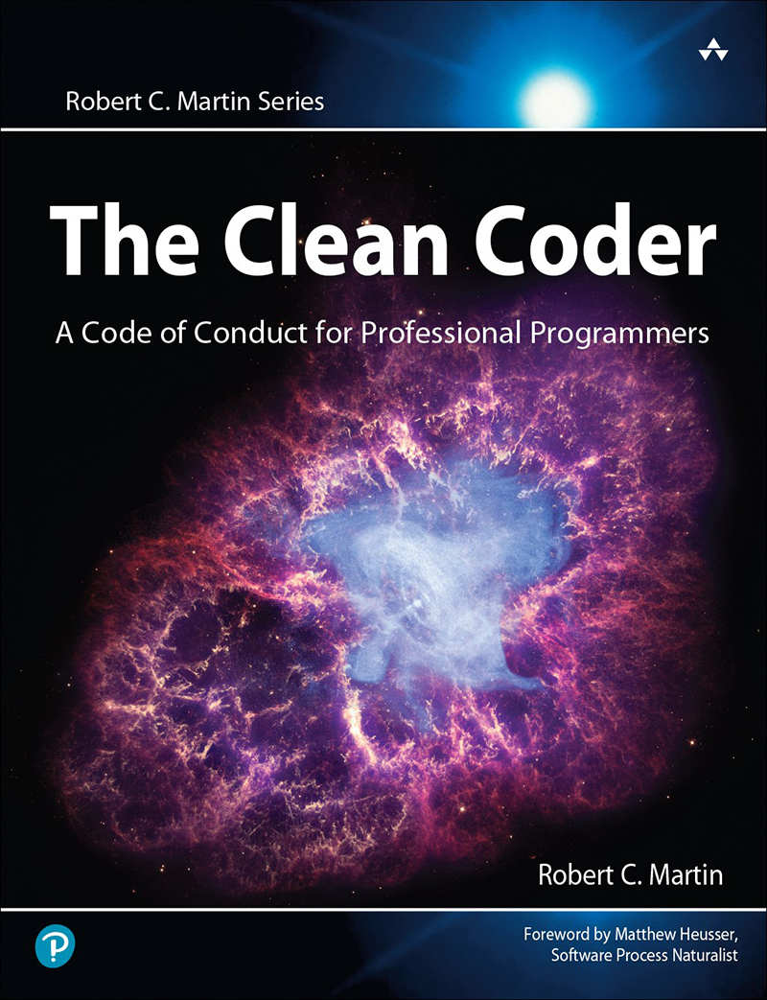
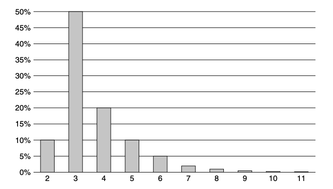

 

<h1 align="center">The Clean Coder. A code of conduct for professional programmers.</h1>

<h3 align="center">Robert C. Martin - 2011</h3> 

# Table of contents // TODO

## Foreword

It was the sort of environment in which some people complain, and others point out that “pressure makes diamonds.”

## Preface

As an engineer, you have a depth of knowledge about your systems and projects that no managers can possibly have. With that knowledge comes the responsibility to _act_.

## Acknowledgments

No one in your life will teach you more than your children will.

## On the Cover

The crab nebula is the remnant of a super-nova... ...At the very center of the target is a bright blue dot. That’s where the _pulsar_ is... ...The pulsar is spinning about 30 times per second; and it flashes as it spins... ...Those pulses of light are the reason we call it a pulsar, which is short for Pulsating Star.

## Pre-Requisite Introduction

Never quit without having a new job, and you always quit calmly, coolly, and alone.

## Chapter 1 Professionalism

### Be Careful what you ask for

Professionalism is... ...responsibility and accountability... ...You can’t take pride and honor in something that you can’t be held accountable for.

When a professional makes a mistake, _he_ cleans up the mess.

Professionalism is all about taking responsibility.

### Taking Responsibility

### First, Do No Harm

Software _is_ too complex to create without bugs... ...The fact that the task to write perfect software is virtually impossible does not mean you aren’t responsible for the imperfection.

The first thing you must practice is apologizing. Apologies are necessary, but insufficient.

As you mature in your profession, your error rate should rapidly decrease towards the asymptote of zero. It won’t ever get to zero, but it is your responsibility to get as close as possible to it.

Releasing code to QA that you don’t know works is unprofessional. It violates the “do no harm” rule.

How can you _know_ your code works? That’s easy. Test it. Test it again. Test it up. Test it down. Test it seven ways to Sunday!

Automate your tests... ...and run those tests as often as you can.

Every single line of code that you write should be tested.

Design your code to be _easy_ to test. And the best way to do that is to write your tests first, before you write the code that passes them.

So, at the very least, your automated tests should tell you that the system is _very likely_ to pass QA.

It is the structure of your code that allows it to be flexible. If you compromise the structure, you compromise the future... ...Software is easy to change. If you violate this assumption by creating inflexible structures, then you undercut the economic model that the entire industry is based on. In short: _You must be able to make changes without exorbitant costs_.

The only way to prove that your software is easy to change is to make easy changes to it. And when you find that the changes aren’t as easy as you thought, you refine the design so that the next change is easier. When do you make these easy changes? _All the time_!... ...This philosophy is sometimes called _merciless refactoring_.

If you have an automated suite of tests that covers virtually 100% of the code... ..._you simply will not be afraid to change the code._

### Work Ethic

Your career is _your_ responsibility... ...Woe to the software developer who entrusts his career to his employer.

You owe your employer a certain amount of time and effort... ...These... ...should be spent on _your employer’s_ problems, not on _your_ problems.

Do the math. In a week there are 168 hours. Give your employer 40, and your career another 20. That leaves 108. Another 56 for sleep leaves 52 for everything else.

Professionals spend _time_ caring for their profession.

Presumably you became a software developer because you are passionate about software and your desire to be a professional is motivated by that passion.

Our field is progressing and at a ferocious pace... ..., however, that progress is in many respects peripheral.

The vast majority of the hard-won ideas of the last 50 years are as valuable today as they were then. Perhaps they are even more valuable now.

> Those who cannot remember the past are condemned to repeat it.
> — Santayana.

_Minimal_ list of the things that every software professional should be conversant with:
- Design patterns. You ought to be able to describe all 24 patterns in the GOF book and have a working knowledge of many of the patterns in the POSA books.
- Design principles. You should know the SOLID principles and have a good understanding of the component principles.
- Methods. You should understand XP, Scrum, Lean, Kanban, Waterfall, Structured Analysis, and Structured Design.
- Disciplines. You should practice TDD, Object-Oriented design, Structured Programming, Continuous Integration, and Pair Programming.
- Artifacts: You should know how to use: UML, DFDs, Structure Charts, Petri Nets, State Transition Diagrams and Tables, flow charts, and decision tables.

Read books, articles, blogs, tweets. Go to conferences. Go to user groups. Participate in reading and study groups. Learn things that are outside your comfort zone.

Professionals practice. True professionals work hard to keep their skills sharp and ready... ...Practice is when you specifically exercise your skills _outside_ of the performance of your job for the sole purpose of refining and enhancing those skills.

The point of the kata is to train your fingers and your brain.

The second best way to learn is to collaborate with other people. Professional software developers make a special effort to program together, practice together, design and plan together. By doing so they learn a lot from each other, and they get more done faster with fewer errors.

The best way to learn is to teach. Nothing will drive facts and values into your head faster and harder than having to communicate them to people you are responsible for. So the benefit of teaching is strongly in favor of the teacher.

Professionals take personal responsibility for mentoring juniors.

It is the responsibility of every software professional to understand the domain of the solutions they are programming.

It is the worst kind of unprofessional behavior to simply code from a spec without understanding why that spec makes sense to the business. Rather, you should know enough about the domain to be able to recognize and challenge specification errors.

Your employer’s problems are _your_ problems. You need to understand what those problems are and work toward the best solutions. 

It’s easy to fall into an _us versus them_ attitude with your employer. Professionals avoid this at all costs.

A professional is confident in his abilities, and takes bold and calculated risks based on that confidence. A professional is not timid.

## Chapter 2 Saying No

> Do; or do not. There is no trying.
> — Yoda

Professionals speak truth to power. Professionals have the courage to say no to their managers.

Slaves are not allowed to say no. Laborers may be hesitant to say no. But professionals are _expected_ to say no.

### Adversarial Roles

The hard decisions are best made through the confrontation of adversarial roles.

Your manager is counting on you to defend your objectives as aggressively as he defends his. That’s how the two of you are going to get to _the best possible outcome_.

The _why_ is a lot less important than the _fact_.

### High Stakes

The higher the stakes, the more valuable no becomes.

### Being a "Team Player"

Being a team player means playing your position as well as you possibly can, and helping out your teammates when they get into a jam. A team-player communicates frequently, keeps an eye out for his or her teammates, and executes his or her own responsibilities as well as possible.

The promise to try is an admission that you’ve been holding back, that you have a reservoir of extra effort that you can apply... ...moreover, it is a commitment to apply that extra effort to achieve the goal.

### The Cost of Saying Yes

Sometimes the only way to get to the right yes is to be unafraid so say no.

### Code Imposible

“Is good code impossible? Is professionalism impossible?” Answer: I say no.

## Chapter 3 Saying Yes

### A Language of commitment

Say. Mean. Do.
There are three parts to making a commitment.
1. You _say_ you’ll do it. 
2. You _mean_ it.
3. You _actually do_ it.

There are very few people who, when they say something, they mean it and then actually get it done. There are some who will say things and _mean_ them, but they never get it done. And there are far more people who promise things and don’t even _mean_ to do them. 

Examples of words and phrases to look for that are telltale signs of noncommitment:
- **Need\should**. “We need to get this done.” “I need to lose weight.” “Someone should make that happen.”
- **Hope\wish**. “I hope to get this done by tomorrow.” “I hope we can meet again some day.” “I wish I had time for that.” “I wish this computer was faster.”
- **Let’s**. (not followed by “I ...”) “Let’s meet sometime.” “Let’s finish this thing.”

Start recognizing lack of commitment around you, and in you.

The real truth is that _you, personally_, ALWAYS have something that’s under _your_ control, so there is always _something_ you can fully commit to doing.

If the end goal depends on someone else, you should commit to specific actions that bring you closer to the end goal.

Something unexpected might happen, and that’s life. But you still want to live up to expectations. In that case, it’s time to change the expectations, _as soon as possible_.

If you can’t make your commitment, the most important thing is to raise a red flag as soon as possible to whoever you committed to.

Creating a language of commitment may sound a bit scary, but it can help solve many of the communication problems programmers face today—estimations, deadlines, and face-to-face communication mishaps. You’ll be taken as a serious developer who lives up to their word, and that’s one of the best things you can hope for in our industry.

### Learning How to Say "Yes"

Breaking disciplines only slows us down.

Professionals know their limits. They know how much overtime they can effectively apply, and they know what the cost will be.

Professionals are not required to say yes to everything that is asked of them. However, they should work hard to find creative ways to make “yes” possible. When professionals say yes, they use the language of commitment so that there is no doubt about what they’ve promised.

## Chapter 4 Coding

Typing blind is all about _confidence_.

Being able to sense your errors is really important... ...in everything. Having error-sense means that you very rapidly close the feedback loop and learn from your errors all the more quickly.

The key to mastery is confidence and error-sense.

### Preparedness

Coding is an intellectually challenging and exhausting activity. It requires a level of concentration and focus that few other disciplines require. The reason for this is that coding requires you to juggle many competing factors at once.

1. First, your code must work.
2. Your code must solve the problem set for you by the customer.
3. Your code must fit well into the existing system... ...your code needs to follow solid engineering principles.
4. Your code must be readable by other programmers... ...this may be the most difficult thing a programmer can master.

Working while distracted creates waste. If you are tired or distracted, _do not code_. You’ll only wind up redoing what you did. Instead, find a way to eliminate the distractions and settle your mind.

Don’t write code when you are tired. Dedication and professionalism are more about discipline than hours. Make sure that your sleep, health, and lifestyle are tuned so that you can put in eight _good_ hours per day.

Professional developers allocate their personal time in order to ensure that the time spent at the office is as productive as possible.

### The Flow Zone

“The Zone”... ...is the highly focused, tunnel-vision state of consciousness that programmers can get into while they write code. In this state they feel _productive_. In this state they feel _infallible_. And so they desire to attain that state... ...a little hint from someone whose been there and back: _Avoid the Zone_... ...It’s really just a mild meditative state in which certain rational faculties are diminished in favor of a sense of speed.

Pairing can be very helpful as a way to deal with interruptions. Your pair partner can hold the context of the problem at hand.. ...When you return to your pair partner, he quickly helps you reconstruct the mental context you had before the interruption... ...TDD is another big help. If you have a failing test, that test holds the context of where you are.

_There will be interruptions_ that distract you and cause you to lose time... ...remember that next time you may be the one who needs to interrupt someone else. So the professional attitude is a polite willingness to be helpful.

### Writer's Block

Sometimes the code just doesn’t come... ...You sit at your workstation and nothing happens... ...many of the factors are...not getting enough sleep...worry, fear, and depression... ...The solution: Find a pair partner.

Creative output depends on creative input... ...creativity breeds creativity.

### Debugging

Debugging time is just as expensive to the business as coding time is, and therefore anything we can do to avoid or diminish it is good.

It is incumbent upon you as a professional to reduce your debugging time as close to zero as you can get. Clearly zero is an asymptotic goal, but it is the goal nonetheless.

### Pacing Yourself

Software development is a marathon, not a sprint... ...A marathon runner takes care of her body both before and _during_ the race. Professional programmers conserve their energy and creativity with the same care.

When you are stuck, when you are tired, disengage for a while.

There is something about _disengagement_ that allows your mind to hunt for solutions in a different and more creative way.

When you are working on a problem, you sometimes get so close to it that you can’t see all the options.

Sometimes the best way to solve a problem is to go home, eat dinner, watch TV, go to bed, and then wake up the next morning and take a shower.

### Being Late

You _will_ be late... ...Sometimes we just blow our estimates and wind up late.

The trick to managing lateness is early detection and transparency... ..._regularly_ measure your progress against your goal... ...Be as honest as you can about all dates. _Do not incorporate hope into your estimates!_

Hope is the project killer. Hope destroys schedules and ruins reputations. Hope will get you into deep trouble.

The only way to improve the schedule is to reduce scope. _Do not be tempted to rush_.

Woe to the poor developer who buckles under pressure and agrees to try to make the deadline... ...This is a recipe for disaster because it gives you, your team, and your stakeholders false hope.

There is no way to rush. You can’t make yourself code faster. You can’t make yourself solve problems faster.

You should _not agree_ to work overtime unless (1) you can personally afford it, (2) it is short term, two weeks or less, and (3) _your boss has a fall-back plan_ in case the overtime effort fails.

Of all the unprofessional behaviors... ...perhaps the worst of all is saying you are done when you know you aren’t... ...This is a contagious practice. If one programmer does it, others will see and follow suit... ...When a team falls into this trap... ...It’s like blind men having a picnic on the railroad tracks.

You avoid the problem of false delivery by creating an independent definition of “done.” The best way to do this is to have... ...automated acceptance tests.

### Help

Programming is hard. The younger you are the less you believe this... ...you have to carefully partition the system into small understandable units that have as little to do with each other as possible—and that’s hard.

No matter how skilled you are, you will certainly benefit from another programmer’s thoughts and ideas.

It is the responsibility of programmers to be available to help each other.

As a professional you are honor bound to offer that help whenever it is needed.

If you see someone who appears to be in trouble, you should offer your help.

When you help someone, sit down and write code together... ...You will likely come away having learned more than you gave.

When someone offers to help you, be gracious about it. Accept the help gratefully and give yourself to that help. 

Just as you are honor bound to offer help, you are honor bound to accept help.

It is unprofessional to remain stuck when help is easily accessible.

Collaboration is critical to effective programming. 

The training of less experienced programmers is the responsibility of those who have more experience... ...Nothing can bring a young software developer to high performance quicker than his own drive, and effective mentoring by his seniors.

## Chapter 5 Test Driven Development

### The Jury Is In

### The Three Laws of TDD

The Three laws of TDD:
1. You are not allowed to write any production code until you have first written a failing unit test.
2. You are not allowed to write more of a unit test than is sufficient to fail—and not compiling is failing.
3. You are not allowed to write more production code that is sufficient to pass the currently failing unit test.

#### Certainty 

If you adopt TDD as a professional discipline, then you will write dozens of tests every day... ...And you will keep all those tests on hand and run them any time you make any changes to the code.

How certain is “nearly certain”? Certain enough to ship!

#### Defect Injection Rate

#### Courage 

When you have a suite of tests that you trust, then you lose all fear of making changes... ...The code becomes clay that you can safely sculpt into simple and pleasing structures.

When programmers lose the fear of cleaning, they clean! And clean code is easier to understand, easier to change, and easier to extend.

#### Documentation 

If you want to know how to use code you need to read code.

The unit tests are documents. They describe the lowest-level design of the system... ...They are the best kind of low-level documentation that can exist.

#### Design

The need to test first forces you to think about _good design_.

The tests you write after the fact are _defense_. The tests you write first are _offense_.

#### The Professional Option

TDD is the professional option. It is a discipline that enhances certainty, courage, defect reduction, documentation, and design... ...it could be considered _unprofessional_ not to use it.

### What TDD Is Not

No professional developer should ever follow a discipline when that discipline does more harm than good.

## Chapter 6 Practicing

All professionals practice their art by engaging in skill-sharpening exercises... ...When performance matters, professionals practice.

### Some Background on Practicing

Practicing is not a new concept in software development, but we didn’t recognize it as practicing until just after the turn of the millennium... ...We were too busy writing code to think about practicing our skills.

Code in 2010 would be recognizable to a programmer from the 1960s. The clay that we manipulate has not changed much in those four decades... ...But the way we work has changed dramatically... ...Programmers today don’t wait for compiles.

Doing anything quickly requires practice... ...Making decisions quickly means being able to recognize a vast number of situations and problems and simply _know_ what to do to address them.

### The Coding Dojo

[Coding dojo reference site](https://codingdojo.org/)

#### Kata

In martial arts, a _kata_ is a precise set of choreographed movements that simulates one side of a combat. The goal... ...is perfection.

The purpose of learning a kata is not to perform it on stage. The purpose is to train your mind and body how to react in a particular combat situation. The goal is to make the perfected movements automatic and instinctive so that they are there when you need them.

A programming kata... ...simulates the solving of some programming problem. You aren’t actually solving the problem because you already know the solution. Rather, you are practicing the movements and decisions involved in solving the problem.

Like any martial artist, a programmer should know several different kata and practice them regularly so that they don’t fade away from memory... ...Some of my favorites are:
- The Bowling Game: http://butunclebob.com/ArticleS.UncleBob.TheBowling-GameKata
- Prime Factors: http://butunclebob.com/ArticleS.UncleBob.ThePrimeFactors-Kata
- Word Wrap: http://thecleancoder.blogspot.com/2010/10/craftsman-62-dark-path.html

#### Wasa

Wasa is very much like a two-man kata... ...One partner plays the role of the aggressor, and the other partner is the defender. The motions are repeated over and over again as the practitioners swap roles.

Programmers can practice in a similar fashion using a game known as _[ping-pong](http://wiki.c2.com/?PairProgrammingPingPongPattern)_... ...One programmer writes a unit test, and then the other must make it pass. Then they reverse roles.

#### Randori

_Randori_ is free-form combat... ...set up a variety of combat scenarios and then enact them.

There is a game that is played at many coding dojos called randori... ...these exercises can be a _lot_ of fun... ...You can gain an immense insight into the way other people solve problems. These insights can only serve to broaden your own approach and improve your skill.

### Broadening Your Experience

Professional programmers often suffer from a lack of diversity in the kinds of problems that they solve... ...Without a broadening influence, this can lead to a very unhealthy narrowing of your resume and your mindset.

One way to stay ahead of the curve is... ...by contributing to an open-source project... ...there is probably no better way to increase your repertoire of skills than to actually work on something that someone else cares about.

Professional programmers practice on their own time... ...Since your practice time is your own time, you don’t have to use the same languages or platforms that you use with your employer.

### Conclusion

_All_ professionals practice... ...because they care about doing the best job they possibly can.

## Chapter 7 Acceptance Testing

The role of the professional developer is a communications role as well as a development role. Remember that garbage-in/garbage-out applies to programmers too, so professional programmers are careful to make sure that their communication with other members of the team, and the business, are accurate and healthy.

### Communicating Requirements

One of the most common communication issues between programmers and business is the requirements.

The trap of **Premature Precision.** Business people want to know exactly what they are going to get before they authorize a project. Developers want to know exactly what they are supposed to deliver before they estimate the project. Both sides want a precision that simply cannot be achieved.

Things appear different on paper than they do in a working system... ...the more precise you make your requirements, the less relevant they become as the system is implemented.

Even with perfect information your estimates will have a huge variance... ...The uncertainty principle makes hash out of early precision. The requirements _will_ change making that precision moot.

The solution to premature precision is to defer precision as long as possible... ...However, that can lead to another malady: late ambiguity.

> An ambiguity in a requirements document represents an argument amongst the stakeholders.
> — Tom DeMarco

It is the responsibility of professional developers (and stakeholders) to make sure that all ambiguity is removed from the requirements.

### Acceptante tests

Acceptance tests as tests written by a collaboration of the stakeholders and the programmers _in order to define when a requirement is done_.

Professional developers have a single definition of done: Done means _done._ Done means all code written, all tests pass, QA and the stakeholders have accepted. Done.

Create a set of automated tests that, when they pass, meet all of the above criteria! When the acceptance tests for your feature pass, you are _done._

The purpose of acceptance tests is communication, clarity, and precision. By agreeing to them, the developers, stakeholders, and testers all understand what the plan for the system behavior is.

Professional developers make it their responsibility to work with stakeholders and testers to ensure that all parties know what is about to be built.

Acceptance tests should _always_ be automated... ..._these_ kinds of tests should never be manual. The reason is simple: cost.

Professional developers take responsibility for their part in ensuring that acceptance tests are automated.

Writing these tests is simply the work of specifying the system. Specifying at this level of detail is the only way we, as programmers, can know what “done” means.

Following the principle of “late precision,” acceptance tests should be written as late as possible, typically a few days before the feature is implemented. In Agile projects, the tests are written _after_ the features have been selected for the next Iteration or Sprint.

Implementation work on a feature begins when the acceptance tests for that feature are ready. The developers execute the acceptance tests for the new feature and see how they fail. Then they work to connect the acceptance test to the system, and then start making the test pass by implementing the desired feature.

Test authors are human and make mistakes. Sometimes the tests as written don’t make a lot of sense once you start implementing them... ...As a professional developer, it is your job to negotiate with the test author for a better test. What you should _never_ do is take the passive-aggressive option and say to yourself, “Well, that’s what the test says, so that’s what I’m going to do.”

Acceptance tests are not _unit_ tests. Unit tests are written _by_ programmers _for_ programmers. They are formal design documents that describe the lowest level structure and behavior of the code. The audience is programmers, not business. Acceptance tests are written _by_ the business _for_ the business (even when you, the developer, end up writing them). They are formal requirements documents that specify how the system should behave from the business’ point of view. The audience is the business _and_ the programmers.

Unit tests and acceptance tests are documents first, and tests second. Their primary purpose is to formally document the design, structure, and behavior of the system. The fact that they automatically verify the design, structure, and behavior that they specify is wildly useful, but the specification is their true purpose.

It is hard to specify GUIs up front... ...People want to _fiddle_ with GUIs... ...GUIs are constantly in flux.

The Single Responsibility Principle (SRP)... ...states that you should separate those things that change for different reasons, and group together those things that change for the same reasons. GUIs are no exception.

When writing acceptance tests for a GUI you take advantage of the underlying abstractions that don’t change very frequently.

It is much better to write a test that selects the button whose ID is `ok_button` than it is to select the button in column 3 of row 4 of the control grid.

Design experts have been telling us for decades to separate our GUIs from our business rules... ...When every GUI change breaks a thousand tests, you are either going to start throwing the tests away or you are going to stop changing the GUI. Neither of those are good options. So write your business rule tests to go through an API just below the GUI.

Some acceptance tests specify the behavior of the GUI itself. These tests _must_ go through the GUI... ...Therefore, it is a good idea to decouple the GUI and the business rules and replace the business rules with stubs while testing the GUI itself.

Keep the GUI tests to a minimum. They are fragile, because the GUI is volatile. The more GUI tests you have the less likely you are to keep them.

Make sure that all your unit tests and acceptance tests are run several times per day in a _continuous integration_ system. This system should be triggered by your source code control system. Every time someone commits a module, the CI system should kick off a build, and then run all the tests in the system.

keep the CI tests running at all times... ...If they fail, then the whole team should stop what they are doing and focus on getting the broken tests to pass again. A broken build in the CI system should be viewed as an emergency.

### Conclusion

Communication about details is hard... ...It is too easy for each party to wave their hands and _assume_ that the other party understands. All too often both parties agree that they understand and leave with completely different ideas.

To effectively eliminate communication errors between programmers and stakeholders... ...write automated acceptance tests. They are the perfect requirements document.

## Chapter 8 Testing Strategies

Professional developers test their code.

What every professional development team needs is a good _testing strategy._

### QA should find nothing

It should be the goal of the development group that QA find nothing wrong.

Every time QA finds something the development team should react in horror. They should ask themselves how it happened and take steps to prevent it in the future.

QA and Development should be working together to ensure the quality of the system.

It should be QA’s role to work with business to create the automated acceptance tests that become the true specification and requirements document for the system.

In general, the business writes the happy-path tests, while QA writes the corner, boundary, and unhappy-path tests.

The other role for QA is to use the discipline of [exploratory testing1](https://www.satisfice.com/exploratory-testing) to characterize the true behavior of the running system and report that behavior back to development and business. In this role QA is _not_ interpreting the requirements. Rather, they are identifying the actual behaviors of the system.

The Test Automation Pyramid, a graphical depiction of the kinds of tests that a professional development organization needs.

#### Unit Tests

Unit Tests... ...are written by programmers, for programmers, in the programming language of the system... ...to specify the system at the lowest level. Developers write these tests before writing production code as a way to specify what they are about to write.

Unit tests provide as close to 100% coverage as is practical. Generally this number should be somewhere in the 90s. And it should be _true_ coverage.

#### Component Tests

The components of the system encapsulate the business rules, so the tests for those components are the acceptance tests for those business rules.

Component tests are written by QA and Business with assistance from develop- ment... ...The intent is that the business should be able to read and interpret these tests, if not author them.

Component tests cover roughly half the system. They are directed more towards happy-path situations... ...The vast majority of unhappy-path cases are covered by unit tests and are meaningless at the level of component tests.

#### Integration Tests

Integration Tests... ...only... ...for larger systems that have many components... ...these tests assemble groups of components and test how well they communicate with each other. The other components of the system are decoupled as usual with appropriate mocks and test-doubles.

Integration tests are _choreography tests._ They do not test business rules. Rather, they test how well the assembly of components dances together.

Integration tests are typically written by the system architects, or lead designers, of the system. The tests ensure that the architectural structure of the system is sound. It is at this level that we might see performance and throughput tests.

Integration tests... ...are typically _not_ executed as part of the Continuous Integration suite,... ...Instead... ...are run periodically (nightly, weekly, etc.)

#### System Tests

System Tests are automated tests that execute against the entire integrated system... ...They do not test business rules directly. Rather, they test that the system has been wired together correctly and its parts interoperate according to plan. We would expect to see throughput and performance tests in this suite.

System tests cover perhaps 10% of the system. This is because their intent is not to ensure correct system behavior, but correct _system construction._

#### Manual Exploratory Tests

Manual Exploratory Tests are not automated, _nor are they scripted._ The intent of these tests is to explore the system for unexpected behaviors while confirming expected behaviors.

#### Conlusion

To make good on the goal that “QA should find nothing,” development teams need to work hand in hand with QA to create a hierarchy of unit, component, integration, system, and exploratory tests.

Tests should be run as frequently as possible to provide maximum feedback and to ensure that the system remains continuously clean.

## Chapter 9 Time Management

Eight hours is a remarkably short period of time. It’s just 480 minutes or 28,800 seconds. As a professional, you expect that you will use those few precious seconds as efficiently and effectively as possible.

### Meetings

There are two truths about meeting. 
1. Meetings are necessary.
2. Meetings are huge time wasters.

Professionals are aware of the high cost of meetings. They are also aware that their own time is precious... ...Therefore, they actively resist attending meetings that don’t have an immediate and significant benefit.

It is unprofessional to go to too many meetings. You need to use your time wisely. So be very careful about which meetings you attend and which you politely refuse.

The person inviting you to a meeting is not responsible for managing your time. Only _you_ can do that... ...don’t accept unless it is a meeting for which your participation is... ...necessary to the job you are doing now.

Sometimes the meeting will be about something that interests you, but is not immediately necessary. You will have to choose whether you can afford the time.

Sometimes the meeting will be about something that you can contribute to but is not immediately significant to what you are currently doing. You will have to choose whether the loss to your project is worth the benefit to theirs... ...your responsibility is to your projects first. Still, it is often good for one team to help another.

Sometimes your presence at the meeting will be requested by someone in authority... ...choose whether that authority outweighs your work schedule... ...your team and your supervisor can be of help in making that decision.

One of the most important duties of your manager is to keep you _out_ of meetings.

A good manager... ...is just as concerned about your time as you are.

When the meeting gets boring, leave.

If you find yourself stuck in a meeting that is not a good use of your time, you need to find a way to politely exit that meeting.

Remaining in a meeting that has become a waste of time for you, and to which you can no longer significantly contribute, is unprofessional.

To use the participants’ time wisely, the meeting should have a clear agenda, with times for each topic and a stated goal.

If you are asked to go to a meeting, make sure you know what discussions are on the table, how much time is allotted for them, and what goal is to be achieved. If you can’t get a clear answer on these things, then politely decline to attend.

Stand-Up Meetings are part of the Agile cannon. Their name comes from the fact that the participants are expected to stand while the meeting is in session. Each participant takes a turn to answer three questions:
1. What did I do yesterday?
2. What am I going to do today? 
3. What’s in my way?
Each question should require _no more_ than twenty seconds, so each participant should require no more than one minute.

Iteration Planning Meetings are the most difficult meetings in the Agile canon to do well. Done poorly, they take far too much time. It takes skill to make these meetings go well, a skill that is well worth learning.

Iteration Planning Meetings... ...should take no more than 5% of the total time in the iteration. So for a one week iteration (forty hours) the meeting should be over within two hours.

Iteration Retrospective and Demo are conducted at the end of each iteration. Team members discuss what went right and what went wrong. Stakeholders see a demo of the newly working features. These meetings can be badly abused and can soak up a lot of time, so schedule them 45 minutes before quitting time on the last day of the iteration. Allocate no more than 20 minutes for retrospective and 25 minutes for the demo.

> Any argument that can’t be settled in five minutes can’t be settled by arguing.
> — Kent Beck

Without data, any argument that doesn’t forge agreement within a few minutes... ...simply won’t ever forge agreement. The only thing to do is to go get some data.

Force of will doesn’t settle disagreements for long. Data does.

Sometimes the best alternative is to simply flip a coin to choose one of the two paths in question. If things work out, then that path was workable. If you get into trouble, you can back out and go down the other path. It would be wise to agree on a time as well as a set of criteria to help determine when the chosen path should be abandoned.

If an argument must truly be settled, then ask each of the arguers to present their case to the team in five minutes or less. Then have the team vote. The whole meeting will take less than fifteen minutes.

Programming is an intellectual exercise that requires extended periods of concentration and focus. After you have expended your focus-manna, you have to recharge by doing unfocused activities for an hour or more.

Professional developers learn to manage their time to take advantage of their focus-manna. We write code when our focus-manna is high; and we do other, less productive things when it’s not.

If you spend all your focus-manna in a meeting, you won’t have any left for coding.

Worry and distractions also consume focus-manna.

Professional developers manage their sleep schedule to ensure that they have topped up their focus-manna by the time they get to work in the morning.

Caffeine... ....Too much of it can send your focus off in very strange directions. A really strong caffeine buzz can cause you to waste an entire day hyper-focussing on all the wrong things.

Doing physical disciplines... ...require... ...a different kind of focus from coding. It’s not intellectual, it’s muscle. And somehow muscle focus helps to recharge mental focus.

There is something about activities that focus on muscles that enhances the ability to work with your mind.

Writing software is a _creative_ exercise.

### The Boxing and Tomatoes

To manage... ...time and focus... ...use the well-known [Pomodoro Technique](https://en.wikipedia.org/wiki/Pomodoro_Technique)

The real benefit of the Pomodoro Technique is that 25-minute window of productive time that you aggressively defend against all interruptions.

### Avoidance

_Priority inversion._ You raise the priority of a task so that you can postpone the task that has the true priority. Priority inversions are a lie we tell ourselves. We can’t face what needs to be done, so we convince ourselves that another task is more important. We know it’s not, but we lie to ourselves.

Professionals evaluate the priority of each task, disregarding their personal fears and desires, and execute those tasks in priority order.

### Blind Alleys

Blind alleys are a fact of life for all software craftsmen. Sometimes you will make a decision and wander down a technical pathway that leads to nowhere... ...Prudence and experience will help you avoid certain blind alleys, but you’ll never avoid them all. So the real skill you need is to quickly realize when you are in one, and have the courage to back out.

_The Rule of Holes:_ When you are in one, stop digging.

Professionals avoid getting so vested in an idea that they can’t abandon it and... ...keep an open mind about other ideas so that when they hit a dead end they still have other options.

### Marshes, Bogs, Swamps, and Other Messes

Messes are worse than blind alleys because you can always see the way forward, and it always looks shorter than the way back (but it isn’t).

Nothing has a more profound or long-lasting negative effect on the productivity of a software team than a mess. Nothing.

The problem is that starting a mess, like going down a blind alley, is unavoidable. Experience and prudence can help you to avoid them, but eventually you will make a decision that leads to a mess... ...At some point you realize that you made a wrong design choice when you started, and that your code doesn’t scale well in the direction that the requirements are moving. This is the inflection point! You can still go back and fix the design... ...looks expensive... ...but... ...will _never_ be easier than it is now.

Professionals... ...are always on the lookout for messes that start to grow without bound.

Moving forward through a swamp, when you know it’s a swamp, is the worst kind of priority inversion... ...you are lying to yourself, lying to your team, lying to your company, and lying to your customers.

### Conclusion

Software professionals are diligent in the management of their time and their focus. They understand the temptations of priority inversion and fight it as a matter of honor. They keep their options open by keeping an open mind about alternate solutions. They never become so vested in a solution that they can’t abandon it. And they are always on the lookout for growing messes, and they clean them as soon as they are recognized. 

## Chapter 10 Estimation

Estimation... ...is the primary wedge... ...between business people and developers. It is the source of nearly all the distrust that rules that relationship.

### What is an Estimate?

Business likes to view estimates as commitments. Developers like to view estimates as guesses. The difference is profound.

A commitment is something you must achieve. If you commit to getting something done by a certain date, then you simply _have_ to get it done by that date.

Professionals don’t make commitments unless they _know_ they can achieve them.

If you are asked to commit to something that you aren’t certain you can do, then you are honor bound to decline. If you are asked to commit to a date that you know you can achieve,... ...then the choice is yours; but you’d better be willing to do what it takes.

Commitment is about _certainty._ Other people are going to accept your commitments and make plans based upon them... ...Missing a commitment is an act of dishonesty only slightly less onerous than an overt lie.

An estimate is a guess. No commitment is implied.... ...Missing an estimate is not in any way dishonorable.

An estimate is not a number. An estimate is a... ..._probability distribution._... ...the likelihood of completion.

> If anything can go wrong, it will go wrong.
> — Murphy’s Law

