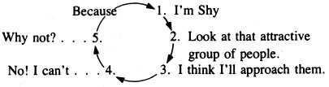

 

<h1 align="center">Your Erroneous Zones</h1>

<h3 align="center">Wayne Dyer - 1976</h3> 

## Table of Contents

TODO: Add Table of contents

> The whole theory of the universe is directed unerringly to one single individual—namely to You.
> —WALT WHITMAN

## Introduction — A Personal Statement

A speaker stood before a group of alcoholics determined to demonstrate to them, once and for all, that alcohol was an evil beyond compare. On the platform he had what appeared to be two identical containers of clear fluid. He announced that one contained pure water and the other was filled with undiluted alcohol. He placed a small worm in the container while everyone watched as it swam around and headed for the side of the glass, whereupon it simply crawled to the top of the glass. He then took the same worm and placed it in the container with alcohol. The worm disintegrated right before their eyes. “There,” said the speaker. “What’s the moral?” A voice from the rear of the room said quite clearly, “I see that if you drink alcohol, you’ll never have worms.”

This book has a lot of “worms”... ...you will hear and perceive exactly what you want to hear based upon many of your own values.

Looking at yourself in depth with an eye toward changing might be something that you say you are interested in accomplishing, but your behavior often speaks otherwise.

Change is tough.

Mental health should be treated in a flip manner, neither... ...it must be a humorless enterprise... ...I have tried to avoid intricate explanations, because I do not believe that “being happy” is a complex affair.

Being healthy is a natural state, and the means for achieving it are within the grasp of each one of us.

Hard work, clear thinking, humor and self-confidence are the ingredients of effective living.

You don’t need a professional background in counseling and a doctorate in the helping professions to understand the principles of effective living... ...You learn them by being committed to your own happiness and by doing something about it... ...every day.

Each chapter of this book is written like a counseling session... ...A particular erroneous zone, or kind of self-destructive behavior, is explored, and the historical antecedents for the behavior in our culture (and therefore in you) are examined.

Helping you understand _why_ you are trapped in this self-defeating zone.

Behaviors that fall into this erroneous zone are detailed... ...that may seem perfectly acceptable, but are, in reality, harmful to your own happiness.

After a look at the behaviors... ...examination of the _reasons_ for hanging onto behavior which does not make you happy... ...look at the psychological support system that you have erected to maintain self- defeating behavior, rather than giving it up.

Answer the questions, “What do I get out of my behavior?” and “Why does it persist if it is injurious to me?”

The reasons for keeping neurotic behavior are fairly consistent across all of the erroneous zones.

It is safer to hang onto a learned response, even if it is self-destructive. Moreover, you can eliminate having to change and take responsibility if you keep the erroneous zones intact.

Your psychological maintenance system functions to keep blame off you and the opportunity for change at bay.

The fact that you maintain many self-defeating behaviors for the same reason only makes total growth more approachable. Eliminate these reasons and you’ll eradicate your erroneous zones.

Each chapter concludes with some straightforward strategies for eliminating self-nullifying behavior.

Counseling session is all about... ...exploration of the... ...self-defeating behavior,... ...the “Why” of the behavior and concrete strategies for eliminating the troublesome area.

Effective thinking—thinking which can alter self-destructive behavior— does not occur just because something is said. An insight must be repeated, and repeated, and repeated again. Only then, when it is fully accepted and understood, do you begin to alter behavior.

Two central themes... ...The first involves your ability to make choices about your own emotions.

Begin to examine your life in the light of choices you have made or failed to make. This puts all responsibility for what you are and how you feel on you.

Becoming happier and more effective will mean becoming more aware of the choices that are available to you.

YOU ARE THE SUM TOTAL OF YOUR CHOICES.

With an appropriate amount of motivation and effort you can be anything you choose.

The second theme... ...taking charge of your present moments.

There is only one moment in which you can experience anything, and that is now, yet a great deal of time is thrown away by dwelling on past or future experiences.

Turning your now into total fulfillment is the touchstone of effective living, and virtually all self-defeating behaviors (erroneous zones) are efforts at living in a moment other than the current one.

Choice and present-moment living will be stressed on almost every page of this book.

You’ll soon begin to ask yourself... ...“Why am I choosing to feel upset right now?” and “How can I make more effective use of my present moments?”... ...moving away from erroneous zones toward self- reliance and happiness.

Twenty-five questions designed to measure your capacity to choose happiness and fulfillment... ...assess yourself and how you live your present moments. “Yes” responses indicate personal mastery and effective choice-making.

1. Doyoubelievethatyourmindisyourown?(ChapterI)
2. Areyoucapableofcontrollingyourownfeelings?(ChapterI)
3. Are you motivated from within rather than from without? (Chapter VII)
4. Areyoufreefromtheneedforapproval?(ChapterIII)
5. Doyousetupyourownrulesofconductforyourself?(ChapterVII)
6. Areyoufreefromthedesireforjusticeandfairness?(ChapterVIII)
7. Canyouacceptyourselfandavoidcomplaining?(ChapterII)
8. Areyoufreefromheroworship?(ChapterVIII)
9. Areyouadoerratherthanacritic?(ChapterIX)
10. Doyouwelcomethemysteriousandtheunknown?(ChapterVI)
11. Canyouavoiddescribingyourselfinabsoluteterms?(ChapterIV)
12. Canyouloveyourselfatalltimes?(ChapterII)
13. Canyougrowyourownroots?(ChapterX)
14. Haveyoueliminatedalldependencyrelationships?(ChapterX)
15. Have you eliminated all blame and fault-finding in your life? (Chapter VII)
16. Areyoufreefromeverfeelingguilty?(ChapterV)
17. Areyouabletoavoidworryingaboutthefuture?(ChapterV)
18. Canyougiveandreceivelove?(ChapterII)
19. Canyouavoidimmobilizingangerinyourlife?(ChapterXI)
20. Haveyoueliminatedprocrastinationasalife-style?(ChapterIX)
21. Haveyoulearnedtofaileffectively?(ChapterVI)
22. Canyouenjoyspontaneouslywithouthavingaplan?(ChapterVI)
23. Canyouappreciateandcreatehumor?(ChapterXI)
24. Areyoutreatedbyothersthewayyouwanttobe?(ChapterX)
25. Are you motivated by your potential for growth, rather than a need to repair your deficiencies? (Chapter I)

At any given moment of your life, you can choose to say yes to all of the questions above if you are willing to repeal many “shoulds” and “oughts” that you have learned throughout your life.

The real choice is whether you decide to be personally free or remain chained to the expectations that others have of you.

> I want to travel as far as I can go, I want to reach the joy that’s in my soul, And change the limitations that I know, And feel my mind and spirit grow; I want to live, exist, “to be,” And hear the truths inside of me.
> —Doris Warshay. New Directions poem

This book will help you to eliminate any “worms”... ...that may be keeping you from beautiful new experiences and to discover and choose your own new directions.

## 1 Taking Charge of Yourself

The essence of greatness is the ability to choose personal fulfillment in circumstances where others choose madness.

A constant companion... ...call him _Your-Own-Death._ You can fear this visitor or use him for your personal gain. The choice is up to you.

“Should I avoid doing the things I really want to do?” “Should I live my life as others want me to?” “Are things important to accumulate?” “Is putting it off the way to live?”... ...answers can be summed up in a few words: Live...Be You...Enjoy...Love.

The next time you are contemplating a decision in which you are debating whether or not to... ...make your own choice, ask yourself an important question, “How long am I going to be dead?”... ...make your own choice and leave the worrying... ...to those who are going to be alive forever.

If you don’t begin taking these steps, you can anticipate living your entire life the way others say you must.

It’s your life; do with it what _you_ want.

### Happiness and Your Own I.Q.

Taking charge of yourself involves putting to rest some very prevalent myths.

Intelligence is measured by your ability to solve complex problems... ...This vision of intelligence... ...encourages a kind of intellectual snobbery that has brought with it some demoralizing results.

A truer barometer of intelligence is an effective, happy life lived each day and each present moment of every day.

If you are happy, if you live each moment for everything it’s worth, then you are an intelligent person.

Problem solving is a useful adjunct to your happiness, but if you know that given your inability to resolve a particular concern you can still choose happiness for yourself, or at a minimum refuse to choose unhappiness, then you are intelligent.

You are intelligent because you have the ultimate weapon against the big N.B.D. Yep—_N_ervous _B_reak _D_own.

“Intelligent” people do not have N.B.D.’s because they are in charge of themselves. They know how to choose happiness over depression, because they know how to deal with the _problems_ of their lives.

I didn’t say _solve_ the problems. Rather than measuring their intelligence on their ability to _solve_ the problem, they measure it on their capacity for maintaining themselves as happy and worthy, whether the problem gets solved or not.

You can begin to think of yourself as truly intelligent on the basis of how you choose to feel in the face of trying circumstances.

The life struggles are pretty much the same for each of us... ...Disagreements, conflicts and compromises are a part of what it means to be human.

Some people are able to... ...avoid immobilizing dejection and unhappiness... ...while others collapse.

Those who recognize problems as a human condition and don’t measure happiness by an absence of problems are the most intelligent kind of humans we know; also, the most rare.

Learning to take total charge of yourself will involve a whole new thinking process... ...difficult because too many forces in our society conspire against individual responsibility.

You must trust in your own ability to feel emotionally whatever you choose to feel at any time in your life.

You’ve grown up believing that you can’t control your own emotions; that anger, fear and hate, as well as love, ecstasy and joy are things that happen to you. An individual doesn’t control these things, he accepts them... ...and hope that some happy events will come along so that you can feel good very soon.

### Choosing How You’ll Feel

Feelings are not just emotions that happen to you. Feelings are reactions you choose to have.

If you are in charge of your own emotions, you don’t have to choose self-defeating reactions.

You can feel what you choose to feel.

The road to “intelligence”... ...will be new because you’ll see a given emotion as a choice rather than as a condition of life. This is the very heart and soul of personal freedom.

Attack the myth of not being in charge of your emotions through logic.

Syllogism (a formulation in logic, in which you have a major premise, a minor premise and a conclusion based upon the agreement between the two premises).

Logic—Syllogism
MAJOR PREMISE: Aristotle is a Man. MINOR PREMISE: All men have facial hair. CONCLUSION: ARISTOTLE HAS FACIAL HAIR.

Illogic—Syllogism 
MAJOR PREMISE: Aristotle has facial hair. MINOR PREMISE: All men have facial hair. CONCLUSION: ARISTOTLE IS A MAN.

In the second illustration, Aristotle could be an ape or a mole.

logical exercise that can forever put to rest the notion that you cannot take charge of your own emotional world. MAJOR PREMISE: I can control my thoughts. MINOR PREMISE: My feelings come from my thoughts. CONCLUSION: I can control my feelings.

I can say to you, “Think of a pink antelope,” and you can turn it green, or make it an aardvark, or simply think of something else if you so choose.

You alone control what enters your head as a thought.

No one else can get inside your head and have your own thoughts as you experience them. You do indeed control your thoughts, and your brain is your own to use as you so determine.

You cannot have a feeling (emotion) without first having experienced a thought. Take away your brain and your ability to “feel” is wiped out.

A feeling is a physical reaction to a thought.

Every feeling that you have was preceded by a thought, and without a brain you can have no feelings.

If you control your thoughts, and your feelings come from your thoughts, then you are capable of controlling your own feelings. And you control your feelings by working on the thoughts that preceded them.

You make yourself unhappy because of the thoughts that you have about the people or things in your life.

Becoming a free and healthy person involves learning to _think_ differently.

Once you can change your thoughts, your new feelings will begin to emerge, and you will have taken the first step on the road to your personal freedom.

Cal, a young executive who spends most of his time agonizing over the fact that his boss thinks he is stupid... ...Cal makes himself unhappy by convincing himself that what someone else thinks is more important than what he thinks.

Someone’s death does not make you unhappy; you cannot be unhappy until you learn of the death, so it’s not the death but what you tell yourself about the event.

Ask yourself, “Why should I choose depression? Will it help me to be more effective in dealing with it?”

You have grown up in a culture which has taught you that you are not responsible for your feelings even though the syllogistic truth is that you always were. You’ve learned a host of sayings to defend yourself against the fact that you do control your feelings.

- "You hurt my feelings."
- "You make me feel bad."
- "I can’t help the way I feel."
- "I just feel angry, don’t ask me to explain it." 
- "He makes me sick."
- "Heights scare me."
- "You’re embarrassing me."
- "She really turns me on."
- "You made a fool of me in public."

Rewrite the list so it is accurate, so it reflects the fact that you are in charge of how you feel and that your feelings come from the thoughts you have about anything.

- "I hurt my feelings because of the things I told myself about your reaction to me."
- "I made myself feel bad."
- "I can help the way I feel, but I’ve chosen to be upset."
- "I’ve decided to be angry, because I can usually manipulate others with my   anger, since they think I control them." 
- "I make myself sick."
- "I scare myself at high places."
- "I’m embarrassing myself."
- "I turn myself on whenever I’m near her."
- "I made myself feel foolish by taking your opinions of me more seriously than my own, and believing that others would do the same."

Why the statements in List 2 did not evolve into clichés. The answer lies in our culture, which teaches the thinking of List 1, and discourages the logic of List 2.

You feel what you think, and you can learn to think differently about anything—if you decide to do so.

Ask yourself if there is a sufficient payoff in being unhappy, down, or hurt. Then begin to examine, in depth, the kind of thoughts that are leading you to these debilitating feelings.

### Learning Not To Be Unhappy: A Tough Assignment

It is not easy to think in new ways. You are accustomed to a certain set of thoughts and the debilitating thoughts that follow.

Happiness is easy, but learning not to be unhappy can be difficult.

Happiness is a natural condition of being a person. The evidence is plainly visible when you look at young children.

Taking charge of yourself begins with awareness.

Catch yourself when you say things like, “He hurt my feelings.”... ...New thinking requires awareness of the old thinking.

You have become habituated in mental patterns that identify the causes of your feelings as outside of yourself... ...you’ll need to balance the scale with thousands of hours of new... ...thinking that assumes responsibility for your own feelings. It is tough, damn tough; but so what? That certainly is no reason to avoid doing it.

_Awareness,_ and then after thousands of trials, mistakes, new efforts.

You’ve learned the habits you now have by reinforcing them all of your life.

You have accepted your behavior and never worked at challenging it. But you can learn to not be unhappy, angry, hurt, or frustrated just as you learned to be all those self-defeating things.

A thought becomes a belief when you’ve worked on it repeatedly, not when you simply try it once and use your initial inability as the rationale for giving up.

Taking charge of yourself involves more than simply trying on new thoughts for size. It requires a determination to be happy and to challenge and destroy each and every thought that creates a self-immobilizing unhappiness in you.

### Choice—Your Ultimate Freedom

If you still believe that you don’t choose to be unhappy, try to imagine this course of events. Each time you become unhappy you are subjected to some treatment you find unpleasant... ...How long do you think you would continue to hold on to them? Chances are you would take control rather quickly.

The issue is not whether you can take control of your feelings, but whether you will.

What must you endure before you’ll make such a choice? Some people choose to go insane rather than take control. Others merely give up and succumb to a life of misery because the dividend of pity received is greater than the reward of being happy.

The issue here is your own ability to choose happiness or at least not to choose unhappiness.

To discard it is to give up on yourself.

Just as you are free to choose happiness over unhappiness... ...you are free to choose self-fulfilling behavior over self- defeating behavior.

Substitute in slow progressive steps healthy new feelings and habits for old self- defeating emotions.

You can choose to make any experience enjoyable and challenging. Dull parties and committee meetings are fertile territory for choosing new feelings.

When you find yourself bored, you can make your mind work in exciting ways, by changing the subject with a key observation, or writing the first chapter of your novel, or working on new plans which will help you to avoid these settings in the future.

Using your mind actively means assessing the people and events which give you the greatest difficulty and then deciding on new mental efforts to make them work for you.

Think first of why you should not choose to be upset because someone or something is not going the way you would like it to go.

Don’t just get perturbed. Use your brain to work for you, and eventually you’ll have the terrific habit of not being upset when things go wrong.

### Choosing Health Over Illness

You can also choose to eliminate some physical sufferings which are not rooted in a known organic dysfunction.

There is a burgeoning amount of evidence to support the notion that people even choose things like tumors... ...and many other infirmities, including cancer, which have always been considered something that just happens to people.

Helping the patient not to want the disease... ...may be a means of ameliorating the internal killer.

The human brain can store an amount of information equivalent to one hundred trillion words, and all of us use but a tiny fraction of this storage space.

It’s not uncommon for individuals to become mysteriously sick when confronted with some kind of difficult circumstance, or to avoid illness when being sick is simply “impossible” at that time, and so postponed the effects, perhaps the fever, until the big event is over, and then collapse.

Listen to the advertisements we see and hear on television. “I’m a stockbroker.... So you can imagine the tension and headaches I must have. I take this pill to make it go away.” Message: You can’t control how you feel if you work in certain kinds of jobs (teachers, executives, parents) so rely on something else to do it for you. We are bombarded with messages like this every day.

We are helpless prisoners who must have someone or something else do things for us. NONSENSE. Only you can improve your lot or make yourself happy.

It is up to you to take control of your own mind, and then practice feeling and behaving in the ways that you choose.

### Avoiding Immobilization

Keep in mind the word _immobilization_ as the indicator of negative emotions in your life.

You might believe that anger, hostility, shyness and other similar feelings are worth having at times, and so you want to hang onto them.

Immobilization can range from total inaction to mild indecision and hesitancy. Does your anger keep you from saying, feeling, or doing something? If so, then you are immobilized.

_Immobilization:_ A state, however mild or serious, in which you are not functioning at the level that you would like to. If feelings lead to such a state, you need to look no further for a reason to get rid of them.

_You are immobilized when_...
You can’t talk lovingly to your spouse and children though you want to. You can’t work on a project that interests you.
You don’t make love and would like to.
You sit in the house all day and brood.
You don’t play golf, tennis, or other enjoyable activities, because of a leftover gnawing feeling.
You can’t introduce yourself to someone who appeals to you.

All negative emotions result in some degree of self-immobility, and this alone is a solid reason for eliminating them entirely from your life.

If you yell at others not to make a point, but because you are internally upset, then you’ve immobilized yourself, and it’s time to begin working at new choices that will help you to reach your goal... ...without experiencing feelings that are hurtful to you.

### The Importance of Living in the Present Moment

One way to combat immobilization... ...is to learn to live in the present moment.

Getting in touch with your “now,” is at the heart of effective living.

Now is all there is, and the future is just another present moment to live when it arrives... ...you cannot live it until it does appear.

We live in a culture which deemphasizes the now. Save for the future! Consider the consequences. Don’t be a hedonist. Think of tomorrow. Plan for your retirement.

We are continually being conditioned to sacrifice the present for the future.

Carried to its logical conclusion, this attitude is... ...an evasion of happiness forever. When the future does arrive it becomes the present and we must use it to prepare for the future. Happiness is something for the morrow and therefore ever elusive.

The present moment, that elusive time which is always with you, can be most beautifully experienced if you allow yourself to get lost in it.

Drink in all of every moment and tune out that past which is over and the future which will arrive in time.

Wishing, hoping and regretting are the most common and dangerous tactics for evading the present.

Frequently avoidance of the present leads to idealization of the future.

At some miraculous moment in the future life will change, everything will fall into place, and you will find happiness.

When you achieve that special event... ...then life will begin in earnest. More often than not when the event arrives it will be disappointing. It will never live up to what you had imagined.

When an event doesn’t live up to your expectations you can get out of the depression by idealizing again. Don’t let this vicious circle become your life-style. Interrupt it now with some strategic present-moment fulfillment.

> “Live all you can; it’s a mistake not to. It doesn’t so much matter what you do in particular, so long as you have your life. If you haven’t had that what have you had?...What one loses one loses, make no mistake about that.... The right time is any time that one is still so lucky as to have.... Live!”
> —Henry James, The Ambassadors 1903

As you look back on your life... ...you seldom experience regret for anything that you’ve done. It is what you haven’t done that will torment you.

Seize every second of your life and savor it.

Value your present moments. Using them up in any self-defeating ways means you’ve lost them forever.

The people who know how to grab that present moment and maximize it are the people who have chosen a free, effective and fulfilling life. It is a choice each of us can make.

### Growth vs. Imperfection as Motivators

In your quest to become as happy and fulfilled in your life as you choose to be, you can be motivated by two types of need. The more common form of motivation is called imperfection or deficiency motivation, while the healthier variety is labeled growth motivation.

How do you distinguish between a flower that is alive and one that is dead? The one that is growing is alive. The only evidence of life is growth!

If you are growing, you are alive. If you are not growing then you might as well be dead.

You can be motivated out of a desire to grow rather than a need to repair your deficiencies. If you recognize that you can always grow, improve, become more and greater, that is enough.

When you decide to be immobilized or to experience hurtful emotions, you’ve made a nongrowth decision.

Growth motivation means using your life energy for greater happiness, rather than having to improve yourself because you’ve sinned or because you are in some way incomplete.

A corollary of choosing growth as motivation is personal mastery in every present moment of your life.

Mastery means you are the decider of your fate... ...you choose what your world will be for you.

> People are always blaming their circumstances for what they are. I don’t believe in circumstances. The people who get on in this world are the people who get up and look for the circumstances they want, and if they can’t find them, make them.
> —George Bernard, Mrs. Warren’s Profession

Changing the way you think, or feel, or live is possible but never easy.

If you were told, at point of gun, that within one year you would have to complete a difficult task... ...You would practice, practice, practice, never yielding to the temptation to quit or slack off. And you would deliver, and consequently save your life.

No one expects to train his body overnight and yet too many of us expect our minds to respond with just such alacrity.

If you really want to be neurosis-free, self-fulfilled and in control of your own choices, if you really want to achieve present-moment happiness, you will need to apply the same kind of rigid application to the task of unlearning the self-defeating thinking you have learned up until now that you would give to the learning of any difficult enterprise... ...you’ll need to repeat endlessly that your mind really is your own and that you are capable of controlling your own feelings.

You can choose, and your present moments are yours for the enjoying—if you decide to be in charge of you.

## 2 First Love

Self-worth cannot be verified by others. You are worthy because you say it is so. If you depend on others for your value it is other-worth.

You may have a social disease... ...You are quite possibly infected with the sepsis of low-esteem, and the only known cure is a massive dose of self-love.

Perhaps... ...you’ve grown up with the idea that loving yourself is wrong... ...society tells us. Love thy neighbor... ...What nobody seems to remember is love thyself, and yet that is precisely what you’re going to have to learn to do if you are to achieve present-moment happiness.

You learned as a child that loving yourself, which was a natural thing for you then, was akin to being selfish or conceited. You learned to put others ahead of you, to think of others first because that showed you were a “good” person.

You learned... ...“share your things with your cousins.” It didn’t matter that they were your treasures... ...or that mommy or daddy might not be sharing their big- people toys with others.

By adolescence society’s messages have taken root. Self-doubt is in full bloom. And the reinforcements continue as the years pass. After all, you’re not supposed to go around loving yourself. What will others think of you!

The hints are subtle and not malicious in intent, but they do keep the individual in line.

Kids never acted that way with each other, except to please older folks. Always say please and thank you, curtsy, stand up when an adult enters, ask permission to leave the table... ...The message was clear: adults are important; kids don’t count.

Others are significant; you are insignificant.

By adolescence society’s messages have taken root. Self-doubt is in full bloom. And the reinforcements continue as the years pass. After all, you’re not supposed to go around loving yourself. What will others think of you!

The hints are subtle and not malicious in intent, but they do keep the individual in line.

Kids never acted that way with each other, except to please older folks. Always say please and thank you, curtsy, stand up when an adult enters, ask permission to leave the table... ...The message was clear: adults are important; kids don’t count.

Others are significant; you are insignificant.

Don’t trust your own judgment was corollary number one, and there was a full cargo of reinforcers that came under the subheading of “politeness.” These rules, disguised under the word _manners,_ helped you to internalize the judgments of others at the expense of your own values.

How do these self-doubts get in the way? In the important area of loving others you may be having a difficult time.

Giving love to others is directly related to how much love you have for yourself.

### Love: A Suggested Definition

Love is a word that has as many definitions as there are people to define.

_The ability and willingness to allow those that you care for to be what they choose for themselves, without any insistence that they satisfy you._

How can you reach the point of being able to let others be what they choose without insisting they meet your expectations? Very simple. By loving yourself. By feeling that you are important, worthy and beautiful.

Once you recognize just how good you are, you won’t have to have others reinforce your value or values by making their behavior conform to your dictates.

If you’re secure in yourself, you neither want nor need others to be like you. For one thing, you’re unique. For another, that would rob them of their own uniqueness, and what you love in them are just those traits that make them special and separate.

You get good at loving yourself, and suddenly you’re able to love others, to give to others, and do for others by giving and doing for yourself first.

You’re not doing it for the thanks or the payoffs but because of the genuine pleasure you get from being a helper or a lover.

If the you is someone unworthy, or unloved by you, then giving becomes impossible.

if you can’t give love, neither can you receive it.

Being in love... ...starts with a self that is totally loved.

If... ...Noah could start with the premise that he was lovable, he would experience no difficulty in the “I love you.” If he didn’t get the desired, “I love you, too, Noah,” then he would see that as having nothing to do with his own self-worth, since that was intact before he ever started. Whether or not he was loved in return would be... ...whomever Noah was loving at the moment. He might want the other person’s love, but it would not be essential to his self-worth.

At no time, under no circumstance is self-hate healthier than self-love.

If you have behaved in a way that you dislike, loathing yourself will only lead to immobilization and damage... ...Learn from the error, and resolve not to repeat it but don’t associate it with your self-worth.

Never confuse your self-worth (which is a given) with your behavior, or the behavior of others toward you.

The messages of society are overpowering. “You’re a bad boy,” rather than “You’ve behaved badly.” “Mommy doesn’t like you when you behave that way” as opposed to “Mommy doesn’t like the way you behave.” The conclusions that you may have adopted from these messages are, “She doesn’t like me, I must be a nerd” instead of, “She doesn’t like me. That’s her decision, and while I don’t like it, I’m still important.”

> My mother loves me.
I feel good.
I feel good because she loves me.
My mother does not love me.
I feel bad.
I feel bad because she does not love me. I am bad because I feel bad.
I feel bad because I am bad.
I am bad because she does not love me.
She does not love me because I am bad.
> —R. D. Laing, Knots

The habits of thought of childhood are not easily outgrown.

It is tough to shed those old shackles and wipe clean those unhealed scars, but hanging onto them is even tougher when you consider the consequences.

With mental practice you can make some self-loving choices that will amaze you.

Getting good at giving and receiving love starts at home, with you, with a vow to end any low self-esteem behaviors that have become a way of life.

### Tuning into Self-Acceptance

First you must destroy the myth that you have one single self-concept, and that it is either positive or negative all of the time. You have many self-images, and they vary from moment to moment.

If you were asked, “Do you like yourself?” you might be inclined to lump all of your negative self-thoughts together into a collective “No.” Breaking down the areas of dislike into specifics will give you definite goals to work on.

Your self-portraits are as numerous as your activities, and through all of these behaviors there is always YOU, the person that you either accept or reject.

Your self-worth... ...must be unrelated to your self-assessments. You exist. You are human. That is all you need.

Your worth is determined by you, and with no need for an explanation to anyone.

Your worthiness, a given, has nothing to do with your behavior and feelings.

You may not like your behavior in a given instance, but that has nothing to do with your self-worth.

You can choose to be worthy to yourself forever, and then get on with the task of working on your self-images.

### Loving Your Body

It all begins with the physical you. Do you like your body? If you answered no, try breaking it down into its component parts... ...You’ve got to make a very long list to check yourself out thoroughly. You don’t _have_ a nice body; you are your body; and disliking it means not accepting yourself as a human being.

If they are parts of your body which can be changed, make changing them one of your goals... ...you can see them as choices you made in an earlier present moment, and make new present-moment decisions about them.

Nothing is _too_ anything... ...What you have done is bought contemporary society’s definition of beauty. Don’t let others dictate what will be attractive to you. Decide to like the physical you and declare it as worthy and attractive to you, thereby rejecting the comparisons and opinions of others.

You can decide what is pleasing and make nonacceptance of yourself a thing of the past.

You are a human being... ...But society and industry send out certain messages about the human physical condition... ...Learn masking behavior... ...Don’t accept yourself; hide the real you.

As if the way you are is unnatural and you should go around sending out cosmetic odors in order to like yourself better. So you deodorize each orifice with the right smelling stuff, because you don’t accept a part of yourself that exists in all human beings.

A thirty-two-year-old man... ...has learned to reject all of his bodily functions labeling them as disgusting and unmentionable. Frank is compulsively clean about his body to the point of being uncomfortable whenever he sweats... ...has learned to reject his natural body functions and odors... ...if him were to be totally honest about himself, and wiped out the learned messages of self-rejection, he might even be able to admit to enjoying his own body... ...While he might not wish to share those odors with others, he would at least be able to accept them in himself, tell himself that he, in fact, likes them, and experience no shame around others.

Self-acceptance means liking the entire physical you, and eliminating those cultural impositions to be proper or to merely tolerate your body when it behaves other than in a cosmetic fashion.

You can learn to take private pleasure in being you.

Many women have accepted the cultural dispatches and behave in ways that they are supposed to when it comes to their own bodies.... ...The implication is that there is something unpleasant about the natural you, the essentially human you, and only by becoming artificial can you become attractive.

That’s the saddest part, that the end product is a fraudulent you that takes the place of the natural self you carry around with you for most of your life.

You are being encouraged to reject that beautiful you.

advertisers would encourage you to do this is understandable in light of profits to be made, but that you would buy the products is less easy to understand in view of the fact that you’re choosing to throw away the real you.

Being honest with yourself in this realm is not easy, and it takes time to learn to distinguish what pleases us from what the advertising business says should please us.

### Choosing More Positive Self-Images

You can choose to think of yourself as intelligent by applying your very own standards to yourself.

The happier you make yourself, the more intelligent you are.

If you are deficient in any areas... ...it is simply the natural result of choices you have been making up until now.

If you underestimate yourself, it is because you have bought that notion, and you compare yourself to others on certain school-related variables.

You can choose to be as bright as you desire.

Aptitude is really a function of time, rather than some inborn quality.

Studies show that although most students eventually reach mastery on each learning task, some students achieve mastery much sooner than do others.

> Aptitude is the amount of time required by the learner to attain mastery of a learning task. Implicit in this formulation is the assumption that, given enough time, all students can conceivably attain mastery of a learning task.
> —John Carroll, A Model for School Learning.

With enough time and effort you could, if you so chose, master almost any skill.

Intelligence is not something that you inherited or had otherwise bestowed upon you. You are as smart as you choose to be. Not liking how smart you’ve chosen to be is mere self-contempt, which can lead only to injurious consequences in your own life.

The logic of being able to choose your self-pictures applies to all of the photographs of you that are lodged in your brain.

If you dislike the way you behave socially, you can work at changing the behavior and not confusing it with your own self-worth.

Your artistic, mechanical, athletic, musical and other abilities are largely the result of choices and should not be confused with your worthiness.

In the same light... ...your _emotional_ life being the product of your own choices.

Self-acceptance based upon what you believe to be appropriate for you is something you can make a decision about now.

There’s no reason to choose to feel unworthy, just because there are things about yourself that you’re going to improve.

List of some typically recurring behavior that falls into this category of the self-veto.
- Rejecting compliments directed at you.
- Making up excuses for why you look nice.
- Giving credit to others when it rightfully belongs to you.
- Using other-directed references when speaking.
- Having your opinions verified by others.
- Refusing to order something you want, not because you can’t afford it (although this may be your stated reason) but because you don’t feel that you’re worth it.
- Not having orgasms.
- Not buying yourself something because you think you have to buy it for someone else, although sacrificing is not necessary; or not treating yourself to the things you would like to own, because you’re not worth it.
- In a crowded room, someone yells out, “Hey, Stupid,” and you turn around.
- Using pet names for yourself (and having others use them as well) that are really put-downs.
- A girlfriend accepts a date and you feel that she is going along just to be charitable.

I once worked with a young woman who was quite attractive and obviously... ...Shirley was always searching for a sentence that would repudiate her worth... ...she didn’t believe that she was worth being loved in the first place, and so the interminable cycle of renunciation was her way of reinforcing her notions of her lack of worth.

Many of the items in the list above may appear to be petty, they nevertheless are tiny indicators of self-rejection. If you sacrifice or refuse to be extravagant with yourself... ...it is because you don’t feel you’re worth the better cut... ...These are the lessons you’ve learned and the self-denying behavior is now second nature.

Each time you engage in any kind of a self-put-down, you reinforce that old bugaboo that others have laid on you and reduce your own opportunities for any kind of love in your life.

You are too worthy to go around putting yourself down.

### Accepting Yourself Without Complaint

Self-love means accepting yourself as a worthy person because you choose to do so. Acceptance also means an absence of complaint.

Fully functioning people never complain.

Happiness means no complaining about the things over which you can do nothing.

Complaining is the refuge of those who have no self-reliance.

Permitting others to abuse you... ...helps no one. A simple question to ask will generally end this useless and unpleasant behavior. “Why are you telling me this?” or “Is there anything I can do to help you with this?”

Your complaining behavior... ...is time spent in a wasteful manner, time which might be put to better use in practicing self-loving kinds of activities... ...or helping someone else to achieve fulfillment.

Two occasions when complaining is least appreciated... ...(1) Whenever you tell someone else that you are tired. (2) Whenever you tell someone else that you don’t feel well.

If you are tired... ...complaining... ...is abusing that person. And it won’t make you less tired. The same kind of logic applies to your “not feeling well.”

Nothing is being said here about informing others of how you feel when they can help you in any small way. What is being challenged is complaining to others who can do nothing but endure the grumbling.

If you are truly working on self-love... ...you will want to work on this yourself, rather than choosing someone to lean on.

Complaining about yourself is a useless activity, and one which keeps you from effectively living your life. It encourages self-pity and immobilizes you in your efforts at giving and receiving love.

While it may get you attention, the noticing will be done in a light that will clearly cast shadows on your own happiness.

Being able to accept yourself without complaint involves an understanding of both self-love and the complaining process, which are mutually exclusive terms.

If you genuinely love you, then complaining to others who can do nothing for you becomes absurdly impossible to defend. And if you notice things in yourself (and others) that you dislike, rather than complaining you can actively set about taking the necessary corrective steps.

### Self-Love vs. Conceit

Self-love has nothing to do with the sort of behavior characterized by telling everyone how wonderful you are.

Self-love means you love yourself; it doesn’t demand the love of others. There is no need to convince others. An internal acceptance is sufficient.

### The Rewards for Not Loving Yourself

The core of learning to be an effective person— understanding why you behave in self-defeating ways.

All behavior is caused, and the road to eliminating any self-destructive behavior is strewn with the potholes of misunderstanding your own motives. Once you comprehend the _why_ of your self-malice and the maintenance system for retaining it, you can begin to attack the behaviors.

Without the understanding of self, the old actions will continue to recur.

If you choose to not love yourself and treat yourself as unimportant by placing other heads higher than your own, you will...
- Have a built-in excuse for why you can’t get any love in your life, that is, you simply are not worth being loved back. The excuse is the neurotic payoff.
- Be able to avoid any and all risks that go with establishing love relationships with others, and thereby eliminate any possibility of ever being rejected or disapproved.
- Find that it is easier to stay the way you are. As long as you’re not worthy there is just no point in trying to grow or to be better and happier, and your payoff is remaining the same.
- Gain a lot of pity, attention and even approval from others, which substitutes nicely for the risky business of getting involved in a love relationship. Thus the pity and attention are your self-defeating rewards.
- Have many convenient scapegoats to blame for your own misery. You can complain and thus you won’t have to do anything about it yourself.
- Be able to use up your present moments with mini-depressions, and avoid behavior that would help you to be different. Your self-pity will serve as your escape route.
- Regress to being a good little boy or girl, calling upon the leftover responses of a child and therefore pleasing those “big-people” that you learned to regard as superior to you. Your regression is safer than risk.
- Be able to reinforce your leaning-on-others behavior by making them more significant than you make yourself. A leaning post is a dividend even though you’re hurt by it.
- Be unable to take charge of your own life and live it the way you choose, simply because you won’t feel that you are worth the happiness you covet.

They are the reasons you choose to hang on to the old thinking and behavior. It is just plain easier, that is, less risky, to put yourself down than to try to get up.

The only evidence for life is growth, and so to refuse to grow into a self-loving person is a deathlike choice.

### Some Easy-to-Master Self-Love Exercises

The practice of self-love begins with your mind. You must learn to control your thinking.

Requires a lot of present-moment awareness at the times when you are behaving in self-condemnatory kinds of ways.

If you can catch yourself as you are doing it, you can then begin to challenge the thought in back of your behavior.

One small step toward self-love, the step being a recognition of your present-moment put-down and a decision to act differently.

Before you had a habit; now you have an awareness of wanting to be different, and you have made a choice to make it happen.

Eventually you’ll have a new habit which will not require constant awareness.

List of such behaviors to which you can add as you achieve a sense of self-esteem based upon your own worth.
- Select new responses to others’ attempts to reach you with love or acceptance. Rather than instantly being skeptical of a loving gesture, accept them with a “thank-you” or “I’m happy that you feel that way.”
- If there is someone that you feel genuine love toward, say it right out front “I love you” and while you check out the reactions you receive in return, pat yourself on the back for taking the risk.
- In a restaurant, order something you really enjoy no matter what it costs.
Give yourself a treat because you are worth it. Begin to select items that you would prefer in all situations, including the grocery store. Indulge yourself with a favorite product because you are worth it. Outlaw self-denial unless it is absolutely necessary—and it rarely is.
- After a tiring day and a large meal take a brief nap or a jog in the park even if you have too many things to do. It will help you to feel one hundred percent better.
- Join an organization, or sign up for an activity that you will enjoy. Perhaps you’ve been putting this off because you have so many responsibilities that you just don’t have the time. By choosing to love yourself, and partaking of the slices of life that you want, those others that you serve will begin to learn some self- reliance of their own. And you will find yourself with an absence of resentment toward them. You will be serving them out of _choice,_ rather than obligation.
- Eliminate jealousy by recognizing it is a put-down of yourself. By comparing yourself to some other person and imagining you are loved less, you make others more important than you. You are measuring your own merit in comparison to another. Remind yourself that (1) Someone can always choose another without having it be a reflection on you, and (2) whether or not you are chosen by any significant other is not the way you validate your own self-worth. If you make it that way, you are doomed to eternal self-doubt, because of the uncertainty of how a particular someone out there is going to feel at any precise moment of any given day. Should he/she choose another, that choice reflects only the other, not you. With practice at self-love, any circumstances in which you’ve previously found yourself to be jealous will be reversed. You’ll believe so much in you that you won’t need the love or approval of others to give you value.
- Your self-love activity might also include new ways of treating your body, such as selecting good nutritional foods, eliminating excess weight (which can be a health risk as well as an indication of self-rejection), taking regular walks or bicycle rides, choosing plenty of healthy exercise, getting outdoors to enjoy fresh air because it feels good, and in general keeping your body healthy and attractive. Provided you want to be healthy. Why? Because you are important and are going to treat yourself that way. Any total day spent cooped up or inactive in boring routine activities is a vote for self-enmity. Unless you actually prefer being cooped-up, in which case you make that choice.
- Sexually, you can practice greater self-love. You can stand naked in front of a mirror and tell yourself how attractive you are. You can get in touch with your body... ...With others, you can also choose sexual fulfillment for you, rather than making your partner’s pleasure more important than your own. Only by choosing gratification for yourself can you give pleasure. If you aren’t happy, generally your partner is disappointed. Moreover, when you choose yourself, others are more able to choose happiness for themselves. You can slow down the whole process of sex, teaching your lover what you like with words and actions. You can choose orgasm for yourself. You can make yourself achieve the ultimate physical experience by believing that you are worth it, and then getting lost in the excitement of verifying it for you. Why? Because you are worth it!
- You can stop equating your performance in anything with your own self- worth. You may lose your job, or fail a given project. You may not like the way you performed this or that task. But that doesn’t mean that you are without worth. You must know for yourself, that you are worth something regardless of your achievements. Without this knowledge, you will be persistently confusing yourself with your external activities. It is just as absurd to make your self-value depend upon some outside accomplishment as it is to tie it in with some external person’s opinion of you. Once you eliminate this confusion, you will be able to set about all kinds of undertakings, and your final score—while it may be interesting to you—will in no way determine how valuable you are as a person.

Outlaw self-denial unless it is absolutely necessary—and it rarely is.

When you choose yourself, others are more able to choose happiness for themselves.

These... ...are the actions of those who love themselves. They... ...challenge the lessons that you’ve learned as you’ve grown- down. At one time, you were the epitome of self-love. As a child, you knew instinctively that you were worthy.

- Can you accept yourself without complaint? 
- Can you love yourself at all times?
- Can you give and receive love?
These are the issues that you can work on. Setting personal goals to be in love with the most beautiful, exciting, worthy person ever—you.

## 3 You Don’t Need Their Approval

Needing approval is tantamount to saying, “Your view of me is more important than my own opinion of myself.”

You may be spending far too many of your present moments in efforts to win the approval of others, or in being concerned with some disapproval that you have encountered.

If approval has become a _need_ in your life, then you have some work to do.

Approval-seeking is a desire rather than a necessity. 

Approval in itself is not unhealthy; in fact, adulation is deliciously pleasurable. Approval-seeking is an erroneous zone only when it becomes a need rather than a want.

If you want the approval, you are simply happy to have the endorsement of other people. But, if you need it, you are going to collapse if you don’t get it.

You feel good inside only if they decide to administer some praise to you.

The need for approval of another person is bad enough, but the real trouble comes with the need for the approval of everyone for every act.

The _need_ for approval must go! No question marks here. It must be eradicated from your life if you are to gain personal fulfillment. 

It is impossible to go through life without incurring a great deal of disapproval. It is the way of humanity, the dues you pay for your “aliveness,” something that simply cannot be avoided.

Ozzie travels in his social circles with no mind of his own, and his need for commendation is so strong that he constantly shifts his position in order to be liked. There is no Ozzie, only the happenstance reactions of others which determine not only how Ozzie feels, but also what he thinks and says as well. Ozzie is whatever others want him to be.

When approval-seeking is a need, the possibilities for truth are all but wiped away.

If you must be lauded, and you send out those kinds of signals, then no one can deal with you straight. Nor can you state with confidence what it is that you think and feel at any present moment of your life.

There can be no truth when the speaker is shifty and moves around the issues with a skillful kind of manuevering that is designed to please everyone. Behavior like this is easy to spot in politicians, but more difficult to see in ourselves.

It is tough to handle rebuking and easier to adopt behavior that will bring approval.

When you take this easy way, you’re making others’ opinions of you more important than your own self-assessments.

In order to escape... ...of approval-seeking,.. ...it is important to examine the factors that foster the approval-seeking need.

### Historical Antecedents of the Need for Approval

The need for approval is based on a single assumption. “Don’t trust yourself —check it out with someone else first.”

Our culture... ...reinforces approval-seeking behavior as a standard of life.

“Don’t swear by yourself” is the essence of the need for tribute —and the backbone of our culture.

Make someone else’s opinion more important than your own, then if you don’t get their approval, you have every reason to feel depressed, unworthy, or guilty, since they are more important than you.

The bestowal of approval can be a great manipulator. Your worth is lodged in others and if they refuse to dole out their approval, you’ve got nothing. You are without worth. And so it goes, the more flattery you need, the more you can be manipulated by others.

Any steps in the direction of self-approval and independence of the good opinion of others are movements away from their control. As a result such healthy moves get labeled as selfish, uncaring, inconsiderate and the like, in an effort to keep you dependent.

### Early Family Approval-Seeking Messages

Young children truly do need acceptance from significant adults (parents) in their formative years.

Approval should not be contingent upon being proper, nor should a child have to get a parent’s sanction for everything he says, thinks, feels, or does. Self-reliance can be taught in the crib, and approval-seeking ought not be confused with love- seeking as you read this section.

In order to encourage freedom from the need for approval in an adult, it is helpful to give the child an abundance of approval from the very beginning.

Our culture teaches a child to rely on others rather than trusting his own judgment.

“You can wear anything you like.”
“How do you like this, Mommy?”
“No, no honey! Stripes and polka dots don’t go together! Go back and change either the blouse or the slacks so that they match.”
One week later...
“What should I wear, Mommy?”
“I’ve told you, wear whatever you like. Why do you always ask me?” 
Why indeed...

At the grocery store a cashier asks the child, “Would you like a piece of candy?” The child looks at her mom. “Would I like a piece of candy?” she asks. She has learned to check out everything with her parents, including whether she wants something or not.

Rather than helping children to think for themselves, solve their own problems and develop trust in themselves, parents tend to treat children as possessions.

> Your children are not your children. They are the sons and daughters of Life’s longing for itself. They come through you but not from you, And though they are with you yet they belong not to you.
> -Kahlil Gibran, The Prophet.

Don’t trust yourself to resolve your difficulties. Mommy or Daddy will do it for you. Don’t rely on yourself to make the decisions you are capable of, check it out with someone else first.

Children resist being molded into approval-seekers.

As a child you wanted to think for yourself, to rely on yourself. If your Dad was helping you put on your coat when you were small, you said, “I can do it myself.” But too often the message in return was “I’ll do it for you. We don’t have time to wait,” or “You’re too little.”

If you don’t, we’ll disapprove and when we disapprove of you, you must disapprove of yourself.

The family unit nurtures, in the form of good intentions, dependence and the need for approval... ...Parents who don’t want any harm to come to their children resolve to protect them from danger. The result, however, is the opposite of that intended, for without the ammunition of knowing how to rely on the self in times of strife... ...it is impossible to build an arsenal of independent behavior for a lifetime.

While many of the check-it-out-with-Mommy-or-Daddy messages were important for your own safety and health, others were sent to teach you a critical concept—proper behavior, behavior that will win approval. That approval, which should have been a given, became contingent upon your pleasing someone else.

Approval... ...should be given to a child freely, not bestowed as a reward for proper conduct.

A child should never be encouraged to confuse his own self- esteem with anyone else’s approval.

### Approval-Seeking Messages from School

School... ...is designed expressly to instill approval-seeking thinking and behavior. Ask permission to do everything. Never bank on your own judgment. Ask the teacher to go to the bathroom. Sit in a particular seat... ...Everything was geared toward other-control. Instead of learning to think you were being taught not to think for yourself.

If you should incur the teacher’s, or worse yet, the principal’s wrath, you were expected to feel guilty for months.

Your report card was a message to your parents telling them how much approval you had won.

Students who are independent, full of self-love, not susceptible to guilt and worry, are systematically labeled troublemakers.

Schools are not good at dealing with kids who show signs of independent thinking. In too many schools approval-seeking is the way to success.

If you gain the acclamation of the staff, behave in the ways that they dictate, study the curriculum that is laid out in front of you, you’ll emerge successful. Albeit with a strong _need_ for approval, since self-reliance has been discouraged at virtually every turn.

By the time a student reaches intermediate school he has usually learned the approval lesson... ...In the classroom he’ll learn not to question what he is told.

If he doesn’t learn these things he’ll be punished with low grades—and the teacher’s disapproval.

He covets approval, and learns that gaining the sanction of others is tantamount to being successful and happy.

At college the same pattern of indoctrination continues... ...Conform, please your professors and you’ll make it.

When a student finally gets into a seminar where the professor says: “This semester you can study whatever you want in your field of interest... ...Panic sets in. “But how many papers do we have to do?”, “When are they due?”... ...“Do I have to come to class every day?” These are the questions of an approval-seeker and it’s not the least bit surprising in view of the educational methods we’ve examined.

The student... ...queries are the end product of a system that demands approval-seeking for survival. He is terrified of thinking for himself.

### Approval-Seeking Messages from other Institutions

We acquire approval-seeking symptoms from other sources... ...the church... ...please Jehovah, or Jesus... ...using fear of retribution as a weapon... ...a man behaves morally not because he believes it to be appropriate for him, but because God wants him to behave that way.

Behave because someone has told you to and because you will be punished if you don’t, not because you know it to be the right behavior for you.

It may produce the same behavior that you would have chosen, but you haven’t chosen it freely.

Using yourself as a guide and not needing the approval of an outside force is the most religious experience you can have.

It is a veritable religion of the self in which an individual determines his own behavior based upon his own conscience and the laws of his culture that work for him, rather than because someone has dictated how he _should_ behave.

The government... ...“Don’t trust yourself. You haven’t got the skills and wherewithal to function alone. We’ll take care of you.

"You don’t have to think for yourself, we’ll regulate your life for you."

There are more rules on the books than there are people to disobey them.

If someone decided to enforce every rule that exists, you would find yourself in violation of the law hundreds of times a day.

There are rules against everything, including what you can wear at a given time in a given place, how you can enjoy sex, what you can say, and where you can walk.

The songs that we hear each day are filled with lyrical messages of approval-seeking... ...Here is a brief list...
• “I can’t live, if living is without you.”
• “You make me so very happy.”
• “You make me feel like a natural woman.”
• “You’re nobody till somebody cares.”
• “It all depends on you.”
• “You make me feel brand new.”
• “No one else can make me feel the colors that you bring.” 
• “Without you, I’m nothing.”

Next time... ...Check for those lyrics... ...Rewrite the songs...
• I make myself feel like a natural woman; it has nothing to do with you.
• I chose to love you. I must have wanted to do it then, but now I’ve changed my mind.
• People who _need_ people are the unluckiest people in the world. But people who _want love_ and _enjoy_ people are making themselves happy.
• I make myself so very happy because of the things I tell myself about you. • I am the sunshine of my life, and having you in it makes it even brighter.
• I can stop loving you, but at this point I choose not to.

“Without me I’m nothing, but having you makes this present moment very nice.”

Television commercials... ...are efforts by the manufacturer to manipulate you into buying their products, by reinforcing the notion that other peoples’ beliefs are more important than your own.

A woman shrinks in fear as she contemplates how her friends will view her if she has baggy pantyhose. “I just couldn’t stand it if they thought something bad about me. I must have their approval, so I’ll buy this brand over that one.”

Advertisements are filled with psychological messages that you must have approval... ...Because they work! They sell.

It is hardly surprising that... ...You’ve been conditioned... ...throughout your life.

> “Habit is habit, and not to be flung out of the window by any man, but coaxed downstairs a step at a time.”
> -Mark Twain, Puddinhead Wilson’s Calendar
 
### Coaxing Approval-Seeking Downstairs, A Step at a Time

Take a look at the way the world works... ...you can never please everyone.

If you please fifty percent of the people you are doing quite well. This is no secret.

At least half of the people in your world are going to disagree with at least half the things you say.
 
You will always have about a 50-50 chance of getting some disapproval whenever you express an opinion.

Begin to look at disapproval in a new light. When someone disapproves of something you say, instead of being hurt, or instantly shifting your opinion to gain praise, you can remind yourself that you’ve just run into one of those folks in the fifty percent who don’t agree with you.

Knowing that you’ll always get some disapproval for everything you feel, think, say or do is the way out of the tunnel of despair.

Once you expect it... ...you’ll stop equating the repudiation of an idea or a feeling with the repudiation of you.

You can never escape disapproval, no matter how much you may want it to go away. For every opinion you have, there is a counterpart out there with exactly the opposite view.

> ...If I were to read, much less to answer all the attacks made on me, this shop might as well be closed for any other business. I do the very best I know how—the very best I can; and I mean to keep doing so until the end. If the end brings me out alright, what is said against me won’t amount to anything. If the end brings me out wrong, ten angels swearing I was right
would make no difference.
> —Abraham Lincoln, a conversation at the White House reported by Francis B. Carpenter.

### Some Examples of Typical Approval-Seeking Behavior

Like self-rejection, approval-seeking encompasses a large category of self- defeating behaviors.

• Changing a position, or altering what you believe because someone shows signs of disapproval.
• Sugar-coating a statement to avoid the reaction of displeasure.
• Apple-polishing in order to make someone like you.
• Feeling depressed or anxious when someone disagrees with you.
• Feeling insulted or put-down when someone states a contrary sentiment to
your own.
• Labeling someone a snob, or “stuck-up,” which is just another way of
saying “Pay more attention to me.”
• Being excessively agreeable and head nodding, even when you don’t agree
at all with what is being said.
• Eating a steak in a restaurant that is not cooked the way you ordered it,
because the waiter won’t like you if you send it back.
• Apologizing for yourself at every turn—the excessive “I’m sorry’s” that
are designed to have others forgive you, and approve of you all of the time.
• Behaving in _nonconforming_ ways for the purpose of gaining attention, which is the same neurosis as conforming for the sake of external approval. Thus, wearing tennis shoes with your tuxedo, or eating a handful of mashed potatoes and wanting to be noticed is still approval-seeking.
• Being pathologically late for all occasions. Here you can’t help but be seen and it is an approval-seeking device which gets everyone to pay attention. You may be doing it out of a need to be distinguished, and hence you are controlled by those doing the noticing.
• Trying to impress others with your knowledge of something that you know nothing about by “faking it.”
• Begging for compliments by setting yourself up for approval, and then feeling bad when they don’t come.
• Being unhappy about someone you respect having a contrary point of view, and expressing it to you.

Approval-seeking... ...is only distasteful when it becomes a need, which, of course, is tantamount to giving up the self, and placing responsibility for how you feel in the hands of others whose approbation is being sought.

### The Dividends for Approval-Seeking

A look at the why of this self-defeating behavior will be useful in coming up with some strategies for eliminating approval-seeking needs.

Payoffs for approval-seeking as a need include:
• Placing RESPONSIBILITY for your feelings on others. If you feel the way you do (lousy, hurt, depressed, etc.) because someone else didn’t approve of you, then THEY, not you, are responsible for how you feel.
• If they are responsible for how you feel because of with-holding their approval, then any CHANGE in you is also impossible, since it is their fault that you feel the way you do. Then they are also responsible for keeping you from being different. Thus approval-seeking helps you to avoid changing.
• As long as they are responsible and you can’t change, you don’t have to take any risks. Consequently, hanging onto approval-seeking as a way of life will help you to conveniently avoid any risk-taking activities in your life.
• Reinforcing a poor self-image and therefore encouraging self-pity and do- nothingism. If you are immune from the need for approval, you are immune
from self-pity when you don’t get it.
• Reinforcing the idea that others must take care of you, and therefore you
can revert to the child in you and be coddled, protected—and manipulated.
• Blaming others for what you are feeling, thereby creating a scapegoating
effect for everything you don’t like in your life.
• Deluding yourself that you are liked by those others you’ve made more
important than yourself and thus feeling outwardly comfortable even though there is a cauldron of discontent seething inside of you. As long as the others are more significant, then the outward appearance is more important.
• Taking solace in the fact that others notice you, which gives you something to boast about to other approval-seeking friends.
• Fitting into the culture which applauds such behavior and winning you the favor of the many.

Approval-seeking helps you to avoid changing.

The theme of avoiding responsibility, change and risk is at the heart of all the self-destructive thinking and behavior.

It is just plain easier, more familiar and less risky to hang onto neurotic behaviors. Approval-seeking as a need is obviously no exception.

### A Look at the Supreme Irony of Approval-Seeking Behavior

For a moment... ...Assume that you really wanted approval from everyone and that it was possible to obtain it... ...with this in mind... ...What is this individual like? How does he behave? What is it about him that attracts everyone? You probably have someone in mind who is candid, direct and straightforward, independent of other people’s opinions, and fulfilled. He probably has little or no time for approval-seeking. This is very likely a person who will tell it like it is, despite the consequences. Perhaps he finds tact and diplomacy less important than honesty. He is not a hurtful person, just an individual who has little time for the game-playing that goes with speaking delicately and being careful to say it just right to avoid hurting feelings. Isn’t that ironic! The people who seem to get the most approval in life are those who never seek it out, who have no desire for it, and who are not preoccupied with achieving it.

Happiness is an absence of approval-seeking as a need.

> A big cat saw a little cat chasing its tail and asked, “Why are you chasing your tail so?” Said the kitten, “I have learned that the best thing for a cat is happiness, and that happiness is my tail. Therefore, I am chasing it: and when I catch it, I shall have happiness.”
Said the old cat, “My son, I, too, have paid attention to the problems of the universe. I, too, have judged that happiness is in my tail. But, I have noticed that whenever I chase after it, it keeps running away from me, and when I
go about my business, it just seems to come after me wherever I go.”
> —C. L. James, “On Happiness,” in To See a World in a Grain of Sand, by Caesar Johnson (Norwalk, Conn.: The C. R. Gibson Co., 1972).
 
If you want all of that approval, it is ironic that the most effective way to get it is to not want it and to avoid chasing after it and to not demand it from everyone.

By being in touch with yourself and using your positive self-image as a consultant, much more approval will come to you.

Of course you will never get approval from everyone for everything that you do, but when you see yourself as worthy you’ll never be depressed when approval is withheld.

Disapproval... ...natural consequence of living on this planet where people are individual in their perceptions.

### Some Specific Strategies for Eliminating Approval-Seeking as a Need

To cut down on your own approval-seeking behavior, you will need to come in touch with your own neurotic rewards for the continuation of the behavior.

Beyond just thinking new self-enhancing thoughts when you contact disapproval... ...here are some specific things you can work on to get yourself out of the approval-seeking bind.
• Label disapproval with new responses that begin with the word _you._ For example, you note that your father is not agreeing with you and is even getting angry. Rather than shifting or defending yourself, simply respond with, “You’re getting upset, and you feel that I shouldn’t think the way I do.” This will keep you in touch with the fact that disapproval belongs to him, not you. The you strategy can be employed any time, and with amazing results if you master the technique. You’ll have to fight your temptation to start with “I,” thereby putting yourself in the position of defending or modifying what you just said in order to gain acceptance.
• If you think someone else is trying to manipulate you by withholding approval, say so. Instead of turning wishy-washy for the purpose of reaping some approval benefits, you can say out loud, “Generally I would shift my position now in order to get you to like me, but I really believe in what I said, and you’ll have to deal with your own feelings about it.” Or, “I guess you’d like me to change what I just said.” The act of labeling it will be helpful in keeping in touch with your own thinking and behavior.
• You can thank someone for providing you with data that will be helpful in your growth, even though it was something you didn’t like. The act of thanking puts an end to any approval-seeking.
• You can actively seek disapproval and work on yourself to not be upset. Select someone who is bound to disagree and, flying in the face of the disapproval, maintain your position calmly...  ...By going after disapproval, rather than avoiding it, you’ll build up your repertoire of behavior for dealing effectively with it.
• You can practice ignoring disapproval and not paying any attention to those who attempt to manipulate you with their denunciation... ...By ignoring the abuse, he proved that he wasn’t going to evaluate himself on the basis of what someone else felt.
• You can break the connecting chain between what others think, say and do, and your own self-worth. Talk to yourself when you encounter disapproval.
“This is her stuff. I expect her to behave that way. It has nothing to do with me.” This approach will eliminate the self-hurt that you inflict when you connect someone else’s feeling with your own thoughts.
• Ask yourself this important question when you acquire disapproval. If they agreed with me, would I be better off? The answer is obviously no. Whatever they think can have no effect on you unless you let it. Moreover, you’ll most likely find that you are better liked by those important folks like a boss, or loved one when you can disagree with them without worry.
• Accept the simple fact that many won’t ever understand you, and that it is okay. Conversely, you won’t understand many people who are very close to you. You don’t have to. It’s all right for them to be different and the most fundamental understanding you can have is that you don’t understand.
• You can refuse to argue or try to convince anyone of the rightness of your stance, and simply believe it.
• Trust yourself when buying clothes or other personal items without first checking it out with someone whose opinion you value more than your own.
• Stop verifying your facts by having them substantiated by someone else
• Correct yourself out loud whenever you’ve behaved in an approval-seeking way, thereby becoming aware of this tendency and practicing new behaviors.
• Work at eliminating the numerous apologies that you make even when you aren’t really sorry for what you’ve just said. All apologies are pleas for forgiveness, and requests for forgiveness are approval-seeking... ...While you can resolve not to behave in certain ways again, and see some of your behavior as unfortunate, apologizing behavior is a sickness that invests control of one’s feelings in another.
• In a conversation, you can clock the amount of time that you speak and compare it with the amount spoken by your partner and acquaintances. You can work at not being the one who speaks infrequently and only when asked to participate.
• You can observe at your next get-together how many more times you are interrupted, and whether you always condescend when you speak simultaneously with another member of the group. Your approval-seeking may be taking the form of timidity. You can devise strategies for speaking without being interrupted by labeling the behavior as it crops up in your social milieu.
• Chronicle how many declarative versus interrogative sentences you make. Do you ask questions, seek permission and approval, as opposed to making a statement? For example, the question, “Nice day, isn’t it?” puts the other person into the problem-solving role, and you into the approval-seeking position. A simple, “Nice day” is a declaration, rather than an attempt to seek an answer. If you are always asking questions of others you are into approval-seeking in what may seem a petty area, but which is reflective of your lack of confidence in your own ability to take charge.

The act of thanking puts an end to any approval-seeking.

You’ll most likely find that you are better liked by those important folks like a boss, or loved one when you can disagree with them without worry.

>....If people who do not understand each other at least understand that they do not understand each other, then they understand each other better than when, not understanding each other, they do not even understand that they do not understand each other.
> —Gustav Ischheiser, Appearances and Realities.

Work at not being the one who speaks infrequently and only when asked to participate.

While you are not striving to wipe out all approval, you are working toward not being immobilized in any small way because you don’t get the blandishments you covet.

Just as the dieter does not test his mettle for losing weight on a full stomach, or the individual who is quitting smoking doesn’t measure his resolve after just putting out a cigarette, you won’t really test yourself in the absence of disapproval.

Until you are faced with the circumstances of contention you won’t know how you are doing.

If you can eliminate this troublesome erroneous zone from your life, the rest will seem easy, because you have been conditioned to need approval from your first breath on this earth.

It will require a great deal of practice, but it is worth every bit of effort you put into it. Immunity from despair in the face of disapproval is the ticket to a lifetime of delectable personal present-moment freedom.

## 4 Breaking Free From the Past

Only a ghost wallows around in his past, explaining himself with self- descriptors based on a life lived through. You are what you choose today, not what you’ve chosen before.

Who are you? How do you describe yourself? To answer these two questions, you will very likely have to refer to your own history, to a past that has been lived through, but to which you are undoubtedly tied, and from which you find it difficult to escape.

Self-descriptors are not in themselves inappropriate, but they can be used in harmful ways. The very act of labeling might be a specific deterrent to growth. It’s easy to use the label as justification for remaining the same.

Sören Kierkegaard wrote, “Once you label me, you negate me.”

> “Once you label me, you negate me.”
> —Sören Kierkegaard

You could be negating yourself by identifying with your trademarks, rather than your own potential for growth.

All self-labels come out of an individual’s history. But the past, as Carl Sandburg said in _Prairie,_ “is a bucket of ashes.”

All self-defeating “I’ms” are the result of the use of these four neurotic sentences:
(1)“That’s me.”
(2) “I’ve always been that way.” 
(3) “I can’t help it.”
(4)“That’s my nature.”

“Oh, I’ve always been that way.” Why? Because “That’s just the way I am.”... ...rationale... ...which comes from a past of always having behaved in that manner.

You might ask someone why he always gets upset when the subject of accidents arises and he is likely to respond, “Oh, that’s just me, I’ve always been that way. I really can’t help it, it’s just my nature.” Whew! All four at once, and each being used as an explanation for why he will never be different and never even consider changing.

Every time you use one of these four sentences you are really saying, “And I intend to continue being the way I’ve always been.”

Here is a typical list of “I’ms” that may be included in your own self-portrait: I’m Shy, I’m a Lousy Cook, I’m Fat, I’m Lazy, I’m a Poor Speller, I’m Not Musical, I’m Not Athletic.

The point is not which labels you choose, but that you choose to label yourself at all.

### How Those “I’ms” Got Started

The antecedents to your I’ms fall into two categories. The first kind of labels come from other people. They were pinned on you as a child and you carry them around with you to this day. The other labels are the result of a choice you made to keep from having to do uncomfortable or difficult chores.

Most I’ms are leftovers, hangers-on from a time when you heard such sentences as: “He’s kind of clumsy; his brother is good at athletics, but he’s the studious one.”... ...Or, “Billy was always the shy one.” Or, “She’s just like her father; he couldn’t carry a tune with a wheelbarrow.”

I’ms that never get challenged. They are simply accepted as a condition of life.

Have a conversation with the people in your life who you feel are most responsible for many of your I’ms... ...Ask them how they think you got to be the way you are and if you’ve always been that way. Tell them you are determined to change... ...You’ll be surprised at their own interpretations and how they feel you can’t be any different, since “You’ve always been that way.”

The second category of I’ms originates in those convenient tags that you’ve learned to place on yourself in order to avoid distasteful activities.

He avoids having to fix the doorbell, or the radio, or any unpleasant handyman activity by simply reminding his wife, “Now you know, dear, I’m just not mechanical.”

These kinds of I’ms are adaptive behaviors, but they are nevertheless delusional excuses.

In these cases, the individuals are saying something about themselves. They are stating, “I am a finished product in this area, and I am never going to be any different.”

If you are a finished product, all tied up and put away, you have stopped growing, and while you may very well want to hang onto some I’ms you may find that others are simply limiting and self-destructive.

To stay exactly the way you are in any area is to make one of those deathlike decisions described in Chapter I.

This is not a discussion of the things that you just plain don’t enjoy, but rather a look at behavior that keeps you from activities from which you might choose a great deal of pleasure and excitement.

### Ten Typical “I’m” Categories and Their Neurotic Dividends

1. _I’m poor at math, spelling, reading, languages, etc._ This I’m guarantees that you won’t put in the effort required to change... ...As long as you label yourself inept, you have a built-in reason to avoid tackling it.
2. _I’m lousy at some skill areas such as cooking, sports, crocheting, drawing, acting, etc._ This I’m assures that you won’t have to do any of these things in the future and justifies any poor performance in the past... ...it helps you to hang onto the absurd notion that you shouldn’t do anything if you don’t do it really well. Thus, unless you’re the world champion, avoidance is better than doing.
3. _I’m shy, reserved, temperamental, nervous, afraid, etc._
The call is to genetics for these I’ms. Rather than challenging them and the self-destructive thinking which supports them, you simply accept them as a confirmation of the way you’ve always been... ...You choose this behavior as a way to avoid being assertive in situations which have always been troublesome for you... ...These are the personality I’ms. These self-definitions help you to avoid the tough business of being different from what you’ve always been... ...You simply define your personality with a convenient I’m and you can now excuse all kinds of self-forfeiting behaviors as out of your control.
4. _I’m clumsy, uncoordinated, etc._ These I’ms that you learned as a child enable you to avoid potential ridicule that might come your way because you aren’t as physically skilled as others... ...Of course, your lack of skill comes from a history of believing those I’ms and hence avoiding physical activity, rather than from some inherent defect... ...You get good at what you practice, not what you shun.
5. _I’m unattractive, ugly, big-boned, plain, too tall, etc._ These physiological I’ms are helpful in keeping you from taking risks with the opposite sex, and in justifying the poor self-image and lack of love you’ve chosen for yourself... ...And you don’t have to work at looking attractive to yourself, as well. You use your mirror as justification for not taking a chance... ...we see exactly what we choose to—even in mirrors.
6. _I’m unorganized, meticulous, sloppy, etc._ These behavioral I’ms are convenient for manipulating others and in justifying why things have to be done a certain way. I’ve always done it that way. As if tradition were a reason to do anything. And I’ll always do it that way is the unstated message... ...This is the I’m that calls upon “policy” as a substitute for thinking.
7. _I’m forgetful, careless, irresponsible, apathetic, etc._ These kinds of I’ms are especially useful to you when you want to vindicate yourself for some ineffective behavior. The I’m keeps you from ever going to work on your memory, or your carelessness, and you simply excuse yourself with your neat little, “That’s me.”... ...Just go on forgetting and reminding yourself that you can’t really help it, and you’ll always be forgetful.
8. _I’m Italian, German, Jewish, Irish, Black, Chinese, etc._ These are your ethnic I’ms, and they work very well when you run out of other reasons to explain some behaviors that you have, which don’t work for you, but are just too damned difficult to tackle.
9. _I’m bossy, pushy, authoritarian, etc._ Here your I’m can allow you to continue hostile acts, rather than work at developing self-discipline.
10. _I’m old, middle-aged, tired, etc._ With this I’m you can use your age as a reason for not participating in what might be risky or threatening activities... ...The implication of an “age-I’m” is that you are absolutely finished in this area, and since you will always get older, you are finished growing and experiencing anything new.

### The “I’m” Circle

The rewards for hanging onto your past by trotting out your I’ms can be neatly summed up in the one word: avoidance.

After you use these labels enough, you begin to believe them yourself, and at that present moment you are a finished product destined to remain as you are for the rest of your days.

Labels enable you to avoid the hard work and the risk of trying to change. They perpetuate the behavior which has given rise to them.

Whatever the reasons for his fear he has decided not to go to work on his social-wariness, but to explain it away with a simple I’m. His fear of failing is strong enough to prevent him from trying.

Were he to believe in the present moment and his ability to make a choice, his sentence would change from, “I’m shy,” to “Up until now, I’ve behaved in a shy manner.”

Those infernal I’ms are the things that you call upon to exonerate yourself and to explain to others why you persist in a self-defeating pattern.

The number one payoff for hanging onto your past and resting on your I’ms is avoidance of change.

Every time you use an I’m to explain a behavior that you don’t like, think of yourself in that gaily decorated box, all wrapped up as a finished package.

A neat little payoff indeed, and one that provides you with a warranty against any risk-taking. If it’s the “culture’s” fault that you have this I’m, you can’t do anything about it.

### Some Strategies for Freeing Yourself from the Past and Eliminating Your Vexing I’ms

Leaving the past behind involves taking risks.

You have become accustomed to your self-definitions.

Strategies for eliminating those I’ms include:
- Eliminating I’m wherever you can. Substitute with such sentences as, “Until today I’ve chose to be that way,” or “I used to label myself...”
- Announce to those close to you that you are going to work at eliminating some of your I’ms... ...ask them to remind you whenever you haul them out.
- Set behavioral goals to act differently than you’ve ever done before. For example, if you consider yourself shy, introduce yourself to one person who you might otherwise have avoided.
- Talk with a trusted confidant who will help you combat the powers of the past. Ask him to signal you silently with a tug to his ear each time he notices you falling back into your I’m.
- Keep a journal on your self-destructive I’m behavior, and record your action as well as how you were feeling about yourself while you were behaving that way. For one week record in a notebook the exact time, date and occasion when you used any of the self-destructive I’ms, and work at diminishing the entries. Use the list provided earlier in this chapter as a guide to your journal- keeping.
- Watch out for the four neurotic sentences and whenever you fall into using them, correct yourself out loud in the following way. Change: 
“That’s me.”...to...“That was me.”
“I can’t help it.”...to...“I can change that if I work on it.”
“I’ve always been that way.”...to...“I’m going to be different.”
“That’s my nature.”...to...“That’s what I used to believe was my nature.”
- Try to work each day on eliminating one I’m just for that day.
- You can interrupt your own “I’m-Circle” between point 3 and 4, and resolve to toss out those ancient excuses for avoidance.
- Find something you’ve never done and set aside an afternoon for that activity. After your three-hour immersion in a totally new activity, one that you’ve always avoided in the past, see if you can still use the same I’m that you applied that morning.

All of your I’ms are learned avoidance patterns, and you can learn to be almost anything if you make the choice to do so.

### Some Final Thoughts

There is no such thing as human nature. The phrase itself is designed to pigeonhole people and to create excuses.

You are the sum product of your choices, and every I’m you treasure could be relabeled, “I’ve chosen to be.”

> “The best thing for being sad,” replied Merlin, beginning to puff and blow, “is to learn something. That is the only thing that never fails. You may grow old and trembling in your anatomies, you may lie awake at night listening to the disorder of your veins, you may miss your only love, you may see the world about you devastated by evil lunatics, or know your honor trampled in the sewers of baser minds. There is only one thing for it then—to learn. Learn why the world wags and what wags it. That is the only thing which the mind can never exhaust, never alienate, never be tortured by, never fear or distrust, and never dream of regretting. Learning is the thing for you. Look at what a lot of things there are to learn—pure science, the only purity there is. You can learn astronomy in a lifetime, natural history in three, literature in six. And then, after you have exhausted a million lifetimes in biology and medicine and theocriticism and geography and history and economics, why, you can start to make a cartwheel out of the appropriate wood, or spend fifty years learning to begin to learn to beat your adversary at fencing. After that you can start again on mathematics until it is time to learn to plough.”
> -Merlin character in Terence H. White, The Once and Future King  

## 5 The Useless Emotions — Guilt and Worry

If you believe that feeling bad or worrying long enough will change a past or future event, then you are residing on another planet with a different reality system.

Throughout life, the two most futile emotions are guilt for what has been done and worry about what might be done.

As you examine these two erroneous zones, you will begin to see how connected they are; in fact they can be viewed as opposite ends of the same zone.

_Guilt_ means that you use up your present moments being immobilized as a result of _past_ behavior, while _worry_ is the contrivance that keeps you immobilized in the now about something in the _future_

if you try to think of yourself as feeling guilty about an event that has yet to occur, or to worry about something that has happened. Although one response is to the future and the other to the past, they both serve the identical purpose of keeping you upset or immobile in your present moment.

> It isn’t the experience of today that drives men mad. It is the remorse for something that happened yesterday, and the dread of what tomorrow may disclose.
> -Robert Jones Burdette, Golden Day

The world is populated with folks who are either feeling horrible about something that they shouldn’t have done or dismayed about things that might or might not happen. You are probably no exception.

Guilt and worry are perhaps the most common forms of distress in our culture.

With guilt you focus on a past event... ...and use up your present moments being occupied with feelings over the past behavior.

With worry, you use up those valuable nows, obsessing about a future event.

Whether you’re looking backward or forward, the result is the same. You’re throwing away the present moment.

> There are two days in the week about which and upon which I never worry. Two carefree days, kept sacredly free from fear and apprehension. One of these days is yesterday...and the other day I do not worry about is tomorrow.
> -Robert Jones Burdette, Golden Day

### A Closer Look at Guilt

Many of us have been subjected to a conspiracy of guilt in our lifetimes... ...to turn us into veritable guilt machines. The machine works like this. Someone sends out a message designed to remind you that you’ve been a bad person because of something you said or didn’t say, felt or didn’t feel, did or didn’t do. You respond by feeling bad in your present moment. You are the guilt machine... ...that responds with guilt whenever the appropriate fuel is poured into you. And you are well oiled if you’ve had a total immersion into our guilt-producing culture.

It is considered “bad” if you don’t feel guilty, and “inhuman” not to worry. It all has to do with CARING. If you really care about anyone, or anything, then you show this concern by feeling guilty about the terrible things you’ve done, or by giving some visible evidence that you are concerned about their future.

You have to demonstrate your neurosis in order to be labeled a caring person.

Guilt is the most useless of all erroneous zone behaviors. It is by far the greatest waste of emotional energy... ...you are feeling immobilized in the present over something that has _already_ taken place, and no amount of guilt can ever change history.

#### Distinguishing Guilt from Learning From your Past

Guilt is not merely a concern with the past; it is a present-moment immobilization about a past event. And the degree of immobilization can run from mild upset to severe depression.

If you are simply learning from your past, and vowing to avoid the repetition of some specific behavior, this is not guilt.

Learning from your mistakes is healthy and a necessary part of growth.

No amount of guilt can ever undo anything.

### The Origins of Guilt

Two basic ways in which guilt becomes a part of the emotional makeup of an individual. In the first, guilt is learned at a very early age and remains with a grown-up as a leftover childish response. In the second case, guilt is self-imposed by an adult for an infraction of a code to which he professes to subscribe.

1. _Leftover Guilt._ This guilt is the emotional reaction which is carried around from childhood memories. There are scores of these guilt producers, and while they work in that they produce results in children, people still tote around these sentences as adults.

As an adult... ...these... ...can still produce hurt if a person disappoints... ...others whom he has made into parents. The persistent attempt to win their support is there, and so is the guilt when the efforts are unsuccessful.

These guilt reactions are present as a result of learning to be manipulated by adults in childhood, but they can still operate when the child has grown up.

2. _Self-imposed Guilt._ This second category of guilt reactions is a much more troublesome area. Here the individual is being immobilized by things he has done recently, but which are not necessarily tied to being a child. This is the guilt imposed on the self when an adult rule or moral code is broken.

The individual may feel bad for a long time even though the hurting can do nothing to change what has happened.

You can look at all of your guilt either as reactions to leftover imposed standards in which you are still trying to please an absent authority figure, or as the result of trying to live up to self-imposed standards which you really don’t buy, but for some reason pay lip service to. In either case, it is stupid, and, more important, useless behavior.

Your guilt is an attempt to change history, to wish that it weren’t so. But history is so and you can’t do anything about it.

While the restraining messages are omnipresent in our culture, guilt about enjoying yourself is purely self-inflicted.

You can learn to savor pleasure without a sense of guilt. You can learn to see yourself as someone who is capable of doing anything that fits into your own value system and does not harm others—and doing it without guilt.

If you do something... ...and you don’t like it or yourself after having done it, you can vow to eliminate such behavior for yourself in the future.

The guilt... ...not only keeps you immobilized, but it actually intensifies the chances that you’ll repeat the unwanted behavior.

As long as you retain the potential payoff of absolving yourself with guilt, you’ll be able to keep yourself in that vicious treadmill that leads to nothing but present-moment unhappiness.

### Typical Guilt-Producing Categories and Reactions

Parental guilt on children of all ages. Manipulating the child to complete a task through guilt.

A parent can recall all of the hard times in which he gave up his happiness so that you might have something.

Guilt is an effective method for parental manipulation of a child’s actions.

Parental illness is a super guilt manufacturer. “You’ve made my blood pressure go up.” References to “killing me” or “giving me a heart attack” are effective guilt prodders, as well as blaming you for virtually all of the normal ailments associated with growing older.

You need big shoulders to carry this guilt around, since it can literally last a lifetime, and if you are particularly vulnerable, you can even carry the guilt of a parent’s death.

Sexual guilt imposed by parents is quite common. All sexual thought or behavior is fertile soil for the cultivation of guilt.

A child can be helped to learn socially acceptable behavior without the accompanying guilt. A simple reminder which follows an explanation of why the behavior is undesirable is much more effective.

Reaching adulthood does not put an end to parental manipulation by guilt.

Parental-and family-associated guilt is the most common strategy for keeping a rebellious person in tow... ...helping a son/daughter to choose guilt (present-moment immobility over a past event) as the price of genealogy.

### Lover- and Spouse-Related Guilt

The “If you loved me” guilt is one way to manipulate a lover.

Whenever one person doesn’t measure up, guilt can be used to get him back into the fold. He must feel guilty for not having loved the other.

Grudges, long silences and hurtful looks are useful methods of engendering guilt... ...This is a commonly employed tactic in the case of straying behavior on the part of one partner.

Often, years after an incident, an action is recalled to help the other person to choose present-moment guilt.

Guilt is useful in making a love partner conform to the other’s demands and standards of behavior.

The goal? Getting one partner to do what the other wants him to. The method? Guilt.

### Children-Inspired Guilt

The parental guilt game can be reversed. Guilt can be a two-way street and children are just as apt to use it in manipulating their parents as the reverse.

If a child realizes that his parent cannot cope with his being unhappy and will feel guilty for being a bad parent, the child will often try to use that guilt to manipulate the parent.

“You don’t love me. If you did you wouldn’t treat me this way.” And the ultimate, “I must be adopted. My real parents wouldn’t treat me like this.” All these statements carry the same message. You as a parent ought to feel guilty for treating me, your child, in this way.

Children learn this guilt-producing behavior by watching the adults in their world use them to get the things that they want.

Guilt is not a natural behavior. It is a learned emotional response that can only be used if the victim teaches the exploiter that he is vulnerable.

If your children use these tactics, they picked them up somewhere. Very likely, from you.

### School-Inspired Guilt

Teachers are superlative guilt originators, and children... ...are excellent subjects for manipulation.

“Your mother is really going to be disappointed in you.”
“You should be ashamed of yourself for getting a C—a smart boy like you.”

Guilt is often used in schools to make children learn certain things or behave in certain ways. 

As an adult you are a product of those schools.

### Church-Related Guilt

Religion is often used to produce guilt and therefore manipulate behavior. Here God is generally the one you have let down. In some cases the message is that you will be kept out of heaven for having behaved badly.

“If you loved God, you wouldn’t behave that way.”
“You won’t get into heaven unless you repent for your sins.”

### Other Institutional Guilt Producers

Most prisons operate on the guilt theory. That is, if a person sits long enough thinking how bad he’s been, he will be better for the guilt.

Sit in a jail and feel bad for what you’ve done. This policy is so expensive and useless that it defies logical explanation. The illogical explanation, of course, is that _guilt_ is such an integral part of our culture, that it is the backbone of our criminal justice system.

Rather than have civil law breakers help society or repay their debts, they are reformed through guilt-producing incarceration that has no benefit to anyone, least of all the offender.

No amount of guilt, however large, will change past behavior.

In our society tipping is a practice that has come to reflect not superior service but the guilt of the person served. Effective waiters and waitresses, cab drivers, bell boys, and other serving employees have learned that most people cannot handle guilt for not behaving in the correct way and will tip the standard percentage regardless of the quality of service received.

Littering, smoking and other unacceptable behavior may be things that you can be made to feel guilty about... ...Instead of feeling guilty about something you have already done, why not simply resolve not to behave in an antisocial manner again.

Dieting is an area that is loaded with guilt... ...If you are striving to lose weight and give in to counterproductive behavior, you can learn from it and work at being more effective in your present moment.

To feel guilty and full of self-reproach is a waste of time, for, if you feel that way for very long, you are likely to repeat... ...as your own neurotic way out of your dilemma.

### Sexual Expression Guilt

Perhaps the area where guilt flourishes best in our society is in the realm of sex. We have already seen how parents engender guilt in children for sexual acts or thoughts... ...Some people can’t admit to enjoying oral sex and often feel guilty for even thinking about it.

If I had to locate a guilt center in the body, I would place it in the crotch.

Keep in mind that whatever the dividend, it is bound to be self-defeating, and remember that the next time you opt for guilt over freedom.

### The Psychological Payoffs for Choosing Guilt

Basic reasons for choosing to waste your present feeling guilty about things that you’ve done or failed to do in the past:
• By absorbing your present moments feeling guilty about something that has already taken place, you don’t have to use that now moment in any kind of effective, self-enhancing way... ...like so many self-defeating behaviors, guilt is an avoidance technique for working on yourself in the present. Thus you shift responsibility for what you are or are not now to what you were or were not in the past.
• By shifting responsibility backward you not only avoid the hard work of changing yourself now but the attendant risks that go with change as well. It is easier to immobilize yourself with guilt about the past than to take the hazardous path of growing in the present.
• There is a tendency to believe that if you feel guilty enough, you will eventually be exonerated for having been naughty. This being forgiven payoff is the basis of the prison mentality described above, in which the inmate pays for sins by feeling terrible for a long period of time. The greater the transgression, the longer the period of remorse necessary for pardon.
• Guilt can be a means of returning to the safety of childhood, a secure period when others made decisions for you and took care of you. Rather than taking yourself in hand in the present, you rely on the values of others from your past. And once again the payoff is in being protected from having to take charge of your own life.
• Guilt is a useful method for transferring responsibility for your behavior
from yourself to others. It is easy to get infuriated at how you are being manipulated and to shift the focus for your guilt off yourself, and onto those infernal others, who are so powerful that they can make you feel anything they want, including guilt.
• Often you can win the approval of others even when those others don’t approve of your behavior by feeling guilt for that behavior. You may have done something out of line, but by feeling guilty you are showing that you know the proper way to behave, and are making an attempt to fit in.
• Guilt is a superb way to win pity from others. No matter that the desire for the pity is a clear indication of low self-esteem. In this case you’d rather have others feel sorry for you, than like and respect yourself.

Guilt, like all self-nullifying emotions, is a choice, something that you exercise control over.

### Some Strategies for Eliminating Guilt

• Begin to view the past as something that can never be changed, despite how you feel about it... ...Emblazon this sentence on your consciousness. “My feeling guilty will not change the past, nor will it make me a better person.” This sort of thinking will help you to differentiate guilt from learning as a result of your past.
• Ask yourself what you are avoiding in the present with guilt about the past. By going to work on that particular thing, you will eliminate the need for guilt.
• Begin to accept certain things about yourself that you’ve chosen but which others may dislike... ...Remember what was said earlier about approval seeking. It is necessary that you approve of yourself; the approval of others is pleasant but beside the point. Once you no longer need approval, the guilt for behavior which does not bring approval will disappear.
• Keep a _Guilt Journal_ and write down any guilty moments, noting precisely when, why, and with whom it occurs, and what you are avoiding in the present with this agonizing over the past. The journal should provide some helpful insights into your particular guilt zone.
• Reconsider your value system. Which values do you believe in and which do you only pretend to accept? List all of these phony values and resolve to live up to a code of ethics that is self-determined, not one that has been imposed by others.
• Make a list of all the bad things you’ve ever done. Give yourself guilt points for each of them on a scale of one to ten. Add up your score and see if it makes any difference in the present whether it’s one hundred or one million. The present-moment is still the same and all of your guilt is merely wasteful activity.
• Assess the real consequences of your behavior... ...determine whether the results of your actions are pleasing and productive for you.
• Teach those in your life who attempt to manipulate you with guilt that you are perfectly capable of handling their disappointment in you... ...It will take some time, but their behavior will begin to change once they see they cannot force you to choose guilt. Once you de-fuse the guilt, the emotional control over you and the possibility of manipulation are eliminated forever.
• Do something which you know is bound to result in feelings of guilt... ...These kinds of behavior will help you to tackle that omnipresent guilt that so many sectors of the environment are adept at helping you to choose.

By saying “You feel,” rather than “I feel,” the potential for guilt is tactfully minimized.

Such is guilt in our culture—a convenient tool for manipulating others and a futile waste of time.

Worry... ...is diagnostically identical to guilt, but focuses exclusively on the future and all of the terrible things that _might_ happen.

### A Closer Look at Worry

There is nothing to worry about! Absolutely nothing. You can spend the rest of your life, beginning right now, worrying about the future, and no amount of your worry will change a thing.

Worry is... ...being immobilized in the present as a result of things that are going or not going to happen in the future.

You must be careful not to confuse worrying with planning for the future. If you are planning, and the present-moment activity will contribute to a more effective future, then this is not worry. It is worry only when you are in any way immobilized now about a future happening.

Society... ...encourages worry... ...it all begins with equating worrying with caring. If you care about someone... ...then you are bound to worry about the person.

“I can’t help worrying, it’s because I love you.” Thus, you prove your love by doing an appropriate amount of worrying at the correct time.

Worry is endemic to our culture. Almost everyone spends an inordinate amount of present moments worrying about the future. And all of it is for naught.

Not one moment of worry will make things any better. In fact, worry will very likely help you to be less effective in dealing with the present.

Love predicates a relationship in which each person has the right to be what he chooses without any necessary conditions imposed by the other.

Think of yourself as being alive in 1860, at the beginning of the Civil War... ...there are approximately thirty-two million people in the United States. Each of those thirty-two million folks has hundreds of things to worry about... ...some years later, all of those worriers are dead and all their combined worrying did not change a moment of what is now history.

When the earth is populated by an entirely new crew, will any of your worry moments have made a difference? No.

Do any of your worry times make a difference today, in terms of changing the things you worry about? No, again.

You are just wasting those precious present moments on behavior that has absolutely no positive payoff for you.

Much of your worry concerns things over which you have no control.

You can worry all you want about war... ...but worry won’t bring peace.

> What a list! Something old and something new, something cosmic yet something trivial too, for the creative worrier must forever blend the pedestrian with the immemorial. If the sun burns out, will the Mets be able to play their entire schedule at night? If cryogenically frozen human beings are ever revived, will they have to re-register to vote? And if the little toe disappears, will field goals play a smaller part in the National Football
League?
> -The New Yorker, “Look for the Rusty Lining,” Ralph Schoenstein

You may be in the professional worrier classification, creating unnecessary stress and anxiety in your life as a result of the choices you are making to worry about every conceivable kind of activity. Or you may be a minor league worrier concerned only about your own personal problems. The following list represents the most common responses to the question, “What do you worry about?”

### Typical Worry Behaviors in our Culture

I gathered the following data from some two hundred adults at a lecture one evening. I call this your worry sheet... ...They are not listed in any particular sequence of frequency or importance... ...YOUR WORRY SHEET
I worry about...
1. My children (“Everyone worries about their children, I wouldn’t be a very good parent if I didn’t, now would I?”)
2. My health (“If you don’t worry about your health, you could die at anytime!”)
3. Dying (“No one wants to die. Everyone worries about death.”)
4. My job (“If you don’t worry about it, you might lose it.”)
5. The economy (“Someone ought to worry about it, the President doesn’t seem to care.”)
6. Having a heart attack (“Everyone does, don’t they?” “Your heart could go at any minute.”)
7. Security (“If you don’t worry about security, you’ll find yourself in the poorhouse, or on welfare.”)
8. My wife’s/husband’s happiness (“God knows I spend a lot of time worrying about him/her being happy, and they still don’t appreciate it.”)
9. Am I doing the right thing? (“I always worry about doing things right, that way I know I’m okay.”)
10. Having a healthy child if you’re pregnant (“Every mother-to-be worries about that.”)
11. Prices (“Somebody ought to worry about them before they skyrocket out of sight.”)
12. Accidents (“I always worry that my spouse or the children will have an accident. It’s only natural, isn’t it?”)
13. What others will think (“I worry about my friends not liking me.”)
14. My weight (“No one wants to be fat, so naturally I worry about not gaining back any of the weight I lost.”)
15. Money (“We never seem to have enough, and I worry that someday we’ll be broke and have to go on welfare.”)
16. My car breaking down (“It’s an old clunker and I drive it on the expressway, so of course I worry about it and what might happen if it did.”) 
17. 17. My bills (“Everyone worries about paying their bills. You wouldn’t be human if you didn’t worry about bills.”)
18. My parents dying (“I don’t know what I’d do if they died, it worries me sick. I worry about being alone, I don’t think I could handle it.”)
19. Getting into heaven or what if there is no God (“I can’t stand the idea of there being nothing.”)
20. The weather (“I plan things like a picnic and maybe it’ll rain. I worry about having snow for skiing.”)
21. Getting old (“No one wants to get old, and you can’t kid me, everyone worries about that one.” “I don’t know what I’ll do when I retire and I really worry about that.”)
22. Flying (“You hear about all those plane crashes.”)
23. My daughter’s virginity (“Every father who loves his daughter worries that she’ll be hurt, or get into trouble.”)
24. Talking in front of groups (“I get petrified in front of a crowd and I worry like crazy before I do it.”)
25. When my spouse doesn’t call (“It seems normal to me to worry when you don’t know where some one you love is, or if they’re in trouble.”)
26. Going into the city (“Who knows what’ll happen in the jungle. I worry every time I go in.” “I always worry about whether I’ll get a parking space.”)

And perhaps the most neurotic of all...
27. Having nothing to worry about (“I can’t just sit still when everything
seems all right, I worry about not knowing what will happen next.”)

> West Islip—Two officials of the Nassau-Suffolk Hospital Council warned yesterday that those _worrying_ about the problems that the malpractice insurance crisis could create—if doctors cease treating patients entirely or treat only emergency cases—have not _worried_ quite enough.
> —Newsday (May 3, 1975) on hospital malpractice insurance.
 
The cultural pressure is to worry, rather than to do.

If worry is a large part of your life, you can bet that it has many historical antecedents.

Worry and guilt are self-nullifying behaviors, that vary only in a temporal sense. Guilt focuses on the past; worry on the future.

### The Psychological Payoffs for Choosing Worry

- Worry is a present-moment activity. Thus, by using your current life being immobilized over a future time in your life, you are able to escape the now and whatever it is in the now that threatens you... ...While I love writing, I also find it an intensely lonely, difficult chore which requires a great deal of self-discipline... ...As long as I could use up my present moments worrying I didn’t have to struggle with the difficulty of writing. A terrific payoff indeed.
- You can avoid having to take risks by using your worry as the reason for immobility... ...“I can’t do a thing, I’m just too worried about———” This is a common lament, and one with a payoff that keeps you standing still and avoiding the risk of action.
- You can label yourself as a _caring person_ by worrying... ...A handsome dividend, although lacking in logical healthy thinking.
- Worry is a handy justification for certain self-defeating behavior... ...If you’re overweight, you undoubtedly eat more when you worry, hence you have a sensational reason for hanging on to the worry behavior... ...The worry helps you to avoid changing. It is easier to worry... ...than to take the risk of finding out the truth.
- Your worry keeps you from living... ...A worrier sits around and thinks about things, while a doer must be up and about.
- Worry can bring ulcers, hypertension, cramps, tension headaches, backaches and the like. While these may not seem to be payoffs, they do result in considerable attention from others and justify much self-pity as well... ...some people would rather be pitied than fulfilled.

### Some Strategies for Eliminating worry

- View your present moments as times to live, rather than to obsess about the future... ...When you catch yourself worrying, ask yourself, “What am I avoiding now by using up this moment with worry?” Then begin to attack whatever it is you’re avoiding... ...The best antidote to worry is action.
- Recognize the preposterousness of worrry... ...Ask yourself over and over, “Is there anything that will ever change as a result of my worrying about it?”
- Give yourself shorter and shorter periods of “worry-time.”... ...Use these periods to fret about every potential disaster you can get into the time slot. Then, using your ability to control your own thoughts, postpone any further worry until your next designated “worry-time.” You’ll soon see the folly of using any time in this wasteful fashion, and will eventually eliminate your worry zone completely.
- Make a worry list of everything you worried about yesterday, last week and even last year. See if any of your worry did anything productive for you... ...Worry is really a doubly wasteful activity. It does nothing to alter the future. And the projected catastrophe often turns out to be minor, or even a blessing when it arrives.
- _Just Worry!_ See if it is something that you can demonstrate when you are tempted to worry. That is, stop and turn to someone and say, “Watch me—I’m about to worry.” They’ll be confounded since you probably won’t even know how to demonstrate the thing you do so well, so often.
- Ask yourself... ...“What’s the worst thing that could happen to me (or them) and what is the likelihood of it occurring?” You’ll discover the absurdity of worry in this way.
- Deliberately choose to act in some manner that is in direct conflict with your usual areas of worry... ...If you compulsively save for the future... ...begin to use your money today. Be like the rich uncle who put in his will, “Being of sound mind, I spent all my money while I was alive.”
- Begin to face the fears you possess with productive thought and behavior... ...an effective challenge to a fear or worry is the most productive way to eradicate it from your life.
- The most effective weapon you have for wiping out worry is your own determination to banish this neurotic behavior from your life.

### Final Thoughts on Worry and Guilt

The present moment is the key to understanding your guilt and worry activities. Learn to live now and not waste your current moments in immobilizing thoughts about the past or future.

There is no other moment to live but now, and all of your futile guilt and worry are done in the elusive now.

> “The rule is, jam tomorrow, and jam yesterday...but never jam today.” “It must come sometimes to ‘jam-today,’ ” Alice objected.
> -Lewis Carroll, Alice Through the Looking Glass

## 6 Exploring the Unknown

Only the insecure strive for security.

Early training in our society tends to encourage caution at the expense of curiosity, safety at the expense of adventure.

Avoid the questionable, stay in areas that you know, never wander into the unknown. These early messages can become a psychological barrier that prevents your own personal fulfillment and present-moment happiness in countless ways.

> The most beautiful thing we can experience is the mysterious. It is the true source of all art and science.
> -Albert Einstein, “What I Believe” in Forum (October 1930),

> The most beautiful thing we can experience is the mysterious. It is the true source of all art and science. it is the source of all growth and excitement as well.
> -Wayne W. Dyer

Too many people equate the unknown with danger.

As a young scout you were told to _Be Prepared._ But how can you prepare for the unknown? Obviously, you cannot! Therefore avoid it and you’ll never end up with egg on your face. Be safe, don’t take risks, follow the road maps—even if it is dull.

You can’t grow if you already know the answers before the questions have even been asked.

The times you most remember are those in which you were spontaneously alive, doing whatever you wanted, and delightfully anticipating the mysterious.

We hear the cultural messages of certainty throughout life... ...The child learns to avoid experimentation and is encouraged to avoid the unknown.

Get rid of the idea that you can’t try out new and doubtful behavior. You can if you choose to.

### Openness to New Experiences

If you believe in yourself fully, no activity is beyond your potential.

The entire gamut of human experience is yours to enjoy, once you decide to venture into territory where you don’t have guarantees.

People who are regarded as geniuses... ...They weren’t people who could do only one thing well. They weren’t individuals who avoided the unknown... ...were pioneers, adventurers into new, unreliable areas.

> “Nothing human is alien to me.”
> -Albert Schweitzer, another Renaissance Man

Look at yourself with new eyes, and open yourself up to experiences that you’ve never even considered as a part of your own human potential.

Opening yourself up to new experiences means surrendering the notion that it is better to tolerate something familiar than to work at changing it because change is fraught with uncertainty.

You stand a much better chance of avoiding psychological collapse if you eliminate some of the routine and sameness in your life.

Boredom is debilitating and psychologically unhealthy.

The “if it’s unusual I must stay away from it” mentality inhibits your openness to new experiences.

There are uncountable activities and people who are considered taboo merely because they are unknown.

You may also believe that you must have a reason for doing something; otherwise what’s the point of doing it? Balderdash! You can do anything you want just because you want to, and for no other reason.

You don’t need a reason for anything that you do.

Looking for a reason for everything is the kind of thinking that keeps you from new and exciting experiences.

As a child you could play... ...for an hour, for no reason but that you liked it... ...Why? Because you wanted to. But as an adult, you have to come up with a good reason for things.

Passion for reasons keeps you from opening up and growing.

You can do whatever you want because you want to and for no other reason.

### Rigidity vs. Spontaneity

Spontaneity means being able to try anything, at the spur of the second, just because it is something you’d enjoy.

You may even discover that it’s something you don’t enjoy doing but you did enjoy attempting it.

You will be condemned as irresponsible or incautious, but what does the judgment of others matter when you’re having such a marvelous time discovering the unknown.

Independent thinking is discouraged, and there are official guidelines for how one should think and speak.

The rigid never grow. They tend to do things the same way they’ve always done them.

Have you really lived 10,000 or more days or have you lived one day, 10,000 or more times?

### Prejudice and Rigidity

Rigidity is the basis of all prejudice, which means to _prejudge_... ...is based... ...on the fact that it’s easier and safer to stay with the known.

Being spontaneous means eliminating your prejudgments and allowing yourself to meet and deal with new people and ideas.

If you don’t trust anyone you can’t get a “handle on”; it really means you don’t trust yourself on unfamiliar grounds.

### The “Always Having a Plan” Trap

There is no such thing as planned spontaneity. It is a contradiction in terms.

A plan is not necessarily unhealthy, but falling in love with the plan is the real neurosis.

You may have a plan... ...and then you simply consult... ...to see where you ought to be, rather than making a new decision each day and having a strong enough belief in yourself to be able to alter the plan.

Don’t let the plan become bigger than you.

### Security: Internal and External Varieties

You learned how to write a high school theme or essay... ...you may have applied the same logic to your life... ...The introduction was your childhood... ...The body is your adult life... ...preparation for your conclusion, which is the retirement and happy ending. All of this organized thinking keeps you from living your present moments.

Living according to this plan implies a guarantee that everything will be okay forever. Security, the final plan, is for cadavers.

Security means knowing what is going to happen. Security means no excitement, no risks, no challenge.

Security means no growth and no growth means death.

Certainty eliminates excitement—and growth.

The word security as used here refers to external guarantees, possessions such as money, a house and a car, to bulwarks such as a job or a position in the community. But there is a different kind of security that is worth pursuing, and this is the internal security of trusting yourself to handle anything that may come down the pike. This is the only lasting security, the only real security.

Things can break down, a depression can wipe out your money, your house can be repossessed, but you, you can be a rock of self-esteem.

You can believe so much in you and your internal strength that things or others will be seen as mere pleasant but superfluous adjuncts to your life.

Security can be redefined as the knowledge that you can handle anything, including having no external security.

External security robs you of your ability to live and grow and fulfill yourself.

People without external security... ...are way ahead of the game... ...they can try new things and avoid the trap of always having to stay with the safe.

> Someday I’ll walk away And be free 
And leave the sterile ones Their secure sterility.
I’ll leave without a forwarding address And walk across some barren wilderness
To drop the world there. Then wander free of care
Like an unemployed Atlas
> -James Kavanaugh in Will You Be My Friend?. Little poem called Some Day.

### Achievement as Security

“Walking away” to “be free,” as Kavanaugh puts it, is difficult as long as you carry around the conviction that you must achieve.

Fear of failure is a powerful fear in our society, one inculcated in childhood and often carried throughout life.

Failure does not exist. Failure is simply someone else’s opinion of how a certain act should have been completed.

Once you believe that no act must be performed in any specific other-directed way, then failing becomes impossible.

There may, however, be occasions when you will fail in some given task according to your own standards. The important thing here is not to equate the act with your own self-worth. Not to succeed in a particular endeavor is not to fail as a person. It is simply not being successful with that particular trial at that particular present moment.

Try to imagine using failure as a description of an animal’s behavior. Consider a dog barking... ...and someone saying, “He really isn’t very good at barking... ...It is impossible for an animal to fail because there is no provision for evaluating natural behavior.

Spiders construct webs, not successful or unsuccessful webs. Cats hunt mice; if they aren’t successful in one attempt, they simply go after another. They don’t lie there and whine, complaining about the one that got away, or have a nervous breakdown because they failed.

Natural behavior simply is!... ...apply the same logic to your own behavior and rid yourself of the fear of failure.

The push to achieve comes from three of the most self-destructive words in our culture... ...Do your best! This is the cornerstone of the achievement neurosis... ...What’s wrong with taking a mediocre bicycle ride, or going for an average walk in the park? Why not have some activities in your life which you just do, rather than do to the best of your ability?

The do-your-best neurosis can keep you from trying new activities and enjoying old ones.

## 7 Breaking the Barrier of Convention 

## 8 The Justice Trap

## 9 Putting An End to Procrastination — Now 

## 10 Declare Your Independence

## 11 Farewell to Anger

## 12 Portrait of a Person Who has Eliminated all Erroneous Zones

