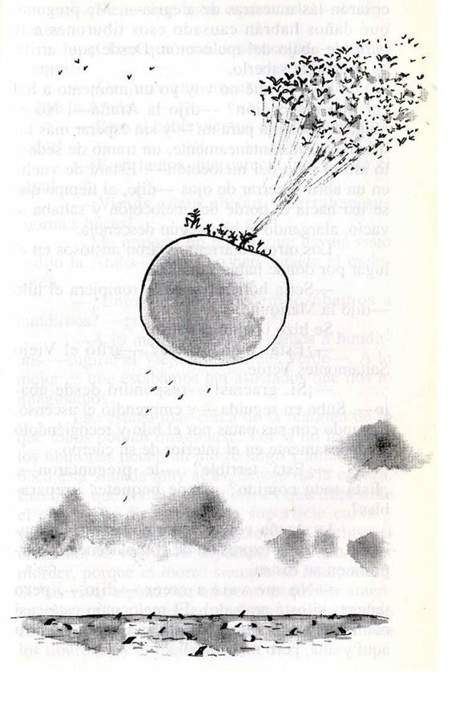

# James and the Giant Peach

Roald Dahl - 1961

**_I read this book in Spanish, so the sentences are written in Spanish. I have added the original English translation of each below._**

Spanish: —¡Lenguas de cocodrilo! —gritó—. ¡Mil largas y viscosas lenguas de cocodrilo cocidas en el cráneo de una bruja muerta, durante veinte días y veinte noches con los ojos de un lagarto! ¡Se añaden los dedos de un mono joven, el buche de un cerdo, el pico de un loro verde, el jugo de un puercoespín y tres cucharadas de azúcar! ¡Se cuece todo durante otra semana, y se deja que la luna haga el resto!

Sin más ceremonias, puso la blanca bolsita de papel en la mano de James y dijo:

—¡Ten! ¡Sujétala! ¡Es para ti!

English: ‘Crocodile tongues!’ he cried. ‘One thousand long slimy crocodile tongues boiled up in the skull of a dead witch for twenty days and nights with the eyeballs of a lizard! Add the fingers of a young monkey, the gizzard of a pig, the beak of a green parrot, the juice of a porcupine, and three spoonfuls of sugar. Stew for another week, and then let the moon do the rest!’

All at once, he pushed the white paper bag into James’s hands, and said, 

‘Here! You take it! It’s yours!’

Spanish: —¡Alegra esa cara, chico, alegra esa cara! —dijo el Ciempiés—. Oye, quieres acercarte y ayudarme a quitarme las botas. Yo solo tardo horas en quitármelas.

English: ‘So cheer up, my boy, cheer up!’ the Centipede said. ‘And meanwhile I wish you’d come over here and give me a hand with these boots. It takes me _hours_ to get them all oll by myself.’

Spanish: ¡Tiene solamente cuarenta y dos! Lo que pasa es que la mayoría de la gente no se toma la molestia de contárselos y se creen lo que él les dice.

English: He’s only got forty-two! The trouble is that most people don’t bother to count them.

Spanish: En ese momento el Ciempiés asomó la cabeza por un agujero del techo, sonriendo, y gritó:

—¡Lo he conseguido! ¡Nos vamos!

—¡Nos vamos! —gritaron los otros—. ¡Nos vamos!

—¡Empieza el gran viaje! —gritó el Ciempiés.

—Quién sabe dónde acabará —murmuró el Gusano—. Siendo cosa tuya, no puede acabar bien.

—Tonterías —dijo la Mariquita—. Estamos a punto de visitar los lugares más maravillosos y ver las cosas más fantásticas. ¿No crees, Ciempiés?

—¡No sabemos lo que veremos! —exclamó el Ciempiés—.

English: Just then, the Centipede stuck his grinning face through a hole in the ceiling and shouted, ‘I‘ve done it! We’re off!’

‘We’re off!’ the others cried. ‘We’re off!’

‘The journey begins!’ shouted the Centipede.

‘And who knows where it will end,’ muttered the Earthworm, ‘if you have anything to do with it. It can only mean trouble.’

‘Nonsense,’ said the Ladybird. ‘We are now about to visit the most marvellous places and see the most wonderful things! Isn’t that so, Centipede?’

‘There is no knowing what we shall see!’ cried the Centipede.

Spanish: —¡Pero por el amor de Dios! ¿Es que estás ciego? —dijo James.

—¡Sabes perfectamente que sí! ¡No tienes por qué andármelo repitiendo! 

—Lo siento —dijo James, apresuradamente—. No era mi intención ofenderte, ¿pero es que no ves que...?

James respiró profunda y lentamente.

—¿Ver? —chilló el pobre Gusano—. ¿Cómo voy a ver si soy ciego?

—¿No te das cuenta de que tenemos comida suficiente para aguantar semanas y semanas? —dijo James, pacientemente.

—¿Dónde? —dijeron los otros—. ¿Dónde?

—¡Pues en el melocotón! ¡Nuestro barco está hecho de comida! 

—¡Por Josafat! —exclamaron—. ¡No habíamos pensado en eso!

English: ‘But good heavens, you must be _blind!_’ said James.

‘You know very well I‘m blind,’ snapped the Earthworm. ‘There’s no need to rub it in.’

‘I didn’t mean that,’ said James quickly. ‘I‘m sorry. But can’t you _see_ that – ’

’_See_?’ shouted the poor Earthworm. ‘How can I see if I am blind?’

James took a deep, slow breath. 'Can’t you _real ize,_' he said patiently, ‘that we have enough food here to last us for weeks and weeks?’

‘Where?’ they said. ‘Where?’

‘Why, the peach of course! Our whole ship is made of food!’ ‘Jumping Jehoshophat!’ they cried. ‘We never thought of that!’

Spanish: ¿Por qué estás tan mustio, Gusano? —preguntó el Ciempiés—. ¿Qué es lo que te preocupa?

—Me preocupa... —dijo el Gusano—, me preocupa..., bueno, me preocupa no tener preocupaciones.

Todos se echaron a reír.

—¡Anímate, Gusano! —le dijeron—. ¡Vamos a comer!

English: ‘What are you looking so worried about, Earthworm?’ the Centipede asked. ‘What’s the problem?’

‘The problem is...’ the Earthworm said, ‘the problem is...well, the problem is that there is no problem!’

Everyone burst out laughing. 

‘Cheer up, Earthworm!’ they said. ‘Come and eat!’ 

Spanish: —Mi querido joven —dijo amablemente el Viejo Saltamontes Verde—. Hay montones de cosas en este mundo nuestro de las que todavía no tienes ni la menor idea. Por ejemplo, ¿dónde crees que tengo los oídos?

—¿Los oídos? Pues supongo que en la cabeza, claro.

Todos se echaron a reír.

—¿Quieres decir que ni tan siquiera sabes eso? —preguntó, sorprendido, el Ciempiés.

—Prueba de nuevo —dijo el Viejo Saltamontes Verde, sonriendo. 

—No puedes tenerlos en otro sitio —dijo James.

—¿No?

—Entonces me rindo. ¿Dónde los tienes?

—Justo aquí —dijo el Viejo Saltamontes Verde—. Uno a cada lado de la barriga.

—¡Eso no es cierto!

—Claro que es cierto. ¿Qué es lo que tiene eso de extraño? Tenías que saber dónde los tienen mis parientes los grillos y los saltamontes americanos. 

—¿Dónde los tienen?

—En las patas. Justo debajo de las rodillas de las patas delanteras.

—Me estás tomando el pelo —dijo James—. No hay nadie que pueda tener los oídos en las patas.

—¿Por qué no?

—Porque... pues porque es ridículo, por eso.

—¿Sabes lo que me parece ridículo a mí? —dijo el Ciempiés, sonriendo sardónicamente, como de costumbre—. Y no te lo digo por mal, pero me parece totalmente ridículo el tener los oídos en la cabeza. Dan un aspecto de lo más cómico. Mírate un día al espejo y compruébalo.

English: ‘My dear young fellow,’ the Old-Green-Grasshopper said gently, ‘there are a whole lot of things in this world of ours that you haven’t started wondering about yet. Where, for example, do you think that I keep my ears?’

‘Your ears? Why, in your head, of course.'

Everyone burst out laughing.

‘You mean you don’t even know that?' cried the Centipede.

‘Try again,’ said the Old-Green-Grasshopper, smiling at James.

‘You can’t possibly keep them anywhere else?’

‘Oh, can’t I?’

‘Well – I give up. Where do you keep them?’

‘Right here,’ the Old-Green-Grasshopper said. ‘One on each side of my tummy.’

‘It’s not true!’

‘Of course it’s true. What’s so peculiar about that? You ought to see where my cousins the crickets and the katydids keep theirs.’

‘Where do they keep them?’

‘In their legs. One in each front leg, just below the knee.’

‘You mean you didn’t know that either?’ the Centipede said scornfully.

‘You’re joking,’ James said. ‘Nobody could possibly have his ears in his legs.’

‘Why not?’

‘Because... because it’s ridiculous, that’s why.’

‘You know what I think is ridiculous?’ the Centipede said, grinning away as usual. ‘I don’t mean to be rude, but I think it is ridiculous to have ears on the sides of one’s head. It certainly looks ridiculous. You ought to take a peek in the mirror some day and see for yourself.’

Spanish: Y como había montones de ellos que siempre le estaban pidiendo que les contara la historia de su aventura en el melocotón, se le ocurrió que quizás fuera interesante sentarse un día a escribirla, para hacer un libro.

Y así lo hizo.

Y es precisamente éste que acabas de leer ahora mismo.

English: And because so many of them were always begging hhn to tell and tell again the story of his adventures on the peach, he thought it would be nice if one day he sat down and wrote it as a book.

So he did.

And _that_ is what you have just finished reading
 [Read:](Read/index.md) [2021](Read/2021.md) [Genre:](Genre/index.md) [Fantasy Fiction](Genre/Fantasy%20Fiction.md) [Juvenile Fiction](Genre/Juvenile%20Fiction.md) [Novel](Genre/Novel.md)